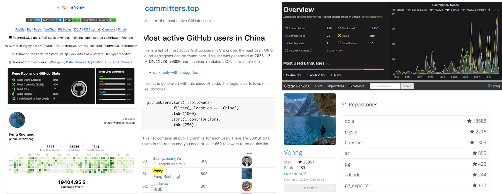
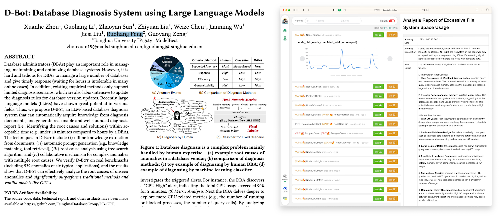
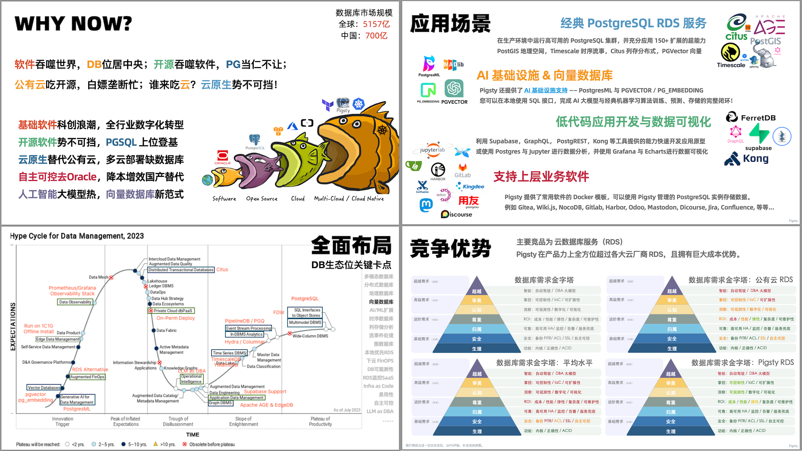
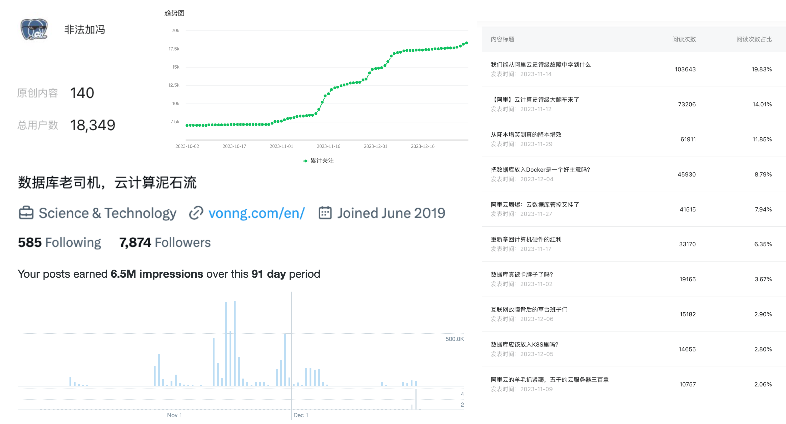
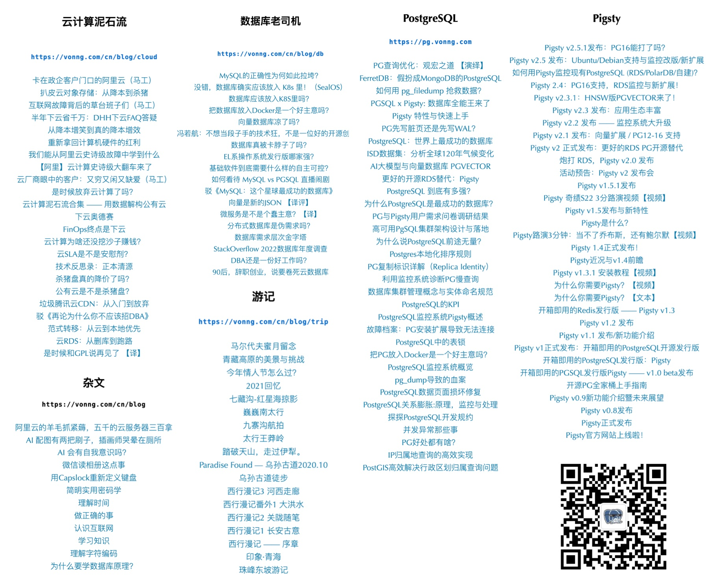
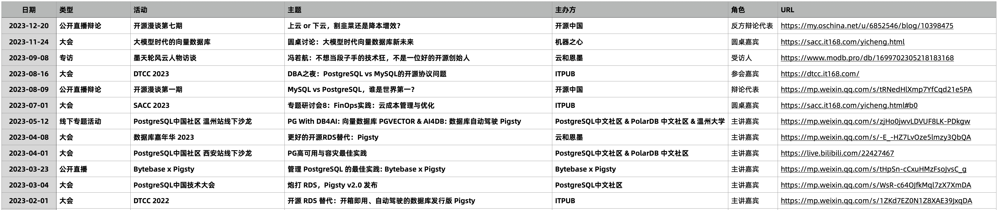

# Thirty and Established

In 2023, I turned thirty. As Confucius said, "At thirty, one establishes oneself." I've managed to accomplish something - started a family, built a career, gained some technical reputation. On the last day of 2023, let me take stock and leave a commemoration.

## Open-Source

GitHub is the spiritual home for 100 million developers worldwide, the world's largest gay dating site. On GitHub, I'm quite an active open source contributor, ranking [81st in China](https://committers.top/china) by activity at the end of 2023, [410th in China](https://wangchujiang.com/github-rank/users.china.html) by followers, and [483rd globally](https://gitstar-ranking.com/Vonng) by star count.

As an open source contributor, my proudest project is [Pigsty](https://pigsty.cc/). It aims to create a batteries-included PostgreSQL distribution, providing a free and open-source RDS alternative - enabling everyone to truly harness the world's most advanced and popular open source database. It lets users own better quality, security, efficiency, and functionality in local database services at 1/10th the cost of cloud RDS hardware expenses!

In this endeavor, I can proudly say Pigsty has performed quite well. In 2023, Pigsty's GitHub stars tripled from 719 at the beginning of the year to 2200. It made it to Hacker News front page, and growth began snowballing. In the [OSSRank open source rankings](https://ossrank.com/cat/368-postgresql-extension?page=2), Pigsty ranks 37th among PostgreSQL ecosystem projects, likely the highest-ranking Chinese-led project, bringing some honor.

In 2023, Pigsty released its second major version with 11 total releases. Previously it only ran on CentOS7, but now covers basically all mainstream Linux distributions. It supports PostgreSQL major versions 12-16, incorporating 150+ extensions from the PG ecosystem. Some extensions not available in official repositories were compiled, packaged, tested, and maintained by me personally. Including Pigsty itself, "based on open source, giving back to open source," it contributes to the PG ecosystem.

Having your own open source project has many benefits - you receive thanks from users, providing tremendous sense of accomplishment and emotional value. Many IDEs, software subscriptions/services, and Copilot services are also free for open source contributors. Another benefit is when others play boring tricks in discussions/debates/comments like "if you think this database/cloud service is bad, who are you to judge? If you're so capable, do it yourself" - I can actually whip it out and slap them in the face, leaving them speechless, haha.

## AI

2023 saw explosive growth in AI large language models, which I followed closely - GPT's emergence made 10x programmers like me square our efficiency, becoming literal One-Man Armies. I'm genuinely interested in AI but didn't want to abandon my core expertise in databases just to chase trends, so I chose to focus on the intersection of databases and AI in **DB4AI** / **AI4DB** areas for research and development.

**DB4AI** refers to databases for AI: In March, I conducted in-depth research, secondary development, and evaluation of [PGVector](https://mp.weixin.qq.com/s/R4jp1uTCiLOLGsiADZ9jxQ), submitting it to the PGDG official repository, helping it become the de facto standard for vector data processing in the PG ecosystem, taking market share from specialized vector databases. I was among the first to integrate AI-related plugins like PGVector and PostgresML into Pigsty, providing vector/AI capabilities for PG services.

**AI4DB** refers to using large models to manage databases: I collaborated with Tsinghua University's database group on a [paper](https://arxiv.org/pdf/2312.01454.pdf) about using large language models to [assist database fault diagnosis](http://dbgpt.dbmind.cn/dashboard), which should appear at next year's VLDB. Because Pigsty already provides the strongest monitoring system and most comprehensive monitoring data in the PG ecosystem, and more importantly is open source, free, and standardized, it can serve as a training ground and arena for LLM as DBA.

## Entrepreneurship

In April 2022, Miracle Plus invested in the Pigsty project, giving me the opportunity to work full-time on entrepreneurship. In 2023, the Pigsty project developed quite well, with stable growth, entering mainstream view with some global recognition. It occupies a quite decent ecological niche, earning a ticket to the PostgreSQL distribution arena.

For myself, this entrepreneurial year brought many joys and some troubles. For various reasons, I was actually the only one doing the work: from technical design and implementation to marketing, promotion, and customer service - becoming the dragon in one-stop service. Fortunately, for the internet/software industry, with the special variable of open source plus GPT assistance, individual heroism remains viable. Investing in R&D and reinventing wheels might not be as effective as deeply integrating existing open source projects. By fully leveraging the open source ecosystem, you can achieve tremendous leverage. Database distributions are exactly this kind of product: their quality mainly depends on the leader's expertise and cognition, and I'm not intimidated on this front.

In product positioning, Pigsty has secured multiple key strategic points, prioritizing user needs while considering investor hype requirements. Since 2023 saw upheaval in capital markets and VC industry, we didn't secure the next funding round. However, in this economic environment, being able to support ourselves while building something people truly need makes fundraising almost irrelevant - not taking money might even be more comfortable.

Projects with ecological niches similar to Pigsty include EDB's CloudNative-PG from the US and OnGres' StackGres from the EU. The former just entered Gartner's database magic quadrant as a PG community leader; the latter received 20M$ from EU sovereign funds. Yet both products' star growth rates are comparable to this solo entrepreneur's.

In PostgreSQL distribution ecological competition, we chose the most reliable/performant/simple bare metal/bare OS deployment, rejecting the trendy [K8S](https://mp.weixin.qq.com/s/4a8Qy4O80xqsnytC4l9lRg) and even [Docker](https://mp.weixin.qq.com/s/kFftay1IokBDqyMuArqOpg) containerization. This indeed created much grunt work adapting different operating systems, but it was the right thing to do, and these efforts became moats: while a bunch of PG Operators compete fiercely, users who crashed out of K8S all benefited Pigsty instead.

Another overlapping competitor is **cloud databases/RDS** - many Pigsty subscription customers self-built because cloud RDS was too expensive. Although public cloud RDS teams might have dozens of people, I'm not intimidated at all. I'm always the one poaching RDS corners, ideologically dominating and writing articles about it. This became recreational entertainment during entrepreneurship - accumulating over twenty high-quality related articles this year, compiled into a "Cloud Computing Mudslide" Cloud-Exit handbook.

## Influence

I started a WeChat public account "[Illegal Addition Feng](https://mp.weixin.qq.com/s/p4Ys10ZdEDAuqNAiRmcnIQ)" in 2018 for fun, mainly sharing PostgreSQL technology, Pigsty news, plus some essays and travel logs, with around 1300 followers at the beginning of this year. I started getting serious this year, writing dozens of articles, and followers multiplied 13x to **18,300**. Twitter followers also multiplied several times to **eight thousand**; plus **twelve thousand** on Zhihu; total followers approaching **forty thousand**, basically covering the entire database circle - quite good for a technical blogger.

Previously, I was an engineer who liked focusing on solid technical work; this year, I added a new hobby of **writing articles**. Because I believe that no matter how good or awesome your technology is, if you can't articulate or promote it, it's wasted. So I started writing articles, outputting my vision, philosophy, and viewpoints. The response has been good this year: mainly two new series "**Database Veteran**" and "**Cloud Computing Mudslide**."

The "Database Veteran" series focuses on my primary professional domain, attempting to set the agenda for the DB technology circle: Is cloud freeloading off open source? Will RDS make DBAs unemployed? Are distributed databases fake demands? PG vs MySQL who's stronger? Do domestic DBs really create bottlenecks? Can vector databases compete? Should databases go in containers? Should databases use K8S? Several topics even had live debate streams with explosive effects. The database field actually has many clichés, stereotypes, outdated dogmas, and emperor's new clothes. One benefit of entrepreneurship is having complete freedom of expression. Not speaking falsehoods or nonsense, believing in common sense's power, telling your own story - you'll find many users share the same resonance, which is quite enjoyable.

"Cloud Computing Mudslide" uses data to analyze and deconstruct public cloud aspects: costs and value of various basic cloud services, SLA promises, business models, profit margins, major incident reviews, future development. Many users were inspired to take their first steps toward independent operations, sharing their excitement and joy with me. Compared to the database main business, advocating Cloud-Exit/self-building is more like entertainment and adventure - and I'm happy to see ideological power transform into real impact - *"Make no little plans; they have no magic to stir men's blood and probably themselves will not be realized. Make big plans; aim high in hope and work."*

Besides writing articles, I occasionally speak at technical conferences, participate in panel discussions, or host live debates. Participating in such activities serves both evangelism and advertising while exercising eloquence and presentation skills, so I'm quite willing to participate.

## Life Journey

On 2023.12.12, at the tail end of thirty, after two years of courtship, my wife and I entered the halls of matrimony. But we've only gotten certificates now - the wedding and reception banquet will wait until next year. Life before and after marriage has been happy - I won't show off here.

In 2023, I also joined TGO, becoming a member of the Kunpeng Association - a tech circle old boys' club that frequently organizes interesting activities. I've met many fascinating friends from various industries - face-to-face collision and communication with high-density smart people always brings joy and abundant harvest.

Physically, working from home made my weight skyrocket again. At 70kg I could solo the Luoke line with full gear, at 80kg I could complete Everest's eastern slope Gama Valley, at 90kg I could finish the Wusun Ancient Trail, at 100kg I can only lie around being lazy. So this year was all leisure travel, with two international trips: July with good buddies to Laos experiencing a week of laid-back life, December with my wife to the Maldives for honeymoon. All very pleasant travel experiences - next year I want to visit Southeast Asia and Japan/Canada.

2024, hoping for good health, harmonious family, thriving career, deeper and broader technology, better and better writing.