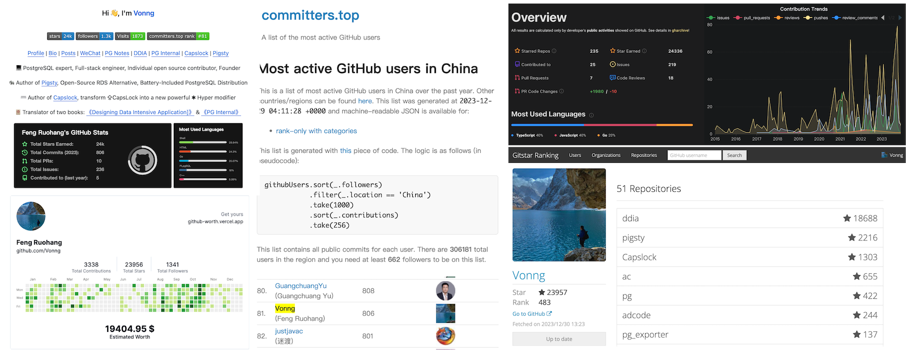
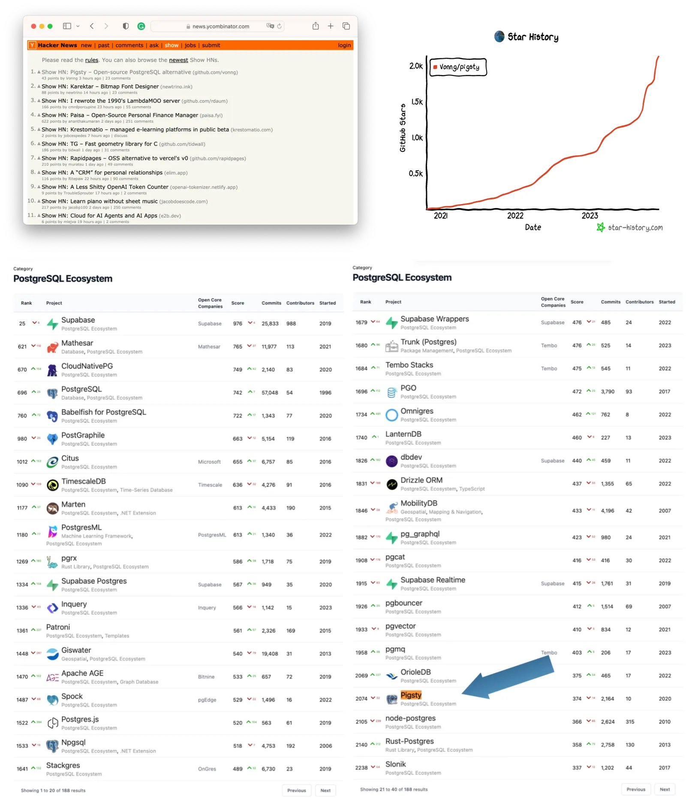
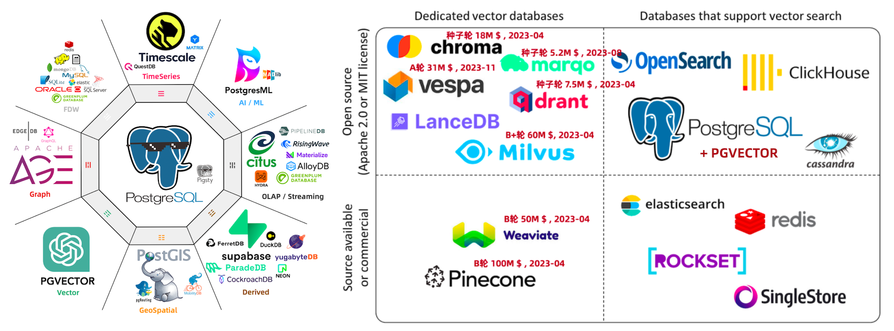
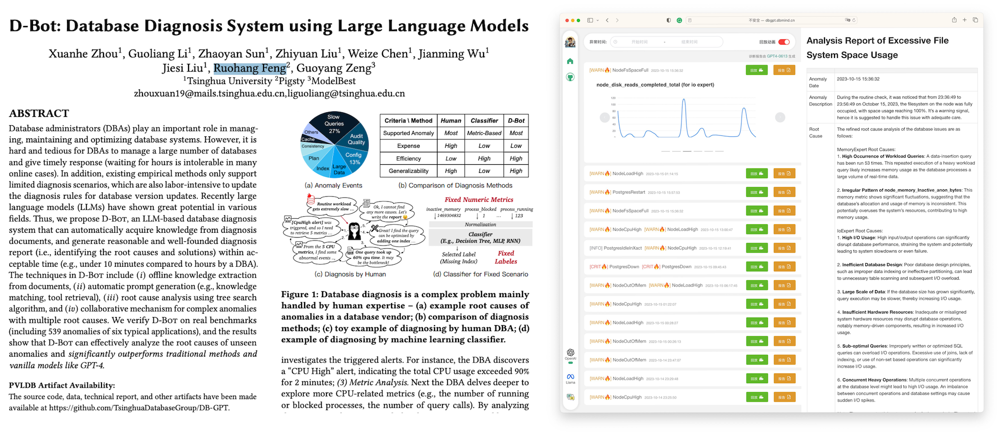
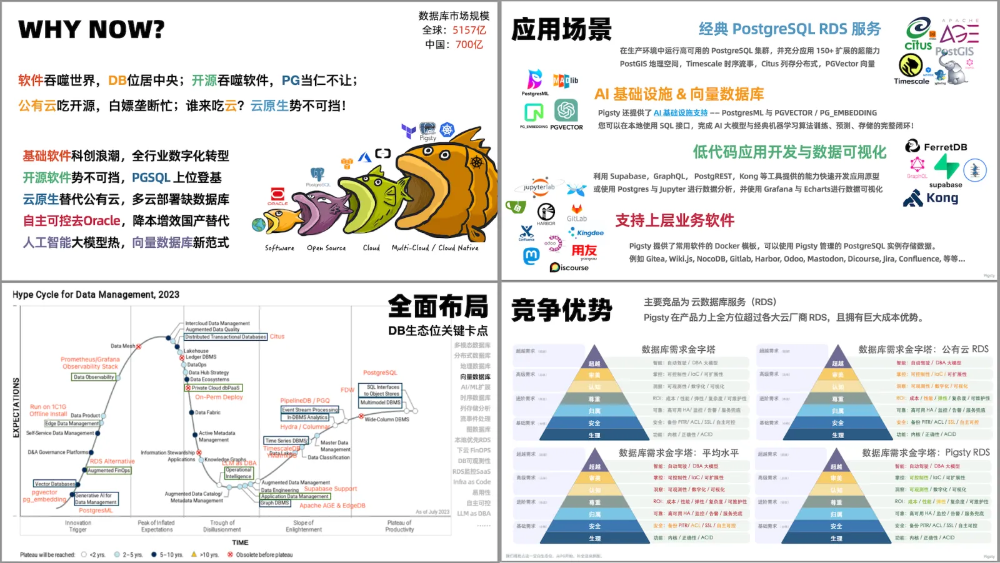
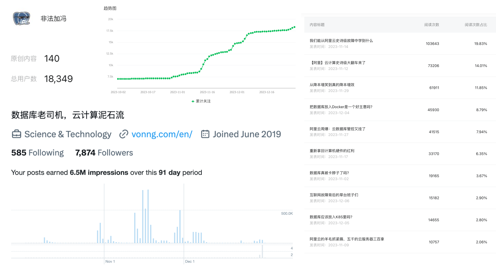
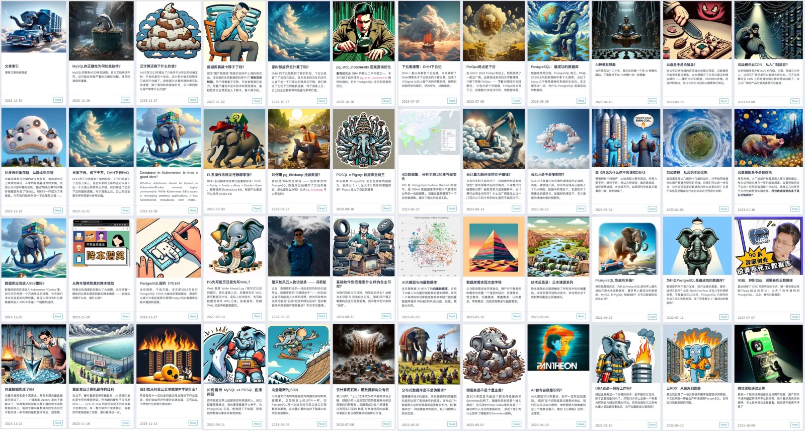
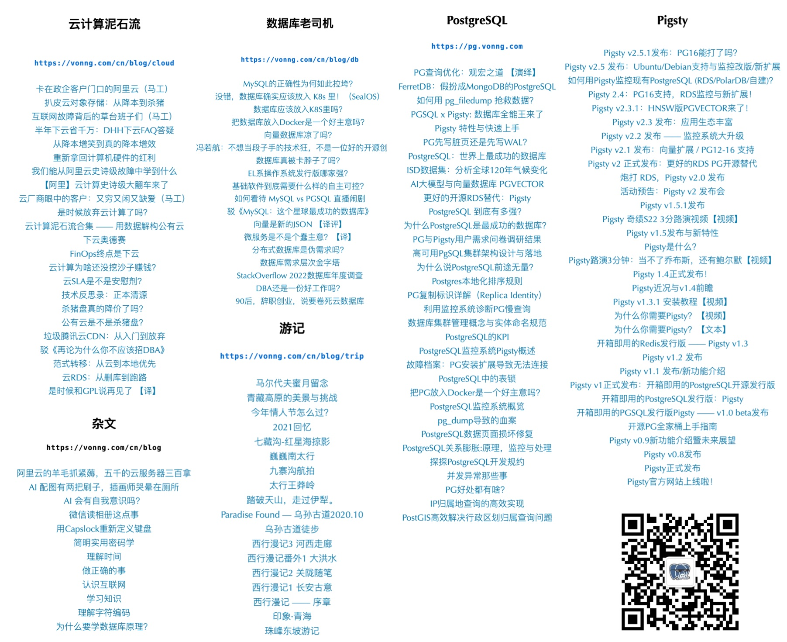
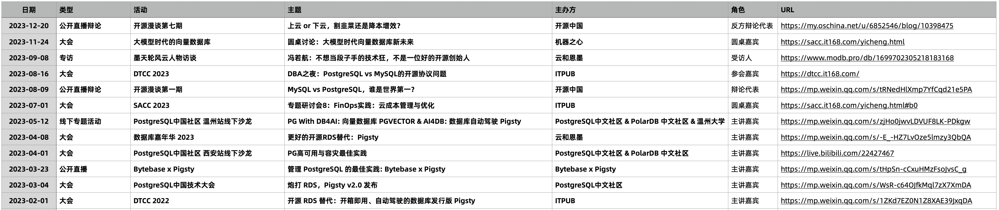

# 三十而立

2023 年，我三十岁。孔子曰：“三十而立”，我也算是搞出了点名堂：成了家，立了业，有了些技术声望。2023最后一天，做个盘点，留个念想。

## 开源

GitHub 是全球一亿开发者的精神家园，全球最大的♂同性交友网站。在 Github 上，我算是一个相当活跃的开源贡献者，在2023年末活跃度排名 [中国区第81](https://committers.top/china)，关注者数排名 [中国区第410](https://wangchujiang.com/github-rank/users.china.html)，Star数排名 [全球排名483](https://gitstar-ranking.com/Vonng)。

作为一个开源贡献者，我最得意的开源项目是 —— [Pigsty](https://pigsty.cc/)。 它旨在为 PostgreSQL 打造一个开箱即用的数据库发行版，提供开源免费的 RDS 替代 —— 让所有人都有能力真正用好这个世界上最先进、最流行的开源数据库。并让用户用云RDS租金 1/10 的纯硬件成本，拥有质量安全效率功能更好的本地数据库服务！

在这件事上，我可以自豪地说，Pigsty 干的确实还不赖。在 2023 年，Pigsty 在 Github 上的 Star 数从年初的  719 翻了3倍增长到 2200；上了 HN 头条推荐，增长开始滚起雪球；在 [OSSRank开源榜单](https://ossrank.com/cat/368-postgresql-extension?page=2) 中，Pigsty 在 PostgreSQL 生态项目中排名第 37 名，在中国人主导的项目里应该是最靠前的了，也算争了点光。

在 2023 年中，Pigsty 发布了第二个大版本，共 11 个 Release。从前它只能跑在 CentOS7 下，现今已经基本覆盖了所有主流 Linux 发行版。支持的 PG 大版本覆盖 12 - 16，收录整合了PG生态中的150+个扩展插件。其中一些官方仓库中没有的扩展，也是我自己编译打包测试维护的。算上 Pigsty 本身，“基于开源，回馈开源”，也算是为 PG 生态做一些贡献。

有自己的开源项目其实好处多多，你能收到许多来自用户的感谢，成就感情绪价值满点。很多 IDE ，软件订阅/服务，Copilot 服务也都对开源贡献者免费开放。另一个作用是，每当别人在讨论/辩论/评论中玩一些无聊的招数 ——  “你觉得这个数据库/云服务不好，你算老几你行你上啊” 的时候；我真的可以把它掏出来糊在对面的脸上，让对面憋不出屁来，哈哈。

## AI

2023 年 AI大模型爆火，我对此保持了密切关注 —— GPT 的出现让俺这样的 10x 程序员效能再翻个平方，成为字面意义上的 One-Man-Army。我确实对AI很感兴趣，但也不想为了凑热点，而放弃自己的老本行数据库，所以选择在数据库与AI的交叉领域 **DB4AI** /  **AI4DB** 进行一些沉淀与研究。

**DB4AI** 指的是给 AI 用的数据库：在三月份，我对 [PGVector](https://mp.weixin.qq.com/s/R4jp1uTCiLOLGsiADZ9jxQ) 进行了深入研究、二开与测评，并将其提入 PGDG 官方仓库，促使其成为 PG 生态处理向量数据的事实标准，抢下了不少专用向量数据库的地盘。并在第一时间将 PGVector 与 PostgresML 这样的 AI 相关插件集成整合入 Pigsty 中，成为第一批提供向量/AI能力的PG服务。

**AI4DB** 指的是如何用大模型来管理数据库：我和清华大学数据库组合作了一篇使用大语言模型[辅助诊断数据库故障](http://dbgpt.dbmind.cn/dashboard)的[论文](https://arxiv.org/pdf/2312.01454.pdf)，应该能在明年 VLDB 上看到：因为 Pigsty 本身已经提供了 PG 生态最强的监控系统与最全面翔实的监控数据，更重要的是开源免费且标准化，因此可以作为 LLM as DBA 的训练营与比武场。

## 创业

2022年4月奇绩创坛投了 Pigsty 项目，让我有机会全职创业做这件事。在 2023 年， Pigsty 项目发展的很不错，有了稳定的增长，已经进入了主流视野中，有了一定的全球知名度。而且占据了一块相当不错的生态位，算是有了一张PG发行版大擂台的门票了。

对我自己来说，创业这一年里有很多开心事，也有不少烦恼。比如因为种种原因，实际上做事的只有我一个人：从技术设计实现到营销推广售后，成为了一条龙服务里的那条龙。好在对互联网/软件行业来说，因为有开源这个特殊变量的存在，再加上 GPT 的加持，个人英雄主义依然是可行的。投入研发土法自研造轮子，极有可能比不上深度整合现有开源项目的效果。只要充分借力开源生态，可以起到四两拨千斤的杠杆作用。数据库发行版就是这样的一种产品：它的好坏主要取决于领军人物的水平与认知，而在这一点上我一点儿也不怵。

在产品定位上，Pigsty 布局了多个关键卡点。优先满足用户的使用需求，兼顾投资人的吹X需求。因为2023年整个资本市场与风投行业都天翻地覆，所以也没融到下一轮。不过在这种经济环境下能养活自己，并扎扎实实做一些人们真正需要的东西，融不融资其实真的也无所谓了，甚至可能不拿钱还更自在一些。

与 Pigsty 生态位比较接近的项目有美国EDB的 CloudNative-PG 与欧盟 OnGres 的 StackGres ，前者是刚进入 Gartner 数据库魔力象限的PG全球社区老大哥；后者是拿了欧盟主权基金20M\$投资的团队；可是这俩产品的 Star 增速也跟俺这个体户也差不多。

在 PostgreSQL 发行版的生态位竞争中，我们选择了可靠性/性能/简单性最佳的裸机/裸OS部署，拒绝了当红炸子鸡 [K8S](https://mp.weixin.qq.com/s/4a8Qy4O80xqsnytC4l9lRg)，甚至都拒绝了 [Docker](https://mp.weixin.qq.com/s/kFftay1IokBDqyMuArqOpg) 容器化，因此在适配不同操作系统上确实给自己增加了很多苦活累活。但这是正确的事情，而这些努力都成为了护城河：一堆 PG Operator 卷的天翻地覆，结果从 K8S 上翻大车掉下来的用户倒是都便宜了 Pigsty。

另一个生态位重叠的竞品是**云数据库/RDS** —— 不少 Pigsty 订阅付费客户都是嫌云上RDS太贵而自建的。虽然说公有云 RDS 团队能有几十号人，但却是一点都不怵。从来都是我去挖RDS的墙角，并在意识形态上骑脸输出，写文章着。这件事也成为了创业过程中的一项休闲娱乐 —— 今年攒下了二十多篇高质量相关文章，编纂成了一套《云计算泥石流》下云手册。

## 影响力

我在2018年弄了个微信公众号《[非法加冯](https://mp.weixin.qq.com/s/p4Ys10ZdEDAuqNAiRmcnIQ)》玩玩，主要分享 PostgreSQL 技术，Pigsty 新闻，还有一些杂文与游记，在年初大概有 1300 左右的关注用户。今年开始折腾起来，写了几十篇文章，关注用户翻了13倍达到了 **18300**。X的关注者也翻了几倍涨到**八千**；加上知乎上的**一万两千**粉；总关注数接近**四万**，基本覆盖了整个数据库圈子，在技术类博主里能算很不错了。

以前，我是一个喜欢踏实搞技术的工程师；今年，我又多了一个**写文章**的新爱好。因为我觉得技术即使做的再好再牛逼，如果讲不出来推不出去，那也是白瞎。所以我也开始写一些文章，输出自己的愿景、理念与观点。一年来反响还不错：主要是两个新的系列 《**数据库老司机**》与《**云计算泥石流**》。

《数据库老司机》系列聚焦在我自己的首要专业领域上，并尝试为DB技术圈设置议程：云是在白嫖开源吗？RDS能让DBA失业吗？分布式数据库是不是伪需求？PG vs MySQL 哪家强？国产DB真卡脖子吗？向量数据库能不能打？数据库该不该放入容器？数据库该不该上K8S？有几个主题还搞了直播辩经，效果相当炸裂。数据库领域其实有许多陈词滥调、刻板印象、过时教条、皇帝的新衣。自己创业的一个好处就是，有着充分的自由进行表达。不讲假话，不讲废话，相信常识的力量，讲出自己的故事，你会发现许许多多的用户都有着一样的共鸣，这是很有乐趣的一件事。

《云计算泥石流》则是用数据剖析解构了公有云的方方面面：各项基础云服务的成本与价值，SLA承诺，商业模式，利润率，大故障复盘，未来的发展。有不少用户受此鼓舞，迈出了独立自主运营的第一步，并向我分享他们的激动与喜悦。比起数据库主业而言，倡导下云/自建的理念更像是一种娱乐与冒险 —— 而我很高兴能看到理念的力量转变为现实的影响 —— *“不要弄些小打小闹的计划，它没有激发人们热血的魔力，本身也可能无法实现。要绘制宏伟蓝图，志存高远，并竭尽所能”。*

除了写文章，我偶尔也会去各个技术大会作作演讲，参加圆桌讨论，或者搞一些直播辩论。参加这种活动一方便可以布道打广告，另一方面也可以锻炼口才与演讲能力，所以我还是比较乐意参加的。

## 人生旅途

2023.12.12，在30岁的尾巴上，经过了两年爱情长跑，我和媳妇走入了婚姻的殿堂。不过现在还只是扯了证，婚礼和答谢宴就留到来年办吧。婚前婚后的生活都很幸福，就不在这儿秀恩爱了。

2023年，我也参加了 TGO，成为了鲲鹏会的会员 —— 这是一个技术圈老男人兄弟会，经常会办一些有意思的活动，我也认识了很多各行各业，很有意思的朋友们 —— 与高密度聪明人们面对面碰撞交流，总是能让人感到愉悦与收获满满。

在身体上，居家办公让我的体重又开始突飞猛进。70公斤的我可以单人重装Solo洛克线，80公斤的可以走完珠峰东坡嘎玛沟，90公斤的我可以走下来乌孙古道，100公斤的我只能躺着犯懒。所以今年都是休闲出游，出国玩了两趟：七月份和好兄弟一起跑去老挝感受一周躺平生活，12月刚刚和老婆一起去马尔代夫度了婚假。都是非常愉悦的旅途体验，明年想去新马泰和日本加拿大玩一玩。

2024 ，希望身体健健康康，家庭和和美美，事业蒸蒸日上，技术更深更广，文章越写越棒

