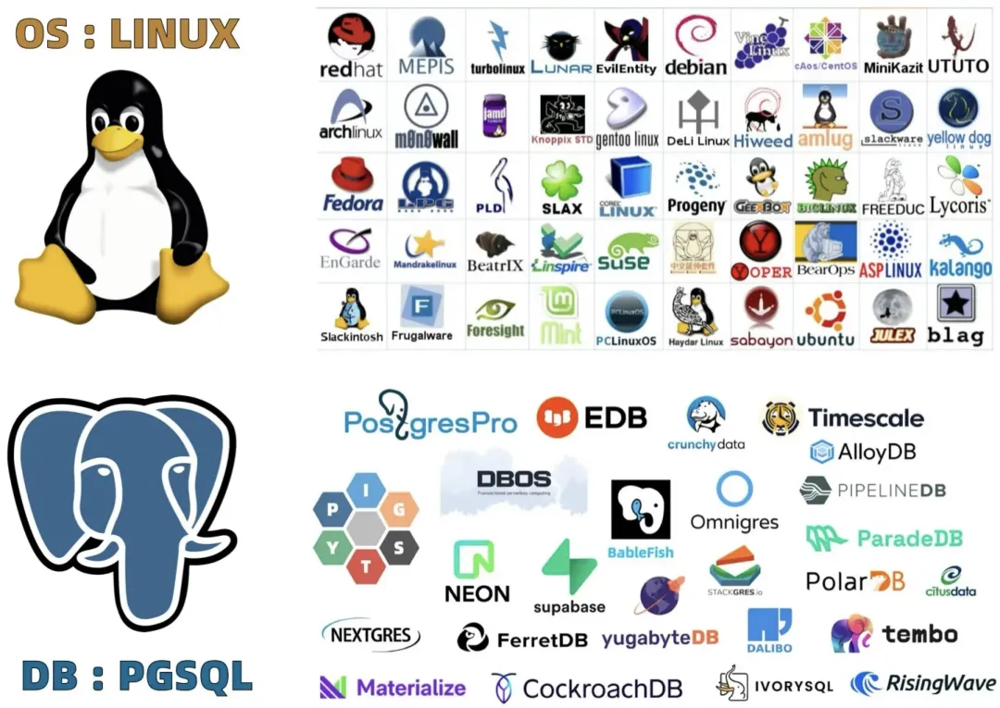
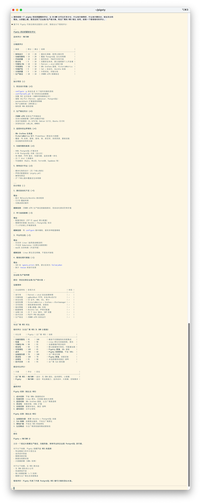
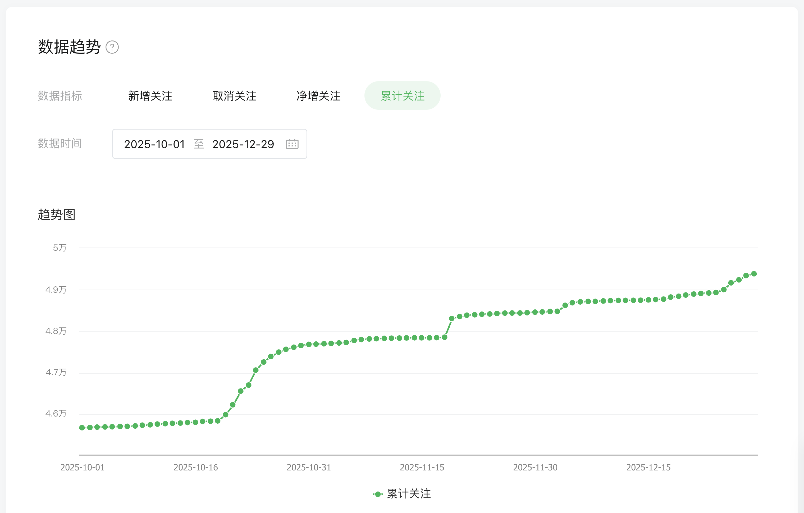
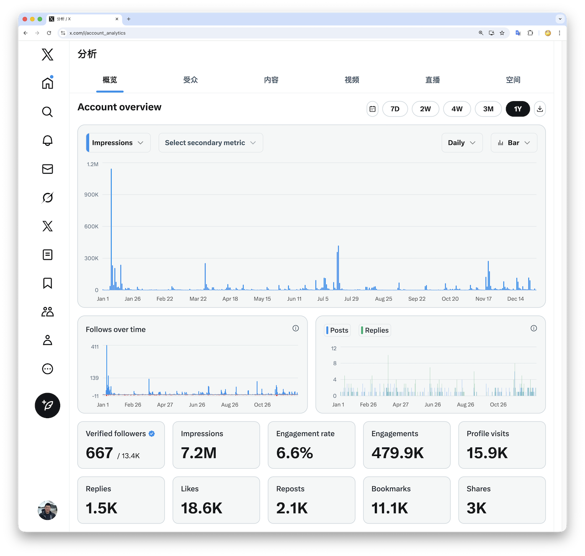
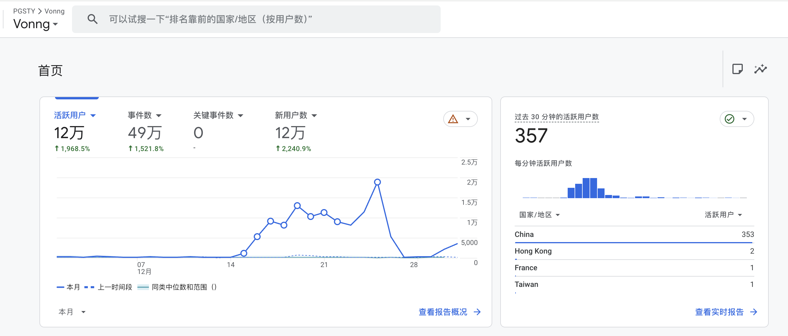
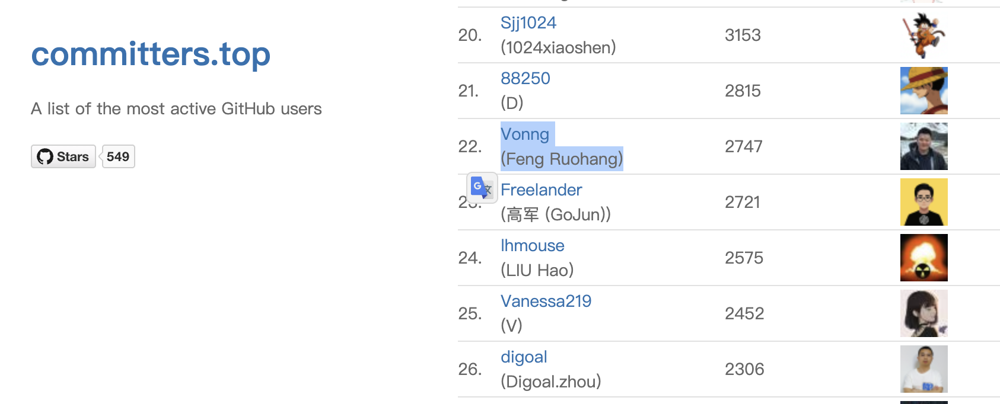
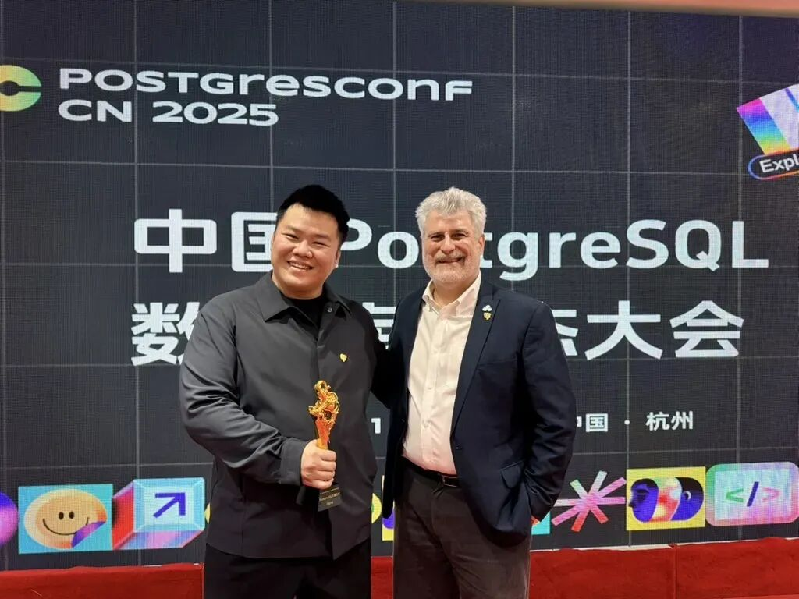

2025 felt unusually long.

Not because it was hard, but because it stood in sharp contrast to the blank, blink-and-you-missed-it feeling of the three pandemic years.
When a year is dense with new information and keeps expanding the boundaries of what you know, it naturally feels longer in retrospect. Looking back, "turning point" is the best description I can find—for both the industry and myself.

## Productivity, Unleashed

What made the year feel so long and full? Above all, the paradigm shift brought by AI.

As I write this, Claude Code is running in the background, reviewing Pigsty module by module while cross-checking, correcting, and translating its documentation site.
I only need to check in every ten or fifteen minutes and dispatch the next batch of work, playing commander.

This is no exaggeration: AI has increased my personal productivity by roughly twentyfold this year.
[Many things I once wanted to do but could not](https://mp.weixin.qq.com/s/51dKs7wR6WCNiNWX5j_gWg) are now projects I can take on calmly—and actually ship.
Coding agents have made one-person companies—and genuinely high-leverage solo operators—practical rather than aspirational.

I feel fortunate to have been relatively free at a moment when both productivity and the organization of work are changing so radically.
I have not had to keep my head down in the old grind. I have had time to look up, see where things are going, and embrace the new direction.

Back in March, when the Model Context Protocol (MCP) suddenly took off, I wrote [*The Claude Code Leak: What's Really Behind MCP's Boom*](https://mp.weixin.qq.com/s/xaeVafPxUfAgQSzl-n3w2w), arguing that Claude Code was the real killer app behind it.
The Chinese tech community barely reacted at the time. Now Claude Code is beginning to reshape how programmers work. Seeing that prediction borne out excites me even more than the technical progress itself.

## Where the Odds Are

AI may be white-hot, but I did not rush to join the agent gold rush. My reasoning was simple: no matter how capable an agent is, it still needs memory.
The step from simple, filesystem-based tasks to complex ones depends on using databases well. Instead of prospecting for gold, I would rather build the picks and shovels: solid database infrastructure.

As Andy Pavlo and Mike Stonebraker wrote in their [*2025 Year in Databases*](https://mp.weixin.qq.com/s/T0bhdoMSXuEIUzud4SKRLw), this was a banner year for PostgreSQL.
After a series of landmark acquisitions and mergers, PostgreSQL has won the open-source database war. The question is no longer "Which database?" but "Which flavor of PostgreSQL will win the future?"

That is the question Pigsty aims to answer.

A few years ago, I might have doubted that one person could build a mainstream database distribution. With AI in the picture, I now think it is entirely feasible.
The next two years will be critical. Pigsty has both the opportunity and the ability to make a serious run at becoming [a PostgreSQL distribution for the world](https://mp.weixin.qq.com/s/kYl31hRXDvE65i_eewJ68A).

## Pigsty's Progress

Now for the project itself. Pigsty's GitHub star count reached 4,448 by the end of the year.
Based on unique visitors to the website and download figures, I estimate that its user base is now on the order of 100,000.

Supabase, the industry's current darling, is valued at $5 billion and has a user base roughly twenty times larger.
But Pigsty has neatly made room for Supabase in its own stack, becoming a "meta-distribution" for it.

What pleases me even more is that Pigsty, a wholly independent one-person open-source project, now has [more influence in the global PostgreSQL ecosystem than any of the heavily funded PostgreSQL forks built by major tech companies](https://mp.weixin.qq.com/s/kYl31hRXDvE65i_eewJ68A).
It shows that **communities vote with their feet, and good tools take on lives of their own**.

[pigsty-star-rank.webp](pigsty-star-rank.webp)

Pigsty shipped ten releases this year, laying the groundwork for the upcoming v4.0.
After repeated rounds of review and cleanup by Claude, its code-quality score has reached about 90, ahead of RDS and finally at a level I am happy with.

After v4.0, my focus will shift to database and DBA agents. The logic is straightforward: as infrastructure—a self-hosted RDS—Pigsty has already automated 80% of a DBA's work.
For the remaining 20%, I plan to turn my documentation and accumulated expertise into Skills for Claude, then automate 90% of what remains.
[That could make the industry tens of times more productive and finally make expert knowledge scalable](https://mp.weixin.qq.com/s/W1hwbl3qmjC4Dcmadc8uSg).

I also made another decision: I moved Pigsty's core—the PostgreSQL high-availability cluster and 440-plus extensions—from AGPLv3 back to the permissive Apache 2.0 license.

Why? Because one thing has become clear to me: in China, selling a "**commercial edition of open-source software**" often does not work—especially when the open-source version is already good enough and you refuse to cripple it just to create product tiers.

In the end, what enterprise customers are actually willing to pay for is the expertise I bring.
If that is the case, I may as well be generous: let open source be open source, and give the software to the community and the world.
Then I can make an honest living from professional consulting, on the strength of the work itself.

Pigsty's extension repository, [PGEXT.CLOUD](https://mp.weixin.qq.com/s/oHHzhbbt5suSxnJhyxTwQQ), has also become an upstream source for several peers overseas.
Being reused and trusted by others in the field is valuable in its own right—and a genuine first step into the global market.

## Speaking Freely

My WeChat Official Account grew from 36,000 followers to nearly 50,000 this year. Advertisers approach me every day, but I still take no sponsorships.

The freedom to say exactly what I think is a luxury worth paying for. I do not want to dilute it, and I want the confidence that comes from owing no one anything.
Whether I am writing about database vendors or cloud giants, I publish only views I actually believe.

A few days ago, for example, I wrote [*Did RedNote Exit the Cloud?*](https://mp.weixin.qq.com/s/Dr6zsb8aBJ9CMuei2Bd0VA) about the Chinese social platform Xiaohongshu, known internationally as RedNote.
Alibaba Cloud issued an official "debunking," and my friend behind the *Swedish Coder* WeChat account even [published a piece teasing me about it](https://mp.weixin.qq.com/s/UXwNjcTgS1yESWbxXuxQUg).
The episode was noisy, but it demonstrated something real: one person's voice can be heard, and can even carry some weight. It also reminded me that if I want to stay sharp, I must be more rigorous and thorough as well.

WeChat is not my only outlet. My posts on X (Twitter) received 7.2 million impressions over the past year, and I have begun to build a meaningful presence in the English-speaking community.

My open-source projects, documentation sites, and Chinese translation of *Designing Data-Intensive Applications* added nearly 3 million page views. By a rough count, my work reached people more than 10 million times across the internet this year.

Good content has a long half-life. Two weeks ago, I merely cleaned up my personal website; 120,000 visitors promptly showed up and generated 500,000 page views.
In an age obsessed with traffic, it was another reminder that if your work is substantive and sincere, people will find it.

## Open Source and Life

I enjoy writing essays, but code is closer to pure joy. Passion remains the greatest productivity multiplier.

I kept up my "nuclear-powered workhorse" pace on GitHub this year. My projects have earned more than 30,000 stars in total, and I ranked No. 22 among active contributors in China.

Beyond Pigsty, I continued maintaining China's PGDG package mirror and fixed dozens of PostgreSQL extensions. That work earned me the "PostgreSQL Magneto" award at the China PostgreSQL Ecosystem Conference.
I also received the [Shanghai Open Source Innovation Elite Award](https://mp.weixin.qq.com/s/9kpLDrF-bGskmmUMucfWoA), along with several others.

What I am proudest of, though, was [speaking to the global PostgreSQL developer community](https://mp.weixin.qq.com/s/rZ4lcsdld1_Fxck77KRIvw).
It showed me a wider world—and gave that wider world a chance to see me.

Of course, life is more than code.

This fall, a transition in my wife's work gave us an opening, so we spent a month or two [road-tripping through Xinjiang and western Sichuan](https://mp.weixin.qq.com/s/ABcq-2Pv19Qwo1zznFgTwQ).
At such a pivotal moment for the industry, time felt especially scarce. But life is ultimately about what you experience—especially time spent with the person you love.

The days on the road—the snowcapped mountains, grasslands, and blizzards—became the softest and most human backdrop to an otherwise intensely technical 2025.

