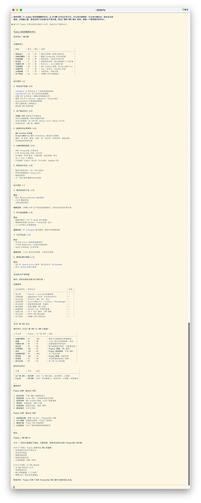
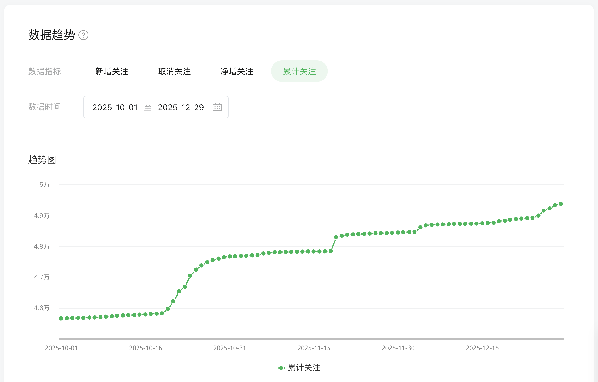
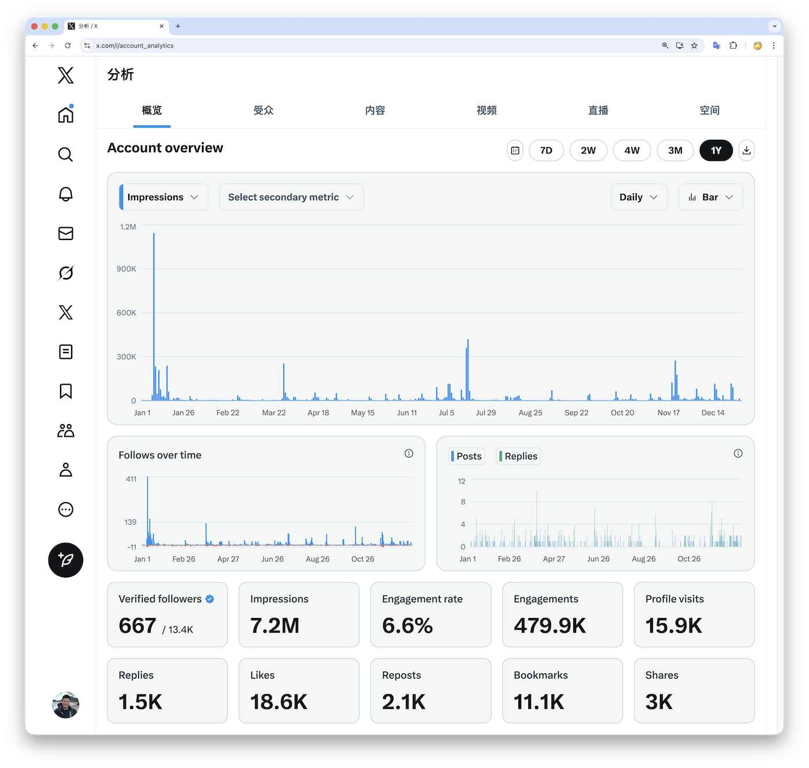
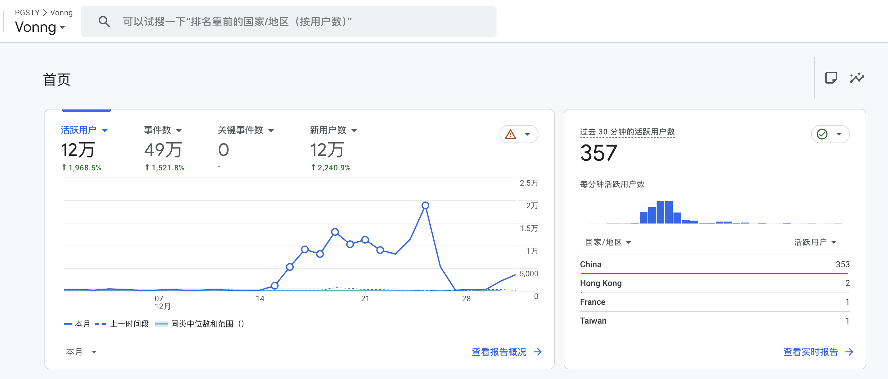
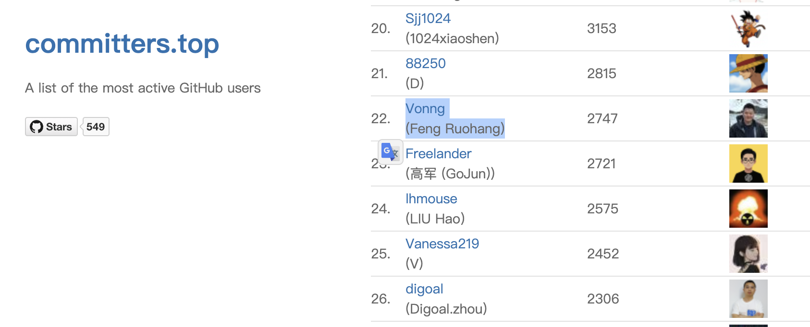

2025 年给我的感觉格外漫长。

这种漫长并非因为难熬，而是与疫情三年那种“晃眼而过”的空白感形成了鲜明对比。
当一年的信息密度极大、认知边界被不断拓宽时，时间在精神感受上会被自然拉长。回顾这一年，用“转折”来形容最为贴切——无论是对行业，还是对我个人。

## 关于生产力的解放

为什么会有这种“漫长”的充实感？核心原因在于 AI 带来的范式转移。

就在写下这段文字的同时，Claude Code 正在后台逐个模块地 Review Pigsty 的代码，并在同步核对、修正及翻译文档站点。
我只需要每隔十几分钟看一眼，像指挥官一样分派下一阶段的任务就好了。

不夸张地说，得益于 AI，老冯今年的个人生产力提升了约二十倍。
[许多过去有心无力的事情](https://mp.weixin.qq.com/s/51dKs7wR6WCNiNWX5j_gWg)，现在都能从从容容，游刃有余的尝试与实现。
Coding Agent 确实让“一人公司”与“超级个体”从理想照进了现实。

老冯很庆幸，在这个生产力与生产关系大变革的关口，我处于一种相对自由的状态
—— 不用在旧有的循环中埋头苦干，而是有时间抬头看路，去拥抱新的趋势。

早在今年3月 MCP 协议爆火时，我就写过文章《[Claude Code 泄密：MCP 爆火的隐藏真相](https://mp.weixin.qq.com/s/xaeVafPxUfAgQSzl-n3w2w)》指出 Claude Code 才是其背后的“大杀器”。
当时中文互联网对此反应寥寥，直到今天，它真正开始重塑程序员的工作流。这种预判的验证，比单纯的技术进步更让我感到兴奋。

## 关于行业的“赢面”

虽然 AI 极热，但我并没有去凑 Agent 的热闹。我的判断很朴素：Agent 再强也需要记忆。
从简单的文件系统进化到处理复杂任务，关键一步就是“用好数据库”。与其去淘金，不如踏实地做铲子，铺好数据库这条路。

正如 Andy 和 Stonebraker 在《[2025年度数据库世界总结](https://mp.weixin.qq.com/s/T0bhdoMSXuEIUzud4SKRLw)》中所言，今年是 PostgreSQL 的大年。
随着一系列标志性的收购与并购，PostgreSQL 在开源数据库的战争中已经胜出。现在的问题不再是“选什么数据库”，而是“哪一种风味的 PostgreSQL 能赢得未来”。

这正是 Pigsty 要回答的问题。

放在几年前，我对于 “一个人能否做一个主流数据库发行版” 或许还会疑虑；但放在今天，有了 AI 的加持，我觉得这完全可行。
未来的两年至关重要，Pigsty 有机会，也有能力去挑战成为一个《[面向世界的 PG 数据库发行版](https://mp.weixin.qq.com/s/kYl31hRXDvE65i_eewJ68A)》。

## 关于 Pigsty 的进展

聊聊项目进展。Pigsty 的 GitHub Star 数从年初增长到了今天的 4448。
从官网 UV/下载量数据推测，用户规模已达 10 万量级。

虽然这个数字和行业里的当红炸子鸡（如估值 50 亿美金的 Supabase）相比还有差距（20x），
但有趣的是，Pigsty 在生态位上巧妙地兼容了 Supabase，成为了它的“元发行版”。

更让我欣慰的是，作为一个纯粹的独立个人开源项目，
Pigsty 在全球 PG 生态中的影响力，[超过所有大厂重金投入的 PG Fork 项目](https://mp.weixin.qq.com/s/kYl31hRXDvE65i_eewJ68A)。
这说明，**社区的选择是诚实的，好的工具自带生命力**。

[pigsty-star-rank.webp](pigsty-star-rank.webp)

今年 Pigsty 发布了 10 个 Release 版本，为即将到来的 v4.0 做了充分铺垫。
在这个版本中，代码质量经由 Claude 轮番扫描优化，评分已达 90 分水准，超过 RDS，达到了一个我自己也比较满意的状态。

而在 v4.0 之后，我的重心将转向 DB/DBA Agent。逻辑很简单：Pigsty 已经作为基础设施（RDS）自动化了 DBA 80% 的工作；
剩下的 20%，我计划通过将知识文档转化为 Skills 喂给 Claude，再自动化掉其中的九成。
[这将为行业带来数十倍的杠杆效应，让专家经验真正规模化](https://mp.weixin.qq.com/s/W1hwbl3qmjC4Dcmadc8uSg)。

另一个决定是：我将 Pigsty 主体（PG 高可用集群、440+ 插件）的许可证从 AGPLv3 切换回了宽松的 Apache 2.0。

为什么这么做？因为我看清了一件事：在中国，卖 “**开源软件商业版**” 往往走不通 —— 
特别是当你把开源的东西做的足够好，又不想阉割功能做区分的时候。

说到底，企业用户最后真正愿意买单的，还是老冯独特的专业经验。
既然如此，不如大方一点，让开源回归开源，把它作为礼物送给社区与世界。
—— 自己扎扎实实，名正言顺靠专业咨询挣钱。

目前，Pigsty 的扩展仓库（[PGEXT.CLOUD](https://mp.weixin.qq.com/s/oHHzhbbt5suSxnJhyxTwQQ)）也已成为几家海外同行的上游。
能被更多人复用，被同行所信赖，这本身就是一种价值，也是走向海外从零到一的突破。

## 关于表达与自由

老冯的公众号今年从 3.6 万关注涨到了近 5 万。虽然每天都有广告商单找上门，但我依然保持了“零接单”。

因为自由表达本身就是一种昂贵的乐趣。我不希望这种乐趣掺杂杂质，更希望保持一种“不看任何人脸色”的底气
—— 无论是面对数据库厂商还是云巨头，我只输出我认可的观点。

就好比，前几天写了篇《[小红书下云](https://mp.weixin.qq.com/s/Dr6zsb8aBJ9CMuei2Bd0VA)》，
引来了阿里云官方下场“辟谣”，甚至我的朋友瑞典马工也专门 [撰文调侃](https://mp.weixin.qq.com/s/UXwNjcTgS1yESWbxXuxQUg)。
这件事虽有些喧嚣，但也从侧面印证了一个事实：个体的声音也会被听见，甚至具有了某种分量与影响力。
这提醒我在保持犀利的同时，也需更加严谨周全。

当然，老冯也不仅仅在公众号上折腾。在 X（Twitter）上，过去一年我也获得了 720 万的展现量。在英文社区中也开始积累起来可观的影响力。

如果算上各种开源项目、文档站、以及 DDIA 翻译站，这一块加起来也有接近 300 万的 PV。粗略算下来，今年老冯输出的内容，在全网产生了超过一千万次的触达。

这些数字背后，是优质内容长久的生命力。比如两周前，老冯仅仅是修缮了一下个人网站，竟然一下子涌入了 12 万访客，带来了 50 万 PV。
在这个流量焦虑的时代，这再次证明了一件事：只要你的内容足够硬核、真诚，总是会有人来看的。

## 关于开源与生活

相比写文章，写代码更像是我快乐的源泉，热爱是最大的生产力。

这一年，我在 GitHub 上的活跃度依然保持在“核动力驴”的状态，在 GitHub 上 Star 总数超过了3万，中国区域活跃贡献者 No.22。

除了 Pigsty，我还维护了中国区的 PGDG 镜像，修复了几十个 PG 扩展，并因此在中国 PG 生态大会上拿了个“万磁王”的奖。
还有 [上海开源创新菁英奖](https://mp.weixin.qq.com/s/9kpLDrF-bGskmmUMucfWoA) 还有其他几个奖。

不过我最自豪的还是，今年[去全球 PG 开发者社区演讲的经历](https://mp.weixin.qq.com/s/rZ4lcsdld1_Fxck77KRIvw)，
也让我看到了更广阔的世界，并被更广阔的世界所看见。

当然，生活不只有代码。

今年秋天，趁着家属工作变动的间隙，我们去 [新疆和川西自驾了一两个月](https://mp.weixin.qq.com/s/ABcq-2Pv19Qwo1zznFgTwQ)。
在这个行业剧变的节点，时间虽然宝贵，但我觉得人生更重要的是体验，尤其是和爱人一起度过的时光。

那些在路上的时刻，雪山、草原与风雪，构成了 2025 年硬核技术之外，最柔软也最真实的底色。

