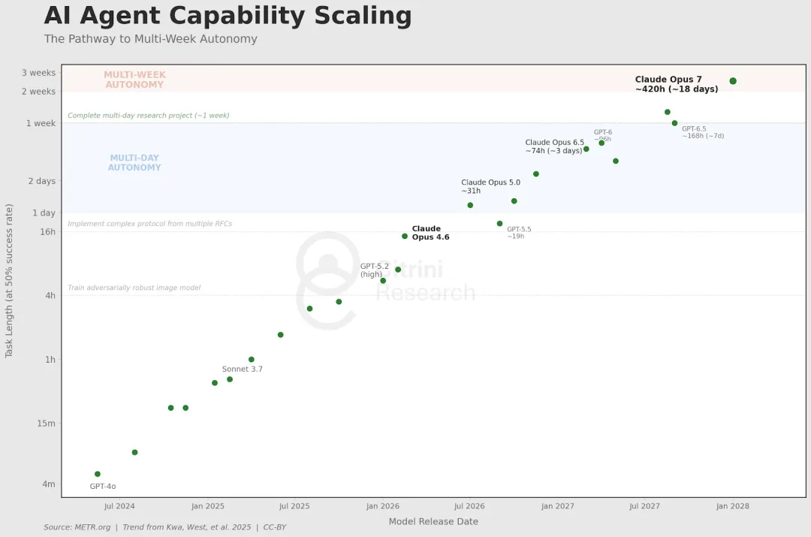
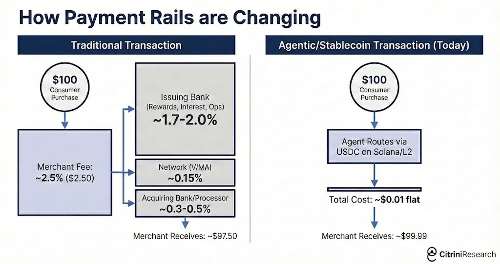
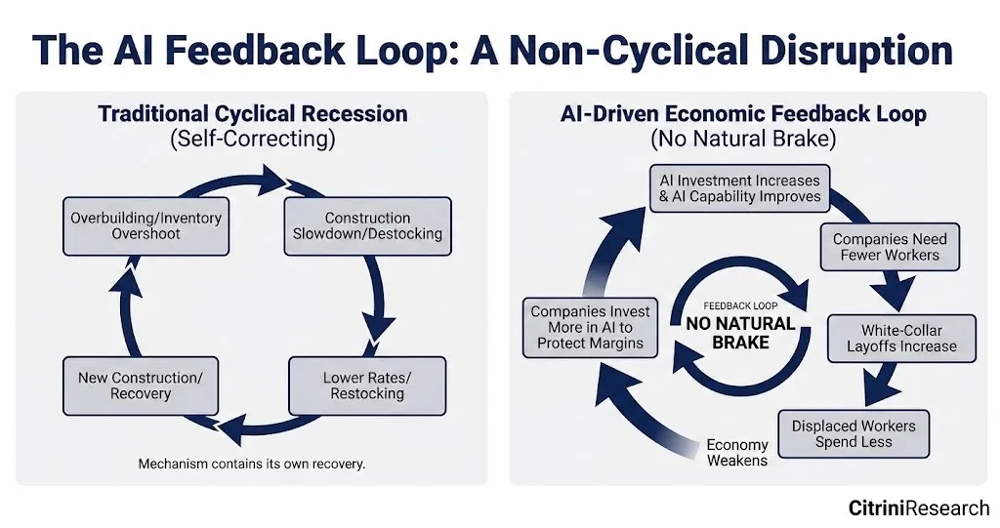
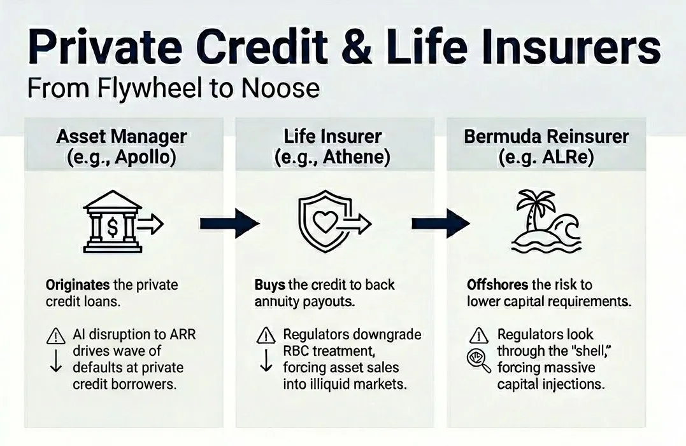
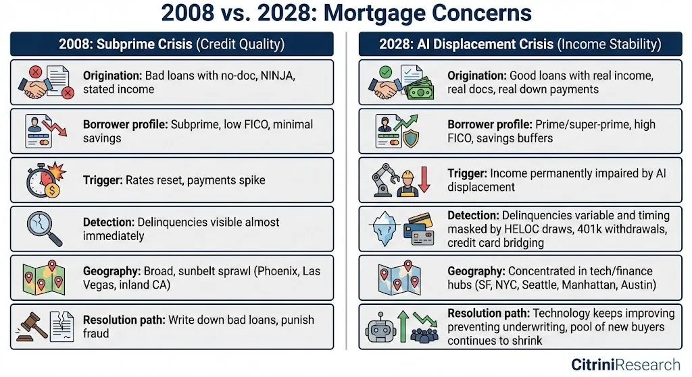
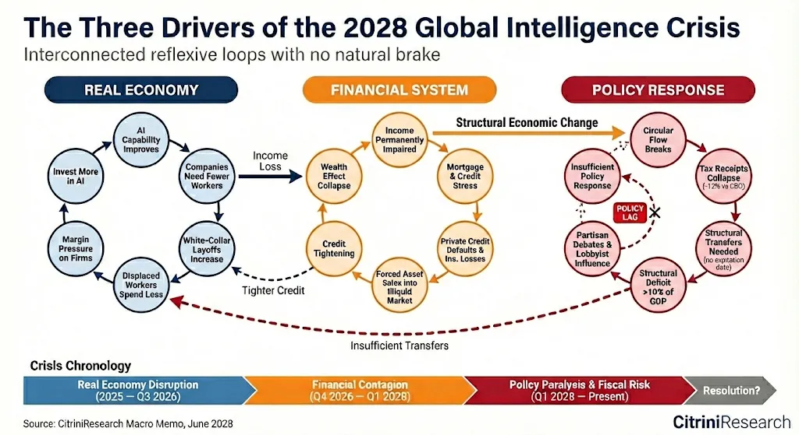

> Authors: Citrini and Alap Shah  
> Translator / adaptation: vonng  
> Original: [The Global Intelligence Crisis](https://open.substack.com/pub/alapshah1/p/the-global-intelligence-crisis?r=1g6uar&utm_campaign=post&utm_medium=web&showWelcomeOnShare=true)

Yesterday this piece reportedly pulled more than twenty million views on X and may even have helped trigger the software-stock shakeout that followed. A thought experiment that looks back from "two years in the future" is useful because it forces one uncomfortable question:

### A financial-history thought experiment from the future

**February 22, 2026**

## Preface

What if the bullish case on AI is basically right, and that is precisely the problem?

This is not a prediction. It is a scenario model. The point is to think through a left-tail risk that still feels under-discussed: AI works, productivity soars, but the economic plumbing built around scarce human intelligence starts to crack.

## Macro Memo

## The price of abundant intelligence

Imagine a June 2028 memo from CitriniResearch. Unemployment prints 10.2%. The S&P 500 is down 38% from its 2026 peak. Six months earlier, a number like that would have triggered panic. Now traders barely blink.

What changed was not that AI disappointed. AI over-delivered. Productivity soared. Companies replaced salaried knowledge workers with agents that do not sleep, take sick leave, or ask for health insurance. Compute owners got richer. Wage growth collapsed.

When output keeps rising but households stop participating in that flow, commentators invent phrases like **Ghost GDP**: production shows up in national accounts but never really circulates through the human economy.

That is the core premise of the essay. The market may love abundant machine intelligence. The economy built around scarce human intelligence may not.

## Origin

The story begins with agentic coding.

Once competent developers can reproduce the core functionality of a mid-market SaaS product in weeks, CIOs start asking a destabilizing question: **what if we build it ourselves?**

That does not mean every internal build wins. It does mean that software pricing power changes immediately. Renewal negotiations soften. Feature differentiation erodes. Long-tail SaaS vendors lose the ability to charge as if implementation friction still protected them.

The old mental model of disruption does not quite fit. Incumbents are not slowly dying while refusing the new technology. They are cutting staff and buying even more AI because they cannot afford not to.

That produces a vicious loop:

- layoffs improve margins in the short term,
- the savings buy more AI capability,
- the new capability justifies the next round of layoffs.

## When friction goes to zero

By early 2027, large language models are simply part of everyday consumption. Many users do not even think in terms of "agents" anymore. Their phones and laptops just negotiate, compare, cancel, and rebalance on their behalf.

That is where the essay introduces one of its sharpest ideas: a large share of the modern consumer economy is really a **rent-extraction layer built on human friction**. We overpay because we are tired, impatient, distracted, or too busy to comparison-shop.

Once agents start doing that work continuously, business models built on convenience spreads begin to weaken all at once.

This is why the piece treats agentic commerce as more than a product story. It becomes an infrastructure story. Payment rails, marketplaces, and subscription businesses all start to feel the pressure of machine-mediated demand.

## From industry risk to systemic risk

The next step is labor.

Dismissed white-collar workers do not vanish. They step down the wage ladder. Former software PMs drive for Uber. Former analysts fight for lower-paid service jobs. That floods the remaining labor-intensive sectors with educated workers and compresses wages there too.

Now the problem is no longer "software is under pressure." It becomes "household income expectations across the upper half of the consumption stack are deteriorating."

That matters because upper-income households drive a disproportionate share of discretionary spending. Their unemployment arrives later than a blue-collar downturn, but its consumption impact is deeper once savings buffers begin to run down.

In a normal recession, central banks and investors assume jobs eventually return in recognizable form. In this scenario, that assumption itself is what breaks.

## The intelligence-replacement spiral

The essay names the core loop the **human intelligence replacement spiral**:

- AI capability rises
- firms need fewer workers
- displaced workers consume less
- weak demand pressures profits
- firms buy still more AI

That loop is bad enough in the real economy. It becomes worse when finance starts to notice.

## The dominoes of linked bets

Private credit is where the essay turns from provocative to genuinely unsettling.

Over the previous decade, software and tech deals had been financed on the assumption that recurring revenue would remain recurring. Once agentic tools undermine pricing power, those assumptions stop making sense, even if the books do not update immediately.

The scenario then moves into the insurance-private-credit complex: annuity liabilities, offshore reinsurance, affiliated vehicles, and balance sheets all leaning on the same underlying thesis that white-collar income keeps compounding.

If those loans start to sour, the question is not just how large the losses are. The real question is **where they actually sit**.

The same logic then spills into housing. The mortgage itself may have been perfectly sound when originated. The borrower had the credit score, the income, the down payment, and the stable job.

Then the world changed.

That is the essay's key distinction from 2008. The loan was not bad on day one. It became vulnerable because the income stream underwriting it was structurally repriced after origination.

If premium white-collar households begin to doubt their own 30-year earning trajectory, then "safe" mortgages in tech-and-finance-heavy regions stop looking as safe as models once assumed.

## Racing the clock

By this point the scenario has two feedback loops:

- a real-economy loop driven by labor replacement and consumption weakness,
- a financial loop driven by private-credit marks, insurance balance sheets, and housing stress.

Traditional policy tools can treat the financial engine more easily than the real one. Lower rates can stabilize credit. They cannot make human cognitive labor scarce again.

That creates a fiscal problem too. The state taxes human work. But the more output shifts from labor to compute and capital, the less that tax base behaves the way twentieth-century institutions expected.

So government faces the worst possible combination: it needs to transfer more money to households exactly when its old revenue spine is weakening.

## The collapse of the intelligence premium

The deepest idea in the essay is simple: modern economic institutions were built for a world where **human intelligence was scarce**.

Capital could be copied. Natural resources could be substituted. Technology advanced slowly enough for labor markets to adapt. But analysis, judgment, coordination, persuasion, and creative problem-solving remained expensive because people remained expensive.

The crisis imagined here is what happens when that premise stops holding.

That does not automatically mean civilizational collapse. The essay is careful on that point. Repricing is not the same thing as annihilation. A new equilibrium may still emerge.

But getting there would require new frameworks for taxation, transfer payments, political legitimacy, and the ownership of AI-era productive infrastructure. That is the real policy challenge.

The piece ends with a reminder worth keeping:

We are not actually in June 2028. We are still in early 2026. The negative spiral has not fully started. There is still time to examine which assumptions in our portfolios, institutions, and personal plans quietly depend on human intelligence remaining scarce for another decade.

The canary is still alive.
