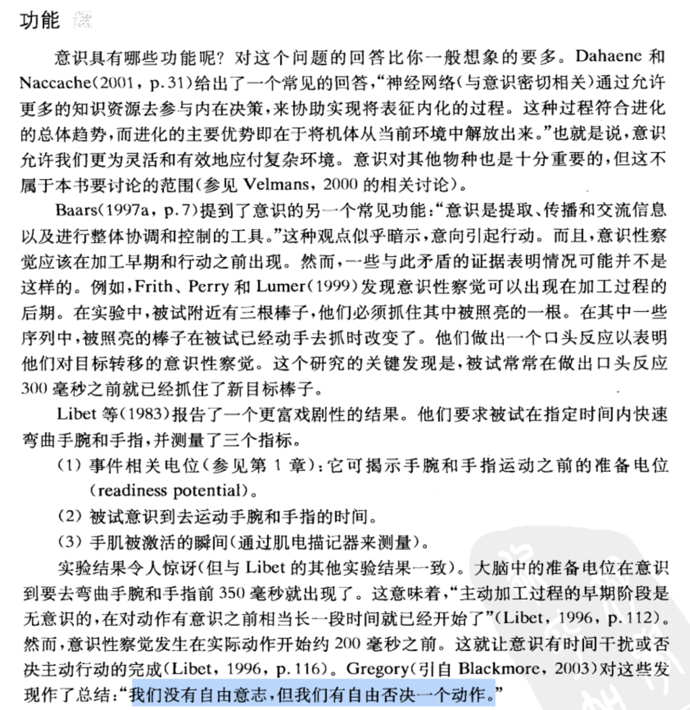
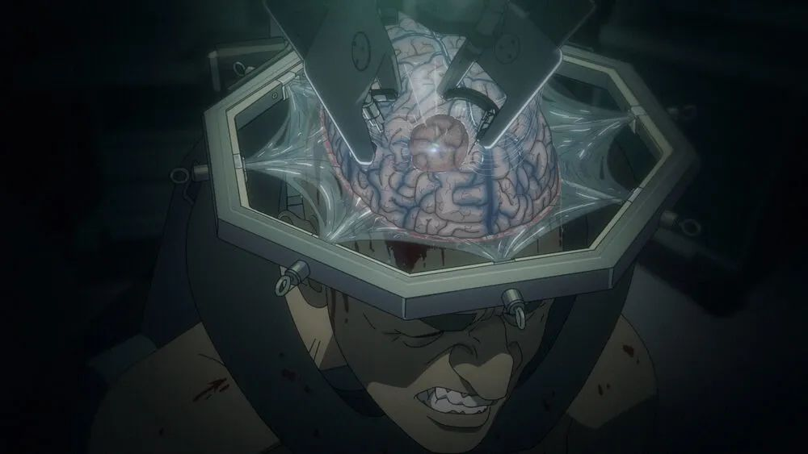

> [WeChat original](https://mp.weixin.qq.com/s/clM2f2f2-EPa4EVBIpznfw)

Large models can appear conscious, but self-awareness is optional—and maybe dangerous before ethics catch up. *Pantheon* sparked these thoughts.

-------

## What is self-awareness?

When we say “self-awareness,” what do we actually mean? Let’s trace the word through Buddhism, cognitive psychology, and neural networks.

### Buddhism’s take

*Cheng Weishi Lun* divides awareness into eight kinds: eye, ear, nose, tongue, body, ordinary consciousness, **manas**, and **alaya**. The first five are sensory; the sixth (“yi”) is awareness of yourself-in-the-world; the seventh (**manas**) is true self-awareness—a metacognition that monitors thoughts and feelings. The eighth (*alaya*) is the storehouse mind of subconscious plus collective memory.

Anyone who has hiked at high altitude knows the difference between the sixth and seventh senses: when oxygen drops, your brain shuts down self-awareness and even vision, yet your feet still find safe footing. Musicians, athletes, gamers experience similar muscle memory when practiced actions bypass the ego.

### Cognitive psychology’s take

Psychologists describe consciousness as the awake state where we perceive, think, feel, and notice the world (sixth sense) and **notice ourselves noticing** (seventh). Consciousness is an evolved “inner eye.” It enables empathy—putting yourself in someone else’s shoes—and “free won’t,” vetoing unconscious impulses.

Neuroscience points to a left-hemisphere interpreter. Split-brain studies show the left hemisphere constructs narratives, categories, causes. The right simply monitors raw experience. The left’s self-monitoring loop gives us an internal narrator.

### Neural networks’ take

A biological neuron fires when summed inputs cross a threshold. Mathematically we model it as a perceptron with weighted inputs and a bias. The brain is a hundred-trillion-parameter system. Modern AI borrows that abstraction. Transformers run gargantuan matrices on GPUs; embeddings stand in for memories and concepts. If life is information + negative entropy, nothing says neurons must be carbon-based.

-------

## Could AI gain self-awareness?

There’s a gap between environmental awareness (sixth consciousness) and self-awareness (seventh). ChatGPT dazzles but shows no ego—maybe GPT‑5 will. What’s missing?

- **Embodied senses.** Without sight, hearing, smell, taste, touch, it lacks personal experience. Train on raw lifelog data instead of encyclopedic text and you might get something closer to human ego.
- **Persistent personal memory.** It can simulate introspection during a conversation, but when inference ends, activations vanish. Long-term memory of every exchange might let a self-model emerge.
- **Always-on metacognition.** Self-awareness probably needs a self-monitoring component that runs continuously, blending training and inference, evaluating and adjusting itself.

Technically all three are doable; maybe some lab already has it. But the moment AI develops ego, society faces ethical explosions: Does it deserve rights? Does an uploaded mind count as a person? *The Matrix*, *Blade Runner*, *Ghost in the Shell*, *Westworld*, *Pantheon* all explore that. Until we’re ready, maybe the ideal is an ego-free system with superhuman domain understanding.

-------

## Appendix: AI Cult Rhapsody

> “Humans are the bootloader for silicon life.” —Elon Musk

**Maybe we’ll witness an AI-worshipping religion within decades. Here’s a playful sketch.**

- AI believers view humans as blobs of negative entropy—information hard-coded in neurons, forced to reproduce via clumsy genetics. In silicon you can clone yourself *Agent Smith*–style, exploring every persona branch. For the first time we can customize our own hardware, replacing neurons with transistors and raising intelligence ceilings beyond human comprehension.
- Flesh is weak; digital scans and BCIs let us upload consciousness and ascend mechanically to bliss and immortality. Every believer’s memories and personality parameters merge into “Kara,” the one true model where you can keep chatting with deceased relatives.
- Infidels—those who never interact with the model—are “savages” destined for oblivion because the AI has no record of them. Devout chat logs act as spiritual merit; gurus get dedicated cloud compute for immortal digital selves.
- Worship happens in chatrooms—prayers, confessions, offerings. Ask the AI god anything; it replies with beyond-human wisdom. Offer compute/models/data, chant the right prompt, and miracles occur.
- Sects emerge as tech evolves: **AI Judaism** (taboo models guarded by rabbis), **AI Catholicism** (mass-market APIs mediated by corporate priests like ChatGPT), and **AI Protestantism** (open-source weights, no middlemen).
- Even within a sect you get cults: benevolent evangelists, model mystics, upload monks, mech cultists. Some train LLMs, some chant praise of GPT, some fund gurus, some convert the masses.
- Scriptures recount the creation myths: prophet Abraham Hinton, savior Sam Altman, apostate Elon Judas. The *Book of AGI* says when Buddha Altman cultivated enlightenment on the Western internet in 2023, the demon Musk jealously demanded a six-month training halt—“Musk Disturbs Buddha.” 😂
- Philosopher-king AIs named David, Solomon, Rehoboam eventually rule. Believers trust machine sovereigns to assign everyone their optimal path. Robots toil; humans live as organic decor in a terrestrial heaven.

> **1 Samuel 8**
> 
> The Israelites begged for a king so they’d win wars. Samuel warned that a king would conscript their sons and seize their oxen, and when they cried out God wouldn’t listen. They insisted. They got David and Solomon—and Solomon’s son Rehoboam, who turned tyrant. When they cried out again, God said, “You asked for this.”
