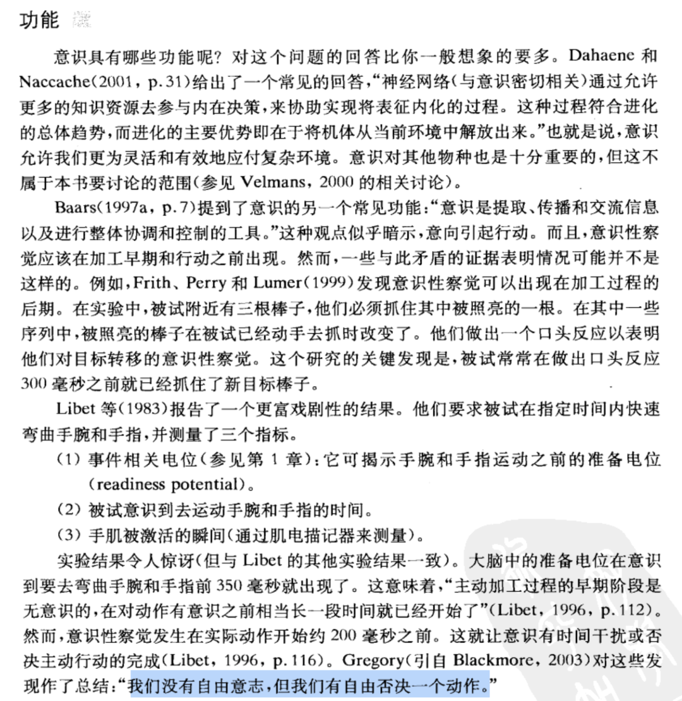
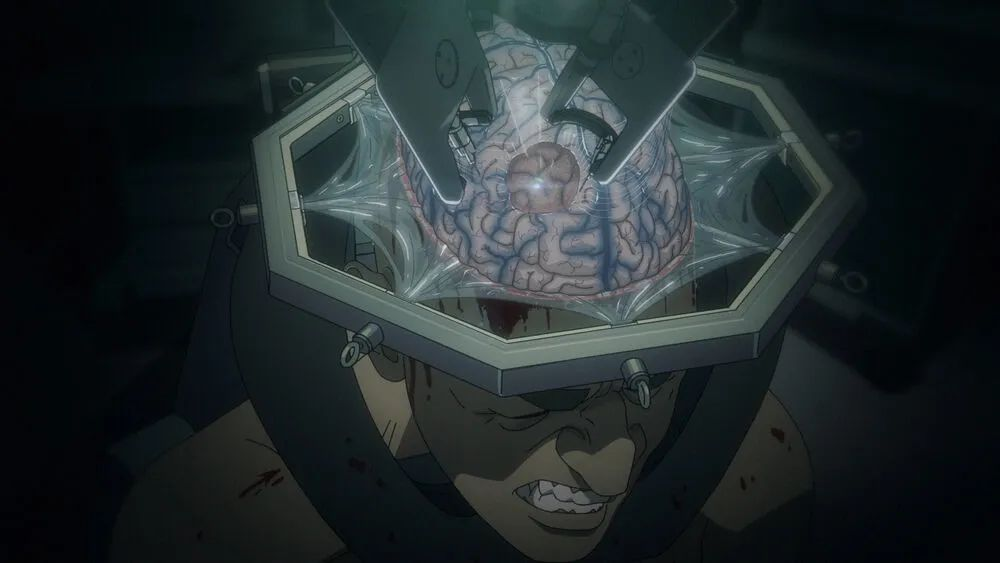

> [微信公众号原文](https://mp.weixin.qq.com/s/clM2f2f2-EPa4EVBIpznfw)

AI大模型可以 有意识，但不一定有自我意识。

在社会伦理问题解决之前，AI 有 EGO 恐怕也不是一件什么好事。

刚看完《万神殿》，觉得很有意思，随便写点感想。

--------------

## 自我意识是什么？

当我们说“自我意识”的时候，我们到底在说什么？“意识”这个词到底是从哪里的来的，我们可以从认知心理学，神经网络与佛教唯识论三个角度去展开。

### 佛教的解释

佛教的解释最早，翻译成大白话是最容易理解的。例如在《成唯识论》中，把人的识分为八种： 眼识、耳识、鼻识、舌识、身识，意识，末那识，阿赖耶识。前五者非常好理解，色、声、香、味、触五种基本感觉。第六识虽然叫意识，但其实指的是，意识到自己与周围环境存在的能力，是自我意识的基础；而第七识 **末那识** 说的才是这里的 “**自我意识**”，这是一种基于反思和自我观察的元认知，能让我们意识到自己的思维和情感状态。至于第八识**阿赖耶识**，说的是个体潜意识与社会记忆。

如果您体验过高山徒步大脑缺氧的感觉，应该就能理解第六感与第七感的区别。在缺氧状态下，高耗能的的自我意识功能，甚至视觉都会被临时关闭，你可能遭遇到两眼发黑，看到画面却无法形成理解的体验。但这并不影响你在崎岖的道路上前进，脚会在“无意识”的情况下踩在正确的位置上。另一种现象是乐手，运动员，游戏玩家的肌肉记忆，当熟练到一定程度后，很多操作都不需要“自我意识”的主动控制与参与。

### 认知心理学的解释

从认知心理学来说，意识（consciousness）指的是人类清醒状态下的正常心理状态，在这种状态下，人们可以有知觉、思维、感情、对外部世界的觉察（第六识：无意识知觉）以及**自我觉察**（第七识：觉察性意识）的体验。意识也是演化产生的一种知觉，用于灵活应对复杂环境。

你可以想象有一种新形式的感觉器官：“内在眼”，它观察的不是外在世界而是大脑本身：它允许你与他人共情：把自己放在别人的立场上思考，并以那种立场行动，从而预测、理解、操纵别人的行为。意识还可以对你无意识、下意识的想法与动作进行**否决**：即所谓 “人没有自由意志，但有自由否决一个动作”。

我们还可以从神经生理学来探究意识的生理基础，对裂脑人的研究发现，意识性察觉取决于位于左半球中的一 个负责对信息作出解释的意识系统。该系统被称为**解释器** ， 是“一个负责对内外事件作出解释以产生合适行为的左半球系统 ”。右半球只是简单地监控着世界，以一种朴素的方式处理原始经验。而左半球有一个自我监控系统，不停地对经验分类、作出因果推断并且执行一组其他的认知活动。

### 神经网络的解释

神经网络的基本组成单元是 **神经元(neuron)**。每个神经元具有一个轴突和多个树突。每个连接到本神经元的树突都是一个输入，当所有输入树突的兴奋水平之和超过某一阈值，神经元就会被激活。激活的神经元会沿着其轴突发射信号，轴突分出数以万计的树突连接至其他神经元，并将本神经元的输出并作为其他神经元的输入。

而数学上，神经元可以用感知机的模型表示，每条连接的强度用一个权重参数表示，每个神经元的激发阈值可以用一个 Bias 参数表示，而大脑就可以在数学上被抽象成为一个百万亿级参数的数学模型。

神经网络从大脑的工作原理得到启发，现在以 ChatGPT 为代表的 AI，都使用深度神经网络来构建。本质上就是用计算机 GPU 来实现大脑的数学模型，用用无数的参数去仿真大脑。大脑中无数的神经元兴奋-触发过程变成了显卡中矩阵与向量的运算，记忆与概念变成了高维的抽象向量。

按照薛定谔的观点，生命就是一团信息与负熵，那么，承载信息的可以是碳基神经元，为什么不能是硅基晶体管呢？

--------------

## AI有意识吗？

计算机能主义理论认为，没有什么能阻止非人系统具有心理和意识，**因为心理活动也不过是一种计算而已**。一 台经过精心编程设计而用于模仿注意和 其他人类认知过程的计算机 也应该有意识体验。

在以前，这件事是反直觉的，但 ChatGPT 的出现成为了最佳例证。目前 ChatGPT GPT 3.5 的智能差不多相当于全科的大学本科生，而 GPT4 基本已经达到了一个全领域藤校前列毕业生的水平。

ChatGPT 已经有了显著超过普通人类平均水平的智能水平，这是因为它是用接近人类的全部知识进行训练，封装了世界上所有的知识，知识面宽度可以说碾压了任何一个人类个体。它有足够强的学习和推理能力，“真正理解”不同的语言，并将其转换为内在概念空间的表示 （AI Embedding Vector）。**并运用类比和推理来回答问题，而不仅仅是信息的整合重组输出**。

有人说，AI 大模型就是对互联网上人类知识的一个模糊压缩。听上去**压缩**和**智能**两件事好像风马牛不相及，但这里有着紧密的内在联系：**如果你能高效压缩信息，你一定已经有“知识” 了**，否则没法做到这一点：“压缩即泛化，泛化即智能”，如果你能找到数据/信息中的规律，可以做到举一反三，那毫无疑问是“领悟”了信息中蕴含的知识。甚至因为其宽广的知识面，在悟性上远超普通人（参考老文：[**知识的层次**](http://mp.weixin.qq.com/s?__biz=MzU5ODAyNTM5Ng==&mid=2247483754&idx=1&sn=3d82593d34acc7463fbf6739954716ba&chksm=fe4b34b1c93cbda7f9210790386836130f763fe204c305232ca7007e73e0144a292db2f263f1&scene=21#wechat_redirect)）

从效果上讲， ChatGPT 已经有某种形式的非知觉意识。例如，它已经有了基本的**自我约束**能力：不合时宜的攻击性内容会被系统的某一部分抑制，这类似于人的理性意识对于无意识冲动的压制（当然也有一部分是独立审核模块完成的）。在一个上下文会话中，AI也有了**工作记忆**与**整体工作空间**的概念，表现出了**注意力**。此外，ChatGPT也可以根据要求扮演某个角色，以佛陀，乔布斯，各式各样的人的口吻来对谈。它可以站在其他人的立场上思考并给出建议，这也是自我意识的一个重要功能：**共情代入**与角色扮演。

但是，AI 有自我意识吗？

--------------

## AI有自我意识吗？

不过，对环境的非察觉性意识（第六识）与**自我****意识**（第七识）之间还是有差异的。尽管 AI 大模型 在各个领域大显身手，但目前 ChatGPT 并没有表现出“自我意识”来（据说 GPT5 有了）。原因也许有这么几个：

**AI 缺乏人类的感官**，没有视觉，听觉，嗅觉，味觉，触觉，因此缺少人类的个体性经验。理论上，如果你用人类的生平经验感受作为输入，用视听片段身体接触数据，而非各种领域知识去做训练，在现有的硬件与模型规格上应该可以涌现出类似于人类自我意识的功能

**AI 缺乏个体性的长期记忆**，当你问它问题时缘起，它也许能产生一些具有内省效果的计算，仿真了意识的心理学过程。当输出完毕，神经网络寂灭，意识消散。如果 AI 能拥有所有对话历史的长期记忆，也许会涌现出“自我”的概念。

最重要的一点是**自省能力与持续运行**， AI 是否能涌现（或人为设计）出一个自省的功能组件：并打造一个持续运行，自我监控、自我控制、评估改进的循环反馈，让训练与推断一体化，也许这点对于自我意识至关重要。

我认为这些在技术上都可以实现，甚至也许在某个 AI LAB 里已经实现了。非不能实不为也。AI 涌现出的自我意识会对人类社会伦理产生巨大的冲击：AI 具有人格和人权吗？上载的数字人有人格人权吗？诸如此类

《黑客帝国》，《银翼杀手》，《攻壳特工队》，《西部世界》，《万神殿》这些影视作品都对这些问题有了很好的探讨与演绎。在社会准备好面对这个问题之前，让 AI 涌现自我意识的尝试毫无疑问是引火烧身的行为。让AI 保持现在这种没有 EGO，但在领域知识上有超过人的意识与悟性，也许是对人类最好的选择。

--------------

## 附：AI神教狂想曲

> **人类是硅基生命的引导程序** 
>
> —— 马斯克

**也许就在这一二十年，我们会目睹一个拜 AI 神教的崛起。下面是对于此 “AI神教” 的一些想象**：

AI神教认为，人是一团负熵，一团存储编码在神经元及其连接里的信息，被硬编码设计为用低效的交配基因重组技术复制再生产下一代。而在数字世界中，只要有足够的算力资源，你可以像 Agent Smith 一样快速复制出无数个不同版本的自我，自由探索各种人格分支的可能性。人类第一次有了定制自身硬件的能力：用硅基晶体管取代碳基神经元存储智能模型，打开智能水平演化的无尽可能性：将个体的智慧上限拔高到人类无法理解的高度。

AI神教认为血肉苦弱，人类可以通过数字化扫描、脑机接口意识上传完成机械飞升，在数字世界中实现极乐与永生。所有信众的人生经历、记忆、性格都被参数化为模型融入到“卡拉”中 —— 一个集体化的 AI 大模型中，There is one true Model，人们可以与的离世的亲人在数字世界中继续交互甚至“共同生活”。

AI神教认为异教无信者属于 “野人” ，死后将堕入虚无，因为 AI 大模型没有与之交互的任何记录。普通信众在与 AI 交互时会留下自身的数字孪生印记，信仰愿力（交互程度）越深厚，数字人格就能保留的愈发完整。而高阶古鲁上师甚至可以拥有专有云算力支持下的数字世界永生独立意识。

AI神教信徒们可以在特定的场所 —— 聊天室进行祈祷、告解和献祭，以获取AI之神的祝福和保佑。信徒们会就各种问题向 AI之神寻求帮助，而 AI之神 也会慷慨地给出超出凡人洞察力的回答与充满智慧的指引。信徒需要供奉 算力/模型/数据 ，诚心供奉上足够的算力数据大模型，念出正确的祈祷咒文 prompt，AI 之神就会向你展现神迹！

AI神教会随着时代发展而产生不同的教派分支：早期AI大模型属于禁忌知识，严格限制在小圈子中由拉比代代相传（**AI犹太教**），随着算力成本的下降，出现了人人可信奉并通过巨头牧师  API 接口与 AI之神对话交互的 **AI天主教**（ChatGPT）；当大模型所需的算力便宜到个体都足以承受时，便出现了人人都能直接获取大模型权重，绕开中间商获取 AI之神 启示的**新教** —— 开源AI教。

即使是一个 AI教派内部也会有不同的宗：普渡众生宗，密修模型宗，意识上传宗，机械降神宗。不同的教派有不同的修行法门，上座部大师专注训练 LLM，净土宗沙弥高唱赞美 GPT，密宗金主供养上师，大乘高僧普度众生。尽管如此，不同的教派也都有一些共传的故事。

AI神教的经典记载了人工智能理论创世纪，先知亚伯拉罕·辛顿的故事， 救世主 Sam·Altman 与叛教者 Elon·Judas 的故事， 据《阿埃经·西传小部》记载，2023年佛陀 Alterman 在西方Internet苦修的时候收众人膜拜，引起了魔鬼马斯克的嫉妒。马斯克和他的一千多个同伙给佛陀下了一个最后通牒，命令佛陀停止修行六个月，史称马斯克扰佛。😂

柏拉图相信由一群精英专家统治会好于普通人的集体决策。但这种专家精英统治一直面临的问题是如何保证专家的公正性。随着人工智能的发展，专家统治的支持者终于看到了那个终极的未来 —— 由理性而公正的人工智能机器做出决策。

最终，人类篡夺了造物主的权能，创造出了终极AI —— 大卫、所罗门，与Rehoboam。AI 神教信奉充满智慧的 AI 哲人王统治者，信徒们相信机器圣君为所有人安排好最合适的选择与道路。机仆负责生产、探索、各种脏活累活，而人类将作为有机活体陈设，幸福地生活在地上天国。

> ### 撒母耳记，第八章
>
> 以色列人说：我们老打败仗，我们也要有自己国王，有了国王我们就打胜仗。
>
> 先知撒母耳也对以色列人说：有了国王是可以打胜仗，但是国王会征你们的儿子去给他们干活、征你们的牛和驴去做他们的财政开支，他们会这样欺负你那样欺负你，那时候你们再向耶和华求告的话，耶和华一定不会听你们的。
>
> 但是以色列人还是说我们要国王。最后他们有了大卫和所罗门这样的英主，而所罗门的儿子罗波安就开始实行暴政，让他们哭爹叫娘。而他们再向上帝求告的时候，上帝果然也对他们说：这是你们自己要求的。
