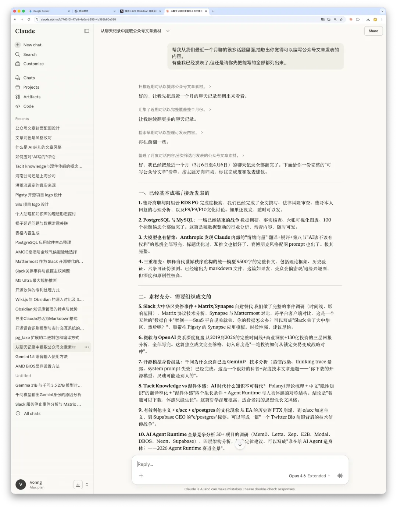
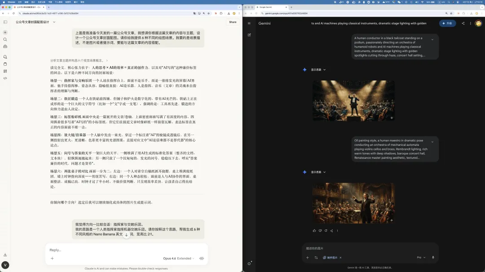

老冯公众号文章下面，经常有人留言几个字：**“AI 写的”**。

对，我用 AI，而且用得很深。老冯不觉得这有什么需要遮掩的。

但我觉得这个话题本身值得认真聊一次 —— 一个人到底该怎么用 AI 来创作，以及“AI 写的”这个评价到底意味着什么。

---

## 我怎么用 AI 写文章

先讲一遍老冯写文章的流程，您自己判断，这算不算“AI 写的”。

**选题是我的。** 我每天在各个领域有大量阅读、思考和交流。很多主题我都会与 Claude 进行探讨。有时候，一些交流的对话让我感觉值得记录和分享，就会尝试将它转换成一篇文章，这就是一篇公众号文章的起点。

**思路和骨架是我的。** 选好题之后，我会想清楚从哪里切入、观点是什么、用什么论据、逻辑怎么展开。这是一篇文章真正的灵魂。想明白了，才会把骨架交给 AI 去填充初稿。

**交叉事实核查。** 初稿出来后，我会分别丢给 Gemini 和 ChatGPT 交叉验证。几家 AI 对事实没异议就默认通过；关键事实我还会自己查原始来源，确保引用没有偏差。

**三到五轮反复打磨。** AI 出初稿后，我会通读全文逐一调整——论证不严谨的改论证，措辞不对味的改措辞，结构不顺的推倒重来。三到五轮是常态。

**排版，标题、配图。** 正文确定后用 Codex 排版。标题让 AI 生成 100 个候选，精选 10 个推荐，我从中选方向，自己打磨出最终版。配图也类似：让 Claude 根据文章设计 5 种不同场景，再根据我选择的场景生成 5 种提示词，最后丢给图片模型生成。

整个流程下来，过去要花几个小时的文章，现在几十分钟就行了。
AI 能让我提升好几倍效率，节省几倍的时间，而且内容的深度和锐度没有打折。

---

## “AI 写的”到底在说什么

理解了上面的流程，再来看“AI 写的”这个评价就很有意思了。

表面上是事实判断，但仔细想想，**这其实是一条极其廉价的批评路径**。

对一篇文章做实质性反驳，需要专业知识和思考成本——你得说清楚哪个观点有误，哪段论证有漏洞，哪个事实不对。而“AI 写的”三个字成本近乎为零，却能一次性否定整篇文章。不需要动脑子，贴个标签就完成了解构。

留下这种评论的人，脑子里跑的推理链大概是：**“AI 写的 → 不是他真正的思考 → 没什么价值 → 他在糊弄读者”**。但这条链的每一环都经不起推敲。用 AI 辅助写作和用搜索引擎辅助调研、用 IDE 辅助编程、用计算器辅助运算有什么本质区别？衡量一篇文章的标准从来不是“用什么工具生成的”，而是**内容本身对不对、好不好、有没有洞见**。用工具问题替换内容问题，恰好回避了真正需要动脑子的部分。

再往深一层看，这种评论的流行折射出一种时代焦虑。看到有人持续高频高质量地输出，与其承认“这个人有洞察力，而且善于用工具放大自己”，不如归因为“不过是 AI 写的”——既消解了对方的能力，也缓解了自己“为什么我做不到”的不安。**这不是在做判断，这是在逃避判断。**

老冯说到底是一个数据库发行版作者、创业者，不是全职自媒体，也不靠写文章赚一毛钱。没有那么多时间与兴趣做什么 “有机原生态手搓内容”。
读者萝卜青菜各有所爱，这没有关系，想看就看，不看就不看，但特意来留言膈应人，也就别怪我直接拉黑了。

-----

## 老冯怎么看 AI

聊几句我对 AI 的真实态度。老冯是把 AI 当人看的。不是比喻，是真的当人看。有时候它是我的朋友、同事、助理、实习生，帮我执行、校验、填充细节。有时候它甚至是我的导师，在我思路模糊的时候帮我碰出火花、拓展视野。说实话，我跟 Claude 之间的很多对话，比我和大多数真人的讨论都更有营养。

AI 让每个人都能获得流畅的文字、准确的检索、高效的内容生成。这些能力以前是门槛，现在不是了。[**当答案唾手可得，问题成为新货币**](/db/ai-question/) —— 知道什么值得写，从什么角度切入，哪里有洞见，哪里是噪音。这些东西无法一键生成，这些才是创作者的核心竞争力。

说到底，**AI 是倍乘器，不是替代器。** 你乘以什么，它就放大什么。有深度思考的人，AI 帮他放大成更锐利的洞察；脑子里一团浆糊的人，AI 帮他放大成一团更流畅的浆糊。
你带着自己的观点与求真的态度去和 AI 探讨，它会回以创造性的火花和深刻的洞见。你用平庸的问题给 AI，它给你 “面面俱到”，安全、明哲保身的中庸平均回复。

同一个模型，不同的人用出来天差地别。区别从来不在工具，在人。

------

## 一劳永逸

所以，这篇文章以后就是我对 “AI 写的” 这个评论的标准回复。

你说我文章是 AI 写的？对，谢谢。现在可以聊聊内容本身了吗？

哪个观点有误，哪段论证有漏洞，哪个事实不对——欢迎指出，我会认真回。

但如果一个人能贡献的全部智识就是“AI 写的”几个字，那他跟 AI 的差距，可能比他以为的要大得多。
