前天苹果发布 MacBook Pro M5 Max，昨晚开放预购。

老冯果断下单，顶配拉满，¥58,200，一气呵成，等不了折扣与优惠了。

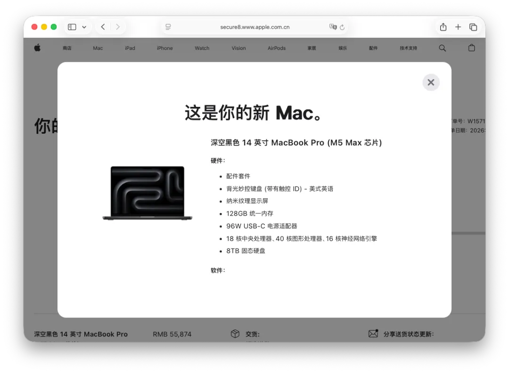

------

## 一、”败家史”：十年的账单

毕业以来，主力机型从未变过——MacBook Pro 顶配，不仅要顶配，而且要拉到满：

- **2015 年**：在阿里，公司发了台烂 Dell，自己买了台顶配 MacBook Pro，花了两万。
- **2017 年**：在探探，被挖时没提别的要求，就要了台顶配拉满的 rMBP，三万。
- **2019 年**：在苹果，离职前用员工优惠买了台 2018 款顶配拉满，四万。
- **2022 年**：自己创业，买了台 M1 Max 顶配拉满，五万。
- **2026 年（现在）**：M5 Max 顶配拉满，六万。

价格每隔几年涨一档，但老冯从来没后悔过，一直觉得 iPhone 和 Macbook 是买过最划算的数码产品。拆开来看，六万块，24 期免息也就每月两千四，也就是一个 Claude  + GPT 的订阅价格。相比带来的效率与体验，值。

逻辑很简单：每天在电脑上工作十来个小时，生产力工具没必要抠——用一台响应慢、编译卡的机器，浪费的是时间和状态、心情和体验，那才是真正的不值。

------

## 二、我的用例，真的能用满

有人买顶配拉满是图个心理按摩，反正不差钱。

老冯不是，我还真能用上。

[WinStudio，一万块在本地跑200B大模型？](https://mp.weixin.qq.com/s?__biz=MzU5ODAyNTM5Ng==&mid=2247490389&idx=1&sn=c80d97f60ebe69fe303273de228e14c5&scene=21#wechat_redirect)

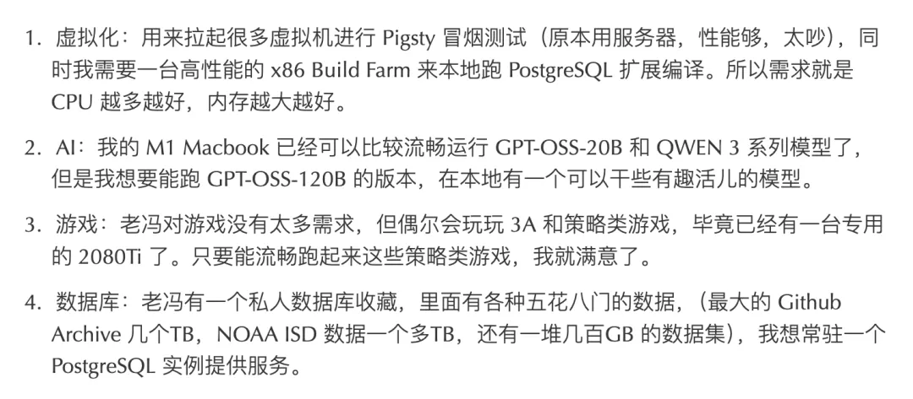

六万块如果去买国补的 Macbook 新丐版与 Mac Mini，够买 16 ～ 19 台了。去买 32c / 128G  的 AI MAX 395 WinStudio 准系统，能买四台。 但整一堆啰啰对老冯没有意义，我需要的就是在单机上堆料堆到极致。

我会在笔记本上同时跑十几台虚拟机做冒烟测试，跑巨无霸数据库，开两三百个 Chrome 页面，切换十几个 IntelliJ IDEA，同时挂着十几个并行 Agent 在大规模出活，再加上几个网站实时构建渲染 —— 有些活可以丢到服务器，或者 WinStudio 上，但大部分不合适。

即便如此，手头这台 M1 Max 64G / 8TB 全闪依然稳如老狗。整个 Pigsty 项目可以说就在这台机器上诞生。[去年 5 月在高铁上被邻座泼了酱油](https://mp.weixin.qq.com/s?__biz=MzU5ODAyNTM5Ng==&mid=2247489852&idx=1&sn=d4c63c1ac9f052cb81bb1e1e175cee7e&scene=21#wechat_redirect)，找 AppleCare 换了整机，算下来新机才用了不到十个月——继续用也可以，奈何 M5 Max 实在太香，等不及 M6 了。

------

## 三、M5 Max：哪里真正不一样？

不是简单的迭代，M5 这代有几个对我来说立竿见影的质变。

**存储带宽翻倍**。SSD 速度达到 14.5 GB/s，相当于 PCIe Gen5 量级，比前几代直接翻倍。对于频繁读写大量虚拟机镜像和数据库文件的场景，感知非常直接。

**内存带宽跃升**。约 614 GB/s，比M1 Max暴力拉升 50%，这会实打实等比例体现在本地模型输出速率上。

**128GB 统一内存**。64G 内存在我的用例下经常打满，128G 是该有的配置。更重要的是，M5 Max 128GB 配合高带宽，可以本地流畅运行 70B 量化模型——这在 M1 时代做不到，不过这个 M4 时代就有了。

**无线网络升级换代**。M5 Max 的 网络也升级到了 Wi-Fi 7 和蓝牙 6，终于能发挥路由器的特性了。

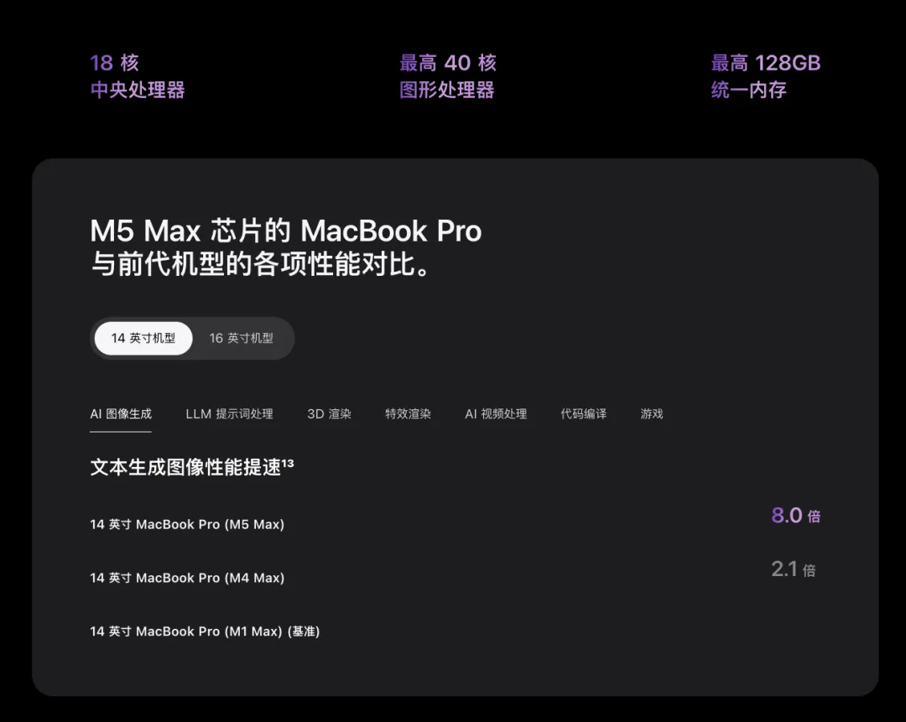

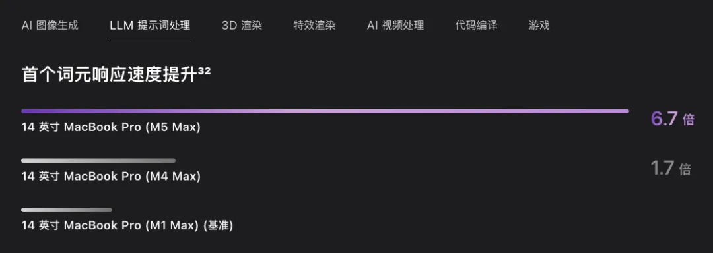

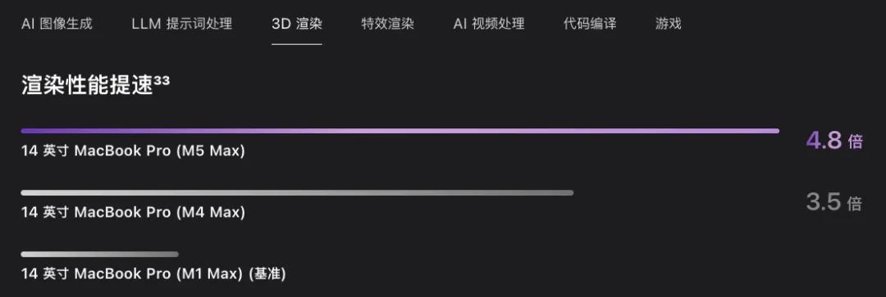

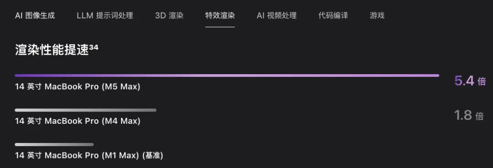

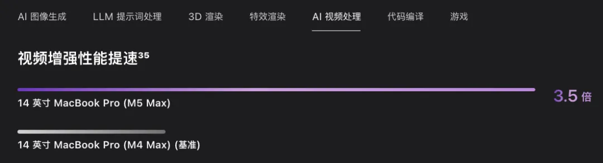

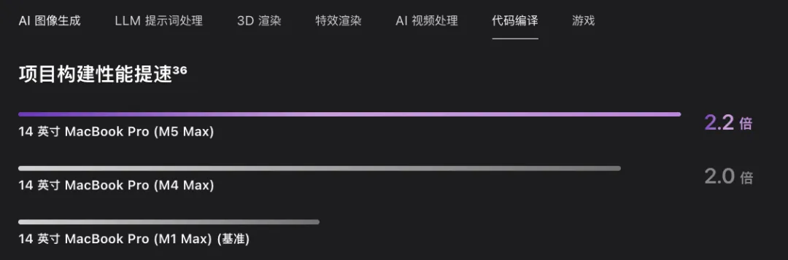

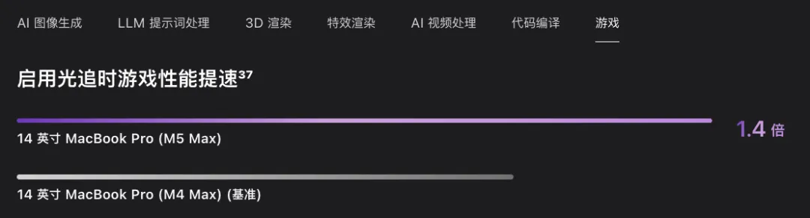

**AI 算力大幅跃升**。总计约 240 TOPS，AI 图像生成比 M4 Max 快 4 倍，比 M1 Max 快 8 倍。实际意义是：本地跑 32B 稠密模型可以达到几十 token/s 的甜点速度，作为苦力 Agent 的推理后端已经够用。

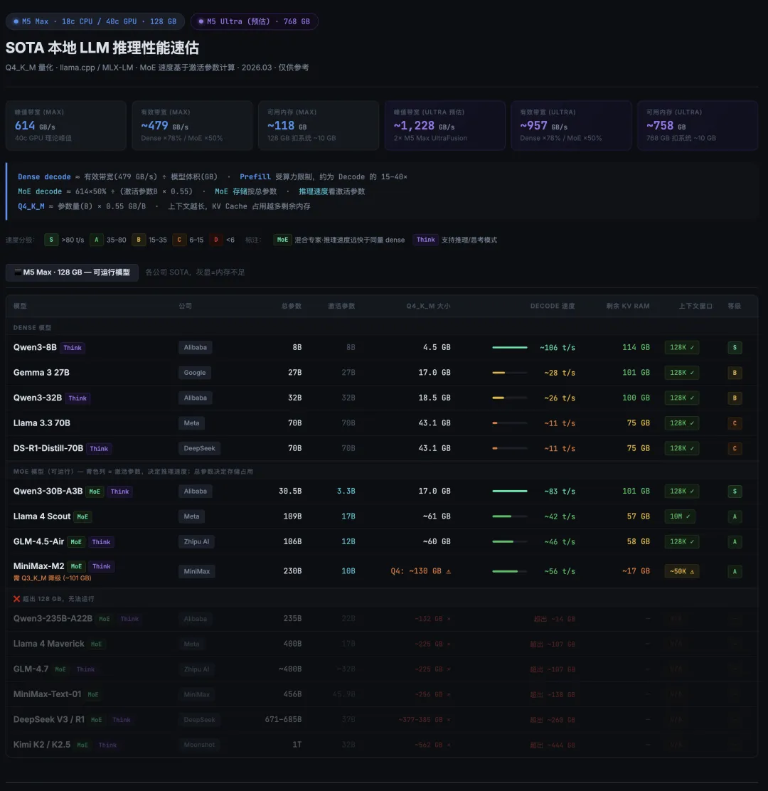

关于本地 AI ，我其实不指望 M5 MAX 来跑 “大模型”，只要能在 32B 稠密模型的甜点位上高速运行，或者能运行一些 100B+ 左右的 MoE 就已经很不错了。倒是适合跑一些小助理，苦力活 Agent。但真要说有意义的本地推理，年中发布的 M5 Ultra 是真正值得期待的设备。

------

## 四、真正值得期待的：M5 Ultra

M5 Max 是开胃菜。今年年中将发布的 **M5 Ultra** 才是真正的大棋。

M5 Ultra 本质上是两颗 M5 Max 通过 UltraFusion 融合。业界预估最大统一内存在 512～1024GB 之间，内存带宽约 1100 GB/s。如果做到 768GB，这台机器将成为第一台有实际意义的本地大模型推理设备——单机运行大几百B 参数的 SOTA 模型，实现真正的 token 自由。

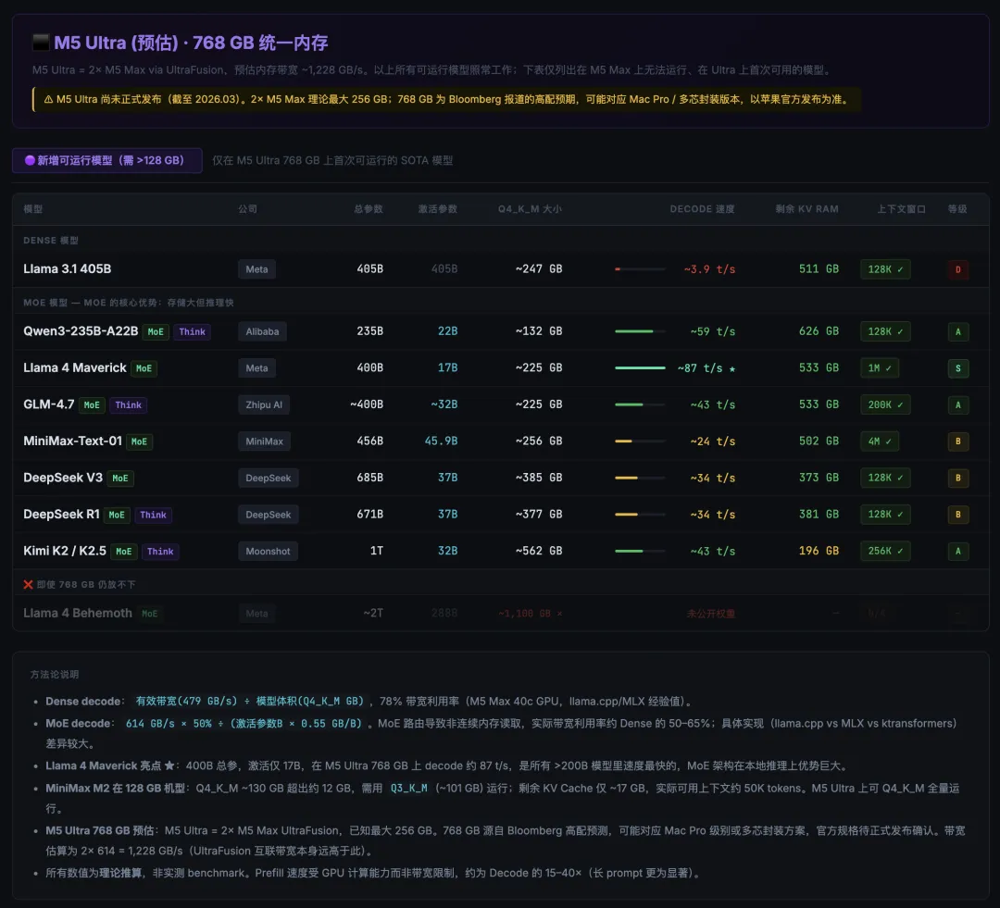

你说它贵么？它可不便宜，但和企业级 AI/数据库 一体机比，又便宜太多。如果 M5 出 768/1TB 内存机型，老冯必买。如果效果够好，我会认真考虑买两到四台组 exo 集群，专跑本地 SOTA。

甚至畅想一下，以后还可以弄个 数据库 AI 一体机出来，搞个 Pigsty 原生 MacOS 版本，弄四台 Studio 塞进一个行李箱大小的盒子，1 千瓦功率，但 128 核 + 3～4 TB 内存 + 64 T 存储。基本上一个大型企业和中型科技企业的本地 IT 需求都可以塞进去里面了。还有足够的本地智能算力用来跑 DBA / 小秘书 Agent。

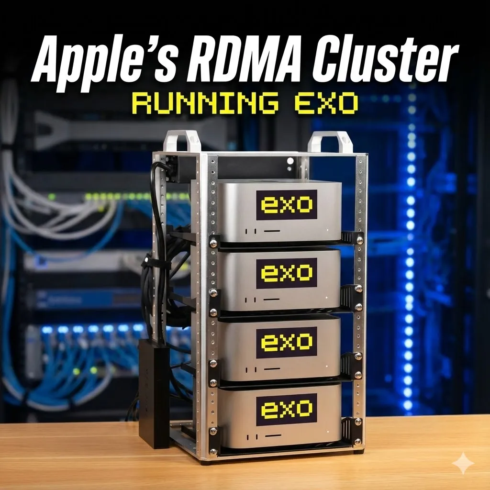

------

## 五、为什么不等 M6？

M6 年底大概率发布，据说还会带来 OLED 屏和触控屏。有人建议再等等。

等等党永远胜利，但考量下来，俺就不等了，原因有三：

其一，苹果换模具的第一年往往有磨合问题，反而是每代模具成熟期的最后产品最稳定——而这代模具已经经过充分验证，芯片又产生了质变，时机刚好。

其二，我日常合盖外接使用，OLED 有烧屏风险，触控屏也用不上，下一代的卖点对我的场景意义不大。

其三，我一直用 16 寸，带出门确实重，早就想换 14 寸了。

当机立断，换。

------

## 结语

苹果没有盲目烧钱追 AI，反而可能正在成为 AI 时代最稳的大赢家。

现在是这样的格局：

- iPhone 可以流畅跑 8B 级别的小模型。
- MacBook 可以流畅跑 32B 级别的中模型。
- Mac Studio 则有望触达接近 1T 参数的 SOTA 模型。

Apple 统一内存架构与内存带宽的组合，在这个时间节点上，终于与开源大模型的规模形成了真正的匹配与共振。M5 Max 是入场券，M5 Ultra 是正式赛场。
