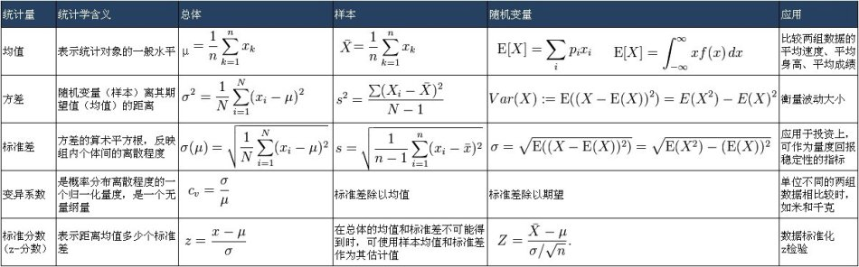



> Statistical analysis is divided into two fields: descriptive statistics and inferential statistics. Descriptive Statistics is the technology for describing or characterizing existing data and is the most fundamental part of statistics.

<!--more-->

## 1. Statistics and the Scientific Method

### 1.1 Methods of Knowing
Throughout history, humans have mainly acquired knowledge through: **authority, rationalism, intuition, and scientific method**

* **Authority**: Acquiring knowledge based on tradition or opinions of authority figures
* **Rationalism**: Acquiring knowledge through reasoning, but reasoning alone is insufficient for determining the truth or falsehood of propositions
* **Intuition**: Intuition is sudden enlightenment, sudden thoughts that flow into consciousness
* **Scientific Method**: Uses reasoning and intuition to acquire truth, but relies on experimentation and **statistical methods** for objective evaluation

### 1.2 Terminology Definitions
* **Population**: The complete set of individuals, objects, or scores that the researcher is interested in studying. The population is the group from which the experimental subjects are drawn.
* **Sample**: A sample is a subset of the population
* **Variable**: Any characteristic or trait of an event, object, or individual that changes under different conditions due to changing circumstances is called a variable.
* **Independent Variable (IV)**: The variable systematically manipulated by the researcher in the experiment.
* **Dependent Variable (DV)**: The variable that the researcher measures to determine the effect of the independent variable
* **Data**: Data refers to the measurement results of experimental subjects, usually consisting of dependent variable measurements and other subject characteristics. Initially measured data is called raw scores.
* **Statistic**: A numerical value calculated based on sample data, which is a quantitative description of sample characteristics (e.g., sample mean is a statistic)
* **Parameter**: A numerical value calculated based on population data, which is a quantitative description of population characteristics.

### 1.3 Scientific Research and Statistics
Scientific research can be divided into observational studies and true experimental research.
* Observational studies: Variables are not subjectively controlled by researchers, so causal relationships between variables cannot be determined. Includes natural observation, parameter estimation, and correlational studies.
* True experimental research: Researchers manipulate an independent variable to study its effect on the dependent variable.
* **Only true experimental research can determine causal relationships**

### 1.4 Descriptive Statistics and Inferential Statistics
* Statistical analysis is divided into **descriptive statistics** and **inferential statistics**.
* **Descriptive Statistics** is technology for describing or characterizing existing data
* **Inferential Statistics** is technology for making inferences about populations using existing sample data.

## 2. Basic Concepts of Measurement

### 2.1 Measurement Scales
Statistics is the process of handling data, data is the result of measurement, and we collect data through **measurement scales**.

* **Nominal Scale**
  The nominal scale is the lowest level of measurement scale, only for qualitative variables.
  In using nominal scales, variables are divided into several **categories**.
  Measurement with nominal scales is actually a process of classifying research objects and naming their categories.
  The fundamental characteristic of nominal scales is equivalence - all members within a category are the same, and their function is limited to assigning objects to mutually exclusive categories.
  Using nominal scales, you cannot perform arithmetic operations or ordinal comparisons.
  Example: {apple, strawberry, banana}

* **Ordinal Scale**
  The ordinal scale is the second-lowest level of measurement scale with low-level quantification.
  Measurement values in ordinal scales have basic order relationships, can indicate relative relationships of variables but cannot indicate absolute levels of variables.
  Using ordinal scales, you can make ordinal comparisons but cannot perform arithmetic operations.
  Example: {poor, average, good, very good}

* **Interval Scale**
  The interval scale is a higher-level measurement scale with quantitative characteristics, equal distances between adjacent units, but no absolute zero point.
  Using interval scales, you can make ordinal comparisons and perform addition and subtraction, but cannot perform multiplication and division.
  Example: Celsius temperature scale

* **Ratio Scale**
  The ratio scale is the highest-level scale with quantitative characteristics and an absolute zero point.
  Ratio scales can perform all basic mathematical operations.
  Example: Kelvin temperature scale, number line.

### 2.2 Continuous and Discrete Variables

* **Continuous variable**: A variable type where infinite possible values exist between adjacent units on the scale
* **Discrete variable**: A variable type where infinite possible values do not exist between adjacent units on the scale
* **Real limits of a continuous variable**:
  Since infinite possible values exist between adjacent units of continuous variables, all measurements of continuous variables are approximate measurements.
  The real limits of continuous variables refer to numerical values plus or minus half a unit, using the scale's minimum measurement unit.
  For example, if the minimum weight measurement unit is 1 pound and the recorded value is 180 pounds, its real limits are 180±0.5 pounds.

* **Significant figures**
  In physics, the significant figures of calculation results should be consistent with the original data.

### 2.3 Rounding
Rounding is not actually as simple as imagined, especially pay attention to the corner case where the remainder is 1/2.
Rules are as follows:
1. Divide the number to be rounded into two parts: **potential answer** and **remainder**. The **potential answer** is the number extended to decimal places. 3.1245 = 3.12 + 0.045; **remainder** is the remaining part of the number.
2. Add a decimal point before the first digit of the remainder and compare with 1/2. 0.045 -> 0.45
3. If the remainder is greater than 1/2, add 1 to the last digit of the potential answer; if less, keep unchanged
4. If the remainder equals exactly 1/2, check whether the last digit of the potential answer is odd or even. Add 1 to odd numbers, keep even numbers unchanged

```
45.04500≈45.04≠45.05
45.05500≈45.06
```

Mnemonic: Round 4 down, 6 up, 5 to even
This rounding method is called banker's rounding, which is the international standard rounding method (IEEE754).
It's the default implementation in .NET, but Python's round method and JavaScript's toFixed method don't follow this rounding method.

## 3. Frequency Distributions

### 3.1 Data Grouping
When data volume is large and widely distributed, listing data individually would result in many frequencies of 0. In such cases, **individual values are usually grouped into intervals**, presented as grouped data frequency distributions.

Data grouping is important work. One important issue is determining interval width. **Grouping data will always lose some information** - the wider the interval, the more information is lost. We cannot know how data is distributed within intervals, so wider intervals create more ambiguity. However, narrower intervals present data closer to raw data - the extreme example would be intervals only one unit wide, which returns us to individual values. So the problem of individual values returns: many data points with frequency 0. Therefore, **narrower intervals make it difficult to clearly show distribution shape and central tendency**.

#### 3.1.1 Creating Grouped Frequency Distributions
Steps to create grouped frequency distributions:
1. Find the **range** of the data
   - Range = maximum value - minimum value
2. Determine the **class width** for each group
   - Class width = range / number of groups
   - Number of groups is typically 10
3. List **grouping intervals**
   - Starting from the minimum interval, first determine the minimum lower limit of that interval
   - The minimum lower limit must include the minimum value
   - Conventionally, the minimum lower limit can be divided by the **class width**
4. Record values and count for each interval.

#### 3.1.2 Relative Frequency Distribution, Cumulative Frequency Distribution, Cumulative Percentage Distribution

* **Relative frequency distribution** refers to the proportion of value frequencies in each grouped interval to the total number of values.

* **Cumulative frequency distribution** refers to the frequency of values **below the exact upper limit of each grouped interval**.

* **Cumulative percentage distribution** refers to the percentage of value frequencies below the exact upper limit of each grouped interval to the total number of values.

### 3.2 Percentiles

* **Percentile** or **Percentile Point** refers to a point on the **scale** where **a specific percentage of all data in the data distribution falls below this point**.
* Example: 50th percentile = 78 points, meaning approximately 50% of people scored below 78 points.
* Example: 75th percentile = 85 points, meaning approximately 75% of people scored below 85 points.
* Percentiles are used for measuring relative position, for individual performance in a reference group. **Given a percentile point, find the corresponding value.** For example, when we want to know the critical scores corresponding to the top 10% and bottom 10% of students, we're finding the 90th and 10th percentile points.

#### 3.2.1 Calculating Percentiles
Calculating percentiles from original ungrouped distribution data is **simple**. First, sort the score values. Assuming there are N data points and we want the x% percentile point, then take the element at position x * N in the ordered data array $data[ceil(\frac{Nx}{100})]$ as the percentile point. The data index is rounded down to an integer using ceil, but this crude approach isn't good. Suppose there's data from 1 to 99 (99 numbers total), and we want the 50% percentile point - should this percentile point be 49 or 50? If it's 49, it's actually the 48.5% percentile point; if it's 50, it's the 50.9% percentile point.

On the other hand, after data grouping statistics, information is lost, and we can no longer simply obtain percentile point values through `data[index]`.

To solve these two problems, the correct percentile calculation method is as follows:

1. Determine the frequency of values below this percentile: $Nx$
   To calculate percentiles, we first need to know the total number of data points, assume N data points. We also need to know the desired x percentile, such as the 50th percentile. Then below this percentile point, there should be Nx data points.

2. Determine the group containing this percentile, take its exact lower limit value, recorded as $X_L$, $cdf(X_L) <= x, cdf(X_{next}) > x$
   We examine the cumulative frequency distribution of each partition from small to large. If the cumulative frequency distribution of an interval is greater than or equal to the Nx calculated above, while the cumulative frequency distribution of the previous interval is less than Nx, then we can confirm that the x percentile point falls within this interval.

3. Determine the number of values between the group's lower limit score and Nx, i.e., the cumulative number of values. $N(1-cdf(X_L))$
   
   This is easy to understand. We've located the partition where the x percentile point is located, but haven't precisely located this value. For example, we want the 50th percentile point of 200 data points, which is approximately the value of the 100th data point.
   
   Suppose interval [30, 40) has a cumulative frequency distribution of 100. According to the definition of cumulative frequency distribution, there are exactly 100 data points less than the partition upper limit 40, so the 50th percentile point is known to be 40 without calculation. For another assumption, suppose interval [30, 40) has a cumulative frequency distribution of 90, and interval [40, 50) has a cumulative frequency distribution of 110. We can determine that the 100th data point falls in interval [40, 50). Moreover, 100-90=10 data points are accumulated in interval [40, 50). Then: cumulative number = Nx - cumulative frequency of all groups to the left of this group = $N(1-cdf(X_L))$

4. The fourth step is to determine the additional offset.
   
   The so-called additional unit is like this: we want to take a point on the scale, but after data grouping distribution, we can no longer know the internal data distribution of the grouping. So we assume that within a grouping, data is uniformly distributed. Therefore, final percentile point = interval lower limit + additional offset
   
   Offset = (cumulative number / frequency distribution within group) * class width: (10 / 20) * 10 = 5

5. Determine the percentile
   
   Percentile point = interval lower limit + additional offset
   
   50th percentile point = interval lower limit 40 + offset 5 = 45.

### 3.3 Percentile Rank

* **Percentile Rank** refers to the percentage of individuals below this value in the total number in a test.
* For example, a percentile rank of 75% for a score of 85 means that 75% of people scored below 85.
* Percentile rank is used when we want to know the percentile rank of a certain value. Opposite to percentiles, percentile rank is **given a score, find the corresponding percentile point**. For example, if we want to know what percentage of classmates a score of 85 beats in class, we're finding the percentile rank of 85.

#### 3.3.1 Calculating Percentile Rank
Suppose we want to find the percentile rank x for a score of y.
First, find the group where score y falls, take the percentage X corresponding to this group's lower limit, record this group's lower limit as Y.
(y-Y) is the cumulative score, (y-Y)/class width is also the cumulative proportion. The cumulative proportion multiplied by this group's frequency (percentage of total data) gives the cumulative percentage value. Adding the percentage X corresponding to this group's lower limit gives the percentile rank.

### 3.4 Frequency Distribution Graphs
Frequency distribution graphs usually include the following four types:
* Bar chart
* Histogram  
* Frequency polygon
* Cumulative curve

#### 3.4.1 Bar Chart
* **Nominal data** or **ordinal data** frequency distributions are commonly represented by bar charts.
* Each bar represents a **category**, and there are no quantitative relationships between categories, but there may be order (which generally doesn't exist).

#### 3.4.2 Histogram
* Histograms are usually used to represent frequency distributions of **interval data** and **ratio data**.
* Histograms look similar to bar charts, but bars in histograms represent **group intervals** that are **equal distance** or **proportional**. Each group interval is located on the horizontal axis, with each group using precise group limits as the beginning and end of bars.
* Adjacent bars in histograms must be connected because groups in histograms are continuous.
* Usually, the midpoint of each group is used as the scale value on the horizontal axis.

#### 3.4.3 Frequency Polygon (Line Chart)
* Frequency polygons are similar to histograms and are usually used to represent frequency distributions of **interval data** and **ratio data**.
* The difference is that line charts mark the frequency of **group midpoint values** on the X-axis as points on the Y-axis and connect these points into a line. **Adding one group midpoint value at each end** connects the line's beginning and end to the horizontal axis, forming a polygon.

#### 3.4.4 Cumulative Curve
* Both cumulative frequency and cumulative percentage can be represented by cumulative percentage curves.
* **The horizontal axis of cumulative curves takes the exact upper limits of each group** because the definition of a group's cumulative percentage refers to the percentage of data less than the group's upper boundary.
* The vertical axis of cumulative percentage is 0~100 or 0~1.
* Cumulative curves are monotonically non-decreasing curves, so cumulative curves are also called ogive curves, appearing 'S'-shaped.

### Frequency Curve Shapes
Frequency distributions have various shapes in graphs. **Frequency curves** can usually be divided into two types:

#### Symmetrical Curves
If a curve can overlap when folded in half, it's a symmetrical curve.
Common symmetrical curves include bell-shaped, rectangular, and U-shaped.

#### Skewed Curves
If a curve cannot overlap when folded in half, it's a skewed curve.
Common skewed curves include J-shaped, **positively skewed**, and **negatively skewed**.
When a curve is positively skewed, **most data** concentrates in the **low score section of the horizontal axis**, with the tail pointing toward the high score section.
When a curve is negatively skewed, **most data** concentrates in the **high score section of the horizontal axis**, with the tail pointing toward the low score section.

## 4. Central Tendency and Variability Measurement



### Measures of Central Tendency

Three measures commonly used for central tendency include **arithmetic mean**, **median**, and **mode**.

#### Arithmetic Mean
**Arithmetic mean** refers to the sum of scores divided by the number of scores.
There are two types of means: **sample mean $\bar X$** and **population mean $\mu$**
Sample mean $\bar X$ formula:

$$
\displaystyle
\bar X = \frac{\sum X_i}{N} = \frac {X_1 + X_2 + X_3+... + X_N}{N}
$$

Population mean $\mu$ formula:

$$
\displaystyle
\mu = \frac{\sum X_i}{N} = \frac {X_1 + X_2 + X_3+... + X_N}{N}
$$

They look the same, but $X_i$ in the two formulas has different meanings, representing sample data points and population data points respectively.

##### Characteristics of the Mean
1. The mean is sensitive to exact values of all scores in the distribution (mode and median are not necessarily).
2. The sum of deviations equals zero: $\sum (X_i-\bar X)=0$
3. The mean is very sensitive to extreme scores.
4. The sum of squared deviations of all scores around the mean is minimal: $\sum (X_i -\bar X)^2$
5. In most cases, among central tendency indicators, the mean is least affected by sampling variation.

##### Overall Mean
Given the means of several groups of data, to find their overall mean, use the formula:

$$
\displaystyle
\bar X_{all} = \frac {n_1 \bar X_1+n_2 \bar X_2 + ... + n_k \bar X_k}{n_1 + n_2+...+n_k}
$$

So the overall mean is often called the weighted average.

#### Median
The median (Mdn) refers to the scale value where 50% of scores fall below it, so it's also the 50th percentile, written as $P_{50}$.
Therefore, calculating the median is calculating the 50th percentile, which won't be repeated here.

##### Characteristics of the Median
1. The median is less sensitive to extreme scores than the mean
   Therefore, when describing skewed distribution data, the median is more suitable than the mean.
2. The median has lower sampling stability than the mean.
   So it's rarely used in inferential statistics.

#### Mode
The mode refers to the score that appears most frequently in the distribution.

Usually, when data has a unimodal distribution, the mode is unique. But some distributions have multiple modes.
Mode measurement is very easy, but it has poor stability between samples and may have multiple values, so it's used less frequently.

#### Measures of Central Tendency and Symmetry
* If a distribution is a unimodal symmetric distribution, then its **mean**, **mode**, and **median** are all the same number.
* If the distribution is skewed, then the mean and median are not equal. Remember that the mean is greatly affected by extreme values, so when the distribution is positively skewed (concentrated on the left), the mean is less than the median; when the distribution is negatively skewed, the mean is greater than the median.
* The mode is the peak of the distribution.

### Measures of Variability
Variability measurement is a quantitative description of dispersion degree. Three commonly used variability values are range, standard deviation, and variance.

#### Range
Range refers to the difference between the highest and lowest scores in a group of data. That is: Range = maximum value - minimum value.

#### Standard Deviation

##### Deviation Scores
Deviation score refers to the distance between the raw score and the distribution mean.
Sample data deviation formula: $X - \bar X$
Population data deviation formula: $X-\mu$

But how to use deviations to represent data dispersion? If we simply add them up, positive deviations will cancel out negative deviations.

$$ \sum (X - \mu) =0$$

A better way than using the sum of deviations is to use the sum of squared deviations:

$$SS_{pop}=\sum (X-\mu)^2$$

A better indicator for measuring dispersion is taking the square root of the mean of the sum of squared deviations, which gives us the standard deviation.
Sample standard deviation calculation formula:

$$
\displaystyle
\sigma=\sqrt{\frac{SS_{pop}}{N}} = \sqrt{\frac{\sum (X-\mu)^2}{N}}
$$

The population standard deviation calculation formula is similar to the sample standard deviation calculation formula. However, when calculating population standard deviation, we often use sample standard deviation s to estimate population standard deviation $\sigma$.

$$s \approx \sigma = \sqrt{\frac{SS}{N-1}}=\sqrt{\frac{\sum (X-\bar X)^2}{N-1}}$$

##### Direct Calculation Using Raw Scores
If raw data is directly known, you can use data **sum of squares** minus data **sum squared**/N to calculate sum of squared deviations, formula as follows:

$$SS=\sum X^2 - \frac{(\sum X)^2}{N}$$

#### Characteristics of Standard Deviation
* Standard deviation provides measurement of dispersion relative to the mean, sensitive to every score in the distribution.
* Standard deviation has stable sampling fluctuation.
* Both standard deviation and mean are suitable for algebraic operations, facilitating inferential statistics.

### Variance
Variance equals the square of standard deviation.
Sample data variance formula: $s^2=\frac{SS}{N}$
Population data variance formula: $\sigma ^ 2 = \frac{SS_{pop}}{N}$

Using sample variance to estimate population variance: $\sigma ^ 2 \approx s^2 =\frac{SS}{N-1}$

##### Proof of Variance Estimation

Why use N-1 instead of N as the denominator when estimating population standard deviation using sample sum of squared deviations SS?

If we know the population mean μ is $\bar{X}$, then sample variance $s^2$ is a true unbiased estimator of population variance $\sigma^2$:

$$
\sigma^2 = s^2 = \frac{1}{N} \sum_{i=1}^{n}{(X_i - \bar{X})^2}
$$

But usually we don't know the population mean μ, only the sample mean $\bar{X}$. At this time, $s^2$ is a biased estimator of $\sigma^2$. Calculating this way would underestimate variance, actually:

$$
\frac{1}{N-1} \sum_{i=1}^{n}{(X_i - \bar{X})^2}
= \sigma^2 \ge s^2 = 
\frac{1}{N} \sum_{i=1}^{n}{(X_i - \bar{X})^2}
$$

Because calculating the mean uses one degree of freedom, the other N-1 data points can freely distribute and calculate standard deviation.

$$
\begin{equation}
\begin{aligned}
s^2 &= \frac{1}{N} \sum_{i=1}^{n}{(X_i - \bar{X})^2}  = \frac{1}{N} \sum_{i=1}^{n}{[ (X_i - μ) + (μ-\bar{X}) ]^2} \\ 
&= \frac{1}{N} \sum_{i=1}^{n}{(X_i - μ)^2}+ \frac{2}{N} \sum_{i=1}^{n}{(X_i - μ^2)(μ - \bar{X})} + \frac{1}{N} \sum_{i=1}^{n}{(μ - \bar{X})^2} \\
&= \frac{1}{N} \sum_{i=1}^{n}{(X_i - μ)^2} - 2(μ -\bar{X})^2 + (μ-\bar{X})^2 \\ 
&= \frac{1}{N} \sum_{i=1}^{n}{(X_i - μ)^2 - (μ-\bar{X})^2} \\
\end{aligned}
\end{equation}
$$

Taking the expected value of sample variance $s^2$:

$$
\begin{equation}
\begin{aligned}
E(s^2) &= \frac{1}{N} \sum_{i=1}^{n}{ E[(X_i - μ)^2] - E[(μ-\bar{X})^2]} \\
&= \frac{1}{n}(nVar(X)-nVar(\bar{X})) \\
&= Var(X) - Var(\bar{X}) \\
&= σ^2 - \frac{σ^2}{n}  \\
&= \frac{n-1}{n}σ^2
\end{aligned}
\end{equation}
$$

## 5. Normal Curve and Standard Scores

The normal distribution is very important because:
* Many random variables' distributions approximate the normal curve.
* Many inferential test sample distributions tend toward normal distribution as sample size increases.
* Many inferential tests require sampling to be normally distributed.

### 5.1 Normal Curve
The normal curve is a theoretical distribution of population scores. It's a bell-shaped curve with the formula:

$$
\displaystyle
Y=\frac{N}
{\sqrt{2\pi \sigma}}
e^{\frac{-(X-\mu)^2}{2\sigma ^2}}
$$

If you need normal distribution tables, CDF or PDF, you can calculate through the scipy package:
```python
from scipy.stats import norm
norm.cdf(1.2)
norm.pdf(2.4)
```

From the formula, if we take the second derivative of the distribution function, we get two zeros located at $\mu-\sigma$ and $\mu +\sigma$. These two points are called the inflection points of the normal curve.
Theoretically, the normal curve never intersects the X-axis; it only gets closer and closer to the X-axis. The X-axis is called the asymptote.

#### Area Under the Normal Curve
The normal curve is often a probability density function (PDF). The area enclosed by the probability density function, two vertical lines, and the X-axis represents the probability of events occurring.
Probability within $\mu \pm\sigma$ is 68.26%
Probability within $\mu \pm2\sigma$ is 95.44%  
Probability within $\mu \pm3\sigma$ is 99.72%

### 5.2 Standard Scores, z-scores

Several different distributions all follow normal distributions but have different means and standard deviations. To solve this problem, we can convert normal distribution scores to **standard scores**, i.e., **z-scores**.

**z-score** is a transformed score that indicates how many standard deviations above or below the mean the raw score is, expressed as:
Population data z-score: $z=\frac{X-\mu}{\sigma}$

Sample data z-score: $z=\frac{X-\bar X}{s}$

The process of changing raw scores is called **score transformation**, resulting in a distribution with mean 0 and standard deviation 1.
After score transformation, any normally distributed distribution now becomes comparable.

#### Characteristics of z-scores
* z-scores have the same distribution shape as raw scores.
* The mean of z-scores is always 0.
* The standard deviation of z-scores always equals 1.

#### Finding Area (CDF) Given Raw Scores
This can be seen as finding percentiles. For example, if my IQ is 158, what percentage of people did I beat?
First, the IQ model can be seen as a normal distribution with mean 100 and standard deviation 16.
IQ 158 converts to z-score as (158-100)/16 = 3.625. Looking up the normal distribution CDF table:

```python
>>> norm.cdf(3.625)
0.99985551927411875
>>> norm.sf(3.625) # survival function sf(x) = 1-cdf(x)
0.00014448
```

An IQ of 158 beats 99.99% of people, truly one in ten thousand.

#### Finding Raw Scores Given Area (CDF)
This is the reverse table lookup: what IQ score represents one in a million?

One in a million means beating 99.9999% of people, i.e., cdf(z)=0.999999.

```python
>>> norm.ppf(0.999999) # Percent Point Function (inverse of cdf)
4.753424
>>> _ * 16 + 100
176.054
```

Using the inverse function of CDF, we get z-score 4.75. Converting back to standard IQ distribution, we know an IQ of 176 reaches the one-in-a-million level.

## 6. Correlation

### 6.1 Introduction
We might be interested in relationships between two variables.
Because if two variables are **correlated**, then one variable **might** be the cause of another variable.
If two variables are **uncorrelated**, then there cannot be a causal relationship between them.
That is, **correlation doesn't necessarily mean causation, but causation definitely means correlation** - correlation is a necessary condition for causation.

**Correlation** and **regression** are closely related, both involving relationships between two or more variables.
The difference is: correlation cares whether relationships exist, determining size and direction. Regression focuses on using correlation for prediction.

### 6.2 Relationships
**Correlation** mainly represents the size and direction of **relationships**, so we need to first examine the characteristics of relationships.

#### Linear Relationships
**Scatter plot** is a graph drawn based on paired X and Y values.
**Linear relationship** means the relationship between two variables can be **accurately** described by a straight line.

#### Positive and Negative Correlation
**Positive relationship** means variables have relationships with **the same direction of change**
**Negative relationship** means variables have relationships with **opposite directions of change**

#### Perfect and Imperfect Correlation
**Perfect relationship** means all points with positive or negative correlation fall on the same straight line.
**Imperfect relationship** means correlation exists but not all points fall on the same straight line.
Although most of the time we encounter imperfect correlations and can't draw a line through all points, we can draw a line that fits the data to the maximum extent.
This best-fit line is often used for prediction. When used this way, it's called a **regression line**.

### 6.3 Correlation
Correlation mainly focuses on the direction and degree of relationships.
Relationship direction is mainly divided into positive and negative.
Relationship degree mainly refers to the size and strength of relationships, ranging from no relationship to perfect correlation.

**Correlation coefficient** is a quantitative expression of relationship size and direction.
The range of correlation coefficients is $[-1,1]$
The larger the absolute value, the stronger the correlation. The sign of the correlation coefficient determines positive or negative correlation.
Sample correlation coefficient is usually represented as r, population correlation coefficient is usually $\rho$.

#### Pearson Linear Correlation Coefficient r
**Pearson r** is a measure of the degree to which paired scores occupy the same or opposite positions in their respective distributions.
Simply put, if we convert two random variables X and Y distributions to z-scores.
The closer each pair of variable scores is positioned in the standard normal distribution, the more correlated the two variables can be considered.

Sample Pearson correlation coefficient r formula:

$$
r = \frac{\sum z_x z_y}{N-1}
$$

Unfortunately, using this formula, although you only need to calculate the dot product of X vector and Y vector divided by (N-1), it takes a lot of time and has rounding errors.
We can use the method of calculating correlation coefficients from raw scores:

$$
\displaystyle
r=\frac
{\sum_{i=1}^n(X_i-\bar{X})(Y_i-\bar{Y})}
{\sqrt{(\sum_{i=1}^n(X_i-\bar{X})^2)} 
\sqrt{(\sum_{i=1}^n(Y_i-\bar{Y})^2)} }
$$

$$
\displaystyle
r=\frac
{\sum XY - \frac{(\sum X)(\sum Y)}{N}}
{\sqrt{(\sum X^2 -\frac{(\sum X)^2}{N})} \sqrt{(\sum Y^2 -\frac{(\sum Y)^2}{N})} }
=\frac
{N\sum XY - (\sum X)(\sum Y)}
{\sqrt{ [N\sum X^2 -(\sum X)^2][N\sum Y^2 -(\sum Y)^2]}}
$$

Population Pearson correlation coefficient:

$$
\rho_{X,Y}=
\frac{cov(X,Y)}{\sigma_x \sigma_y}
=\frac{E[(X-\mu_x)(Y-\mu_y)]}{\sigma_x \sigma_y}
$$

##### Other Interpretations of Pearson Correlation Coefficient
Suppose a pair of random variables X, Y has correlation greater than zero.
We perform regression and predict Y based on score $X_i$. The predicted value is $\hat{Y_i}$, and the actual Y value corresponding to $X_i$ is $Y_i$.

Then the Pearson correlation coefficient can also be understood as: the proportion of Y change caused by X change to all Y changes.

$$
r=\sqrt{\frac
{\sum{(\hat{Y_i} - \bar{Y})^2}}
{\sum{(Y_i - \bar{Y})^2}}
}
$$

$r^2$ is also called the **coefficient of determination**, representing the proportion of total Y variation explained by X.

For example, if the correlation coefficient between IQ X and score Y is r=0.86, then $r^2={0.86}^2 = 0.74$
74% of score variation is due to IQ influence.

$$
r^2=\frac
{\sum{(\hat{Y_i} - \bar{Y})^2}}
{\sum{(Y_i - \bar{Y})^2}}
$$

##### Pearson Distance
Sometimes for convenience, we use **Pearson distance**, which is 1 minus the Pearson coefficient.
$$
d_{X,Y}=1-\rho_{X,Y}
$$
So Pearson distance ranges from $[0,2]$
At 0, the distance is closest with perfect positive correlation; at 2, the distance is farthest with perfect negative correlation.

##### Geometric Interpretation
Geometrically, if we view the values of random variables X and Y as vectors, the correlation coefficient equals the cosine of the vector angle.

$$
cos\theta = \frac{\vec{x}\cdot\vec{y}}{\lvert \lvert x \rvert\rvert \times \lvert \lvert y \rvert\rvert}
= \rho_{X,Y}
$$

##### Calculating Pearson Correlation Coefficient
```python
>>> from scipy.stats import pearsonr
>>> pearsonr([1,2,3],[4,5,6])
(1.0,0.0)
```
[Using Scipy to Calculate Pearson Correlation Coefficient](http://docs.scipy.org/doc/scipy/reference/generated/scipy.stats.pearsonr.html)

#### Other Correlation Coefficients
##### Forms of Correlation
Choosing which correlation coefficient depends on the form of correlation relationship, such as whether it's linear or curved.
Curved relationships can use η as a correlation coefficient, so η² can also be used as a measure of effect size.

##### Measurement Scales
Correlation coefficient selection also depends on measurement scale choice.
Pearson correlation coefficient is defined on **interval scales** and **ratio scales**.
If you want to define correlation coefficients on **ordinal scales**, we need **Spearman rank correlation coefficient rho**.

#### Spearman Rank Correlation Coefficient rho
Spearman rank correlation coefficient ρ(rs) is actually the application of Pearson correlation coefficient to rank data.
For data with no duplicates or very few duplicates, the simplest formula for calculating rho is:

$$
r_s = 1 -\frac
{6 \sum D_i^2}
{N^3 - N}
$$

Where $D_i$ is the difference between the i-th pair of ranks.
When specifically using Spearman rank correlation coefficient, data needs some processing.
For example, if there are two first places, the second-place score goes to third place.
This isn't enough yet; you also need to set duplicate rank levels as the average of the next rank.
For example, if three duplicate data ranks are 5, 6, 7, then each rank becomes 6, and the next highest score rank should be 8.

#### Range Restriction Effect on Correlation
If correlation exists between X and Y, restricting the range of either variable will weaken this correlation.
Simply put, originally the scatter plot was a galaxy-like long elliptical disk where correlation could be seen.
Now I restrict X values, taking a piece from the galaxy center, so sampling gets a parallelogram-like scatter plot with no particularly obvious pattern.
Correlation naturally decreases.

#### Extreme Value Effects
When calculating correlation coefficients, pay attention to whether there are extreme values in the data, especially when sample sizes are relatively small.
Suppose X, Y have several points on [(0,0),(10,10)) that are not very correlated. Now I add a sample point (1000,1000).
Immediately a regression curve is drawn from (5,5) to (1000,1000), and the correlation coefficient instantly goes up...

#### Correlation Doesn't Imply Causation

When two variables are correlated, there are four possibilities:
* X and Y are spuriously correlated
* X causes Y  
* Y causes X
* A third variable causes X and Y correlation

**Only true experiments can establish causal relationships**

## 7. Linear Regression

**Regression** refers to statistical methods used to predict relationships between two or more variables.
**Regression line** refers to the best-fit line used for prediction.

### 7.1 Prediction and Imperfect Correlation

How to determine a straight line that best represents this data on a scatter plot.
Solving this problem usually uses the **least squares method** to construct a curve that minimizes prediction error. This curve is called the **least squares regression line**.
Of course, actually, what we want to minimize is $\sum (Y-\hat{Y})^2$
The reason for using least squares regression lines instead of any random straight line is that its total prediction accuracy is higher than any possible regression line.

### 7.2 Establishing the Least Squares Regression Line
The least squares regression equation is $\hat{Y}=b_YX+a_Y$
Here, $b_y$ refers to the line slope that minimizes Y prediction, and $a_Y$ refers to the Y-axis intercept that minimizes prediction error.

$$
\displaystyle
b_Y
=\frac
{\sum{XY}-\frac{(\sum{X})(\sum{Y})}{N}}
{SS_X}
=\frac
{\sum{XY}-\frac{(\sum{X})(\sum{Y})}{N}}
{\sum{X^2}-\frac{(\sum{X})^2}{N}}
=\frac
{N\sum{XY}-(\sum{X})(\sum{Y})}
{N\sum{X^2}-(\sum{X})^2}
$$

$a_Y$ can be obtained through $b_Y$ and the means of X, Y: $a_Y = \bar{Y}-b_Y\bar{X}$. Or calculated directly:

$$
\displaystyle
a_Y
=\frac
{\sum{X^2}\sum{Y} - \sum{X}\sum{XY}}
{N\sum{X^2}-(\sum{X})^2}
$$

Scientific computing and engineering adopt matrix operations to solve such problems. The equation is: $X\beta+\varepsilon = \vec{y}$
Where X is the independent variable matrix, β is the parameter column vector, ε is the residual column vector (intercept), which is the minimization target.
Coefficient matrix calculation method: $\hat{\beta}=(X^TX)^{-1}X^T\vec{y}$

When using simple one-dimensional linear regression, the following formula can calculate least squares line coefficients:

$$
{\begin{bmatrix}
1 & X_1 \\
\vdots & \vdots \\
1 & X_N 
\end{bmatrix}}
{\begin{bmatrix}
a_Y \\
b_Y
\end{bmatrix}}={\begin{bmatrix}
Y_1 \\
\vdots \\
Y_N
\end{bmatrix}}
$$

Code to directly calculate slope and intercept from raw data:

```javascript
function linearRegression(xy) {
  var xs = 0;  // sum(x)
  var ys = 0;  // sum(y)
  var xxs = 0; // sum(x*x)
  var xys = 0; // sum(x*y)
  var yys = 0; // sum(y*y)

  var n = 0, x, y;
  for (; n < xy.length; n++) {
    x = xy[n][0];
    y = xy[n][1];
    xs += x;
    ys += y;
    xxs += x * x;
    xys += x * y;
    yys += y * y;
  }

  var div = n * xxs - xs * xs;
  var gain = (n * xys - xs * ys) / div;
  var offset = (ys * xxs - xs * xys) / div;
  var correlation = Math.abs(
    (xys * n - xs * ys) / Math.sqrt((xxs * n - xs * xs) * (yys * n - ys * ys))
  );

  return {gain: gain, offset: offset}; // y = x * gain + offset
}
```

Generally, X-to-Y regression and Y-to-X regression produce different regression lines because they minimize different errors. The calculation methods are similar for both; just interchange X and Y. Generally, X is the known variable and Y is the predicted variable.

### 7.3 Measuring Prediction Error

Quantifying prediction error requires calculating standard error of estimate. The standard error of estimate equation for predicting Y from known X is:

$$
\displaystyle
s_{Y|X} = \sqrt \frac {\sum {(Y-Y')^2}} {N-2}
$$

The denominator is N-2 because calculating standard error requires calculating the fitted line, and the parameters intercept and slope use two degrees of freedom.

Standard error is a quantification of measurement error; larger values represent lower prediction accuracy.

Assuming Y's variation remains constant as X values change (homoscedasticity assumption) and follows normal distribution, we can find that areas formed around the regression line at $\pm 1s_{Y|X}, \pm 2s_{Y|X}, \pm 3s_{Y|X}$ contain 68%, 96%, and 99% of sample points respectively.

Two points to note:

* When doing linear regression, the premise is that the relationship between X and Y must indeed be linear.
* Linear regression equations only apply to the value ranges of variables they're based on.

### 7.4 Relationship Between Regression Coefficient and Pearson Correlation Coefficient r

If both X and Y have been converted to z-scores, then Pearson correlation coefficient r is the slope of the regression curve.

Otherwise, the relationship is:

$$
\displaystyle
b_Y = r \frac {s_Y} {s_X}, b_X = r \frac{s_X}{s_Y}
$$
