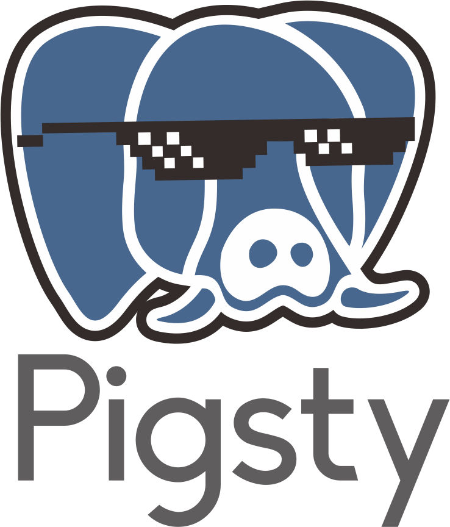
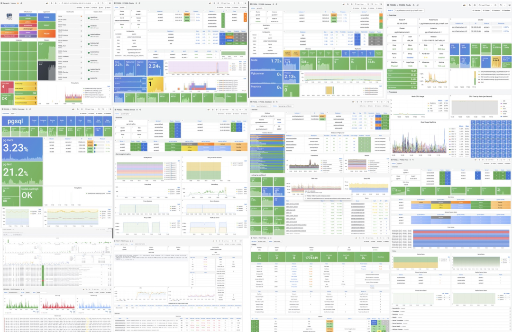
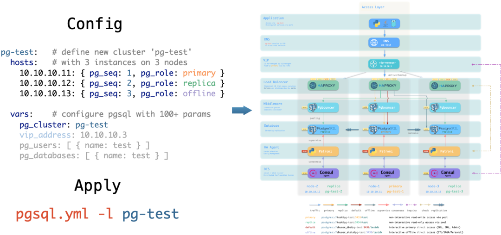
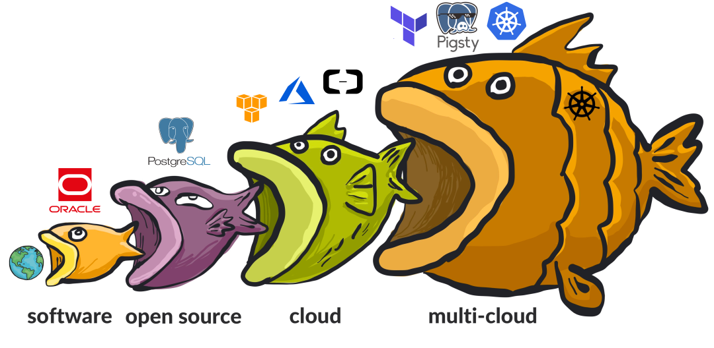
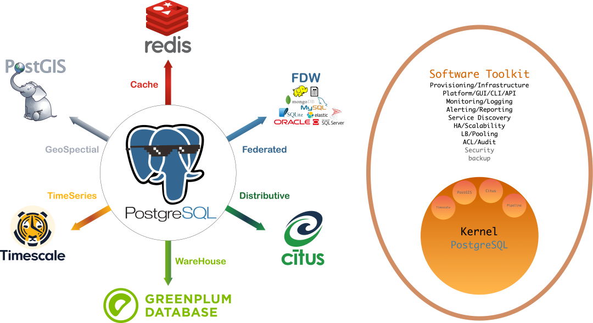
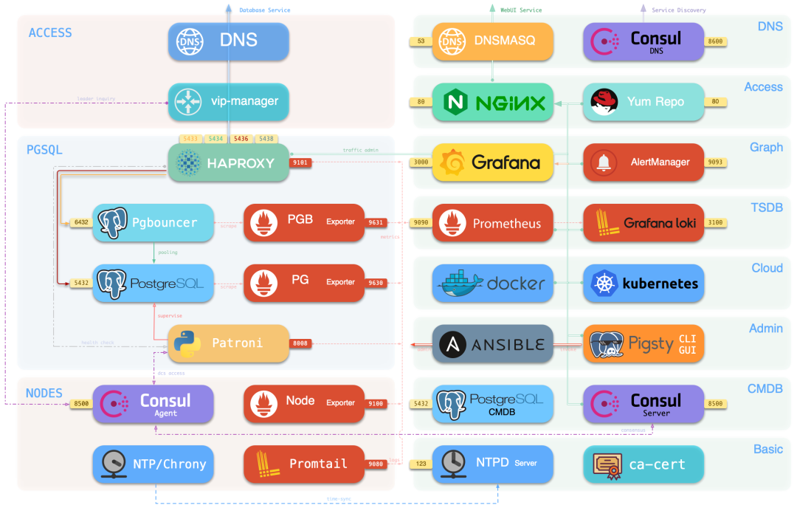
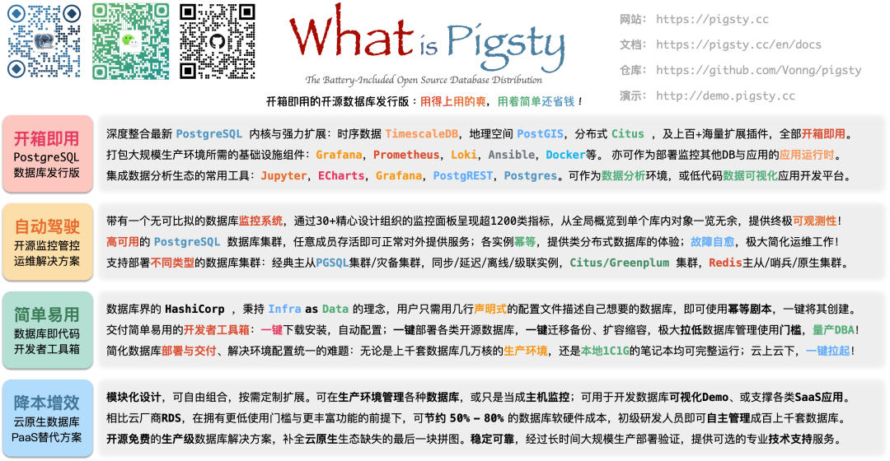

> [Original WeChat Article](https://mp.weixin.qq.com/s/I7OA0thv9Dwvj4zoxIOhJQ) | [Open Source China Article](https://my.oschina.net/oscpyaqxylk/blog/5548404)

**Published by**: OSCHINA Open Source China

**Interviewee**: Feng Ruohang (Pigsty Founder)

-------------

Feng Ruohang has been quite busy lately. After a [startup camp pitch](http://mp.weixin.qq.com/s?__biz=MjM5MzE3NzE1OA==&mid=2247500937&idx=1&sn=132e3fb2dcc0a24172b3472d9adba719&chksm=a6998fa091ee06b6b4a94feedc5ad40b8c7fa44611d39d51f38ae5d276c0b3f9c396b8e514cf&scene=21#wechat_redirect) in June, he added two to three hundred investors to his contacts in one go. However, this was something he "brought upon himself."

Previously, he was a PostgreSQL DBA who wrote an open-source software called Pigsty to help reduce his own workload, making his daily work much easier. Despite having the perfect opportunity to "coast" at work, Feng Ruohang chose to quit and start his own business full-time.

"Starting a business is something most people only get one or two chances at in their lifetime. Since the opportunity is right in front of me, I have no reason not to take it," he explains.

Indeed, Feng Ruohang has that adventurous spirit typical of the post-90s generation. Born in 1993, he loves traveling and hiking. He [quit Apple to travel](http://mp.weixin.qq.com/s?__biz=MzU5ODAyNTM5Ng==&mid=2247484145&idx=1&sn=7e5a47adbe03444458e436cf3f2c2487&chksm=fe4b372ac93cbe3c59047eede7ca9f79a1d4f1b3a1d32accb19880c4729b0e36dd67e5bf7ac6&scene=21#wechat_redirect) for half a year on a whim, and starting his own business was equally spontaneous.

Besides this, he also has that unique "chuunibyou" spirit characteristic of the post-90s generation. He likes adding meme images to product articles. When a client said the name Pigsty (pig pen) was hard to report to leadership, he jokingly replied: "We might very well lose the Middle Eastern market."

When it comes to open source, Feng Ruohang describes himself as a "moderate," which is why he chose the Apache permissive license for Pigsty. Paradoxically, he also holds very radical open-source views, believing the community needs "radicals":

> Open source is a communist revolution aimed at **software freedom**. Developers contribute according to their abilities, and the means of production—software code—is owned collectively by developers, distributed according to need. The open-source movement doesn't care about developers' nationality, and reputation incentives—Stars—have replaced currency. Everyone for me, me for everyone.

**In his view, open source is a revolutionary movement. Previously, the target was closed-source software, but now it's cloud software.**

<iframe src="//player.bilibili.com/player.html?aid=512957015&bvid=BV1o3411w7hP&cid=760975146&p=1" scrolling="no" border="0" frameborder="no" framespacing="0" allowfullscreen="true"> </iframe>

> Pigsty's pitch video from this year, packed with highlights—a must-watch series

-------------

## 01 "Coasting" Led to Entrepreneurial Opportunity

Upon graduating in 2015, Feng Ruohang joined Alibaba as a data development engineer.

> At that time, I was writing SQL for data analysis on that legendary "data middle platform." To improve visualization, I started tinkering with frontend development. To do frontend well, I began working on backend. To master backend, I got into databases. During this period, I also worked on algorithms, hardware-software integration, on-site implementation, product design, algorithms/recommendations, and even served as an architect for an internal startup project.
>
> But after all this exploration, I discovered the most core component was still—the database. This is the heart of the entire information software industry, the boundary between infrastructure and application software. **The moment I first saw PostgreSQL, I fell in love with it. To use it, I carved out a path through Alibaba's MySQL-dominated territory and became a PostgreSQL DBA myself.**

At Alibaba, Feng Ruohang worked his way down from high-level data analysis to the database itself, doing virtually every data-related job. It was during this time that **he discovered [PostgreSQL, this treasure](http://mp.weixin.qq.com/s?__biz=MzU5ODAyNTM5Ng==&mid=2247484591&idx=1&sn=a6ab13d93bfa26fca969ba163b01e1d5&chksm=fe4b3174c93cb862899cbce4b9063ed009bfe735df16bce6b246042e897d494648473eea3cea&scene=21#wechat_redirect)**, and threw himself into it wholeheartedly.

> Note: PostgreSQL's slogan is "The World's Most Advanced Open Source Relational Database." In 2022, according to the [StackOverflow Developer Survey](http://mp.weixin.qq.com/s?__biz=MzU5ODAyNTM5Ng==&mid=2247485170&idx=1&sn=657c75be06557df26e4521ce64178f14&chksm=fe4b3329c93cba3f840283c9df0e836e96a410f540e34ac9b1b68ca4d6247d5f31c94e2a41f4&scene=21#wechat_redirect), PostgreSQL became the **most popular** database among professional developers, as well as the most loved and desired database.

Feng Ruohang's next stop was Apple. "My entrepreneurial idea sprouted at Apple: I created a demonstration sandbox there to share and demonstrate **how a highly available database should be designed, and to visually demonstrate this capability in an intuitive, graphical way**," he explains.

This [prototype](http://mp.weixin.qq.com/s?__biz=MzU5ODAyNTM5Ng==&mid=2247483915&idx=1&sn=1793258171169a5b4a75944302f1ae3a&chksm=fe4b37d0c93cbec69771fc61ef8c75d2f0d29011da74d3e2eba495f8e6221f80c89cb2dd57ad&scene=21#wechat_redirect) included a monitoring system and high-availability PG deployment solution, but was just a rough demo. **Feng Ruohang truly implemented and developed this idea when he was working as a specialized PostgreSQL DBA.**

> At that time, I had to manage tens of thousands of cores across hundreds of PG database instances. This work involved both exciting exploration and optimization, as well as boring maintenance tasks. So in my spare time, I created software to solve all the tedious maintenance work while building the monitoring system needed for exploration and optimization. This became Pigsty.
>
> Pigsty is an acronym for PostgreSQL in Graphic STYle, meaning "Graphical Postgres," because initially its core was a [PG monitoring system](http://mp.weixin.qq.com/s?__biz=MzU5ODAyNTM5Ng==&mid=2247484189&idx=1&sn=19d4381c7ec4bc4498bd56c5ee9f916b&chksm=fe4b36c6c93cbfd06fba1c7a1ad3c5cba8d0060f82acb56e96f0e64694f79c2df9299f0b1115&scene=21#wechat_redirect). I cleverly arranged the English letters to spell "pig pen." **The logo is even more playful—since the Postgres logo is an elephant, and the Chinese saying goes "pig nose with scallion—pretending to be elephant," I cut off the PG elephant's trunk to make it look like a pig head.**

> ▲ Pigsty's logo is actually a "pig with scallions in its nose"

As Feng Ruohang mentioned, initially writing Pigsty was entirely for personal use, with some "coasting" motivation involved. However, the PG community happened to lack a sufficiently user-friendly PostgreSQL [monitoring](http://mp.weixin.qq.com/s?__biz=MzU5ODAyNTM5Ng__&mid=2247484478&idx=1&sn=ea44675df79b60a12273e78b358bb557&chksm=fe4b31e5c93cb8f325ba1e4389874112bd5441280492c87e259a32aa67e00c7e0028e7dc51eb&scene=21#wechat_redirect) / [high availability solution](http://mp.weixin.qq.com/s?__biz=MzU5ODAyNTM5Ng==&mid=2247484546&idx=1&sn=f89c7c3b87b24ee536bfc56b8b51c2d5&chksm=fe4b3159c93cb84f9685da9f8f2a5edc2be7cab3d4ec306c59582a5363c3c6575bfc445eed86&scene=21#wechat_redirect), so he decided to open-source this software to give back to the community.

**During his blissful coasting days, Feng Ruohang never thought about starting a business.** "I believe many open-source software authors probably don't think that far ahead initially—they just create software for personal use." However, Miracle Plus incubator (yes, the one founded by Lu Qi) discovered its value. Pigsty stood out from over 5,000 projects and entered the startup incubation program.

> Miracle Plus scouts approached me proactively. I was quite curious, so I applied. After the interview, I was directly accepted and received seed round investment. I didn't hesitate to accept—this kind of opportunity is extremely rare and allows me to do something I truly want to do, something truly meaningful.

What constitutes truly meaningful work? Feng Ruohang's answer is one word: **Impact**.

> Using Pigsty just for myself would at most let us coast at work. But if I open-source it, the impact goes far beyond that. **A sufficiently good open-source software can immediately improve productivity for the community and even global users, potentially disrupting an entire industry.**
>
> Database installation, deployment, maintenance, and management used to be high-barrier work requiring rare senior open-source DBAs. Pigsty allows junior DBAs, regular developers, and operations staff to handle it easily, while also freeing senior DBAs from tedious operational tasks to focus on more valuable work.
>
> Software as DBA Copilot—**this is genuine [liberation of productivity](http://mp.weixin.qq.com/s?__biz=MzU5ODAyNTM5Ng==&mid=2247485064&idx=1&sn=6225a044d8f145cdb07a21a1e0c54ad8&chksm=fe4b3353c93cba4582576b4de151ac48247052a1494adcc820dc64a32dafb0b99e33085c7bbb&scene=21#wechat_redirect).**

Clearly, what Feng Ruohang wants to achieve is impact, industry advancement, change, and innovation. Therefore, his discourse often contains "inspiring" language, and he shows no mercy toward vested interests. Cloud databases, MySQL, Oracle—all are targets of his criticism. He's somewhat audacious.

-------------

## **02 "Dimensional Reduction Attack" on Cloud Databases**

> Software eats the world, open source eats software, cloud eats open source; who will eat the cloud? It depends on **cloud-native and multi-cloud deployment.**
>
> Cloud-native is a great movement to **reclaim software freedom from public cloud vendors**, and its vision is missing only the final piece of the puzzle.
>
> Even cloud vendors use cloud servers to deploy databases. We will complete this puzzle piece!
>
> **Use cloud servers' advantages to farm cloud databases' fields**, enjoy double convenience, save half the cost!
>
> With IDC hosting/self-built data centers, **cost reductions of 80% are easily achievable!**
>
> We want to **push database barriers to the floor** and return software freedom to users!
>
> Pigsty — Making databases easy for everyone!

The above are Feng Ruohang's exact words from this pitch, **directly targeting cloud databases.** Specifically, his views on cloud databases include the following points:

### **1. At this stage, cloud is indeed devouring open source**

Initially, developing software/information services required using very expensive **commercial database software** like Oracle and SQL Server. With the rise of open-source databases like PostgreSQL/MySQL, users had a new option—using database software without license fees. However, to truly use them well typically required help from open-source database DBAs. Unfortunately, experienced open-source database DBAs are expensive and scarce.

**Then (public) cloud appeared.** Cloud vendors wrapped open-source databases in shells, added their own servers/management/shared DBAs, and created cloud databases. Cloud vendors "hitchhiked" on open-source software, placing open-source software on their cloud platforms to sell and charge fees while rarely giving back. This model concentrates open-source software profits and jobs with cloud vendors, creating monopolies among a few giants and ultimately harming all users' software freedom.

The world has been changed by cloud computing; closed-source software is no longer the most important issue.

"**In 2020, the enemy of computing freedom is cloud computing software**." This is a [manifesto](http://mp.weixin.qq.com/s?__biz=MzU5ODAyNTM5Ng==&mid=2247484735&idx=1&sn=4bd01a8268411de05fdea1d68c429f43&chksm=fe4b30e4c93cb9f27fe36ce24040df71bbe0f1035c4a1db6676cae6e10274c7daf4cdc899072&scene=21#wechat_redirect) from Martin Kleppmann, author of DDIA, in his "**local-first software**" movement. Cloud software refers to software running on vendors' servers, such as: Google Docs, Trello, Slack, Figma, Notion, and the most core software—cloud databases.

### **2. Cloud databases have inherent limitations**

However, Feng Ruohang isn't worried about the threat from cloud databases, for two reasons: **cost and trust.**

**The high cost of cloud databases is a key factor.** Here, Feng Ruohang calculated an account: In the commercial database era, Oracle software licenses could cost up to 10,000 yuan per core per month; cloud databases directly cut prices to the 300-1000 range. From this dimension, saying cloud databases are much cheaper than commercial databases isn't wrong.

Many people see this layer but fail to realize that **compared to the underlying open-source databases/hardware**, cloud databases are still an entire order of magnitude more expensive.

> If we use servers to build open-source databases ourselves, the hardware cost per core per month is only around 20-30 yuan. The main problem with open-source self-deployment is that related talent has high salaries and may even be unavailable at any price, and it's troublesome and difficult to figure out. Assuming you hire an open-source DBA with a monthly salary of 50,000 yuan to manage databases, to amortize their labor cost, your scale should be at least 100+ cores.
>
> However, if we can make open-source databases more user-friendly, making the self-deployed open-source database experience match or exceed that of cloud databases, and on this basis, lower barriers to mass-produce junior and intermediate DBAs, the problem is solved. This allows users to genuinely save 50%-90% on database costs, making self-deployed databases cheaper and better than cloud databases in any situation.
>
> Dimensional reduction attack on cloud databases—this is what we're doing.

**The neutrality of public clouds is a fatal issue.** In business activities, technology is secondary; trust is key. Many public cloud vendors currently **are not truly neutral third parties**, not just doing "water and electricity-like storage and computing" IaaS business as they claim, but grabbing everything from PaaS/SaaS to even the App layer.

Data is the lifeline for many enterprises, and autonomous control is a strong demand. For high-net-worth customers, placing data in potential competitors' data centers is equivalent to putting their fate in others' hands, which is completely unacceptable.

### **3. Open-source software, when done well, is no worse than cloud products**

Public cloud databases/RDS are so-called "out-of-the-box" solutions, but their performance is far from satisfactory: expensive costs, many superuser-privilege functions are castrated, clumsy UI and crude monitoring, and so on.

> Some people think cloud vendors are wealthy with abundant talent and strong technology, so their cloud databases must be excellent. Actually, from a professional DBA's perspective, cloud databases can only be called [adequate, mediocre solutions](http://mp.weixin.qq.com/s?__biz=MzU5ODAyNTM5Ng==&mid=2247485093&idx=1&sn=5815f71f1d832101d35a75f5aa4acd3c&chksm=fe4b337ec93cba68fbf30eb0ed50d052c6e8972d42cf506051b5016668f4555edaa0756688dc&scene=21#wechat_redirect). When done well, open-source software is no worse than cloud products.

After long-term iterative development, Pigsty now does many things better than cloud databases.

Take **observability** as an example: Alibaba Cloud RDS for PostgreSQL provides 8 database-related monitoring metrics, commercial monitoring software DataDog provides 69, and AWS's advanced monitoring has 99 categories. But Pigsty includes 675 categories of pure database metrics, comprehensively collected, using data analysis approaches for monitoring.

In **reliability**, Pigsty does everything cloud databases do: master-slave replication, automatic failover (RTO=30s), geo-distributed disaster recovery clusters, synchronous commit (so-called "financial-grade high availability," RPO=0), cold backup and WAL archiving. Pigsty also does what cloud vendors haven't: delayed replicas, offline ETL instances, idempotent service access, etc.

**Maintainability** directly relates to user experience, so Pigsty has done extensive work on usability, aiming to be "out-of-the-box." One-click download, configuration, and installation; declare the database you want using Database as Code; one-click deployment, destruction, and scaling.

> Making databases on physical/virtual machines feel like K8S.

From core monitoring and management to continuously added various features, Pigsty always closely follows real user needs.

> I believe software development follows the same principles as natural selection: truly useful software is evolved, used, and grown; not designed by someone's brainstorming. It must be refined by specific environments and driven by real needs.
>
> Product managers must think from users' perspectives. **I am the customer myself, so I know exactly what I want.**

Here, Feng Ruohang points out another shortcoming of cloud databases: not thinking from users' perspectives. Just like car manufacturers should consider how drivers drive, **many current database vendors don't consider "the driver's driving experience."**

### **4. In the post-cloud era, cloud will retreat to IaaS**

Software eats the world, open source eats software, cloud eats open source. So who will eat the cloud? In Feng Ruohang's eyes, cloud vendors are currently the defenders, needing competitors to shake things up. **In the post-cloud era, software usage paradigms will shift again, and open-source communities should see this and seize this historic opportunity.**

Feng Ruohang states that cloud vendors have raised cloud service pricing far beyond reasonable ranges, which is unsustainable. Once open-source products like Pigsty emerge in various software fields, they will comprehensively squeeze the public cloud PaaS/SaaS ecosystem. This phenomenon is happening:

> Cloud vendors' foundation is IaaS. Their story is: making computing and storage resources like utilities, playing the role of infrastructure providers. Public cloud vendors use economies of scale to reduce hardware costs and amortize labor costs, giving them advantages in storage and computing prices. But this doesn't hold for PaaS/SaaS.
>
> Cloud vendors don't invest many people in any specific field, and the quality varies. More importantly, they lack the focused dedication, courage, and vitality of startups fighting with their backs to the wall. Besides, top talent with this vision and understanding have come out to start businesses. For example, Sealos from our same batch and group left Alibaba Cloud to do open-source software entrepreneurship, providing out-of-the-box Kubernetes. We're "rolling" cloud vendors from different directions.
>
> I believe in the coming years, such open-source startups will spring up like mushrooms after rain, beating cloud vendors' PaaS/SaaS to pieces. The equilibrium point of this game will be cloud vendors converging to the IaaS layer, while PaaS and SaaS layers are divided among many similar open-source software companies.

-------------

## **03 Open Source is the Highest Program**

In February 2022, Miracle Plus startup camp found him. Counting from then, Feng Ruohang has only been doing full-time entrepreneurship for two to three months. If this pitch goes smoothly, he will complete Pre-A round financing while also building his team—a lean team of fewer than ten people.

For this pitch, he personally took the stage, introducing Pigsty to 2,500 investors and over 1,000 investment institutions. With a Ballmer-style [sales talk show](http://mp.weixin.qq.com/s?__biz=MzU5ODAyNTM5Ng==&mid=2247485126&idx=1&sn=455f35f378e1c252aa52ceff3ebef976&chksm=fe4b331dc93cba0bfdd9d15147cf5230fe78609cba440e3dd48e35ce9b1c61d1306236b3ebaa&scene=21#wechat_redirect), he attracted the entire audience's attention. "This is indeed a big challenge for an engineer like me, but if I don't go up, who will?" Feng Ruohang laughed.

But Feng Ruohang is not alone. Before this, Pigsty was a purely charitable open-source project aimed at promoting PostgreSQL, so it has considerable connections with the PostgreSQL Chinese community. With community support, Pigsty has grown rapidly. Many seed users are members of the PostgreSQL Chinese community. Many users provide feedback on requirements, and some users roll up their sleeves to contribute, then submit patches back to them.

Now, Pigsty's features and functions continue to expand, already supporting more open-source databases and various software tools. Details: https://pigsty.cc/zh/docs/feature/

The essence of open-source software is "use at your own risk," but some users still hope commercial companies can provide some backing when using Pigsty in production environments. Therefore, Feng Ruohang began preparing and established "Pigsty Cloud Data" company to provide professional support subscriptions for users. The relationship between Pigsty Cloud Data and the PG community is like Red Hat to the Linux community: **"I contribute to the community, the community makes me money."**

Feng Ruohang believes **the community is the core moat for this type of open-source software.** He uses TiDB as an example:

> TiDB's most powerful aspect is having an active user/developer community. They first had the product, then the community, while we're exactly the opposite.
>
> "The PostgreSQL Chinese community has no R&D function—it's more like a user group and trade show, without a real flagship product as a 'condensation nucleus.' Pigsty aims to occupy this ecological niche."

In terms of open-source progress, Pigsty is still in a very early stage. Currently, they have 638 Stars and 6 contributors on GitHub (data as of July 7, 2022). While unremarkable, Feng Ruohang is optimistic:

> It's normal for early projects to have few Stars, and the database field has high barriers, so Stars have higher value than other fields. TimescaleDB only had around 4,000 Stars when they reached Series C. We care more about growth patterns, and currently Stars are showing exponential growth curves—I'm not worried at all.
>
> More importantly, we've been doing Buddhist-style promotion—just speaking at database conferences and writing WeChat articles, relying entirely on word-of-mouth viral spread. As long as we're willing to promote and operate, growth will be fast. For example, recently we submitted to PostgreSQL Weekly and gained over 100 Stars at once.
>
> Although we don't have many contributors currently, external contributions are quite substantial. We believe contributors should be about quality, not quantity—the number of contributors who fix typos has no real meaning.
>
> More than PRs, we need feedback from real users to help us further polish our product. We now have a very active user group where everyone provides various usage opinions—our feedback mainly comes from here.

Currently, Pigsty leverages its open-source advantage and is used across various industries, including internet companies, military units, meteorological agencies, research institutes, aerospace, hospitals, etc., including both state-owned and foreign enterprises. In a user [survey](http://mp.weixin.qq.com/s?__biz=MzU5ODAyNTM5Ng==&mid=2247484979&idx=1&sn=6b7afac9905b3d07ed7c1d43f8a2e464&chksm=fe4b33e8c93cbafebfa00b72273a9194fc1fbb468d9ef28d993cfaaeebe27372bb9507fa9aa5&scene=21#wechat_redirect) two months ago, Pigsty achieved an NPS score of 80%.

> Note: **NPS (Net Promoter Score)**, also called Net Promoter Score or word-of-mouth, measures users' overall willingness to recommend products/services to others. It's the most popular customer satisfaction metric.

"This is quite an amazing value—the software industry's average NPS is roughly 31%," Feng Ruohang states. Because of the excellent user feedback, Feng Ruohang has set his current goal as: **"Making Pigsty the de facto standard for using PG well."**

At the same time, Feng Ruohang believes **the most exciting part of Pigsty is open source**. He firmly believes open source can disrupt closed-source software and also impact cloud vendors.

> This gives you a sense of nobility and mission—you're fighting for all humanity's freedom to use software. Even if my company fails and closes, my software can live on and make this world better. Isn't that a wonderful thing?
>
> Of course, I'm not a lone hero. The entire **Cloud Native** movement is collectively impacting public cloud. There's a blank ecological niche in databases—if I don't do it, naturally someone else will. Some companies abroad are doing similar things, such as StackGres and CloudNativePG focused on putting PostgreSQL into K8S, and Aiven helping users use open-source databases well.

Feng Ruohang believes that in a few years, **cloud and open source will reach a new game equilibrium.** Just like Microsoft, once the arch-enemy of the open-source movement, now chooses to embrace open source, public cloud vendors will surely have such a day—reaching reconciliation with open source, calmly accepting their role as infrastructure suppliers, providing water and electricity-like storage and computing resources for everyone.

(End)

-------------

## References

Chinese site: https://pigsty.cc

English site: https://pigsty.cc/en/

Official demo: https://demo.pigsty.cc

GitHub repository: https://github.com/Vonng/pigsty