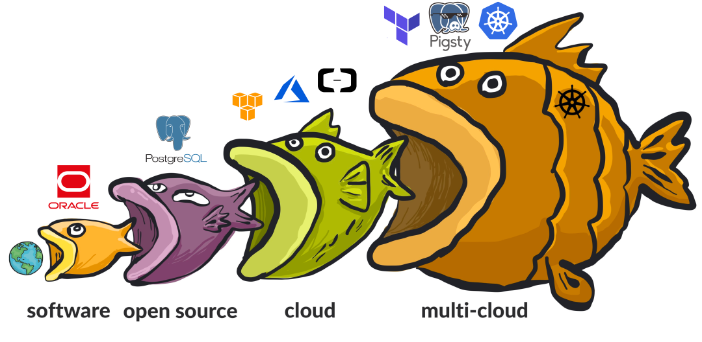
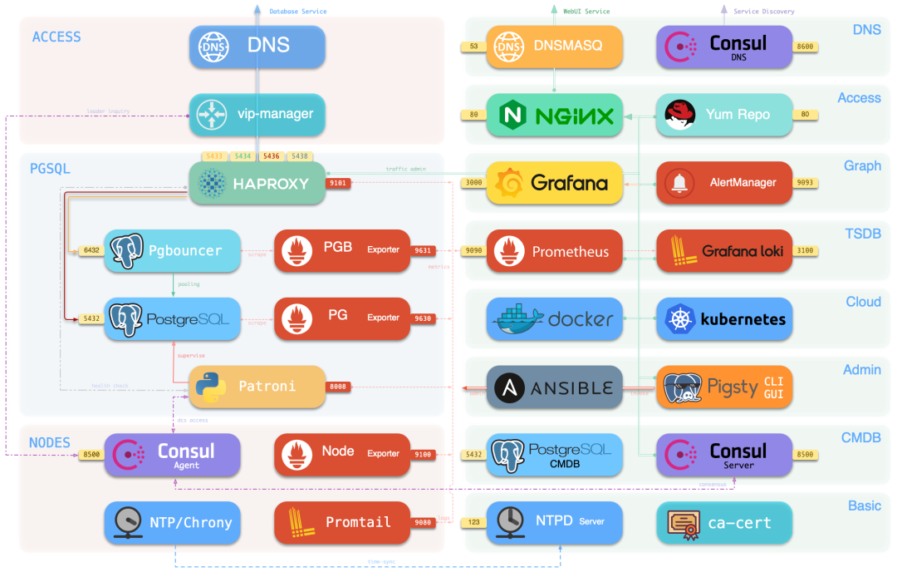
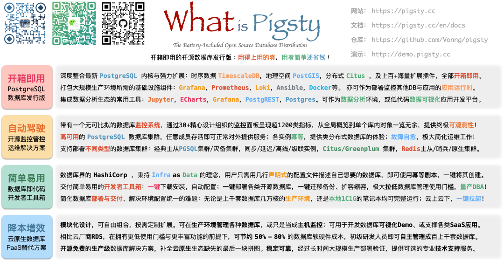

> [微信公众号原文](https://mp.weixin.qq.com/s/I7OA0thv9Dwvj4zoxIOhJQ) | [开源中国文章](https://my.oschina.net/oscpyaqxylk/blog/5548404)

出品：OSCHINA 开源中国

被访者：冯若航（ Pigsty 创始人）

-------------

冯若航最近很忙，6 月一场[创业营路演](http://mp.weixin.qq.com/s?__biz=MjM5MzE3NzE1OA==&mid=2247500937&idx=1&sn=132e3fb2dcc0a24172b3472d9adba719&chksm=a6998fa091ee06b6b4a94feedc5ad40b8c7fa44611d39d51f38ae5d276c0b3f9c396b8e514cf&scene=21#wechat_redirect)下来，他一次性加了两三百个投资人。不过，这也是他 “自找” 的。

此前，他是一名 PostgreSQL DBA，为了减少自己的工作量，写了一个开源软件 —— Pigsty 帮自己干活，日子越发好过了起来。明明可以 “摸鱼” 度日，冯若航却非要选择出来全职创业。

“创业这种事儿吧，一般人一辈子也就是一两次机会，既然摆在面前了，我没理由不去做。” 他这样回答。

的确，冯若航有一股 90 后那种冒险精神在。1993 年出生的他喜欢旅行徒步，从 Apple [裸辞壮游](http://mp.weixin.qq.com/s?__biz=MzU5ODAyNTM5Ng==&mid=2247484145&idx=1&sn=7e5a47adbe03444458e436cf3f2c2487&chksm=fe4b372ac93cbe3c59047eede7ca9f79a1d4f1b3a1d32accb19880c4729b0e36dd67e5bf7ac6&scene=21#wechat_redirect)半年说走就走，出来全职创业也是说走就走。

除此之外，他还有带着一股 90 后特有的迷之 “中二魂”，喜欢在产品文章中加一些沙雕表情包，有客户说 Pigsty（猪圈）名字不好给领导汇报，他也开玩笑回：“很可能会痛失中东市场”。 

在开源上，冯若航自称是 “温和派”，所以他为 Pigsty 采用了 Apache 宽松许可证。但矛盾的是，他又有着十分激进的开源态度，认为社区需要 “激进派”：

> 开源是一场以**软件自由**为目的的共产主义革命。开发者各尽所能，生产资料 —— 软件代码 为开发者共有，按需分配。开源运动不在乎开发者的国籍，声望激励 — Star 也取代了货币，人人为我，我为人人。

**在他看来，开源是一场革命运动，以前的革命对象是闭源软件，而现在则是云软件。**

<iframe src="//player.bilibili.com/player.html?aid=512957015&bvid=BV1o3411w7hP&cid=760975146&p=1" scrolling="no" border="0" frameborder="no" framespacing="0" allowfullscreen="true"> </iframe>

> Pigsty 今年的路演宣传视频，重点超多，不看吃亏系列

-------------

## 01 “摸鱼” 摸出创业机会

2015 年一毕业，冯若航就进了阿里，成为了一名数据研发工程师。

> 那时候，我在那个传说中的 “数据中台” 上写 SQL 做数据分析。为了做好可视化，开始折腾前端。为了做好前端，开始折腾后端。为了折腾好后端，我又去搞起数据库。期间，我还做过算法、软硬件结合、上门实施、产品设计、算法 / 推荐，甚至当过一个内部创业项目的架构师。
>
> 但搞来搞去，我发现最核心的东西还是 —— 数据库。这是整个信息软件行业的核心，基础设施与应用软件的边界。**第一眼看到** **PostgreSQL，我就迷上了它。为了用它，硬是在阿里 MySQL** **的天下杀出一条血路，自己干起了 PostgreSQL DBA。**

在阿里，冯若航从最顶端的数据分析一路下钻到数据库本身，有关数据的一系列工作他都做了个遍。也就是在那时候，**他发现了 [PostgreSQL 这个宝藏](http://mp.weixin.qq.com/s?__biz=MzU5ODAyNTM5Ng==&mid=2247484591&idx=1&sn=a6ab13d93bfa26fca969ba163b01e1d5&chksm=fe4b3174c93cb862899cbce4b9063ed009bfe735df16bce6b246042e897d494648473eea3cea&scene=21#wechat_redirect)**，并全心全意地投入了进去。

> 注：PostgreSQL 的 Slogan 是 “世界上最先进的开源关系型数据库”。在 2022 年 ，[StackOverflow 开发者调研](http://mp.weixin.qq.com/s?__biz=MzU5ODAyNTM5Ng==&mid=2247485170&idx=1&sn=657c75be06557df26e4521ce64178f14&chksm=fe4b3329c93cba3f840283c9df0e836e96a410f540e34ac9b1b68ca4d6247d5f31c94e2a41f4&scene=21#wechat_redirect)中，PostgreSQL 成为专业开发者中**最流行**的数据库，以及开发者最喜爱、最想用的数据库。

冯若航的下一站是苹果。“ 我创业的想法萌发于 Apple：我在那儿做了一个演示用的沙箱，用来给大家分享演示**一个高可用的数据库应该怎么设计，并用直观的图形化的方式演示出这种能力**。” 他表示。

这个[雏形](http://mp.weixin.qq.com/s?__biz=MzU5ODAyNTM5Ng==&mid=2247483915&idx=1&sn=1793258171169a5b4a75944302f1ae3a&chksm=fe4b37d0c93cbec69771fc61ef8c75d2f0d29011da74d3e2eba495f8e6221f80c89cb2dd57ad&scene=21#wechat_redirect)带有一个监控系统与高可用 PG 部署方案，只是一个粗略的 Demo。**冯若航真正把这个想法落地发扬光大，其实是在专门做 PostgreSQL DBA 的时候。**

> 那时我要管理上万核 / 几百套 PG 数据库。这个活既有精彩有趣的探索优化，也有无聊乏味的运维管理。于是我在业余时间搞了个软件，把无聊又乏味的运维工作全部用软件给解决了，同时把探索优化所需的监控系统做了起来，这就是 Pigsty。
>
> Pigsty 是 PostgreSQL in Graphic STYle 的缩写，即 “图形化 Postgres”，因为最开始它的核心是一 个 [PG 的监控系统](http://mp.weixin.qq.com/s?__biz=MzU5ODAyNTM5Ng==&mid=2247484189&idx=1&sn=19d4381c7ec4bc4498bd56c5ee9f916b&chksm=fe4b36c6c93cbfd06fba1c7a1ad3c5cba8d0060f82acb56e96f0e64694f79c2df9299f0b1115&scene=21#wechat_redirect)，用英文凑出个猪圈的缩写；**而** **Logo** **则更为戏谑，Postgres LOGO** **是大象，而 “猪鼻子插葱 —— 装象”，我就把** **PG** 大象的鼻子截断了变成猪头。

> ▲ Pigsty 的 LOGO 其实是个 “鼻子插葱的猪”

就像冯若航所说的那样，最开始写 Pigsty 完全是自用，多少有点 “摸鱼” 的目的在里面。不过 PG 社区正好缺少一个足够好用的PostgreSQL [监控](http://mp.weixin.qq.com/s?__biz=MzU5ODAyNTM5Ng==&mid=2247484478&idx=1&sn=ea44675df79b60a12273e78b358bb557&chksm=fe4b31e5c93cb8f325ba1e4389874112bd5441280492c87e259a32aa67e00c7e0028e7dc51eb&scene=21#wechat_redirect) /[ 高可用方案](http://mp.weixin.qq.com/s?__biz=MzU5ODAyNTM5Ng==&mid=2247484546&idx=1&sn=f89c7c3b87b24ee536bfc56b8b51c2d5&chksm=fe4b3159c93cb84f9685da9f8f2a5edc2be7cab3d4ec306c59582a5363c3c6575bfc445eed86&scene=21#wechat_redirect)，所以他就想把这个软件开源出来，回馈社区。

**摸鱼的快乐时光里，冯若航完全没有想过创业**，“我相信很多开源软件作者在最开始的时候可能不会想得那么远，只是做个软件给自己用。” 而奇绩创坛（没错，就是陆奇发起的那个）孵化器发现了它的价值，Pigsty 从 5000 多个项目里脱颖而出，进入了创业孵化。

> 奇绩创坛的 Scout 主动找到我，我也挺好奇就报了名，面试完就直接就入了围，给到了种子轮投资。我没有什么犹豫就接受了，这种机会非常难得，能让我有机会去做自己真正想做、真正有意义的事。

什么是真正有意义的事情？冯若航的答案是一个词：**Imapact（影响）**。

> Pigsty 给自己用，无非是能让我们上班摸鱼。但是如果开源出去，影响力就远不止于此了。**一个足够好的开源软件，能立竿见影地提高社区乃至全球用户的生产力，甚至颠覆一个行业。**
>
> 数据库的安装部署维护管理曾经是一件门槛很高的事情，以前需要稀有的高级开源 DBA，Pigsty 让初级 DBA / 普通研发 / 运维也可以轻松胜任，也能让高级 DBA 从琐碎无聊的运维性事务抽身，投入到更有价值的工作中去。
>
> Software as DBA Copilot，**这是实打实的[解放生产力](http://mp.weixin.qq.com/s?__biz=MzU5ODAyNTM5Ng==&mid=2247485064&idx=1&sn=6225a044d8f145cdb07a21a1e0c54ad8&chksm=fe4b3353c93cba4582576b4de151ac48247052a1494adcc820dc64a32dafb0b99e33085c7bbb&scene=21#wechat_redirect)。**

显然，冯若航想要实现的是影响力，是行业推动，是变化，是革新。因此，在他的话语体系中常常会出现 “令人振奋” 的话语，对既得利益者，他也毫不留情。云数据库、MySQL、Oracle 等等都是他臧否的对象，有点子狂。

-------------

## **02 “降维打击” 云数据库**

> 软件吞噬世界，开源吞噬软件，云吞噬开源；谁来吃云？还看**云原生与多云部署。**
>
> 云原生是一场**从公有云厂商夺回软件自由**的伟大运动，而其图景中还缺少最后一块拼图。
>
> 即便云厂商，也在使用云服务器来部署数据库， 我们，将补完这块拼图！
>
> **用云服务器的牛，耕云数据库的田**，享受双重便利，立省一半开销！
>
> 若用 IDC 托管 / 自建机房，**成本砍掉 80% 都打不住！**
>
> 我们要把数**据库的门槛压到地板**，要把软件自由交还用户！
>
> Pigsty —— 让天下没有难用的数据库！

以上是冯若航这次路演的原话，**目标直指云数据库。**具体来说，他针对云数据库的观点主要有以下几个：

### **1、在这一阶段，云的确是在吞噬开源**

在最初，开发软件 / 信息服务需要使用非常昂贵的**商业数据库软件**，例如 Oracle 与 SQL Server。随着 PostgreSQL / MySQL 这些开源数据库的兴起，用户们有了一个新的选择，不用软件授权费用即可使用数据库软件，但想真正用好，通常需要开源数据库的 DBA 帮助。不幸的是，资深开源数据库 DBA 昂贵又稀缺。

**接下来（公有）云出现了。**云厂商将开源数据库套上壳，加上自己的服务器 / 管控 / 共享 DBA，便成为了云数据库。云厂商通过 “搭便车” 吸血开源软件，将开源软件放在自家的云平台售卖收费却鲜有回馈。这样的模式将导致开源软件利润与岗位向云厂商集中，形成少数巨头垄断，最终伤害到所有用户的软件自由。

世界已经被云改变了，闭源软件早已不是最重要的问题了。

“**在 2020 年，计算自由的敌人是云计算软件**”。这是 DDIA 作者 Martin Kleppmann 在其 “**本地优先软件****”** 运动中提出的 [宣言](http://mp.weixin.qq.com/s?__biz=MzU5ODAyNTM5Ng==&mid=2247484735&idx=1&sn=4bd01a8268411de05fdea1d68c429f43&chksm=fe4b30e4c93cb9f27fe36ce24040df71bbe0f1035c4a1db6676cae6e10274c7daf4cdc899072&scene=21#wechat_redirect)。云软件指的是运行在供应商服务器上的软件，例如：Google Docs、Trello、Slack、Figma、Notion，以及最核心的软件 —— 云数据库。

### **2、云数据库有先天不足之处**

但冯若航却不担心云数据库的威胁，原因有二：**一是成本，二是信任。**

**云数据库高昂的成本是一个关键原因**。说到这里，冯若航算了一个账：在商业数据库的时代，Oracle 软件授权费能高达万元 / 核・月；而云数据库则直接将价格砍到了 300～1000 的范围。这一维度上，要说云数据库比商业数据库便宜很多没毛病。

很多人看到了这一层，却没有意识到**相比起底下的开源数据库 / 硬件来说**，云数据库仍贵了整整一个数量级。

> 如果我们自己用服务器去搭开源数据库，每个核月的硬件成本也就是二三十块钱的水平。开源自建的主要问题在于，相关人才工资高昂甚至有价无市，折腾起来又麻烦更难折腾明白。假设您雇佣一个月薪 5 万的开源 DBA 来管理数据库，那么想要摊平其人力成本，用户的规模至少应当在 100 核以上。
>
> 但是，如果我们能让开源数据库变得更好用，让开源自建数据库的体验持平甚至超越云数据库；并在此基础上，通过压低门槛来量产初中级 DBA，问题就迎刃而解，让用户实打实省去 50% ～ 90% 的数据库开销，让自建数据库在任何情况下都比云数据库省钱且好用。
>
> 降维打击云数据库，这就是我们在做的事情。

**公有云的中立性则是一个致命问题**。在商业活动中，技术是次要因素，信任才是关键。不少公有云厂商现阶段**并不是真正意义上的中立第三方**，并不是自己宣称的那样只做 “像自来水一样的存储算力” 的 IaaS 生意，而是 PaaS/SaaS 甚至 App 层一把抓。

数据是很多企业的生命线，自主可控是一个强需求。对高净值客户来说，将数据放在潜在竞对的机房里，等于将自己的命运交于别人手中，这是完全无法接受的。

### **3、开源软件要做起来，一点也不比云产品差**

公有云数据库 / RDS，是一种所谓 "开箱即用" 的解决方案，但它交出的答卷离满意还差得远：昂贵的成本，许多需要超级用户权限的功能被阉割，笨拙的 UI 与简陋的监控，诸如此类。

> 有人觉得云厂商财大气粗，人才济济技术过硬，做的云数据库肯定非常牛逼。实际上在专业 DBA 看来，云数据库只能称得上是[及格堪用的大锅饭](http://mp.weixin.qq.com/s?__biz=MzU5ODAyNTM5Ng==&mid=2247485093&idx=1&sn=5815f71f1d832101d35a75f5aa4acd3c&chksm=fe4b337ec93cba68fbf30eb0ed50d052c6e8972d42cf506051b5016668f4555edaa0756688dc&scene=21#wechat_redirect)。开源软件要做起来，一点也不比云产品差。

经过长期迭代演进，Pigsty 目前已经有很多地方做得比云数据库更好用了。

以**可观测性**为例，阿里云 RDS for PostgreSQL 提供 8 个与数据库相关的监控指标，商业监控软件 DataDog 提供 69 个，AWS 的高级监控有 99 类。但 Pigsty 包含了 675 类纯数据库指标，应收尽收，用数据分析的思路做监控。

在**可靠性**上，云数据库做的 Pigsty 都做了。主从复制、自动故障切换（RTO=30s）、异地灾备集群、同步提交（所谓 “金融级高可用”，RPO=0）、冷备份与 WAL 归档；云厂商没做的，Pigsty 也做了，延迟从库、离线 ETL 实例、幂等服务接入等等。

**可维护性**直接关系使用体验，因此 Pigsty 在易用性上做了非常多的工作，旨在做到 “开箱即用”。一键下载配置安装，用 Database as Code 的方式声明自己想要的数据库，一键拉起、销毁、扩缩容。

> 把物理机 / 虚拟机上的数据库，用出了 K8S 的 Feel。

从核心的监控管控，到不断新增的各种功能，Pigsty 一直紧跟用户真实需求。

> 我认为软件开发与自然选择遵循同样的原理：真正好用的软件是演化出来的、用出来的、长出来的；而不是谁拍脑袋设计出来的。它一定要用具体环境打磨，由真实需求驱动。
>
> 产品经理必须站在用户的立场去换位思考，**我自己就是甲方用户，所以很清楚自己要什么。**

说到这里，冯若航又点出了云数据库的另一个不足：没有站在用户的角度想问题，就好像造车厂家应该考虑司机如何开车一样，**现在很多数据库厂商都没有考虑 “司机的驾驶体验”。**

### **4、后云时代，云将会退回到 IaaS**

软件吞噬世界，开源吞噬软件，云吞噬开源。那么，谁来吃掉云呢？在冯若航眼里，云厂目前是守擂方，需要有竞争者来松动松动。**后云时代，软件使用范式将再一次发生转变，开源社区们应该看到这点，把握好这个历史性机会。**

冯若航表示，云厂商将云服务的定价抬到了远超合理范围的地步，这样是不可持续的。各个软件领域一旦涌现出像 Pigsty 这样的开源产品，就会全方位挤占公有云 PaaS/SaaS 生态位。而这一现象正在发生：

> 云厂商的基本盘是 IaaS，他们的故事是：让计算和存储资源像水电一样，自己扮演基础设施的提供者的角色。公有云厂商通过规模效应，压低硬件成本并均摊人力成本，在存储算力价格上很有优势。但在 PaaS/SaaS 上，这是不成立的。
>
> 云厂商真正投入到一个细分领域的人不会太多且良莠不齐，更重要的是没有创业公司破釜沉舟的专注与投入、勇气与活力。此外有这个视野认知的顶尖人才都出来创业了，例如我们同届同组的 Sealos 就是从阿里云出来，搞开源软件创业，提供开箱即用的 Kubernetes，我们分别从不同的方向去 “卷” 云厂商。
>
> 我相信在未来的几年里，这样的开源创企会像雨后春笋一样冒出来，把云厂商的 PaaS/SaaS 打得七零八落。而博弈的均衡点就是，云厂商收敛到 IaaS 层，而 PaaS 层和 SaaS 层则由诸多类似的开源软件企业所瓜分。

-------------

## **03 开源是最高纲领**

2022 年 2 月，奇绩创坛创业营找到他，算起来冯若航出来全职创业也不过是两三个月的事。如果这次路演顺利，他将完成 Pre A 轮融资，同时他也拉起了队伍 —— 一个不到十人的精干团队。

这次路演他亲自上阵，在 2500 个投资人、1000 多家投资机构面前介绍 Pigsty，凭借一段鲍尔默式的[推销脱口秀](http://mp.weixin.qq.com/s?__biz=MzU5ODAyNTM5Ng==&mid=2247485126&idx=1&sn=455f35f378e1c252aa52ceff3ebef976&chksm=fe4b331dc93cba0bfdd9d15147cf5230fe78609cba440e3dd48e35ce9b1c61d1306236b3ebaa&scene=21#wechat_redirect)吸引了全场的注意力。“对我这种工程师确实是很大的挑战，但我不上谁上呢？” 冯若航笑说。

但冯若航并不孤单。在此之前，Pigsty 是一个以推广 PostgreSQL 为目的纯公益开源项目，因此它与 PostgreSQL 中文社区的颇有渊源。在社区的加持下，Pigsty 成长得很快。很多种子用户都是 PostgreSQL 中文社区的成员，有大量的用户会反馈需求，也有一些用户会撸起袖子自己上，然后把 Patch 提回给他们。

如今，Pigsty 的特性和功能不断在丰富，已经开始支持更多开源数据库以及各类软件工具，详情可戳：https://pigsty.cc/zh/docs/feature/

开源软件的要义是风险自负，可一些用户在生产环境中使用 Pigsty 时，还是希望能够有商业公司提供一些兜底。因此，冯若航也就开始着手准备，成立了 “磐吉云数” 公司为用户提供专业支持订阅。磐吉云数和 PG 社区的关系，就好比红帽之于 Linux 社区：“**我给社区做贡献，社区让我赚大钱**。”

冯若航认为，**社区是这类开源软件的核心壁垒。**他以 TiDB 为例： 

> TiDB 最厉害的地方就在于它有一个活跃的用户 / 开发者社区，它们先有产品再有社区，而我们恰好相反。
>
> ”PostgreSQL 中文社区没有研发职能，更像是用户组与展销会，没有一个真正的拳头产品作为 “凝结核”。Pigsty 就旨在占领这个生态位。

在开源进展上，Pigsty 还处于非常早期的状态。目前，他们在 GitHub 上有 638 个 Star 和 6 个贡献者（数据截至 2022 年 7 月 7 日），虽不起眼，但冯若航对此表示乐观：

> 早期项目 Star 数少是正常的，而且数据库领域门槛本来就很不低，Star 含金量比其他领域高。TimescaleDB 融到 C 轮也不过才 4000 左右的 Star。我们更关注增长的模式，况且目前 Star 是指数增长的曲线，我一点儿都不担心。
>
> 更重要的是，我们之前都是佛系推广，也就是去数据库会议上做个演讲，公众号写点文章这种，全凭口碑发酵传播。只要肯去推广运营，增长就会很快。举个例子，前一阵子我们在 PostgreSQL Weekly 投了个稿，一口气就多了 100 多个 Star。 
>
> 虽然目前贡献者不多，但外部贡献的功能都比较有份量。我们认为 Contributor 应该贵精不贵多，修 Typo 的贡献者数量没有实质意义。
>
> 比起 PR，我们更需要的是来自真实用户的反馈来帮助我们进一步打磨好产品。我们现在有一个非常活跃的用户群组，大家会提出各种各样的使用意见，我们的反馈主要来自这里。

目前，Pigsty 凭借开源优势，被各行各业所使用，其中包括互联网企业、部队、气象单位、科研院所、航天、医院等等，既有国企，也有外企。而在前两个月的用户[问卷调研](http://mp.weixin.qq.com/s?__biz=MzU5ODAyNTM5Ng==&mid=2247484979&idx=1&sn=6b7afac9905b3d07ed7c1d43f8a2e464&chksm=fe4b33e8c93cbafebfa00b72273a9194fc1fbb468d9ef28d993cfaaeebe27372bb9507fa9aa5&scene=21#wechat_redirect)中，Pigsty 的 NPS 分数达到 80%。

> 注：**NPS（Net Promoter Score)** ，净推荐值，亦可称口碑，用于衡量用户向其他人推荐产品 / 服务的整体意愿，是最流行的用户满意度指标。

“这是一个相当惊人的值，要知道软件行业的平均 NPS 大致在 31%。” 冯若航表示。正因为用户反馈非常好，冯若航将现在的目标定为：**“把 Pigsty 打造成用好 PG 的一个事实标准。”**

与此同时，冯若航认为 Pigsty **最令人激动的部分就是开源**，他坚定相信开源能够对闭源软件进行颠覆，同样也能对云厂商造成冲击。

> 这让人有一种崇高感和使命感，你是为了全人类使用软件的自由而奋斗的。假使我的公司失败倒闭了，但我的软件可以活下去，并让这个世界变得更好，这不也是一件很好的事情吗？
>
> 当然，我可不是孤勇者，整个 **Cloud Native** 运动正在整体冲击公有云。数据库这里有一块空白生态位，我不去做自然也会有其他人。国外也有一些公司在做类似的事情，譬如专注把 PostgreSQL 放入 K8S 的 StackGres 与 CloudNativePG，以及帮助用户用好开源数据库的 Aiven等等。

冯若航相信，用不了几年，**云与开源就会产生新的博弈均衡。**正如当年开源运动的死对头微软，现在也选择拥抱开源。公有云厂商肯定也会有这一天，与开源达成和解，心平气和地接受基础设施供应商的角色定位，为大家提供水与电一般的存算资源。

（完）

-------------

## 参考

中文站点：https://pigsty.cc

英文站点：https://pigsty.cc/en/

官方演示：https://demo.pigsty.cc

GitHub 仓库：https://github.com/Vonng/pigsty
