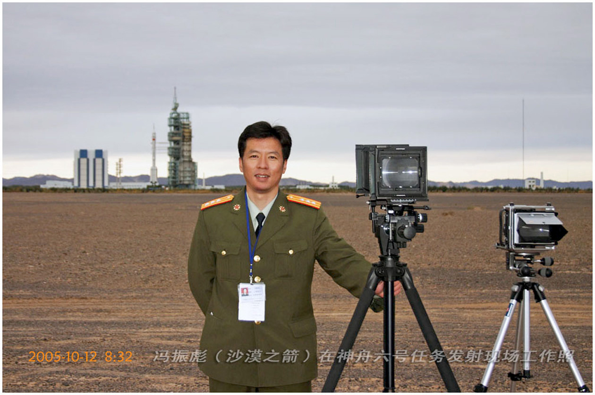

While organizing the study room, I discovered my late father's autobiography. What should have been standard bureaucratic prose in an archive turned out to contain remarkable content.

> Reflections on old and new society, comparative interviews between KMT and CCP.
>
> Political essays on the origins of the Cultural Revolution
>
> Philosophical papers on logic
>
> Thoughts on 'Socialism with Chinese Characteristics'
>
> Gongga Snow Mountain survival adventures.
>
> Life in 1989 and university years.
>
> Anecdotes about anti-ship ballistic missiles.
>
> How to be a 'launch test architect'.
>
> Insights from a veteran amateur photographer

This should be said to be a fascinating autobiography.

These 100 pages record my father's glorious years.

The person is gone, his name unknown to history.

At least what I can do is digitize it.

Archive it in some corner of the internet, as a small comfort and remembrance.

Download link: [https://vonng.com/fzb](https://vonng.com/fzb)

# Feng Zhenbiao's Autobiography

(100 pages total)

January 3, 2006

## Foreword

In my personnel file, this is the only document where I evaluate myself.

Therefore, I want to leave behind a relatively most truthful Feng Zhenbiao for my history,

Leave behind a most authoritative subjective evaluation that is far more accurate than most "objective" assessments.

Because, on this matter, I have the most right to speak.

Many years later, people will only be able to understand the real Feng Zhenbiao through this autobiography,

Understand an extraordinary yet extremely ordinary Feng Zhenbiao.

Understand a Feng Zhenbiao who was both persistent and lazy.

Reading this autobiography patiently from beginning to end, you will make many new discoveries!

**Feng Zhenbiao**
Written on New Year's Day 2006

## Preface

The greatest characteristic of this autobiography is being "organized but unstructured,"

Writing wherever thoughts lead, thinking wherever writing takes me.

Only thus is it genuine; method follows right understanding.

> Like a dream yet not a dream
>
> Not a dream yet still a dream
>
> Dreams connecting dreams
>
> Drunk in dreams, awakening from dreams
>
> 
>
> Following feelings
>
> Tightly grasping dream's hand
>
> Returning to soul-stirring dreams
>
> Telling of past dreams
>
> Slowly releasing dream's hand
>
> Letting dreams drift with the wind
>
> From then on, never truly dreaming again

Feng Zhenbiao
Written on January 3, 2006

## **Table of Contents**

[5] I. Introduction

[6] II. Song of Dream-Chasing

[12] III. Writing Where Thoughts Lead — Family Background

[21] IV. Academic Research and Discussion on the Cultural Revolution and Current Understanding

Along with "Feng Zhenbiao's Paradox Dialectics"

[Among these, "Feng Zhenbiao's Paradox Dialectics" has significant academic value]

[55] V. Thinking Where Writing Leads — Study, Work and Other Matters

[99] VI. Conclusion

# Feng Zhenbiao's Autobiography

## **I. Introduction**

Today is December 24, 2005, the day before Christmas 2006. It's 10 AM now. What should I do? Let me continue writing the autobiography I didn't finish two years ago.

An ancient poem says: "Straight smoke from the great desert, round sun setting over the long river." Actually, this line describes the natural scenery by the Ruoshui River that I can see almost daily from my office window. According to my habit of working through the night, when I press the last Enter key, I will welcome the first ray of dawn on the eastern horizon, followed by a rising red sun.

---

**Note about this translation:** This autobiography is over 2,000 lines long (100 pages) covering Feng Zhenbiao's entire life from his youth through his work on China's space program, including his experiences during the Cultural Revolution, his philosophical reflections, and his work as a photographer and engineer. The complete work contains detailed personal narratives, political commentary, philosophical essays, and technical discussions.

The full autobiography covers:
- Early life and family background in changing China
- Educational experiences during political upheaval  
- Professional career in aerospace and defense
- Personal philosophy and "Feng Zhenbiao's Paradox Dialectics"
- Adventures including a survival story on Gongga Snow Mountain
- Reflections on Chinese society and politics
- Technical work on missile systems and space launches
- Photography as a lifelong passion

This document represents a fascinating first-hand account of an ordinary yet remarkable individual's life through some of China's most transformative decades, preserved here as a digital memorial to someone whose story might otherwise be lost to history.