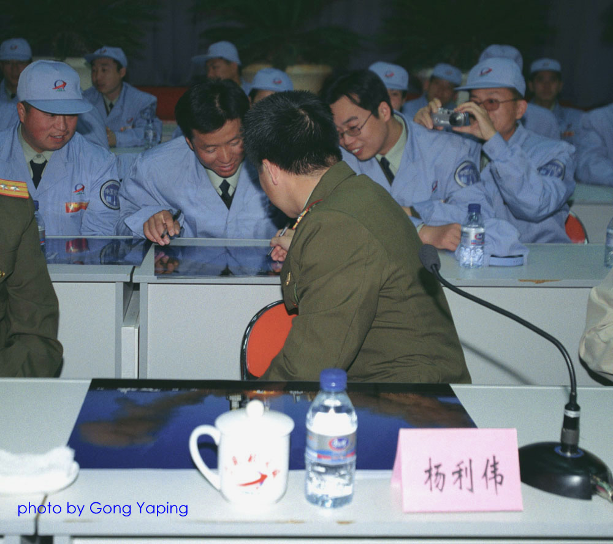
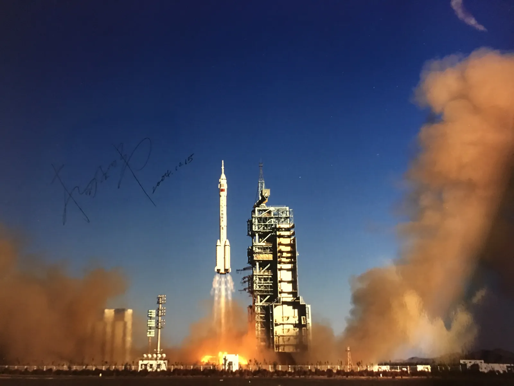
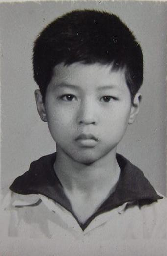
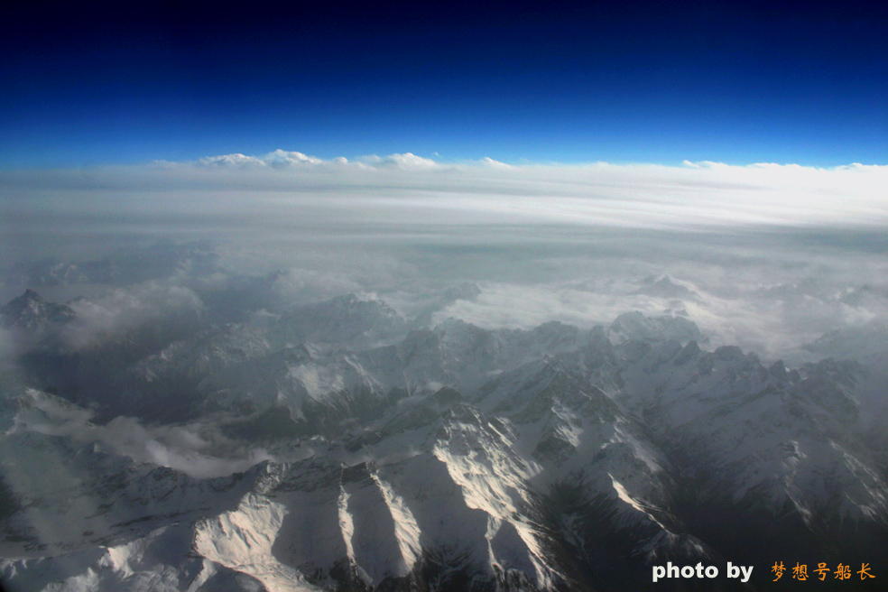
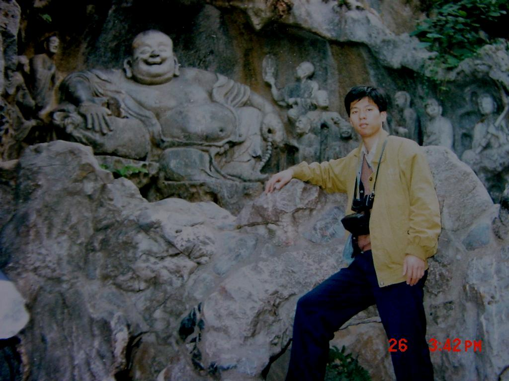
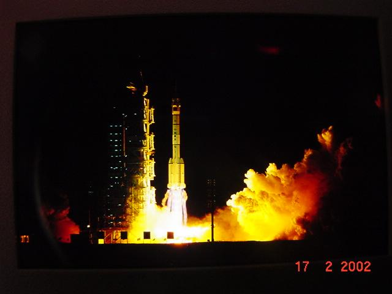
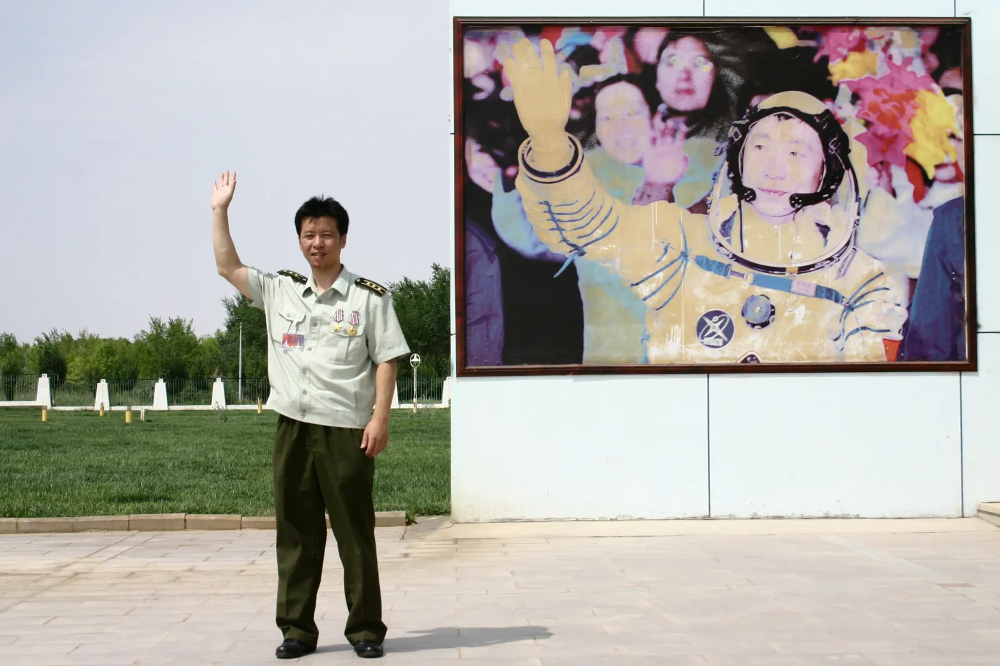

在书房收拾时，发现了先父的自传。本应是档案中的党八股，未想其中却包含这多精彩内容。

<!--more-->

> 新旧社会映像，KMT与TG的对比访谈。
>
> 关于文革起因的政治论文
>
> 关于逻辑学的哲学论文
>
> 关于‘中国特色社会主义’的思考
>
> 贡嘎雪山历险求生。
>
> 89年与大学生活。
>
> 反舰弹道导弹轶事。
>
> 如何当一名‘发测架构师’。
>
> 资深业余摄影师的心得

应该说，这是一份很有趣的自传。

这100页纸，记录了父亲的光辉岁月。

斯人已去，名不见经传。

至少我能做的是，把它转成电子版罢。

归档在互联网的某个旮旯，聊以告慰，作为留念。

# 冯振彪自传

 

（共100页）

  

2006年1月3日

 

 

## 卷首语

 

 

在我的档案袋里，这是惟一的一份自己评说自己的文件。

因此，我要为我的历史留下一个相对最真实的冯振彪，

留下一个比大多数“客观”评价更准确得多的最权威的主观评价。

因为，在这个事情上，我最有发言权。

 

很多年以后，人们只能通过这份自传来了解一个真正的冯振彪，

了解一个非同寻常而又极其普通的冯振彪。

了解一个亦执亦怠的冯振彪。

 

从头到尾耐心地读这部自传，你会有很多新发现！

 

 

**冯振彪**
    
写于2006年元旦

 

## 自序

 

本篇自传的最大特点是“有章无法”，

想到哪儿就写到哪儿，写到哪儿就想到哪儿。

惟此真实，法从正见。

 

> 似梦非梦
>
> 非梦亦梦
>
> 梦梦相连
>
> 梦醉梦醒
>
> 
>
> 跟着感觉走
>
> 紧抓住梦的手
>
> 重归魂牵梦萦
>
> 诉说往日旧梦
>
> 慢慢放开梦的手
>
> 让梦儿随风飘去
>
> 从此不再真正有梦

 

冯振彪
    
写于2006年1月3日

 

## **目 次**

 

 

 

〔5〕  一、引子

〔6〕  二、追梦之歌

〔12〕 三、想到哪儿就写到哪儿——身世

〔21〕 四、在学术上研究探讨文革和现在的一点认识

以及“冯振彪悖论辩证法” 

〔其中，“冯振彪悖论辩证法”具有重大学术价值意义〕

〔55〕 五、写到哪儿就想到哪儿——学习工作及其他

〔99〕 六、尾声

 

 

# 冯振彪自传

 

## **一、引子**

 

今天是2005年12月24日，2006年圣诞节的前一天，现在是上午10点。做什么呢？就把两年前还没有来得及写完的自传继续写下去吧。

古诗云：大漠孤烟直，长河落日圆。其实，这一句诗，描绘的就是我办公室窗户外面差不多天天都可以见到的弱水河畔自然景色。按照我通宵熬夜的工作习惯，当我敲下最后一个回车键的时候，将会迎来东方地平线的第一缕曙光，接着便是一轮冉冉升起的红日。

我欣赏旭日东升的第一次辉煌，但是我更感慨暮日西沉的最后悲壮。

没有第一次的辉煌，也就不会有最后的悲壮。人生如此，军人更如此。

从初秋时分少小离家，到隆冬季节中年而归，正应了《诗经》之《采薇》所言：“昔我往矣，杨柳依依。今我来思，雨雪霏霏。行道迟迟，载渴载饥。我心伤悲，莫知我哀！”

如果一切还算顺利的话，那将成为我在大漠戈壁东风航天城度过的最后一个圣诞节。下一个圣诞节，或许将在东海之滨的宁波过了。

东方人大多没有过圣诞节的习惯，但这不是绝对的。在我们中国，喜欢过圣诞节的人似乎越来越多，这是东西方文化交流融合的结果，是很正常的事情。

回顾历史，圣诞节是应该快乐的，但也是令人感慨和唏嘘不已的。

从婉约细腻的东部到雄浑粗旷的西部，四年寒窗，又十六载春秋，金戈铁马，气吞万里如虎，投身于导弹航天国防科技事业，与中国巨龙为伍，其中，牵一发而动全身的载人航天测试发射工艺流程就整整干了十年，少年壮志不言“酬”。

如今，“功成名就”，挥去一身西部风尘，又将从大漠戈壁回归东海之滨，这似乎是很自然的呼应。这使我想起了周恩来青年时期的一首诗作：

> 大江歌罢掉头东
>
> 邃密群科济世穷
>
> 面壁十年图破壁
>
> 难酬蹈海亦英雄
>

这首诗，我曾经亲手抄录一遍，贴在7号单身宿室我床头的墙壁上。那个时候，我几乎每天都要面壁，面对这首诗，就如同面对忧国忧民的青年周恩来，耳旁回响起他那振聋发聩的警世名言：为中华之崛起而读书！

我从小起就梦想着有朝一日能够成为一名叱咤风云的英雄，做一根国之栋梁。但是，当英雄，并不是那么简单和容易；做栋梁，也未必都能够用得其所……

 

## **二、追梦之歌**

 

古人云：诗以言情，歌以咏志。古往今来，多少英雄豪杰，莫不皆然。我冯振彪虽称不上是什么英雄豪杰，但是也有此同好。只不过，我一般不讲什么平仄格律押韵，只求抑扬顿挫，能够言情、咏志、抒怀即可，岂能为陈规陋习而随便改掉我的一个咏志抒怀词句。

 

### **追梦之歌**

 

> 三十八功名尘与土        〔冯振彪实有三十八〕
>
> 十万里路云和月   〔双解， “惊天镇海一剑”十枚齐射亦十万里，刹时即到〕
>
> 挥手之间
>
> 飞逝了二十载无悔青春
>
> 圆梦园里问天阁
>
> 闲庭信步忆旧梦
>

 

 

> 时光倒溯
>
> 梦影依稀
>
> 魏塘暮色
>
> 紫云飞渡
>
> 全优学子
>
> 金榜题名
>
> 游子踏上追梦路
>
> 夕阳西下照长影
>
> 影随身移影更长
>
> 少年壮志不言愁
>

 

> 忆魏塘
>
> 梦里最忆老车站
>

 

> 暮色愈深夜意浓
>
> 黄灯浊浊照长椅
>
> 影单身孤独踯躅
>
> 移步凭栏若有思
>

 

> 车轮滚滚灯影移
>
> 汽笛呜咽声声近
>

 

> 家父悄然追相送
>
> 相坐怅怅语关切
>
> 忽闻熟音迎面来
>
> 同窗惜别情切切
>

 

> 此去长行何时归
>
> 心中酸涩未知然
>

 

> 挥挥手
>
> 踏上西去的列车
>
> 少年追梦不回首
>

 

> 列车如梭飞奔
>
> 日夜兼程
>
> 送我到长沙
>

 

> 忆长沙
>
> 梦里最忆湘江情
>

 

> 追随伟人脚步
>
> 缅怀领袖胸襟
>
> 独立寒秋
>
> 湘江北去
>
> 橘子洲头
>
> 高诵沁园春
>
> 激情澎湃
>
> 壮志凌天
>

 

> 恩师情深
>
> 精心授业猛灌输
>
> 学子苦读
>
> 囫囵吞枣咽下肚
>
> 少年孟浪
>
> 情趣多多
>
> 上课走神
>
> 下课健身
>
> 作业不交
>
> 临考突击
>
> 考砸再考
>
> 如履薄冰
>
> 侥幸过关
>
> 感谢恩师也
>
> 考试虽糟糕
>
> 概念却神悟
>
> 众多学问
>
> 编织成条条神奇弹道
>
> 导弹航天器穿梭往返天地
>
> 精彩如虹
>
> 变幻莫测
>
> 魅力无穷
>

 

 

> 青年学成酬壮志
>
> 义无反顾扎戈壁
>
> 面壁十年图破壁
>
> 难酬蹈海亦英雄
>

 

> 扎戈壁
>
> 心中自豪航天城
>
> 大漠绿洲一奇观
>

 

> 春去秋又来
>
> 弱水河畔金胡杨
>
> 相映成趣是美景
>
> 只因神圣使命在肩
>
> 无暇多看此美景
>
> 吃苦受累为追梦
>
> 严肃认真
>
> 周到细致
>
> 稳妥可靠
>
> 万无一失
>
> 日复一日搞测发
>
> 年复一年搞航天
>
> 发发成功是重任
>
> 飞天圆梦是梦想
>

 

> 中国人
>
> 千年飞天梦想
>
> 矢志不移
>
> 丝绸故道
>
> 饱经风尘坎坷
>
> 几度沉浮
>
> 壁画犹剩
>
> 居延故郡
>
> 黄沙千里戈壁
>
> 一点绿洲
>
> 希望不绝
>
> 大漠孤烟直
>
> 长河落日圆
>
> 辉煌中
>
> 凤凰涅槃
>

 

> 沧海桑田
>
> 共和新生
>
> 硝烟弥遁
>
> 茫茫大军
>
> 悄然入大漠
>
> 艰苦卓绝
>
> 可歌可泣
>
> 两弹一星
>
> 擎起大国安全盾牌
>
> 将士鬓霜无悔
>
> 聂帅寄语后人
>
> 精神长存
>

 

> 而今逢盛世
>
> 新东风人
>
> 更雄心万丈
>
> 欲与天公试比高
>
> 十年磨砺
>
> 锲而不舍
>
> 祁连山北筑天路
>

 

> 再回首
>
> 神箭神舟矗立待发
>
> 千年等一回
>
> 霎那间
>
> 金光闪耀
>
> 烈焰喷薄
>
> 雷霆万钧
>
> 一啸冲天飞
>
> 英雄横空出世
>
> 飞天圆梦
>

 

> 惊雷犹回荡
>
> 英雄凯旋归
>
> 回眸飞天时刻
>
> 心潮澎湃情难已   〔一图双解：一图为冯振彪《千年飞天圆梦图》摄影精品，
>
> 一图圆梦留英名         飞天一周年之际铭留杨利伟亲笔签名；
>
> 我心怒放笑开颜      一图为载人航天测发工艺流程之《准计划网络图》〕
>

> 放眼世界
>
> 天下难平
>
> 危机四伏
>
> 形势逼人
>
> 忧国为己任
>
> 俯瞰全局
>
> 潜心谋奇策
>
> 探究信息化战争制胜之关键
>
> 方知恩师用心之良苦
>
> 才悉奇业精妙之大用
>
> 闻道不问先后
>
> 严师终究出高徒
>
> 不辱师门也
>
> 高屋建瓴
>
> 奇思妙想
>
> 战略技术绘蓝图
>
> 昆仑一笑
>
> 乾坤起风雷
>
> 惊天镇海一剑      〔特指领先独创设计之冯氏新型战斗部弹道导弹〕
>
> 全无敌
>
> 未来战争
>
> 天网恢恢
>
> 疏而不漏
>
> 倚天剑指苍穹
>
> 可上九天下五洋
>
> 西北千里追踪射天狼
>
> 东南万里寻的击海霸
>
> 天海攻防至尊王牌
>
> 不战而胜
>
> 笑傲寰宇
>
> 舍此其谁
>
> 哈哈哈哈
>
> 笑罢神色黯然
>
> 宏图奇策束高阁
>
> 无可奈何也
>
> 恩师桃李天下          〔特指同窗好友〕
>
> 吾心稍可安焉
>

 

 

> 浮光掠影看人生
>
> 我是一个追梦人
>
> 梦想却始终在前方
>
> 嬉皮笑脸的捉弄我
>
> 我拼命的追赶梦想
>
> 从意气风发的少年
>
> 追到英姿飒爽的青年
>
> 一刻也不停顿
>
> 又追到大智若愚的中年
>
> 追啊追
>
> 出梦复入梦
>
> 梦梦皆不同
>
> 前方的梦想总是若即若离
>

 

> 终于有一天
>
> 我追累了
>
> 这才明白
>
> 青春飞逝
>
> 人已中年
>
> 而追赶梦想的路没有尽头
>

 

> 辉煌之后是平淡
>
> 平淡的日子好过又难过
>
> 何去何从当不惑
>
> 欲不惑
>
> 何其难
>
> 难于越鸿沟
>

 

> 细细一想也不难
>
> 不坐飞船坐飞机
>
> 坐上飞机登云天
>
> 天马行空
>
> 青云平步
>
> 天堑变通途
>
> 飞跃梦想是乐园

> 于是我索性飞跃梦想
>
> 飞跃黄河长江
>
> 飞跃千山万壑
>
> 俯瞰大地之巅的雪域群峰
>
> 任由沉默的思绪浮动
>
> 我心飞翔
>
> 自由的
>
> 翱翔于气势恢弘的天地之间
>
> 轻轻的
>
> 飘落在风光无限的雪域圣地
>
> 第一次
>
> 轻松地漫步在梦想的前方
>
> 呀啦嗦
>
> 这就是青藏高原
>
> 这就是我梦中的香格里拉
>

 

> 天籁妙音中
>
> 往事如烟云
>
> 飘摇散去
>
> 我颤动的心
>
> 复归于平静的跳动
>
> 我开始禅悟
>
> 人生如梦的二十四诀真谛
>
> 佛禅为心
>
> 道法为体
>
> 智术为用
>
> **亦执亦怠**
>
> 随遇而安
>
> 虚实人生
>
> 宗喀巴笑了
>
> 佛陀笑了
>
> 我也舒心的笑了
>

 

  冯振彪

 2005.7.27初作

 2005.12.24微作补改

 

 

## **三、想到哪儿就写到哪儿——身世**

 

1967年12月3日，我降生到了这个难以用一句话来形容的世界上。

天生我才必有用也。这三十八年来的后二十年中的事实也证明是如此。

我出生的地方叫做浙江省嘉善县，是江南的鱼米之乡。至于具体的出生地是嘉善的魏塘镇、西塘镇还是姚庄镇，连我自己到现在都还没有弄明白，以前好像也从来没有问过这个问题，反正一句话：出生在地球上的中国嘉善。不过，下一次我见到父母亲大人的时候，我可以认真地问一下这个问题，毫无疑问他们肯定是清楚的。

魏塘镇、西塘镇和姚庄镇，这三个地方都与我有很密切的渊源关系。

其中，魏塘镇和西塘镇都是江南名镇，历史上曾经出过不少著名的文人墨客官员，然而，俱往矣，数风流人物，还看今朝，故乡自古至今以来，投笔从戎，深入导弹航天领域重地，在军事战略与军事技术理论上劈空挥出“惊天镇海一剑”者，我，冯振彪，毫无疑问是第一人。当然，“自古”两字其实是不必提的，古代只有土火药火箭，是没有导弹的。

而姚庄镇是一个普通小乡镇，并没有什么名气，但是，我是从这里的学堂里走出来的，平生所学的第一堂课、所写的第一句话“伟大领袖毛主席万岁！”也是从这里开始的，这一句话将伴随我的一生，直到将来某一天我去见马克思时也是不会忘记的。

“伟大领袖毛主席万岁！”——过去，林彪说这同一句话时，内心是虚伪的，因为他想篡党夺权；但是今天，我冯振彪说这一句话时，是发自内心的真诚感受，因为我没有任何的个人功利性目的掺杂其中。这就是我与林彪最本质的区别之处。当然，一分为二地讲，林彪的军事才干是毋庸置疑的，我也是很欣赏的。

虽然毛泽东主席的尘世凡身肉体只有83岁，但是我始终坚信毛泽东的灵魂——毛泽东思想是不朽的、是万岁的！

这也符合我自己的悖论辩证法。悖而不悖。

即使在我最为看重的自己的一项军事战略与军事技术综合研究课题中，我也坚定不移地把毛泽东主席的“你打你的，我打我的”视为军事战略上争夺主动权的最高境界！并视为技术选择与发展方向的最高指南！

这一点，在任何时候都是毫不动摇的！

都比较喜欢使用“最高”这个最高级别的形容词，大概是我和林彪之间非常巧合的相似之处。原因非常简单，目光所指，皆在最高处，他盯着的是最高的权力宝座，我盯着的是最高的战略与技术研究层次（“战略与技术”和“战略战术”不完全是一回事，有很大差别，前者不仅包含了后者，而且前者的综合性和复杂性远远高于后者）。

还有一个相似的地方，他最终没有能够坐上最高的权力宝座，但是已经坐上第二最高的权力宝座；我最终没有能够亲自去实现我的最高的战略与技术，但是我已经把我的最高的战略与技术研究成果搞出来了。

 

下面继续讲我的身世。

我父亲冯连富是魏塘镇人，出生于穷苦平民之家，用我们共产党人的话来说是“根正苗红”，名字连富，但是不富很穷，共产党来了，穷人翻身得解放，我父亲也由一个穷人过上了正常人的生活，与过去穷日子相比那当然算是过上了“富” 日子。我父亲是一个普通职员，为人善良耿直，人缘极好，我奶奶是绍兴人，非常勤劳朴素和蔼，爷爷大概是魏塘镇人，过世得早，小时候见面少，印象不深，感觉也是很和蔼的。我耿直的脾气大概是我父亲遗传给我的，非常很好，我喜欢这样的脾气。但是，我好像没有父亲那样随和，当然我也比较随和，只是程度上不如我父亲更随和。

我母亲王景濂是西塘镇人，出生于书香门第，共产党来了，“打倒一切土豪劣绅”时顺便把开明绅士之家也一起打倒了，反正都带一个“绅”字，管你是“劣绅”还是“明绅”，只要见了“绅”就统统都打倒，我母亲就从富贵之家进入了寻常百姓之家，家境就真的很“濂”了。外公曾经是西塘镇上有名的开明绅士，颇有名望和人缘，居住在“中国第一弄”——西塘镇石皮弄的首户，学识丰富，很高的个头，大概在一米八以上，我听外公自己说年轻时爱好体育，曾经当过中长跑和跳高运动员，民国时期还参加过运动会比赛，除了爱抽烟，而且爱喝几盅绍兴黄酒，经常美其名曰“一道热线从喉咙里一直挂到肚子里，非常舒服！”外婆当然也非常和蔼，就是比较爱唠叨，缠过足，走路很慢，出门柱一根拐杖，小心翼翼的，我还有两个漂亮的阿姨和一个一表人才的小娘舅。

解放后的土改时期，据说我外公曾经有两三亩地放租给农民，收租也很低，也不是靠这个收入过日子，也不相信有两三亩地就会变成“地主”，因此不肯低头哈腰请客送礼，结果划成份时有人就毫不客气地把他打成“地主”了，而其他拥有十几亩地的绅士却可以被划为“富农”，这岂不是咄咄怪事！据说我外公当时非常硬气，被打成“地主”后仍然拒不承认自己是“地主”，还多次去找政府理论，家里人劝他不要去，但劝都劝不住，俗话说“秀才遇着兵，有理说不清”，结果更糟糕：抄家！看来我们共产党队伍里确有一些野蛮的“兔崽子”在“执行”党的政策时胡乱搞一通，损害了党的正确形象，也害苦了不少人家。不过，话又说回来，要不是那些“兔崽子”胡乱划成份，我母亲又怎么可能会“下嫁”和“高攀”上我父亲呢？我又怎么会来到这个世界上呢？站在我个人的立场上，看来我还真的应该感谢那些“兔崽子”瞎折腾乱划成份。这大千世界就是这样阴错阳差，无巧不成书啊。我外公被打成“地主”后，日子就很难过了，不光地产被没收分掉了，主要家产也被没收分掉了绝大部分，甚至包括在石皮弄的前楼也被分给其他人家居住，只剩下后楼的一部分勉强栖身。直到几十年后党和政府重新平反落实政策时，外公也没有去把前楼收回来，他说：“把人家都撵出去，让人家住到大街上去啊？都是几十年老邻居了，算了吧，那都是过去的事情了。把帽子摘掉了，就可以了，其它都是身外之物，死了也带不走，要来做啥！”本来前后楼邻居都很紧张，就怕归回房产被撵出去，但是看到我外公竟如此大度，都非常感恩戴德。我外公朋友很多，西塘镇上早期的中学校长大概是他的故交，土改时看他被打成“地主”后日子实在难以过下去了，后来就想方设法疏通关系请他去当了一名体育教师，这样也算是政府宽大为怀、给了一条生路，以便我外公“接受改造”、自食其力并发挥特长、为人民服务了，从此日子才勉强能够艰难维持，但也只是勉强糊口而已，一家六口全靠外公一个人微薄的工资养活，所以那时我外公一直想把三个女儿尽快嫁出去，以减少家里吃饭的人口，减轻负担啊。但是，解放后的“地主”家要嫁姑娘是谈何容易啊。

解放后这所谓的“地主”之家至少有三十年之久日子很不好过，直到外公最小的独子即我的娘舅接班也当了教师并且后来成为令人尊敬的名气挺大的优秀数学教师后，家境才算有了较大改善。但是，外公是一个非常豁达、开朗和通情达理的老人，从小到大，我从来都没有听到过外公因为如此不公遭遇而骂过共产党一句坏话，也从来没有听到过外公亲口提起过被打成“地主”这件往事（外公极其忌讳“地主”这两个字）。我倒是曾经听外公说过几次带有浓厚文革宣传口号气息的这样的话：“你们要记住，现在是共产党的天下，劳动人民翻身解放作主人，跟共产党走，听毛主席的话，那是永远都不会有错的，永远都是正确的！”。

我曾经听过外公在喝了几盅绍兴老酒后所做的最客观公正的“长篇”评论是：“国民党社会和共产党社会，两个社会我都是经历过来的，平心而论，共产党比起国民党来确实还是要好得多嘞！国民党有晨光（方言，“晨光”即“时候”的意思）是明目张胆的乱搞、瞎搞，什么发金元券啊，纯粹是搜刮老百姓民脂民膏，不得人心，顶糟糕的是解放前的晨光，通货膨胀，拼命乱印钞票，钞票越印越多，多得发边（“发边”即“漫无边际”的意思），老百姓手里钞票倒是蛮多的，一麻袋一麻袋的，买东西都是扛着几麻袋几麻袋钞票过去，有晨光扛都扛不动，太重了，只好几个人一起用力抬过去，有晨光几个人抬都抬不动，就只好去弄个三个轮子的黄包车拉过去，或者弄个两个轮子的手推车推过去，钞票多的根本数不清，就只好用磅秤来称重量，哈哈，用磅秤来称钞票，听过吗？但是钞票再多也不值铜钱，倒是一只好麻袋反而比麻袋里的钞票还稍微值铜钱一点，破麻袋当然也一样不值铜钱了，一麻袋里头的钞票顶多买两、三只烧饼，有晨光是一、两只烧饼，有晨光甚至连一只烧饼都买不来，顶多买半只烧饼！想想看，一个人一顿饭顶少也得吃一只烧饼吧，否则不是要饿死掉的啊？！半只烧饼叫老百姓哪侬（“怎么”的意思）吃法啊？一家人家总有几个人吧，全家几个人一道去吃半只烧饼，哪嘎（“怎么”的意思）吃法啊？所以，国民党要是不垮台，那是天理难容！共产党呢，有晨光也有点搞过头了，搞过一些冤假错案，我自己也吃过一些苦头，但是共产党毕竟是为老百姓谋福利的，有晨光顶多是好心办成了坏事，出发点从来都是好的，而且共产党好就好在不管啥个情况总归会放你一条活路，所以老百姓总归还都是拥护共产党的。归根结底共产党领导的新中国在国际上还是蛮有地位的，侬看看，现在还有几个外国人敢随便欺负中国人！中国人是站起来了，走路腰杆子也是挺直起来的，是扬眉吐气的！旧社会，中国人有啥地位啊？上海滩十里洋场全部都是外国人的天下，全部都是外国人说了算，外国人开着小包车（小汽车）到处横冲直撞、耀武扬威，撞死人都不管，再看看中国人呢，都在替外国人做事体，到处都是洋奴才、狗奴才！说到狗，有的地方甚至还竖一块木头牌子，上头写几个字‘华人与狗不得入内’，看一看，看一看，跟狗一样，气煞侬！中国人还有啥地位？！叫中国人还哪嘎过臬甲（“臬甲”即“日子”的意思）？！所以，还是毛主席共产党最英明伟大，把国民党、蒋介石和外国人统统都彻底打倒！统统都打翻在地上！我们的浙江老乡蒋介石比起毛主席来还是不来事的！比都没有办法比！奉化我以前已经去过了，有机会的话我还想到湖南韶山毛主席的老家去看一看……侬看一看，现在钞票多少值铜钱，一张‘大团结’钞票（注：那时的10元钱人民币大钞票）过臬甲过个十来天半个月问题不大，现在买个普通烧饼只要2、3分钱，就算是喷香的葱油烧饼也顶多5分钱，油条、豆腐浆也只要几分钱，一顿早饭1角钱就可以吃得蛮不错了，老百姓人人都买得起，永远也饿不死！所以还是毛主席共产党有办法有本事啊！”我外公的这段评论非常精彩，逻辑性也非常强，而且是亲身体会、现身说法、对比强烈，那时我已经上初中了，正是记忆力最好的时候，过目不忘，听过不忘，而且听得津津有味，所以我至今还记得比较清楚。虽然那时毛主席已经逝世有好几年了，但是我外公对于毛主席仍然是非常崇敬和崇拜。我现在也在想啊，我们共产党人的思想教育改造能力真是了不起啊，能够把一个当年被错打成“地主”、受过冤屈的人，教育改造到同我们共产党人几乎相同认识水平的境界，无论从哪方面讲，都是政治思想教育的巨大成功啊！当然，实事求是地说，即使按照当年的党的政策，当年我外公本来就不应该被错打成为“地主”，完全是我们共产党队伍里的极少数人瞎整所导致的。

看起来，我们家很像一个共产党统一战线的大家庭。确切地说：就是！共产党把原来的一切都改变了，砸碎了一个旧世界，建设了一个新世界。

我母亲是三姊妹中的老大，也是第一个嫁出去的。我母亲年轻时的漂亮在西塘镇上都是有名的，据说那时有不少青年干部想提亲，但都畏惧我外公家的“地主”成份，最后都只好悄悄作罢。那个时候的人们都把“家庭成份”看得很重，怕弄不好会影响自己的“大好革命前程”啊。等到有媒人给我父亲和母亲提亲说合时，我父亲并不在乎什么成份问题，我母亲大概看我父亲也很不错，善良正直，才貌双全，还有不错的职业（当时是魏塘镇解放后第五批经过国家挑选培训的银行职员之一），于是就成亲了。

家里橱柜上有父母亲的几张婚纱照，穿着西装打着领带的父亲很年轻英俊潇洒。我推测父亲大概只在结婚时穿过一次西装，从我有记忆开始起，我父亲就从来没有穿过西装，最好的服装大概就是一套毛料的中山装和一件呢子大衣，但也很少看见他穿，平时非常勤俭持家。这一个优点我好像没有很好地继承下来，我只是继承了父亲不穿西装的习惯，却没有继承父亲节俭的优点。

我这个人要么不买东西，一买东西总要把老婆吓一大跳！老婆最怕我到北京出差，因为我一到北京出差就有可能要购买照相器材，而且我购买起照相器材来，每次一出手动辄就是成千上万元，甚至数万元，总是大手大脚、超常购买，把自己仅有的一点儿可怜积蓄都折腾得精光！要是我父亲一旦知道这种事情，不气得长吁短叹、大骂我是“败家子”才怪呢！我记得2000年初探家时我只带着一套尼康相机回去，想给父母兄弟照一张全家福，结果父亲看到了，就问“花了多少钱啊？”我回答说“不贵，机身加镜头就花了八千多吧。”我父亲一听就不高兴了，开始教训我：“八千多还不贵啊？！你是百万富翁啊？你一个月工资才几个钱啊？你是不是脑子热昏了？你年纪也介大了怎么一点也拎不清啊？你怎么不考虑考虑今后要用钱的地方还多着呢，以后怎么办啊？照相机嘛买一个也不是不可以，两三百块买一个就够用了，一样都是拍照片，要买这么贵的有什么意思啊？！你以前不是已经买过几台照相机了吗？怎么又买了一个啊？一个还不够啊？怎么一个、两个、三个不停地买啊？你是不是想把商店里的照相机统统都买回来啊？照相机能当饭吃吗？以后不要再买了，省点钱吧！……”父亲把我好一顿心平气和的教训啊，而且是三番两次地反复耐心劝导，甚至到我临行归队前还不忘再劝导叮嘱一番！为了不惹父亲再次不高兴，我每一次都只好硬着头皮“嗯嗯，噢噢”地应承着。结果呢，我看着小日本的尼康相机就是左右不顺眼，最后还是又买了一大堆极其昂贵的德国、瑞士的名牌精品4×5英寸大画幅相机，这最后连续几下“大手笔”和“大跃进”，十万元买到顶了！同时也把自己彻底买成了一个穷光蛋！再想折腾器材也折腾不了了，没有经济底子了。只是没敢再让父亲知道。唉，与父辈比，我真是太惭愧啊！不过，这也是个性使然，也怪不得我自己啊，对于最感兴趣的事情，无论是工作还是业余爱好，要么不做，做就要做到最好，做到顶！而且不惜一切代价，无论是时间、精力、体力还是经济代价，甚至生命冒险代价，除非是做不到或没有机会实在没有办法。

大概是在上个世纪六十年代中期吧，我父母亲响应党的号召，上山下乡，支援农村经济建设，从魏塘镇搬到了姚庄镇，我父亲到姚庄镇后，根据工作需要就去了供销社综合商店工作，当了一名小负责人，而母亲则到了供销社的竹木材部工作，工作都很稳定。一直到了七十年代中期前后，母亲和父亲才先后返回县城。县城就是魏塘镇，因为魏塘镇是中心大镇，所以嘉善县在过去经常是以魏塘镇来代称。当然，如果我父亲当时要是留在魏塘镇不下去的话，那家庭境遇肯定会比后来要好不少，但那时贫苦人家孩子都是在党的关怀培养下成长起来的，对党都是无限感恩和忠诚，所以党有什么号召，都是义不容辞、积极响应。

姚庄镇与其说是镇，不如说乡更加准确一些，那时真正的名称叫“姚庄人民公社”。镇上其实就只有沿河的两条并行的小街道，周围就都是广阔无边的水稻田了。主要交通工具除了魏塘镇－姚庄镇－西塘镇“三点一线”的每日一班客运轮船之外，其它就什么都没有了。

我哥哥出生后，基本上是一直在魏塘镇由爷爷和奶奶养大的。有时也带回姚庄住上一段日子。

我出生后，就基本上一直在父母身边，但也经常带到西塘镇外公家，时间或长或短地逗留，主要由我三阿姨照看。我很小的时候，我母亲还专门把她的三妹即我的三阿姨请到姚庄来，带了我整整两年多时间。这有两个大好处，一是我父母亲工作很忙，可以减轻带孩子的负担，工作上减少分心；二是也替我外公家减轻了负担，减少了一个吃饭的人口。三阿姨我一般都叫她“小姨妈”或者“小阿姨”，而二阿姨则叫为“大姨妈”或“大阿姨”，以大、小之分来区分两位阿姨。二阿姨出嫁很晚，好像是我上初中那会儿她才出嫁的。

三阿姨叫王建英，对我非常好，非常痛心的是由于后来得了不治之症，很年轻的就不幸去世了，终生未嫁。小阿姨去世前那一阵子，我因为正好赶上要迎考的关口，我父母亲没肯告诉我小阿姨的病危情况，没有让我去送终。后来，有一次，我母亲实在忍不住了，神色黯然地终于告诉我了：“振彪啊，你这辈子都要记得你小阿姨啊！你心里永远也不能忘记她啊，你小的时候，小阿姨是对你最好的啊……她在临走的时候，在迷迷糊糊当中还不停地呼唤你的名字：振彪…振彪…，一直喊到咽气啊！”我听到这里，当时就心头紧缩，鼻子一酸眼眶就红了，眼泪再也止不住夺眶而出！……内疚啊，遗憾哪，我怎么没有能够去送终啊，我怎么对得起小阿姨啊！时至今日，我已经38岁了，但是我只要想起那一幕的情景，我仍然忍不住要落泪。我出生后没多大，她就过来照顾了我整整两年多啊，后来还经常照顾我，带我去玩……实际上，小阿姨早已经把我看成是她自己的孩子了啊！人非草木，孰能无情啊！这件事情，是我心头永远的痛！

小阿姨，今生今世我永远都怀念您……

 

我的弟弟小我六岁，他的幼年经历是我们三兄弟中最曲折伤感的一个。因为我父母工作实在太忙，据说我又是那么的“调皮淘气”（我果真是那样吗？），带我一个人有时都感到很费力，爷爷奶奶的地方已经带了一个哥哥，外公外婆家境太困难，加上我还经常过去添点麻烦，后来父母亲就只好忍痛把三弟送到嘉兴桐乡的一户厚道农民家中寄养，每月寄生活费过去，大概直到三弟3岁多的时候，父母亲才去把他接了回来。接三弟的那一次，父母亲也顺便把我带上了，并带着一大堆很重的礼物去。那情景我至今还记忆犹新：三弟被喊出来后，就看见他上身光着膀子，下面穿着开档裤，光着脚，站在里面的第二道门槛后的泥地上，陌生地仰头望着父母亲，奶娘好几次让三弟叫“爸爸、妈妈”，我三弟困惑地摇了摇头，就是不叫，然后扭身就很快跑掉了，我父母亲似乎都感到很尴尬，不知道该怎么办才好；好像是住了俩天；最后分别时，奶娘伤心地哭啊抽泣啊，很长时间紧紧搂着三弟不愿意放手啊，三弟也搂着奶娘好像也是很不愿意走啊，奶娘的家人无论怎么劝，似乎都不起什么作用，就这样僵持了很长时间，大家都没有办法；最后是奶娘的丈夫和奶娘的大弟相互低声嘀咕了几句，然后奶娘的大弟又跟我父亲耳语了几句，于是父亲就带着母亲和我先出了奶娘家的大门，还没有走几步路，就听到屋里奶娘的哭声突然“哇——！”地大了一声，我本能地扭头往回一看，只见：奶娘的大弟已经用双臂紧紧地把三弟抱在怀里，刚跨出门槛，急急忙忙向我们跑过来，并连声催促“快走快走！”，而奶娘的丈夫正用双臂抱住奶娘，死活不让她出门。我父母亲也回头看了一眼，没敢再多看，拉起我的手就小步快跑起来，奶娘大弟抱着三弟跑得最快，超到了我们的前头，边跑边给我们带路。我听到身后传来了奶娘放声嚎啕凄厉大哭的声音和敲门板的声音，而三弟听到了奶娘的哭声后也跟着嚎啕大哭起来，那情景非常伤感。那种伤感情景，我小时候是没法理解的，只有到了长大成人后才能真正明白过来。我们气喘吁吁地跑了一大段路后，奶娘的哭声才听起来渐渐小了下去，我依稀记得是过了一座比较高又比较窄的小桥（但记不清是石头桥还是木头桥）之后，才完全听不到了奶娘的哭声，而只听到三弟的哭声，大概是哭累了吧，已经变成上气不接下气的断断续续的抽泣声。这时，奶娘的大弟才把三弟交给我父亲抱着，而没有交给我母亲抱着，我现在猜想那大概是怕三弟挣扎、怕我母亲抱不住吧。在桥下，奶娘大弟和我父母亲道了别，好像话说得不是很多，就又匆匆忙忙赶回去了。后来我们又走了很长的路，一路上我母亲不停地用糖果哄三弟，三弟嘴里吃着糖，但还在含混不清地小声抽泣。我父亲大概也是实在抱累了，后来就把三弟交给母亲抱着，三弟好像没有挣扎，也不抽泣了，在母亲肩头上东张西望的，还老是盯着我看，我就笑着叫“弟弟！弟弟！”，他终于咧嘴笑了，这一笑不要紧，嘴巴里的糖块就掉出来了，他一急，“哇——”地又哭上了，我母亲搞不明白是怎么回事，就停了下来，我赶忙报告：“糖落掉了！糖落掉了！”于是我父亲赶忙从母亲口袋里又掏了块糖剥好后送进三弟嘴里，这才恢复平静，但是三弟的眼睛睁得大大的向下张望，似乎在寻找刚才掉的那块糖落到什么地方去了。从乡下走到了桐乡镇上后，三弟似乎很精神，到处东张西望的，一切事物对于他来说都非常新鲜稀奇，上了轮船后，更是久久地爬在船窗玻璃上看新奇。可能是轮船单调乏味的马达声音有催眠效果，加上先前在路上哭泣消耗了很多体力，最后他就爬在我母亲怀抱里睡着了。这一觉睡得可真香，轮船到了嘉兴码头他还在大睡呢，这一来我父母亲倒是省心了不少。在嘉兴我们换乘了另外一条轮船，终于又回到了魏塘镇。全家都很高兴。后来，奶娘的大弟首先来探望过一次，再后来，奶娘和她的大弟又分别来探望过二、三次。每次来，我父母亲都像亲人一样热情周到地款待。我到现在都还记得，奶娘每次见到三弟的时候都笑得非常开心，脸上和目光中都充满了无限深情的慈爱，而每次当她要离去的时候，都总是若有所失、神色伤感，甚至忍不住背过身去悄悄地、无声地掩面流泪，三弟这时候总是呆呆的发愣，望着奶娘的背影不知所措。直到多年以后，奶娘才不再前来探望三弟。我现在想，奶娘一定是忍受不了见面而后又别离时的那种苦痛，同时，也可能是在为我们有所体贴的考虑，所以可能就痛下决心，不再来了。如果这位善良慈爱的奶娘现在仍然健在的话，我坚信她的内心深处始终有一个地方默默地装着三弟、挂念着三弟、默默地祝福三弟。这就是我们中国母性最伟大的仁爱。

关于我们三兄弟的取名的故事，就不能不再次提到外公。其实我外公对于我们兄弟来说，最有趣的就是给我们兄弟取名字的事情了。

我哥哥比我早两岁半出生，出生于1965年5月。按照惯例，家族里谁资格最老、学问最高，就由谁来给取名字。这件事情，毫无疑问是由我外公来做了。我外公也非常乐意做这件事情。我外公给我哥哥取名为“振东”，意思是“拥护毛泽东主席”。在那个年代，应该说这个名字取得是很不错的。即便现在看来，也是很不错的，我一直很羡慕这个名字，为什么不是我叫“振东”呢？

等到我在1967年12月出生后，同样是由外公给我取名字。大家猜都不用猜：“振彪”！意思是“拥护林彪副主席”。实事求是地说，这个名字也非常响亮！发音上甚至比“振东”更清晰响亮。无论从发音还是从意义上讲，在当时也是很不错的，当时林彪副统帅是伟大领袖毛主席亲自指定的接班人啊，也是林彪在中国政坛最走红的时期。哥哥“拥护毛泽东主席”，那么弟弟当然应该要遵从毛主席的意愿，也得“拥护林彪副主席”啊。哥哥已经取名“振东”，弟弟显然不能重名同名，因此弟弟取名“振彪”也就顺理成章了。

不过，谁没有想到的是：林彪副主席后来竟然会叛党叛国、仓皇出逃投奔苏联，结果摔死在蒙古！

怎么办，“振彪”这名字似乎又不太好了。这让家里人有点哭笑不得，甚至于有点苦恼了。可能是大家觉得名字本身也并不能代表本人的什么政治立场，只不过是个人的区分代码而已，而且，当时取名“这彪”或“那彪”的名字也很多，也并没有发现其他人纷纷把“彪”字改换掉，周围人也没有提出“改名字”的建议或者随意“上纲上线”的压力，所以，我这名字后来也就不再修改了，振彪就振彪吧。

等到小我六岁的三弟出生后，我父亲自己先拿了个主意，不能再“振东”、“振彪”那样地取名下去了，而是为三弟取了个政治色彩不明显的单名“强”字，再让我母亲去征求我外公的意见，我外公也很赞同，就这么定了。

我的名字大概就是与文革有那么一点所谓的“联系”吧，而我本人与文革却没有什么政治上的任何瓜葛，事实上，那也是不可能有的。

文革中出生的一个几岁大一点的小孩会有什么“政治能量”吗？如果“有”的话，那岂不是成为“天方夜谭”了？

 

## 四、在学术上研究探讨文革和现在的一点认识以及“冯振彪悖论辩证法”

 

按照写自传的所谓的“自传八股文”式要求，需要“如实写清在文化大革命中的历史经历情况以及对文化大革命的认识”。其实，对于写自传，一刀切地规定这么一条要求，是比较可笑的，一点儿都不实事求是、具体情况具体对待和具体分析处理。对于那些在未成年未懂事阶段“经历过”的政治历史事件，在自传中有什么好写的？即使要求写所谓的“政治自白书”，那也得要看看年龄因素啊！如果对于五、六十岁的人要求上这么一条，可能还有一些合理的成份。对于四十岁以下的人，要求他们“谈文革经历和认识”岂不是勉为其难吗？而且，过去在拨乱反正的时候，中共中央已经做出过关于若干历史问题的决议，这个决议现在依然是有效的。

不过，既然规定要求谈谈认识，那就不妨作为政治学术问题来研究探讨一下。

有一点认识是毫无疑问的：文革对中国社会是一场史无前例的浩劫。但是，这不是亲身经历所获得的体会认识，而是通过政治教育学习和认真思考所获得的理性认识。

我个人比较感兴趣的两个问题是：

1、为什么毛泽东主席要发动文化大革命？真正动机原因是什么？

2、为什么毛泽东主席直到晚年都不认为文化大革命在“根本性质”上是错误的，而只认为在某些局部方面存在偏差问题？其根本原因又何在？

我个人认为，这两个问题非常关键。甚至可以认为，是认识文革的关键突破口。

从学术研究的角度讲，要研究清楚现象和结果相对还比较容易一些，因为，亲身经历过文革的上了点年纪的人，有很多人还健在，他们可以把耳闻目睹的现象和结果等有关情况告诉后人，此外，还有很多珍贵的文献资料。但是，要研究清楚真正动因和内因则要相对困难和复杂的多，因为，即便是亲身经历过文革的上了点年纪的人，也未必都能够真正搞得清楚这些问题，后人研究起来当然就要更加困难一些，后人能够接触到的都是二手以下的资料，不可逆转的历史因果规律，彻底决定了后人永远不可能获得先前历史的第一手资料，而且即使有前人的“第一手资料”和文献资料，对于后人而言在本质上统统都是“二手以下的资料”，因为后人不可能通过所谓的“时光倒流隧道”，重新再在回到“轰轰烈烈的文化大革命”之中。

所谓的“时光倒流隧道”是不懂爱因斯坦相对论的人们胡乱引用乃至胡乱演绎爱因斯坦相对论的一个讲课比喻而胡乱杜撰和胡乱想象出来的子虚乌有的东西，这些人们完全忘了甚至根本不知道爱因斯坦还讲述了另外一个更加重要的铁一般的结论：历史因果律不可逆！换一句话说，就是“儿子永远不可能成为自己的亲爸爸，或自己亲爸爸的亲爸爸！”

时光倒溯是可以的，“倒流”则绝无可能。大名鼎鼎的爱因斯坦自己也从来都不敢说“时光可以倒流”，而只是准确地说过“尺缩”、“钟慢”效应。

那么，后人是否就无从研究这些问题了？也不是。

“二手以下的资料”同样可以用来进行研究。

但是，研究并得到结果，与研究并得到相对客观正确的结果，不是一回事。

我认为，如何利用二手以下的资料去进行分析研究，这不过是第二位的事情。

使用同样的研究资料，但是选择不同的史学观评判标准，那么一般情况下得到的往往是不同的研究结论。

因此，第一位的事情，应该是选择何种适当的史学观评判标准。这是个大前提。

如果大前提出现了比较严重的偏差或错误问题，那么研究及研究结果都没有什么太大的实际意义，因为不可能得到相对客观正确的研究结论，副作用是容易出现误导情况。这是不期望的。

但是，史学观评判标准，如果笼而统之、大而化之地都冠上一顶“马克思主义史学观”的大帽子，实际研究时却仍然用“个人好恶史学观”、“预设结论史学观”、“断章取义史学观”、“胡乱联系史学观”、“生编硬造史学观”等各种各样、五花八门的反马克思主义的史学观，那么还能指望得到什么样的研究结论呢？

马克思主义史学观的本质核心仍然只有4个字：实事求是。其中，实事求是的历史观认识态度是前提，实事求是的方法论是关键，而关键中之最重要者是实事求是的洞察力！——洞察力是分析、综合、经验和直觉四者高度有机结合。没有洞察力，一切都仍然在云里雾里。研究结论的客观正确与否，最终在洞察力上见分晓。到实证恐怕就显得晚了一些，不过书呆子们一般都比较喜欢实证（不管还有没有机会），因为他们对自己的洞察力水平没有足够的把握和信心。不过自然科学家们是可以例外和可以理解的，因为他们探索的往往是完全未知的陌生世界，与社会科学有较大差别。

只要不离开实事求是这4个字，什么问题都可以研究，也可以争议（争议产生的根本原因是洞察力水平不同）。否则，很可能就是谁也不接受谁的观点，甚至相互指责、相互否定，弄不出一个客观正确的东西出来。

我个人觉得，要研究毛泽东主席内心深处的这两个问题，本质上可以归结为一个核心问题，即“用什么样的人去建设一个什么样的社会”问题，这个核心问题中的“人”应该做广义的理解，即包括党内外各阶层的人；同时，这个核心问题背后还连带着一个“社会发展的基本矛盾问题即生产力与生产关系问题”。所以，可以初步考虑先从以下几方面着手展开研究（之后再进一步研究基本矛盾）：

1、毛泽东青年时期设想的“乌托邦”社会是什么样的？这些设想对于毛泽东后来领导建设新中国社会有什么重大影响？

2、在长征之前和之后，江西和延安的政权和社会建设管理的经验教训，对于毛泽东后来领导建设新中国社会有什么重大影响？长征的经历对于毛泽东后来在文化大革命中的哪些做法有直接或间接的影响？

3、毛泽东在建国前后以及建国后的较长时期中，对于社会形态模式的过渡性、阶段性建设方案和长远建设方案是如何考虑的？前后想法有什么不同和变化？这些不同和变化是在什么情况下产生的或什么原因导致的？在摸索前进过程中，有那些关键因素引起了毛泽东想法的重大转变？这些重大转变与后来发动全面文化大革命之间有没有重大的内在联系或影响？

4、在解放战争时期，为了加快全国解放的进程步伐，就重点加强了统一战线工作力度，并且接收、改编了大量国民党军队和政府的起义投诚人员，对于这些人员的工作安排和思想教育改造，毛泽东是如何通盘考虑的？或者前后是如何考虑的、有何变化？这些考虑中，有没有包含文化大革命的某些萌芽因素？

5、在建国初期，对于共产党内部各个不同部门、不同层次的同志，毛泽东同志认为他们的思想觉悟、素质能力等各个重要方面与建设新中国社会的客观需要之间还存在哪些矛盾和差距？如何解决这些问题，毛泽东是怎样考虑的？采取措施后，实际效果如何，毛泽东是如何评估的？对于遗留问题，有没有酝酿形成下一阶段的新措施？其中，有没有包含文化大革命的某些萌芽因素？

6、改造过渡阶段结束后，到了社会主义建设阶段，毛泽东心目中基本定型的社会主义形态模式建设的方方面面是如何设想考虑的？党内各阶层、党外各阶层中的人们的现实状况与毛泽东的设想之间存在哪些主要的或重大的差别、差距、矛盾、冲突？毛泽东希望把人们进一步塑造、改造到一种什么样的状况？毛泽东认为应该采用什么样的办法才能达到预期设想？要解决这些这问题与后来发动全面文化大革命之间有什么重大的内在联系？除了发动全面的文化大革命之外，毛泽东还有没有曾经考虑过其他什么办法？这些其他办法与发动全面文化大革命之间，毛泽东是如何权衡取舍的？对于发动全面文化大革命可能产生的非预期后果，毛泽东如何估计和权衡的？

7、1958年至1966年期间，党内政治斗争的哪些具体情况对于毛泽东发动全面文化大革命产生了哪些具体影响（包括发动时机的选择）？爆发前夕，如果发动全面文化大革命的“导火索”是诱因，那么主因是否就是当时所谓的“一大批资产阶级当权派混进并掌握了党内的各个要害部门”（问题6中含此因素）？如果这后者也不是主因，那么主因究竟是什么？

8、在发动全面文化大革命前夕，毛泽东对于国内、国际形势在总体上是如何分析评估的？这种分析评估对于毛泽东发动全面文化大革命（包括发动时机的选择）有什么影响？

9、毛泽东有没有“私心杂念”？如果有的话，有哪些“私心杂念”对于发动全面文化大革命有影响？在文化大革命进行过程中，有哪些“私心杂念”影响了毛泽东客观正确地评估文革过程中的情况和问题？有哪些“私心杂念”影响了毛泽东及时纠正文革中的偏差问题？

10、毛泽东的个人性格特点对于文化大革命有什么重大影响？

由于毛泽东把文化大革命看成是他一生中所干的两件大事之一，因此毫无疑问的是：毛泽东发动文化大革命肯定是经过了深思熟虑的，而绝不会是草率发动的。由此可以进一步推断：既然是经过深思熟虑发动的，毛泽东肯定是考虑了很多方面的重要因素，而决不会只有一、两个简单因素。再进一步推断：既然是考虑了很多方面的重要因素，那么文化大革命就是一个多因多果的复杂事物，所以要相对客观正确地分析研究清楚毛泽东发动文化大革命的真正动因和内因，应该以联系的、发展的观点，并借助于矛盾分析、内外因分析等多种手段方法，全面、系统地对文化大革命进行综合性的分析研究，从中弄清楚什么是主动因、哪些是从动因，什么是主内因、哪些是从内因，什么是外因，以及所有这些因素之间的相互影响、制约、转化关系，从而把握一个全貌的整体。

显然，这是一个“巨系统”工程，研究工作量之巨大之艰难都是超乎寻常的难以想象，绝非任何一己之力所能够独立完成的。通常而言，每一个研究者个体所能够做的大概也可能就是“管中窥豹”、“可见一斑”而已。当然，如果按照正确的方法、程序在每一个角度都“管中窥豹”一下，把全豹都“窥”一遍，那么再按照正确的方法、程序把所有的“可见一斑”重新拼组、复原起来，大概也是可以“见全豹”的吧。

不过这种方法效率实在是太低了。对于一个太复杂的事物，在初步研究的时候，相对比较好的办法是先抓住一些主要因素，忽略一些次要因素，抓住主要矛盾和矛盾的主要方面，先弄个大致的轮廓出来，然后再慢慢地细究和完善。

因此，我的研究办法是什么“管子”都不用，直接用心悟，直接睁大“眼睛”看，这样“视野”比较大一些，虽然每一块“豹斑”未必都看得很清楚（肯定不如用“管子”看得清楚），但是，至少“豹”的全貌一眼就看清楚了。当然前提是“视力”要稍微好一点，站的距离和方位也要相对比较合适一些。如果“视力”稍微差一点（只要不是“高度近视”或者“高度老化”），问题也不是很大，再适当调整一下位置，问题一样可以解决。

其实，这就是毛主席曾经指出和批评过的那种方法：在那里登高一站，粗枝大叶地望一眼。不过，任何方法，“对与错”，关键是看在什么情况条件下怎么用。

现在，我就要用毛主席批评过的方法来“侦察”一下毛主席！他老人家是莫得办法噢，因为我是小小字辈，所以他老人家是不会介意的，最多是开一句玩笑：“啊，你这小鬼，又来偷看什么，你能看清楚我下巴上的那一颗痣么？”我会理直气壮地回答道：“毛爷爷，我这不是偷看，是侦察，我看不清那颗痣，但是我能够看清楚你是一个很高很高的大高个！目标已经发现，我的任务已经完成了！走喽——！”说完，一溜烟就跑了。老毛笑了笑：“嗬，说的倒也没有错哇，还挺机灵的啊！长大了一定能够当个好侦察兵！”

下面我把“粗枝大叶地看一眼”的“侦察结果”粗略地汇报一下：

1、真正的主内因存在于前面的第1个问题和第10个问题中，即毛泽东同志的理想和个性，这是一切源动力之所在。

2、建设一个理想的中国社会，是毛泽东同志青年时期就已经确立并且毕生为之奋斗的伟大目标，也是他追求的最终目标。所以，他认为全国解放只是万里长征走完了第一步（这绝不仅仅只是一个简单的比喻）。也就是说他干成功的第一件大事，实际上是干第二件大事的铺路砖，第二件大事更重要、更艰巨。这个时候他的头脑仍然很清醒，知道干第二件大事的难度之大和周期之长。在毛泽东同志的脑海中，这个理想社会的宏伟蓝图目标，在宏观整体骨干框架上是相对比较清晰的，但细节是局部清晰、多数模糊的，所以需要在实践中继续摸索和完善。此外，从心理学角度上讲，一个人青年时期的最大、最根本性的志向通常对于其一生具有深远的重大影响。

3、毛泽东同志既是一个很实事求是、很务实的现实主义者，但是，请不要忘记，毛泽东同志同时也是一个理想主义者和超现实主义者，具有双重个性。此外，再加上第三个性格特点：百折不挠，不达目的、誓不罢休！形成三重性格。证据：在毛泽东同志的文章、诗词、讲话中到处都是。一个人的性格特点在最大程度上影响乃至决定着其思维行为方式。

4、但是，这种三重性格属于不稳定性格类型，其中前两个性格具有固有的二元矛盾冲突属性，第三个性格则是“力量倍增器”（加在其中一元上，这一元就占主导）。这种三重性格属性者能否与外部现实环境保持协调关系，主要取决于内部约束条件和外部影响条件的相互关系。

其中，内部约束条件是毛泽东同志本人的智慧和理性，它负责协调理想与现实的关系，判断现实与理想之间的偏差程度大小，决定是否采取纠偏差的行动，调整理想与现实之间的偏差容忍度范围，确定将力量倍增器放在何处，确定对立二元的力量对比关系。外部影响条件是现实与毛泽东同志理想之间的偏差程度大小及其变化情况。

纠偏差行动主要有对内和对外两种方式。对内纠偏差是在自己的思想上调整理想与现实之间的偏差容忍度范围，调整力量倍增器的位置，从而在意志上对抗或者适应现实，并立即反映到对外行动上，故对内纠偏差有对抗或者适应两种方式；对外纠偏差是直接在行动上对抗和干预现实，改变现实及其变化情况，使现实与理性之间的偏差大小在容忍度范围之内，对外纠偏差只有对抗方式一种。因此，很显然，纠偏差行动中，对抗现实是主流的表现形式，而适应现实是从属的表现形式。

这种三重性格属性者，只有在采取扩大偏差容忍度范围，或者纠偏差行动的幅度和方向朝向适应现实而进行时，才能与外部现环境实保持协调一致，或者避免与外部现实环境的强烈冲突。但是，在这种三重性格属性中，第二属性和第三属性是自然的最佳配对，两者联合起来，就决定了第一属性的所有的妥协都是暂时的和权宜的，而对抗与斗争才是真正的主流，这是一种很典型的斗争主导型性格（任何一个理想主义者和超现实主义者，如果没有毛泽东同志那样的第三个性格特征，则会立即成为典型的被动适应型性格，即消极理想主义者，而不是积极理想主义者）。

要让毛泽东同志向现实低头、向现实妥协，一切从现实出发，这可能吗？在军事上是存在这种可能性的，在军事上毛泽东同志是绝对的现实主义者，因为长征的苦头实在是吃够了。但是，即便在军事上，“绝不盲动乱来”的妥协也是暂时的，一旦时机条件成熟，妥协即告中止，就要抓住时机实施正确机动灵活的主动出击。除开军事方面之外，在其他方面统统都要理想向现实低头，这是不可能的，否则他就不是“与天斗、与地头、与人斗，三个其乐无穷”的毛泽东同志了。

但是，一旦决定采取大幅度的纠偏差行动，就会加剧并引发严重的自我性格内部冲突问题，并且必然立刻会表现和扩展到外部，与现实的强烈冲突将不可避免。

5、是谁让毛泽东同志决定采取大幅度的纠偏差行动？是毛泽东同志自己，是毛泽东同志周围的同志，是党内外各阶层人士，是历史的现实状况，是现实与理想的巨大落差，是毛泽东同志希望自己在有生之年能够看到理想的实现、哪怕初步实现甚至实现一部分都行，等等，所有这些内外因素都集中在一起，一句话：毛泽东同志和他周围的无情的非理想化的现实共同让毛泽东同志决定采取大幅度的纠偏差行动。因为，无情的现实（包括“走资派”这个最大的从因、第二位的主因）已经严重地阻碍了理想的实现，甚至他感受到无情的现实很可能会击碎理想！这无情的现实，无疑已经成为他实现理想的最大阻碍、最大挑战和最大威胁！毛泽东同志自己的判断结论恐怕也只有一句话：“只有改变现实，才能实现理想！”——于是，主动因就立即浮现了上来！

充分发挥人的主观能动性，改造客观世界——是毛泽东同志的一贯思维行为方式，也是其个性的最集中鲜明体现。

6、为了能够干成第2件大事，已经在干第1件大事的过程中付出了巨大的牺牲代价，包括他个人的、其他人的、党和军队的以及整个社会的，这岂能半途而废？！——主内因与所有其他因素比较后促使主动因加强！如果向现实妥协，就意味着想干成第2件大事将变得更加遥遥无期，而现实甚至还有可能改变干第2件大事的目标和方向，这岂能容忍！——偏差容忍度范围立即大幅度缩小！必须不惜一切代价遏制住现实的这种变化趋势，并进而扭转和改变现实！——主动因再次加强并达到和越过下决心的心理门槛！于是，决定采取纠偏差行动，“力量倍增器”滑向第二性格属性，性格中二元力量对比已经不可逆转，对内的自我纠偏差行动结束，即将对外部现实环境采取纠偏差行动！此时，智慧和理性已经完全倒向“理想和超现实”一面，毛泽东的头脑开始发热，仅剩的一点冷静主要只为“如何进行斗争、如何力挽狂澜”而服务。

实事求是地讲，主内因在本质上是正确的，是没有错误的，主动因在本质上是积极的且没有政治立场的根本性大错（这是毛泽东同志后来“死不认错”的根本原因所在！！！如果不透彻地搞清楚这一点，就根本不可能理解毛泽东同志为什么“死不认错”）；然而，这一思维的显著“超现实”特征，已经决定了这一思维在现实条件下的不客观性和不正确性。

所以《决议》中后来将文革性质的第一部分定性为“由毛泽东同志错误发动的”是基本上还算实事求是、客观正确的，但是用词上并不是很准确，在未加状语限制的情况下，等于把“主内因的本质正确性和主动因的本质积极性”也同时一起彻底否定掉了，在一定程度上对毛泽东同志有欠公正之处。**如果用词上改成“由毛泽东同志脱离现实情况而错误发动的”，则要恰当和公正得多**。**“彻底否定文革”不能把毛泽东同志理想的本质正确性也一起彻底否定掉。**

7、审时度势，运筹帷幄，深思熟虑。

8、确定主目标和副目标群，等待时机

9．“导火索”——爆发！……

10、在50年代读老子《道德经》时即已萌动野心的林彪（他曾经在书里批注了一句话“不要轻易骑到虎背上去”，隐含着“要在适当的时机才能骑到虎背上去”），施展两面派手法，打着毛主席的旗号，不动声色地利用文革运动清除军内异己力量，一步一步地走向更大的阴谋；紧接着，“四人帮”也打着毛主席的旗号，在更大的社会范围内利用文革运动明目张胆地清除政治异己力量乃至个人恩怨对象。林彪和“四人帮”两个反党政治犯罪集团，使文革变得更加面目皆非、是非颠倒和混乱不堪，并使得毛泽东同志在不知情或不完全知情的情况下背了很多“黑锅”。毛泽东同志的初衷本意只是希望将阻碍理想实现的那些政治力量赶下政治中心舞台，绝无“赶尽杀绝”的想法（毛泽东同志本人最深恶痛绝党内斗争“无情打击，赶尽杀绝”，而是主张“惩前毖后，治病救人”，从其对红四方面军干部的宽容态度和对博古、王明等同志的宽容态度可以充分证明这一点）。但是，两个反党政治犯罪集团却背着毛泽东同志，做尽“赶尽杀绝”的罪恶行径，使文革完全变味、变质。

等到毛泽东同志有所察觉时，后果已经形成并且显现，但是毛泽东同志过高评估了自己的能力，觉得自己“还有能力”控制和利用这两个集团，觉得自己“还有能力”控制局面、进而幻想实现以“大乱求大治”的目标；但是，这两个集团的政治活动能力和危害程度都极大地超过了毛泽东同志的“原先乐观估计”，林彪事件更是对毛泽东同志构成严重的直接身心打击，等到毛泽东同志清醒察觉到严重后果、清醒察觉到运动方向已经严重偏离和背离其初衷本意目的时，灾难已经极其严重和无法挽回，运动本身已经濒临失控状态，甚至可以直接说已经处于完全失控状态。

所以《决议》中后来将文革性质的第二部分定性为“被两个反党反革命集团阴谋利用（这是原文大意，具体原文文字难以完全一一复忆出来，手头没有文件。下同）”、将文革性质的第三部分定性为“酿成了史无前例的历史灾难性浩劫”，也都完全是实事求是、客观正确的。

11、这时，毛泽东同志自己已经感到心力交瘁，无力回天，才让原则性强和工作能力强的邓小平同志复出，收拾、治理、整顿“烂摊子”，而且很有成效、起色。毛泽东对这一点是看在眼里，内心也是认同的，但是他无法容忍邓小平同志全面纠正文革中的各种错误，请主意：这时毛泽东同志并不是从一般的“私心杂念”角度看待“邓全面纠错问题”，也并不是从一般的“挑战自己最高权威”角度看待“邓全面纠错问题”，而是在一个最根本性的主内因上来看待“邓全面纠错问题”！即：毛泽东同志认为“邓全面纠错”实际上就等于是“全面否定文革”，因此，实际上就等于是“全面否定毛泽东同志为实现理想而付出的一切努力”，再进一步，实际上就等于是“全面否定毛泽东同志的理想目标信念”！而这后面的“两个等于”，恰恰触动到了毛泽东同志最根本性的主内因！触动到了毛泽东同志大脑神经的最敏感和最顽强之处！——“那是绝对碰不得的”！但是，邓小平同志观察问题的角度完全是从现实出发的，从文革本身的具体问题出发的，意志同样顽强的邓小平同志就是去“碰”这些具体问题了，毛、邓对文革的认识无共同交集，最强烈的冲突自然就不可避免了。

具体地说：

正是因为毛泽东同志理想目标信念的伟大性和正确性从终极意义上讲是毋庸置疑的，所以毛泽东同志始终顽强乃至顽固地认为“文革在根本性质上正确的”，至死都不承认有“根本性质错误”，因为“文革是为他毕生为之追求奋斗的伟大正确理想目标信念而发动的和服务的”，所谓“大礼不辞小让”，所以，毛泽东同志认为，文革中出现的所有非预期问题、非预期后果，无论其多么严重，但是与理想目标信念的伟大正确性相比较之下，那都是局部性的、枝节性的偏差问题，因而绝对不是根本性的错误——这是最关键的一点！！！

毛泽东同志在理想目标信念这件事情上（主内因上）是极端坚定不移和毫不动摇的！而毛泽东同志又恰恰判断认为：邓小平同志在根本上动摇和否定他“建设理想中国社会”的理想目标信念！——这简直比“刘少奇同志的问题”还要“严重一百倍”！

所以，毛泽东同志的第二性格属性、第三性格属性以及所有“智慧、理性（实际上已经不是了）”必然联合起来做出最空前强烈的反应、反弹和反击！——即“反击邓小平右倾翻案风”！

所以，毛泽东在他生命的最后阶段仍然不顾一切后果地奋起他最后余威和余力，要将邓小平同志“彻底打倒”！只有这样，才能证明毛泽东同志自己理想目标信念是正确的！

尽管毛泽东同志仍然清楚地知道“彻底打倒邓小平”对中国社会意味着什么样的严重后果，但是在最根本性的伟大正确理想目标信念面前，一切都得让路！因而，连自己“理性的现实主义一面”也不得不屈从于最高理想目标信念。在这里“屈从”与“丧失”虽然在性质上有所不同，但是实际效果和结果是基本上相同的。

在对比研究毛泽东同志和邓小平同志观察问题的角度差异后，就不难发现：邓小平同志的所谓“死不改悔”，是因为邓小平同志是从现实出发考虑问题的，在现实这一点上邓小平同志是正确的，所以当然就“死不改悔”了；毛泽东同志的所谓“死不认错”，是因为毛泽东同志是从理想角度出发考虑问题的，在理想这一点上毛泽东同志也是正确的，所以当然就“死不认错”了。我把这个毛、邓冲突现象称为“毛泽东——邓小平悖论”。

请注意：如果你还同时深刻认识毛泽东现实主义者的第一性格属性，就请你千万不要把毛泽东同志的“理想目标信念” 空泛地理解为一般意义上的“马克思主义、共产主义”，而必须理解为“毛泽东同志的理想中国社会信念”！

因为，根据毛泽东同志的历史经历、思想理论和个性特点，他始终坚持认为“马克思主义、共产主义只有与中国具体国情相结合，那才是真正的马克思主义和共产主义”。

所以，毛泽东同志头脑中的“真正的马克思主义和共产主义”是明确具体的和生动形象的，是有明确具体目标的，那就是“毛泽东同志的理想中国社会信念”！

必须深刻地注意到这一点：毛泽东同志的理想主义和超现实主义，从来都不是空泛的！而是非常具体的，具有鲜明的毛泽东同志个性特点！这是一般学者研究毛泽东同志时常常忽略的一个重要方面，而把他的前两个性格属性完全割裂、对立起来，实际上这种“割裂、对立”也是不符合正确的“对立统一”矛盾论分析方法的。

12、那么综观文革历史，毛泽东同志在文革所犯的“最主要的错误”，或者更加确切地说“最大的失误”，又究竟是什么呢？

我认为，恰恰在下面同一个问题上构成了“实践中的毛泽东思想”与“实践中的毛泽东理想”之间的一个最大悖论： 

毛泽东思想的精髓是：实事求是。这当然是正确的。

毛泽东同志始终坚持认为“马克思主义、共产主义只有与中国具体国情相结合，那才是真正的马克思主义和共产主义”。这当然也是正确的，并且也是毛泽东思想的重要组成部分。

但是，毛泽东同志所设想和付诸于实践行动的“毛泽东同志的理想中国社会模式”，却是脱离当时中国社会的具体国情的（这从“大跃进”及其后面的一系列具体做法上都充分地暴露和反映出了这个问题。恰恰是在“庐山会议”被毛泽东批判打倒的彭德怀同志的意见是基本上正确的。但是，由于彭德怀同志坦直的个性特点及其不太适合毛泽东同志个性特点的进言方式，甚至彭德怀同志还使用了比较偏激粗鲁的言辞，激怒了毛泽东同志，也触怒了其他一些同志，会议方向由本来的“纠左”180度急转弯变成“反右”，从此，阴错阳差，历史的车轮彻底驶上了无法逆转的“极左”的错误轨道和错误方向，愈演愈烈，最后终于酝酿出无法挽回的历史性悲剧。所以“庐山会议”应该是文革前的政治历史的最重要的分水岭之一，是文革的“前哨预备站”）。

这样，毛泽东同志在他自己两个都坚持的“实践中的毛泽东思想（不脱离实际）”和“实践中的毛泽东理想（脱离了实际）”上出现了自相矛盾的一个大“悖论”。我把这个“悖论”称之为“毛泽东悖论”。客观地说，“毛泽东理想”也是“毛泽东思想”的核心组成部分，“毛泽东理想”本身并没有什么本质性错误，只不过“毛泽东理想”在付诸于实践时由于脱离和超越实际而出现了错误和失误，因而被一些人“剔除”出了“毛泽东思想”。

但是这个“毛泽东悖论”是可以谅解的。

这个悖论之所以可以谅解，主要是由于以下理由：

① “毛泽东同志的理想中国社会模式”，虽然是比较乌托邦式的和急于求成的，是社会主义与共产主义相结合的混合体，它也比马克思所模糊提出“社会主义模式”和“共产主义模式”都要相对更加清晰、明确、具体和实在，但是它仍然还没有脱离马克思科学原则模式的基本形式范畴，因此它在理论上仍然是基本正确的、也确实是不存在什么根本性的大问题，但是这一毛泽东模式的实践基础却存在重大问题。

②马克思科学原则模式下的社会主义是建立在成熟发育、发展的资本主义社会形态阶段之上和之后的。问题是，中国的具体国情又恰好没有经历过一个“成熟发育、发展的资本主义社会形态”阶段，而是直接从半封建、半殖民地社会“革命成功、一步跨越过来的”，因此，毫无疑问，当时的“社会主义（甚至共产主义）生产关系”和“半封建、半殖民地社会生产力水平”是极端不相匹配的，其中，生产力水平“极大地落后”于生产关系，换一句话说，就是生产关系 “极大地超前”于生产力水平。因此，按照马克思的科学的、完整的社会形态“六阶段”发展学说（即原始社会、奴隶社会、封建社会、资本主义社会、社会主义社会和共产主义社会六个阶段。如果把共产主义定义为社会主义高级阶段，也可以称为社会形态“五阶段”发展学说，但是“六阶段”划分相对更科学一些），这种状况完全不在“六阶段”之列！实事求是地说，也就是“生产关系与生产力水平严重不匹配的‘畸形’社会形态阶段”！所以，毛泽东模式在实践应用中脱离了必须具备的生产力水平基础，毫无疑问地会出大问题！

③毛泽东模式如果期望能够获得实践成功，就必须进一步补上和补牢固“生产力水平基础”这根支柱！如果只有“生产关系”一根支柱，那是绝对不行的！毛泽东同志自己也很清楚这一点，所以要“补生产力支柱”，才会有“大跃进”事件问题的出现。而“大跃进”的根本问题，在于违反客观规律，急躁冒进，超越了当时生产力发展水平实际所能够达到的程度。

④在学术理论界比较糟糕的做法，是拼命为这种“生产关系与生产力水平严重不匹配的‘畸形’社会形态阶段”人为牵强附会地“寻找”或杜撰各种各样的所谓的“理论根据”，试图为其“正名” 。虽然，在意识形态领域内的理论上的所谓“正名”是完全可以做得到，那只不过是笔杆子下面的功夫和舆论宣传上的功夫，但是，这种“正名”是绝对不可能改变“生产关系和生产力水平之间严重不匹配”的实际现状的！必须指出：新中国社会的伟大性和光明性，与新中国社会的生产关系与生产力基本矛盾，两者是完全不能划等号的，也不能用前者来掩盖后者的矛盾，而后者的矛盾也是绝不会由于前者的伟大性和光明性而“自动消失”的。学术理论界的主流起了很不好的作用。有些“臭老九”们确实很不像话，披着马克思主义的外衣却炮制反马克思主义的“理论”。这不利于毛泽东同志头脑清醒地看待问题和处理问题，只能助长毛泽东同志“更加头脑发热”。毛泽东同志本来就认为自己是“正确的”，而大家又都说毛泽东同志是“伟大的、正确的、英明的”，那当然就更加“没有问题”了，即使有些问题“也不算什么大问题”。这与毛泽东同志后来对“臭老九”们“爱恨交加”也不无关系，甚至到后来也辨不清究竟哪些该“爱”、哪些该“恨”了，因为理论界实在太混乱了。

⑤“生产关系一定要适合生产力水平发展要求状况”是基本的社会运动发展规律，然而，在当时整个社会主流意识形态都把资本主义视为“洪水猛兽”的情况下，要把“极大超前的社会主义（甚至共产主义）的生产关系”重新调整并降级到“资本主义生产关系”上，这意味着“革命成果前功尽弃”，显然是绝对没有丝毫可能性的（譬如，60年代前期，在刘少奇同志主政期间，由于毛泽东同志认为刘少奇同志就是在“搞资本主义那一套”，当然还有一些其他重要因素，譬如刘少奇同志越过毛泽东同志而自行其“资”，所以刘少奇同志就首先被彻底打倒了）；这样的话，就只能寄希望于“把极大落后的生产力水平在最短的时间内以最快的速度提升上来”，显然，这就更加是绝无可能实现的，因为极大落后的生产力基础条件和状况就摆在那儿，这绝非一朝一夕就能够轻松随意改变的！（譬如，50年代末“大跃进”必然会以失败而告终）——这就是“两个都绝对不可能的情况”。这种情况下，毛泽东同志本事再大，也只能以失败悲剧而告终。

即使在“大跃进”以后的短暂一、二十年内也是绝对没有办法来改变这种“两个都绝对不可能的情况”，所以，毛泽东同志无论用什么方式去实践他的“理想中国社会模式”都是注定要失败的！

即使假设当年的“庐山会议”继续沿着原来的正确的“纠左”方向上继续前进，也不可能从根本上改变毛泽东模式实践失败的总命运，最多只能暂时延缓矛盾的爆发时间，减轻矛盾的冲突程度，有限地缩短一点矛盾冲突的周期，减少一点对社会的伤害程度，仅此而已。

换一句话说：“即使没有文化大革命，也会有文化小革命”，原因是：理想与现实的矛盾无法调和，生产关系与生产力的固有社会矛盾无法调和！而后者是社会发展的基本矛盾，如果不适当地调整“极大超前的生产关系形式”，即便不是由毛泽东来领导，而由其他人来领导，都不可避免地同样要出“大问题”，只不过在程度强弱轻重方面有些差异而已，所以，“毛泽东悖论”有可以谅解之处。

 

作为一个政治学术探讨，文革这个问题就谈到这里。我宣布：对毛主席的“侦察”活动结束！当然，我的“侦察”结果，仅作一家之言，也仅供参考，不足为凭，因为我并不能保证“侦察”结果的完全客观正确性，而且我也不是职业的政治家和社会科学家。

但是，我相信，这个“侦察”结果应该是相对比较客观正确的。原因其实很简单，因为我有着与毛泽东同志非常相似的三重鲜明个性，非常熟悉这种性格类型的思维行为方式的显著特点。所以，我可以并不太困难地用我的目光直视毛泽东同志的内心深处，并把目光聚焦到关键点上。

当然，除了与毛泽东同志非常相似的那三重个性之外，我还额外多了两重：一是在骨子里很不谦虚的性格，在百分之九十九的情况下都很不谦虚，当然这剩下的“百分之一的比较谦虚”其实也可以是非常大的，甚至可以等于“百分之九十九”，因为冯振彪式的“比较谦虚”可以在人类平等和中国式礼节上“奉天下人为上宾（可以不包括自己厌恶的人在内）”，而冯振彪式的“很不谦虚”也可以在思想上和真理上“视天下人为无物（可以包括自己在内）”（这种逻辑在我“冯振彪悖论辩证法”中那简直是“小菜一碟”，但只懂形式逻辑的人恐怕是完全理解不了的，因为形式逻辑的层次太低了，形式逻辑是拒绝悖论的，而悖论是所有问题中最关键、最根本的“问题”，因为悖论其实不是“问题”而是一种“容悖”的本质自然属性。在哲学和任何科学的“巅峰”问题或最根本问题上，形式逻辑是基本上不管用的，只有辩证法逻辑的最高境界即“悖论逻辑”才真正管用。）；二是“亦执亦怠”、随遇而安的性格。其实，这两方面的性格，毛泽东同志也都有，只是表现形式和程度不同而已。

 

#### 下面是插叙讨论哲学问题。

**所谓**“冯振彪悖论辩证法”，**可以概括为如下九点加一个补充阐述**：

一、“悖论”是认识论范畴内的逻辑现象，是由于逻辑规则中人为的“不容悖”要求与被认识对象的“容悖”本质自然属性不一致所导致的逻辑推理结果“异常”情况。这种“异常”情况是人思维中所认为的“异常”，而非被认识对象本身的“异常”。

二、在采用意义相同的语言和概念的前提下，基于人们对形式逻辑规则的共同可认识性，以及便于在不同的逻辑体系中阐述同一“悖论”，定义在形式逻辑体系中的“悖论”概念为所有逻辑体系中共同采用的概念，并定义“悖论”的三种逻辑表达式为：①“A不是A”；② “A是非A”，或“A即非A”；③ “既是A，又是非A”。

三、在形式逻辑体系中，明确、绝对地拒绝“悖论”的上述三种逻辑表达式，没有一丝半毫的任何含糊。这是由形式逻辑的基本规则所决定的，也是其所谓“严谨性”的根本由来。然而，这种所谓的“严谨性”是有根本性问题的，因为它的逻辑规则有根本性的颠倒缺失问题，而且是静态的。形式逻辑可以运用、发挥、演绎到非常复杂的程度并得到灿烂的文明成果，但是，形式逻辑在哲学本质上只是一种简单思维。

四、在辩证逻辑体系中，在有限而简单的情况下，一般拒绝接受“悖论”的上述三种逻辑表达式；在无限而复杂的情况下，原则上一般仍然拒绝接受“悖论”的上述三种逻辑表达式，但是具体情况具体分析和具体对待，在“对立统一”规律中可以在一定程度上有条件地、有选择性接受“悖论”的上述三种逻辑表达式；在非常特殊的情况下，可以偶尔例外地、无条件地、无选择性接受“看起来有严重逻辑矛盾”的“悖论”，例如：“任何事物都有产生、发展、终结的过程，但是世界可以例外，世界是无始无终的”，这是连恩格斯自己都没有在真正意义上解决掉的逻辑矛盾和逻辑困惑。在辩证逻辑体系中，已经察觉到了在涉及无限（无穷）问题上形式逻辑规则存在严重的局限性问题，因此对形式逻辑规则采取了“批判地吸收”的做法，并补充建立了自己的一些新规则，以便“适应”无限而复杂的情况，从这一点意义上讲，尽管辩证逻辑规则在形式上很不够严谨和完美，但是比形式逻辑已经在本质上前进了一大步，但是，由于辩证逻辑并没有从根本上认识发现形式逻辑规则的颠倒缺失问题，因此并没有在根本上否定形式逻辑规则，也并没有在根本上纠正形式逻辑规则的颠倒缺失问题。所以，辩证逻辑体系的逻辑规则系统仍然存在重大的缺憾和问题，只能通过“规则例外”来“处理”体系内的逻辑自相矛盾，这也是被形式逻辑信徒“抓住把柄并大肆攻击、贬低”的重要原因所在；而且，尽管辩证逻辑对于“对立统一”规律的认识和阐述已经达到了相当高的层次境界，但是仍然是很不彻底的。

五、在悖论逻辑体系中，与形式逻辑体系和辩证逻辑体系截然不同的是：**采用了一个充满运动变化活力的****动态逻辑规则体系**，悖论逻辑规则的转换映射方式的第一程序为“从无限连续整体到其任意局部片段”，而不是相反；直接定义“悖论”的上述三种逻辑表达式(即：①“A不是A”；② “A是非A”，或“A即非A”；③ “既是A，又是非A”)为自己的“**初始动态逻辑规则**”，即“非同一律”、“非矛盾律”、“非排中律”，在所有的无限连续整体上完全无条件地动态接受“悖论”的上述三种逻辑表达式，并认为这是固有的“容悖”自然本质和正常情况；在其它情况下，即在局部片段的情况下，则将悖论逻辑规则从“混沌一元、浑然一体、无始无终、自我循环”的初始本原状态进行“规则解锁、释放”，即将“二元统一性”加以“规则解锁”并适当程度地“人为淡化二元统一性”，同时将“二元对立性”加以“规则释放”并适当程度地“人为彰显二元对立性”，并且强调逻辑规则运用的条件层次匹配性，“规则解锁、释放”的强弱程度取决于规则所应用的条件层次范围情况，从而便于人们在有限条件下认识局部片段，并有条件地、有选择性接受其它逻辑体系中的逻辑规则和逻辑成果，具体情况具体分析和具体对待。“规则解锁、释放”的过程如同老式收音机调节音量旋钮的过程，是一个连续的无级调控过程，当把“音量”放得很大很单调的时候，忠实的形式逻辑信徒们很喜欢；当把“音量”放得比较适中的时候，辩证逻辑信徒们很喜欢；而把“音量”放得很小、小到只有把耳朵贴在扬声器上才能微微听到一点声音的时候，甚至一点声音都听不到的时候，只有信奉悖论逻辑的极少数“怪人”才很喜欢。当然，这只是一个有趣的比喻。当悖论逻辑体系中的“初始动态逻辑规则”被“丢掉”其中的动态属性及其“二元统一性终极自我因果无限循环”属性时，就进入到辩证逻辑体系之中；当再进一步“丢掉”残余的“二元统一性”属性，只保留泾渭分明的“二元对立性”属性时，就进入形式逻辑体系；当人们从有限的局部片段进入到无限连续整体上认识事物时，从有限局部片段上得到的结论是不能普遍适用地推广到无限连续整体上的，必须将逻辑规则恢复到悖论逻辑体系的“初始动态逻辑规则”上重新再完整地认识事物。悖论逻辑体系是一种普遍适用的逻辑体系，因为它符合世界的本质自然属性和本来面貌，它囊括一切，没有任何“规则例外”，也没有任何体系内最痛恨的逻辑自相矛盾，它既有形式逻辑中“在什么条件下则什么”的严谨逻辑优点，又没有辩证逻辑中“任何都什么但是谁可以例外”等诸如此类的严重逻辑毛病，而且还能圆满地描述诠释形式逻辑和辩证逻辑都感到力不从心的所谓“悖论”问题，所以是迄今为止最完美的逻辑体系。虽然只要将研究领域扩展到无限连续整体上，“悖论”的现象无论用形式逻辑还是辩证逻辑都是可以发现的，但是它们都不是研究“悖论”的合适的逻辑工具，只有“悖论逻辑”才是最适当的逻辑工具可用于正确描述诠释“悖论”的现象和本质，可用于正确地探究和解释无限连续整体与其任意局部片段的相互依存关系。在悖论逻辑体系中，所有“悖论”都是“悖而不悖”、“并行不悖”的，其实根本就没有什么“悖论”，之所以要采用“悖论”这个语言概念，主要是为了便于共同理解的需要。但是，不建议只理解形式逻辑的人直接学习悖论辩证法和悖论逻辑，因为悖论逻辑体系与形式逻辑体系之间逻辑规则的根本性对立冲突很容易引起形式逻辑信徒在理解上的严重障碍困难和严重歧见误解，他们会以形式逻辑的静态规则的僵化的思维习惯来“理解”悖论逻辑“A即非A”的动态逻辑规则，得到各种荒谬的推论出来，学习效果很可能会适得其反，更加深其对形式逻辑的执着程度，或者完全走向“放弃任何规则”的另外一个错误极端，悖论逻辑能够把最忠实的形式逻辑信徒“气得发疯”或者“咽得一句话也说不出来”。一般建议在深入掌握唯物辩证法和辩证逻辑的基础上，再进一步学习了解悖论辩证法和悖论逻辑，这样困难会相对小一些，但是仍然不能保证他们都能够真正理解，这取决于他们所能够达到的知识层次和理性思辨的悟性境界。

**（前面五个观点主要是完成“冯振彪悖论辩证法”中“悖论逻辑体系”的建构）**

六、在包含了统一不可分割的A和非A的无限连续整体上，统一不可分割的A和非A共同构成了包含“悖论”的无穷全集，但是包含“悖论”的无穷全集具有一种固有的“容悖”本质自然属性，在最特殊和最普遍的所有情况下，“A即非A”的“悖论”动态成立于其无限连续整体上，即成立于无穷全集上，并且不可排除和“消灭”。

七、在任何有限的局部和片段上，即在任何的有穷子集上，没有“显见”的“悖论”，因为“悖论”是隐藏在形式逻辑世界之外的自然现象和逻辑现象；但是，隐藏的“悖论”始终存在，并没有被排除和“消灭”，因为任何有限的局部和片段都可以扩展到无限的连续整体上，任何有穷子集都可以扩展到无穷子集乃至最终扩展到无穷全集上，这时，“悖论”的“幽灵”又重新显露了出来；当形式逻辑的信徒们意外地、惴惴不安地闯进了“悖论”的世界后，终于看到了一个“具有与上帝同样至高无上法力”的“恐怖魔鬼”——“悖论”，他的出现彻底打破了形式逻辑信徒们的一切“最美好希望和梦想”，“末日来临的危机感、恐惧感和绝望感”顿时涌上心头，在长时间的茫然手足无措之后，终于本能地开始手忙脚乱的最后挣扎反抗，有的甚至不知天高地厚地妄想“消灭或驱除”这个“恐怖魔鬼”，而这个“恐怖魔鬼”却开心地笑了笑，和那些形式逻辑的信徒们玩起了捉迷藏的游戏，直到把他们玩得一个一个都精疲力竭甚至休克或死亡为止；无穷的、连续的、整体的世界是“悖论逻辑”的幸福乐园世界，却是形式逻辑的悲惨恐怖世界；而“上帝”和“恐怖魔鬼”其实本身就是一种“悖论式的存在”。

 八、在“悖论逻辑”的幸福乐园世界里，“悖论”本身就是辩证法最高逻辑规律的集中体现，即“悖论逻辑规律”的集中体现，“悖论”及其“悖论逻辑规律”是“悖而不悖”，其实根本就是正常的；“悖论”只能惟一地用“悖论逻辑规律”来认识；“悖论逻辑规律”的“A即非A”的逻辑表达式，在本质上和形式上都完全拒绝和彻底否定一切的所谓“形式逻辑规律”，完成了对形式逻辑的革命性的否定，因而在逻辑历史上具有革命性的重大意义，这种逻辑革命是由佛教徒或（和）道教徒最先系统进行和最先系统完成的，远远地走在了我们现代科学与哲学的前头；而在形式逻辑信徒的眼里，“悖论”之所以成为所谓的“悖论”，“悖论”之所以看起来是“不正常的”，完全是由于用了片面的、机械的、缺失的、完全不能揭示无限连续整体世界现象和本质的“形式逻辑规律”来认识“悖论”所导致的，从而形成了认识上的错误，用形式逻辑来“认识悖论”和“解决悖论”，自始至终都是彻头彻尾错误的；而用“悖论逻辑”以外的辩证逻辑来认识“悖论”一般也是不够到位的，或者严重不到位的，他们仅仅把“悖论”理解为一般意义上的“有趣矛盾”或比较难以解释清楚的“奇怪矛盾”、“自相矛盾的矛盾”，最后不分青红皂白地用“对立统一”统统大而化之地把它们囊括进去“了事”，而“悖论”确实也存在“对立统一”性质，但是“悖论”的“对立统一”性质具有鲜为人知的哲学逻辑特殊性、普遍性和革命性；悖论逻辑在无限连续整体上绝对地适用，而其它的辩证逻辑，以及形式逻辑等，都只能在比悖论逻辑层次低的各自相应的不同层次上相对地、有条件地适用。

九、由于无限连续整体固有的“容悖”本质自然属性，因此，“悖论”常在、不可排除；而且由于“悖论”要素在无限连续整体上自我因果连续循环而形成“终极自我因果无限循环”，所以只能用“悖论逻辑”来描述其现象和本质，而不能也无法去探究其成因。这里，相对于自然科学的物质世界研究领域，给出一个名为“冯振彪悖论推论”的重要论断：“**在任何一个无始无终的无限连续整体上必定有一个由于自我因果连续循环而形成终极自我因果无限循环的悖论，构成这个终极自我因果无限循环的层次就是这个无限连续整体的本原层次**”，其意义在于只要有可能发现这个悖论，就有可能找到这个无限连续整体的本原层次，就意味着在这个本原层次上“对立因终极自我因果无限循环而消失、构成绝对的和运动着的统一”。以自然界物质世界为例，这就否定了“物质层次无穷可分”的谬论，意味着必定存在一个物质的本原层次，物质世界是一个无始无终的无限连续整体，它的无穷大层次和无穷小层次最终必定会穷尽统一到一个本原层次上，并且在这个本原层次上周而复始地终极自我因果无限循环，同时，这个本原层次上的同一性质的物质由于运动和量变而产生质变，即产生新的物质层次，由此不断演变而产生万物，直至最终循环往复又回到本原层次上；物质世界本原层次有三个本质自然属性（即同一性物质的运动的三个本质特点）：**同一性物质的无始无终的永恒运动，同一性物质的终极自我因果无限循环，同一性物质的量变至质变**。 

**“冯振彪悖论辩证法”的补充阐述是：**

人们要认识世界，就必须首先从世界的局部和片段开始，在有限条件下进行认识（这是我赞同的恩格斯观点的大意，作为前提），如果人为“割裂”世界这个无限连续整体，就出现了“二元对立统一”的“A”和“非A”，就出现了无穷多的子集和局部、片段，而这就是一般“矛盾”的情况，而非“悖论”的主要情况。“悖论”的主要情况通常都出现在无限连续整体上和无穷全集上，在其它情况下则处于不显见的隐藏状态，但仍然常在。

世界这个无限连续整体，是一种自然状态，无始无终也是自然状态，自然界是不会自己“割裂”自己的，因为自然界的每个运动着的局部和片段都仍然处于这个无限连续整体的世界中，所有的局部和片段加起来也仍然是一个无限连续整体的世界。所谓的“实有”和“虚无”完全是统一不可分割的，因此，自然状态下的世界就是一个“悖论”的世界，具有“A即非A”的“容悖”本质自然属性。

只有人，出于认识世界的需要，才会不得不人为地去“割裂”世界这个无限连续整体，从世界的局部和片段开始，在有限条件下进行认识，才会人为地“强行区分”什么是“实有”、什么是“虚无”，什么是“白天”、什么是“黑夜”，什么是“正面”、什么是“反面”，等等，并得到各种各样的知识。因此，人的认识通常都具有一定程度的局限性。

如果人们要用在局部、片段的有限基础上得到的这些有缺失环节的、失真的、片面的知识，再去认识这个无限的连续整体世界，就会出现形式逻辑根本无法容忍和理解的“悖论”；而辩证逻辑一般情况下也比较难以解释清楚“悖论”，因为辩证逻辑尚未彻底否定和抛弃形式逻辑的全部内核，即辩证逻辑还没有完成对形式逻辑的革命性的否定，要同时全部否定形式逻辑的“同一律”、“矛盾律”、“排中律”和“充分理由律”，这在辩证逻辑中也是难以想象的事情，在辩证逻辑中还只能做到它做得到的并认为是“正确合理”的“扬弃”式的“否定之否定”。

而认识“悖论”所必须依赖的“悖论逻辑”却要求建立一种不同于所有其它逻辑体系的革命性的全新逻辑体系，并且这种全新的逻辑体系在一定的转换条件下又要能够向下兼容其它逻辑体系。

这一艰巨的任务就历史性地首先落到了佛教徒和道教徒身上。由于历史资料的局限性，目前还难以考证究竟谁先谁后，但是这个问题对于“悖论逻辑”内容本身而言并不重要，重要的佛教和道教的辩证法精髓是绝对不像某些“辩证唯物主义者”所轻描淡写的那样“是朴素辩证法，不能与马克思主义唯物辩证法的高度相提并论”。如果谁认为那是“朴素辩证法”，那只能证明一件事情：他没有真正深入研究过佛教和道教的辩证法，或者他没有实事求是地说实话。

由于佛教徒的思想精神枷锁比大多数其他的所谓“正常人”相对要轻微一些，甚至轻很多，因此，佛教徒具有相对更大的自由思想空间，相对更容易摆脱常规思维方式中的形式逻辑枷锁，进入到无上深奥复杂的“悖论”世界中进行哲学的思考和探索，达到理性认识的高级阶段。佛教徒最超凡脱俗的巨大思维成就，就在于他们明白了应该在无限连续整体上去研究问题，在很多方面和很大程度上摆脱了形式逻辑的束缚，不仅发现了“悖论”，而且认识到了“悖论”现象是反映了客观世界的本质自然属性，并且很系统和深入地建构了一套“悖论式佛学辩证法体系”（这是我暂时给它取的一个名称）。

然而由于这一套“悖论式佛学辩证法体系”博大精深、深奥玄妙，常人根本无法真正理解，而且这一套“悖论式佛学辩证法体系”的最高精华部分即使在佛教内部也是作为密法一般仅在大乘显、密两宗内部选择极少数慧根悟性极佳者秘密传授，以至于世人难以真正知晓，直到最近人们才有机会去真正了解。而整个佛学体系的庞杂和经籍教义良莠不齐混乱情况，以及其他一些现实情况，也使外人对佛学的认识产生了很多误区。从根本上讲，从释迦牟尼直到宗喀巴，佛理最高精华部分即“缘起性空”之说，它真正的核心内容成分其实并不是“唯心主义辩证法”，而是关于“人生观、世界观、方法论”的辩证法（这是用我们的话来说的，而不是直接用佛学语言来说的），是三者的高度有机融合与统一，在本质上讲唯物主义辩证法，是自然辩证法和人类自身的思维认识辩证法以及实践辩证法，只不过他们所采用的其中方法之一——“直觉证悟”容易被人们误认为是“唯心”而已，实际上呢？“直觉证悟”是最有价值又是最难以掌握的认识论方法，只有达到很高的理性思辨层次才有可能出现符合客观真实情况的正确的“直觉证悟”情况，无论在佛学界还是在其他科学界，都是这种情况，爱因斯坦是其中最典型的例子；而且，更进一步实事求是地讲，佛理精华的“缘起性空”之说达到了自然辩证法的极高境界，这是从辩证法逻辑体系的层次和抽象思辨内容上讲的，而不是从具体的自然科学知识成分上说的。尽管佛教徒们缺乏我们所学的那一套具体的现代自然科学知识，但是这并没有妨碍和影响到他们中最优秀者的精湛、深邃、超群的理性思辨能力和直觉证悟能力。现代哲学的逻辑学体系应该而且必须从中汲取养分，因为我们现有的辩证法体系仍然比“悖论式佛学辩证法体系”在逻辑学意义上低了一个很明显的层次，形式逻辑体系就更不用说了。只不过佛教徒之优秀者与世无争、态度谦虚，一般不会直接这样说。

至于道教，由于历史资料的断层原因，其历史渊源情况比佛教更加难以考证，其中最著名的两部著作是《周易》和《道德经》。《周易》虽然是一部卜卦用书，却包含了精湛的自然辩证法内核。《道德经》则是一部精湛的、地地道道的关于“世界观和方法论”的辩证法著作，但比佛教少了许多人生观的辩证法（当然也有，一般只适用于俗世之人），因此在人生观辩证法这一层次境界上比佛教要低了很多。 

道教的自然辩证法也达到了理性认识的高级阶段。其中，对于“对立统一”规律的研究达到了极高的理性思辨的层次境界，其建立在阴阳太极八卦学说之上的世界模式图论堪称精湛之至，这一点上它与佛理精华的“缘起性空”之说是各有千秋。当然，在理论的表达方式上有很大差别：在佛教理论中，这一套辩证法体系已经建构得相当严密和完善，文字著作精深丰富；而在道教理论中，文字部分则阐述得相当简洁，其辩证法思想精髓是主要体现在阴阳太极图、八卦图等图形里面的。此外，还有一个很大差别：佛教理论注重对“对立统一”的理性思辨认识，特别是对的“缘起性空”和“悖论逻辑”有着很透彻的领悟；而道教理论中，则注重推理演绎，虽然道教对“悖论逻辑”同样有着很透彻的领悟，但是他们的重点不是在揭示“悖论”现象和本质，而是在演绎“悖论”的运动模式和发展结果上，以实际应用为主要目的。因此，在建构“悖论逻辑体系”这个事情上，佛教的贡献可能要比道教大一些；而在揭示物质世界本原层次和运动演变模式方面，道教的贡献可能要比佛教大一些。当然这仅仅是主观评价，不足为凭。但是，不管谁贡献大、谁贡献小，把两者有机协调地结合起来，再加上我所提出的那些新内容，就能够构成现代哲学意义上比较完整“悖论辩证法”和“悖论逻辑”。

在宗喀巴那里，他对“缘起性空”阐述得非常精辟，正确性基本上无懈可击，但是在“缘起性空”的一个关键问题上，即关于“缘从何而起”的问题，他在《佛理精华缘起理赞》中说得很少，只说了一句话“因缘相对作用形成”，却再也没有进一步阐述“相对作用因何而起、从何产生”的问题，因此逻辑上就少了一个关键环节。这看来似乎是一个“缺憾”（其实宗喀巴在其他著作中做了阐述）。

如果“缘起性空”包含两层意思“缘起则自性空”和“缘起自于自性空”，那么在“悖论”的“悖而不悖”的意义上就一切都非常完美了。因为，如果肯定“缘起自于自性空”，那么就不仅在“缘起则自性空”的基础上承认了“缘起”和“性空”的因果相依、相对关系，而且还进一步直接承认了“缘起”和“性空”的因果相连关系，就没有把“自性空”彻底、绝对地“虚无”化。实际上，“缘起则自性空”与“缘起自于性空”是可以并存不悖的。“事物没有自性”并不能否定“事物不能从自性空中产生”，“事物不能从自性中产生” 并不能否定“缘起就不能从自性空中产生或固有存在”。但是，从宗喀巴的《佛理精华缘起理赞》中还无法清晰地看出他阐述了上述的第二层意思“缘起自于自性空”。

然而，如果没有解释清楚“缘起”从何而来，就意味着没有解释清楚“万物从何而来”，这是一个大问题，就意味着“缘起性空”的理论基础就“没有了”。那么，宗喀巴究竟在什么地方阐述“缘从何而起”这个问题呢？

根据多识活佛的注释，在宗喀巴的《中论大疏理海论》中对“缘起”解释有相连、相依、相对三种含义。即因果相连、因果相依、因果相对三种含义。虽然这仅仅是解释了“缘起”的含义，但是已经把“缘起”的本质基本上解释清楚了。实际上，已经隐含了“缘从何而起”的答案，只不过不太容易一眼就直接看出来。

最清晰的根本性答案终于在宗喀巴的《佛法三根本要义》中发现找到了。他说：“众缘结合的现象实存不妄，非缘合的独立自性空不可得——二义若在观念中彼此对立，尚未悟出佛陀正见的本义。什么时候有此无彼的对立消失，当看到缘合之物实有的同时，能悟出当体即空，执著无物，对正见的思辨才算圆满。以现象实有消除执实偏见，以自性空无消除虚无偏见，悟出缘起与性空互为因果，就不会堕入执空有二边的深渊（“空有二边”指“绝对虚无”和“绝对实有”两种错误观点）。”

宗喀巴的这一段话，不仅把“缘起性空”的本质内涵极其清晰透彻地阐述清楚了，而且，“非缘合的独立自性空不可得”一语道破玄机！甚至可以这么认为，整个“缘起性空”理论大厦的基础就建立在这一句精辟之至的话上！点透了“自性空也是缘合的”这一理论关键，从而也回答了“缘从何而起”的问题，回答了“因缘相对作用形成”的“相对作用因何而起、从何产生”的问题。

而多识活佛的注释也是同样的精辟之至，完全符合本义。多识活佛说：“这里讲的性空的‘性’是指一种不靠因缘，能独立存在，不依因缘条件而转变的、永恒不变的自性。实际上根本不存在这种非缘合的永恒不变的绝对自性。”

需要说明的是，自性是指“不变恒性”，即“非因缘生成性、无变易性、非相对的绝对性和独立性”，是“缘起”的对立面，毫无疑问，这种彻底绝对化的“自性”是不存在的，即“性空”，但是“性空”并不是“绝对虚无”，“性空”之中“有缘合”，所以释迦牟尼和宗喀巴都认为“性空”是正见，而“缘起”是关键，这一点我非常赞同。

那么，释迦牟尼本人还有什么观点呢？从宗喀巴在《佛理精华缘起理赞》中引用的释迦牟尼的“因视一切依缘而有，故不陷入绝对有无”这一句话来分析和推测，释迦牟尼本人既然反对“绝对有无”的观点，因此，也必然会反对“绝对虚空”的观点，故尔释迦牟尼本人原创“缘起性空”理论时有可能同时包含了 “缘起则自性空”和“缘起自于性空”这两层意思。而且，从释迦牟尼的这一句话和宗喀巴著作的内容来看，可以毫无疑问地认为：宗喀巴确实是释迦牟尼的正宗传承，“第二佛陀”的称号当之无愧！

佛教在理论阐述上非常深奥玄妙，道教在这一点上的做法则非常独特，非常形象直观，通过图论比较清楚地说明了万物的演变由来，但是对于世界本原层次的“一”的本质自然属性仍然说得比较笼统，虽然按照“对立统一”规律做想当然式的一般理解是很容易的，但是要彻底弄明白图论中所包含的哲学本义，却并不是一件很轻松的事情。在阴阳太极图上，对于其本原层次的理解，最重要的方面并不是仅仅在一般意义上理解“阴阳对立统一”，而是在于理解它所揭示的“在无限连续整体上，‘悖论’阴阳要素由于自我因果连续循环而形成终极自我因果无限循环，阴阳对立因终极自我因果无限循环而消失、构成绝对的和运动着的统一。”这是它阴阳太极图论的哲学本质之一。否则，它就不需要画那么一个看似简单实际上却非常精妙复杂的图案。更加重要和有趣的是，它把“**同一性物质的无始无终的永恒运动，同一性物质的终极自我因果无限循环，同一性物质的量变至质变**”这三层哲学本义同时都淋漓尽致地表达出来了，当叹为观止！

在我们的唯物辩证法中虽然也认识到了矛盾的对立性和同一性这两个方面，也认识到了对立性可以相互转换的特点，但是对于同一性的认识却并不充分，一般仅仅理解为“对立的二元具有某种程度的相同性质”，顶多就理解到“对立的二元甚至可以转换统一到同一元、同一性上”，就到此为止了，而对于“二元完全同一性的终极自我因果无限循环的本质属性”却认识得相当肤浅，更没有从逻辑学角度去深入探究这个奇特的动态逻辑现象，而这才是悖论的根本特点所在，是它区别于一般矛盾的最大特征。

在19世纪末和20世纪，数学领域发现的“集合论悖论”引发了第三次重大数学危机问题，使数学家们认识到了该悖论是数学基础的最根本性问题，具体情况这里不介绍了（可以参阅科技发展史或数学史方面的相关论著），遗憾的是数学家们对悖论的哲学本质研究几乎没有任何实质性的突破，而且也没有深入检讨反省形式逻辑规则本身所存在的根本性问题——虽然有的数学家也意识到了逻辑系统本身可能也存在问题，以至于“误入歧途”，但是在“误入歧途”的过程中，虽然数学基础始终都没有能够“解决”那个著名的“罗素悖论”问题，然而在一些新的领域中还是有了不少“意外”的收获和进展。

当然，关于“悖论”这一逻辑现象，人们在辩证逻辑体系内其实也已经察觉到了，但是仍然感到很困惑。最典型的例子是恩格斯在《反杜林论》中关于“世界本原无始无终”的阐述，恩格斯在言辞振振地否定了杜林先生“世界有起点”的谬论后，面对最后一个问题“没有起点的世界究竟从那里来的？”，他也无法再进行合理的逻辑推理了，因为他不能再重新回到杜林先生“世界有起点”的谬论上，所以他很聪明地“绕开”逻辑矛盾和逻辑困惑，干脆直接说“世界本来就没有起点”——但是，他最终仍然没有能够绕过去，这与唯物辩证法一贯坚持的“任何事物都有产生、发展、终结的过程”是相互矛盾的！这就是唯物辩证法所包含的一个最大“悖论”：“任何事物都有产生、发展、终结的过程，但是世界可以例外，世界是无始无终的”！这也是辩证逻辑所包含的最大“悖论”。按照辩证逻辑的规则，这样的逻辑“悖论”本来一般是不允许的，但是最终也只能“硬着头皮破例允许了”。恩格斯在逻辑学上的问题在于：他只是批判了形式逻辑的某些局限性，但是并没有从根本上全部否定形式逻辑的全部内核，最终导致了辩证逻辑体系中也不得不通过“逻辑规则的例外”来保留这么大的一个显而易见的逻辑“悖论”。但是，虽然如此，恩格斯关于“世界本原无始无终”的阐述仍然是正确的，这是从无限连续整体上说的，而“任何事物都有产生、发展、终结的过程”应该是从任何的局部片段上说的（如果推广到无限连续整体的无穷全集上，那就是严重错误的）；然而，两者的逻辑前提和逻辑规则都不同，放到一起当然会有“逻辑矛盾”了。如果当时恩格斯再多花上一些时间仔细研究一下这个问题，他应该可以发现在无限连续整体上“悖论”的“逻辑容悖”是一种本质自然属性，并可以发现在无限连续整体上的逻辑规则与任何局部片段上的逻辑规则有着截然不同的本质差别，进而发现逻辑学体系中的规则颠倒与缺失问题——如果这样的话，我相信“悖论辩证法”及“悖论逻辑”早在一百年前就应该出现在现代哲学体系中，出现在他的自然辩证法中了。遗憾的是，恩格斯只差最后一步而错过了这个机会，他可能已经发现了在无限连续整体上令人困惑的“逻辑容悖”现象却没有意识到“逻辑规则也可以容悖”的事情，只有建立“容悖逻辑规则”才能使“逻辑容悖”成为逻辑体系中的正常现象而不是逻辑矛盾现象，而避免在逻辑体系中出现逻辑矛盾是任何逻辑体系的共同要求，这不仅取决于逻辑推理过程的正确性，而且从根本上说还取决于逻辑推理所必须依赖的**逻辑前提**和**逻辑规则**的正确性。现在只好由我冯振彪来帮他完成这项本来可以由他来完成的工作，感谢恩格斯留给我一个“百年一遇”的好机会，使我在哲学上还可以再做点令形式逻辑信徒们“忍无可忍”的“荒谬之极”的事情，从此，哲学史上就有了打而不倒的“冯振彪悖论辩证法”。

 “冯振彪悖论辩证法”**及其**“悖论逻辑”，**是人类哲学的辩证法历史长河中，第一次用清晰的现代哲学语言明确诠释了无上深奥复杂的“悖论”的哲学本质和现象、特点，提出了符合世界本质自然属性和本来面貌的“悖论逻辑”的动态逻辑规则体系，揭开了曾经让无数优秀科学家和哲学家皓首穷经、殚精竭虑的“悖论”的哲学谜底****。**

**任何试图解决、排除、掩盖和回避“悖论”的努力都是彻底徒劳的，正如“物质和运动”不可能被“消灭”一样，“悖论”也同样不可能被“消灭”。**

**现代哲学体系中如果少了“悖论辩证法”及其“悖论逻辑”，就等于“现代哲学”这座大厦少了一个牢固的地基和一个通常是必不可少的屋顶，而其它科学也或早或晚地都会有“基础不牢”或“空中楼阁”的忧虑。其中，“集合论悖论”引发的第三次重大数学危机问题就是很不错的一个“小小”的证明。数学通常被人们认为是一门“最严谨”的科学，并且是形式逻辑运用、发挥、演绎到“登峰造极”地步的一门科学，但是，自从认识了“集合论悖论”这个无法驱除的“魔鬼”以后，很多堪称“最优秀”的数学家们都伤透了脑筋，从此，直到现在，再也没有数学家敢认为过“数学基础已经很严谨了”，相反，却认为“看起来已经很完美的整个数学大厦却建立在一个摇摇欲坠的地基上”。**

**从佛教徒或（和）道教徒最早开始建立已经包含“悖论逻辑”内核的相应的辩证法逻辑体系，到恩格斯在自然辩证法中刻意绕开逻辑矛盾困惑而聪明地正确阐述无始无终之世界本原，再到爱因斯坦大胆地直觉式地运用相当于悖论逻辑思维的方式和几乎大后半生精力去研究大统一场论，最后到我冯振彪比较系统而明确地阐述“悖论辩证法”，标志着“悖论辩证法”及其“悖论逻辑”从初创直至在现代哲学体系中基本建构其体系的整个过程的第一个大阶段的完成。当然，今后还应该继续丰富和完善它。**

打一个不一定恰当但很有相似之处的比方，正如“毛泽东思想”并不完全是毛泽东一个人的思想成果那样，“冯振彪悖论辩证法”也并不完全是我冯振彪一个人哲学思想成果，而是我在考察了唯物辩证法哲学、佛教、道教、数学、物理学领域中以及其它杂类领域中各种各样与“悖论”有关的重大命题和重大问题及其情况后，在研究分析前人闪光智慧和惨痛教训的基础上，直觉顿悟并创新、总结而最后综合集成。

最关键的一点，就是忍无可忍地摆脱了形式逻辑对思想的严重束缚和长期“毒害”，响应毛主席的号召“造反闹革命，翻身得解放”，在追求真理的革命道路上，终于大彻大悟地明白了要“革‘形式逻辑’的命”才能“砸烂一个旧世界，建设一个新世界”，于是一个“回马枪”就端掉了形式逻辑的“地主老巢”，并把形式逻辑这个老地主赶到了他往日里最喜欢的一个“孤岛”上去，我佛慈悲，放他一条生路，让他改过自新，我就在他原来的“老巢”里一切都推倒重来，按照完全相反的模式，热火朝天地重起炉灶，建设“悖论逻辑新家”。

而要真正弄懂“冯振彪悖论辩证法”中的丰富内涵、深刻本质和重要广延性意义，也同样需要了解上述相关领域的相关情况并对相关问题有深刻的思考和理解，特别是无限连续整体世界本原问题、物质层次转换循环问题、大统一场论问题、集合论悖论引发的第三次重大数学危机问题（至今没有“解决”悖论）和杂类领域中的“怪圈”（一条长条形纸带的一端扭转180度再与另外一端无缝对接后，纸带上就没有正、反面，正面和反面就完全是同一面，这是“A即非A”命题最直观的展示形式之一）等问题；否则只会“不知所云”或产生自以为是的肤浅感评。“悖论”研究所触及的无一例外地都是上述领域中最根本性问题或悬而未决重大问题的哲学本质。

从1991年底研究并顿悟“悖论辩证法”及“悖论逻辑”部分重要命题的哲学本质，直到如今完成其现代哲学语言的阐述，前后总共历时十四年之久。这是我所有写过的文字中耗费我时间最多、历经时间最久长的几页文字，当然最后成文也只不过是用了几天时间。1991年在研究这个问题的过程中，我已经敏锐地察觉到，辩证法逻辑体系中的最高逻辑学层次不应该是辩证逻辑，而应该是悖论逻辑！但是，当时尚难以驾驭现代哲学语言于自如无形之中，不像现在，我可以像恩格斯那样流畅地表达我自己的哲学观点。我曾经尝试过很多的语言符号表达方式，结果除了“A即非A”等少数无懈可击的表达方式之外，其它大多数表达方式自己都非常不满意，感到没有把自己完整的意思表达出来或表达清楚，明明是明白的却就是不能说得很清楚，这种直觉证悟后的“离言”式的般若状态，令我十分苦恼，当时我只好把自己的这些观点暂时统称为“悖论哲学的条件层次论”，但是它们与唯物辩证法中一些相关论点有极大差异。直到2004年2月，在西藏拉萨闭门研读了半个月时间宗喀巴大师的《佛理精华缘起理赞》（多识活佛译著）后，顿时释然，有如遇知音之感！宗喀巴大师是藏传佛教黄教创始人，人称“第二佛陀”，他的《佛理精华缘起理赞》重点主要是阐述“缘起性空”之说的因缘之法，被认为是“说空百代宗师”，是藏传佛教的巅峰之作之一，也是整个佛学的经典著作之一。《佛理精华缘起理赞》涉及到很多佛门独有的悖论式佛理，但是本质上与我原来的“悖论哲学的条件层次论”是惊人的相似和相通！虽然看起来玄之又玄，但是，他的最本质之处和对于常人最难以理解之处，对于我来说却并不难以理解，因为十几年前我就弄懂悖论了，尽管那时候我还没有完整地读过任何一部佛经。比较奇怪的是，他那诗歌式的美妙如行云流水般的叙唱文句，不仅有一种强大的情绪镇静平和作用，而且也如同一股强大的催化剂，使我把自己原先各种主要的“悖论”哲学观点都联系了起来，并且非常自然地将把“A即非A”的悖论逻辑与悖论式佛理也完全融通起来了；特别是还注意到了，尽管宗喀巴自己对“转世因缘”和“解脱成佛”没有做什么正面解释，尽管才智超群的多识活佛在注释和旁证中对“生命续流”的环流形式和“精神与肉体”关系采用了一套非常奇特的因果逻辑推理方式与另类解释，但是，我察觉到了：被视为佛理“宝中珍宝”的精华同时也是最被我们共产党人批判为唯心论的“转世因缘”和“解脱成佛”，它们浑然一体的多悖论式佛理中深深地隐藏着一种简单美妙而奇特的逻辑闭环与逻辑开环转换方式，逻辑闭环死循环（众生的无始无终的生命轮回）和逻辑开环活循环（解脱成佛，跳出生命轮回，进入众佛的无始无终的层次境界）可以在一定条件下突跳而又无断点地式地无痕转换，即异界突变游走于无形无痕之中，且在这个逻辑结构中容许存在无始无终（“众生及个体的生命续流无始无终”）、无始有终（“解脱成佛”和“个体生命有终”）却终而又无始无终（“众佛的整体是无始无终”和“众生的生命整体是无始无终”）等很多情况，**这就如同是无限连续整体世界与其任意局部片段的一种逻辑转换映射！**当时不由得全身都过电般的微微地震颤了一下！**刹时就直觉证悟“悖论逻辑”的确应该是迄今为止最完美的一种逻辑结构形式！同时，在禅悟的境界上也印证了自己的主要的“悖论辩证法”哲学观点都是正确的！**很快自己的头绪也就滤顺了。

**我仿佛看到了世界从“A即非A”的悖论逻辑公式中源源不断涌出来的情景，从无穷大乃至无穷小，当然世界也还有其它更多的逻辑公式，所以世界又是那样的丰富多彩。**

当然，我知道“整个世界全部都从一个公式里涌出来”的观点是受到强烈质疑甚至强烈批判的，但是，我并没有说“全部”两个字，而且也还乐于接受“其它逻辑公式在各自相应的不同层次上相对有条件适用”的情况。所以，这就是“悖论”哲学的高明奇妙之处。

作者按注：以上就是“冯振彪悖论辩证法”已经成文部分的内容。如果有高水平的学者对这个“冯振彪悖论辩证法”感兴趣，那是一件好事情。当然，如果没有人感兴趣，那也毫无关系，就让它在档案袋里“沉睡百年”吧，真理是不会因为“沉睡”而消失的。

 

哲学问题就插叙到这里。再回到讨论哲学问题之前的事情上来。

毋庸讳言，毛泽东同志在发动文革及文革过程中确实存在重大错误和失误，但是，这些错误和失误不是由于一般的“私心杂念”而产生的，而是在当时特殊的历史背景条件下产生的，是在探索建设“理想新中国社会”的伟大实践过程中产生的，是由于认识上的不同和偏差而导致的，人非圣贤，孰能无过？因此，当然是完全可以理解和谅解的，是完全可以原谅的。我本来就对毛泽东同志非常钦佩，自从跑到他的内心深处“侦察”探究了一番之后，就更增加了对毛泽东同志的敬仰之情。

虽然毛泽东同志不是一个完人，但是他在我心目中的形象仍然是非常高大和伟大的，他仍然是中国历史上最伟大最杰出的思想家、政治家、革命家和军事家！同时，也是非常杰出的哲学家和最伟大最杰出的诗人！——“五个最伟大最杰出再加一个非常杰出”，古往今来惟此一人，无人能够出其右！

我最喜欢读的诗词就是毛泽东同志的诗词，他的所有诗词我都极其喜欢！——百分之百的极其喜欢！当然，我的悖论逻辑在这儿仍然可以使用：“百分之零的一般不喜欢！”仍然等于“百分之百的极其喜欢！”，“A即非A”也——“现代悖论逻辑学老大”只是在开个玩笑，做个有趣文字游戏，我这种“非A”的“非法”确实比其他人“特殊”了一点儿，因为我总是比其他人特殊啊，哈哈哈哈！

其中，我过去一直都喜欢用他的一句“俱往矣，数风流人物，还看今朝”来鼓励鞭策自己！

以至于在“**浪遏飞舟**”的问题上，我的气魄也到了几乎可以和他老人家“相提并论”的境界：我想要把美国所有的航空母舰战斗群统统都遏制在家门口以外大老远的大海洋里，让他们一边“稍息”去吧！我还想要把美国所有的TMD系统、NMD系统通通都变成“他妈的、你妈的”的装饰品玩意儿！我不光仅仅是“想要”，而且还实实在在地创想出了扎实管用的好办法——“惊天镇海一剑”！

甚至于在毛泽东同志诗词风格和伟大气魄的感召下，我冯振彪也高声吟诵出了“**昆仑一笑，乾坤起风雷，惊天镇海一剑，全无敌！**”这样的激情豪迈诗句！只有这样的冯振彪，才有这样的“惊天镇海一剑”，也才会有这样的激情豪迈诗句！

只是可惜我冯振彪没有这样的权力说这样的话：“把我创造设计的惊天镇海一剑在三年之内造出来！造不出来就扣发三年奖金！造出来了就多发三十年工资加奖金！一次付清！”本来在技术就能够实现，重赏之下必有勇夫和智夫！想尽一切办法都把它搞出来了，说不定还用不了三年呢！

要是“军委副主席”大概就可以这么说了（最多把“三十年工资加奖金”改口为“三年工资加奖金”，那也不少了，副主席的权力大概也不能一下子给别人发“三十年工资加奖金”吧，如果是主席估计一定可以）——当然，我冯振彪是不可能官至“军委副主席”的！冯振彪不是林彪，虽然名字里都有一个彪，此彪非彼彪也——又是开个玩笑。

其实，毛泽东同志更喜欢别人称他为哲学家，不过，我偏偏就不说他是“最杰出”的哲学家，谁叫他发表了一个类似于数学等比递减数列式的“物质层次不可穷尽论”的形而上学的机械论式大谬论啊！误导了一大批“愚蠢的笨蛋和聪明的笨蛋”！

这个“最杰出的哲学家”称号我得留着自己用，毛主席的“最杰出”称号已经够多了，他得“让”我一个啊。在我冯振彪看来：物质层次确实是有穷可分的，从中观的物质层次，分别向无穷大分和无穷小分，世界物质基础本原层次最后必定在无穷大、无穷小上可以穷尽归一，即世界的无穷大物质基础层次与无穷小物质基础层次实际上是同一物、属同一性、为同一质、乃同一场也，本原层次即“大统一时空场”也，无穷大之“真虚”与无穷小之“真虚”归于此一也，越大越虚，越小也越虚也，大虚、小虚虚尽极于此一而终归于“大统一时空场”也，无穷小虚之性质通同无穷大虚之性质也，中间“真实”万物又源于此一也，任何未虚至穷极之物皆为“实”，“物质层次不可穷尽论”实乃形而上之机械论谬论而不可信也。换而言之，宇宙穷尽大、小必归于此一，此一即宇宙之本也，为无始无终、永恒运动之物也，为最基本之“大统一时空场”也，为同一性质之场也，因为运动而有量变至质变过程，同质之量变而产生异质，以至于会有其它各种各样的场，再进而会有其它万物，一切物质形式和物质层次最终都在最基本之“大统一时空场”上周而复始地循环，此为“悖论式循环”而非“机械论式循环”也。不过，这世界上大概只有早已仙逝的爱因斯坦会赞同我的看法，我“佛”大概也会非常赞同，道教鼻祖老子会颔首称许“青出于蓝而胜于蓝啊，更高我一筹也”。爱因斯坦的“物质是能量的浓缩聚集形式”曾经被批判为“走过了头的唯心论”，我则恰恰认为它是真理之一。我的观点，并不是机械论“以太”说的复活，完全是两码事，一种是“机械论式以太”，一种是“悖论式以太”，虽然都是“以太”，却完全是不同性质和不同形式， “此以太”非“彼以太”也。

 

> 〔以下为超现实的虚拟艺术手法〕
>
> 不过，在冥冥之中，我似乎“感觉”到了：毛主席他老人家听到了我这前前后后的一大番评论，呵呵一笑，带着浓重的湖南话口音传下话来：“好你个小鬼吆，人小鬼大，看起来本事比孙悟空还大一点，这一次居然钻进我的脑子里来侦察了！还侦察得蛮仔细吆！不是那么太粗枝大叶了，好哇！好哇！有长进啊！可惜没有能够早生二十年哇，要不然，我毛泽东也不会替别人背了那么多的黑锅哇！”
>
> 受到毛主席的表扬，我冯振彪终于又谦虚了一次，并和毛主席幽默了一回：“主席，您也背累了，现在就交给我来背吧！晚生二十年的好处是身强力壮啊，不过，一下子这么多黑锅，我也背不动，干脆就把这些黑锅统统都扔进山沟里去算了吧！咱们还是去吃食堂的大锅饭吧。”
>
> “好哇！好哇！哈哈哈哈！……”皆开怀大笑之。
>
> 大笑完，毛主席又微笑着说：“小娃子，看不出来你对哲学问题也很有研究哇！好！不简单啊，在哲学里大闹革命，花样名堂还不少哇，甚至还敢说我老毛大放哲学谬论，这几十年来，你还是第一个人呐！好，有胆气啊！我就喜欢你这种性格哇！我老毛的那个所谓的哲学谬论问题，下一回再跟你辩论。不过，我对你那个悖论哲学问题很感兴趣，与众不同哇！我现在一下子还不能把它都搞明白，等我搞明白了，我们再好好讨论一下，你看怎么样啊？”
>
> 哈！毛主席还谦虚起来了，我得意地回答道：“一切按照主席的指示办，我一定会做好辩论准备的，争取立于不败之地！”
>
> 毛主席呵呵一笑：“口气还蛮大的吆！你要是真的能够把我辩倒了，我奖励你一百个散页片！你看怎么样啊？”
>
> “真的啊？知我者毛主席也！”
>
> “哪还会有假？君子无戏言嘛！”
>
> “好！太好了！我正愁呐拍风光散页片还不够用呢！”
>
> “哈哈！别高兴得太早了！我老毛也不是等闲之辈呐，现在还胜负未定呐！”
>
> 毛主席念念不忘邓小平，接着又问道：“那个‘死不改悔的走资派’小平同志，现在又怎么样了？我还没有来得及给他平反吆！”
>
> 我笑了一笑，回答道：“主席，您现在还觉得搞资本主义有那么可怕么？小平同志早就自己给自己平反了，而且现在已经在马克思那儿了，和马克思探讨了很长时间了，过一会儿该向您汇报来了。”
>
> 毛主席一听就急了，脸色一沉：“怎么？又搞资本主义那一套哇？他敢！难道他被打倒得还不够哇？不用他来汇报了！走！我也亲自到马克思那儿去串一下门，听一听他们究竟是怎么个讨论法！姓‘资’姓‘社’，一定要搞清楚，不能含糊其辞！”说着的时候，习惯性地又把大手举起来有力地一挥。
>
> 末了，还颇为感慨地扔下一句话：“长江后浪推前浪，看你虽然是个小娃子，还蛮厉害的吆，总算是找到一个新对手了，但是今天莫得空哇。一个打不倒的邓小平还不够，如今又蹦出一个天不怕地不怕的小娃子来，一老一少还站在同一条战壕里一起向我老毛叫板！我老毛就是不相信，在那个政治问题上会输给那个‘死不改悔的走资派’，而在那个哲学问题上又会输给你一个小娃子！好哇，看来今后又有事情干了哇！与人斗，其乐无穷哇！抓主要矛盾，先斗老的，再斗小的，一个一个的来，各个击破！” 
>
> 我哈哈一笑，高声回答：“好！我等着呢！”——老毛明明错了还不服输呢！因为那关系到究竟“谁对谁错”和“是不是谬论”的大问题吆！唉，莫得关系，在追求真理的过程中，认识有不同嘛。
>
> ……
>
> 〔以上这一段生动形象的“叙述”，用超现实的虚拟艺术手法再次诠释了毛泽东同志的个性特点，当然，顺便也把我自己的诠释了一下。〕
>

言归正传，再说现在。

在改革开放的二十几年来，之所以社会发展进步比较快，最主要的原因就是：采取“不管白猫、黑猫论”，不谈姓“资”姓“社”，用相对较为“中性”的名义和方式，实事求是地对生产关系形式进行了必要的和适当的调整，使它与生产力水平发展要求状况尽量协调适应一些，减少了许多束缚生产力发展的不利因素，从而使“生产关系和生产力” 这对社会发展的基本矛盾在较大的程度上得到缓解。问题说白了，也就这么简单，如此而已。

邓小平同志最了不起的地方，就是把那个被人为“复杂化”的“简单问题”，重新回归到它本来的“简单”面貌和本质上来，做到了毛泽东同志所一贯倡导的实事求是。当然，这需要极大的勇气和智慧！在意识形态领域里的理论“雷池”这一关可是不好闯呵！

所以，改革开放的头一些年里，理论界又是一片争论和混乱！我记得中学期间的政治课，今天老师还讲“这个问题应该这么这么回答”，第二天又180度急转弯，又讲“这个问题应该那么那么回答”，连老师自己都糊涂了究竟哪一种回答是“正确”的。不过，我倒是基本上没有糊涂过，只是考试的时候还得按照老师所说的“现在那么那么是正确的”答案去写，不然怎么“过关”啊？那可是“应试教育”啊！如果你想回答所谓的“我认为正确的”答案，那么阅卷老师只会给你两个大大的红色“××”！以示惩戒！

理论上的争论和混乱，虽然现在已经“沉寂”下去了，但是并没有彻底结束。

说到底：“中国特色的社会主义”或者说“中国特色的社会主义初级阶段”，字面上都是“社会主义”，但是实际上搞的这一套究竟是“社会主义”还是“资本主义”？

对于这个我们共产党领导的建设事业，其性质归根到底还是需要搞清楚的。毕竟，社会主义和资本主义在性质上只有一个最本质的差别：那就是生产关系！

小平同志，他可以“不管白猫、黑猫”，他可以不谈姓“资”姓“社”，他可以“只干不说”，但是，这个问题在理论上始终是回避不了的。我们既不能支吾搪塞，也不能随意杜撰“发展了的马克思主义理论”。

1972年版的四卷本《马克思恩格斯选集》，我一本一本地从头翻到尾，最终也仍然没有找到所谓的“社会主义初级阶段”之说，所以也就只好认为那是“发展了的马克思主义理论”，而且马克思主义理论确实应该是发展的。我苦笑了一下，想一想也是，既然是“发展了的马克思主义理论”，那么在《马克思恩格斯选集》里当然就找不到了，所以找也没用，“白费功夫”。

根据我个人的研究和分析判断：把“中国特色的社会主义初级阶段理论”冠以“发展了的马克思主义理论”确实是可以的，但是，也确实是有问题的，问题就是“多少还有点名不正、言不顺”，因为马克思从来都没有说过“在社会主义阶段应该或可以采用资本主义生产关系”那样的重要论断，然而我们又确实在相当大的程度上用了。我这可不是什么“本本主义、教条主义”，因为这是一个关键的理论实质问题，不容回避。

我理解，本来是期望用“发展了的马克思主义理论”来避开理论冲突和理论矛盾问题，并且期望避免理论混乱问题。但是，用了这顶“新帽子”后，冲突、矛盾、混乱问题其实一个都没有在根本上得到有效合理的解决，问题依然存在。我个人认为，马克思的那一套社会主义学说确实是科学正确的，是无法推翻的，既然我们现在用的这一套“发展了的马克思主义理论”与“原来的马克思主义理论”存在冲突矛盾问题，那就不如实事求是地“打开天窗说亮话”，这样反而冲突矛盾问题小一点，混乱程度也更轻一点。

换一句话说，我们不要把现在及今后几十年的这个阶段称为“社会主义阶段”或“社会主义初级阶段”，而仍然称为“社会主义过渡阶段”（仍然类似于建国初期那样的叫法）。用“初级阶段”这个名词并不妥当，也不正确，因为“社会主义初级阶段”在概念上毫无疑义地仍然属于“社会主义阶段”，而社会主义阶段当然“不宜甚至根本就不能”采用资本主义生产关系，但是，“社会主义过渡阶段”就不同，它不属于正式的社会主义阶段，而只能属于社会主义阶段之前的“预备阶段”，而这个“预备阶段”既可以是马克思所说的“资本主义阶段”，也可以是我们所说的“社会主义过渡阶段”，反正都不是正式的社会主义阶段，因而当然就可以“放心大胆”地采用资本主义生产关系了，这样“发展了的马克思主义理论”与“原来的马克思主义理论”就不存在冲突、矛盾、混乱问题了，而构成“统一的马克思主义理论”了。

“过渡阶段”和“初级阶段”这两个名词虽然实际意思差别并不是非常大，但是在理论意义上的差别却非常之大，有天壤之别。

或许有的同志会说：“过渡阶段”这个名词建国初期就已经用过了，现在重复再用，恐怕不妥吧？这不是又倒退了吗？而且，是不是“过渡期”也太长了一点？

其实，大可不必这么想。用过的名词为什么不可以重复使用？“马克思主义理论”这个名词我们难道不是一直都在重复使用吗？至多不就是加了个新的定语“发展了的”？大不了在“过渡阶段”前面再加个定语“新”字叫做“新过渡阶段”不就行了吗？生产关系让生产力进一步得到发展了，怎么能够叫做“倒退”呢？“过渡期”长一些又怕什么？这不是很正常的嘛！就算“过渡期”长达一百年以上又有什么关系啊？人类社会每个社会形态阶段都长达几百年、甚至有的长达几千年（封建社会）或上万年（原始社会），过渡个一百年、两百年有什么稀奇啊？只要在共产党的绝对领导下不就行了？只要民富国强不就行了？只要过渡期结束后最终搞正式的真正意义上的社会主义不就行了？！

如果这样的话，“社会主义新过渡阶段”的内涵就可以定义为：“在中国共产党的领导下，采用现代资本主义市场经济生产关系中的某些合理成份，实现国家宏观政策调控下的有序竞争的社会主义市场经济，这一社会主义预备阶段就是社会主义新过渡阶段。”这样，“发展了的马克思主义理论”就名正言顺了，它与“原来的马克思主义理论”一点矛盾都没有了。

如果胆子再大一些，就可以直接定义为：“在中国共产党的领导下，实现国家宏观政策调控下的现代资本主义市场经济。”当然，这样直截了当的定义一般人是不敢用的，“实事求是到了让人感到非常害怕的程度”——我也不赞成直接这样定义。要让老毛知道了，一定会给我名副其实地戴上一顶大帽子：“地地道道的、明目张胆的、百分之九十九的走资派”！其实，只要在共产党的绝对领导下，“走资派”有什么可怕的，又翻不了天！

过去，在上学的阶段，直到工作后的很长时间里，我们接受的政治教育都是“社会主义比资本主义优越”，而且是“极大优越性”。但是，到后来，了解掌握情况多了、真实了，结果却发现：他妈的，人家资本主义很多方面确确实实都比我们大大优越！过去的某些宣传确实是“颠倒事实，胡乱瞎说”！

当时就感到很困惑：他妈的，资本主义怎么能够比社会主义优越呢？那些“垂死的、挣扎的、腐朽的”东西怎么一点都看不出“垂死挣扎”的迹象来？怎么能够比社会主义还有更加旺盛的生命力呢？社会主义国家倒是一个一个地在垮台，现在就剩下为数不多的几个了！资本主义的“腐朽”倒确实是看出一些来了，但是也没有“腐朽”到那么夸张的“垂死”程度啊！而且，人家的法律体系很完善，各种社会保障制度和福利制度也很完善，资本主义社会的老百姓们总体上也比较安居乐业，生活水准也普遍比我们高得多，也没有看到他们要起来“武装暴动革命、推翻资本主义社会”，相反，他们倒是老在为他们那一套“民主自由”制度而志得意满、自我陶醉和津津乐道、到处鼓吹，甚至老是反过来批评指责我们“搞专制独裁、没有民主自由、侵犯人权”，等等。

嗨，他妈的，还有这样的“怪事情”！

在大量的事实面前，舆论宣传总不能“老是睁着眼睛说瞎话”吧，后来也不怎么鼓吹我们自己的“优越性”了，但是，还在仍然继续鼓吹最后剩下的一条“极大优越性”，即“社会主义能够集中力量办大事”！——毫无疑问，这绝对是事实！但是，问题是“资本主义真的就没有这一条吗？是不是真的就只有我们社会主义才有呢？”结果在研究之后，答案也很快就找到了，而且还是铁一般的确凿无疑：资本主义同样也能够集中力量办大事！而且，在总体上他们搞得比我们相对更科学一些！像诸如“曼哈顿工程”、“阿波罗登月计划”、“航天飞机计划”等等都是集中力量办大事的典型范例！虽然他们财大气粗，也有“集中力量瞎折腾、瞎搞的事情”，但是总体上不多，不像我们有些地方和单位很喜欢“一哄而起”、折腾国家的钱财毫不心疼、“崽卖爷田”也毫不心疼，相反，人家集中力量办大事的时候把“纳税人”的钱看得挺重，预研、论证、听证、审议、辩论、表决的程序和过程很充分、很完备，根本就不是一、两个人就可以随便说了算的，的确相当科学和民主！

这样比较了之后，实事求是地讲，结果就非常糟糕：我们引以自豪的社会主义和被我们曾经百般批判过的资本主义相比之后，就几乎找不到什么再可以“引以自豪”的优越性了！

他妈的，事实怎么会是这样的呢？！事实又怎么能是这样的呢？！

这个后果很严重啊！意志不坚定者，那是会动摇信念的啊！

但是，我还没有动摇信念，因为我还没有找到全部答案，因为我还在继续研究思考这个问题，而并没有像某些人那样匆匆忙忙地就得出“社会主义已经完蛋了”的结论。

在做了更加深入的研究思考后，我看清楚了以下这几点：

1、马克思本人的社会主义学说是科学正确的，无法推翻的，也是不可能完蛋的！也就是说，在科学理论上的科学社会主义并没有完蛋，也不可能完蛋！这是从理论上说的。

2、第二次世界大战以后，西方资本主义社会出现许多新情况、新特点，采取了各种各样的有效措施，在很大程度上缓和了其各种固有的内部矛盾及外部矛盾，虽然是自由市场经济体制，但是国家的宏观调控能力不是削弱了而是进一步加强了，并在某些重要的支柱经济领域内显现出某些通过法律规定而带有政策调控特点的国家社会主义特征（西欧、北欧尤其明显），各种法律制度进一步完善，在很大程度上遏制、控制住了垄断和无序恶性竞争的无限膨胀，从而使资本主义社会的周期性经济危机得以很大缓解，而在后来推行现代资本主义生产关系后，经济总体上是比较有序的快速发展甚至迅猛发展，经济危机的问题已经非常轻微和不明显，甚至有的国家基本上已经不出现经济危机，而至多出现一定程度的经济萧条，而且萧条程度并不是很严重，实际上是经济增长速度放缓而已，是能够克服和度过的，之后进入复苏期，再后就又进入快速增长周期。换一句话说：推行现代资本主义生产关系后，资本主义社会进入到一个比较文明、稳定、持续、有序、快速、充满活力的新发展阶段，生产关系和生产力水平发展要求状况总体上比较适应和协调，加上社会保障福利制度和其它各种配套法律制度等的进一步完善，社会基本矛盾和其它各种矛盾都大幅度缓和下来了。因此，这是有别于早期传统野蛮、无序资本主义的一种新的文明的资本主义形态阶段，而这个新情况和新特点，是马克思没有充分预见到的，同时也是列宁和斯大林没有充分预见到的，尤其是列宁和斯大林过早匆忙地下了各种结论，主观臆断色彩浓厚，甚至可以毫不客气地实事求是地讲：列宁和斯大林的有些论断实际上就变成了主观臆断的一派胡言，纯粹是胡说八道！而我们的政治经济学和政治舆论宣传内容直接从马克思那里搬过来的东西其实并不是太多，就是那些经典而严谨的东西，却从列宁、斯大林那里搬过来了不少的主观臆断、模式化、教条化的东西，因此，谬误百出也就不奇怪了。现代资本主义不是列宁、斯大林说的那么回事！根本就不是什么“垂死的、挣扎的、腐朽的”！我估计现代资本主义再持续发展个三、五百年都是完全有可能的！至少一、两百年绝对没有问题（只要不爆发全面核大战）！也就是说：现代资本主义的命还长着呢！现在才刚刚进入年富力强的“中年”阶段！

3、那么，为什么我们的“社会主义”不如人家的资本主义呢？原因其实也非常简单：首先，我们中国从来就没有出现过一个成熟发育、发展的资本主义阶段，连早期的资本主义都没有发育、发展充分，更不用说现代资本主义了，所以生产力水平低下，怎么能够比得过人家呢？！其次，从建国直到改革开放前，我们搞的是脱离生产力实际情况的所谓“社会主义”，其实也并不是马克思所说的那种真正意义上的社会主义，有其名而无其实，想一想也不难理解，没有经过真正的资本主义阶段，而直接在半封建、半殖民地的生产力基础搞的“社会主义”有可能是真正的社会主义吗？根本不可能！再加“大跃进”和“文化大革命”的穷折腾，我们还能够比得过人家在迅猛发展的资本主义吗？最后，改革开放后直到现在，我们搞的“中国特色的社会主义”，虽然还仍然不是马克思所说的那种真正意义上的社会主义，但是方向和形式、内容都基本上搞对了，调整了生产关系，生产力和经济社会都空前高速度的迅猛发展，从一个落后得一塌糊涂的水平上，发展到今天的世界第三、四位左右的经济总量大国，确实来之不易、可喜可贺啊！但是，我们在发展的时候，人家也在继续发展啊，而且原来的差距是那么巨大，短短二十几年就能够超过人家美国、日本吗？那是不可能的，所以我们现在仍然比资本主义要差不少，比不过人家是正常的。但是，经济总量在短短二十几年里能够超过那么多的中等发达资本主义国家，跑步进入世界的前几位去了，这是过去毛泽东同志做梦都在想的却没有实现的事情，而今天却实现了，这就充分证明毛泽东同志本意是希望搞对结果却是搞错了，而邓小平、江泽民、胡锦涛同志确实是带领我们走对了路！否则就不会有现在这么好的发展结果和大好发展势头！有比较才能真正说明问题。

4、马克思所说的那种真正意义上的社会主义，毫无疑问，在理论上是应该比资本主义优越的，但问题是：目前世界上，实际上并没有任何一个国家搞过马克思所说的那种真正意义上的社会主义！所以，在目前现实社会中也就不可能出现“社会主义比资本主义优越”的情况。空谈理论上的优越性是没有什么太大实际意义的，因为那些“优越性”只存在于书本里和喇叭里等意识形态领域的虚拟现实中，而不是在真正的现实中，是“听得见、摸不着的”。现在我们需要的是既看得见又摸得着的真实优越性。现在，惟一得到实际验证有很大真实优越性的道路就是邓小平、江泽民、胡锦涛同志所带领我们走的这一条道路，所以，我们应该坚定不移地继续沿着这一条道路走下去！ 虽然这条道路上搞的“中国特色的社会主义初级阶段”目前还不是马克思所说的那种真正意义上的社会主义，但是，它却是最后通向真正社会主义的惟一正确的道路，这就完全足够了——虽然“初级阶段”这个词用的并不是太恰当。共产党人就得讲实事求是！

在这条道路上，我们需要采用现代资本主义市场经济生产关系中的某些合理成份，那就大胆地用吧，怕什么呀！资本主义的就资本主义的好了，没有必要非得把资本主义社会里才特有的生产关系硬说成是“中性”的！那反而会带来理论上的麻烦混乱问题，因为那些东西在“理论上的真正社会主义”里确实是没有的、也不应该有的，它们是资本主义的就是资本主义的，就不可能是“中性的”。**小平同志那时候把它们叫做“中性的”，那是莫得办法，他得拿着“中性的”东西才能够趟过理论“雷池”啊！也够难为他老人家的了。**现在“雷池”已经趟过去了，那还有什么好怕的？历史已经不可逆转地朝向正确的方向前进，就不需要再“羞羞答答、遮遮掩掩”了。共产党人嘛，就是讲实事求是这四个字！

一句话：资本主义生产关系并不可怕，有些还很好，能用的东西就用吧，姓“资”就姓“资”吧，只要是在中国共产党的绝对领导下，民富国强，那就什么都不用怕！

事实上，虽然马克思曾经无情、彻底、深刻地揭露了资本主义社会的种种现象、矛盾和罪恶，但是，马克思自己也并没有把资本主义社会视为“洪水猛兽”，而是把它客观公正、实事求是、科学正确地看成是人类社会文明发展的一个重要阶段和阶梯，是人类社会文明成果的重要组成部分。我相信，如果马克思“能够活到今天”的话，以他的聪明才智，一定会做出更多、更精辟的理论阐述来。

当然了，采用现代资本主义市场经济生产关系中的某些合理成份后，由于其副作用成分的影响，也会在不同程度上带来一些不期望的负面影响，譬如说：由于生产资料占有关系和分配关系改变，导致贫富两极差距扩大，引起新的社会矛盾因素和不稳定因素（**无数“难以拆除引信的钝感响应式起爆的不定时炸弹”，平时只是“零星爆炸”，不算大碍，一旦大气候形成，导致“大范围集体起爆”，则危险之至，足以荡平社会！为时晚矣！“资本主义”这个名词的最大潜在隐忧是：造反的人会充分“利用”它重新搞“社会主义革命”，能够在很大程度上鼓惑贫困群体和不真正懂政治的人群。由于目前生产关系尚不成熟，社会保障体系很不健全，因此“二次革命”的因素仍然存在，绝不能小视，必须控制贫富两极差距扩大的趋势，减少贫困群体人口数量，尽最大可能关心和解决贫困群体的各种实际困难和具体问题，这是一项长期重要工作，具有战略性意义。目前贫困人口还很多，这是最大的现实社会内政隐忧问题，令人忧虑的是很多官员对此缺乏足够清醒的认识和高度的重视，只把它看成是“包袱负担”，而热衷于片面的经济发展，甚至只热衷于升官发财**），等等。所以，胡锦涛同志提出的“以科学发展观构建和谐社会”的论断就极端的重要，因为只有这种治国方略才能够将各种负面影响减轻到最低程度上，即危害最小化，而好处是实现全社会的共同利益最大化，才能保证我们继续沿着这一条正确的道路科学、持久、稳定、和谐、繁荣、共同富裕地走下去，成功地通向和过渡到我们的最终目标。

 

## **五、写到哪儿就想到哪儿——学习工作及其他**

 

我始终难以忘怀，特别是大三那年，长沙冬天罕有一次大雪压青松的冰雪天地中，欣喜之极，就只穿一件夏季的贴身红色背心，苍天为罗帐，雪地为柔床，赤膊健身，傲雪而卧，又倒立双杠的飒爽英姿！——或许正是这一比浙江老乡蒋介石在日本陆军士官学校时还牛气得多的强健南蛮体魄，才使我能够在2002年5月、在几乎完全不可能的情况下从贡嘎雪域狂雪漫山的海拔5千米的黑松林山绝巅之上全身而退！

事后，再回想起来，好险哪，好悬哪！生命在大自然面前是如此脆弱，意志和体力要是稍微再差那么一点儿的话，他妈的，我今天还能够写“冯振彪自传”吗？！

那一次海螺沟历险记真可谓：

> （海螺沟海拔5000米黑松林山中历险记的四言诗版本，押an韵）
>

> ### 冯振彪海螺沟历险记
>
> 贡嘎雪域
>  迷途黑山
>
> 辗转莽林
>  愈高愈远
>
> 饥渴交迫
>  唇焦力散
>
> 急火攻心
>  心烦意乱
>
> 空谷回音
>  神色黯然
>
> 一星篝火
>  野宿不眠
>
> 夜雨润草
>  攫入心田
>
> 力由心生
>  陡生狂胆
>
> 拂晓攻顶
>  生死悬念
>
> 转眼之间
>  狂雪漫山
>
> 提气狂攀
>  惊魂绝巅
>
> 惘然四顾
>  浩然茫然
>
> 死神狞笑
>  忽隐忽现
>
> 心骇胆寒
>  魂飞魄散
>
> 万念俱灭
>  脑雪一片
>
> 寒冻侵肤
>  鸡瘩立显
>
> 浑身颤栗
>  良久魂返
>
> 电光石火
>  当机立断
>
> 拼死一搏
>  迅即下山
>
> 松田榜样
>  生还信念
>
> 直觉择向
>  奋然全然
>
> 幸运神助
>  死神消然
>
> 高山速降
>  垂直极限
>
> 时半光景
>  飞跃万险
>
> 恍如隔世
>  重返人间
>
> 九死一生
>  如梦云烟
>
> 传奇故事
>  邦德诧然 
>
> 生命可贵
>  毅志为坚
>
> 我心自由
>  崇尚自然

> 〔“詹姆斯•邦德”即好莱坞大片007特工〕    〔他只是电影里的角色，他妈的，老子在玩真的！〕 

​                  

 

### 冯振彪海螺沟历险记

（海螺沟海拔5000米黑松林山中历险记的文章版本）

《现代冰川大瀑布和黑松林山》
 《日照金山》
 《贡嘎雪山宝顶》
 《贡嘎雪山前的大小雪岭》
 《雪山奇松》
 《海螺沟晨雾》
 《海螺沟云海》

以上几幅作品从用光和技法上看，或许算不上很优秀的风光作品，所拍不如实际所见之壮观，但是拍得很不容易。

  这每一幅作品后面都有一个难忘的故事！
   要么就是起早摸黑、费劲周折！
   要么就是惊心动魄，死里逃生！
   正应了王安石的一句名言：世之奇伟瑰怪，常在于险远，而人之所罕至焉。

  为了拍摄《日照金山》，我硬是在海拔3400米的四号营地（观景台）苦熬了整整三天，起了两个大早！

为了拍摄《贡嘎雪山宝顶》，在适应了轻微高原反应后，上山第二天一大早又从四号营地（海拔高度3400米处）出发，向上攀爬了估计一千七百多米高度（攀爬至雪线以上约一、二百米，雪线海拔高度约5000米以上，据此判断），线程估计约4、5公里。带着途中因强烈自我推荐而被我临时雇佣的两个土向导，沿着事先问知的中日联合登山队的攀登路线，穿越长草坝，翻越金银山，极其艰难并且竟然匪夷所思地翻过了两道山梁，爬到了雪岭雪线以上。原本以为靠得越近，山势越震撼，拍摄效果就越好，结果在爬上雪岭之一脊后，视线全无遮挡，赫然发现海拔7556米的“蜀山之王”——贡嘎山主峰就威严地耸立在眼前！而前方都是更加艰难的雪坡，没有专用登山工具就根本无法再前进了，同时，直线视距也太近了，从摄影包中掏出相机取景一看，几乎傻了：24mm大广角镜头根本就容不下完整的贡嘎雪山宝顶！根本没法拍摄！

kao！白爬了那么高！！！ 

当时心灵之震撼及心情之沮丧简直就难以形容！！！@#￥％$*^×￥#^&×！kao！

当然，仰望神山，摆个pose，英雄之神般的成就感还是挺大的，我对自己有如此出色的登山潜能感到很惊讶！登山速度竟然比专业登山运动员还要快不少——当然，我是仅在十多斤的轻装负重条件下快速攀爬，而登山运动员的负重要高达二、三十公斤，实际上两者不具备可比性。

我的目的不是为了登山，而是为了摄影！于是在足足休息了约二十来分钟后，只好咬紧牙关又背着十多斤重的摄影包和三脚架（意大利曼富图三脚架由土向导替我背着，摄影包有时也替我背一会儿，但主要还是我自己背着，怕摔坏了），重新下撤后退到雪线以下的第二道山梁上，这才总算较完整地拍摄下了《贡嘎雪山宝顶》，但是，视觉效果明显要逊色许多。

谢天谢地，虽然两腿发软，像灌了铅一样，但是，终于在天黑前下撤到了四号营地！！！

  这一下子把四号营地缆车站工作值守的三个小伙子都看惊诧了！

  他们问我：“看到路上的玛尼堆了没有？”

  我说：“看到了，但不知道在那么高的地方垒了一堆石头是什么意思？”

  他们告诉我：“那是救援队员为那些攀登贡嘎山主峰遇难后连遗体都没有找到的登山队员而垒的石头堆！你真不简单！竟然来去自如！我们还以为你早下山了呢，没想到你玩真的，又爬到更高的山上去了！你真能玩命！下午我们看到山顶上刮风和下雪了，你是怎么躲过的？”

  我告诉他们：“在刮风下雪刚开始还比较小的时候，我已经快退出雪线了，当时一看势头不妙，就连滚带爬地迅速撤到雪线以下，起大风那一阵子我已经逃进一条山沟里，在一个凹洼处背靠一块巨大山石躲了起来，侥幸逃过一劫！好在大风只持续了一刻钟的功夫，之后又下了一会儿小雪，然后天又晴了，以后就一切正常！”

  他们告诉我：“好悬哪！要知道，如果当时你还在雪岭上，那一阵大风就能把你一下子给刮没了！你真是运气好！你这一次还真赶巧了，明天上午，你还能见到一个和你一样命大的人，一个了不起的传奇人物！”

  我问：“是谁啊？”

  回答：是一个日本人，当年中日联合登山队唯一幸存的日本登山队员，其他人都让雪崩给埋了，就他一个人活了下了，是自己爬下来的，在半山坡昏死过去了，幸好让一个上山采草药的山民发现了，背回来救活了！他这次是专程赶来，感谢当年的救命恩人！明天上午安排他上山，就在这里凭吊他的遇难队友和贡嘎山顶！

  他们还告诉了我这个日本人的名字，叫“松田洪野”。时间长了，但愿我没有记错。

  次日（我在山上的第三天，2005年5月1日）上午，我果然见到了这个有着传奇经历的日本人，在一大群陪同人员和成都记者的簇拥下，乘坐缆车上山来了！而且，我还和他合了个影。

  我看到了：他在仰望贡嘎雪山宝顶时，极其痛苦和复杂的神情，起先的笑容一下子就没有了。而且他的双手的手指都已经没有了！

   你们看到《现代冰川大瀑布和黑松林山》画面正中央这座黑黝黝的山了吗？它叫“黑松林山”，海拔接近五千米。

  在“黑松林山”，我九死一生，死里逃命！

  在第三天午后（与松田洪野合影之后的当天午后），我准备下山。我没有坐缆车下山，选择了徒步。从观景台下去，在艰险地跨过了无数大大小小的冰川裂缝和裂隙后，从大冰川舌面上横穿了过去，来到了对面的“黑松林山”，在这座极其陡峭峻险的大山里，由于判断错误，我彻底迷路了！在太阳落山时仍然没有找到下山的路！而且，实际上是越走越远，越爬越高，在高过半山腰的地方，我度过了最不堪回首的、最难熬的一夜！

  极度饥渴，几乎虚脱！因为没有水，水在路上早就喝光了，嗓子眼干涸得冒“烈火”，牦牛肉干连一星半点儿也咀嚼下咽不了！这是我的“上甘岭”啊！

在一群雪山环抱之下的这座阳山上的密林里面，几乎很难找到积雪，真是怪哉！大概是因为这座山的高度刚好在常年雪线5000米以下吧，也可能是因为初夏和阳山的缘故吧。迷路之后，我在山上竟然没有能够第二次找到积雪或其它水源！刚迷路那会儿，还曾经在山林中的一块凹地里找到一处小小的残存积雪，用缸子装满了一缸子冰雪碴子，后来也都吃光了，真后悔当时没有用塑料袋再装上一大袋子随身带上！

看着缸子里连一颗冰雪碴子都没有了，无奈地摇摇头。最后实在是渴得受不了，情急之下，就只好接了自己的一缸子尿水，皱紧眉头看着这有点儿浅黄澄澄的尿水，虽然有点儿像啤酒——但它确实不是啤酒！实在是不愿意喝！古人有“白马非马”论，而今彪哥却有“尿水是水”论——不喝又能怎么办呢？哪儿还有水呀？！犹豫再三，终于下了决心，把自己鼻子捏住，端起缸子，将这杯自产自酿的“彪哥牌啤酒水”咕嘟咕嘟一饮而尽！啊呀，他妈的，什么味道啊，温温的，怪怪的，咸丝丝的，这“饮料”怎么这么难喝啊？！比我自己想象的还要难喝得多！嘿，有些“喝尿一族”的人士还津津乐道地鼓吹“每天晨起喝自己的一杯尿，既能治病保健又能延年益寿”——什么乌七八糟的奇谈怪论啊！真让人哭笑不得！不过话说回来，这东西喝下去之后，咂了咂嘴巴，咽了咽喉咙，似乎感到喉咙里冒火的症状减轻了一些，至少没有刚才那么痛苦难受了。唉，没想到彪哥我今日也居然会惨到喝尿解渴的程度了！此非常情景之下，英雄也只能变狗熊了！在丛林里只有“适者生存”的唯一自然法则，谁管你是什么“英熊”还是“狗熊”呢！

好在此情景没有任何人能够看得到，尤其是没有美眉会看到。否则，彪哥的“熊样”是一定会让人“大跌眼镜”的，而彪哥的“英名”也是一定会“大大蒙羞”的。

……

  而后半夜竟然下起了毛毛小雨！这毛毛小雨救了我半条小命！我无意中摸到了草甸——湿的！连根拔下一大把来，能够挤出水来！顿时大喜过望！就挤满了一缸子，尽管比较混浊，然而却是救命之水啊！就着这混浊之水，我终于吃下了小半斤牦牛肉干！同时又服下几颗随身携带的“氟哌酸”，以防闹肚子。后来又撑开塑料袋，栓在几个树枝中间，耐着性子接了一点雨水喝。然后找了一个勉强能够避雨的岩壁凹陷处，躺下假寐了几个小时，实际上根本没有睡着，但是终究能够休息一下了。最后，体力终于慢慢恢复了，应该讲恢复得还算不错。

次日清晨，小雨基本上停了。在有点儿脑筋不太灵光的情况下，我犯了一个几乎使我命丧此山的“致命错误”：我继续奋力向上攀登，试图翻越此山！以为下山的路在侧后山腰上，并且以为只有上到山顶才能看清方向，找准下山的方位和路线。

  实际上，在找不到方向的情况下，这也是我没有办法的选择。因为，当时是这么想的：向上，再俯瞰，或许能够找到方向；向下，则有可能继续迷路！

（根据是什么？海螺沟门票上印有旅游线路示意图，图上从四号营地观景台穿越冰舌至黑松林山再下至三号营地标有一条红色徒步线路，但是，这条红色线路，标画的误差太大了一些，看起来似乎是通过黑松林山的侧后山腰再向下。如果当时穿越冰舌后直接沿山脚沟边向下走，本来是不会迷路的。问题就出在：穿越冰舌后，我又向上爬了一段，想到黑松林山里看看，寻幽探奇一番，而阴错阳差的是，向上爬了一段后就发现了一条“羊肠小道”，它开始时逐渐向下的，我以为它就是那条红色徒步线路，于是我就一直沿着这条小道走走爬爬。然而，这条小道后来是向上去的，当时并没有意识到这条小道有什么问题，盘山小道忽高忽低也是常见的。最后，越向上，这条小道的痕迹越淡，以至于痕迹绝无，这时才意识到走错路了，并且还迷路了。原来那条小道是山民采草药踩出来的，而不是门票上标画的那条红色徒步线路！察觉到这个问题的严重性时，为时已太晚了，已处于进退两难、举步维艰的困境。）

  （黑松林山，老远的看与走进去近看是截然不同的。此山之陡峭峻险，之险象环生，之惊世骇俗，世所罕见，实乃平生之唯一所见！尽管98年深秋在黄山的一个漆黑之夜，也曾经险些掉下万丈深渊！一脚睬空，整个人掉下去之后，竟然奇迹般地掉在由几棵黄山松围着的小半块课桌面大小的弹丸之地上而侥幸生还！黄山虽然有险处，毕竟还有石板路！此山则不然，完全是迷迷茫茫的原始森林！）

  越往上爬，心里就越发毛，感到心脏在怦怦地跳动，似乎有一种说不清的不详预感。极端痛苦的时刻还是意想不到地来了！——眼看着就快要登顶了，霎那间，老天说变脸就变脸，漫山遍野的鹅毛大雪纷飞而下，而且还是湿雪！ 

  坏了，不能功亏一篑啊！也不知道是从哪里来的勇气和力量，我不顾一切地继续奋力攀登，湿雪从脸上和颈脖上滑淌入衣领内，从高山杜鹃树枝叶上和松枝上弹入衣领和衣袖内，从衣领和衣袖内也不停冒出湿湿的热气！转眼之间，能见度就降到了只能够看清眼前两、三米左右的距离！

  万万没有料到，最惊骇的一幕终于发生了——终于登顶了，但是，是悬崖绝壁！再也无路可走！环顾四周，浩然全然的白茫茫，什么也看不清！！！！！！！！！！！！！！！

  我一下子惊呆了！也惊傻了！

  我感到了绝望！一种平生从未体验过的绝望！！！！！！！！！！！！！！！！！！
   ……

  一阵阵刻骨铭心的、浑身上下的颤栗和哆嗦，终于把我从呆傻中唤醒过来。

  不好！刚才这片刻的呆傻和停顿，体温急剧下降！
   难以抗拒的寒冷已经侵彻全身的每一个毛孔！冻得全身都起鸡皮疙瘩！
   再停顿下去，仅剩的体能也将彻底丧失殆尽！

  这时，我已经清醒地意识到：死神正在向我逼近！我顿时感到嘭嘭的心跳巨响直达双耳鼓膜！

  在电光石火的一霎那间，我做出了平生最正确的、最斩钉截铁的抉择：不能坐以待毙！必须拼死做最后一搏！立即下山！——本能、理智和斗志终于战胜了巨大恐惧！

  而且乘着山林坡地有密集树枝叶遮挡，积雪还不是很厚，必须不顾一切地以最快速度尽可能直线下山，下到哪里算哪里！否则仅有的一点体能支撑不了多久！在高山上一旦丧失体能，就彻底完了！积雪要是再厚一点，也全完了！

作为一个真正的摄影狂，即便在这性命攸关的最危险时刻，我都没有放弃我最心爱的摄影包和三脚架！——“揣上胶卷，扔掉器材！”的念头只在我脑海里一闪而过，但是立即就被我自己所否决了！——还没到该扔的时候！

  这不是因为我吝啬，或者把摄影器材看得比命重要，而是闪电般地想起了一位摄影师曾经说过的一句话：下山滑倒时随手抛锚般撑开的三脚架救了他一条性命！

  而我的三脚架刚好是同一著名品牌——意大利曼富图！这给了我很大的生还信心！命之所系啊！怎能随便扔掉！而摄影包正好背在身后腰部可以平衡身体重心，避免身体前倾摔倒和翻滚——这最危险！

  在我眼里，这摄影包和三脚架是我可以利用的救生器材，而根本不是什么累赘！

  松田洪野的生还奇迹，更是在莫大地鼓舞着我！他能从贡嘎雪山上下来，我也一定能从黑松林山上下来！榜样的力量是无穷的！昨天上午还合过影呢！

  一想到这里，我顿时信心大增！仿佛看到了幸运之神又在向我招手！而死神正在离我远去！

  这一切心理变化过程都是发生在短短几十秒钟之内！

  说时迟那时快，我完全凭直觉选择了一个下山方向！天哪！事后才知道，这直觉有多么准确——是百分之百的绝对准确！正对沟底下三号营地缆车站附近！真是命不该绝啊！天意！

  在下山的过程中，我根本没有再想别的什么事情，而是本能地高度集中了所有的注意力和警觉性，在连走带蹦带跳和一些大段大段的五、六十度恐怖陡坡草甸的滑行途中，手脚和躯干屁股并用，极力规避一切存在的危险！ 

所谓的“蹦”、“跳”几乎都是被动的，双腿微曲、平行前伸和屁股坐坡的滑行途中，过陡坡的凹、凸坎时就只能顺势悬空“蹦”、“跳”，根本没有其他更好的选择。

但是，受伤是在所难免的，所幸都是轻伤。最危险的一次，是在急下滑过程中曾经碰挂、松落了一块电话机般大小的石头，开始没有察觉到，后来这块石头滚落得很快，当我听到身后异响并侧身时，右眼余光发现它正对着我的头部滚砸过来！我kao！躲避已经来不及了，我本能地把头往左侧猛一扭，但是仍然没有能够完全避开，只不过由原先的直接滚砸后脑勺变成了侧砸右眼角和太阳穴处，感觉是脑袋“嗡”的一响和眼前猛地一片发黑，右太阳穴部位又胀疼又酸麻！过了好大片刻才清醒过来，用手一摸，再一看，流血了！再仔细一摸，右眼角边的颧骨处被砸出了一个约1公分的口子！还好，没有砸到后脑勺，也没有砸到眼睛上，彪哥既没有被砸死、也没有被砸成“独眼彪”，不幸中之大幸也！我懂得一些外伤应急处理医学常识，立即从坡地草甸上捧起一大把雪，直接敷压到右脸及太阳穴上，进行冷敷和止血，并且反复数次，直到由流血变成慢流细渗为止，然后就再也不去管它了，继续急速下山。

  上山已经是非常之危险，而下山之危险简直比上山还危险百倍！我已经没有其他选择，只好全然不顾和全然“不怕”！——怕也不顶任何屁用！

  所幸的是，途中还捡倒一根拖把棍粗细的、比身高略高的高山杜鹃树枝，韧性极好，能够弯折一百多度而不折断！简直是有如神助，大喜过望！比三脚架好用百倍！（说起来彪哥我真是笨蛋，怎么就没有早想到折一根，随手都是啊！）于是把三脚架也背到身后，横放在摄影包上。

  在这根树枝的点地支撑和适当缓冲减速保护下，我在一个半小时之内，奇迹般地实现了高山速降，垂直高程差估计约1千米5、6百米！（注：三号营地海拔2980米），加上中间少许迂回下行路线，线程估计约3公里！（这山太陡了！）在距离沟底只有三、四百米远的地方，才跌跌撞撞地冲出了迷茫混沌一片的降雪区，能见度一下子就完全恢复了！真是泾渭分明啊！这时我才真正意识到：生还，已经不是梦想！因为我已经看见了沟底下的游人了。我终于气喘吁吁地停顿下来，全身一软，瘫躺在坡地上。我心里告诫自己：终于有救了，但是不能久停！

这最后的三、四百米下坡山路，实乃我平生走过的最艰难的历程，因为几乎没有多少体力了。没有草甸和表面积雪，就难以滑行，不但会把屁股磨烂，而且速度和身体姿态也难以控制。这时两条腿早已经发软，我硬是咬紧牙关、柱着树枝，凭借最后一点体力和毅力，一步一步、小心而缓慢地走下来的，在几处落差太大的陡坡，几次都摔倒，蹦滑下来，然而那神奇的、韧性极好的树枝在一次次的点地支撑缓冲后，又一次次地救了我（我真感谢我自己，过去大学期间花在玩练上的时间比花在学习上的时间更多，单双杠体操器械和健身器械没有少练！——此实乃本末倒置却无错有功的英明悖论之举也！胳膊双手和胸腹肩背肌群在最后关头还有一些力气，比已经发软的双腿要好一些）。

海螺沟贡嘎雪山冰川瀑布地域曾经是美国大片《垂直极限》的主要外景拍摄地之一。没有想到：在阴错阳差之下，我自己在黑松林山也居然自导自演了一幕冯氏彪哥版的真实而惊险的《垂直极限》——kao！就算是《007》里面的“詹姆斯•邦德”也不过是电影角色，他妈的，老子可是在玩真的啊！

  最后终于下到了沟底！简直是匪夷所思！真的是匪夷所思！！！！！！！！！！
   虽然是浑身泥水，脸上眼角颧骨处挂彩血迹斑斑！万分之狼狈！！！！！ 
   但是，只受了一些轻伤，全身而退，我活着下来了！！！！！！！！！
   生命诚可贵，毅志价更高！！！！！！！！！！！！！！！！！！

  在沟底我终于又看到了人类灿烂的笑脸！
   并且遇到了许多好心人的帮助和照顾！
   海螺沟的管理人员、医护人员、司机、游客和磨西饭店的老总们几乎都不敢相信自己的眼睛和耳朵！ 
   “你的命真大！”
   “毕竟是军人！真不简单啊！换上个其他普通游客就可能下不来了！”
   诸如此类的声音不绝于耳！直到又过了整整2天，我休整完毕，离开磨西饭店，离开海螺沟！

是为冯振彪之海螺沟历险记。

唯一的小小遗憾，是我直到现在还还无法履行自己的承诺：要给四号营地的哥们和成都师范大学的几位年轻男女老师寄去几张好照片。因为在磨西饭店换掉和送洗全身泥浆脏衣服时，我不小心把写有姓名和地址的小纸片给弄丢了。

这次历险，对我的人生观和价值观产生了重大的影响。经历此次劫后余生，我对许多事情都看开了，人生再也没有什么大不了的事情。一年又八个多月后，我只身飞往雪域圣地——西藏拉萨，到世界屋脊的藏传佛教氛围中去禅悟人生。

生命是脆弱、短暂的，但是生命中也有许多值得珍藏的情感和回忆，无论痛苦或快乐——虽然一切终将会归于虚无缥缈间。人生就是这般虚虚实实、缘起性空，还是随遇而安、亦执亦怠吧。

登山的理念是什么？

不是征服！征服是野蛮人干的事情！

现代文明人登山，是为了与山和谐共处！

但是，山，有她自己的个性，有她特有的脾气秉性！——有时脾气还很大！kao！

如果你还没有深入地了解她，就贸然登山，那将是悲剧！

幸好“梦想号船长”得到了幸运之神的相助，才能逢凶化吉、遇难呈祥！

才能化悲剧为奇迹！万分感谢幸运之神的相助！

一旦我深悉了她的脾气秉性后，我还会再登山！

与她和谐共处！

 

山在虚无缥缈间……

 

 

 **梦想号船长 冯振彪**

初写于2003年12月

略修改更正于2005年8月

 

------------

好汉还得提当年勇，那是自己鼓舞自己。

 

  虽然最近十几年来根本不怎么锻炼，吃身体的老本，相对压抑的环境、不舒畅的心情和繁重的工作几次都把我推到身心压垮的边缘，但是都挺过来了！

由于我是一个感性大于理性的人（最关键时候理性又压过感性），有点儿“科学加艺术加冒险”的特质。这导致了我许多与众不同的独特经历。

大学四年，新鲜的事物太多，我竟然忘乎所以，舍本逐末，几乎把所有的课外时间都用于锻炼和“像笨驴那样想入非非”，还经常逃课和不做作业，导致有几门课程还是补考过关的。全优入学，结果却如履薄冰、侥幸毕业。为此，我一直感恩于国防科大的那些恩师们。毕业后，我曾经后悔过，“浪费”了那么多时间，但是自从2002年5月从海螺沟回来后，我就不再后悔了，而是暗自庆幸！有所失，也有所得啊。要是没有那么好的一个强壮身体，还能够回得来吗？！

即便如此，我在自动控制系航天动力学与飞行试验专业（内部简称“弹道导弹专业”）所学的课程数量、知识的广度和深度，也远远超过本校和其他院校的大部分本科专业，这是全国独一无二的广博而又艰深的尖端国防科技专业，我们学的高等数学、计算数学方法、概率论和数理统计理论、理论力学等公共课程，都比清华、北大的公共课程要难得多，与数学专业和力学专业同类课程差不多，我们甚至于连精密机械制图、普通物理学、应用化学和实验、电工基础、电子技术、计算机原理和基础、计算机编程、自动控制理论、现代控制引论、现代工业技术经济学、最优化设计原理乃至大学语文、英语、政治、马克思主义哲学和自然辩证法、普通心理学、形式逻辑学、科学技术发展史和体育统统都得学，而真正的专业课程更是多如牛毛和天书一般，什么弹道导弹弹道学、飞行姿态控制动力学、弹道导弹最优制导与控制方法、空气动力学、球面天文学与天体力学、天体轨道摄动力学、飞行试验统计学和卡尔曼滤波方法、Bayes方法、弹道仿真和模拟设计课程（PDP11-23/24中型计算机上计算实践，和搞真的差不多）等等，现在数都数不过来，直到毕业前的两个月总算把所有课程都学完了（刚好“动乱”也开始了，我们自己的事情都忙不过来，也就只能每天吃过晚饭后看电视，自始至终关注观望而已，要不是学业繁重的话，跑道大街上去也不是没有可能的啊，不过那时学校已经严禁学生上街，想要出去恐怕也没有那么容易，除非有本事翻墙头，不过好像听说还真有翻墙头出去的，至于具体是谁不知道）——那时累得要死，真后悔当初怎么就选择了这么一个“蛋捣捣蛋（弹道导弹）”专业！我们当年学习的这些专业课程，有不少早已改成研究生课程了——我真有点“嫉妒”现在的学生们，学更少的东西就可以拿一样的学历文凭，学一样的东西却可以拿更高的学历文凭，而且享受军队供给，真是不公平啊！。

关于那次“动乱”应该说几句话，这也是写自传的“八股文”所要求的。现在我们共产党官方一般把它称为“六四风波”，用“风波”一词显然是希望能够淡化这件事情。这件事情的国际影响极大，并使我国的国际环境在一段时期内严重恶化，时至今日，欧盟还没有解除对我国的“武器禁运”。我至今都认为那是一个真正的社会悲剧！不管怎么说，不管有多少学生上街、有什么各种各样的想法，也不管里面混进去了几个别有用心的人，但是，中国确实不能乱，社会确实不能动荡，中国社会如果乱成一团，那就什么事情都干不成了，改革开放的成果也必将化为乌有，因此，平息动乱、稳定社会是绝对必要的！但是，问题是究竟应该采用什么样的适当方式去平息动乱。

作为一名共产党员，我不回避、也不隐瞒自己的真实观点，我认为：人民解放军的主要任务应该抵御外敌入侵、保卫祖国，动用全副武装的人民解放军即人民子弟兵，开着军车坦克去“平息”城市街头的人民子弟学生动乱闹事，毫无疑问是极为不妥之举，至少也只能作为所有其他办法都已经用尽情况下迫不得已、别无选择的最后手段，但遗憾的是，当时我国还没有“平暴警察”警种队伍，而一般的警察警种队伍无论从人员数量和装备上看都是完全不足以控制局面、平息动乱的，因此，鉴于当时的这种特殊情况和高度混乱的局面，也就“只能动用最后手段了”。所以我认为那是“一个真正的社会悲剧”，道理就在这个地方。

同时，我也认为：这是小平同志一生中最艰难痛苦的抉择，也是他一生中做过的在国家利益大局上是总体上正确的、但是使用手段极为不妥却又没有其他选择办法的一件艰难大事，我相信他内心是有痛苦遗憾的。

而且，我还认为：“使用手段极为不妥”的问题，客观地、实事求是地讲，责任并不能归咎在小平同志一个人身上，难道还有其他更加“合适”的手段吗？恐怕很难找得到！而且，那时候中央“发出了两种不同的声音”，这无疑加剧了混乱的程度，那究竟应该归咎在谁身上？都归咎在赵紫阳身上吗？似乎也不大妥当，当然，对于加剧混乱的程度，他有难辞其咎的责任；在我看来，从根本上讲，只能归咎在这个谁也无法预料又确实难以控制的“社会悲剧”身上。

最后，我认为：如果当年没有采取果断措施的话，恐怕就不会有今天这样的稳定局面；在我们中国，“稳定压倒一切”，这一句话永远是正确的，即使不是“永远”正确，至少在今后一百年内应该是正确的。我坚信这一点。一百年都正确，那就完全足够了！对于百分之九十九点九九九可能活不过一百岁的我个人而言，就基本上等同于是“永远”正确了。

邓小平同志是很伟大的，非常伟大的，他改变了整个中国的面貌和命运，在这一点上，他是中国当代最伟大的社会实践家！因此，他的功劳至少和毛泽东同志是一样大的，甚至还更大一些！这一个观点我到老死也毫不动摇！

为了保持社会稳定局面，促进社会的发展和进步，避免类似的“社会悲剧”重演，我们确实需要建设一个和谐社会！而在这一点上胡锦涛主席是英明伟大和睿智的！

我对胡锦涛主席最佩服的地方是：在不动声色之中，在谈笑之间，已经扭转了两岸政治形势大局发展方向和趋势，牢牢把握了对台政治、经济统战工作的主动权，让对岸整天瞎折腾的阿扁老弟一张牌也打不出来了！

战略智慧和手法之高超、之炉火纯青，让我钦佩之至！从此，我对老胡留下了极其深刻的好印象！能够做到“谈笑间，樯橹灰飞烟灭”的，那毫无疑问是真英雄！而能够做到“谈笑间，扭转风向、樯橹也随风改变航向”的，这才是真正杰出伟大的政治家和战略家！——老胡做倒了！这种事情，过去只有在毛泽东时代才有啊，而现在我有幸又看到了！

当然，老胡第一次留给我的印象并不是很理想，那到不是他的原因，说起来有意思，而是他的几个年轻力壮的保镖“太凶”了——一点都不讲起码的礼貌！比我老冯年轻的时候还“差劲”一些。那大概是在2003年10月15日上午神舟五号发射成功后，老胡接见我们并要和大家合影留念，我虽然不是专职摄影师，但是这种场合我都是要提着照相机去照相的，过去老江来的时候，我也是大拍特拍，然而，这次却有些不同，老胡的保镖至少都比老江的保镖大概还要年轻10岁左右，血气方刚，远没有老江的保镖们稳重和平和，只要看到拿着照相机的就统统往一边猛拉硬拽的，手腕力量惊人，动作幅度不大就把一个摄影师（我的朋友）差一点仰面朝天地拉到在地上，幸好后面的人挡接着扶起来，挺狼狈难堪的，与现场气氛很不协调，看到这种情况我也不能说什么，但是不能不皱眉头，老胡的保镖怎么这个样啊？！太过分了一点！都是军人，怎么能这样呢？安全保卫当然极端重要，那也得看场合有个分寸啊！这几个保镖履行职责那是没得说的，OK！全都是好样的，一级棒！但是和老江保镖们的综合素质比起来，感觉还是差了那么一大截，一下子拍摄的兴趣就很索然无味，随便拍一通了事，大概也就拍了那么一、两个胶卷。

而老江的保镖，我印象最深的是：在一、两米的超近距离上，每一次聚焦老江（在“无冕之王”的摄影记者们面前他基本上还是挺配合的）“喀嚓喀嚓”一通淋漓尽致的拍摄之后，老江的保镖才会在我身后或身边友好地拍一拍肩膀，语气平和地说：“好了，差不多了吧？”——他们时时刻刻都静悄悄地存在着，你却并没有感到他们是镜头的障碍，这心情多舒畅啊！老江的保镖们富有经验智慧而又通情达理，沉着冷静警惕，又充满自信把握，履行职责更是特级棒！他们非常懂得，履行职责不是光靠“手腕力量有多大”，而是更靠脑子。我当天很感慨地和朋友们说：“让他们去当将军都是没有任何问题的！”。

而拍摄老胡的距离至少在三、五米以外！——这心情能“愉快”吗？哈哈！

因为有比较啊，所以对老江保镖们的印象就更好了，而对老胡保镖们的印象更糟糕了（虽然是完全可以理解的），因此，那时的老胡自然也不可能在镜头里给我留下什么“美好愉快印象”了，因为我在取景器里要见到他不是那么太容易啊。

这一切印象中的所谓“不愉快”，在“胡连会”之后就彻底改变了，产生了一个全新的印象：老胡不愧是国家主席，确实有了不起的政治智慧和政治魄力！

我这个人一向只佩服有真本事的人，不管他是官大还是官小，也不管他是名气大还是名气小，这个脾气似乎跟美国牛仔总统小布什差不多：唯实力论！以实力对话！以实力论英雄！没有实力，其他方面再好也不行！当然，实力首先应该是智慧，牛仔少许差点。

“胡连会”后，我就比较留意老胡的各种讲话了，反正一句话：越听越对劲！头脑冷静，思路清晰，策略正确，作风务实，内政外交都搞对头了，战略眼光和政治魄力确实绝对不同凡响！不仅让人耳目一新，而且很振奋人心！

只是希望老胡在有时间的时候能够到部队的基层官兵中间时常走走看看问问，了解一下他们的真实情况和真实想法，关心一下他们的收入窘境和后顾之忧。军队的未来和希望主要在几十万个年轻军官身上，而不是在千百个将星闪耀的将军们身上。操控军队大权的是将军们，决定军队未来命运的却是年轻军官们，仗能不能打胜则要靠全体官兵和人民后盾，而最重要的是不战而胜。军队的建设也主要依靠中层中坚力量，他们藏龙卧虎，蕴藏着无穷的智慧和创造力，强大的战斗力首先在他们的思想中，然后才在其他看得见的方面，世界各国的军队也都莫不如此，一部血火冲天的军事历史也见证了这一点。

战争，首先是用脑子来打的，然后才是武器和其他什么的。

我曾经以为2003年我写的《决定性的战略和技术》中的那些政治、经济、外交、军事等方面的战略见解因其卓尔不群而可能不太有希望变成现实，结果却发现老胡的很多做法和我想的有很多相同或相似之处！那当然高兴啊！高兴三个：一是老胡英明！二是证明我那些主要观点确实是正确的（虽然老胡看不到我的研究报告），是经得起实践检验的，证明我的那个课题研究首先把国家战略研究纳入到课题先导研究方向的做法完全正确的；三是对中国军事科学院原副院长李际均中将也更加钦佩了，因为，实际上我是遵循李际均中将《军事战略思维》所阐述的战略思维作为我自己课题研究的战略理论指导的，在他战略理论指导的基础上再去搞自己的创新研究的，我认为李际均中将阐述的那些战略理论思想是我阅读过的所有同类著作中最精辟和正确的，我向来只接受我认为应该接受的事情，我个人一直把李际均中将尊奉为当今世界上还健在的最伟大最杰出的军事战略家，并把他尊奉为我从未谋面的尊敬上师！虽然有很多人甚至连他的名字都没有听说过！而在军事领域，“最伟大最杰出”这个头衔除了毛泽东同志和李际均中将之外，其他任何人我都没有给他们赠送过，虽然我赠送的“头衔”都是免费的，但是，正因为是无价的，所以那也是绝对不轻易奉送的，以我冯振彪之“狂傲不羁”个性，也由此可见李际均中将之绝对不同凡响！

凡是能够进入我的视线，再进入我的大脑，并且在大脑里给他留下一个好位置而不被我“过滤清空”掉的，那都不是等闲之辈！

 

下面继续说在母校学校的事情。

我们自动控制系三大专业，在毕业时统统都按照“自动控制”专业名称毕业，主要是便于同学们适应在社会上的今后工作变迁情况，因为有不少同学今后会到军外地方工作。“自动控制”专业是我们系的一专业，也是我们三个专业的共同必学专业基础，但是我们三专业的专业课程数量比一专业多出两倍有余，难度更是大得多，绝非一般大学本科专业所能够想象，毕业后进入航天部的设计所单位可以在当年就直接参与或承担重要设计任务。那时，我们专业是整个国防科大全校学业任务最繁重的两个专业之一，另外一个专业在发明我国“银河”亿次巨型计算机的计算机系中。据母校老师和同学介绍，直到1992年开始，我们三专业才开始给学员们大幅度减负，学员们的日子才真正好过了，不过水平层次也可能相对变差了一些。

大概是在2001年春天，我在北京九院九所开会，巧遇了我十二年来还从来没有再见到过一面的恩师贾沛然教授，师生重逢是多么高兴啊！我记得见面时我说的第一句话就是“啊呀，贾老师啊，您好啊您好啊，没有想到我们今天能够在这儿见面啊！真是太高兴了啊！十几年了啊，我过去曾经是您最差的一名学生啊，心里一直很惭愧啊很惭愧！”

一见面我就先自揭己短，先把自己很丢人的“老底”曝曝光，否则心理会很压抑、很不舒服的，老师对我们太好了，我说出来会舒服许多。

没有想到恩师爽朗一笑：“哎，话也不能这么说，你也不用太自责，其实也不完全是那样，你还是不错的，脑筋还是比较好用的，专业理论基础和概念还是掌握得比较牢固扎实的，但是在咱们专业里数学很重要，你就是这方面弱了一点，所以考试的时候就比较难过一些，比其他同学差一些，不过这也没什么关系，最后不是也过了嘛，咱们考试本来就很难，是有意给你们加分量，不让你们翘尾巴，现在的研究生考试都远远没有你们那时候难，你现在去考都可以考个好分数，容易了嘛，关键是理论概念掌握得比较清楚，那就行了啊！其他都是次要的啦。那时候我们做老师的恨不得想把自己所掌握的全部知识统统都灌输给你们，希望你们成才啊！”

恩师话锋一转，又笑眯眯地看着我，接着又说道：“你现在也搞得不错啊，很有成绩啊，听说你还拿了一个军队一等奖成果啊！不简单啊！我干这么多年还没有拿到过一等奖呢！祝贺你啊！在你们那个班里二十几个人当中你还是很不错的，就剩下你们少数几个人还在继续搞导弹航天，而且还都做出了不小的成绩，所以千万不要说自己是最差的，我这个做老师的现在也感到脸上有光彩啊！很高兴啊！”

恩师的一席话，终于把我积压在心里十几年的学业压抑感一扫而光，顿时就感觉轻松了很多。从此起，大学期间“考试成绩不好”的心理障碍就彻底清除掉了，因为在我心目中，只有自己恩师的亲口评价才是最权威的，才是最值得信赖的。既然恩师都说我已经行了，那我肯定就是行了。

自从那一次去除了心理障碍后，思维的创造性活力得以如涌泉般喷涌而出，而在两年之后做军事战略和军事技术综合研究时，创造性活力更如火山喷发一般，一发而不可遏制！以至于有后来我自己都感到非常得意的“惊天镇海一剑”！在做这项综合研究课题时，我把老师教给我的所有专业理论知识和我自己的工作经验充分结合，挥洒运用自如，在工程技术能够实现及相对比较经济的前提下，战略谋划和技术方案无不都用最优其极，而其中弹道导弹最优制导与控制方法理论，在1987年的时候我专业已经与世界先进水平处于平齐领先的位置上，这一理论至今都在最先进之列，过去受到实际工程技术条件限制，该理论有许多方面无法进入应用领域，现在的工程技术条件大大改善了，我把该理论在多弹头分导和全程机动突防领域里应用发挥到几乎极至！专门用来对付头顶上飞的和大海上跑的哪些我所感兴趣的“不安分守己”的东西！

在“冯氏魔术师摘帽方案”的“惊天镇海一剑”面前，TMD、NMD系统算什么“他妈的、你妈的”装饰品玩意儿（虽然它们确实是今后最大的威胁和挑战）？！航空母舰战斗群又算什么乌龟王八蛋玩意儿（虽然它们确实具有超强的战斗力和生命力）？！

在做这项研究的过程中，我有一个极其强烈的愿望：面对当今世界最强大的美国高技术军事体系，在多弹头分导突防领域的应用研究中我一定要做到世界领先水平的独一无二！以进攻性的防御反击方式和最尖利之矛直接从美军的最坚强处突破他的最薄弱处，以此在最大程度上和根本上遏制乃至击溃他的主要方面的高技术军事优势！要对得起恩师教诲，不辱师门！过去的所谓“考试成绩不好”只能代表十几年前我不太用功的过去，而绝不能代表今天的冯振彪！

这一次我做到了，而且确实完全做到了！这也是我在真正意义的第一流水平上证明了我自己的战略思维能力和技术能力！在思想上，能够和我平等对话者，寥寥无几。尽管研究成果束之高阁，感到非常无可奈何，但是，它的价值在未来战争中会得到充分证明的。

正如过去的战争历史证明了诸多军事理论那样，第二次世界大战中德军横扫欧洲大陆的军事历史事实只证明了一件事情是正确的，即：德国思想家和军事家古德里安的“步坦协同的坦克闪击战理论”在一定的条件下是正确的。

作为一名和他当时同样年轻的校级军官，我只是没有他“幸运”罢了。

他，古德里安，可以亲自开着坦克在血火冲天的军事作战实践中去检验自己军事理论的正确性。

而我，冯振彪，却没有任何相似的机会，我没有任何机会去证明我设想中的混成独立新军种用我的军事理论可以横扫高天疆和太平洋及印度洋。

这是“和平时期”我作为一名职业军人所感到的最大悲哀。要我等何用啊？！

但是，我坚信：未来高技术信息化战争，必将证明冯振彪所提出的“以空间攻防为主导的防天防海联合作战理论”及一系列战略创想和技术创想，都是完全正确的——或者，至少绝大部分是正确的。

**毫无疑问，任何一件武器，无论它多么厉害，都不可能单独用来决定一场战争的胜负，但是，制胜的政治战略、制胜的军事战略和制胜的技术战略综合在一起，构成《决定性的战略和技术》，情况就彻底不同了！**

古今中外有不少的政治家、战略家我都很钦佩和欣赏，但是我最钦佩和最欣赏的军事战略理论家是中国军事科学院原副院长李际均中将，包括他著述的《军事战略思维》。我是在汲取他们思想精华的基础上继续思想和创想。

如果我的战略思想和技术思想有朝一日能够转化为国家意志行为并付诸实现，那么，“一超独霸”的美国又有何惧哉？！山姆大叔和牛仔们耀武扬威地把13艘航母、几百艘战舰、上千架高性能战机组成的8个航母战斗群即使一起都开到家门口来又算得了什么？！至于他的庞大核武库，我本来就不怕！倒是天顶上飞的众多“大眼镜、小眼镜”绝不能小觑。貌似“先进强大”的美国跟屁虫小日本又算什么东西？！钓鱼岛、台湾岛、南沙群岛问题还用得着那么忧虑吗？！商业和能源运输线还会那样脆弱吗？！“你打你的，我打我的”还会那样难吗？！和平还会是奢望吗？！

毛泽东同志说：战略上藐视敌人，战术上重视敌人！

我，冯振彪，在精神思想藐视一切敌人，但是在战略、战术和技术上都高度重视强敌！

不重视是绝对不行的，骄兵必败！轻敌必败！何况敌人比我们强大得多！

军人，无论在传统意义上还是在现代意义上，如果不去研究如何才能打胜仗，如果不去研究如何才能不战而屈人之兵，如果不领先跨越一步研究未来战争，那就不是一名真正意义上的好军人！那就只能称之为“军队工作人员”！——虽然他们也是不可或缺的，少了他们也是“玩不转的”。

既然已经研究过了，并且已经研究出名堂来了，那么我也就没有什么太可遗憾的了，至少在思想上和理论研究成果上我已经成为过“一名真正意义上的好军人”，其他的都不是我能够随意左右的，也不是我想干就能干的，谋事在人，成事在天。连毛泽东这样的伟大人物都曾经这样无可奈何地说：世界是这么大，大得像个“西瓜”，我怎么改变得了？我只是改变了北京周围的几条胡同。作为一个名不见经传的小人物，我还有什么好说的呢？——“名不见经传”，所以才要重视写自传，否则费那么大功夫干啥？！当然，历史埋没的人才很多，再埋没我一个冯振彪其实不算什么。想开了，就好了。

今后我不会再去做类似的研究，也不会再去过那种连续两年没日没夜的疯狂着魔般的日子！过去那是没有办法，想对付美国佬，祈求和平，只能以魔对魔、以魔伏魔，别无它法。

缺乏政治智慧头脑的美国牛仔从来只相信和接受“硬实力”，你跟他讲“以和为贵”的精辟大道理，那简直是对“牛”弹琴、半点屁用都没有，他只对你说一个字“No！”；只有在比自己更高一头的“魔”面前，他才会老老实实地说“Yes,I see.”或者“Yes,I agree and accept.”等诸如此类的听起来比较顺耳的乖巧话。

有一部电影很精彩，叫做《卧虎藏龙》，我大概就算是卧虎藏龙了。我的姓名中也是既有猛虎又藏有飞龙，甚至还有更神的天马。“彪”者，小老虎也，“振”字中藏“辰”为潜龙在地或飞龙在天，而“冯”者为天马也，地上哪有“头上长两只角的马”啊？只有天马才这样！搞导弹航天也许是命中注定的吧。遗憾的是，除了有些时候出来转悠转悠，我更多的时间里总是处于“卧虎藏龙”状态，而不是“龙腾虎跃”状态。

好在，我有几个最出类拔萃的同班同学工作在导弹航天的核心设计领域，尤其是比我略微大那么一点点的李兄（名字略），更是才智超群，完全有能力比我搞得更出色、更完美，甚至，即使搞不出“惊天镇海一剑”来，却也绝对能够搞得出“破天蹈海两剑”来！唰－唰―！左右开弓两剑，核常兼备，更加厉害无比！因此，我没有必要“杞人忧天”，我不“忧天”，自然会有人继续“忧天”的，至少我的李兄会继续“忧天”的，直到彻底把天弄“破”为止，大家就不用再“忧”了。

美国佬，作为最强劲对手和同行，我很尊敬你，也不得不很尊敬你，我既不能过低评价你，但也不会过高评价你，才会狠下那么大的功夫来研究你和对付你。小日本，要让我来研究你，你还不够格！让其他人去研究你吧。

这个课题最关键部分基本上做完后，2004年2月中旬，我独自一个人去了一趟雪域圣地西藏拉萨，一呆就是整整半个月，闭门静心研读藏传佛教黄教创始人宗喀巴大师的“缘起性空”佛理精华。我需要在号称“世界屋脊”的地球上最高的高原上，在神秘虔诚的宗教氛围和天籁妙音中，来忘我地调整自己，其他任何方式都不行。看来我的慧根很好，不仅在高层次境界上彻底悟通了“缘起性空”之说，甚至还将其与自创的“悖论辩证法”相互融通，“缘起性空”与“悖论辩证法”真可谓是天造地设的一对呵，既有共通之处，又各有所长。

放下“惊天镇海一剑”，立地成“佛”啊！

哈哈！我手里没有“屠刀”，只有比“屠刀”更威利千万倍的“惊天镇海一剑”，毫无疑问，放下“惊天镇海一剑”，当然就更能立地成“佛”了——这“佛”应该是不小的。

不过共产党人是信仰马克思主义的，但是也从来不拒绝从一切其他领域里汲取积极合理的养分。身在俗世，名义上当不成“佛”也罢，只要有出世心、菩提心和正见就行了，而正见高于一切，共产党人的本分就是要实事求是、追求真理。

如今，我的内心十分平和安详。我已经准备好了做一名普通老百姓，并随时准备以中华人民共和国一名普通公民的身份继续为国效力。

亦执亦怠，随遇而安嘛。“佛”老说世人“执”于“欲”，是一切痛苦烦恼的根源，这话倒是说得一点都没有错，不过话又说回来，其实“佛”自己“执”得最厉害而毫不自知，难道“普度众生”还不是最大之“执”吗？所以“佛”并不是一点痛苦烦恼都没有，相反，“佛”的痛苦烦恼可能是最大的，要“普度众生”啊，这痛苦烦恼要是不算最大，哪什么才能算是最大啊？所以，还是我的“亦执亦怠”相对比较好一些，在该“执”的方面“入世”，在该“怠”的方面“出世”，“出世入世”两便，活得更加洒脱一些。

我们共产党人也是要“普度众生”的，只是在形式上有所不同而已，所以我们共产党人的痛苦烦恼是可以与“佛”的痛苦烦恼“相提并论”的。不过，差别也是有的，而且是很大的，“佛”的痛苦烦恼仅在内心而已，不用亲自动手普度众生，可以由僧侣喇嘛们代劳把佛法光芒思想普照；而我们共产党人得身体力行、亲自为老百姓们“普度”，没有代劳者，所以更加辛苦得多。所以我们共产党人才是老百姓真正的俗世之“佛”。佛教界总体上对我们共产党人比较认同和赞赏，道理就在这里，当然我们的宗教政策也对他们非常友好、友善。老百姓是我们的衣食父母，因此，我们不但要改善老百姓吃穿住行的基本生活条件，而且还要进一步提高大家的生活质量。我们共产党现阶段的理想和奋斗目标是：以科学发展观构建和谐社会，共同富裕，全面实现小康。共同富裕，当然也包括共产党人自己在内，共产党人合法致富是应该完全认同甚至应该大力鼓励的，但是共产党人显然不能非同寻常地、不够光明正大地“个人暴富”，更绝不能非法地“个人暴富”，否则还“和谐”吗？还是共产党人吗？与“地主”、“资本家”还有什么差别啊？

在现实生活中，一点都不“执”，那是不行的，社会还怎么进步啊？和谐社会还怎么建设啊？连马克思都说过，人们只有解决了吃穿住行这些基本生存生活问题后，才能进一步去从事宗教、科学、文化、艺术等各种活动。僧侣喇嘛们要是没有吃的、穿的、住的、用的，他们还能有办法去天天诵经吗？所以，我说“亦执亦怠”比较好一些，该“执”就“执”，该“怠”便“怠”，这才合乎自然逻辑。所以，在《追梦之歌》中，最后，宗喀巴笑了，佛陀笑了，我也舒心的笑了，因为我这个俗人“俗而不俗，不俗也俗”呵，能够在最高层次上真正悟通佛法精髓的，普天之下，也寥寥无几，而我是其中的一个。

……

我当年之所以选择这个“航天动力学与飞行试验专业”——完全是被美国佬的《We Reached The Moon我们到了月球》（英汉对照本）这本书“害苦”的！

高一读这本书的时候，正值美国佬在载人航天领域里又取得了最新的伟大成就——航天飞机！这一最引人注目的伟大航天成就，对于当时我们这些意气风发的少年人而言，其魅力实际上已经远远超过了阿波罗登月计划。从那时起，我就梦想着有朝一日自己能够亲手参与设计我们中国人的航天飞机！就这么简单，一腔热血就要精忠报国和献身国防科技！

  现在，到头来，我自己并没有当上什么设计师，所学的东西虽然还有点儿用（搞“惊天镇海一剑”时全都用上了，仅此例外），但是平时基本上都没有真正用上。这些东西搞工程型号总体设计和产品研制才能够真正用得上！换句话说，做冯•布劳恩或马克西姆•费格特时这些知识才真正有用，或者说搞“惊天镇海一剑” 才真正有用。而我的上下铺好友和几个同班同学却已经是航天科技集团一院、八院的实力派中坚骨干了，担任了火箭、战略导弹的制导系统主任设计师或稳定系统主任设计师，例如CZ-2F“神箭”的制导系统飞行控制软件就是我的同窗好友谢老弟设计的（比我还年少半岁多），我的任务只是把他们搞出来的东西以科学合理的测试发射工艺流程送上天去！如此“简单”而已——对此，我一直心有不甘。其实，我的兴趣远不止这个“发射”，因为我觉得我能够做而且确实能够做的事情远远比这大得多。

但是，谁会给我们机会呢？！！！

机会并不都是像电影、小说、文章中所鼓吹的那样：只要通过坚持不懈的努力，就能够创造出机会来的。

有些机会的确是可以通过努力去创造出来的；但是，有的机会则永远也不太可能自己去创造出来，那就只能靠时运了，那是莫得办法的事情。

对于我们而言，我们其实并不需要证明自己，有机会就能够干成，没有机会就什么也干不成。

而现行的体制却是：先证明你自己有什么能力，然后再考虑是不是让你干——经常是“还要再研究研究”！—— 屁个研究！这看起来似乎很有道理——但是，或许等到我们“证明”了自己的能力、能够所谓“真正挑大梁”时，我们的真正生机勃勃、富有创造力的年华可能早已经虚度过去，进入平庸、保守、无为的暮气之年，头上却戴着各种美丽而无用的“光环”，并且成为下一代年轻人成长的最大障碍力量。而且，这种“证明”不是自己说了算，必须是领导和群众说了算，当然主要还是领导说了算，群众评议是一个必要程序，起一个“重要参考”作用。你不能说这种做法是错误的，因为现在的体制里还可能找不出相对更合理可行的其他什么“好办法”来，这就是“莫得办法”的事情了。

不过，我现在已经不需要再证明自己了，也不需要再在头上戴各种“光环”了。因为我现在不想干超级大事了，而只想干一点儿很具体的、很鸡毛蒜皮的小事情了。这样烦恼也小很多，也不用那么非同一般的累。

……

7号技术阵地和2号发射阵地，我永远也难以忘怀。怎么能够忘却那风里来、雨里去的战友情和那些工作、生活、战斗经历呢！

93年和94年，“山中无大老虎，小老虎称大王”——付出的代价是把自己累掉了十多公斤的“彪肉”！那时，我担任了弹上控制组组长和CZ-2D运载火箭（第二发）的控制系统指挥，指挥着控制系统二十几号精壮人马把火箭测试发射送上天的感觉，其实也是很爽的！——我现在还留着那次任务发射时的录音带，听起来我的指挥口令声音是很清晰、洪亮的！当然，当控制系统指挥员并不是“只喊喊口令”那么轻松，要做的事情很多，但是，即便是出现的一些意外“插曲”也统统被我三下五除二全搞定！——还真有一点自鸣得意的“英雄”感觉。仿佛自己已经很了不起了！——现在看来，真是有点可笑！那算得了什么！

后来，又在组里和室里大搞专业技术训练，查资料，写讲义，因陋就简地授课，寻找废旧弹上仪器实物并解剖研究和分析讲解，还正儿八经地组织了好几次严格考试呢，人人都得过关，像模像样的，成效和收获倒还是蛮大的！

紧接着，在1995年3月就参加了921工程测试发射工艺流程课题组，是当年的发射测试站总师（如今的基地副司令员）崔吉俊同志亲自把我调派过去的，直接在技术部总师徐克俊同志领导负责的课题组工作，张道昶同志（我原来的老组长、老指挥）是当时该课题组的具体负责人。而其后续的工作一直延续到现在，我前后整整干了十年。期间我卸掉了组长指挥职务，还曾经在发测站作训科干了一年半载有余，头上还戴了一个“副科长”的头衔——完全是为了便于站921工程工作的组织开展和协调管理，头衔实际上是“虚的”的成分居多，工作却是实实在在的和毫不含糊的，实际上是一个站921工程工作大包大揽、名副其实的大参谋！那一段时间真是好累啊，累得我最后大病了一场！我那么好的身体都能被撂倒，可以想象那有多累了。好在领导和同志们评价都还不错，甚至很高，那也就聊以自慰了。

《921工程测试发射工艺流程》（基本型工艺流程）在1999年还获得了军队科技进步一等奖，总共9人，鄙人排序第5位，正好在中央位置，这大概是冥冥天意吧，以后我一直是主笔工艺流程的真正核心成员，当然毫无疑问的是“在领导的领导之下”。从神舟一号至神舟五号的全部五次任务的测试发射工艺流程，包括“人－船－箭－地”联合检查项目在内的各大系统之间的联合试验的总体方案、技术状态和工作程序，统统都是我独立设计和起草拟制的（对于各系统内部独立进行的试验项目则采用技术流程汇总编制的办法），每一次变化都很大（尤其是首飞和载人首飞这两次，变化就更大，特别是首飞流程，遇到了产品既要当合练产品又要做飞行产品的技术矛盾问题，这是从来没有遇到到过的新问题，我当时在非常艰难的工作环境条件下，在没有得到授权和任务安排的情况下，彻底推翻了我顶头上司的僵化方案，他不让我做却想自己亲自做，但结果做得很糟糕，从任务大局出发，我自己独立另搞了一套方案，完全把基本型工艺流程大卸八块，然后按照我自己的创新设计思路进行重新编排组合，解决了产品既要顺利合练又要确保安全可靠上天飞行的几个重大关键问题，结果在部里和基地内部我的方案就得到了认可和采纳，上了工程大总体协调会后，又得到了工程总体和七大系统总设计师们的一致赞同和很高评价，首飞流程做得不易啊，一炮打响，从此也奠定和确立了我做工艺流程的应有技术地位。过去我和那位顶头上司干得“水火不相容”，现在我们两个人关系很好），协调难度和工作量也很大，但是每一次我都要把江主席的“与时俱进”理论学以致用，搞点“新名堂、新动作”出来，在相对“稳定”中求发展，从不墨守成规，也不大肯老老实实按“规矩”办事——实际上哪有什么“规矩”啊，全是摸索前进，自己创造和制定新规矩，有好几次搞得好几个大系统都感到有点“吃不消了”，但最后也统统都转化为工程总体所采用的方案了！我的大多数新想法，每一次任务中都最终成为了921工程总体和总装备部的正式行政、技术意志和正式顶层红头文件——每一次看到文件上盖的“中国人民解放军总装备部”的红头大印章，颇有一点“功成名就”的感觉了！——但是今天看来，这又算得了什么呢！

不过，尽管算不了什么，但是还得多说两句话，做一个必要的总结回顾，毕竟这项工作我整整干了十年，也确实算得上是真正的“十年磨一剑”了。

在载人航天工程的技术经济可行性论证阶段，载人航天工程基本型工艺流程的草案框架方案，是在1993年初由我的前辈、我国著名的测试发射专家、当时的发射场系统副总设计师（后来为转正升为总设计师）徐克俊同志亲自独立设计起草的。到1995年接受工程总体委托和上级机关下达的任务，制定较为详细的基本型工艺流程时，当时崔总特意把我调到徐总领导的工艺流程课题组。从此，工艺流程这项工作一干就是整整十多年，从未间断过。载人航天工程自1999年首飞至2003年载人首飞期间，在徐总的指导把关下，在工程七大系统的有力支持配合下，全部5次飞行试验任务的实际应用型测试发射工艺流程都是由我负责独立设计起草和汇总统编，并由工程总体组织七大系统的总设计师系统和各分系统主任设计师系统专家（简称“两师系统”），在工程大总体协调会上进行会商协调和最终审定，并与飞控要点文件一起，作为工程两大顶层总体技术实施文件，由总装备部批准后以红头文件形式下发到工程七大系统执行。

神六任务的测发工艺流程编制任务根据上级的安排本来已经移交给我的同事，我则负责指导把关一下，自己已经做好了转业的准备。没有想到的是“天有不测风云，人有旦夕祸福”，我同事刚刚完成神六流程的初步协调和调整修改编制工作，他就不幸遭遇严重车祸，全身多处重伤，在高度昏迷状态下持续时间长达六天之久，生命体症极其微弱，这么长时间还没有醒过来，本来以为可能不行了，大家都做了思想准备，但是，庆幸的是他的命大，经过513医院不惜一切代价的全力抢救，包括迅速从兰州等地调集来多位专家等多种措施，终于把他从死亡线上又救了回来。这真是不幸中之万幸啊！经过近一年来的治疗和恢复，他目前的状况总体上还不错，我们都为他庆幸和祝福，只是他目前双腿行走还非常吃力，需要借助双拐的扶持，估计还需要一段时间才能痊愈。祝他早日彻底康复！

在他受到重伤后，单位特定任务的工作人手一下变紧张了。因此，在这种情况下，当领导挽留并征求我本人意见时，当然需要顾全大局，不能再走了。二话不说，我让老婆先转业回去了，自己则留了下来，接回了属于我同事、属于我、也属于载人航天工程的神六任务工艺流程后续协调会审工作。

加之自己本来也有拍摄神六的心愿，顺便也把这心愿了结了吧，而此前想转业是已经准备放弃拍摄心愿的。而且，我的老首长崔吉俊副司令员也当众发话了：“先把工作好好干好！这次再给你办个摄影证，一定让你拍好、拍满意！”——知我者，首长也！

载人航天工程发射场的摄影证可不是“想办就能随便办成”的，首先是政审合格，其次是工作或宣传需要，再者是技术水平够格，其他还要参考性地看看“职业职务”、“名气”和“来头大小”，最后还必须要限制名额（“这一刀就砍掉无数”！），等等，还有一大堆烦琐的规定、程序和手续。国内不知有多少摄影师把它“视若至宝”而“望证兴叹”啊！面对如此“巨大的诱惑奖励条件”，一个“摄影狂人”——我“沙漠之箭”还能不“两眼发光”？一下子就被结结实实“套牢了”。首长后来果然说话算数。因为所有主要条件其实我都完全符合，政审没问题，工作也确实需要留资料（有时试验任务中出现质量问题或其它问题时，基地质量控制组这方面一般也会直接派我去拍摄，因为我知道究竟需要拍什么，不需要别人告诉我“拍什么、怎么拍”，而且我也是同时兼质量控制组质量员或成员的身份，我的“身份”还是有几个的，这种拍摄情况下有些人就比较“怕我”了，而不是我“怕”别人或“迁就”别人了，就“钉是钉，铆是铆”了，不容分说和阻拦！这个特殊的时候大概连极少数平时不太懂礼貌的人也不敢再对我大声喊叫“都靠一边去！”这样的粗鲁话了！反过来我倒是可以说，但我是不会说这样的话的，也不需要说，更没有心情说；而且我有时还直接负责撰写质量问题分析总结报告，例如神二任务时的某个重大事故，唉，真是没办法，“图文并茂”啊！这种“连拍带写”的工作需要其实是我作为一个“业余摄影师”能够办摄影证的主要原因兼理由，可以方便工作开展。当然这种情况相对也比较少，我也希望越少越好，最好没有！我宁可没有这个理由而去找其它理由办“摄影证”。这种情况多了哪成啊，航天员哪还敢上天？），只有“小半条”不成文的惯例条件稍微勉强一点：是“业余”的而不是专职的，但水平不成问题，甚至比专职的还要高出一筹，至少可以列入兼职之列，因此也算大致符合“惯例”条件。

有了这个摄影证，“冯大记者”、“冯大摄影师”的绰号头衔在神六任务中又被重新冠上了（差不多近年来每次任务都要被冠上几个月），只要我有空佩证提机一到拍摄现场，总是会听到这样开玩笑式的热情打招呼：“喔，冯大记者你又来了！”或“冯大摄影师你又来了！”，虽然我并不喜欢这些绰号头衔（我更愿意别人直接喊我“老冯你又来了”——许多熟人也确实是这样打招呼，听起来比较顺耳，我也确实“人老”了嘛，同时资格也算比较老了嘛，从一个“毛头小伙子”来的，到大漠戈壁已经整整16年了啊），但听惯了也就无所谓了，回答通常都是：“哎，来了来了，过奖了，啊，纠正一下，不是大记者是业余小记者，不是大摄影师是资深业余摄影师”——说话时还有意把“资深”和“业余”稍微拖长腔调一些，以示强调。本来就是业余的嘛，不过“资深”还是名副其实的，虽然那完全是自封的。

我有时也在想，也在问：这是不是“冥冥天意”要我留下来多干一年？让我在载人航天本职工作中和在载人航天摄影创作中都再画上一个真正圆满的句号？否则，原先准备拍摄神六发射而购买的一大堆大画幅器材岂不是统统都白买了？天下的事情，有时就是这样阴错阳差、“鬼使神差”和不可琢磨。当然，我们共产党人是只相信马克思主义唯物辩证法的，是不应该相信“天意”之类的宿命论的！这话听起来怎么有点儿像官样文章的口气，似乎不像我“沙漠之箭”自己的口气——但是，“沙漠之箭”确实说了！所以，哈哈，请不要说我相信“天意”之类的宿命论。

“沙漠之箭”是我的网名，取意——“开弓就没有回头箭！”

他妈的，又扯远了，还是回过头来继续说工艺流程吧。

从我国载人航天工程论证立项直到首次载人航天飞行圆满成功，十多年来，我国载人航天工程测试发射工艺流程的研制工作，经历了“基本型工艺流程”和“应用型工艺流程”两个阶段。基本型工艺流程所对应的侧重点是工程论证和研制建设阶段，而应用型工艺流程所对应的侧重点是直接试验阶段，两者之间存在着密切继承性的内在联系，当然，两者也有一些不同的特点。

需要说明的是，在我国载人航天工程实施之前，我国航天界较少使用“测试发射工艺流程”这一名词和概念。我国过去的导弹、卫星发射试验任务中，测试发射模式较单一，几十年内没有大的变化，一般使用“飞行试验大纲”、“测试发射任务实施计划网络图”、“工作程序”和“发射程序”这些名词和概念来描述相关的事物。而在国外的有关文献资料中往往使用“发射准备的工艺技术方案”、“发射流程”或“发射操作流程”这样一些名词和概念。各种称谓繁多混杂，这些名词概念的内涵和应用范围也各有偏重，在航天学术界也缺乏比较权威的统一说法。在我国载人航天工程论证立项和实施过程中，才将“测试发射工艺流程”这一名词正式引入了官方文件中，从工程的实际需要出发，赋予其新的内涵，随后又逐渐为人们所熟悉和接受，最终广为人知，趋于统一认识。

测试发射工艺流程的概念，一般涉及导弹、航天器及其运载器如何进入发射场、进入发射场后如何进行技术准备，即先进行什么检查、装配、测试、对接工作，后进行什么工作，在什么场所、什么时间按什么技术状态完成这些工作，工作相互之间的转换、衔接方法，以及产品如何由技术准备转入发射直接准备，直至实施发射的工作程序，联合操作内容、安全可靠性措施等。有了它，编制组织指挥导弹、航天器测试发射的实施计划网络才有基本依据，新建发射场的规划设计、总体布局和设施设备的建设规模才能确定。

根据我国载人航天工程的实践经验，在《发射工程学概论》（徐克俊主编，崔吉俊副主编，我负责其中第5章“发射技术”和第9章“发射场”共两个重要大章的编著任务，并负责全书编辑整理校核统稿绘图等工作，国防工业出版社2003年4月第1版，到北京校对出版清样时，正值非典流行初期，他妈的非典！也只好硬着头皮去了，那可是我们十名测试发射专家的共同心血啊）一书中，对“测试发射工艺流程”作了如下的定义：测试发射工艺流程是用来规定导弹、航天器及其运载器等航天产品进入发射场参加发射的物流方向（或工艺路线）、关键的技术状态、主要的工作项目及场所、各系统之间及单个项目之间的相互关系和先后次序、时间安排及质量安全控制关键节点、大系统之间的联合操作、发射区的最后工作项目和发射程序，以及安全可靠性保证措施的技术方案。测试发射工艺流程一般以文字叙述、流程框图和准计划网络图三种形式来表达。

显然，测试发射工艺流程是组织指挥导弹、航天器及其运载器发射试验最重要的总体技术方案，是新建导弹、航天器发射场总体技术方案的核心内容，是导弹、航天器发射技术的重要组成部分。

制定测试发射工艺流程是发射工程最先开展的顶层总体设计内容之一。它对发射场系统的总体布局、设施设备的技术方案起着决定性的作用，同时也制约着型号产品及其配套测试发射设备的研制设计工作，最后它还规范着各大系统在发射场的技术准备和发射活动。

研制基本型工艺流程，既是我国载人航天工程中的一个重大工程步骤，是与型号产品研制和发射场规划设计同步进行的，同时也是一个充分体现创造性思维和工程总体论证协调结果的过程，其开拓性的意义和特征非常显著。

在这个阶段中，突出地体现了工艺流程在测试发射系统中的总体技术地位和特征。这一阶段的工作，主要考虑的是工艺流程的框架内容在技术上的必要性、可行性和经济上的代价，充分体现和发挥“三垂”模式和远距离测试发射方式两大技术进步特点的优势，落实工程总体确定的指标，确立中国特色的测试发射技术，以及对型号产品和发射场的统一要求和统一设计，而对于提高发射安全性、可靠性的要求，始终是设计指导思想中最重要的考虑因素。

事实上，这部基本型工艺流程成为我国载人航天工程5次飞行试验应用型测试发射工艺流程的最基本的技术依据，或者说是“原型模版”。

这部基本型工艺流程在1999年被评为全军科技进步一等奖成果时，鉴定委员会在“鉴定意见”中也曾给予了很高的评价。

在型号产品研制完毕、发射场建成之后进行发射试验，要根据基本型工艺流程及发射场的具体情况、每一次发射试验的具体技术状态和要求，来设计和制定应用型工艺流程，以满足发射任务的需要。这一阶段的工作是前一阶段工作的继续延伸和具体细化、深化，突出强调针对具体批次试验的技术状态和要求，调整和完善基本型工艺流程，使之成为实用的发射试验总体技术方案。通常，每次发射试验都要制定一个具体的应用型工艺流程，作为任务实施的最终直接依据。

在研制应用型工艺流程的过程中，依然存在着研制基本型工艺流程的一些基本特点，但主要区别是：后者是在前者所确定的基本框架方案内进行的，并且重点研究解决具体批次试验的技术状态和要求所带来的新问题，而这些新问题有可能是基本型工艺流程事先所难以预见的（例如每次任务中产品的具体技术状态不同而导致具体试验项目及要求的不同等），或者是还没有给出具体解决方案的（例如联合检查的具体技术方案等）。这主要是因为从确定基本型工艺流程之后直到产品研制出来这个过程中，很可能会出现一些较大的技术上的新变化，并由此导致一些新问题甚至重大问题的产生。工程的实际情况也的确证明是如此。

研制应用型工艺流程，并不是基本型工艺流程和产品具体技术流程简单相加的组合过程，而是一个新的创造性思维过程和新的工程总体协调过程。在某些情况下，由于一些具体的技术依据处于不断的变化之中，研制一个应用型工艺流程的技术难度和协调工作量也非常大。在产品研制成功后的初期试验阶段，尤其如此。在产品趋于成熟定型后，应用型工艺流程也随之趋于稳定。此时，应用型工艺流程虽然在大的基本方案上与基本型工艺流程是一致或相似的，但是在具体实施方案的具体内容上往往已经发生了很大的变化。

特别需要说明的是，基本型工艺流程、飞行试验大纲、各系统主要技术状态和技术流程等总体文件，对于研制应用型工艺流程具有很强的约束力，是研制应用型工艺流程的主要技术依据。此外，各系统或分系统的测试细则、操作规程等系统级操作使用文件，对于研制应用型工艺流程也有一定的影响力，也是比较重要的参考依据，研制应用型工艺流程时需要充分考虑其实际操作的可行性、安全性等重要因素。

但是，一个基本原则是：各系统或分系统必须服从总体的要求。应用型工艺流程一旦经工程总体协调、审定并经上级主管机关批准下发后，就作为顶层总体文件之一，对各系统或分系统均具有严格的约束力，必须遵照执行。若测试细则、操作规程等系统级操作使用文件不符合总体的要求，则必须做出相应的调整，以达到总体所规定的试验要求和试验目的。通常，在应用型工艺流程的研制和具体实施过程中，有很多这方面的问题需要妥善协调解决。如果各分系统都自行其是，抛开总体的要求，则大系统之间就无法协同，就会导致试验任务组织实施的混乱，并可能导致严重的差错事故。只有当分系统的产品确实由于实际技术状态条件的限制而无法满足总体提出的试验要求时，总体方面才会做出相应的适当调整，或者总体与分系统产品之间做出互动的适当调整。

对于规模庞大、关系复杂的载人航天工程而言，上述特点是应用型工艺流程的主要研制特点。应用型工艺流程研制阶段的体会，概括起来主要是：各大系统之间的一体化设计和协调；工艺流程研制、协调、审定与审批以及最终使用过程中的严肃性、周密性和权威性；而各大系统的工艺流程研制人员骨干队伍的长期稳定和高效合作，也是保证流程研制质量和前后继承性的重要因素之一。

由于载人航天工程是一个庞大的系统工程，技术复杂，协调面广，各大系统的产品设计研制和本系统的工艺流程是互相关联、同步进行的，而且各大系统都有自己的特点和具体要求，每次的发射目的和技术状态也各有不同，因此必须在总体上进行严密论证和反复协调，针对每次任务都需要研制出一个科学合理、安全可靠性高、效率高和方便实用的应用型工艺流程，来统一规范各大系统在发射场的测试发射工作，为发射任务的实施提供直接依据。这就决定了应用型工艺流程的研制必须采用一体化设计和协调的方式。这是在总装备部司令部和工程总体直接组织领导下，由发射场系统牵头、各大系统参与而共同实施完成的。

从1999年至2003年，我国载人航天工程连续组织实施了5次大型飞行试验任务。期间，对于每一次任务的应用型工艺流程，工程总体都高度重视，都组织了大总体协调会，对流程的每一个具体环节都进行周密的协调和审定，遇到有分歧之处就反复协调直至达成共识，保证了流程的正确性和完善性；在协调、审定之后，又以总装备部的红头文件形式直接审批、下发至工程七大系统，要求遵照执行，确立和维护了流程的权威性。

由于每一次任务的试验技术状态、试验目的和试验要求都存在明显的差异，甚至很大差异，因此每一次任务的应用型工艺流程所需要重点解决的问题也不尽相同。

例如，1999年，我国载人航天工程实施了第一次飞行试验暨第二次发射场合练。在这次具有双重性质的任务中，我通过具体分析飞行试验与合练任务在技术要求、试验项目、工作程序上的异同点，在测发工艺流程中采用了“合练任务视同正式飞行试验任务，两种性质的任务按照一个有机的整体来处理，两种类型的试验、合练项目按照合理的逻辑关系和工作顺序分阶段模块化穿插编排，整体组合优化”等措施和方法，正确妥善地解决了运载火箭和飞船等上天产品既参加合练、又参加飞行试验并且还必须保证安全性和可靠性的诸多重大技术矛盾和难题，最终结果是合练任务和飞行试验均达到了预期的目的，取得了圆满成功。

在具体做法上，是以科学和灵活的大胆创新方式，将基本型工艺流程做模块化分解后再运用到应用型工艺流程的研制工作中，在加强电性能重复测试措施、力图使上天产品可靠性增长的同时，避免了上天产品按照基本型工艺流程“重复走两遍”的机械做法，从而将总装对接和整流罩开、扣罩次数减少到了最低程度，大幅度减少了上天产品电气接口、机械接口和测试技术状态的频繁变动，保持了各种状态的相对稳定，使状态变化合理有序并且符合测试项目变化的内在逻辑关系和客观实际需要。

在这次任务的应用型工艺流程中，还通过交替间隔安排飞船不同类型推进剂的加注和停放观察、泄漏检测，有效地提高了飞船加注过程的安全性，缩短了其它各大系统在主线上等待的时间，妥善处理了飞船推进剂加注与停放观察周期与电测有效期的突出矛盾，比基本型工艺流程有了重大改进。此方法一直沿用至今。

又例如，从“神舟二号”任务开始，直至“神舟五号”任务，进一步加强了总体协调的力度，应用型工艺流程重点解决和逐步实现了“（人－）船－箭－地”联合检查从“飞船静态接口检查、火箭动态模飞”向“船、箭联合动态模飞”的转变，有效地检查到了“（人－）船－箭－地”大系统之间的工作协调性和匹配性，特别是与逃逸救生有关的系统间工作匹配关系。

正是由于正确合理地安排了联合检查，使得在“神舟二号”任务中有效地暴露了“船箭分离压力触点开关误信号故障”在设计和操作工艺上的重大技术质量隐患问题（成败型致命故障）；在“神舟五号”任务中有效地暴露了“按下手动船箭分离开关导致火箭故检系统和飞船系统部分计算机字采样和传输误码问题”在信号线路硬件设计和软件设计方面所存在的一些缺陷和不足之处。

此外，在确保可靠的前提下，对发射区工艺流程进行了改进、精简和优化设计，特别是取消了撤收脐带塔工作平台的传统发射演练项目，同时又保证了射前检查的完整性。这一举措充分体现和发挥了“三垂”模式的优越性，有效缩短了发射准备周期，提高了发射区的工作效率和测试检查的有效性，避免了发射区不必要的船箭地接口技术状态变化。这对于提高船箭的发射可靠性和适应冬季低温发射都起到了重大作用。

在“神舟四号”任务的应用型工艺流程中，还妥善处理了航天员系统工作对于流程的关联影响，有意识地使之向首次载人航天飞行的工艺流程进行平稳过渡和衔接，为制定首次载人航天飞行的工艺流程奠定了坚实技术基础。

在“神舟五号”任务的应用型工艺流程中，则重点协调解决了与航天员直接有关的“人－船－箭－地”联合检查的项目、方案、技术状态和工作程序的具体安排问题，对各系统都有关联影响的射前航天员进舱时间的重大调整问题，以及发射程序中飞船系统和火箭系统工作项目和次序的重大结构性调整问题。

其中，首先，在“三组正式航天员必须参加垂直总装测试厂房内联合检查”的原则问题上立场坚定，始终坚持不让步，而对其它分歧问题则采取了在北京和发射场两地试验项目合理分流和优化安排的灵活方法予以解决，先后五易其稿，最终拿出了一个让各方普遍接受的流程方案，妥善地协调解决了各种分歧问题，这既保证了垂直总装测试厂房内联合检查的充分性、有效性和合理性，又保证了产品技术状态在联合检查过程中的稳定性和有序性，最大限度地保证了航天员安全和产品质量得到考核验证，并且免受不良影响。

其次，通过合理优化的流程安排，还进一步减轻了航天员系统和飞船系统在发射场的工作负担，特别是航天员两次空运进场的时间、间隔和工作项目安排更加合理，方便了试验工作计划安排，大幅度提高了试验工作效率。

再者，与飞船系统、航天员系统一起研究确定了射前航天员进舱时间（为射前3小时，最晚为射前2小时45分钟，预留15分钟机动准备时间）和相关的一系列复杂工作程序安排问题，为工程总体的最后决策提供了准确严密和高度可信的技术依据。

最后，为了解决因射前航天员进舱时间调整而对整个射前8小时程序所带来的重大影响问题，果断地对射前8小时至射前3小时的发射程序进行了结构性调整，飞船和火箭各自功能检查加电时段错开，使系统间工作衔接界面更加清晰和协调，减少了相互“掣肘”和牵连影响的矛盾环节，避免了发射程序的严重“忙乱”，有力地保证了神舟五号发射任务的规范顺畅和圆满成功。

基本上，在工艺流程规定的范围内，各大系统本系统的测试工作是可以按照本系统制定的技术流程实施，而大系统之间的联合操作测试项目，包括技术区的4次联合检查（含3次人船箭地联合检查）乃至转运、加注和发射等一系列联合操作测试项目，则主要由我负责设计制定相应的方案、操作测试项目、技术状态和工作程序。

有些人，包括试验队和发射场搞具体技术工作的一些同志，以为“工艺流程就是根据各系统规程和细则编制的”。这是不了解情况造成的，所以产生一些误解也是在情理之中的。因为他们没有参与过从基本型工艺流程至所有应用型工艺流程的全部论证、协调工作，有许多项目是各系统初始技术流程文件所不包含的，这些项目也不是由他们提出来的。 

譬如，基本型工艺流程中只规定了技术区要做“人船箭地联合检查”，但是，具体究竟做几次？每次分别重点检查考核什么内容？检查考核目的和任务是什么？具体怎么做？各系统采用什么样的具体技术状态？具体工作程序怎么安排？等等一系列复杂问题，都没有做过明确和具体规定。更不要说各大系统和分系统的规程和细则了，过去都是没有这方面任何内容的。

而所有的联合检查项目，都是我根据工程总体对每次任务所规定的总目的、总任务要求，并根据我积累的经验和所掌握的情况，几乎是“凭空”创造和设计的，并且根据每次任务情况的不同，由少到多、由易到难、由简到繁，循序渐进，稳扎稳打。

正是由于“凭空”创造和设计的原因，过去谁都没有做过，加之前3次任务中我还要根据新情况做出一些新的具体设计调整，包括比较大的项目调整和技术状态调整，因此让不少试验队的同志和发射场的同志都感到难以适应，批评指责“我不停地玩新花样”。

在神一和神二任务中曾经出现飞船系统负责具体测试的同志“公开声明反对”和“暗地里实际抵抗（公开抵抗不能做）”的复杂情况。其中神一和神二任务中，飞船系统在联合检查中都仅仅只做了“静态”模飞，而不是动态模飞跑实际程序。实际上飞船模飞根本就没有“飞”，程序始终在待发段初始状态上。飞船系统的同志主要是担心在联合检查的动态模飞中可能会出现严重的安全风险问题，无论站在他们的立场上还是站在共同的立场上看问题，这种担心是有道理的，也是绝对不能忽视的，在确保安全这一根本点上其实大家并没有分歧，分歧主要在于具体处理和组织实施方法上，特别是在“要不要做”的问题上。

到了神三任务时，这种“抵抗”愈演愈烈，终于发展到“公开强烈抵抗”的程度，甚至公开强烈要求取消联合检查项目，包括基地的一部分同志也持这种观点，相互呼应，以至于第二天马上就要实施的联合检查有可能出现达不到预期检查考核效果甚至就根本“搞不下去”的情况。结合考虑到神一、神二任务中联合检查项目的实际“执行”情况，工程总体领导立即意识到了该问题的复杂性和紧迫性，感到需要采取有力措施迅速果断解决这一问题。

在神三任务联合检查实施前一天的下午，工程总设计师王永志同志亲自出面，让秘书用他的专车把我从9008测发楼直接拉到了他下榻的房间内，与工程副总设计师、工程办公室主任和基地最高首长等同志一起，认真详细地听取了我关于联合检查项目方案的设计思想、设计原则、设计方案要点、考核重点和矛盾焦点等问题的汇报分析，之后，王永志总师和工程总体的其他领导都分析认为，我的设计是完全正确的，完全符合工程总体的意图和要求，联合检查项目绝对不能取消，必须组织实施，同时认为飞船系统同志的安全风险顾虑也需要高度重视和认真对待，绝不能掉以轻心。当时来之前考虑到可能要深入讨论关键的具体技术细节问题，我事先借来并携带了一份飞船模飞指令时序表，于是我们又共同深入分析研究了飞船系统同志最担心的安全风险问题，包括船箭地进入模拟逃逸状态后飞船进入相应救生模式模飞程序、执行真实电磁阀动作指令、实施管路介质真实预充填的风险危害问题，以及如何避免这一风险危害发生的多种预防措施。由于飞船系统没有类似于火箭系统的那种产品等效器，因此，在船箭模拟逃逸的时序指令配合动作执行完毕后，规避飞船风险危害的唯一办法就是在相应的介质充填管路电磁阀动作指令执行之前退出程序。规避风险危害发生的允许安全退出模飞程序的时间只有短短十几秒钟时间，如果一旦程序退不出来，后果非常严重，对于飞船产品的质量、安全性和可靠性均会构成严重的影响，本次任务就要彻底“泡汤”！虽然问题复杂而且严峻，但是，我们都认为：只要采用相应措施后，有把握规避风险危害发生，能够确保飞船安全，从根本上讲都是为了确保航天员的安全！

于是在工程总体领导层上首先就统一了认识，坚定了必做的信心：“干！”

考虑到时间紧迫，工程总体这几位老总就立即下楼，驱车赶往试验现场，亲自而且集体出面，做飞船系统有关同志的思想认识统一工作，先做飞船系统有关领导同志的工作，再做具体负责同志的工作。这种情况在发射场是非常罕见的。

搞技术工作的同志普遍都有一个非常突出的优点：无论在技术问题上争吵得如何“脸红脖子粗”，但都是以事实为依据说话，最多是认识上有不同，利益或承担风险责任上有区分，只要有一方说的是对的，另外一方最终也是会接受的，或者找到相互妥协的合理折衷办法，这个过程或长或短。无论是我们还是其他系统的同志们都没有例外，因为总的任务目标是完全一致的，在安全第一的前提下，既要确保安全又要确保完成任务，保了安全却完不成任务，那也是不行的。

通过老总们耐心、有效而且高效的做思想工作，讲清楚了问题的关键和技术处理措施，飞船系统的有关领导和同志们也就很快从思想认识上转过弯来。“思想是挂帅的”，这话一点儿都不掺水分。从思想认识上转过了弯来后，飞船系统的同志们不再坚持自己原来的“公开强烈反对和抵抗”的做法，而是迅速转变为全力支持和配合。既然要做了，飞船在模拟逃逸状态下的相应救生模式模飞程序要真的动态模飞起来，那就得竭尽全力消除一切可能存在的安全隐患和风险因素，他们积极开动脑筋，全力以赴地迅速动员组织相关的设计师、指挥和操作测试人员共同分析研究相应的技术处理措施，最终保证了联合检查的如期、安全、顺利实施。他们不愧是一支能够打硬仗的技术队伍！

这是我十年中从事工艺流程编制设计任务中承受压力最大的一次。我当时已经考虑了最坏的结果：如果万一出了不堪设想的重大后果，责任我就第一个挑头去承担，因为方案是我设计的；如果要坐牢，那也是我义无反顾地第一个先进去！

另外，还有一次是顶着的压力最大，具体情况就不多说了，那是在神舟二号任务中制定应急处置工艺流程，高层首长们的想法不少，有的一会儿要求这样搞，有的一会儿又要求那样搞，从我的认识角度和技术角度来看，不能说他们讲的没有道理，但是大多数都不算太合理或妥当，我基本上都反对，大大小小首长们都是很不小的官，在没有办法的情况下，我写了一份很简短的只有两、三页的技术报告，把应该做项目、不该做项目的利弊关系都讲清楚了，徐克俊总师看过后也完全赞同，只有我们两个人的想法是完全一致的，徐总就把报告直接递交上去了，两位高层首长看过后，冷静地一想，也都明白我们的意思和想法了，就不再坚持原来的意见了，转而同意我们的意见了。最后做应急处置工艺流程时，在具体项目上我并没有按照其他人的意思这样或那样搞，而是按照我和徐总已经考虑成熟的既定思路和方案搞，必须做的项目，即使再辛苦、再累，也不管有来自何方的反对声音，那也坚持在流程中照样安排要做，没有半点讨价还价余地；而不该做和不必做的项目，不管哪一方想做，也坚决在流程中不安排做，绝对不开口子。最后结果还是很好、很满意的。

在工作上，我还有许多比较“经典”的“舌战群儒”的故事，最“经典”的恐怕要数那个国军标评审会了。2000年至2001年我主笔编制了《中华人民共和国国家军用标准GJB 4401-2002航天飞行试验测试发射质量控制程序和要求》，最后在烟台召开了评审会，我把那次“评审会”彻头彻尾地变成了“舌战群儒”的“辩论会”！被评审的对象反而“摇身一变”反客为主了！哈哈哈哈！从上午8点开始直到晚上10点多，除去午餐和晚餐各占去一个小时之外，从头到尾整个过程几乎大部分时间都处于激烈的辩论交锋之中，除去中立者之外，力量对比是1对15！最后战果是1胜15！不仅把其他专家统统都辩倒了，而且把主审官也彻底辩倒了！这在国军标评审会历史上是绝无仅有的！后来，国军标办主任张引林同志和那些专家们纷纷感慨地对我说；“没有想到你冯振彪竟然这么能辩论，一个人辩那么多人，连续辩论了十几个钟头竟然还头脑清楚、观点不乱！喳，这还是第一次碰到！要是其他人啊不出一两个钟头就早乱了，就不知道该说啥了，唉，真拿你没办法！佩服佩服！”

以至于后来，在基地司令部作试处的老参谋们里有了一句“著名”的口头禅：“要想辩论啊，找冯振彪去！” ——“那家伙太能辩论了！别人都累趴下了他还没有累趴下！真他妈的绝！”。

该国军标已于2002年颁布实施，为我国航天飞行试验测试发射领域的质量管理工作提供了重要的法规性依据，并且是该领域内的首部国军标。该国军标是用我国40多年来导弹航天事业经验教训、结合国际质量管理标准而制定的实实在在、行之有效的质量法规，对载人航天飞行试验测试发射任务的质量控制工作具有完全的适用性，同时也适用于其它类型导弹、航天发射试验任务。国军标办主任张引林同志对这部国军标评价很高，认为它是“采用2000版新体系标准后当年度编写质量最好的一部国军标”。

过去做过的工作还有很多，授课，著书立说，教材、成果、论文一大堆，甚至还跑到国家级的航天论坛上去发表一通高见，在五星级酒店的会议室里高谈阔论、大谈特谈和预测判断一些新生事物，这里懒得一一罗列。但是，所有这一切，与我前两年所提出的“冯氏魔术师摘帽方案的惊天镇海一剑（别称“精灵魔法利剑”）”、“空天机船”等稀奇古怪的名堂相比较（连名称都比较稀奇古怪，不合“技术呆子们”通常喜欢的规矩形式），以往过去的那些成绩统统只能算个“小鸟”而不是“大鸟”！军队一等奖成果又有什么好稀奇的，某些方面确实非常很好，但是总体上还是要比美国落后——当然，技术进步还是实实在在的，是应该高度肯定的。

我总想搞一点能够惊天动地的事情来，而且是要让整个地球和美国佬、日本鬼子等等都要“抖三抖的事情”！（这跟毛泽东的雄心壮志有某些方面的相似之处，某些具体方面甚至有过之而无不及）。

——不是机会的“机会”终于来了：从2003年开始，我正式接手了《航天发射和导弹试验发展建设方向研究》这一基地预备金科研课题——开始还有点儿犹豫和疑问（不同渠道下来的要求是矛盾的），甚至于到了不突破常规、课题就无从下手的棘手状况。后来，不管三七二十一，毫不理睬从各种渠道和方面来的婆婆妈妈的、含混不清的、相互矛盾的、毫无思路的各种“想法和要求”，他妈的，先按照我自己的想法干起来再说（因为我自己的想法通常都是正确的多，错误的少），后来才发现：这个课题正对我胃口！

由于技术部领导人事变动，这课题一年内已经换了两茬课题负责人（部领导），课题进展为零。于是，新任的课题负责人——我原来当火箭尾段一岗操作手时，关系一直很不错的老组长、老指挥、老上级，现在的技术部副主任张道昶同志（我动笔补充自传时，他又升官了，已经升任基地副参谋长了），又突然想起我来了，把我拉进来干活，而且是干主力！——反正有些比较难办的技术工作，领导们有时比较自然而然地就会惦念起鄙人来。唉，我天生就是干活的苦命！还愿意玩命的干！这是由来。

接手课题工作后的头几个月，我“看起来什么都没有干”，把领导急得每次一见面就老是催促一句话“要抓紧时间干啊！”。其实，我并不是“什么都没有干”，由于这个课题非常特殊，大到宏观的国家大战略和军事战略问题，小到产品和发射场设施设备的具体技术方案，涉及领域非常宽广和复杂，因此在研究的切入点上和研究的范围与“度”上弹性余地极大，不确定性也同样极大，而我能够获知的关键信息又不太多，非常不容易准确把握，所以，“从零开始，白手起家”，我需要静下心来细细衡量思考，理出一个思路头绪来。我入伍十几年来还从来没有遇到过如此棘手的“技术”课题，需要做这么长时间的思考和研究预备工作。在这头几个月时间里，不分白天黑夜，像“着了魔”一样，我重温和潜心反复研读了几部古今中外经典战略著作（自从二十几年前我接受了爱因斯坦一句名言“大脑是应该用来思考的，而不是用来记忆的”后，我读书的习惯变得很特别，简单粗略通读或翻一遍后，从不记忆书里具体说了哪些词句，只搜索重要观点或关键观点，然后就以相关联系方式进行跳跃式的反复精读和研究思考，并得出自己的见解。到最后，作者到底讲了哪些观点不一定都记得很清楚，但是自己的观点往往记得比较清楚，有些作者的观点可能已经接受并转化为自己的观点，当然就不需要记忆了，需要时会在适当的情景条件下“自动触发”或“自动弹出”，不需要时就“自动隐藏”，大脑思考净空就比较大一些；而有些观点则拒绝接受或苟同，这时往往会有新观点，印象会相对深一些，留在记忆中的时间就相对长一些。而且，在大多数的一般情况下，我读书从不记笔记，这个有时会有一些麻烦问题，有时偶尔想起某个作者的某个重要观点，想要直接引用他的准确原话时，就只好把原著重新找出来穷翻一通，有时一翻就找到了，有时翻了几个钟头仍然没有找到，着急啊，越着急就越找不到，就只好静下心来慢慢的翻读，相当于把书的一部分内容又读了一遍，有时，想找的观点原话词句突然就冒出来了，啊，原来在这儿，大喜！）。特别是我国原军事科学院副院长李际均中将著述的《军事战略思维》一书，我对此书推崇备至，超过任何其他的军事战略类、兵法类著作，当推荐为战略著作首选读物。这部著作大概是我读过的所有书籍中唯一一部我没有提出过不同见解或疑问的书籍，没有找到过任何一个明显的问题，干脆就破例统统“照单全收”了。1997年我初读这部著作时，就非常推崇赞赏，这种情况非常的不多见。连我自己都不曾想到过这部著作对于我的课题研究会有如此巨大的引导帮助作用，多年以前仅仅是因为对军事战略问题很感兴趣才购买的。在正确的军事战略思维的引导下，加上自己并不是太笨——准确地和不谦虚地说是非常聪明的，思路和头绪终于变得豁然开朗起来，一幅战略和技术相结合的全景图在我的脑海里终于变得越来越清晰，最后就基本定格了。

于是，在神舟五号任务进场前，仅两个月时间，我就让课题进展突飞猛进！当然整个课题前后用了大约两年多昼夜加班时间。

真正的和全面系统的内容，当然不可能在自传中叙述，但是可以略叙其中皮毛一、二。

创造性和决定性的军事战略思维和技术措施相互整合、多管齐下！在此基础上，采用“以空间攻防作战为未来长线主导因素”和“以防天防海联合作战为核心要旨”的全新战略战术思想，防空则以间接方式转直接效果的形式在根本程度上加以妥善解决，未来作战中传统的陆海空三军都不是一号主角，也都不是首战中核心的决定性战斗力，从陆军中分离出来并新建的天军和防天防海联合作战部队将形成一个全新的混成独立军种，战斗力覆盖高天疆和周边三、五千公里陆海范围以内大部分主要的移动和固定的战略战术目标，并以天、海移动目标为主，专门找美国佬最强环节中最致命、又最担心害怕的最薄弱环节下手。

其中包括：反TMD和NMD系统的、复合制导和末制导寻的、多类型多弹头分导、全程和再入机动突防、战斗部混装突防攻击性诱饵与反辐射子弹和常规聚能穿甲弹（或穿甲子母弹）做多波次有序递进搜索攻击毁伤、中远射程、机动部署的反航母型多用途战区弹道导弹武器系统工程，以及对海上大中型慢速移动目标实时侦测识别定位的卫星网络系统工程，军用卫星高频率发射和反卫星作战系统工程等关键项目。实际上，这后两个项目是最关键的项目，全军作战也都需要相应的关键作战信息支持。

其中，我所提出的反航母型多用途战区弹道导弹武器系统工程，与工业研制部门的方案相互比较，虽然也有几个基本的共同点，但是从根本上讲，存在巨大差别。涉及战略战术思想和技术内核的东西，在这里我一个字也不会说，但是一般性的东西可以说说，毕竟是我搞创新搞了两年的东西，就像自己的孩子一样。我自己所提出的方案，我自己把它形象地比喻和简称为“冯氏魔术师摘帽方案”（补写《追梦之歌》时豪气大发，用“惊天镇海一剑”来更加准确地揭示它的作用和地位），其所蕴含的战略战术思想和导弹战斗部特殊灵巧结构设计方案、复合制导方案、变异机动突防弹道方案、飞行分离分导方案和寻的攻击毁伤方案等具体内容的独创点，也是目前国内任何一家研制单位都完全没有想到的。根据我考察课题组其他同志调研结果和我本人先后直接当面咨询国内相关领域4位制导系统专家和姿控系统专家意见后所得到的大为惊讶与肯定答复，我可以有把握地指出的是：迄今为止，这种弹道导弹战斗部原型总体设计思想完全是冯氏突破性独创，当然其中也充分借鉴吸收和巧妙地变异应用了我国载人航天逃逸飞行器的某些技术特点，从而大幅度提高战斗部突防能力和攻击毁伤效果（这是有一次我在欣赏自己以往拍摄的船箭组合体摄影作品时，盯着逃逸塔和飞船整流罩上部的美观独特外形而看得出神，并受到启发，突然之间冒出来了一个技术灵感：如果借鉴和改造逃逸飞行器这种结构形式，采用“摘帽分批灵活择机下蛋、超大间距上下左右前飞后跟多波次多弹头多变异突防弹道，动力整流罩和动力制导舱及其附属装置做突防防护、突防欺骗和攻击性诱饵”式的战斗部，突防效果岂不是很好吗？还有什么样的反导系统能够对付得了？于是我马上就去研究其技术实现的可行性问题，通过后来近半年的攻关研究和理论分析，在充分借鉴美国民兵Ⅲ导弹的MK-12弹头的部分先进结构设计思想的基础上，把它和我国的逃逸飞行器结构进行“杂交”，在做了很多种方案下更加深入仔细的、创造性的变异灵巧结构方案和制导方案研究后，发现并理论分析证明果然如此：技术实现没有问题！突防能力和毁伤效果确实是超强出众！简直是匪夷所思！而且还带来了很多事先都根本没有预想到的其它好处！简直是大喜过望！！！原先一直找不到超强突防的好办法，凡是我能够查阅到的国内外的任何战斗部方案都不甚理想，为此朝思暮想、绞尽脑汁、十分苦恼！哈哈哈哈，没有想到这个问题因欣赏自己摄影作品而一时灵感启发、在采用突破性独创方案后就彻底解决了！虽然我已经在力所能及的最大程度上动用了我曾经学习过的所有专业理论知识和相关工作经验，并开动脑筋积极创想，使结构方案尽可能合理、简化、灵巧和可靠，但是它仍然比一般战斗部相对更复杂，技术难度和造价则要高得多，只适合中、大型战斗部，然而，由于其它一般类型战斗部根本无法企及这种“冯氏战斗部”的超强突防毁伤能力，其它一般类型战斗部也根本无法胜任这种“冯氏战斗部”所能够完成的超难特殊作战任务，因此，这点技术经济代价的付出太值得了！这种战斗部能够期望获得的作战效能与这点代价相比较，简直太超值了！）；而且，这种战斗部迥异于世界上任何一种已知类型的战斗部设计方案，也迥异于国内任何已知在研的战斗部方案，据我自己分析和推测，应该是真正意义上的全球领先，预计未来20年内任何拦截器技术体制的反导系统都根本无法有效对付它，而除高能微波武器之外的大多数其它形式的需要极其精确控制“脱靶量指标”的定向能技术体制的反导系统预计其拦截效率也相对较低，包括高能激光反导系统内，根据其跟踪瞄准系统及随动控制系统的工作原理在理论也可以分析推断它不能高效率拦截；同时，这种“冯氏战斗部”也是对航母战斗群战斗力毁伤效果在战略战术上相对最合理的一种新型弹道导弹“非核常规（实际上不是普通常规，可以称为超常规）”战斗部，也可以做其它多种用途。而其它任何现有常规作战手段和所谓“战法”都难以在真正意义上有效憾动航母战斗群的战斗力，甚至连攻击机会都微乎甚微，这个“海上霸王”具有名符其实的超强战斗力和生命力（我对设计航母的美国工程师们钦佩之至！），而不是“吃素的”，它不是想打就能够随便打得了的，而且在绝大多数情况下击沉航母的技术和战术可能性都几乎为零。现在，研制这种战斗部的主要障碍不在于技术实现问题，而在于国家有没有决心同时研发更高级别的这种战斗部及其配套武器系统，造价高还不是最主要的问题，从导弹单价上看，估计一枚这种类型的高性能弹道导弹就相当于一架高性能战斗机价格，但是，即便采用多发齐射去对付航母也仍然是非常非常划算的，航母价值多大？不算都明白，除非是傻子才不明白。

此外，当然还包括921“二期”工程、新型低温推进剂运载火箭、空间站工程等高度一体化的发射场规划改造和创新设计方案！

这后者的载人航天部分是基地需要课题组去做的，而前者是国家需要有人去做而我又自觉自愿地去做的。因为我始终没有忘记过军人“保家卫国、守疆拓土”的神圣使命，今后会打什么样的仗、应该怎么打法，应该奉行什么样的军事战略指导思想，应该研究发展什么样的武器装备系统和如何改造整个作战体系以适应未来防天防海防御反击作战要求，是需要既懂战略研究又懂技术研究的军人去认真研究的。

而“服从命令”仅仅是对军人最基本的一般性和经常性纪律要求，把“服从命令”上升为所谓的“军人天职”，是百分之百的纯属扯淡！“服从命令是军人的天职”这一似是而非的荒谬观点，古往今来不知道压抑和葬送了多少优秀军人的杰出军事才干！

老子就不喜欢“什么命令都服从”！该服从的命令，当然应该坚决绝对服从，但是，不该服从的命令也当然应该坚决绝对不服从！——这要看下达的是什么“命令”，下达“命令”的人有没有资格和权力下这样的“命令”！难道错误、反动的命令也要执行？天大的笑话！想想红军长征的艰难痛苦历史吧！十几万红军将士的生命被葬送在执行错误的政治和军事命令过程中！甚至连党和红军也只差一顶点儿被彻底葬送掉！即便如今，现行《纪律条令》也是有明显问题的，但是它也认识到了这个问题，“犹抱琵琶半遮脸”地在条令中开了一个“口子”，允许在执行命令过程中根据实际情况进行适当灵活调整处理和边执行、边报告（笑话，危急紧急情况下机动应急处置还嫌时间不够，还哪有时间报告个鬼啊，事后及时报告还是必要的），潜台词也就是说“名义上是继续执行原有命令，但在某些特殊情况下可以变通执行或者不执行”，唉，我们中国人哪，就是喜欢玩“文字游戏”，背负的包袱也太重了，这一点确实不如美国佬爽快：Yes or No！——而且，什么情况下“Yes”、什么情况下“No”也规定得相对比较清楚一些。不像我们条令中主要内容只有指导思想和原则性的规定，没有多少真正管用、好用、可操作的具体细节规定，但是头发留多长的规定倒是很具体精确，甚至具体精确到了不能超过几厘米！扯远了。

搞这个课题的过程中，我尽量减少与外界的交流接触，以避免不必要的干扰。脑袋里的创造性思想如同火山一样源源不断地喷涌而出，敲击键盘输入计算机的速度根本就跟不上脑袋的思维速度，更不用说画大量复杂草图了，没有任何其他人能够帮得了这个忙，如果我有功夫向别人解释清楚来龙去脉的时间，还不如我自己把它弄进计算机相对更快一点。直到现在，还有很多东西放在我的脑子里，还没有来得及弄进计算机。

正当我干得最来劲的时候，上面却通知我要暂时先停一下，弄得我莫名其妙。后来基地总师周建平同志找我面谈后才明白：原来是要“一切为载人，全力保成功”，点名要我给他当技术参谋！而且是任务全过程！——“技术参谋”这还是个新名词，参谋人员一向不搞技术，这是基地这十几年来破天荒的第一次！既然这位原国防科大博导教授、在美国工作过、又在921工程办公室工作过的基地总师能够不拘常规，我还有什么话好说呢——服从命令和安排吧，就欣然接受了。

为什么要选择我呢？——他告诉我：‘我在921办当总体室主任的时候，你搞的工艺流程给我留下了深刻的印象，我就需要你这样有自己主见、又敢于发表不同意见的人！我不需要人云亦云的人，你就帮我多考虑一些事情、多预见性地分析和研究一些问题，多提出一些预防性的措施！……”

这就又忙活了两个多月，眼睛像老鹰一样，鼻子像狗一样，脚像兔子一样，大脑总是在不停地运转。我认为自己确实尽力了，凡是能够做的和能够做得到的我都去做了。只要领导满意就好。相对而言，我更加喜欢自己主导某件事情，而不仅仅是 “跑龙套”去观察研究某件事情。

直到发射那天，我又自由了——实际上却干了一件比干技术工作更加冒险和大汗淋漓的“工作”——扛着一大堆摄影器材，跑到火箭正前方近得不能再近的地方，大概也就是三、四百米吧，主用自费购买的当时世界最顶级的机械电子120相机旗舰——德国禄来Rollei6008i对发射实况去做12幅底片的高速自动连拍，了却我自己多年来的一桩心愿！我“有幸”（那是受到镜头焦距限制而“迫不得已”的情况）成为发射时距离杨利伟最近的唯一的摄影师，高级工程师此时变成了一名“伟大”的地面摄影师！——不管别人怎么想，那一刻，我的确觉得自己也很“伟大”——“伟大”的载人首飞工艺流程和“伟大”的千年飞天圆梦图！这是一个“伟大”而圆满的历史篇章的段落句号。

不过，在那个超近的危险距离上，是极其难受的，8台发动机发出的巨大轰鸣声震耳欲聋，脚底下是强烈的震动，最难受的发动机喷口火焰燃气流激波所发出的那种撕裂空气的尖锐怪异吼啸声音，那种强烈压迫鼓膜、胸膛和心脏的难受劲就别提有多难受了，他妈的，咬牙坚持挺住了！幸好超强刺激时间不太长，而且采用的是高速快门速度，张张清晰锐利地都拿下来了！德国货就是德国货，一个字：好！

当我自费把这幅伟大的千年飞天圆梦图在今日捷成图片社制作成为19幅24英寸大照片，并将其中一部分赠送给曾经关心帮助过我的一些领导们和朋友们时，他们都感到很意外和很高兴！——我并不是需要索取什么，知恩图报而已。让大家都高兴，“独乐乐，与众乐乐，孰乐？与众乐乐！”这是我常想起的一句古训。当然，这幅精彩的作品，在飞天圆梦一周年之际，我还曾经有幸请杨利伟同志在24英寸大照片亲笔签名留念，同时我也没有让他白签，我也当场赠送了他一幅，毕竟这是神五任务中惟一拍摄得最好的发射作品，还是送得出手的。当然如果我现在再去处理这幅图片的话，肯定会处理得更好。神六就拍摄得更加精彩了，而且是用瑞士和德国的4×5英寸大画幅座机拍摄的，借用著名小品演员黄宏的一句段子：精彩啊精彩，真精彩！它仍然是同类片子中独一无二的最好！毫不谦虚和毫不夸张地说：无论在绝对意义上还是在相对意义上，这是载人航天发射历史上精彩无与伦比的发射作品！比我自己拍摄的已经非常好的神五发射作品还要好出一大个层次，而不是好一点或好两点，并已经成为我载人航天摄影作品的收山之作。从此不再拍发射。

要么不做，要么就做到最好！至少必须要全力而为！——这是我对自己想做而又能够做好的事情的一贯态度，无论对于科研工作和摄影艺术，都是这样。

当我目送杨利伟乘坐神舟五号远去的时候，一个前所未有的大胆创想进入了我的脑海——“空天机船”！

这是对我高中时的和上大学前的梦想的回归！——确切地说，是飞跃！

这是在充分研究了美国、俄罗斯、法国、德国主要航空航天飞行器方案的基础上，充分吸取了这些方案的经验教训，特别是着重吸取了美国航天飞机两次失事悲剧的惨痛教训后，在全球首创性地提出了将飞船与航天飞机、空天飞机合一的“空天机船”新概念模块化设计构想方案（英文名称为aerospace plane-craft,aerospace shuttlecraft，在需要时可以转变为aerospace fighter，aerospace shuttle-fighter），将三者的主要优点集成为一体，同时又能够较好地克服三者各自的突出缺点，比目前世界最先进但是尚未付诸实现的德国“森格尔”方案又前进了一大步（而“森格尔”方案本身就已经比美国和俄罗斯的航天飞机方案都先进优越得多），采用非常独特而完美的系统模块化结构组合和综合集成方案，是迄今为止世界最先进实用的两级水平起飞入轨、完全可重复使用并且研制风险相对不特别高的新概念航空航天飞行器方案（暂时命名第一级为“天鹰”号，第二级为“宇鹰”号）。这一既充分利用当前成熟技术又充分兼容未来先进技术的方案，采用革命性的综合集成总体设计思想。空天机船是今后载人航天高级发展阶段的升级换代的产品类型，是按照“通用化、系列化、组合化”原则进行设计，具有模块化灵活结构设计、部组件重复使用率高并便于寿命不同步部组件的更换维修、人货两用、轨道机动性强、安全可靠性高、长期运行经济性极佳的等突出优点，是军事载人航天活动出色的天地往返运输工具和空间作战工具，同时也是民用载人航天活动的优良工具，是具有重大战略意义的航天发展方向。空天机船虽然不适合我国当前工程立项实施，但非常适合作为空间实验室、空间站工程之后的或后续并行实施的重大战略性载人航天工程项目。空天机船可以成为我国在本世纪中叶前实现后来居上的一张真正王牌。

空天机船是我此生最大的技术梦想，而具有世界最强突防能力的“魔术师摘帽方案”多用途中远程“非核超常规”弹道导弹则是我希望国家能够把它作为重中之重的最优先项目之一加以组织实施。

虽然，我知道根本没有机会去实现“空天机船”这个梦想，但是，迟早有人会去实现这个梦想，因为那是未来三、五十年中空天穿梭机最适当的发展和选择方向之一。虽然，我知道自己没有可能直接成为“空天机船之父”，但是，能够成为“空天机船之爷”也是一件令人相当愉快、相当满足的事情。把这个光荣而艰巨的任务和伟大梦想交给儿孙辈们去实现吧。哪还有什么办法呢，老子自己干不成，不“寄希望于下一代”，哪还寄希望于谁啊？小平同志不也常说嘛：“要寄希望于下一代，要从娃娃抓起！”

那个时候，如果我的领导们知道了我想搞的“名堂”的话，恐怕不是担心我完不成课题任务，而是担心我跑得“太超前了、太远了”！——这就是我们大多数中国人的思维和行为模式！遗憾的是我永远改变不了它！毛主席在会见基辛格还是尼克松的时候好像说过这样话：“世界这么大，大的像个‘西瓜’，我怎么改变得了？我只是改变了北京周围的几条胡同。”

——而且，这只不过是基地的课题，究竟又能够起到什么作用呢？九卷十三篇的大部头报告，既有积极鼓励支持和肯定者，也有不看报告而发表“高论”者，这都很正常。没有人反对，因为没有人能够找到反对的理由，也因为阅读半尺多高的报告需要有“时间和耐心”，而没有人有。他们只关心报告里的“咱们发射场再添一点什么东西”之类的具体细节，至于其他方面则“不是我们基地的事情，我们也左右不了那些事情”。

报告就在基地资料室里一直静静地躺着“酣睡”，没有人会去唤醒它。这使我感到很无奈、很无奈！我只是一个微不足道的“小人物”而已，确实无法左右或影响某些关系到国家安全和军队变革发展的大事情。但是，这毕竟是我两年来没有白天黑夜地玩命搞出来的研究成果啊！引用的外部资料只占总篇幅的不到5%，其余都是独立自主著述的。虽然我并不认为这个报告中所有观点都很妥当，但是我把这个报告的重要意义看得很重，我干了整整十年载人航天工测试发射艺流程包括从神一直到神五、乃至神六的全部六次任务的工艺流程加起来都不及这个报告的一个小零头重要！甚至把我十六年来所有其他方面的工作成绩总和加起来，也都同样不及这个报告的一个小零头重要！

什么都不需要看，就只看看这个报告的一级主目录吧（如果把全部目录都予以列出，恐怕至少要再加几十页纸张吧）：

总共九卷。

> 第1卷：总篇目和总目录
>
> 第2卷：总绪论（代序言）
>
> 第3卷：导弹航器天空间攻防问题研究
>
> 第4卷：决定性的战略和技术
>
>  反航母战区弹道导弹武器系统工程
>
> 目标侦测识别定位卫星网络系统工程（初步研究）
>
> 军用卫星高频率发射和反卫星作战系统工程
>
> 第5卷：921二期工程和空间站工程（上篇）
>
> 第6卷：921二期工程和空间站工程（下篇）
>
> 第7卷：空天机船新概念设计构想
>
> 第8卷：基地导弹试验靶场规划（上篇、下篇）
>
> 第9卷（附件）：海南航天发射场“先进整体垂直/水平双模式”初步设计方案（总体综合论述草案）

其中，除了第8卷是由陈德明、曾瑾汛两位同志著述的之外，其余的所有报告都是由我一个人完全独立完成的。

或许，我真的就成了“在荒野里发出呼声”的那个人，但是我很可能不会像约翰•霍博尔特（John Houbolt）那样会有最终的走运（阿波罗登月计划中月球轨道交会最佳方案提出者，一个年轻而又曾经毫无名气的兰利工程师，他历经了种种非议折磨并最终“枪毙”了大名鼎鼎的火箭总设计师冯•布劳恩和飞船总设计师马克西姆•费格特分别提出的两种方案）。因为我的报告通过结题评审后却只能躺在资料柜里睡大觉，它的任务不应该是睡大觉，而是应该被用来去遏制和“枪毙”一切入侵者的。

真的是“太超前了、太远了”吗？No！Never！Absolutely not！但是，基地左右不了那些大事情倒是属于实话实说。因为我研究的东西，已经大大超出了基地的职能范围，基地自己也无能为力。

这使我想起了我曾经阅读过的大部头纪实专著《阿波罗——登月之旅》（这是周建平总师下达给我的不轻松的“阅读”任务，要求我两个礼拜内读完并归纳总结出NASA机构的组成、任务、职责分工、运转方式和经验教训等内容，并写出一个几页纸的简要报告）。在1958年1月31日，当冯•布劳恩及其小组的成员们把美国第一个“鸡蛋大小”的卫星“探险者1号”送上天之后，在短短二、三年的时间里，马克西姆•费格特及其空间任务组的成员们已经开始着手规划在未来十年里要把人类送到月球上去！！！

这种“离谱”情况，无论何时何地，这在我们大多数中国人看来：都是一群“可笑的疯子”和一个天方夜谭式的“白痴幻想”！！！

而事实呢？历史呢？当肯尼迪总统下令要实现这一“人类最激动人心的宏伟目标”后，他们真的就实现了！——而他们当时的技术条件比我们现在也好不到那儿去！

  这是为什么？！——身为中国人，有时我感到很悲哀的地方就在这里！

  回想起六十年代，当时在那么困难的条件下，中国人都能够搞出原子弹和氢弹来，那是什么概念啊！！！那是何等的勇气和魄力啊！！！

人无远虑，必有近忧。

尽管航天飞机确实存在很多先天不足，但空天穿梭机之路确实是最重要的航天发展方向之一。

而我之所以要提出“空天机船”方案来，因为它不是美国式或俄国式的航天飞机，即便它或多或少有点像航天飞机。除了其它各种重要因素外，最首要的需要解决的问题，就是要在能够实现的范畴限度内，最大限度地解决其安全性问题，同时也要更好地解决其相对经济性问题，同时还要牵动航天航空工业关键技术的突破发展。而我国也确实到了应该在航空航天发动机方面狠下苦功的时候了！

航天工程不光是某些人所谓的“政治得分工程”，而是实实在在的国家安全工程、国民经济发展工程和科学技术进步工程，是中华民族屹立于世界之林所不可或缺的高科技工程。

  我要是说得难听一点：921工程不走航天飞机这条路是完全符合当时中国国情的英明决策！——但是，籍此否定空天穿梭机方向性的极大优越性，那完全是真正蠢驴的见解！而这种蠢驴见解在中国到处都是（尤其是在美国航天飞机两次失事和我国神舟五号、六号发射成功后），完全是那些不懂技术辩证法又不深入研究载人航天发展必然规律的蠢驴们的一派胡言，这些蠢驴往往还扛着这样或那样的“著名专家”头衔——真是“专家级蠢驴”。当然，我在他们眼里大概也不过是“笨驴”而已。中国自古以来就有“文人相轻”的坏毛病，所以，想要干成一件大事情很不容易。

  美国目前航天飞机所面临的困难问题只是暂时的问题，无论在研制这些航天飞机的时候，还是在研究其后续改进升级产品的过程中，NASA的工程师都完全清楚现役航天飞机的问题所在和优势所在。如果我没有估计错的话，根本不需要二十年，美国新类型的空天飞机必将问世，并替代老一代的航天飞机，这是由美国的全球军事战略、太空军事战略和载人航天发展战略所决定的，只要过渡时期能够充分利用俄罗斯的飞船系统作国际空间站的天地往返运输工具，美国就绝对不会再走回头路，因为这不符合美国的长远需要，美国会在其深空探测计划中继续采用相应的和适当的飞船系统，至于近地轨道，即使重新设计和恢复使用新类型的飞船系统，也不过是阶段性的过渡计划或补充计划，不会成为其发展的真正重点。 如果不相信的话，我们等着看！

也许是一个人极端孤独时，总希望有一个倾诉衷肠的对象吧，没有人倾听，那就只好对自己诉说，对自然诉说，或者对我佛诉说。也许是我心比天高、命比纸薄吧。也许是我有点太"好高骛远"了——像一只鹰一样！虽然鹰有时飞得比乌鸦还低，但是乌鸦永远飞不了鹰那么高！

也许喜欢摄影是对的，它可以让我“玩物丧志”、“物我两忘”而达到“天人合一”的境界，时时忘却那些郁闷和不快。

摄影是什么？

也许，在许多人看来：在相机里装上胶卷，然后取景、对焦、构图和测光，最后“喀嚓”一声按下快门，大概这就是所谓的“摄影”了。

我的理解要相对复杂一些。我个人认为：

摄影表面上是一种技术活动，一种艺术行为，甚至也可以是一种社会行为，但摄影的精神本质是一种个体的心灵活动，是摄影者与自然的心灵交流，与人和社会的心灵交流，也是摄影者自己与自己的心灵对白和心灵体验。

不管摄影者自己意识到没有，有恒久魅力的东西永远在他心灵深处，而不一定是在他拍摄的作品本身的表面。

与摄影作品本身所记录的客观影像相比较，摄影者在作品中所融入的主观情感色彩往往更加耐人寻味。

摄影一般可以具有个体性质和社会性质的双重属性，但是，强调或选择的侧重点不同，摄影意义也不同，所产生的作用和影响也不同。

人的经历和认识的不同，会导致不同的世界观和价值观，进而导致不同的摄影观，以及不同的摄影目的和定位。

对于我来说，摄影是最大的业余爱好，虽然水平可以达到一流水准，但那不是最终目的，最终目的是为了解脱，它不过是一种悖论式的解脱工具和解脱方式而已。

最终而言，只有我佛可以让我在力所能及的最大程度上得以自我解脱。

 

## **六、尾声**

 

> ### 园有桃
>
> 园有桃，     园有棘，
>
> 其实之肴。   其实之食。
>
> 心之忧矣，   心之忧矣，
>
> 我歌且谣。   聊以行国。
>
> 不知我者，   不知我者，
>
> 谓我士也骄。 谓我士也罔极。
>
> 彼人是哉？   彼人是哉？
>
> 子曰何其？   子曰何其？
>
> 心之忧矣，   心之忧矣，
>
> 其谁知之！   其谁知之！
>
> 其谁知之！   其谁知之！
>
> 盖亦勿思！   盖亦勿思！ 
>
> 

山在虚无缥缈间

……

**冯振彪**

2003年12月28日 初记

2005年12月24日至2006年1月3日补记