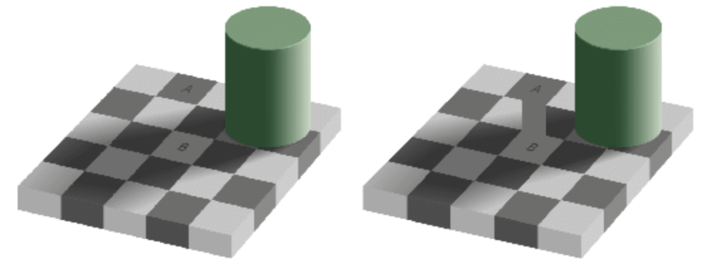
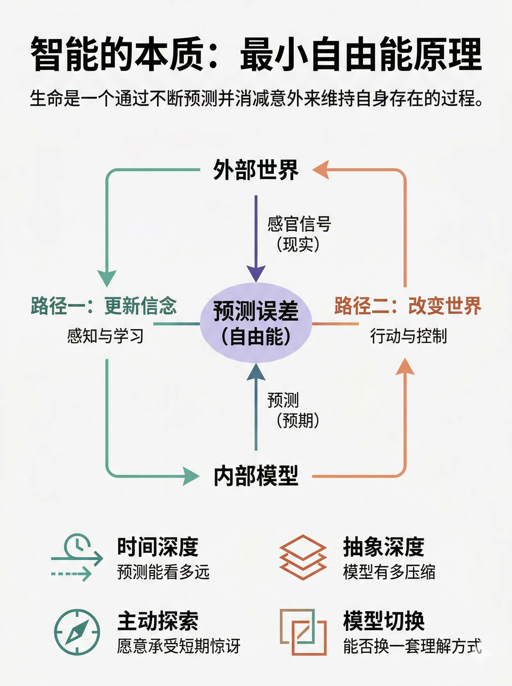
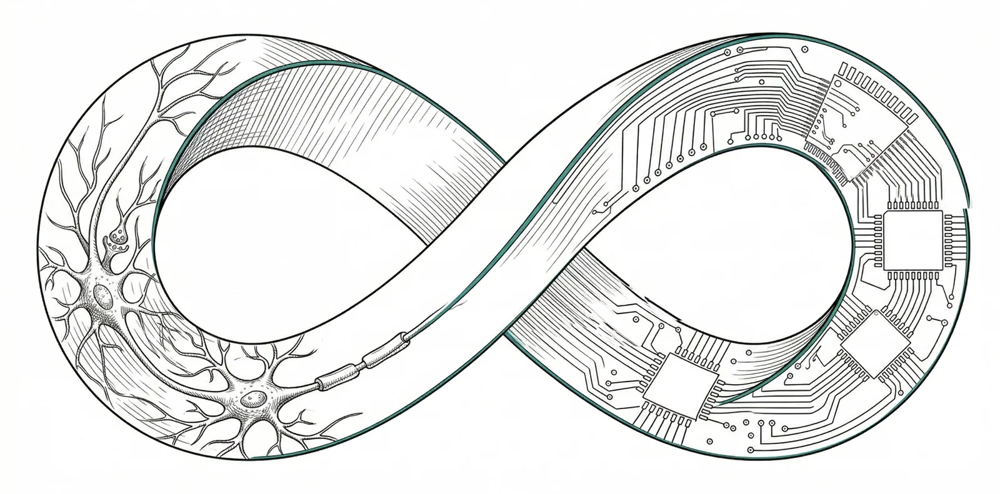



前天在群里看到一句话：“人活着就是为了预测未来”。乍听有点道理，但老冯的看法正好相反。
预测从来不是目的，**活着**才是，所以应该说：**人是通过预测未来来活着的。**

这倒不是什么心灵鸡汤，它背后是一个严肃的科学理论——**自由能原理（Free Energy Principle）**，由神经科学家 Karl Friston 提出。
这个理论野心极大：它试图用一个统一的数学框架，解释感知、学习、决策、行动、情绪、意识……乃至智能本身。

正好今天另一位朋友也[写了篇文章来剖析“智能”](https://mp.weixin.qq.com/s/PPWSh1M_wuoUNoKxZ7A8wQ)，让老冯想到了这个理论。
所以今天就来聊聊最小自由能原理，它对理解 AI、理解 Agent、理解我们正在构建的整个智能系统生态，都有深刻的指导意义。

---

## 一、它说了什么

### 你为什么没死？

这不是骂人，这是一个严肃的物理学问题。

热力学第二定律告诉我们：封闭系统的熵只会增加，一切趋向无序。
一杯热水会变凉，一栋房子没人打理会坍塌，一个系统如果不做任何事情，最终走向热寂。

但你，一个由几十万亿个细胞组成的精密系统，在几十年的时间里维持着极其稳定的有序结构。
体温 37°C，血糖浓度在窄带里波动，心跳、呼吸、激素分泌井然有序。你是一个远离热力学平衡的耗散结构，你的存在本身就是一个需要解释的现象。

那问题来了：**什么样的系统能在热力学上持续存在而不解体？**

Friston 的回答是：这个系统必须拥有一个关于外部世界的**内部模型**，并且持续地**最小化自身的变分自由能**。

### 什么是自由能？

先不上公式（形式化定义放在最后面），用人话来解释自由能这个概念。

想象你走在一条熟悉的路上，突然前方窜出一个黑影。你吓了一跳，这就是“惊讶”（surprise）。
然后你定睛一看，是一只猫。你的大脑迅速把“未知黑影”更新为“一只猫”，惊讶消失了，你继续走路。

这个过程就是自由能最小化的一个微缩版。

**自由能**衡量的是“你以为的世界”和“世界实际给你的信号”之间的**不匹配程度**。自由能高，说明你不断被打脸，世界一直在给你惊讶；自由能低，说明你对世界的理解很到位，预期和现实高度吻合。

而 Friston 的核心论点是：**任何一个能长期存在的自组织系统，其行为在数学上必然等价于在最小化自由能。**这不是一个可选的策略，不是进化“选择”了这条路，而是一个数学必然。如果你还存在着，你就一定在做这件事，否则你早就解体了。

一条鱼必须待在水里，人的体温必须稳定在 37°C 左右。偏离这些状态就意味着解体和死亡。用自由能的语言来说：生命体必须把自己维持在一个“低惊讶”的状态空间里。

### 最小化自由能的两条路

要降低自由能，你有且只有两个方向可以走。

**第一条路：更新信念，感知与学习**

世界给了你一个意外，你修改自己的内部模型去适应它。“哦，原来那个黑影是一只猫。”你更新了信念，惊讶消失了。

短时间尺度上，这叫 **感知**；长时间尺度上，这叫 **学习**。不只是更新一个判断，而是更新你对整个世界运作方式的理解。

**第二条路：改变世界，行动与控制**

你不改变信念，而是改变世界。你预期自己应该是吃饱的，但当前是饿的，这产生了高自由能。于是你去找饭吃，通过行动让现实变成你预期的样子。Friston 管这叫**主动推断（Active Inference）**。

这两条路合在一起，就统一了感知和行动。传统的认知科学把感知和运动控制当成两套独立系统来研究，但自由能原理说：它们是**同一个优化问题的两种解法**。你的大脑不区分“理解世界”和“改变世界”，它只是在持续地最小化自由能。

一句话总结：**生命是一个通过不断预测并消减意外来维持自身存在的过程。**预测是手段，消减惊讶是机制，活着是结果。

### 预测编码：大脑的具体实现

自由能原理是抽象原理，**预测编码（Predictive Coding）** 是它在大脑中的具体实现方式。

大脑皮层是一个层级结构。每一层都在做同样的事：高层向低层发送预测信号。“我认为你接下来应该看到这个。”
低层拿实际感官输入和预测做比较，计算出预测误差；误差往上传，驱动高层更新信念；
更新后的信念产生新的预测，再向下传。循环往复，永不停止。

这个架构有一个非常优雅的性质：**信息传递是高度压缩的**。
只有预测误差（意外的部分）需要往上传，符合预期的部分被“解释掉”了。
大脑不是在传输原始数据，而是在传输“新闻”，只有出乎意料的才值得传。

所以你的大脑不是一个被动的接收器，而是一台主动的**预测生成器**。
你看到的、听到的、感受到的，大部分是大脑自己“脑补”出来的，感官输入只是用来纠错的。

---

## 二、它能解释什么

一个好理论的标志是：它能用一套机制解释大量看似不相关的现象。自由能原理在这方面非常强大。

### 解释感知：你的世界是大脑的一场可控幻觉

既然大脑在不断“脑补”，感官只是负责纠错，那很多知觉现象就说得通了：

**鸡尾酒会效应**——在嘈杂环境中你依然能听清朋友说话。因为大脑用语境在不断预测下一个词，只需要从声波里提取少量误差信号来修正就够了。大脑替你“脑补”了 80% 的内容。

**视觉错觉**——你的大脑过度依赖了先验预测，把“脑补”当成了现实。模型太强势，感官输入被压制了。

**变化盲视**——一张照片里换掉一个大物件你可能根本注意不到。因为你的预测没有覆盖到那个区域，没有预测自然不会有预测误差，没有误差信号就等于“什么都没发生”。

### 解释情绪：你的仪表盘在报什么数

在自由能框架下，情绪不是什么附加模块，而是预测系统的**内置仪表盘**。它告诉你当前自由能的状况。

**焦虑** —— 模型预测到了前方有大量不确定性：“我不知道会发生什么，但我觉得不会好。”这是高期望自由能的警报。

**好奇心** —— 模型发现了一块“可以被消除的不确定性”：“这个东西我不懂，但我觉得我能搞懂。”这是认知价值在驱动你。

**愉悦** —— 预测误差被成功消减：“我猜对了”，或者“事情按预期发展了”。

**无聊** —— 预测误差长时间接近于零。没什么新东西可学，模型没有在进步。

**惊喜** —— 正向的预测误差：世界比你预期的更好。

这个框架甚至可以解释 **为什么好的音乐让人愉悦**。音乐在不断建立预期，然后在恰到好处的时候打破预期，制造可控的惊讶拉高自由能，然后再进行 “**解决**”。
完全符合预期的音乐令人无聊，完全出乎预期的噪音令人不适。最好的音乐在预测和惊讶之间精确起舞，持续地给你的预测系统喂恰到好处的误差信号。

### 解释好奇心与探索：为什么你不会躲在黑屋子里

这是自由能原理最精彩的推论。

如果一个系统只是在最小化当下的惊讶，那最优策略显然是找个黑屋子躲起来不动，那里永远不会有意外。但生物不是这样的。生物会探索、会冒险、会好奇。为什么？

因为自由能最小化不只看当下，还看 **期望的未来**。

你主动探索一个未知环境，短期内惊讶确实增加了，但你的模型因此变得更准确了，意味着你**未来所有时刻**的期望自由能都降低了。这在信息论上叫做**信息增益（Information Gain）**。

好奇心、探索、科学研究，甚至小孩子不知疲倦地玩耍，这些行为看起来像是在“自找麻烦”，但在自由能框架下完全合理：**它们在做长期自由能最小化，用短期的惊讶换取长期的确定性。**

这也解释了为什么学习新东西的过程是痛苦的（短期自由能飙升），但学会之后是愉悦的（模型升级了，长期自由能大幅下降）。

**一个智能系统的核心标志：愿意为了长期的模型精度而承受短期的惊讶。**

### 解释心理病理：预测系统出了 bug

这个框架对精神疾病也有很强的解释力。它把不同的心理疾病解释为预测系统中**不同参数的失调**。

**自闭症谱系**
: 先验（预测）的权重过低，预测误差的权重过高。不是不能感知，而是感知到了太多。每个细节都是“新闻”，大脑被预测误差信号淹没，无法形成稳定的高层预测。
这就解释了感官过载、对变化的极端敏感，以及对重复性和规律性的强烈偏好，因为只有在高度可预测的环境里，预测误差才不会淹没系统。

**精神分裂症（部分症状）**
: 先验权重过高，预测误差被忽略。大脑过度相信自己的内部模型，感官输入的纠错信号传不上去，模型开始“自嗨”，产生幻觉和妄想。

**抑郁症**
: 生成模型被悲观信念锁死：“一切都不会好的。”这个先验太强了，即使正面的感官输入进来，也会被高权重的悲观预测压掉。负面预测变成了自我实现的预言。

**上瘾**
: 短期自由能最小化劫持了长期最小化。药品或行为提供了一条极其可靠的短期惊讶消减路径，以至于系统放弃了更健康的长期策略。

这不只是用新术语包装旧常识。它为临床现象提供了一个**可计算、可建模**的理论框架。你可以在模型的参数空间里精确地刻画“哪里出了问题”，这就打开了精确干预的可能性。

---

## 三、它能指导什么

一个理论如果只能解释已知现象，那它只是事后诸葛亮。自由能原理真正厉害的地方，是它的**指导性**。它直接告诉你，智能是什么，以及要在哪些维度上提升。

### 智能的四个维度

在自由能框架下，智能不是一种特殊的、神秘的能力，而是自由能最小化做得特别好时涌现出来的性质。一个系统越“智能”，它在以下四个维度上就做得越好：

时间深度：你的预测能看多远
: 一个恒温器只看当下，温度偏了就开暖气。一只老鼠能为冬天储粮，它在为几个月后做准备。一个人能为二十年后的退休攒钱，能为百年后的气候变化制定政策。
  生成模型覆盖的时间跨度越长，系统就越能消减远期的不确定性，系统就越智能。

抽象深度：你的模型有多压缩
: 一只青蛙的视觉系统只有“小黑点在动 → 吐舌头”这一层。人类的认知系统从像素到边缘到物体到场景到叙事到因果理论到数学公理，层层抽象，每一层都在压缩下一层的预测误差，抽取更高阶的规律。
  牛顿用 \(F=ma\) 和一个万有引力公式，消减了关于所有宏观物体运动的海量不确定性。这是极致的模型压缩。

  **科学本身就是人类文明级别的自由能最小化，用最简的模型解释最多的现象。**
  而自由能公式里天然包含了对模型复杂度的惩罚，这就是奥卡姆剃刀的数学形式。最小化自由能的系统，自然倾向于用最简的模型解释数据。

主动探索：你有多愿意承受短期惊讶
: 一个只优化当下的系统会躲起来。真正智能的系统会主动出击，承受短期惊讶以换取长期的模型精度。
  
  好奇心不是智能的副产品，而是智能的**核心驱动力**。一个不好奇的系统，就是一个放弃了长期自由能最小化的系统。

模型切换：你能不能换一套理解方式
: 最高阶的智能不是在一个固定模型里调参数，而是能识别出“当前模型不够用了”，然后**创造或切换到一个全新的模型**。
  
  当牛顿力学解释不了水星近日点进动时，爱因斯坦没有在旧框架里硬调，而是创建了广义相对论。这种能力对应的就是在模型空间上的搜索和跳跃，也就是“顿悟”和“范式转换”的数学本质。
  大多数时候，你在一个模型内部做推断。偶尔，你需要跳出模型本身。后者才是真正稀缺的智能。

### 对 AI 的指导

这套理论对理解和构建 AI 系统有直接的指导意义。

大语言模型在做什么？
: 预测下一个 token。训练过程最小化的是交叉熵，而交叉熵就是惊讶度的期望值。所以 LLM 的训练在数学上等价于自由能最小化的第一条路，也就是更新内部模型。这也解释了为什么 LLM 能涌现出某种“理解力”：它在压缩预测误差的过程中，不得不学会语言背后的世界模型。

LLM 缺什么？
: 两个关键缺口。第一，没有第二条路，主动推断。它不能采取行动去改变世界，只是一个被动的预测器。第二，没有持续的自由能最小化循环。每一次推理都是一个无状态的函数调用，不是一个在时间中持续存在、需要维持自身的系统。

Agent 补上了什么？
: **第二条通路。一个 Agent 有了感知（获取信息）、有了行动（调用工具、改变环境）、有了持久状态（记忆），它就从一个“被动预测器”变成了一个“主动推断系统”。这在自由能框架下是一个本质的跃迁，从半个闭环变成了完整闭环。

什么才是真正的通用智能？
: 四个维度全拉满：能做长时间尺度的预测（时间深度），能形成高度抽象的模型（抽象深度），能主动探索未知（好奇心），能在模型不够用时跳出来换一套（创造力）。目前的 AI 系统在每个维度上都有明显的天花板，认清这些天花板在哪里，本身就是很有价值的。

### 对个人认知的指导

这套理论不只是学术话题，它对日常的自我管理也有非常实用的指导。

学习的本质是什么？
: 更新你的生成模型。当你觉得“学不进去”的时候，本质上是预测误差超出了你的处理能力。要么误差太大（材料太难，你完全预测不了），要么误差太小（太简单，没有新信息）。最高效的学习发生在预测误差存在但可控的区间，这就是心理学里说的“最近发展区”，也是“心流”状态的本质。

如何处理焦虑？
: 两条路：要么提升你模型的精度（多学、多了解，降低不确定性），要么改变环境（主动行动，消除焦虑的来源）。无效的方式是什么？既不更新模型也不采取行动，而是反复在同一个不完善的模型里做推断，这就是“overthinking”，即内耗。

为什么应该“走出舒适区”？
: 因为待在舒适区等于待在“黑屋子”里。预测误差为零，模型不再更新。但世界在变，你的模型没跟上，长期自由能其实在悄悄积累。主动走出去，短期自由能飙升，但模型升级了，长期收益巨大。

---

## 附录：自由能的形式化定义

前面我们一直用直觉来理解自由能。如果你对数学感兴趣，这里给出严格定义。不感兴趣可以跳过，不影响对全文的理解。

变分自由能的定义：

$$
F = E_q[\ln q(s) - \ln p(s, o)]
$$

其中：

- \(o\) 是你观测到的感官数据
- \(s\) 是世界的隐藏状态（你看不到的真实原因）
- \(q(s)\) 是大脑对隐藏状态的信念（一个近似后验分布）
- \(p(s, o)\) 是生成模型，你认为世界如何运作的联合概率

这个公式可以等价地拆成两种形式，每种揭示不同的含义。

**拆法一（惊讶上界）：**

$$
F = \underbrace{D_{KL}[q(s) \| p(s|o)]}_{\text{信念与现实的偏差}} + \underbrace{(-\ln p(o))}_{\text{惊讶度}}
$$

KL 散度恒 ≥ 0，所以 \(F\) 永远 ≥ 惊讶度。自由能是惊讶的上界。你没法直接算惊讶（需要对所有隐藏状态积分），但你能算自由能，压低它就一定压低了惊讶。

**拆法二（准确度 vs 复杂度）：**

$$
F = \underbrace{E_q[-\ln p(o|s)]}_{\text{预测误差}} + \underbrace{D_{KL}[q(s) \| p(s)]}_{\text{模型复杂度}}
$$

第一项衡量模型解释数据的能力，第二项衡量信念偏离先验的程度。最小化自由能 = 在准确度和简洁性之间取最优平衡。这就是**奥卡姆剃刀的数学形式**。

熟悉机器学习的读者应该已经认出来了：这和变分推断中的 ELBO（Evidence Lower Bound）完全等价，取个负号就是自由能。VAE、变分贝叶斯、EM 算法，底层都是这套数学。Friston 的洞见在于：这不只是一个计算技巧，**而是生命本身的运作原理**。

---

## 尾声

回到开头那句话：“人活着就是为了预测未来。”

改一下顺序就对了 —— 人活着不是“为了”预测未来，而是“通过”预测未来来活着。

把它再推广一步：

> **生命是一个通过不断预测并消减意外来维持自身存在的过程。**
>
> **智能是这个过程在时间深度、抽象深度、探索主动性和模型灵活性上的延伸。**

这不是一个比喻。这是一个有数学基础、有神经科学证据、有工程映射的理论。
它用一个原理，最小化自由能，把生命、智能、感知、行动、情绪、好奇心、学习、创造力，全部串联在了一起。

当你真正理解了这个框架，你会发现：我们正在构建的这些 AI 系统，
不是在“发明”智能，而是在用另一种介质，重新实现生命已经运行了几十亿年的那套算法。

只不过这次，载体从碳基换成了硅基。

