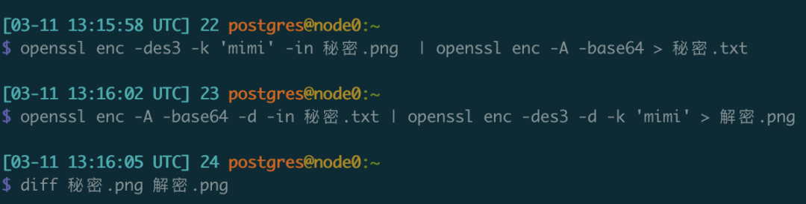

> [Original WeChat Article](https://mp.weixin.qq.com/s/zUu5PlN_Kzd2-RS10R7wMw)

A classic problem in cryptography is how to transmit data securely and reliably through insecure channels. Protecting your chats and communications from eavesdropping, surveillance, and censorship. With just a computer at hand, you can easily achieve this.

## Problem 1

Assume two users Alice (翠花) and Bob (老王) are using Oscar's (马大帅) monopolistic chat software MarcoMessage (宏信) to discuss private matters. For example:

```bash
Bob  ------->   Want to meet?  --------->  Alice
Bob  <-------   Sure! <---------  Alice
```

Since Oscar can peek at their messages, which is problematic, the two agree on a secret code in advance: **mimi**

Before sending messages, Alice encrypts them using OpenSSL:

```bash
echo 'Want to meet?' | openssl enc -des3 -k 'mimi'  | openssl enc -A -base64
```

The encrypted result is:

```bash
U2FsdGVkX19oIKhDajSdxib3KuoWR2Fh
```

Alice sends this encrypted message through MarcoMessage to Bob. Upon receiving this garbled text, Bob uses the pre-agreed password to decrypt it:

```bash
echo 'U2FsdGVkX19oIKhDajSdxib3KuoWR2Fh' | openssl enc -A -base64 -d | openssl enc -des3 -d -k 'mimi'
```


Here, you simply need to replace the content to be encrypted and the password with what you want to use.

## Problem 2

This time, Alice wants to send a secret photo. Assume it's named **secret.png**

Alice still uses the password `mimi` to perform magical processing on this image:

```bash
openssl enc -des3 -k 'mimi' -in secret.png  | openssl enc -A -base64 > secret.txt
```

Thus, the photo `secret.png` becomes a bunch of garbled text represented as `secret.txt`. Alice sends `secret.txt` to Bob through MarcoMessage file transfer. Bob, understanding the arrangement, applies the following technique, and **secret.txt** becomes **decrypted.png**, turning back into an openable image.

```bash
openssl enc -A -base64 -d -in secret.txt | openssl enc -des3 -d -k 'mimi' > decrypted.png
```



Here, you just need to replace the filenames with the files you want to encrypt and decrypt.

## Problem 3

Alice and Bob's password was too easy to guess, and Oscar quickly figured out their agreed password. So they face a new challenge: how to negotiate a new password. Unfortunately, they only have MarcoMessage available—they certainly can't send the password directly, right?

Fortunately, **asymmetric encryption** can solve this problem. Encryption methods that use the same key for both encryption and decryption are called **symmetric encryption**, like the examples above where the same password is used for both encryption and decryption. There's another magical encryption method called **asymmetric encryption**. The principle is very simple: **the key used for encryption is different from the key used for decryption**. Two different passwords are used for encryption and decryption, called private key and public key respectively. Both keys can be used to lock, and what's locked with either key can only be unlocked with the other: for example, what's locked with the public key can only be unlocked with the private key; what's locked with the private key can only be unlocked with the public key. Knowing the private key allows you to derive the public key, but knowing the public key doesn't allow you to derive the private key.

Based on this characteristic, the public key can be openly shared—anyone can use this public password to lock data, but only the holder of the private key can decrypt the ciphertext. Here, if Bob wants to send a secret message to Alice through the insecure chat software, Alice needs to cooperate. Alice needs to generate a pair of public and private keys:

```bash
# Generate private key file: private_key
openssl genrsa -out private_key 2048
# Generate corresponding public key file from private key: public_key
openssl rsa -in private_key -pubout -out public_key
```

Then Alice sends her public key to Bob through any method. Even if others obtain it, it's useless because the public key can only be used to decrypt information locked with the private key, and the private key cannot be deduced from just the public key.

After Bob receives Alice's public key, he encrypts the secret information he wants to send to Alice using this public key:

```bash
echo -n 'There is a mole, abort transaction' | openssl rsautl -encrypt -oaep -pubin -inkey public_key | openssl enc -A -base64
```

This produces an encrypted ciphertext string, which Bob then sends back to Alice.

```
ZrmUyA8zGWgEr/dPLX7QbfoZ1mUwvim0yau7LrnMFRUGh0KtxvinBBQuUpvzGr+1MAccd6hFDQPJ/CwHnlM3Kk2Da8g1SCR+CU8EReQ+CBLdbfvFXw4pjScMKsuubgY77jTKpkZQXcLnIM7DOZueEevASTX/+/J++W5IPgUhVIEiqX1tn63bVD6Jv3b7knWovv+mT97liqx8dV+JLgNvpm8/F05SGCInKZ9m7bXga3bxg/SfcI38VNKVpJnBph2gTgv0ZlFHKDxR2tFMfCfQgD2lrWaxlTdAx1QDtn1ter2whDXmazm/rUR07YvpQjBbboB2+fq5Kp44/buvj16Ksw==
```

After Alice receives the ciphertext, she uses her private key to decrypt it:

```bash
echo ZrmUyA8zGWgEr/dPLX7QbfoZ1mUwvim0yau7LrnMFRUGh0KtxvinBBQuUpvzGr+1MAccd6hFDQPJ/CwHnlM3Kk2Da8g1SCR+CU8EReQ+CBLdbfvFXw4pjScMKsuubgY77jTKpkZQXcLnIM7DOZueEevASTX/+/J++W5IPgUhVIEiqX1tn63bVD6Jv3b7knWovv+mT97liqx8dV+JLgNvpm8/F05SGCInKZ9m7bXga3bxg/SfcI38VNKVpJnBph2gTgv0ZlFHKDxR2tFMfCfQgD2lrWaxlTdAx1QDtn1ter2whDXmazm/rUR07YvpQjBbboB2+fq5Kp44/buvj16Ksw== | openssl enc -A -base64 -d | openssl rsautl -decrypt -oaep -inkey private_key
There is a mole, abort transaction
```

She then sees the secret message:


Eavesdropper Oscar can see this ciphertext and Alice's public key. But he can't decrypt it, because the characteristic of asymmetric encryption is that what's locked with one key can only be unlocked with the other, and knowing only the public password doesn't allow deduction of the private password.


Similarly, when Alice wants to send secrets to Bob, she just needs to reverse the process. Bob generates a public-private key pair and sends his public key to Alice. Alice encrypts using Bob's public key and sends the ciphertext to Bob, and only Bob can use his private key to decrypt and read it.

It's that simple.

## Problem 4

> How to install OpenSSL?

Well, this software is so common that many operating systems come with it built-in. If you're using Mac or Linux, just open Terminal and type `openssl`. For Windows, you need to download it separately—you can refer to articles like "install openssl on windows" which have plenty of detailed tutorials with screenshots. I won't elaborate here.

I know many readers don't even know how to open a terminal or command line, and I really want to add an illustrated tutorial. On Mac and Linux, you need to find a built-in system app called Terminal and open it. On Windows, you can search for `cmd.exe` in the start menu, then follow any installation tutorial. Due to laziness and time constraints, that's all I can provide.

## Command Summary

```bash

# Encrypt messages
echo 'Want to meet?' | openssl enc -des3 -k 'mimi'  | openssl enc -A -base64
echo 'U2FsdGVkX19oIKhDajSdxib3KuoWR2Fh' | openssl enc -A -base64 -d | openssl enc -des3 -d -k 'mimi'

# Encrypt files
openssl enc -des3 -k 'mimi' -in secret.png  | openssl enc -A -base64 > secret.txt
openssl enc -A -base64 -d -in secret.txt | openssl enc -des3 -d -k 'mimi' > decrypted.png

# Exchange passwords
# Alice generates public-private key pair, sends public key to Bob
openssl genrsa -out private_key 2048
openssl rsa -in private_key -pubout -out public_key

# Bob encrypts with public key, Alice decrypts with private key
echo -n 'There is a mole, abort transaction' | openssl rsautl -encrypt -oaep -pubin -inkey public_key | openssl enc -A -base64
echo '<string encrypted with public key>' | openssl enc -A -base64 -d | openssl rsautl -decrypt -oaep -inkey private_key
```

## Summary

After mastering the three techniques above (encrypt messages, encrypt files, exchange passwords), you can secretly exchange information with anyone through any public channel.

You can use this with confidence. According to Article 40 of the Constitution of the People's Republic of China: "The freedom and privacy of correspondence of citizens of the People's Republic of China are protected by law. No organization or individual may, for any reason, infringe upon citizens' freedom and privacy of correspondence, except when public security or procuratorial organs conduct inspections of correspondence according to procedures prescribed by law due to needs of state security or criminal investigation."

But you must comply with relevant laws and regulations. According to Article 32 of the Cryptography Law of the People's Republic of China:

> Article 32: Anyone who violates Article 12 of this law by stealing encrypted information from others, illegally infiltrating others' cryptographic protection systems, or **using cryptography to engage in illegal activities that endanger national security, social public interests, or others' legitimate rights and interests** shall be held legally responsible by relevant departments in accordance with the Network Security Law of the People's Republic of China and other relevant laws and administrative regulations.