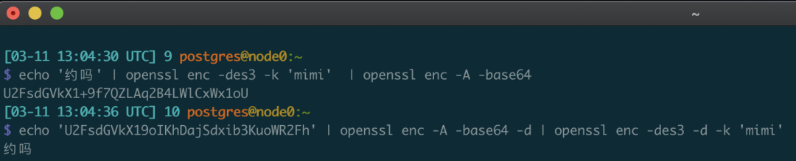
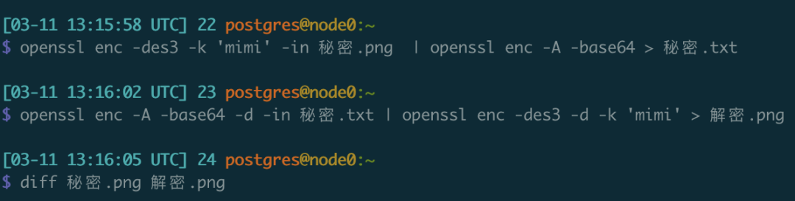
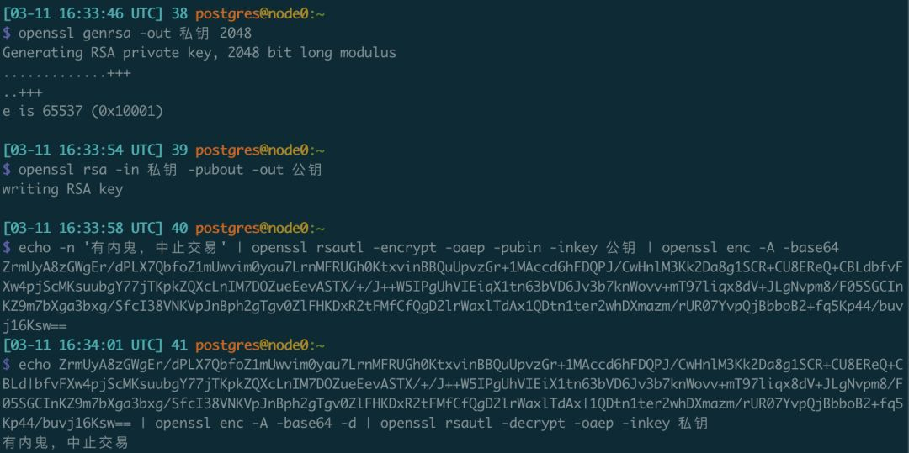

> [微信公众号原文](https://mp.weixin.qq.com/s/zUu5PlN_Kzd2-RS10R7wMw)


密码学里有一个经典的问题，就是如何在不安全的信道中安全可靠地传输数据。避免自己的聊天与通信遭到偷窥，监控与河蟹。只要你手头有电脑，就可以轻易做到这一点。

## 问题1

现假设有两个用户翠花（Alice）与老王（Bob），正在使用偷窥狂马大帅（Oscar）家的垄断聊天软件宏信（MarcoMessage）讨论私密的事情。譬如：

```bash
老王  ------->   约吗  --------->  翠花
老王  <-------   约！<---------  翠花
```

消息被马大帅偷看去了，很不好，所以两人事先约定好一个秘密暗号: **mimi**

于是，翠花在发送消息前，使用OpenSSL对消息进行了加密处理：

```bash
echo '约吗' | openssl enc -des3 -k 'mimi'  | openssl enc -A -base64
```

加密结果为：

```bash
U2FsdGVkX19oIKhDajSdxib3KuoWR2Fh
```

翠花把这条消息贴到宏信里发给老王，老王收到这条乱码后，使用约定好的那个密码解密：

```bash
echo 'U2FsdGVkX19oIKhDajSdxib3KuoWR2Fh' | openssl enc -A -base64 -d | openssl enc -des3 -d -k 'mimi'
```




这里，你只需要把要加密的内容和密码替换成为你想要的东西就可以。

 

## 问题2

这次，翠花要发的秘密是一张私密的照片。假设名为 **秘密.png**

翠花依然使用密码`mimi`对这张图片进行奇妙处理：

```bash
openssl enc -des3 -k 'mimi' -in 秘密.png  | openssl enc -A -base64 > 秘密.txt
```

于是，照片`秘密.png`就变成了一堆乱码表示的`秘密.txt`。翠花把`秘密.txt`通过宏信文件发送给老王，老王心领神会，使出如下技法，**秘密.txt** 又变成了 **解密.png**，成为重新可以打开的图片了。

```bash
openssl enc -A -base64 -d -in 秘密.txt | openssl enc -des3 -d -k 'mimi' > 解密.png
```



这里，只要把文件名换成你想加解密的文件名就可以。

 

## 问题3

翠花与老王的密码实在太好猜了，马大帅一下就猜中了两人约定的密码。于是两人遇到了一个新的难题，如何协商出一个新的密码来。不幸的是，两人手头只有宏信可以用，总不能直接把密码发过去吧？

好在**非对称加密**可以解决这个问题。加解密使用同一个密钥的加密方式称为**对称加密**，例如上面无论是加密和解密都是用的同一个密码。还有一种神奇的加密方式，称为**非对称加密**。这种加密方式的原理非常简单：**加密用的密钥和解密用的密钥不一样**。加解密时会用到这两个不同的密码，分别称为私钥和公钥。两把钥匙都可以用来上锁，用任意一把钥匙加的锁，只能用另一把钥匙都打开：比如，用公钥上的锁，只有私钥可以打开；私钥上的锁，只有公钥可以打开。知道私钥就可以推断出公钥，但是知道公钥没办法推断出私钥。

所以基于这种特性，两个密码中的公钥可以大大方方地公开，任何人都可以使用这个公开的密码加锁，但只有私钥的持有人才能解开密文。这里，如果老王想通过不安全的聊天软件向翠花发送一条秘密信息，那么需要翠花的配合。翠花需要生成一对公私钥

```bash
# 生成私钥文件: 私钥
openssl genrsa -out 私钥 2048
# 从私钥计算生成对应的公钥文件 公钥
openssl rsa -in 私钥 -pubout -out 公钥
```

然后，翠花将自己的公钥通过随便什么方式发送给老王。别人拿到了也没用，因为公钥只能用来解开私钥上锁的信息，而只有公钥是无法推断出私钥的。

老王收到翠花的公钥后，把要发给翠花的秘密信息用这个公钥加密：

```bash
echo -n '有内鬼，中止交易' | openssl rsautl -encrypt -oaep -pubin -inkey 公钥 | openssl enc -A -base64
```

得到了一串加密后的密文，然后老王将这串乱码发送回给翠花。

```
ZrmUyA8zGWgEr/dPLX7QbfoZ1mUwvim0yau7LrnMFRUGh0KtxvinBBQuUpvzGr+1MAccd6hFDQPJ/CwHnlM3Kk2Da8g1SCR+CU8EReQ+CBLdbfvFXw4pjScMKsuubgY77jTKpkZQXcLnIM7DOZueEevASTX/+/J++W5IPgUhVIEiqX1tn63bVD6Jv3b7knWovv+mT97liqx8dV+JLgNvpm8/F05SGCInKZ9m7bXga3bxg/SfcI38VNKVpJnBph2gTgv0ZlFHKDxR2tFMfCfQgD2lrWaxlTdAx1QDtn1ter2whDXmazm/rUR07YvpQjBbboB2+fq5Kp44/buvj16Ksw==
```

翠花收到密文后，使用自己的私钥解密：

```bash
echo ZrmUyA8zGWgEr/dPLX7QbfoZ1mUwvim0yau7LrnMFRUGh0KtxvinBBQuUpvzGr+1MAccd6hFDQPJ/CwHnlM3Kk2Da8g1SCR+CU8EReQ+CBLd|bfvFXw4pjScMKsuubgY77jTKpkZQXcLnIM7DOZueEevASTX/+/J++W5IPgUhVIEiX1tn63bVD6Jv3b7knWovv+mT97liqx8dV+JLgNvpm8/F05SGCInKZ9m7bXga3bxg/SfcI38VNKVpJnBph2gTgv0ZlFHKDxR2tFMfCfQgD2lrWaxlTdAx|1QDtn1ter2whDXmazm/rUR07YvpQjBbboB2+fq5Kp44/buvj16Ksw== | openssl enc -A -base64 -d | openssl rsautl -decrypt -oaep -inkey 私钥
有内鬼，中止交易
```

就看到了秘密的信息：


偷窥者马大帅能够看到这串密文，也能看到翠花的密钥。但他没法解密，因为非对称加密的特点就是。一把钥匙加的锁只能用另一把打开，而只知道公开的密码是没法推断出另一个私下的密码的。



同理，翠花想要向老王发送秘密的时候，只需要反过来即可，老王生成公私钥对，将自己的公钥发给翠花。翠花使用老王的密钥加密后将密文发送给老王，只有老王能用自己的私钥解开来看。

就是这么简单

 

## 问题4

> OpenSSL怎么安装？

Well，这个软件实在是太常见了，以至于很多操作系统都自带了它。如果你用的是Mac或者Linux，只需要打开终端/Terminal，敲`openssl`就可以了。如果是Windows，则需要单独下载，可以参考一些文章，譬如“windows 安装openssl”就有大把图文翔实际的教程文章，在此不再赘述。

我知道不少读者甚至都不知道怎样打开终端或者命令行，真的很想补充一篇图文并茂的教程。在Mac和Linux上你需要找到一个叫Terminal的系统自带的App打开就可以，在Windows下你可以在开始菜单搜索`cmd.exe`，然后按照随便哪一篇安装教程走过场即可。因为懒病和时间关系，也只能这样了。


## 命令小结

```bash

# 加密信息
echo '约吗' | openssl enc -des3 -k 'mimi'  | openssl enc -A -base64
echo 'U2FsdGVkX19oIKhDajSdxib3KuoWR2Fh' | openssl enc -A -base64 -d | openssl enc -des3 -d -k 'mimi'

# 加密文件
openssl enc -des3 -k 'mimi' -in 秘密.png  | openssl enc -A -base64 > 秘密.txt
openssl enc -A -base64 -d -in 秘密.txt | openssl enc -des3 -d -k 'mimi' > 解密.png

# 交换密码
# 翠花生成公私钥对，公钥发送给老王
openssl genrsa -out 私钥 2048
openssl rsa -in 私钥 -pubout -out 公钥

# 老王用公钥加密，翠花用私钥解密
echo -n '有内鬼，中止交易' | openssl rsautl -encrypt -oaep -pubin -inkey 公钥 | openssl enc -A -base64
echo '<用公钥加密的字符串>' | openssl enc -A -base64 -d | openssl rsautl -decrypt -oaep -inkey 私钥
```


## 小结

学会了上面三招（加密信息，加密文件，交换密码）之后，你就可以用任何公开的信道和任何人秘密地交换信息了。

你可以理直气壮地使用它，根据《中华人民共和国宪法》第四十条规定：中华人民共和国公民的通信自由和通信秘密受法律的保护。除因国家安全或者追查刑事犯罪的需要，由公安机关或者检察机关依照法律规定的程序对通信进行检查外，任何组织或者个人不得以任何理由侵犯公民的通信自由和通信秘密。

但一定要遵守相关法律法规，根据《中华人民共和国密码法》第三十二条规定：

> 第三十二条　违反本法第十二条规定，窃取他人加密保护的信息，非法侵入他人的密码保障系统，或者**利用密码从事危害国家安全、社会公共利益、他人合法权益等违法活动的**，由有关部门依照《中华人民共和国网络安全法》和其他有关法律、行政法规的规定追究法律责任。
