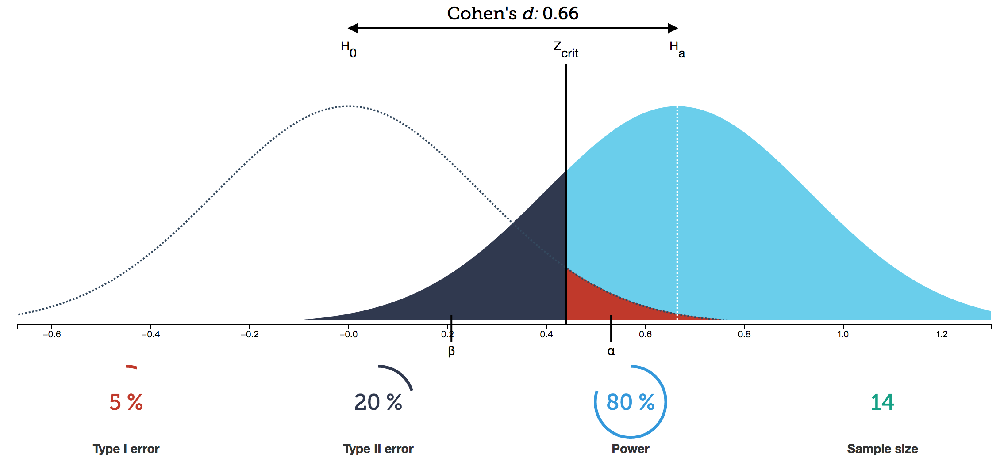
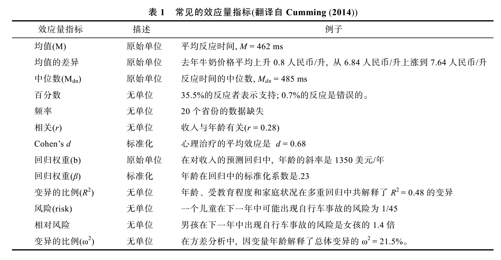



> The core of inferential statistics lies in hypothesis testing. The basic logic is based on an important argument from philosophy of science: **universal propositions can only be falsified, not proven**. The reasoning is simple: individual cases cannot prove a universal proposition, but they can refute it.

<!--more-->

## Philosophical Foundation of Hypothesis Testing

The basic idea of hypothesis testing is: probabilistic proof by contradiction. The hypothesis in hypothesis testing is a general statement about the population, and the test examines whether conclusions drawn from samples can be generalized to the population.

The basic logic of hypothesis testing is based on an important argument from philosophy of science: **universal propositions can only be falsified, not proven**. The reasoning is simple: individual cases cannot prove a universal proposition, but they can refute it.

Since the conclusion we want to prove cannot be demonstrated through enumerating individual cases, we create a null hypothesis that contradicts our original hypothesis. The original hypothesis is called the alternative hypothesis, and between the alternative hypothesis and null hypothesis, one must be chosen. So if we can falsify the null hypothesis, we can indirectly prove that our alternative hypothesis of interest holds.

Due to sampling, samples cannot absolutely falsify the null hypothesis. In individual cases, **low-probability events can be treated as impossible events**. In this sense, we reject the null hypothesis at a predetermined probability level (α).

<!--more-->

## Terminology and Concepts in Hypothesis Testing

##### Concept: Alternative Hypothesis $H_1$ (alternative hypothesis)

The alternative hypothesis $H_1$ states that **differences in results under different conditions are caused by the independent variable**, usually the hypothesis we want to prove. It can be directional or nondirectional.

##### Concept: Null Hypothesis $H_0$ (null hypothesis)

The null hypothesis $H_0$ states that **differences in results under different conditions are caused by random error**. The null hypothesis is the opposite of the alternative hypothesis; they are mutually exclusive and exhaustively cover all possibilities—one must be chosen. For nondirectional alternative hypotheses, the null hypothesis is: the independent variable has no effect on the dependent variable; for directional alternative hypotheses, the null hypothesis is: the independent variable has no effect on the dependent variable in the specified direction.

Because the null hypothesis assumes the obtained results are due to random factors, probability theory can be used to calculate the probability distribution of random sampling results.

##### Concept: Sampling Distribution

A statistic is a function of the sample, and the sampling distribution of a statistic represents all possible values of that statistic and their corresponding probabilities (PMF, PDF) during sampling.

##### Concept: Critical Region for Rejection of $H_0$

The critical region for rejecting the null hypothesis refers to the area under the curve containing all values of the statistic that would lead to rejection of the null hypothesis. The critical value of the statistic is the value that delineates the critical region, determined by the α level.

##### Concept: Type I Error

Rejecting the null hypothesis when it is true. False Positive, called Type I error.

##### Concept: Type II Error

Accepting the null hypothesis when it is false. False Negative, called Type II error.

##### Definition: The Power of an Experiment

Experimental power is defined as: the probability that experimental results allow rejection of the null hypothesis when the independent variable has a real effect.

β is defined as the probability of making a Type II error, β = 1 - power.

## Process of Hypothesis Testing

1. **Repeated Measures Design**

   The most basic form of this design includes only two conditions: **experimental condition** and **control condition**. Except for the independent variable, all other factors should be as similar as possible between these two conditions. This is the controlled variable method.

2. **Propose Alternative Hypothesis $H_1$ and Corresponding Null Hypothesis $H_0$**

   Interpreting results in any experiment requires weighing two hypotheses: the Alternative hypothesis and the Null hypothesis.

3. **Test Null Hypothesis $H_0$: Select, Calculate and Test Appropriate Statistics**

   Assume the independent variable is ineffective, i.e., the null hypothesis is true, and the sample is randomly drawn from the null hypothesis population.

   Calculate the statistic to obtain the probability p of this result or more extreme results occurring.

   Then make decisions based on α level: if p ≤ α, reject $H_0$; otherwise, retain $H_0$.

## Results of Hypothesis Testing

| Decision | Retain $H_0$ | Reject $H_0$ |
| --- | --- | --- |
| $H_0$ is true (random factors) $p_1$ | Correct decision, True Negative, TN, (1-α) | Type I error, FP, incorrectly rejected $H_0$ (α) |
| $H_0$ is false (independent variable effective) $p_2$ | Type II error, FN, incorrectly retained $H_0$ (β) | Correct decision, True Positive, TP, (power = 1-β) |

* The α level determines the probability of making a Type I error, and the β level determines the probability of making a Type II error.
* The p-value **is the likelihood of the current data appearing when you assume there is no effect**.
* Decision principle: We artificially set a value (0.05 in psychology, 0.0000003 in physics, approximately 5σ in normal distribution). If the p-value is less than this value, we consider there might be an effect.
* We don't know the probabilities of $H_0$ being true ($p_1$) or false ($p_2$). What we can know is only the probability of the current result pattern occurring when $H_0$ is true, i.e., when only random factors are at work. That is, $p = P(D^*|H_0)$. We cannot infer the probability $p_1$ of $H_0$ being true from the p-value, because the probability of the current data pattern conditional on $H_0$ being true is not equal to the probability of $H_0$ being true conditional on the current data pattern.

$$
P(D^*|H_0) \ne P(H_0|D^*)
$$

* p > 0.05 does not mean there is no effect; it's possible the effect is small and more samples are needed to detect it. p < 0.05 only indicates the independent variable is **significant**, meaning **this factor is not caused by random factors** and has a real effect. But significant doesn't equal important: an extremely small difference detected as significant through massive samples may be practically meaningless. Knowing how large an effect is more meaningful than knowing the effect exists, which introduces the concept of effect size.

* [As shown in the figure](http://rpsychologist.com/d3/NHST/), assuming the test statistic follows a normal distribution, the left side shows the distribution of statistics sampled from the **null hypothesis population**, and the right side shows the probability distribution of statistical results sampled from the population when the independent variable has a real effect.

* Both statistical distributions are PDFs, with the area under the curve equaling 1, extending infinitely toward the coordinate axes on both sides.

* $z_{crit}$ is the decision critical value set according to α, dividing the $H_0$ and $H_1$ distributions into two regions each.

* When the independent variable has no effect, retain the null hypothesis, where samples are actually drawn from the $H_0$ distribution:
  * The red rejection region area is α. If $H_0$ is truly valid, the probability of results falling here is very small. Therefore, when results fall in the red region, we consider low-probability events practically impossible and make the decision to reject $H_0$ and accept $H_1$. But if such extreme results actually occur due to random factors, a Type I error occurs (FP), with probability α.
  * When samples fall in the white region (with a small covered area), the decision cannot reject $H_0$. Result is TN, with probability 1-α.

* When the independent variable has a real effect, reject the null hypothesis, where samples are actually drawn from the $H_1$ distribution:
  * Blue region represents rejecting $H_0$ and making the correct decision: TP, with area equal to statistical power, 1-β.
  * Black region: because results are not significant, we make the decision to retain $H_0$, believing the independent variable has no effect. But actually, due to random factors, we drew extreme results from the $H_1$ distribution and incorrectly retained $H_0$, making a Type II error (FN), with probability β.

## Effect Size in Hypothesis Testing

##### Definition: Effect Size (ES)

The degree to which a phenomenon exists in the population. The definition is relatively loose and can be various indicators of interest:

Generally, effect sizes have three characteristics:

* **Scale invariance**: Changes in measurement units don't affect ES.
* **Absolute value size consistent with effect strength**: Values should be continuous variables starting from 0; when the null hypothesis is true, the ideal ES estimate is 0.
* **Non-sample size dependence**: ES indicators should be minimally affected by sample size.

#### Role of Effect Size

**Effect size ES, statistical power = (1-β), α level, and sample size N are interrelated variables; knowing three allows derivation of the fourth.** Since α level is typically set at 0.05 in psychology research, and statistical power should theoretically be as high as possible, most experiments have power values between 40%-60%, with 80% being ideal. In this context, both α and statistical power (1-β) can be set, so if effect size is known, the required sample size N can be estimated.

To design experiments, the essential question is how to choose appropriate sample size N. Sample acquisition has costs, so we save when possible. To calculate N, we need to determine α level, power (1-β level), and effect size ES. The problem is that typically, before experiments, we don't know how large the experimental effect size will be (if we already knew, why conduct the experiment?). This requires using prior knowledge or other studies to determine expected effect size. Usually, we determine a minimum practical expected effect—for example, if a mean difference of 3 is considered effective, we can set effect size to 3 and calculate the required sample size N.

* When sample size N increases, the variance of sampling distributions (like sample means) decreases, making the distributions taller and narrower.
  * If α and β remain constant, the required effect size becomes smaller.
  * If the effect size ES to be detected and decision level α remain constant, β decreases and power increases.

## Types of Hypothesis Tests

* One-sample z-test
* One-sample t-test
* Paired-sample t-test
* Wilcoxon test
* Sign test
* Independent samples t-test
* Mann-Whitney U test
* One-way ANOVA F-test
* Kruskal-Wallis test
* Two-way ANOVA F-test
* $\chi^2$ test