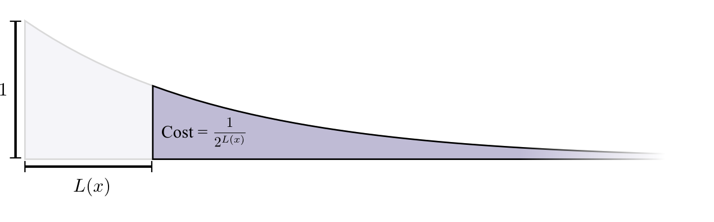
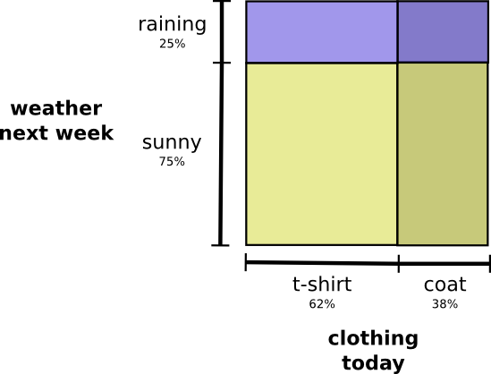



Information theory answers two fundamental questions in communication theory:

* The critical value for data compression: entropy \(H\)
* The critical value for communication transmission rate: channel capacity \(C\)

But information theory's content extends far beyond this—we encounter it in many fields: communication theory, computer science, physics (thermodynamics), probability theory and statistics, philosophy of science, economics, and more.

## Entropy

Information is a rather broad concept that's difficult to capture completely and accurately with a simple definition. However, for **any probability distribution**, we can define a quantity called **entropy** that possesses many properties intuitively required for measuring information.

Entropy is a measure of the uncertainty of random variables, and also a measure of the information needed to describe random variables on average.

Let \(X\) be a discrete random variable with alphabet \(\mathcal{X}\). The probability density function \(p(x) \equiv Pr(X=x),x\in \mathcal{X}\) is denoted as \(p(x)\). Then:

##### Definition: Entropy

The entropy $H(X)$ of a discrete random variable $X$ is defined as:

$$
H(X) = - \sum_{x \in \mathcal{X}}{p(x)\log_2{p(x)}}
$$

Since $x\log(x) → 0$ as $x → 0$, but $\log x$ is undefined at zero, we adopt the convention $0\log0 = 0$.

Sometimes the above quantity is denoted as $H(p)$. When using logarithms with base 2, entropy is measured in bits. When using natural logarithms with base $e$, entropy is measured in nats.

Since $p(x)$ is the probability distribution function of $X$, entropy can alternatively be viewed as the expected value of the random variable $\log{\frac{1}{p(X)}}$, denoted as $-E\log p(X)$.

##### Properties

1. $H(X) \ge 0$: Entropy is non-negative, because probability $0 \le p(x) \le 1$, so $\log\frac 1 {p(x)} ≥ 0$.
2. $H_b(X) = (\log_b a) H_a(X)$: Base conversion for entropy, because $\log_b p = (\log_b a)\log_a p$, so $\ln(p) = \ln(a) H(X)$.

##### Example

For a single Bernoulli trial with success probability $p$, if the random variable of the experimental result is $X$, its entropy is:

$$
H(X) = - [ p\log p + (1-p)\log (1-p)]
$$

When $p = \frac 1 2$, the entropy of the resulting random variable $X$ is: 1 bit.

##### Intuition

Although the definition of entropy can be derived from several properties we require, there's actually profound intuition behind this definition. For example:

We need to design binary encoding for an alphabet to minimize average information length. Letters often appear with unequal probabilities, so we need to follow the principle of **higher frequency letters get shorter codes**. Optimal encoding requires assigning appropriate costs to each letter to minimize total average cost. What constitutes an appropriate cost? A simple, intuitive principle is: **the encoding cost of each letter should be proportional to its occurrence probability $p(x)$.**

On the other hand, we need to consider the relationship between optimal encoding length $L(x)$ and encoding cost for letter $x$. Variable-length encoding has a problem: to ensure every message string can be unambiguously segmented and decoded, no word's code can be a prefix of another word's code, otherwise conflicts arise. For binary encoding, we can use 0 as a terminating delimiter. Thus, for four words A, B, C, D, they can be encoded as `0, 10, 110, 111` respectively. For each letter, when assigned an encoding of length $L=l$, what's the cost? In the entire encoding space, all codes with this letter's encoding as prefix can no longer be assigned. For example, after assigning B the 2-bit code `10`, all codes like `100, 101, 1000, 1001, ...` become unavailable—one-quarter of the entire encoding space is lost as cost.

So for a binary message with encoding length $L$, its cost is $\frac 1 {2^L}$, i.e., $cost = \frac 1 {2^L}$. Conversely, for letter $x$ with occurrence probability $p(x)$, the optimal encoding length should be:

$$
L(x) = \log_2 {\frac 1 {cost}} = \log_2 {\frac 1 {p(x)}}
$$

Then it becomes clear: the optimal encoding length $L$ for letter $x$, weighted by its occurrence probability $p(x)$, gives the optimal average encoding length—which is entropy!

$$
\sum_{x \in \mathcal{X}} {p(x)L(x)} = \sum_{x \in \mathcal{X}} {p(x)\log_2{\frac 1 {p(x)}}} 
= \sum_{x \in \mathcal{X}} -p(x)\log_2 p(x) =  H(X)
$$

## Joint Entropy

Extending the entropy of a single random variable to two random variables gives us the concept of joint entropy.

##### Definition: Joint Entropy

For a pair of discrete random variables $(X,Y)$ with joint probability distribution $p(x,y)$, their joint entropy $H(X,Y)$ is defined as:

$$
H(X,Y) = - \sum_{x \in \mathcal{X}} \sum_{y \in \mathcal{Y}} p(x,y)\log p(x,y)
$$

Abbreviated as:

$$
H(X,Y) = -E\log p(X,Y)
$$

## Conditional Entropy

The entropy of one random variable given another random variable is called conditional entropy.

##### Definition: Conditional Entropy

If $(X,Y) \sim p(x,y)$, conditional entropy $H(Y|X)$ is defined as:

$$
H(Y|X) =  \sum_{x \in \mathcal{X}}p(x)\  H(Y | X = x) = -E\log p(Y | X)
$$

##### Property

$$
H(X,Y) = H(X) + H(Y|X)
$$

## Mutual Information

Consider two random variables $X,Y$ with joint probability density function $p(x,y)$ and marginal probability density functions $p(x), p(y)$ respectively. Mutual information $I(X;Y)$ is defined as the relative entropy between their joint distribution $p(x,y)$ and product distribution $p(x)p(y)$:

$$
I(X;Y) = \sum_{x\in \mathcal{X}} \sum_{y \in \mathcal{Y}} {p(x,y)\log \frac{p(x,y)}{p(x)\ p(y)}} = D( p(x,y)\ \|\ p(x)\ p(y))
$$

Expressing mutual information as the relative entropy between joint distribution and product of distributions measures how independent the two random variables $X,Y$ are.

As an extreme case, when $X=Y$, the two random variables are perfectly correlated, and $I(X;X)=H(X)$. Therefore, entropy is sometimes called **self-information**.

| Independent Variables | Non-independent Variables |
|----------------------|---------------------------|
|  |  |

Of course, mutual information can actually be expressed in another more intuitive way. If random variables $X,Y$ have entropies $H(X), H(Y)$ and joint entropy $H(X,Y)$, then mutual information can be expressed as:

$$
I(X;Y) = H(X) + H(Y) - H(X,Y)
$$

This is easily understood, because $H(X)+H(Y)$ contains two copies of shared information, while $H(X,Y)$ contains only one.

##### Property

For any two random variables $X,Y$:

$$
I(X;Y) \ge 0
$$

with equality if and only if $X,Y$ are mutually independent.

This shows that knowing any other random variable $Y$ can only reduce the uncertainty of $X$.

### Relationships among Mutual Information I(X;Y), Self-information H(X), Joint Information H(X,Y), Conditional Information H(Y|X)

A single diagram illustrates all relationships:

$$
\begin{align}
I(X;Y) &= I(Y;X) \\
H(X,Y) &= H(X)+H(Y) - I(X;Y) \\
H(X,Y) &= H(X | Y) + I(X;Y)   \\
H(X,Y) &= H(Y | X) + I(X;Y) \\
H(X,Y) &= I(X;Y) + V(X,Y) \\
\end{align}
$$

## Cross Entropy and Relative Entropy

For a random distribution $p$, if we use encoding $L=-log\,p(x)$ optimized for distribution $p$, the average message length is:

$$
H(p) = - \sum_{x}{p(x)\log {p(x)}}
$$

In this case, it can be proven that average encoding length is optimal. But if we use encoding $L = -log\,q(x)$ optimized for another random distribution $q$, some inefficiency occurs. The average message length then requires $H_q(p)$ bits:

$$
H_q(p) =- \sum_{x} p(x)\log q(x)
$$

Here the actual distribution is $p$, but the cost $-log\,q(x)$ assigned to letter $x$ is optimized according to distribution $q$.

**$H_q(p)$ is called the cross entropy of distribution $p$ relative to distribution $q$.**

The cross entropy of $p$ with respect to $q$ can be decomposed into the sum of two parts: the entropy $H(p)$ of distribution $p$ itself, and the relative entropy $D(p \| q)$ of $p$ relative to $q$:

$$
H_q(p)  = H(p) + D(p \| q)
$$

**Relative entropy $D$, also known as Kullback-Leibler divergence (KLD), information divergence, information gain, or KL distance, is a measure of distance between two random distributions. Relative entropy $D(p \|q)$ measures the inefficiency when the true distribution is $p$ but we assume distribution $q$.**

##### Definition: Relative Entropy

The relative entropy between two probability density functions $p(x)$ and $q(x)$ is defined as:

$$
D(p \| q) = \sum_{x \in \mathcal{X}}{p(x)\log  \frac{p(x)}{q(x)}} = E_p\log \frac{p(X)}{q(X)}
$$

##### Properties

* Relative entropy is always non-negative. When $p=q$, the optimal encoding for $q$ is also optimal for $p$, so $D(p \| q) = 0$.
* Relative entropy is not symmetric: $D(p\|q) \ne D(q\|p)$.

##### Applications

Cross entropy, as a measure of difference between two distributions, is widely used in machine learning. For example, when used as a neural network cost function:

$$
C = - [ y\ln(y') + (1-y)\ln(1-y')]
$$

where $y$ is the sample label, serving as the reference distribution $q(x)$, and $y'$ is the neural network's inference output, serving as the actual working result distribution $p(x)$.