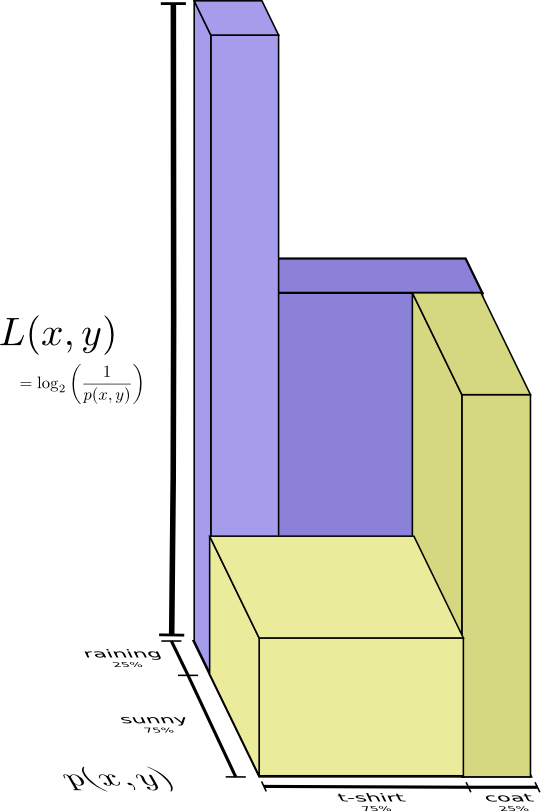
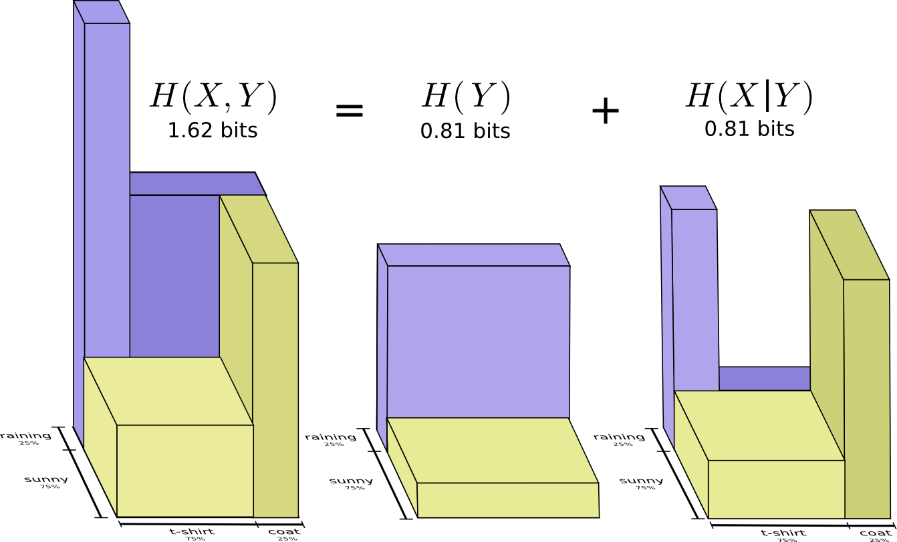
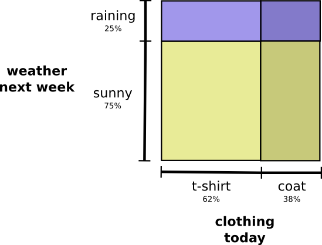
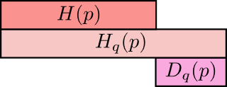



信息论回答了通信理论中的两个基本问题：

* 数据压缩的临界值：熵 \(H\)
* 通信传输速率的临界值：信道容量 \(C\)

但信息论的内容远不止于此，我们会在许许多多的领域中看见它的身影：通信理论，计算机科学，物理学（热力学），概率论与统计学，科学哲学，经济学等等……。

## 熵（entropy）

信息是一个相当宽泛的概念，很难用一个简单的定义将其完全准确地把握。然而对于**任意一个概率分布**，可以定义一个称为 **熵（entropy）** 的量，它具有许多符合信息度量的直观要求。

熵是随机变量不确定度的度量，也是平均意义上描述随机变量所需的信息的度量。

设 \(X\) 是一个离散型随机变量，其字母表为 \(\mathcal{X}\)。概率密度函数 \(p(x) \equiv Pr(X=x),x\in \mathcal{X}\) 记作 \(p(x)\) 。则：

##### 定义：熵(entropy)

一个离散型随机变量 $X$ 的熵 $H(X)$ 定义为：

$$
H(X) = - \sum_{x \in \mathcal{X}}{p(x)\log_2{p(x)}}
$$

因为 $x → 0$ 时 $x\log(x) → 0$ ，但在零点处 $\log x$ 无定义，所以约定 $0\log0 = 0$ 。

有时候将上面的量记为$H(p)$。当使用以2为底数的对数时，熵的量纲为比特（bit）。当使用以$e$为底数的自然对数时，熵的量纲为奈特（nat）。

因为$p(x)$是$X$的概率分布函数，所以熵从另一个角度可以视作随机变量$\log{\frac{1}{p(X)}}$的期望值，记作$-E\log p(X)$

##### 性质

1. $H(X) \ge 0$：熵非负，因为概率$0 \le p(x) \le 1$，所以$\log\frac 1 {p(x)} ≥ 0$。
2. $H_b(X) = (\log_b a) H_a(X)$：熵底可变，因为$\log_b p = (\log_b a)\log_a p$，所以$\ln(p) = \ln(a) H(X)$

##### 例子

对于成功概率为$p$的一次伯努利实验，实验结果随机变量为$X$，其熵为：

$$
H(X) = - [ p\log p + (1-p)\log (1-p)]
$$

当$p = \frac 1 2$时，所得结果随机变量$X$的熵为：1 bit。

##### 直觉

虽然熵的定义可以由几条我们需要的性质推导出来，但其实这个定义背后隐藏着深刻的直觉。举个例子：

我们需要为一个字母表设计二进制编码，从而使得平均信息长度最短。字母出现的概率往往不等，这时候就需要按照**字母出现频率越高，编码长度越短**的原则进行编码分配。最优化编码要求为每个字母指定一个合适代价，使得总体平均代价最低。什么样的代价是合适的代价？一条简单朴素的原则就是：**每个字母的编码开销(cost)，应当正比于其出现概率$p(x)$。*

另一方面，我们需要考量字母$x$的最佳编码长度$L(x)$和编码开销的关系。变长编码存在着一个问题：如果要求每个信息串都可以无歧义地进行切分与解码，就要求任意一个单词的编码不能为另一个单词编码的前缀，否则就会出现冲突。对于二进制，可以采用这样的办法，令0作为末尾界定符。因此以四个单词A，B，C，D为例，可以分别编码为`0,10,110,111`。对于每一个字母，当为它分配了长度$L=l$的编码时，付出的代价又是什么呢？整个编码空间中，以该字母编码为前缀的所有编码都无法再分配了。例如为B分配了长度为2的编码`10`后，所有`100,101,1000,1001,...`都不能用了，也就是整个编码空间的四分之一，作为代价被损失掉了。

所以对于二进制编码长度为$L$的消息，它的代价是$\frac 1 {2^L}$，即$cost = \frac 1 {2^L}$。反过来，我们可以得知，对于出现概率为$p(x)$的字母$x$，我们为其设置的最佳编码长度应当为：

$$
L(x) = \log_2 {\frac 1 {cost}} = \log_2 {\frac 1 {p(x)}}
$$

那么事情就明显了，字母$x$最佳编码长度$L$按照其出现概率$p(x)$加权，得到的就是最佳平均编码长度，也就是熵！

$$
\sum_{x \in \mathcal{X}} {p(x)L(x)} = \sum_{x \in \mathcal{X}} {p(x)\log_2{\frac 1 {p(x)}}} 
= \sum_{x \in \mathcal{X}} -p(x)\log_2 p(x) =  H(X)
$$

## 联合熵（joint entropy）

将单个随机变量的熵推广到两个随机变量的情形即可得到联合熵的概念。

##### 定义：联合熵（joint entropy）

对于服从联合概率分布为$p(x,y)$的一对离散随机变量$(X,Y)$，其联合熵$H(X,Y)$定义为：

$$
H(X,Y) = - \sum_{x \in \mathcal{X}} \sum_{y \in \mathcal{Y}} p(x,y)\log p(x,y)
$$

简写为：

$$
H(X,Y) = -E\log p(X,Y)
$$

## 条件熵（conditional entropy）

一个随机变量在给定另一随机变量下的熵称为条件熵。

##### 定义：条件熵(conditional entropy)

若$(X,Y) \sim p(x,y) $，条件熵$H(Y|X)$定义为：

$$
H(Y|X) =  \sum_{x \in \mathcal{X}}p(x)\  H(Y | X = x) = -E\log p(Y | X)
$$

##### 性质

$$
H(X,Y) = H(X) + H(Y|X)
$$

## 互信息（mutual information）

考虑两个随机变量$X,Y$，它们的联合概率密度函数为$p(x,y)$，其边际概率密度函数分别为$p(x),p(y)$。互信息$I(X;Y)$定义为其联合分布$p(x,y)$与乘积分布$p(x)p(y)$之间的相对熵：

$$
I(X;Y) = \sum_{x\in \mathcal{X}} \sum_{y \in \mathcal{Y}} {p(x,y)\log \frac{p(x,y)}{p(x)\ p(y)}} = D( p(x,y)\ \|\ p(x)\ p(y))
$$

将互信息表示为联合分布对分布之积的相对熵，衡量了两个随机变量$X,Y$之间有多么独立。

作为一种极端情况，当$X=Y$时，两个随机变量完全相关，这时候$I(X;X)=H(X)$。所以有时候，熵又称为**自信息（self-infomation）**

| 独立变量                      | 非独立变量                   |
|---------------------------|-------------------------|
|  |  |

当然实际上， 互信息量还可以用另一种更为直观的方式表示出来。如果随机$X,Y$各自的熵为$H(X),H(Y)$，联合熵为$H(X,Y)$，则互信息可表示为：

$$
I(X;Y) = H(X) + H(Y) - H(X,Y)
$$

这是很好理解的，因为$H(X)+H(Y)$中包含了两份共有的信息，而$H(X,Y)$中只有一份。

##### 性质

对任意的两个随机变量$X,Y$

$$
I(X;Y) \ge 0
$$

且当且仅当$X,Y$相互独立时等号成立。

这说明知道任意其他随机变量$Y$只会降低$X$的不确定度。

### 互信息I(X;Y)，自信息H(X)，联合信息H(X,Y)，条件信息H(Y|X)之间的关系

一图以蔽之，关系如下：

$$
\begin{align}
I(X;Y) &= I(Y;X) \\
H(X,Y) &= H(X)+H(Y) - I(X;Y) \\
H(X,Y) &= H(X | Y) + I(X;Y)   \\
H(X,Y) &= H(Y | X) + I(X;Y) \\
H(X,Y) &= I(X;Y) + V(X,Y) \\
\end{align}
$$

## 交叉熵(cross entropy)与相对熵(relative entropy)

对于一个随机分布$p$，如果使用针对分布$p$优化的编码$L=-log\,p(x)$，则平均的消息长度为

$$
H(p) = - \sum_{x}{p(x)\log {p(x)}}
$$

这时可以证明，平均编码长度是最优的。但如果使用了针对另一个随机分布$q$优化的编码$L = -log\,q(x)$，就会出现一定程度的无效性。这时候消息的平均长度就需要$H_q(p)$个比特来表示。

$$
H_q(p) =- \sum_{x} p(x)\log q(x)
$$

这里实际分布是$p$，但编码为字母$x$设置的代价$-log\,q(x)$却是按照分布$q$进行优化的。

**$H_q(p)$称为分布$p$相对于分布$q$的交叉熵（cross entropy）**

p对q的交叉熵本身可以分为两部分之和：分布$p$本身的熵$H(p)$，以及$p$相对$q$的相对熵$D(p \| q)$

$$
H_q(p)  = H(p) + D(p \| q)
$$

**相对熵$D$，又称为KL散度（Kullback-Leibler divergence, KLD），信息散度，信息增益，KL距离。是两个随机分布之间距离的度量。相对熵$D(p \|q)$度量当真实分布为$p$而假定分布为$q$时的无效性度量。**

##### 定义：相对熵

两个概率密度函数为$p(x)$和$q(x)$之间的相对熵定义为：

$$
D(p \| q) = \sum_{x \in \mathcal{X}}{p(x)\log  \frac{p(x)}{q(x)}} = E_p\log \frac{p(X)}{q(X)}
$$

##### 性质

* 相对熵总是非负的，当$p=q$时，$q$的最优编码就是$p$的最优编码，所以$D(p \| q) = 0$。
* 相对差并不是对称的：$D(p\|q) \ne D(q\|p)$

##### 应用

交叉熵作为两个分布之间差异的度量，广泛应用于机器学习中。例如在作为神经网络代价函数时有：

$$
C = - [ y\ln(y') + (1-y)\ln(1-y')]
$$

其中，$y$是样本的标签，是评价的基准分布$q(x)$，$y'$是神经网络的推断输出，是实际工作时的结果分布$p(x)$。