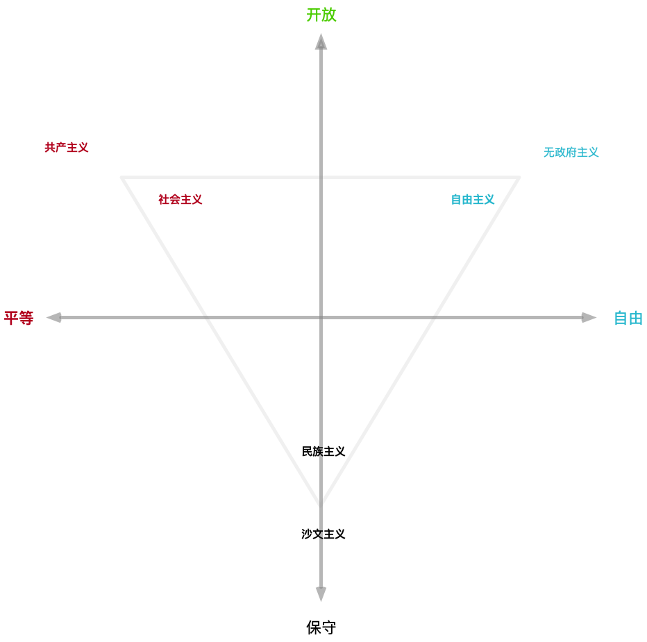

In [Understanding the Internet](https://vonng.com/cn/blog/misc/understand-internet/), I discussed my views on the internet. Today, let's talk about the part I deliberately omitted: the setbacks the internet will face.

<!--more-->

## Destiny

> It was the best of times, it was the worst of times;
>
> It was the age of wisdom, it was the age of foolishness;
>
> It was the epoch of belief, it was the epoch of incredulity;
>
> It was the season of Light, it was the season of Darkness;
>
> It was the spring of hope, it was the winter of despair;
>
> We had everything before us, we had nothing before us;
>
> We were all going direct to Heaven, we were all going direct the other way.
>
> —— Charles Dickens, *A Tale of Two Cities*

Let's start with the grand narrative.

The long-term development of the internet is immensely bright because it represents a new form of social organization with incomparable advantages.

Take Alibaba as an example: why could a website that started as a B2B trading platform develop into today's behemoth encompassing everything from clothing, food, housing, transportation, dining, entertainment, education, healthcare, finance, payments, tax payments, and services? The reason is that the internet is an advanced organizational form, and Alibaba's organizational capabilities have spilled over. It can complete the same tasks with smaller organizational scale and has higher upper limits for organizational scale. Therefore, Alibaba can not only effortlessly control its core business but also extend its reach into various industries, leveraging its organizational advantages for low costs and high efficiency to sweep away traditional competitors and become the core of the "new economy."

Traditionally, organizational costs often grow quadratically with organizational scale, so organizational capacity limits organizational size. When scale exceeds organizational capacity, there's risk of losing control. Therefore, the size of cells that nuclei can control is limited, and the scale of enterprises is also limited. Traditional bureaucratic organizations, through tree structures, reduced the magnitude of organizational cost growth with organizational scale (e.g., from O(n²) to O(nlogn)), enabling humanity to advance from primitive tribes to feudal dynasties and imperial eras. The internet will again change the growth function of organizational costs.

Internet companies, as hosts of this new organizational form, have inherent expansiveness. Whenever their organizational capacity has surplus, they will unhesitatingly extend into other fields, and without intervention, they're usually unstoppable: Alipay is simply better than bank transfers, and online shopping with home delivery is more convenient than mall shopping. Whenever possible, they will smash through all barriers of old institutions. However, touching interests is harder than touching souls, and soon internet companies will collide and conflict with old hegemons—nation-states.

Therefore, future history will be a process of new things conquering old things, and the internet's setbacks stem from the old things' retaliation against the new. However, the final outcome remains unknown. After all, internet companies are merely carriers of the internet as an organizational form. What ultimately rules the world may not necessarily be MegaCorps; traditional nation-states might also complete their own internet transformation by suppressing the internet first, extending nation-state organizational boundaries into the next generation.

## Background

> The only thing we learn from history is that we learn nothing from history.
>
> —— Hegel

Cold War 2.0 has arrived. Many people think CW is a conflict between the two nation-states of China and America. I believe things aren't that simple—this is a script with cooperation within struggle and struggle within cooperation. To understand this script, we first need to understand all the characters: the Chinese government, Chinese **local governments**, the US government, capital, manufacturing, internet companies, globalization elites, Chinese middle class, American middle class, Chinese lower class, American lower class, the EU, third-world countries, etc. These are all **different interest entities** with their own demands and behavioral logic.

**Nation-states** are built on the foundation of national identity, and identity is essentially a trust issue. When trust appears as a feeling in the minds of community members with "in-group consciousness," it must be when encountering "the other." Therefore, the most original ethnic consciousness is actually distrust of "the other," and the era of nationalism is also the era of constructing "the other." Thus, the most effective way to maintain national identity is to establish an enemy. Mencius said: "A state without enemy countries and external troubles will invariably perish." As nation-states, declaring an "other" enemy can effectively enhance internal cohesion and political influence.

Enemy-making is especially necessary when domestic people's trust in government declines. For America, the Soviet Union was once this "other," "terrorism" was also this "other," and now it's finally China's turn. This is inevitable and incompromisable. This also means that the main external environmental conditions of the 40 years of reform and opening up have changed, and competition will be the main theme between China and the US for at least the next twenty years.

However, a nation-state's "other" doesn't necessarily have to be another nation-state. It can also be a group or a class. The internet has given birth to a completely new cultural stratum that's gradually gaining discourse power. The emergence of these tech nouveau riche poses a threat to all nation-state governments' existence. However, governments have very conflicted attitudes toward domestic internet companies. If they let domestic emerging classes and internet enterprises grow unchecked, their governing foundation and organizational mobilization capabilities will be gradually eroded. But suppression also has many problems: tech companies are the driving force of the new economy and innovation. Suppressing domestic internet companies equals suppressing one's own economic, technological, and cultural competitiveness, making oneself fall behind in competition with other nation-states. If another country's internet companies grow large and seize the initiative, occupying the technological high ground, it will form a crushing advantage. Therefore, the game here changes from two heroes competing for hegemony to a three-kingdom romance.

To summarize: suppressing each country's domestic internet companies will likely become consensus for both sides. Both governments will gain greater power domestically during the cold war, incorporating, eliminating, and suppressing these unstable factors that affect rule, preventing the emerging class from picking the fruits during the coming economic crisis.

## Impact

> Subtle signs, summer insects speaking of ice

So under the CW backdrop, what fate awaits the internet? Of course, China and America each have their national conditions. Domestically speaking, the situation is not optimistic.

For internet companies, the first to bear the brunt is the collapse of valuation bubbles. Over the past decade, the internet has carried too many hopes and fantasies. Investors have flocked to it, to the point where any big data AR VR AI blockchain tom-dick-harry can get money by writing a PPT. Meanwhile, under the loose backdrop, internet companies have also become reservoirs for excess money supply, like houses, becoming a store of value.

IT and finance are the only two industries with **average** annual salaries exceeding 100,000 yuan, the wealth-creating machines of the new era. Standing on the wind these years, many programmers have become conceited. In a sense, IT is a happy industry—programmers can ignore outside affairs and focus solely on working overtime, and many still retain the kindness and simplicity of student days. But this society is realistic and cruel. Programmers are wrapped in bubbles blown by capital, busy being strivers and making money quietly, so they have neither time nor interest to understand the operating logic behind this society. When history's wheels change direction, those without seatbelts are easily thrown out.

Many programmers think their high salaries are deserved, not knowing this has basically nothing to do with personal ability—it's just dividends granted by the era. Mean reversion has inevitability; what the era gives will ultimately be taken back by the era. When bubbles burst, salary cuts, layoffs, and unemployment will also beckon to these people. No one can escape. When the total pie shrinks, someone will always be willing to work overtime for low wages to grab positions. Even those with superior technical skills in high positions will inevitably be affected. Meanwhile, newcomers lured by internet high salaries who changed majors or careers have begun flooding in massively, making matters worse.

Additionally, many programmers have unrealistic optimistic expectations for their futures, always thinking high salaries will continue, raises won't stop, and layoffs are far away. Therefore, even with today's abnormally high housing prices, they still resolutely increase leverage to buy houses, taking on twenty to thirty years of debt. As Master Roshi said: "Business requires capital, borrowed money must be repaid, investment carries risk, and wrongdoing comes with consequences." I'm afraid these people will regret it within two years. It's easy to go from frugality to luxury, hard to go from luxury to frugality. When facing hunger, what kind of necessity is housing?

## Reasons

> Strengthen internet content construction, establish comprehensive network **governance** systems, create a **clean** cyberspace. Implement **ideological work responsibility systems**, strengthen **position construction** and management, carefully distinguish political principle issues, ideological understanding issues, and academic viewpoint issues, clearly oppose and resist various erroneous viewpoints.
>
> —— *Nineteenth Party Congress Report*

So why is the internet doomed? There are four main reasons:

1. CW triggers ideological divergence resurgence, strengthening cultural position control.
2. The internet has social mobilization capabilities and public opinion influence, making it uncontrollable.
3. CW triggers technical sanctions and chip embargos, eliminating material foundations.
4. CW triggers economic crisis; internet technology's efficiency improvement conflicts with government stability KPIs.

The first point: ideology is actually modern religion, a more advanced and widespread form of spiritual organization. Currently, there are only three mainstream ideologies: liberalism, socialism, and nationalism. These can be distinguished along two dimensions: conservative-open and equality-freedom, as shown below.

Since reform and opening up, our principle has been "no debate"—as long as we move toward openness, we won't debate left or right leanings. Ideological conflicts can be compared to religious conflicts. Internet companies' ideology inevitably lies in the open-freedom first quadrant, while nation-state governments usually need to stand with nationalism. Under the CW backdrop, our dynasty will unsurprisingly move toward the third quadrant, which can be said to be diametrically opposed to the internet's position.

Therefore, under the backdrop of defending cultural positions, the internet will first bear the brunt in culture-related areas: social networks, self-media, live streaming, entertainment media, and games. These will be viewed as "liberal poisonous weeds" to be eradicated or kept in form but changed in content. The reasons used will be nothing more than: affecting minors' physical and mental health, entertainment-to-death unhealthy trends, spreading rumors, and seeking trouble.

The second point is the internet's social mobilization capability, which is one of the core powers of nation-states. However, the internet has already demonstrated powerful social mobilization and organizational capabilities in some aspects. In the internet era, people form various small circles based on interests, and opinion leaders in various circles often have considerable appeal and influence. For instance, some traffic stars now have tens of millions of fans who spontaneously form fan groups with detailed division of labor and orderly organization, boosting rankings, fighting detractors, and controlling negative public opinion about their idols. These stars have significant influential energy. On the other hand, applications like TikTok and Toutiao with over 100 million daily active users can subtly brainwash and ideologically infiltrate by controlling content users read daily. Finally, the internet has strong public opinion supervision capabilities. After various negative news breaks, relevant responsible parties are often held accountable under public pressure, making public opinion supervision remarkably effective, which also leaves some leading cadres overwhelmed.

For this type of internet enterprise with social mobilization capabilities and public opinion attributes, some will be incorporated and nationalized, undergoing socialist transformation—like Toutiao, such excellent brainwashing tools. Others will simply disappear. The operation method is simple: get some people to post reactionary content, then legally eliminate them. A more universal approach is from data security and user privacy angles, because no internet company has clean hands. Strict legislation and selective enforcement—investigate one, catch one.

The third point is the technical blockade and product embargo caused by CW. The internet has two legs: one is hardware, mainly chips, basically all imported; the other is software, basically all open source. GitHub and StackOverflow probably provide over 90% of domestic internet companies' technical productivity. Once embargo, blockade, and internet disconnection occur, it will basically lead to paralysis. ZTE is one example. Huawei is also precarious. For instance, their phones are indeed good, and chips are said to be self-developed, but in today's globally integrated industry, who can really do everything themselves? If everyone did everything themselves, would they still have current competitiveness?

The path of **self-reliance** probably won't work either. Chinese people are hardworking, brave, resilient, adaptable, and disciplined—very good, very suitable for engineering and applied technology. That's why our dynasty's industry is world-class and infrastructure is unparalleled. But from another angle, for research work requiring independent thinking and free exploration, we're not so skilled. Take the much-praised independent two bombs and one satellite achieved by tightening our belts: those founding fathers were all returnees from studying in America. Recent decades' technological progress seems significant, but it's really just what Americans call "market for technology." When technology is inferior, we must acknowledge it and strive to learn with shame as motivation. If we really close doors and build cars, that's cutting ourselves off from the world. Finally, these things quite consume foreign exchange reserves—that's the lifeline for buying oil and grain.

The last point relates to the internet's technological attributes. The core value of internet tech companies is improving efficiency and liberating productivity. However, in China, what we lack least is productivity. For government, GDP is an important KPI, but actually **stability** is the most important KPI: "Stability overrides everything." Everything needs "stability": "stable progress, stable improvement, stable change, stable advancement." Petition incidents directly deduct points from performance totals. Stability is closely tied to unemployment rates. Food delivery eliminates small restaurants, Alipay eliminates cashiers, online shopping eliminates retail stores and supermarkets, dating apps replace matchmakers, OA systems eliminate various white-collar staff, and AI wants to eliminate artists and programmers. Usually, the internet eliminates far more jobs than it provides—this is where its advancement lies. But the internet converts many low-end positions into few high-end positions, actually widening society's wealth gap. While improving efficiency and liberating productivity is good, this isn't Pareto improvement—for those whose jobs are taken, it's not good news. Unemployment, wealth gaps, unfairness—these are all sources of social unrest. Let me mention some not-so-distant history: the 1998 mass layoffs, when Northeast China saw "hammer gangs" who came out at night with hammers to hit people's heads, spreading nationwide and causing panic. Those interested can research this.

Our basic contradiction has changed from "the contradiction between people's growing material and cultural needs and backward social production" to "the contradiction between people's growing needs for a better life and unbalanced, insufficient development." In the coming unemployment wave, between letting one inventor eat well and letting ten people eat their fill, what Big Brother will choose is self-evident. Chinese people are still kind—as long as there's food, they won't take desperate risks. So speaking of which, what fate awaits these efficiency-improving, "value-creating" internet companies and tech nouveau riche? Once economic crisis causes mass unemployment, "ensuring employment" will be top priority. The guiding ideology will be: if we can use Excel, we won't use databases; if we can use manual ledgers, we won't use Excel—aiming to create as many jobs as possible. High technology, especially technology that improves efficiency and liberates productivity, might only be retained within government and in public security, military, and political-legal departments. Everything else can fend for itself. After all, during the Great Depression, as long as there was food, people were willing to work. Labor costs will be driven down to unimaginable levels, leaving no market for high technology.

Therefore, in summary, domestic internet enterprises face two destinies: embrace big legs and be incorporated and nationalized, or public-private partnerships controlled by party committees—like State-run Didi, State-run Alipay, State-run Tmall, State-run Toutiao News, etc.; or various fancy death methods, with reasons including protecting minors' physical and mental health, not conforming to socialist morality and values, inadequate content review, entertainment-to-death affecting social atmosphere, tax evasion, privacy leaks, data abuse, inadequate information security, etc.

## Conclusion

> Facing the sea, spring blossoms warmly
>
> —— Haizi

How despairing, but people must still live, mustn't they?

As tiny individuals, we cannot change the tide of history, but we can actively understand the general trend and go with the flow. **Don't lose your job**, don't take on debt, cash is king, restrain desires, watch your words and actions, strengthen your body, watch more news broadcasts, read more contemporary history, maintain equanimity.

How fortunate I am to have caught this wave of the era; how unfortunate to witness an era's end. As a software engineer, I feel excited and proud about the industry's past achievements and future vision, while also feeling anxious and trembling about present setbacks and the approaching winter. But we must remain optimistic. Perhaps in ten years, perhaps twenty, perhaps thirty, we will one day face the sea with spring blossoms in warm weather. Until we meet again in the jianghu.

These are merely idle musings for your amusement—don't take them seriously. I take no responsibility.