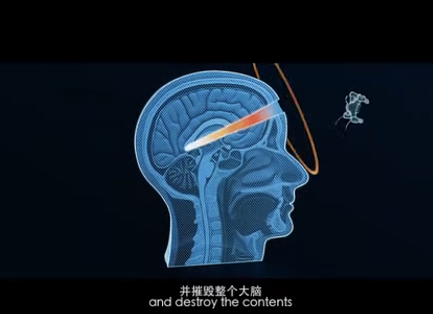
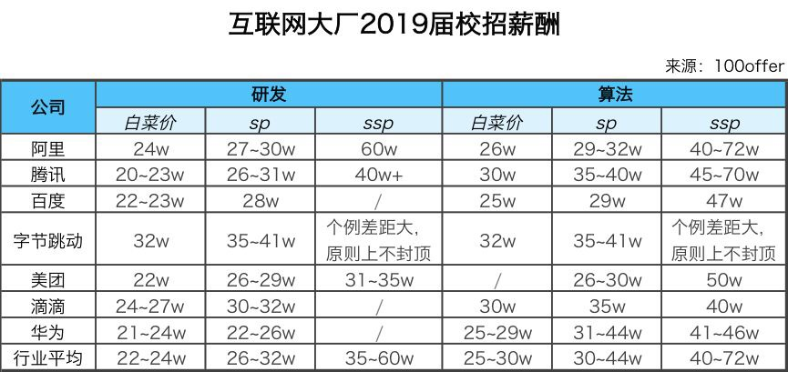

I used to think that the essence of the internet, the development of the internet industry, and the strategies of internet companies—these "lofty" matters should be pondered by government officials and corporate executives. As an internet practitioner, a software engineer, being able to thoroughly master the technology in one's field would be good enough. But now I've changed my mind: a person's destiny naturally depends on individual effort, but we must also consider the course of history.

World trends flow mightily. Those who follow prosper; those who resist perish. Standing at the crossroads of historical turning points, only by recognizing the general trend can we avoid confusion. Over these past months of free time, I've invested almost entirely in the process of understanding the world. I've roughly grasped the outline of the current situation and formed vague intuitions about future trends. Although the pace of technological progress has slowed, I believe this is very worthwhile. Below are some thoughts and insights.

## The Essence of the Internet

> Though Zhou was an ancient state, its mandate was new.
>
> —— *Book of Songs, Major Court Hymns, King Wen*

Let's start with the grandest narrative: what is the essence of the internet?

The internet is fundamentally a **form of social organization**, with a similar concept being the **nation-state**.

Many people consider the internet a technology, an industry, a tool. While this view isn't wrong, it's overly narrow. The internet is a major technological revolution after the Industrial Revolution, but its impact on the world is far more profound.

Productive forces determine production relations, and information technology is an important representative of productive forces. The way and speed of information dissemination determine society's organizational and mobilization capabilities. There are tight connections between information technology and historical changes, dynastic transitions. Historically, technologies on the same scale as the internet include: bamboo slips, papermaking, printing—all epoch-marking technologies: bamboo slips appeared in Western Zhou, corresponding to slave-owning states; paper appeared in Western Han, corresponding to classical imperial feudal dynasties; printing appeared during the Renaissance (Northern Song), echoing capitalism and nation-states. The internet corresponds to the next era, perhaps with **true** socialism.

Today's world order is actually an international society composed of a series of **nation-states**, with origins traceable to the 17th-century Westphalian system. Concepts we take for granted today, such as **the state**, were formed in that era. But the state isn't a naturally ordained, ancient entity. If the Ming Dynasty had made different choices, today's world order might have been a **tribute system** centered on the Celestial Empire, with all quarters offering congratulations and all directions paying tribute.

Nation-states are imagined communities that require text (reading) to construct people's imagination. Therefore, nation-states are products of the printing era. Even today's governments still operate according to printing-era methods: official documents, records, archives, newspapers, publishing—all deep imprints left by the printing era. However, the internet will change all of this, bringing unprecedented revolution.

## The World Ruled by the Internet

> Alibaba wants to become the world's fifth-largest economy
>
> —— Jack Ma

Consider this carefully: besides studying, working, eating, and sleeping, how much of our remaining time is occupied by phones?

Restaurant gatherings, subway and bus rides, using the bathroom—many people never let their phones leave their side. Once phones are forgotten or lost, serious anxiety ensues. Phones have penetrated every aspect of our lives, becoming external organs.

But what attracts us isn't the phone itself, but the internet world behind it—phones are merely access media for the internet. Through the internet and phones, we can communicate anytime, anywhere, purchase almost anything imaginable—clothing, food, housing, transportation, eating, drinking, defecating, urinating, education, healthcare, everything; we can browse latest news, listen to music, watch movies, play games, trade stocks on phones; we can handle business registration, pay taxes and social insurance, withdraw housing funds, transfer money, complete stock transactions on phones.

For ordinary people, time spent dealing with the internet far exceeds time spent dealing with government and state. We enjoy the incredible convenience the internet brings, but from another perspective, we can also say we're being ruled by internet companies. The difference from states is that states essentially rule through coercive violence, while internet companies rule through knowledge, in low-key, secretive, and subtle ways that make people willingly accept rule. Internet companies, or tech giants, have unknowingly gained enormous power.

Power, in terms of its essential effects, is the ability to make others submit to one's will. It has three sources: violence, wealth, and knowledge. Violence has been monopolized by states, so internet companies' power mainly comes from their knowledge. Knowledge, or data, harbors tremendous influence and energy. As a source of power, it's often unnoticed by common people, but internet companies are well aware. Capitalists and "knowledge-ists" aren't all philanthropists—so why are many high-quality internet services free? Because users have already paid the price when using these services—their data—and have placed themselves under internet companies' surveillance, i.e., rule. Currently, this data is generally used in relatively "harmless" and gentle ways—such as advertising systems and personalized recommendations. But regarding future development, we must recognize the other side of the coin.

From another angle, internet companies' "power" manifests more directly. Take Alibaba: its 2017 GMV exceeded $500 billion. If viewed as an economy, it would rank 21st globally. Jack Ma even boasted: "Alibaba wants to become the world's fifth-largest economy." If we view Alibaba as a country, it efficiently controls supply-demand relationships for all goods on its platform market. A keyword ranking difference of one or two positions could mean millions or billions in merchant revenue. Undoubtedly, in such environments, it's the "planning committee" in the market economy, wielding life-and-death power.

I have no doubt that when AI and drone/robot technology develop to the point where tech companies can monopolize violence, this world will be completely dominated by tech companies.

## Transfer of Power

> New things conform to historical development's inevitable trends, possess powerful vitality and bright prospects; new things inevitably replace old things.
>
> —— *Introduction to Marxist Principles*

The internet industry is very wealthy—wealthy enough to make practitioners in many traditional industries question life. Take 2019 campus recruitment as an example; domestic internet companies offered new graduates the following prices:

The internet's backbone force also commands impressive prices. According to hearsay, Alibaba P7 (technical experts, 3-5 years) total compensation is about 1M yuan pre-tax, while P8 (senior technical experts) total compensation is about 1M yuan post-tax. Traditional enterprise executives or leadership might not have such salaries.

The internet is a wealth-creating machine. It doesn't just enable individual class mobility—it produces middle class on scale, in batches. Why can internet practitioners get filthy rich? Honestly, is programmers' labor harder than coal miners', or their study more difficult than math and physics research? Neither—it's **势也** (the momentum of the times). If the internet will replace states and become the new era's social organizational form, then naturally, internet practitioners who master these technologies and data will be the new era's bureaucratic class, or rather: the ruling class.

Internet companies pursue efficiency. Internet companies' networked real-time collaborative organization is far more efficient than nation-states' traditional bureaucratic systems. Anyone working in large internet companies should feel this. Traditional **bureaucracy** organizes by hierarchy; internal management and collaboration are unidirectional and linear, revolving around fixed regulations and processes. Knowledge and information are scattered across different organizations, creating many difficulties in inter-departmental coordination. The internet's fundamental advantage lies in providing **large-scale, socialized collaboration mechanisms**. Various IMs greatly improve communication efficiency across society; various applications address needs in clothing, food, housing, transportation; Weibo and Twitter enable society-wide discussion of commonly concerned topics; live streaming allows real-time, quick thought dissemination; blockchain and smart contracts can achieve decentralized consensus, solving voting, notarization, registration, arbitration, announcements, and other organizational issues. The internet, as a revolutionary social organizational form, will ultimately replace nation-states. It fits the dialectical relationship between old and new things with nation-states.

Therefore, it's not hard to understand why so many internet companies are wealthy, why internet practitioners have high salaries. Capital is betting, capital is embracing new organizational forms. So even if internet companies aren't profitable, capital is willing to pour money in. For a while, many absurd, laughable projects could easily get funding. Under this understanding, internet companies are no longer simply companies, but value storage tools, chips toward the future. The future is ruled by capital and technology—this is why IT practitioners have such high salaries: they're the future's ruling class—knowledge capitalists.

Capital has no homeland, neither does the internet. Transnational capital and tech companies have always been firm supporters of globalization and diversification. Because in the future's new order, **nation/ethnicity** is only a secondary cultural attribute. Whether close or not depends on class (interests). In the internet age, people freely form small groups based on interests. People's primary self-identity won't be "I'm from XXX country/ethnicity," but rather: we all like playing *Europa Universalis*, they all like playing battle royale games, those people are interested in databases, and so forth.

The internet's destiny is connection and integration. Nation-states, these artificially erected barriers, are precisely the greatest obstacles to its destiny. Therefore, we can foresee that the path of power transfer won't be smooth—it might even be accompanied by bloodshed and violence...

## Future Impact

> The future is bright, the path is tortuous.
>
> —— Mao Zedong

Under heaven, long divided must unite, long united must divide. Chinese history has three major division periods: Eastern Zhou/Spring and Autumn Warring States, Eastern Jin/Southern and Northern Dynasties, Southern Song/Jin Liao Western Xia.

Zhou Dynasty saw bamboo slips appear—writing was no longer just carved on great tripods and turtle shells. Knowledge became cheaper, no longer monopolized by the tiny ruling class. Knowledge spread to the scholar-bureaucrat group, ultimately forming a new emerging stratum—various schools of thought and private academies arose, breeding the first great division—Spring and Autumn Warring States.

Eastern Han saw paper appear, but it wasn't popularized until Western Jin's "paper expensive in Luoyang." Paper's invention and application also birthed a new intellectual class—Western Jin aristocratic stratum. Western Jin quickly fell, and China entered the second great division—Sixteen Kingdoms.

Northern Song saw mature woodblock printing, catalyzing book merchants, printing bureaus, even paper money. Knowledge dissemination range and information transmission speed further expanded, breeding Northern Song civil official groups, ultimately causing China's third great division—Southern Song/Jin/Liao/Western Xia.

These three great divisions share commonality: changes in information dissemination methods and rising new strata. Changes in transmission methods and media expanded knowledge dissemination range, thus birthing new intellectual strata. Groups mastering new technology hoped to gain discourse power above ruling classes, creating class opposition and accumulating contradictions, breeding revolutionary destructive and creative power, ultimately creating new eras. We can't help wondering: this time, how will revolutionary information technology represented by the internet (or plus blockchain, AI, or entire information technology) push history's wheel?

The internet breeds new emerging strata—software engineers, traffic stars/streamers, public opinion leaders, etc. Currently domestically, these people are still trembling rabbits before our Party. But someday, they'll claim political power matching their economic status, challenging existing rule. Maintainers of existing order won't sit idle—they'll inevitably counterattack frantically. Actually, we can already feel such suppression in many places.

The internet's future is bright, but the path is extremely tortuous—possibly far exceeding people's imagination. The current US-China new cold war also has such intentions behind it. Both governments strengthen and consolidate their power through cold war, freeing hands to deal with domestic internet tech companies—struggle within cooperation, cooperation within struggle—both leveraging tech companies' productivity while avoiding letting them pick the fruits. Therefore, the coming period might be very, very difficult for domestic internet companies. Review, interviews, removals, even internet disconnection are possible. Bankruptcy waves combined with Silicon Valley programmers' return impact on domestic employment might exceed many naive code dragons' imagination. This difficult period will last at least twenty years, or longer.

To wear the crown, one must bear its weight. With direction comes hope.

