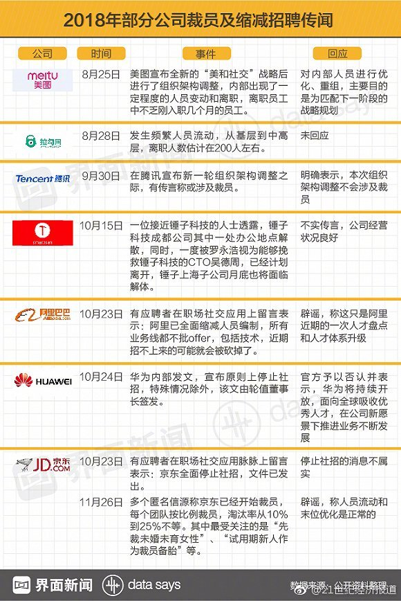
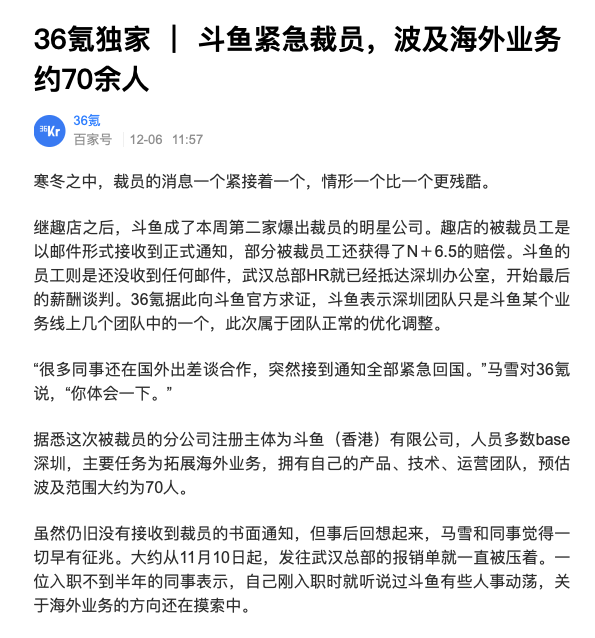

> It was the best of times, it was the worst of times;
>
> It was the age of wisdom, it was the age of foolishness;
>
> It was the epoch of belief, it was the epoch of incredulity;
>
> It was the season of Light, it was the season of Darkness;
>
> It was the spring of hope, it was the winter of despair;
>
> We had everything before us, we had nothing before us;
>
> We were all going direct to Heaven, we were all going direct the other way.
>
> —— Charles Dickens, *A Tale of Two Cities*

## The Internet Winter

Let's start with the grand narrative.

The long-term development of the internet is immensely bright because it represents a new form of social organization with incomparable advantages.

Take Alibaba as an example: why could a website that started as a B2B trading platform develop into today's behemoth encompassing everything from clothing, food, housing, transportation, dining, entertainment, education, healthcare, finance, payments, tax payments, and services? The reason is that the internet is an advanced organizational form, and Alibaba's organizational capabilities have spilled over. It can complete the same tasks with smaller organizational scale and has higher upper limits for organizational scale. Therefore, Alibaba can not only effortlessly control its core business but also extend its reach into various industries, leveraging its organizational advantages for low costs and high efficiency to sweep away traditional competitors and become the core of the "new economy."

Traditionally, organizational costs often grow quadratically with organizational scale, so organizational capacity limits organizational size. When scale exceeds organizational capacity, there's risk of losing control. Therefore, the size of cells that nuclei can control is limited, and the scale of enterprises is also limited. Traditional bureaucratic organizations, through tree structures, reduced the magnitude of organizational cost growth with organizational scale (e.g., from O(n²) to O(nlogn)), enabling humanity to advance from primitive tribes to feudal dynasties and imperial eras. The internet will again change the growth function of organizational costs.

Internet companies, as hosts of this new organizational form, have inherent expansiveness. Whenever their organizational capacity has surplus, they will unhesitatingly extend into other fields, and without intervention, they're usually unstoppable: Alipay is simply better than bank transfers, and online shopping with home delivery is more convenient than mall shopping. Whenever possible, they will smash through all barriers of old institutions. However, touching interests is harder than touching souls, and soon internet companies will collide and conflict with old hegemons—nation-states.

Therefore, future history will be a process of new things conquering old things, and the internet's setbacks stem from the old things' retaliation against the new. However, the final outcome remains unknown. After all, internet companies are merely carriers of the internet as an organizational form. What ultimately rules the world may not necessarily be MegaCorps; traditional nation-states might also complete their own internet transformation by suppressing the internet first, extending nation-state organizational boundaries into the next generation.

## Background

> The only thing we learn from history is that we learn nothing from history.
>
> —— Hegel

Cold War 2.0 has arrived. Many people think CW is a conflict between the two nation-states of China and America. I believe things aren't that simple—this is a script with cooperation within struggle and struggle within cooperation. To understand this script, we first need to understand all the characters: the Chinese government, Chinese **local governments**, the US government, capital, manufacturing, internet companies, globalization elites, Chinese middle class, American middle class, Chinese lower class, American lower class, the EU, third-world countries, etc. These are all **different interest entities** with their own demands and behavioral logic.

**Nation-states** are built on the foundation of national identity, and identity is essentially a trust issue. When trust appears as a feeling in the minds of community members with "in-group consciousness," it must be when encountering "the other." Therefore, the most original ethnic consciousness is actually distrust of "the other," and the era of nationalism is also the era of constructing "the other." Thus, the most effective way to maintain national identity is to establish an enemy. Mencius said: "A state without enemy countries and external troubles will invariably perish." As nation-states, declaring an "other" enemy can effectively enhance internal cohesion and political influence.

Enemy-making is especially necessary when domestic people's trust in government declines. For America, the Soviet Union was once this "other," "terrorism" was also this "other," and now it's finally China's turn. This is inevitable and incompromisable. This also means that the main external environmental conditions of the 40 years of reform and opening up have changed, and competition will be the main theme between China and the US for at least the next twenty years. Perhaps economic and trade exchanges can be maintained, but technical sanctions and blockades are unavoidable.

However, the internet's emergence introduces new variables to the new era's cold war. A nation-state's "other" doesn't necessarily have to be another nation-state. It can also be a group or a class. The internet has given birth to a completely new cultural stratum that's gradually gaining discourse power. The emergence of these tech nouveau riche poses a threat to all nation-state governments' existence. However, governments have very conflicted attitudes toward domestic internet companies (for example, the US government's relationship with Google and Apple). If they let domestic emerging classes and internet enterprises grow unchecked, their governing foundation and organizational mobilization capabilities will be gradually eroded. But suppression also has many problems: tech companies are the driving force of the new economy and innovation. Suppressing domestic internet companies equals suppressing one's own economic, technological, and cultural competitiveness, making oneself fall behind in competition with other nation-states. If another country's internet companies grow large and seize the initiative, occupying the technological high ground, it will form a crushing advantage. Therefore, the game here changes from two heroes competing for hegemony to a three-kingdom romance.

Therefore, suppressing each country's domestic internet companies will likely become consensus for both governments. Cold war is not necessarily bad for both **governments** in a sense—both can gain greater power through cold war. They can use this to incorporate, eliminate, and suppress domestic unstable factors, preventing the emerging class from picking the fruits during the coming economic crisis. Of course, this isn't good news for other interest entities.

## Impact

> Subtle signs, summer insects speaking of ice

So under the CW backdrop, what fate awaits internet companies? Of course, China and America each have their national conditions. Domestically speaking, the future is probably not optimistic.

For internet companies, the first to bear the brunt is the collapse of valuation bubbles. Over the past decade, the internet has carried too many hopes and fantasies. Capital began panicking in the face of an approaching epic economic crisis, eagerly hoping to create a new round of technological revolution before the crisis breaks to extend their lifeline. Investors flocked to internet and tech companies, leading to endless buzzwords: big data, cloud computing, AR, VR, AI, blockchain, quantum computing—any tom-dick-harry could get money by writing a PPT. Quantum computing is emerging, AI is struggling to survive, blockchain's corpse is still warm, VR has vanished without a trace. Only mobile internet (2C) and cloud computing (2B) have genuinely taken root with real money, while most others became bubbles. Various startups burned money, cheated money, cheated subsidies—less than one in a hundred truly survived. But under loose conditions, internet companies became reservoirs for excess money supply. Like houses, they became value storage tools, with stock prices skyrocketing like rockets, just like houses in 2008, 2013, and 2016, driving people crazy. Therefore, no matter how unreliable projects were, they couldn't stop investors' enthusiasm—after all, "dreams must exist; what if they succeed?"

As a result, IT became the second industry (after finance) with **industry average** annual salaries exceeding 100,000 yuan, becoming a wealth-creating machine of the new era. These years at the forefront have made many programmers' hearts float. In a sense, IT is a happy industry—programmers can ignore outside affairs and focus solely on working overtime. Many still retain the kindness and simplicity of student days. But this society is realistic and cruel. Programmers are wrapped in bubbles blown by capital, living in a happy fantasy paradise, busy being strivers and making money quietly. They have neither time nor interest to understand this society's current state, rules, logic, and future. During industry upswings, this isn't a problem. But when history's wheels change direction, those without seatbelts are easily thrown out.

Many programmers think their high salaries are deserved, not knowing this has **basically** nothing to do with personal ability—it's just dividends granted by the era. Mean reversion has inevitability; what the era gives will ultimately be taken back by the era. A considerable portion of engineers have unrealistic optimistic expectations for their futures, always thinking high salaries will continue, raises won't stop, and layoffs are far away. When bubbles burst, salary cuts, layoffs, and unemployment will naturally descend upon these people. Moreover, it's easy to go from frugality to luxury, hard to go from luxury to frugality. Poverty isn't scary; what's scary is psychological expectations' cliff-like decline.

On the other hand, such disasters cannot be avoided simply through hard work and improving technical skills. When total employment positions shrink, someone will always be willing to work overtime for low wages to grab positions—as long as they can eat, this will compress the entire industry's labor costs to unimaginable levels. No matter how high the position or strong the technology, they'll inevitably be affected. While demand shrinks, supply is rapidly growing. Newcomers lured by internet high salaries who changed majors or careers have begun flooding in massively, making matters worse.

The average age of Chinese internet workers is about 28. Today's internet backbone is basically post-80s and post-90s generations. These people share a characteristic: born after reform and opening up, growing up in a world with peace and development as the main theme after the Cold War's end, receiving depoliticized education. Compared to predecessors, post-80s and post-90s often live materially abundant, happy, peaceful lives, but this also makes them take these for granted, becoming so-called "three-season people" who can only use recent experiences to predict the future but cannot draw any lessons from previous history, ignoring history's spirals and cycles on macro scales.

For example, with today's abnormally high housing prices, among ordinary industries, basically only IT and finance have conditions to massively leverage and buy houses. Six wallets scraped together for down payments, taking on twenty to thirty years of debt to satisfy so-called "rigid demand." I don't understand why these people have such confidence in the future. As Master Roshi said: "Business requires capital, borrowed money must be repaid, investment carries risk, and wrongdoing comes with consequences." When facing food and survival, what kind of rigid demand is housing?

Life is a Kondratieff wave. An economic crisis comparable to the Great Depression is at hand. History has once again reached a turning point: all assets will be revalued, and violence will negate all transaction results. Each of us is just a cell in Leviathan's body, incredibly fragile as behemoths fight and devour each other. We might be pulverized by external impacts or apoptose into nutrients during healing. Even the financial god of tens of thousands of Huawei programmers is just a pawn or chip in such top-level gaming impacts, let alone ordinary people within? Sanctions, technology blockades, embargos—many people don't know what these mean. Some shout "Amazing, my country!" in mysterious confidence while ignoring the fates of 1970s China, North Korea, Russia, Iran, Venezuela, and Turkey. Many people like mocking North Korea, not knowing what kind of place North Korea was before Eastern European upheaval:

Saying more would be playing with fire—let's return to the internet. From a long-term perspective, the internet's prospects are definitely incredibly bright. But at this stage, it may face great setbacks. Winter is far from arriving—now is merely Double Ninth Festival, autumn growing cool, but we can already smell traces of unease in the air:

**Image: Some companies' layoff news**

**Image: Zhihu layoffs**

**Image: HR discusses recruitment**

**Image: Vanishing headhunters**

**Image: Industrial electricity consumption**

**Image: FAANG enters bear market**

**Image: Gaming industry enters industry-wide slaughter period**

## Conclusion

> Facing the sea, spring blossoms warmly
>
> —— Haizi

A bit despairing? But people must still live, mustn't they?

Preparedness ensures success; unpreparedness spells failure. As tiny individuals, we cannot change the tide of history, but we can actively understand the general trend and go with the flow. **Don't lose your job**, don't take on debt, cash is king, restrain desires, watch your words and actions, strengthen your body, watch more news broadcasts, read more contemporary history, maintain equanimity.

How fortunate I am to have caught this wave of the era; how unfortunate to witness an era's end. As a software engineer, I feel excited and proud about the industry's past achievements and future vision, while also feeling anxious and trembling about present setbacks and the approaching winter. But we must remain optimistic. Perhaps in ten years, perhaps twenty, perhaps thirty, we will one day face the sea with spring blossoms in warm weather. Until we meet again in the jianghu.

Idle village tales—don't take them seriously. I take no responsibility.