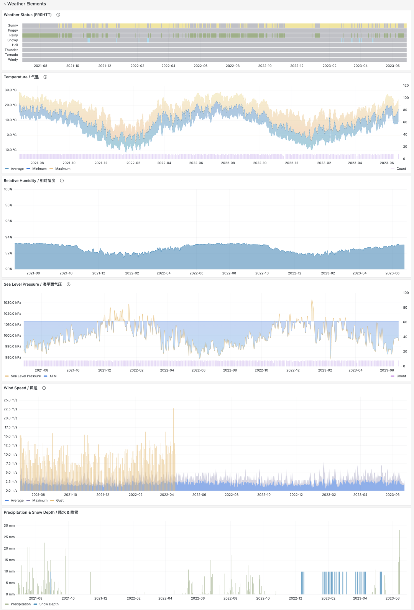

> [Original WeChat Article](https://mp.weixin.qq.com/s/TH-exGEpt4ZZrlz8fLGLLA)

ISD stands for Integrated Surface Dataset, a dataset published by NOAA (National Oceanic and Atmospheric Administration). It contains observational records from nearly 30,000 global surface meteorological stations from 1900 to present. Friends in the meteorological field should be very familiar with this.

I recently reorganized this dataset: wrote download scripts, parsing Parser, PostgreSQL DDL for modeling, query SQL statements, Grafana Dashboard for visualization, and cleaned CSV raw data. It's used for exploratory analysis, teaching demonstrations, and database performance testing comparisons.

Public Demo: http://demo.pigsty.cc/d/isd-overview


Project repository: https://github.com/Vonng/isd

---------------

## Motivation

ISD can be used for exploratory analysis or testing and measuring database performance. But more importantly, it provides an excellent learning scenario. In the article "[Why Study Database Principles?](http://mp.weixin.qq.com/s?__biz=MzU5ODAyNTM5Ng==&mid=2247483673&idx=1&sn=2a895a6f6e4b3e882395203757ec4e60&chksm=fe4b34c2c93cbdd49686c79ba27327b0dd16f266a82ab7de6e9985b8808207646fa1c7796da4&scene=21#wechat_redirect)", I mentioned that the best way to learn databases is to get hands-on and build something. ISD is an excellent demonstration example:

Use **Go** to download, parse, and import the latest raw data.

Use **PostgreSQL** to model, store, and analyze data.

Use **Grafana** to read, present, and visualize data.

Small but complete, these three work together to implement a small application that can query historical meteorological elements for all weather stations. Users can explore interactively and automatically update with the latest data. More importantly, it's simple enough to conveniently demonstrate how a data application actually works.


---------------

## Data Storage and Modeling

ISD provides datasets at four granularities: sub-hourly raw observational data (hourly), daily statistical summary data (daily), monthly statistical summary data (monthly), and annual statistical summary data (yearly). Each level is aggregated from the previous level by time dimension.

The most important are the first two: **isd.hourly** contains raw observational records from weather stations, preserving the richest information. **isd.daily** contains day-level aggregated summaries that can be used to generate monthly and annual summaries.

In this project, we use isd.daily data by default. After cleaning and compression, it's about 2.8GB with 160 million records. After loading into PostgreSQL with indexes, it's about 30GB. The specific format is as follows:

```sql
CREATE TABLE IF NOT EXISTS isd.daily
(
    station     VARCHAR(12) NOT NULL, -- station number 6USAF+5WBAN
    ts          DATE        NOT NULL, -- observation date
    -- Temperature & Dew Point
    temp_mean   NUMERIC(3, 1),        -- mean temperature ℃
    temp_min    NUMERIC(3, 1),        -- min temperature ℃
    temp_max    NUMERIC(3, 1),        -- max temperature ℃
    dewp_mean   NUMERIC(3, 1),        -- mean dew point ℃
    -- Pressure
    slp_mean    NUMERIC(5, 1),        -- sea level pressure (hPa)
    stp_mean    NUMERIC(5, 1),        -- station pressure (hPa)
    -- Visibility
    vis_mean    NUMERIC(6),           -- visible distance (m)
    -- Wind Speed
    wdsp_mean   NUMERIC(4, 1),        -- average wind speed (m/s)
    wdsp_max    NUMERIC(4, 1),        -- max wind speed (m/s)
    gust        NUMERIC(4, 1),        -- max wind gust (m/s) 
    -- Precipitation / Snow Depth
    prcp_mean   NUMERIC(5, 1),        -- precipitation (mm)
    prcp        NUMERIC(5, 1),        -- rectified precipitation (mm)
    sndp        NuMERIC(5, 1),        -- snow depth (mm)
    -- FRSHTT (Fog/Rain/Snow/Hail/Thunder/Tornado)
    is_foggy    BOOLEAN,              -- (F)og
    is_rainy    BOOLEAN,              -- (R)ain or Drizzle
    is_snowy    BOOLEAN,              -- (S)now or pellets
    is_hail     BOOLEAN,              -- (H)ail
    is_thunder  BOOLEAN,              -- (T)hunder
    is_tornado  BOOLEAN,              -- (T)ornado or Funnel Cloud
    -- Record counts used for statistical aggregation
    temp_count  SMALLINT,             -- record count for temp
    dewp_count  SMALLINT,             -- record count for dew point
    slp_count   SMALLINT,             -- record count for sea level pressure
    stp_count   SMALLINT,             -- record count for station pressure
    wdsp_count  SMALLINT,             -- record count for wind speed
    visib_count SMALLINT,             -- record count for visible distance
    -- Temperature flags
    temp_min_f  BOOLEAN,              -- aggregate min temperature
    temp_max_f  BOOLEAN,              -- aggregate max temperature
    prcp_flag   CHAR,                 -- precipitation flag: ABCDEFGHI
    PRIMARY KEY (station, ts)
); -- PARTITION BY RANGE (ts);
```

Of course, there's also some metadata about weather stations in auxiliary tables: isd.station stores basic weather station information including station numbers, names, countries, locations, elevations, and service times. isd.history stores monthly statistical observation record counts. isd.world stores detailed information and geographic boundaries of countries/regions worldwide (from EU statistics). isd.china stores Chinese administrative division information. isd.mwcode stores specific interpretation entries for weather codes. isd.element stores descriptions of meteorological elements and data coverage.


---------------

## Data Acquisition and Parsing

Besides auxiliary tables and dictionary tables, other data needs to be downloaded from NOAA. Here, I provide a series of wrapper scripts that allow you to complete configuration with simple commands. Especially if you're using Pigsty—an out-of-the-box PostgreSQL database distribution—PostgreSQL and Grafana are already configured during standalone installation. You only need `make all` to complete all configuration work.


In the original Daily dataset, there's a tiny amount of duplicate and dirty data that I've cleaned. You can choose to directly import our parsed and cleaned CSV dataset. If you need updates for the most recent days of this year, you can choose to use the Go Parser to directly download raw data from the NOAA website and parse it.

The data parser is written in Go. You can compile it directly or download pre-compiled binaries. The parser works in pipeline mode—feed it annual data tarballs, and it automatically outputs parsed CSV data that can be directly consumed by PostgreSQL COPY commands.


---------------

## Data Analysis and Visualization

Data stored in PostgreSQL can be accessed and visualized through Grafana. For example, the ISD Station panel below displays detailed information about a specific weather station (Lhasa), including observation summaries, raw data, and meteorological element visualization.


The metadata section lists basic station information: station number, name, country, location, service time, marks the location on a map, and lists nearby stations with distances. Click to navigate to neighboring stations' detail pages.


The summary section provides monthly observation counts, historical extreme records, annual data aggregations, and monthly statistical summaries for the station, including core indicators like temperature, humidity, precipitation, wind speed, and weather. The meteorological elements section below provides charts for the selected time period.



If you're interested in finer granularity data, clicking month navigation automatically jumps to the ISD Detail panel, which provides daily summary-level data and sub-hourly raw observational records. Additionally, the meteorological elements section displays additional indicators, including minute-level temperature, dew point, pressure, wind speed, wind direction, cloud cover, visibility, precipitation, snowfall, and other weather condition codes.


---------------

## Other Uses

Many database performance evaluations use abstract cases and random data generators. This project provides a useful and "real" practical scenario for measuring database performance.

For example, observational data is typical time-series data, so we can use it to examine **TimescaleDB** or other time-series databases' performance in this scenario. For instance, the same data uses 29GB with PostgreSQL's default heap tables and indexes, but with TimescaleDB extension compression, it compresses to 15%—4.6GB. This compression ratio is quite good, considering gzip --best on the original sorted CSV achieves only 2.8GB. The key is that compression doesn't affect query speed: on my Apple M1 Max laptop, full table count/min/max/avg originally took about 12 seconds, but after compression only needs 4.4 seconds. For more extreme scenarios, you can use the 1TB isd.hourly dataset.

Of course, how the dataset is used depends on the user. For example, you could ask GPT whether, based on this data, we can conclude that global temperatures are warming?

