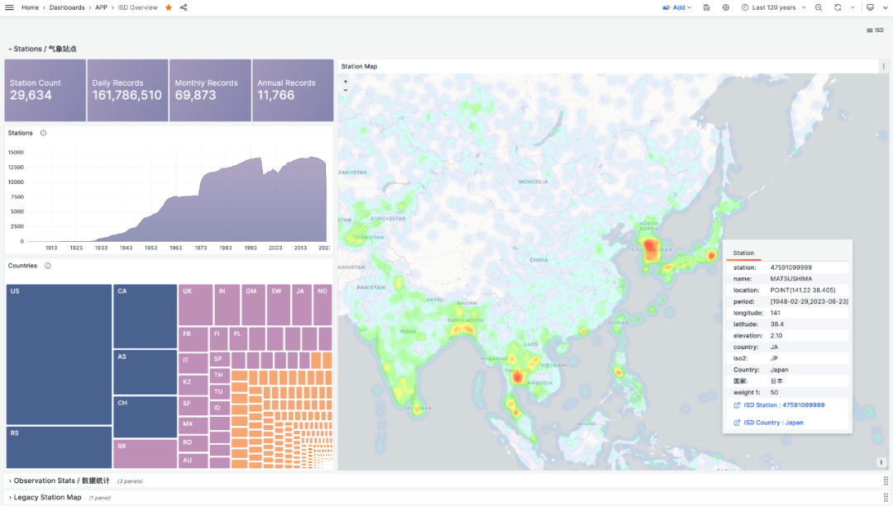

> [微信公众号原文](https://mp.weixin.qq.com/s/TH-exGEpt4ZZrlz8fLGLLA)


ISD 是 Integrated Surface Dataset 的缩写，是 NOAA 美国国家海洋和大气管理局公开的一份数据集。包括了全球接近3万个地表气象站从 1900 年迄今的观测记录，气象领域的朋友对此应该非常熟悉。

我最近重新整理了一下这份数据集：编写了下载的脚本，解析的Parser，建模的PostgreSQL DDL，查询的SQL语句，可视化的Grafana Dashboard，以及清理好的 CSV 原始数据。用于探索分析，教学演示与数据库性能测试对比。

公开 Demo：http://demo.pigsty.cc/d/isd-overview



项目的地址是：https://github.com/Vonng/isd


---------------

## 动机

ISD 可以用来探索分析，或者测试衡量数据库性能。但更重要的是，提供了一个绝佳的学习场景。在《[为什么要学数据库原理？](http://mp.weixin.qq.com/s?__biz=MzU5ODAyNTM5Ng==&mid=2247483673&idx=1&sn=2a895a6f6e4b3e882395203757ec4e60&chksm=fe4b34c2c93cbdd49686c79ba27327b0dd16f266a82ab7de6e9985b8808207646fa1c7796da4&scene=21#wechat_redirect)》一文中，我提到过学习数据库最好的方式就是动起手来做点东西。ISD 就是一个极好的演示样例：

使用 **Go** 下载、解析、录入最新的原始数据。

使用 **PostgreSQL** 建模，存储，分析数据。

使用 **Grafana** 读取，呈现，可视化数据。

麻雀虽小，但是五脏俱全，三者配合实现了一个可以查询所有气象站历史气象要素的小应用。用户可以交互式地探索，也可以自动更新最新数据。更重要的是，它足够简单，可以方便地演示一个数据应用到底是如何运作起来的。


---------------

## 数据存储与建模

ISD 提供了四种粒度的数据集：亚小时级原始观测数据（hourly），每日统计摘要数据（daily），月度统计摘要数据（monthly），年度统计摘要数据（yearly），每一级都是由上一级按时间维度聚合而成。

其中最为重要的是前两者：**isd.hourly** 是气象站的原始观测记录，保留着最丰富的信息。**isd.daily** 是天级别的聚合汇总摘要，可以用来生成月度与年度的汇总摘要。

在本项目中，默认使用了 isd.daily 数据，清洗压缩后约 2.8GB ， 1.6亿条。灌入 PostgreSQL 展开后含索引大概 30GB， 具体格式如下：


```sql
CREATE TABLE IF NOT EXISTS isd.daily
(
    station     VARCHAR(12) NOT NULL, -- station number 6USAF+5WBAN
    ts          DATE        NOT NULL, -- observation date
    -- 气温 & 露点
    temp_mean   NUMERIC(3, 1),        -- mean temperature ℃
    temp_min    NUMERIC(3, 1),        -- min temperature ℃
    temp_max    NUMERIC(3, 1),        -- max temperature ℃
    dewp_mean   NUMERIC(3, 1),        -- mean dew point ℃
    -- 气压
    slp_mean    NUMERIC(5, 1),        -- sea level pressure (hPa)
    stp_mean    NUMERIC(5, 1),        -- station pressure (hPa)
    -- 可见距离
    vis_mean    NUMERIC(6),           -- visible distance (m)
    -- 风速
    wdsp_mean   NUMERIC(4, 1),        -- average wind speed (m/s)
    wdsp_max    NUMERIC(4, 1),        -- max wind speed (m/s)
    gust        NUMERIC(4, 1),        -- max wind gust (m/s) 
    -- 降水 / 雪深
    prcp_mean   NUMERIC(5, 1),        -- precipitation (mm)
    prcp        NUMERIC(5, 1),        -- rectified precipitation (mm)
    sndp        NuMERIC(5, 1),        -- snow depth (mm)
    -- FRSHTT (Fog/Rain/Snow/Hail/Thunder/Tornado) 雾/雨/雪/雹/雷/龙卷
    is_foggy    BOOLEAN,              -- (F)og
    is_rainy    BOOLEAN,              -- (R)ain or Drizzle
    is_snowy    BOOLEAN,              -- (S)now or pellets
    is_hail     BOOLEAN,              -- (H)ail
    is_thunder  BOOLEAN,              -- (T)hunder
    is_tornado  BOOLEAN,              -- (T)ornado or Funnel Cloud
    -- 统计聚合使用的记录数
    temp_count  SMALLINT,             -- record count for temp
    dewp_count  SMALLINT,             -- record count for dew point
    slp_count   SMALLINT,             -- record count for sea level pressure
    stp_count   SMALLINT,             -- record count for station pressure
    wdsp_count  SMALLINT,             -- record count for wind speed
    visib_count SMALLINT,             -- record count for visible distance
    -- 气温标记
    temp_min_f  BOOLEAN,              -- aggregate min temperature
    temp_max_f  BOOLEAN,              -- aggregate max temperature
    prcp_flag   CHAR,                 -- precipitation flag: ABCDEFGHI
    PRIMARY KEY (station, ts)
); -- PARTITION BY RANGE (ts);

```


当然，还有一些关于气象站的元数据，以辅助表的形式存在：isd.station 存储了气象站基本信息，标号，名称，国家，位置，海拔，服役时间等。isd.history 存储了按月统计的历史观测记录数，isd.world 存储了世界上国家/地区的详细信息与地理边界（来自欧盟统计部门），isd.china 存储了中国行政区划信息，isd.mwcode 存储了天气代码的具体解释条目，isd.element 存储了气象要素的说明与数据覆盖率。


---------------

## 数据获取与解析

除了辅助表，字典表这些，其他的数据需要从 NOAA 上下载。这里，我提供了一系列的包装脚本，您可以直接使用简单的命令完成配置，特别是：如果您在使用 Pigsty —— 开箱即用的 PostgreSQL 数据库发行版，单机安装时已经为您配置好了 PostgreSQL 与 Grafana ，只需要 make all ，就可以完成所有的配置工作。


在原始的 Daily 数据集中，有极少量的重复数据与脏数据，我已经进行了清洗处理，您可以选择我们已经解析清理好的 CSV 数据集直接导入。如果需要获取本年度最近几天的更新，您可以选择选择使用 Go Parser 直接从 NOAA 网站下载原始数据并解析。

数据解析器使用 Go 语言编写，您可以直接编译，或者直接下载编译好的二进制文件。解析器以管道模式工作，将年度数据 tarball 喂给它，它就会自动输出解析好的 CSV 数据。可以直接被 PostgreSQL COPY 命令消化。


---------------

## 数据分析与可视化

存储在 PostgreSQL 中的数据可以通过 Grafana 访问并进行可视化。例如，下面的 ISD Station 面板就会展示出一个具体气象站（拉萨）的详细信息，观测摘要，原始数据，以及气象要素可视化。


在元数据部分，会列出气象站的基本信息，编号，名称，国家，位置，服役时间，在地图上标出位置，并列出周边最近的气象站及其距离，点击即可前往相邻气象站的详情页面。


在摘要部分，会给出该气象站的月度观测计数，历史极值记录，年度数据将汇总，以及月度统计摘要。包括气温，湿度，降水，风速，天气等核心指标。而下面的气象要素部分，就会给出所选时间段的图表。


在摘要部分，会给出该气象站的月度观测计数，历史极值记录，年度数据将汇总，以及月度统计摘要。包括气温，湿度，降水，风速，天气等核心指标。而下面的气象要素部分，就会给出所选时间段的图表。

如果您对更精细粒度数据感兴趣，点击月份导航，会自动跳转到 ISD Detail 面板中，这里会提供日汇总级别的摘要数据，以及亚小时级别的原始观测记录。此外，在气象要素部分，也会展示一些额外的指标，包括分钟级别的温度，露点，气压，风速，风向，云量，可见度，降水，降雪，以及其他天气情况代码。


---------------

## 其他用途

很多数据库性能评测都使用抽象的案例，随机的数据生成器。而本项目提供了一个有用且“真实”的实际场景，用于衡量数据库的性能。

举个例子，观测数据属于很典型的 时序数据，那么我们就可以用它来考察 **TimescaleDB** 或者其他 时序数据库在这个场景下的性能表现。比如，同样的数据，使用 PostgresQL 默认的堆表与索引一共是 29 GB，但是使用 TimescaleDB 扩展压缩后，压缩到 15% —— 4.6GB。这个压缩率还是很可以的，因为 gzip --best 处理原始排序 CSV 也就能做到 2.8 GB 。关键是压缩也没影响查询速度：在我的 Apple M1 Max 笔记本上，原本全表算 count/min/max/avg 大约需要 12 秒，压缩后只需要 4.4 秒了。 更为极端的场景，可以使用 1TB 的 isd.hourly 数据集进行。

当然，数据集怎么用，还是取决于用户。比如，你可以问问 GPT，基于这份数据，能不能得出全球气温在变暖的结论呢？


