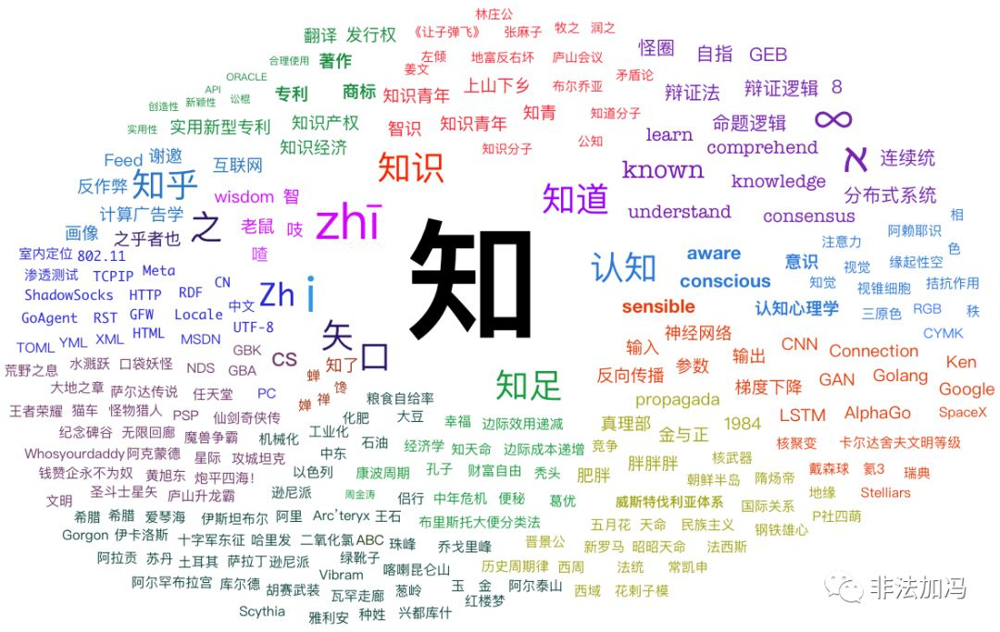

> [微信公众号原文](https://mp.weixin.qq.com/s/47b9NCLOKoqgx9cfP2EDhA)

## 知识的层次

> 当我们说“学习知识”时，究竟说的什么？
>
> 当我们说一个人“聪明”时，指的又到底是什么？

通过观察思辨，我们把脑内认识深化过程从接受知识开始到最高的“悟性”层次可以分成四个阶段：知识，理解，意识，悟性。整个认识的函数图景整体上是连续单调递增的，但在理解与意识的阶段之间存在一个跃迁。那么让我们来明确一下，这四个词到底意味着什么。

## 第一层次：知识

简而言之，知识就是脑内存储的正确信息，换言之，脑内存储的一切正确信息都叫做知识，因此知识一词是很广泛的术语。所谓“正确”信息，即从根本上说是符合实际的信息，尽管暂时还无法检验，亦即这只是一种理论上的说法。

知识可以来自客观经验（包括经历），也可来自脑内的推演创造。当我们读一本书时，记入脑中的信息就成为了知识。知识从纸上的符号转变为脑海中的抽象概念。

知识的结构很复杂、层次很多。它可以是“*苹果是红色的*” 这样的事实判断，可以是诸如“*如果删库，就该跑路*”的逻辑命题，或者是*滑动屏幕，点击右下角相机图标，以便使用iPhone拍照*这样的操作指令。但在最抽象的意义上，知识可以视作由两点一线构成的三元组：概念A与概念B之间存在C联系（递归定义：C联系以及这条知识本身也是一个概念）。

知识可以是心智空间里的一个概念节点，或曰，内存中的一个数据对象。然而正如计算机科学中 **信息=位+上下文** 一样，孤立的知识概念节点是没有意义的，它必须与其他概念联系起来。例如：

> 一见短袖子，立刻想到白臂膊，立刻想到全裸体，立刻想到生殖器，立刻想到性交，立刻想到杂交，立刻想到私生子。中国人的想象唯在这一层能够如此跃进。
>
> —— 鲁迅 《而已集·小杂感》

> 一见到进程，立刻想到`top,ps,kill`命令，想到`pid,ppid`，想到`exec,fork,open`系统调用，想到文件描述符与进程表，管道，调度、优先级，寄存器、状态字，信号，ELF格式，工作目录，想到死锁，PV操作，信号量，临界区。想到`bash`，想到用`bash`执行`rm -rf /`，想到删库，想到数据库……

当概念节点之间形成网络时，我们就从**知识**进入了**理解**的层次。

> ### 知识与理解
>
> 让我们来做一个实验，长时间凝视并重复阅读下面这行文字：
>
> **知道知晓知识知足知命知府知事知了知青知悉知心知音认知知府知州知县知会知己知交知名知根知底知己知彼知冷知热上知天文下知地理知其一不知其二知其然不知其所以然知难而退知情达理知人知面知书达理知无不言知遇之恩知人论世知人善任知子莫若父知知知知知知知知知知知知知知知知知知知知知知知知知知知知知知知知知知知知知知知知知知知知知知知知知知知知知知知知知知知知知知知知知知知**
>
> 当注视同一个汉字超过一段时间之后，你就有可能会体验到外国人看中国字的体验了。读者可能会发现这个字看上去变得十分陌生，认不出来了。好像它不再是一个文字符号，而变成由“矢”和“口”组成的一副画。在心理学中这种现象称为“**认知饱和**”。这种情况相当于剥离了文字与其他概念的联系，在脱离了联系之后，我们就无法对这个字形成理解了。这个例子能够很好地展示**知识**与**理解**的区别。

## 第二层次：理解

这里的“理解”作名词用，表示理解了的知识，也叫活知识，对于一个信息（即知识），如果获得了与之有关的更多信息，就形成了一个以该信息为中心的信息网络，信息系统，这时该信息叫做理解了的信息，或者理解了的知识，抑或活知识。

当然，知识的理解也是有程度之分的，事实上，知识从基本知识到完全理解了的知识之间没有绝对分明的界限，而是个连续分布的的上升的过程。对知识的理解，一个显要的特征便是知识的体系化程度。

以汉字为例，当我们读到一个汉字”知“时，我们会立刻形成理解，这个字会立刻变为一个抽象的符号进入脑海，同时激发起一系列相关的概念：知识，知道，认知，知名，知识产权，知识分子……，等等等等。一个孤立的概念对思考而言没有意义，只有当它与其他概念相联结，才会产生**理解**。

##### 图：笔者看见汉字“知”字时脑中激活的概念，用党性保证没有用过搜索引擎

不管如何，基本的和理解了的知识仅以一种外来知识的形式被储存，还不能说是自己的知识，还由可能会被“遗忘”（理解了的知识被“遗忘”，实则是从记忆的表层沉入脑海）但是这些被遗忘的部分并没有真正的消失，它将成为下一个阶段的养料而继续存在。

理解的本质，是对知识进行**体系化**。但对于“理解”阶段而言，知识概念的网络仍然作为一种显式结构存在于脑海之中。这就好比程序，给定输入它就能按照一系列的规则进行加工处理并产出结果。运用理解的知识，就好比套用规则，按照规律，按照程序去解决问题，而这一过程是**有意识的**，**刻意的**。随着**理解**的深入与重复，有意识的加工处理规则会被逐渐“烧录”到大脑的硬件之中，就好像将软件的逻辑烧录到FPGA中成为硬件逻辑一样，形成**意识**。

## 第三层次：意识

理解的知识经过一定的积累阶段后，可能会产生一次内在的飞跃或者说升华，表现为对已有理解的知识的“反刍”和觉醒，是对已有知识来自自我的重新发现，叫做意识了的知识，简称意识知识。

意识知识有几大特点：

1. 这种知识经过自己的重新发现已经成为自己的内在信息，甚至已不记得它来自何处，倒觉得是自己从来就有的知识似的。
2. 意识知识能达到自如的运用，亦即可以在不知不觉的自然状态下随着思维而自觉地运用，无需意识的驱使；
3. 意识知识已不存在忘却、记忆和回忆的问题，似乎意识知识不是存在与大脑皮层而在大脑皮层以下，形成了固定的的结构。与未升华知识相比，意识知识的存储状态可以比作做计算机上内存中的数据，内存信息可以直接调用，而外存信息要经过内存（相当于意识的驱使）才能使用。

通常我们所说的诸如政治意识，走位意识，设计意识等等这些意识，指的就是这种无需刻意驱使的状态：不需要思考，让直觉来接管反应。相比于知识技能的学习，也许运动技能中的意识更容易理解：每个人一旦学会了走路，直立迈步就立刻成为了无需意识参与的本能，但双足步行机器人的研发之难，说明这其实是一个相当复杂的技能。

意识知识的本质，是**将体系化的知识直觉化**，烧录为“肌肉记忆”。进入意识层次之后，面对问题时就会产生**直觉**。直觉是专家区别于熟手的关键点。有意识的人，面对问题往往无需逻辑推理的帮助，就能立刻定位关键点，如流水一般自如的应对。专家相比普通人而言，就好像ASIC/FPGA硬件编码之于软件逻辑，知识与经验已经成为了本能，他们就可以腾出注意力用于更高级的创造性思维活动。不过相应的，烧录好的硬件性能很好，但缺乏灵活性，因此很多只专精一个领域的专家在深入本领域太远之后，也往往会陷入Tunnel Vision，以至于很多杰出的成果都是由中青年完成的。

## 第四层次：悟性

悟性又可以称为醒悟、觉悟、感悟、归纳，它比意识来的更为深刻，不仅表现为对知识的“重新发现”，而且有更深层的发现感，所谓“发现感”，是说这种悟性所无处的东西不一定是实在的发明创造性思想，而是一种带有情感及心理色彩的认识，一种激情，往往只能体会而不可能完全“道”出来，即所谓“只可意会不可言传”，用一个佛教的术语，这种状态就叫做“般若”。因为它带有内在的情感性，不是一般的信息，“道可道，非常道”，一旦用语言表达出来，这种悟性即化为一般信息，最多是经过解释上升到理解了的信息，因此演讲，报告之类的效果最多只能促使意识或者悟性的发生，而不可象一般信息的授予那样直接授予悟性。

总之，悟性是意识的高级阶段，它与意识没有分明的界限，是一个连续分布的更高阶段，它是在脑海中下沉的更深的的综合知识（它已经不再是单一的知识，也不是简单的知识集，而是其融汇体考证如大海底部的沉积物一般，已经属于新的“矿藏”了）。“悟”出的，与“意识”到的知识都是“内存”知识，是真正属于自己的知识。悟性是一种思想工具，是一种方法论。它是知识中最最精华的那一部分，是规律的高度浓缩与概括。它是你所拥有的所有知识融会贯通的产物，如果说，理解是将一门学科的知识体系化，那么，悟性就是将学科之间的知识进行联系与类比，相互印证，相互参照。在远古时代，数理哲都曾是一家，还可以更宽泛，将艺术加入进来。通过悟性，将散乱杂糅来自不同学科的知识片段组合成一个有机的整体。

悟性知识的本质，是将所有领域的意识知识相互融合，**建立跨领域的联系与映射**。如果说意识会带来**直觉**，那么悟性带来的就是**洞察**。可以认为，跨领域的知识融合是创新的源泉。所谓举一反三，触类旁通是也。

悟性与灵感也不是一回事，灵感可表现为新事物的创造和发明，是时点式的闪现，可遇而不可求，随年长而衰退，而悟性主要表现为对现有知识的更深刻，更抽象的升华，具有可期盼性。只能说可以逼近灵感创造，但还不是灵感创造。

通常我们说一个人“聪明”，当然不是指他对某一门知识了解的有多深入，而是指这个人的悟性高。一个人的意识和悟性“能力”是潜藏于自身的，它只可接受外来因素的启发，诱发，激发，开发，却不能被传递，被转录，被复制。另一方面，一个人产生意识和悟性的“背景”也在于自身长期的知识积累。悟性是极为难得的属性，内因与外因都很重要，天分与努力缺一不可。

## 学习的方法

学习能获得的只能是一般信息（一般知识），如果有好的老师，好的书籍引路，最多可以上升到理解的知识。换而言之，学习能获得的都是外来信息，人的意识，悟性等高级知识是不可能由学习直接得到的。以机器学习做比，老师和书籍就如同标注好的数据集，但人脑不比模型，虽有数据集，训练却只能靠自己。正所谓“师傅领进门，修行在个人。”学习的知识只能为意识与悟性奠定基础，但也只有通过学习积累的量变，才能产生意识与悟性的质变。这就是学习与智慧之间的基本关系（这里智慧的主要表现就是意识与悟性能力）。

拥有悟性，或者说进入悟性期的人，在同样学习的过程中获得的认识程度有着极大不同。温故而知新便是这样一个道理：有时候读一本书时看到前人留下的感悟与心语，会令人击节赞叹，产生巨大的反响与共鸣。但若是没有进入悟性期，也许仅会把它们当成普通的信息与知识，甚至会误以为这是大师们在作秀，打广告，炒作吹牛。这样的误解比比皆是，但也没必要去澄清，只要学到了那个境界，自然会明白。学不到，说了也无法理解。

通常来说，悟性与知识的广度与深度都密切相关。如果我们将知识与概念视作一张网络，将网络中流量的活跃程度理解为悟性的水平，那么知识点就是网络中的节点，知识的深度就是网络中节点的吞吐量，而知识的广度就是网络中节点的数量与连接的复杂程度。

悟性是人人都有的矿藏，只是不同的人矿深（慧根）不一样，即使是同一个人，不同的年龄阶段其矿深也不同。一般来说，本科是悟性期最早的起点，博士是悟性的最佳阶段（25岁）。但不同的人肯定会有所差异。一般来说，小学及初中的学习，人的记忆力是最强的时候，但这一阶段属于纯粹的对普通知识的记忆，纯粹属于死记的范畴。进入高中与本科，我们的死记能力下降了，但理解能力得到了大大的提升，这一阶段，我们主要忙于对知识的储备与理解，是理解性记忆最活跃的时期。一些有天分的人，可能在这个时期便会产生悟性的萌芽。最终，通过不断的学习，另一种更重要的学习特征（思维特征）便日益强盛了，这便是进入了“悟性期”，此时，他们会自然地，不自然地对已经熟悉的知识进行“反刍”，产生新的认识和深层次的意识。其特点便是：知识一旦进入悟性思维，会自然而然地变成自己的东西，而没进入悟性程度的知识，则会随着时间逐步被遗忘。

通过学习，只能获得知识与理解，那又如何将知识与理解升华为意识与悟性呢？当然只有通过**实践**，实践方能出真知。除了尽可能地应用知识解决实际问题之外，最有效的实践手段就是**教学**。教学相长，教与学本身就是相辅相成的。教人的过程，也是自我学习，自我反思的过程。与知识四个层次相对应的四个教学层次，分别为照本宣科，翻译，讲座，写作。照本宣科的老师不过是对**知识**的同义反复，误人子弟耳；翻译是对一系列知识形成**理解**并重述的工作。胜任翻译者，本身对于所属领域的知识必已了然于胸，有了系统化的掌握；讲座是直接帮助他人形成理解的过程，只有那些对领域知识信手拈来，**意识**侵入骨髓的人才有能力和资格去课堂上传道授业解惑；写作则是一种跨越时空的教学，要比当面讲课要难得多，充满**悟性**的人才能写出经典之作。
