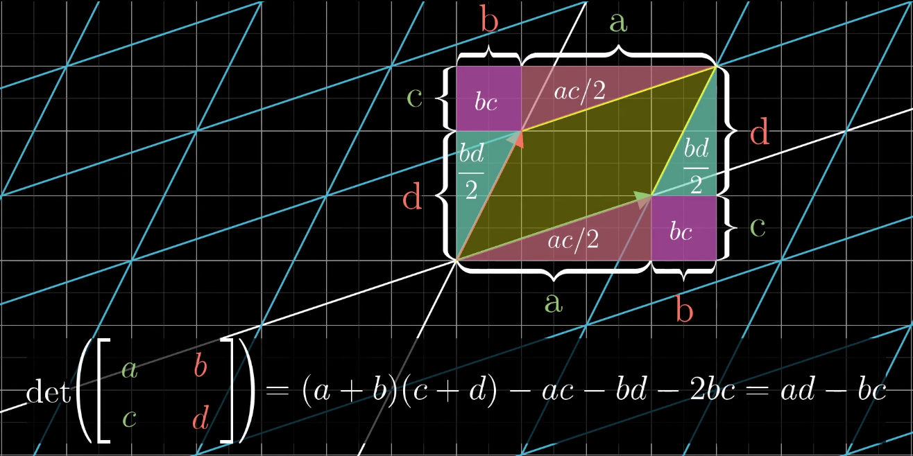
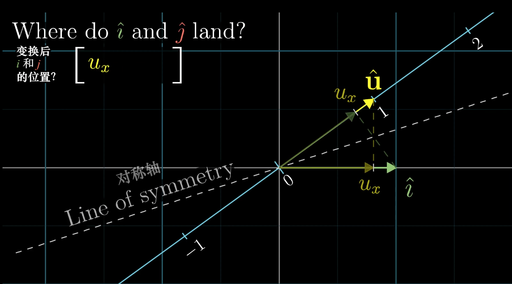



> Connecting all concepts in linear algebra through one main thread

<!--more-->

##  Vectors

There are three perspectives on vectors:

1. Physics perspective: A vector is an arrow with direction and magnitude
2. Computer perspective: A vector is an ordered list
3. Mathematical perspective: A vector is an ordered list that can contain anything, as long as vector addition and scalar multiplication are meaningful.

## Linear Space, Spanned Space and Basis

* In $\mathbb{R}^2$, two non-collinear vectors can combine to produce any desired vector.
* Two collinear vectors can only combine to produce vectors on that line.
* Furthermore, two zero vectors can only span the zero vector.
* Putting these two vectors together and writing them in matrix form. The matrix here represents a transformation of space.
* A certain transformation changes $\hat{i}$ to $\left[\begin{matrix}a \\c\end{matrix}\right]$ and changes $\hat{j}$ to $\left[\begin{matrix}b \\d\end{matrix}\right]$. Thus this transformation can be written as matrix $\left[\begin{matrix}a & b \\ c & d\end{matrix}\right]$
* These two vectors can be called a set of basis, and the set of vectors that can be obtained by combining these two vectors is called the space spanned by this set of basis.

## Matrix Multiplication, Composition of Linear Transformations

* Since matrices can be viewed as linear transformations, the composition of linear transformations is equivalent to matrix multiplication.

* From this perspective, the associativity of matrix multiplication is self-evident. $A(BC)=(AB)C$ essentially applies the three linear transformations C, B, A in sequence.

  ​

## Determinant

* In linear transformations, there is an indicator that can measure the degree of area (volume) change before and after transformation. That is the determinant.
* For linear transformations in $\mathbb{R}^2$, the absolute value of the determinant represents the multiple of area change, while the sign of the determinant represents whether the clockwise/counterclockwise relationship of the two vectors after transformation has changed (i.e., whether the transformation causes area inversion)

For linear transformations in $\mathbb{R}^3$, the absolute value of the determinant represents the multiple of volume change, and the sign represents whether the handedness of $\hat{i},\hat{j},\hat{k}$ has been reversed.

$$
det(\left[\begin{matrix} a & b & c  \\ d & e & f\\ g & h & i\end{matrix}\right]) = 
a det(\left[ \begin{matrix}e & f \\ h & i\end{matrix}\right])
- b det(\left[ \begin{matrix}d & f \\ g & i\end{matrix}\right])
+ c det(\left[ \begin{matrix}d & e \\ g & h\end{matrix}\right])
$$

If the determinant value of a matrix (linear transformation) equals 0, this means the transformation caused dimensional reduction. The area of transformations compressed into lines or even points is naturally 0, and the volume change multiple of $\mathbb{R}^3$ linear transformation matrices compressed into surfaces, lines, or points must also be 0.

## Systems of Linear Equations

For systems of linear equations, if they don't contain fancy functions like $xy, sin(x), e^x$, but are simply composed of equations with scalar multiples of variables and sums, then they can be solved using linear algebraic methods. Write the system of linear equations in the form $Ax=v$. Then A is called the coefficient matrix, and $\begin{matrix}[A& \vec{v}]\end{matrix}$ is called the augmented matrix.

When viewing A as a matrix, from the geometric perspective of linear transformation: this means linear transformation $A$ transforms vector $x$ into vector $v$. Thus when we solve for $x$, we are essentially finding the inverse transformation of this transformation, making it transform vector $v$ back to vector $x$. That is $A^{-1}Ax = x$, i.e., $A^{-1}A=E$. Introducing the identity matrix, the concept of identity transformation. Thus $x = A^{-1}v$

Any linear transformation A must satisfy **mapping the zero vector to the zero vector**, so the homogeneous system of linear equations $Ax=0$ always has the trivial solution $x=\vec{0}$

## Matrix Algebra, Inverse Matrices

What kind of transformations have inverse transformations? Imagine a transformation that compresses a plane into a line - no transformation can undo this (because if there were a transformation that could restore a line to a surface, it would violate the principle of single output of functions). So such transformations have no inverse.

**Rank is the number of linearly independent columns of A**. Because the columns of A are the basis of the target space, the dimensionality of the space that this set of basis can span depends on the number of linearly independent columns in this set of basis. The space spanned by this set of basis is called the **column space**. Rank is the dimension of the column space: transforming a cube into a cube has rank 3, compressing into a plane has rank 2, compressing into a line has rank 1, compressing into the zero vector has rank 0.

A rank deficiency of 1 causes vectors on a line to be mapped to the zero vector, and a rank deficiency of 2 causes a plane to be compressed onto the zero vector. The space mapped to the zero vector by the linear transformation is called the **null space** or the **kernel** of the linear transformation.

Transformation matrices T that are not full rank are **non-invertible** because this transformation causes dimensional reduction and cannot be restored.

The rows of A can also be viewed as vectors, and the rank of row vectors is called row rank.

## Non-Square Matrices

Things like inverse matrices only make sense for square matrices, because a matrix must at least be square to ensure that the dimensions before and after transformation don't change. So non-square matrices don't have determinants.

For example, a $2\times3$ matrix, two rows and three columns, can be a mapping from three-dimensional space to two-dimensional space. The input is a three-dimensional vector that serves as weights for linear combination with the three column vectors of the matrix, producing a two-dimensional vector as output.

For another example, a $1\times2$ matrix is actually a row vector. The input is a two-dimensional vector, and each basis vector is one-dimensional, i.e., a scalar. This is actually a linear transformation from two-dimensional space to the one-dimensional number line. This is actually the **dot product**

## Dot Product and Duality

Computing the dot product of two vectors of the same dimension involves multiplying corresponding dimensional coordinates and summing the results.

$$
\left[\begin{matrix}a \\ b\end{matrix}\right] \cdot \left[\begin{matrix}c \\ d\end{matrix}\right]
= ac + bd
$$

This is how vector dot products are calculated in high school, but the reason for such operations was never explained.

$$
\vec{a}\cdot \vec{b} = |a|\cdot|b|\cdot cos(\theta) = |a|\cdot(|b|cos(\theta))=|b|(|a|cos(\theta))
$$

But we might as well look at dot products from the perspective of matrix multiplication and linear transformations, explaining their geometric meaning.

For matrix and vector multiplication

$$
\left[\begin{matrix} u_x& u_y \end{matrix}\right] \cdot \left[\begin{matrix} v_x \\ v_y \end{matrix}\right]
$$

The first "vector" laid horizontally can be viewed as a $1\times2$ matrix, a linear mapping from $\mathbb{R}^2$ to $\mathbb{R}$. And $[u_x]$ and $[u_y]$ are the basis vectors of this new space. Since these two vectors are collinear, they are actually two scalars.

The unit vector $\hat{u} = \frac{\vec{u}}{|u|}$ on the new basis number line has coordinates $(u_x, u_y)$, which are exactly the projections of unit vectors $\hat{i}, \hat{j}$ onto $\hat{u}$.

$\hat{i}$ is mapped to scalar $u_x$, and $\hat{j}$ is mapped to scalar $u_y$.

So

$$
\left[\begin{matrix} u_x& u_y \end{matrix}\right] \cdot \left[\begin{matrix} v_x \\ v_y \end{matrix}\right]=u_xv_x+u_yv_y
$$

gives the scale value under the new number line.

Remarkably, matrix-vector multiplication has exactly the same calculation method as vector dot product, which shows that:

When viewing the first vector in a vector dot product operation as a linear transformation matrix, this linear transformation projects the second vector onto the column space (number line). The scale obtained from the projection multiplied by the length of vector $\vec{u}$ is the result of the dot product.

So, a linear transformation from two dimensions to one dimension can be expressed not only in matrix form but also in vector dot product form.

Generalization: A linear transformation from multi-dimensional space to one-dimensional space has a dual that is a specific vector in multi-dimensional space.

This property exists because linear transformations mapping multi-dimensional space to the number line can be described by a matrix with only one row. Each column of this matrix gives the position of the basis vector after transformation. Multiplying this matrix by some vector computationally equals the result of the dot product between the vector obtained by transposing the matrix and the original vector.

## Cross Product

The cross product in $\mathbb{R}^2$ yields a scalar, whose sign indicates direction, and the calculation method is equivalent to the determinant of a two-dimensional matrix. But this is an illusion. The true cross product is defined in three-dimensional space $\mathbb{R}^3$.

##### Properties

Unlike the dot product, the result of the cross product is a **vector**. $\vec{v} \times \vec{w} = \vec{p}$

The length of this vector equals the area of the parallelogram spanned by the two vectors, and the direction follows the right-hand rule.

##### Calculation

Usually, the cross product of vectors is calculated by computing the determinant of a three-dimensional matrix. But using the determinant method for cross product calculation is merely a symbolic trick. We need to know why determinants can be used to calculate cross products and why we define and do it this way.

$$
\left[\begin{matrix}v_1 \\ v_2 \\ v_3 \end{matrix}\right] 
\times
\left[\begin{matrix} w_1 \\ w_2 \\ w3 \end{matrix}\right]
= det(\left[\begin{matrix} \hat{i} & v_1 & w_1 \\ \hat{j} & v_2 & w_2\\ \hat{k} & v_3 & w_3 \end{matrix}\right])
\\=\hat{i}(v_2w_3-w_2v_3) + \hat{j}(v_3w_1-w_3v_1) + \hat{k} (v_1w_2-w_1v_2 )
$$

The result vector of the cross product can be calculated this way:

$$
\left[\begin{matrix}v_1 \\ v_2 \\ v_3 \end{matrix}\right] 
\times
\left[\begin{matrix} w_1 \\ w_2 \\ w3 \end{matrix}\right]
= \left[\begin{matrix}v_2w_3-w_2v_3 \\ v_3w_1-v_1w_3 \\ v_1w_2-w_1v_2 \end{matrix}\right]
$$

##### Why does the cross product have such properties (geometric meaning)?

To explore this question, we proceed in three steps:

* Construct a function
  

  $$f(\vec{x}) = det(\left[\begin{matrix}\vec{x} & \vec{v} & \vec{w}\end{matrix}\right]) 
  $$
  

  This function contains $\vec{v},\vec{w}$ as parameters, with $\vec{x}$ as the independent variable. It's a mapping from three-dimensional vectors to one-dimensional scalars.

$$
f(\left[\begin{matrix}x \\ y \\ z \end{matrix}\right] )
= det(\left[\begin{matrix} x & v_1 & w_1 \\ \ y & v_2 & w_2\\z& v_3 & w_3 \end{matrix}\right])
$$

​   The reason for this construction is that

$$\vec{v}\times\vec{w} = f(\left[\begin{matrix}\hat{i} \\ \hat{j} \\ \hat{k}\end{matrix}\right])$$

When the independent variable of this function takes the value $\left[\begin{matrix}\hat{i} \\ \hat{j} \\ \hat{k}\end{matrix}\right]$, the calculation result is exactly the cross product of parameters $\vec{v},\vec{w}$.

* Prove that $f$ is a linear function, so $f(\vec{x})$ is equivalent to a linear transformation $M$. Since $f$ accepts a three-dimensional vector and outputs a scalar, this matrix must be a $1\times3$ flat matrix $\begin{matrix}[p_1 & p_2 & p_3]\end{matrix}$. But since a linear transformation from 3 dimensions to 1 dimension can be equivalent to a vector dot product, this flat matrix can be stood up and rewritten as a vector $\left[\begin{matrix}p_1 \\ p_2 \\ p_3\end{matrix}\right]$. Thus, matrix multiplication becomes a dot product with the dual vector.

$$
f(\vec{x} )=x(v_2w_3-w_2v_3) + y(v_3w_1-w_3v_1) + z (v_1w_2-w_1v_2 )
\\
f(\vec{x})= \left[\begin{matrix}v_2w_3-w_2v_3 \\ v_3w_1-v_1w_3 \\ v_1w_2-w_1v_2 \end{matrix}\right] \cdot
\left[\begin{matrix}x \\ y \\ z \end{matrix}\right] \\
$$

$$
\vec{p} = \vec{v} \times \vec{w} 
= f(\left[\begin{matrix}\hat{i} \\ \hat{j} \\ \hat{k}\end{matrix}\right]) 
= \left[\begin{matrix}v_2w_3-w_2v_3 \\ v_3w_1-v_1w_3 \\ v_1w_2-w_1v_2 \end{matrix}\right] \cdot
\left[\begin{matrix}\hat{i} \\ \hat{j} \\ \hat{k}\end{matrix}\right]
= \left[\begin{matrix}v_2w_3-w_2v_3 \\ v_3w_1-v_1w_3 \\ v_1w_2-w_1v_2 \end{matrix}\right]
$$

This vector $\vec{p}$ is exactly the calculation method of the dot product. Now, to deduce that p indeed has these properties, we need to use the constructed function $f$.

* Because $f(\vec{x}) = det(\left[\begin{matrix}\vec{x} & \vec{v} & \vec{w}\end{matrix}\right]) $. The geometric meaning of the determinant is the volume of the parallelepiped enclosed by these three vectors. Here two vectors are already determined, and the third vector is the independent variable. Also because $f(\vec{x}) = \vec{p} \cdot \vec{x}$

  The question arises: what kind of vector $\vec{p}$ can produce volume when dot-multiplied with the independent variable?

  Volume = Base area × Height

  $V = \vec{p}\cdot\vec{x} =|p||x|cos(\theta) =  hS $

  When vector $p$ is perpendicular to the base, $|x|cos\theta$ is the projection onto the height, equal to the height. At this time $|p| = S$

## Change of Basis

Any conversion occurring between a set of numbers and vectors is called a **coordinate system**

Coordinates can only establish connections with vector space through the transformation of coordinate systems (implicit coordinate system $(\hat{i},  \hat{j})$).

Coordinate systems are established through the selection of basis vectors. The same coordinate [1,2] may refer to different vectors in two coordinate systems.

The coordinate system matrix is formed by arranging the basis vectors of the coordinate system as column vectors. The coordinates of these basis vectors use the coordinates in our eyes, i.e., the implicit coordinate system $(\hat{i},\hat{j})$. Coordinate system matrix × coordinate vector = coordinates in our eyes.

Conversely, if we want to translate coordinates in our eyes into coordinates of a specific coordinate system, we multiply the inverse of the coordinate system matrix by the coordinate vector in our eyes.

So expressions of the form $B= Q^{-1}AQ$ suggest a mathematical transfer effect: first the linear transformation A occurs in our coordinate system, and Q is another coordinate system matrix. Then B is actually a linear transformation described using another coordinate system. It accepts coordinates in another coordinate system, applies the same transformation, and then still returns coordinates in another coordinate system.

This is also the meaning of similar matrices. The physical change is the same, just described using different coordinate systems.

## Eigenvectors and Eigenvalues

When matrix transformations can be viewed as linear transformations, the geometric meaning of eigenvectors and eigenvalues becomes very direct.

The transformation $x \mapsto Ax $ may move vectors in various directions, but there are usually some special vectors for which A simply stretches or compresses (scalar multiplication).

$$
A\vec{v} = \lambda\vec{v}
$$

Here, $\vec{v}$ is an eigenvector, and $\lambda$ is an eigenvalue. That is, the effect of the transformation on the eigenvector equals scalar multiplication by the eigenvalue.

Since scalar multiplication by $\lambda$ can also be represented by matrix $\lambda E$, we have $(A-\lambda E)\vec{v} = \vec{0}$

This actually involves solving for $\lambda$ values that make $det(A-\lambda E) = 0$, and finding non-zero solutions to the equation at that time.

Since this is a homogeneous system of equations with linearly dependent coefficient matrix, non-zero solutions definitely exist.

* For some matrices, like rotations, every vector is twisted to a new position, and real-domain eigenvalues don't exist. That is, there are no corresponding eigenvectors. (However, there are complex eigenvalues)
* For other linear transformations, like shearing, there might be only one eigenvalue and one eigenvector.
* There also exist cases with only one eigenvalue but infinitely many eigenvectors, such as $x \mapsto \lambda E x$

##### Eigenbasis	

Linear transformations can be described using different coordinate systems. What happens if the coordinate system uses basis vectors that are exactly eigenvectors?

If we use eigenvectors to form a coordinate system matrix Q, then in this coordinate system, the effect of this linear transformation is exactly scalar multiplication of several basis vectors, so in this coordinate system, the linear transformation is represented as a diagonal matrix. The entries on the diagonal of this diagonal matrix are the eigenvalues corresponding to the eigenvectors.

$$
A = Q^{-1}
\left[\begin{matrix} 
 \lambda_{1} & 0 & \cdots & 0\\ 
 0 & \lambda_2 & \cdots & 0 \\
 \vdots & \vdots & \ddots & \vdots\\
 0 & 0 & \cdots & \lambda_n
 \end{matrix}\right]
Q
$$

This is **similarity diagonalization**

The prerequisite for similarity diagonalization is that you can select enough eigenvectors to span the entire space.

## Vector Spaces

Vectors can be all sorts of things, as long as they have vector properties (vectorish things), such as functions.

If we let the basis vectors of the coordinate system be not $\hat{i}, \hat{j}$, but polynomials $x^0,x^1,x^2,…,x^n$

Then algebraic operations defined on polynomial space, i.e., transformations, can also be represented using matrices.

For example, the polynomial differentiation operation can be written as a matrix.

The definition of vectors is an interface. Anything satisfying the 8 axioms of vectors can be processed by conclusions from linear algebra.