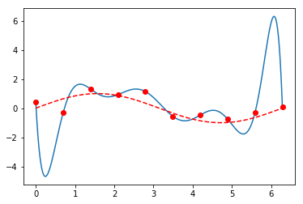



> Neural networks are inspired by how the brain works and can be used to solve general learning problems. This article introduces the basic principles and practice of neural networks.

<!--more-->

## Neural Network Representation

### Neuron Model

Neural networks are inspired by how the brain works and can be used to solve general learning problems. The basic building block of neural networks is the **neuron**. Each neuron has one axon and multiple dendrites. Each dendrite connected to this neuron is an input. When the sum of excitation levels from all input dendrites exceeds a certain threshold, the neuron becomes activated. An activated neuron sends signals along its axon, which branches into tens of thousands of dendrites connecting to other neurons, providing this neuron's output as input to other neurons. Mathematically, a neuron can be represented using a **perceptron** model.

<!--more-->

|         Biological Model          |            Mathematical Model            |
|:---------------------:|:--------------------------:|
|  |  |

The mathematical model of a neuron mainly includes:

| Name                         | Symbol  | Description                             |
|----------------------------|-----|--------------------------------|
| Input                 | $x$ | Column vector                            |
| Weight                | $w$ | Row vector, dimension equals number of inputs                   |
| Bias                  | $b$ | Scalar value, opposite of threshold                    |
| Weighted Input      | $z$ | $z=w · x + b$, input value to activation function        |
| Activation Function | $σ$ | Accepts weighted input, gives activation value                  |
| Activation           | $a$ | Scalar value, $a = σ(\vec{w}·\vec{x}+b)$ |

##### Activation Function Expression

<div>
$$
a
= \sigma(
 	\left[ \begin{matrix} 
 		w_{1} & ⋯  & w_{n} \\  
 	\end{matrix}\right]  ·
 	\left[ \begin{array}{x} x_1 \\ ⋮ \\ ⋮ \\ x_n \end{array}\right] + 
 	b
)
$$
</div>

The activation function typically uses the S-shaped function, also called sigmoid or logsig, because this function has excellent properties: **smooth and differentiable**, shape close to the hard-limit transfer function used by perceptrons, and **convenient computation** of function values and derivative values.


$$
σ(z) = \frac 1 {1+e^{-z}}
$$

$$
σ'(z) = σ(z)(1-σ(z))
$$

There are other activation functions, such as: hard limit transfer function (hardlim), symmetric hard limit function (hardlims), linear function (purelin), symmetric saturated linear function (satlins), log-sigmoid function (logsig), positive linear function (poslin), hyperbolic tangent sigmoid function (tansig), competitive function (compet). Sometimes they are used for learning speed or other reasons, but we won't elaborate on them here.

### Single-Layer Neural Network Model

A collection of neurons that can operate in parallel is called a layer of a neural network.

Now consider a single-layer neural network with $n$ inputs and $s$ neurons (outputs). The mathematical model for a single neuron can be extended as follows:

| Name   | Symbol   | Description                                      |
| ---- | ---- | --------------------------------------- |
| Input   | $x$  | All neurons in the layer share the same input, so input remains unchanged, still an $(n×1)$ column vector        |
| Weight   | $W$  | Changes from $1 × n$ row vector to $s × n$ matrix, each row represents weight information for one neuron |
| Bias   | $b$  | Changes from $1 × 1$ scalar to $s × 1$ column vector                  |
| Weighted Input | $z$  | Changes from $1 × 1$ scalar to $s × 1$ column vector                  |
| Activation  | $a$  | Changes from $1 × 1$ scalar to $s × 1$ column vector                  |

##### Activation Function Vector Expression

<div>
$$
\left[ \begin{array}{a} a_1 \\ ⋮ \\ a_s \end{array}\right]
= \sigma(
 	\left[ \begin{matrix} 
 		w_{1,1} & ⋯  & w_{1,n} \\  
 		⋮ & ⋱  & ⋮  \\ 
 		w_{s,1} & ⋯  & w_{s,n} \\  
 	\end{matrix}\right]  ·
 	\left[ \begin{array}{x} x_1 \\ ⋮ \\ ⋮ \\ x_n \end{array}\right] + 
 	\left[ \begin{array}{b} b_1 \\ ⋮ \\ b_s \end{array}\right]
)
$$
</div>

Single-layer neural networks have limited capabilities, so multiple single-layer networks are usually connected with outputs feeding into inputs to form multi-layer neural networks.

### Multi-Layer Neural Network Model

- Multi-layer neural network layers are counted starting from 1. The first layer is the **input layer**, the $L$-th layer is the **output layer**, and other layers are called **hidden layers**.
- Each layer of the neural network has its own parameters $W,b,z,a,⋯$. To distinguish them, superscripts are used: $W^2,W^3,⋯$.
- The input to the entire multi-layer network is the activation value of the input layer $x=a^1$, and the output of the entire network is the activation value of the output layer: $y'=a^L$.
- Since the input layer has no neurons, among all parameters of this layer, only the activation value $a^1$ exists as the network input value, without $W^1,b^1,z^1$, etc.

Now consider an $L$-layer neural network with layer sizes: $d_1,d_2,⋯,d_L$. The mathematical model of this network can be extended as follows:

| Name   | Symbol   | Description                                       |
| ---- | ---- | ---------------------------------------- |
| Input   | $x$  | Input remains unchanged, as $(d_1×1)$ column vector                   |
| Weight   | $W$  | Extended from $s × n$ matrix to list of $L-1$ matrices: $W^2_{d_2 × d_1},⋯,W^L_{d_L × d_{L-1}}$ |
| Bias   | $b$  | Extended from $s × 1$ column vector to list of $L-1$ column vectors: $b^2_{d_2},⋯,b^L_{d_L}$ |
| Weighted Input | $z$  | Extended from $s × 1$ column vector to list of $L-1$ column vectors: $z^2_{d_2},⋯,z^L_{d_L}$ |
| Activation  | $a$  | Extended from $s × 1$ column vector to list of **$L$** column vectors: $a^1_{d_1},a^2_{d_2},⋯,a^L_{d_L}$ |

##### Activation Function Matrix Expression

$$
\left[ \begin{array}{a} a^l_1 \\ ⋮ \\ a^l_{d_l} \end{array}\right]
= \sigma(
 	\left[ \begin{matrix} 
 		w^l_{1,1} & ⋯  & w^l_{1,d_{l-1}} \\  
 		⋮ & ⋱  & ⋮  \\ 
 		w^l_{d_l,1} & ⋯  & w^l_{d_l,d_{l-1}} \\  
 	\end{matrix}\right]  ·
 	\left[ \begin{array}{x} a^{l-1}_1 \\ ⋮ \\ ⋮ \\ a^{l-1}_{d_{l-1}} \end{array}\right] + 
 	\left[ \begin{array}{b} b^l_1 \\ ⋮ \\ b^l_{d_l} \end{array}\right])
$$

#### Meaning of Weight Matrices

The weights of multi-layer neural networks are represented by a series of weight matrices

- The weight matrix of layer $l$ can be denoted as $W^l$, representing connection weights from the previous layer ($l-1$) to this layer ($l$)
- Row $j$ of $W^l$ can be denoted as $W^l_{j*}$, representing connection weights from all $d_{l-1}$ neurons in layer $l-1$ to neuron $j$ in layer $l$
- Column $k$ of $W^l$ can be denoted as $W^l_{*k}$, representing connection weights from neuron $k$ in layer $l-1$ to all $d_l$ neurons in layer $l$
- Element at row $j$ and column $k$ of $W^l$ can be denoted as $W^l_{jk}$, representing the connection weight from neuron $k$ in layer $l-1$ to neuron $j$ in layer $l$
- That is, $w^3_{24}$ represents the connection weight from neuron 4 in layer 2 to neuron 2 in layer 3

Just remember that in weight matrix $W$, the **row index represents neurons in the current layer** and the **column index represents neurons in the previous layer**.


## Neural Network Inference

**Feed forward** refers to the computational process where a neural network accepts input and produces output. Also called **inference**.

The computation process is:

$$
\begin{align}
a^1  &= x \\
a^2  &=  σ(W^2a^1 + b^2) \\
a^3  &=  σ(W^3a^2 + b^3) \\
⋯ \\
a^L  &= σ(W^La^{L-1} + b^L) \\
y  &= a^L \\
\end{align}
$$

Inference is essentially a series of matrix multiplications and vector operations. A trained neural network can be efficiently implemented in various languages. The function of a neural network is manifested through inference. Inference is simple to implement, but how to **train the neural network** is the real challenge.


## Neural Network Training

Training a neural network is the process of adjusting weight and bias parameters in the network to improve its performance.

**Gradient Descent** is typically used to adjust neural network parameters. First, a **cost function** must be defined to measure the neural network's error, then gradient descent calculates appropriate parameter corrections to **minimize** network error.

### Cost Function

The cost function measures the performance of a neural network. It's a real-valued function defined on one or more samples and should typically satisfy:

1. **Error is non-negative; the better the neural network performs, the smaller the error**
2. **Cost can be written as a function of neural network output**
3. **Total cost equals the mean of individual sample costs**: $C=\frac{1}{n} \sum_x C_x$ 

The most commonly used simple cost function is the **quadratic cost function**, also called **Mean Square Error (MSE)**

$$
C(w,b) = \frac{1}{2n} \sum_x{{\|y(x)-a\|}^2}
$$

The coefficient $\frac 1 2$ is added for clean form after differentiation, $n$ is the number of samples used, where $y$ and $x$ are known sample data.

Theoretically, any metric that reflects network performance can serve as a cost function. But MSE is used instead of metrics like "number of correctly classified images" because only a **smooth and differentiable** cost function enables **gradient descent** parameter adjustment.

#### Sample Usage

Cost function calculation requires one or more training samples. When training samples are numerous, recalculating error functions over all training set samples each training round is very expensive and unacceptably slow. Using only a small subset can be much faster. This relies on the assumption: **cost of random samples approximates population cost**.

Based on sample usage, gradient descent is divided into:

- Batch Gradient Descent (Batch GD): Original form, uses all samples for each parameter update. Can achieve global optimum, easy to parallelize, but extremely slow when sample count is large.

- Stochastic Gradient Descent (Stochastic GD): Solves BGD's slow training problem by randomly using one sample each time. Fast training speed, but lower accuracy, not globally optimal, and difficult to parallelize.
- Mini-Batch Gradient Descent (MiniBatch GD): Uses b samples (e.g., 10 samples each time) for parameter updates, striking a balance between BGD and SGD.

Using only one sample each time is called online learning or incremental learning.

When all training set samples have been used once, it's called completing one **iteration**.


### Gradient Descent Algorithm

To reduce overall cost by adjusting a parameter in the neural network, consider the differential method. Since activation functions in each layer and the final cost function are smooth and differentiable, the final cost function $C$ is also smooth and differentiable with respect to parameters $w,b$ of interest. Slightly adjusting a parameter value causes continuous slight changes in the final error value. Continuously adjusting each parameter value along the gradient direction to make total error move in a decreasing direction until reaching an extremum is the core idea of gradient descent.

#### Logic of Gradient Descent

Assume cost function $C$ is a differentiable function of two variables $v_1,v_2$. Gradient descent essentially chooses appropriate $Δv$ to make $ΔC$ negative. From calculus:

$$
ΔC ≈ \frac{∂C}{∂v_1} Δv_1 + \frac{∂C}{∂v_2} Δv_2
$$

Here $Δv$ is vector: $Δv = \left[ \begin{array}{v}  Δv_1 \\ Δv_2 \end{array}\right]$, $∇C$ is gradient vector $\left[ \begin{array}{C} \frac{∂C}{∂v_1} \\ \frac{∂C}{∂v_2} \end{array} \right]$, so the above can be rewritten as

$$
ΔC ≈ ∇C·Δv
$$

What kind of $Δv$ can make the cost function change negative? One simple method is to let $Δv$ be a small vector collinear and opposite to gradient $∇C$, so $Δv = -η∇C$, then loss function change $ΔC ≈  -η{∇C}^2$, ensuring negative value. Following this method, continuously adjusting $v$: $v → v' = v -η∇C$ makes $C$ eventually reach minimum.

This is the meaning of gradient descent: **all parameters continuously make slight descents along their gradient (derivative) directions, making total error reach extremum**.

For neural networks, the learning parameters are actually weights $w$ and biases $b$. The principle is the same, but here the number of $w,b$ is enormous:

$$
w →w' = w-η\frac{∂C}{∂w} \\
b → b' = b-η\frac{∂C}{∂b}
$$

The real challenge lies in computing gradients $∇C_w,∇C_b$. Using differential methods to compute parameter gradients through $\frac {C(p+ε)-C} {ε}$ would require one feed-forward and one $C(p+ε)$ calculation for each parameter in the network. Facing the ocean of parameters in neural networks, this approach is impractical.

**Back propagation** algorithm can solve this problem. Through clever simplification, it can efficiently compute gradients for all parameters in the entire network with one forward pass and one backward pass.


## Backpropagation

The backpropagation algorithm takes a labeled sample $(x,y)$ as input and provides gradients for all parameters $(W,b)$ in the network.

### Backpropagation Error δ

The backpropagation algorithm introduces a new concept: error $δ$. The error definition comes from this intuitive idea: if slightly modifying the weighted input $z$ of a neuron no longer changes the final cost $C$, then $z$ has reached an extremum and is well-adjusted. So the partial derivative of loss function $C$ with respect to a neuron's weighted input $z$, $\frac {∂C}{∂z}$, can measure the error $δ$ on that neuron. Thus, define the error $δ^l_j$ on the $j^{th}$ neuron in layer $l$ as:

$$
δ^l_j ≡ \frac{∂C}{∂z^l_j}
$$

Like activation values $a$ and weighted inputs $z$, error can also be written as vectors. The error vector for layer $l$ is denoted $δ^l$. Though they look similar, using weighted input $z$ rather than activation output $a$ to define layer error has clever formal design.

Introducing the backpropagation error concept helps compute gradients $∇C_w,∇C_b$ through error vectors.

Backpropagation algorithm in one sentence: compute **output layer error**, use recursive equations to compute **each layer's error** layer by layer backward, then compute **weight gradients and bias gradients for each layer** from each layer's error.

This requires solving four problems:

1. Recursive base: How to compute output layer error: $δ^L$
2. Recursive equation: How to compute previous layer error $δ^l$ from next layer error $δ^{l+1}$
3. Weight gradient: How to compute current layer weight gradient $∇W^l$ from current layer error $δ^l$
4. Bias gradient: How to compute current layer bias gradient $∇b^l$ from current layer error $δ^l$

These four problems can be solved by four backpropagation equations.

### Backpropagation Equations

| Equation                                    | Description        | Number   |
| ------------------------------------- | --------- | ---- |
| $δ^L = ∇C_a ⊙ σ'(z^L)$                | Output layer error formula | BP1  |
| $δ^l = (W^{l+1})^T δ^{l+1} ⊙ σ'(z^l)$ | Error propagation formula    | BP2  |
| $∇C_{W^l} = δ^l × {(a^{l-1})}^T $     | Weight gradient formula  | BP3  |
| $∇C_b = δ^l$                          | Bias gradient formula  | BP4  |

When error function is MSE: $C = \frac 1 2 \|\vec{y} -\vec{a}\|^2= \frac 1 2 [(y_1 - a_1)^2 + \cdots + (y_{d_L} - a_{d_L})^2]$, and activation function is sigmoid:

| Computation Equation                                     | Description                                       | Number   |
| ---------------------------------------- | ---------------------------------------- | ---- |
| $δ^L = (a^L - y) ⊙(1-a^L)⊙ a^L$          | Output layer error requires $a^L$ and $y$                         | BP1  |
| $δ^l = (W^{l+1})^T δ^{l+1} ⊙(1-a^l)⊙ a^l $ | Current layer error requires: next layer weights $W^{l+1}$, next layer error $δ^{l+1}$, current layer output $a^l$ | BP2  |
| $∇C_{W^l} = δ^l × {(a^{l-1})}^T $        | Weight gradient requires: current layer error $δ^l$, previous layer output $a^{l-1}$           | BP3  |
| $∇C_b = δ^l$                             | Bias gradient requires: current layer error $δ^l$                         | BP4  |

### Proof of Backpropagation Equations

------

#### BP1: Output Layer Error Equation

The output layer error equation provides a method to compute output layer error $δ$ based on network output $a^L$ and labeled result $y$:

$$
δ^L = (a^L - y) ⊙(1-a^L)⊙ a^L
$$

##### Proof

Since $a^L = σ(z^L)$, this equation can be directly derived from the backpropagation error definition through **chain rule with $a^L$ as intermediate variable**:

$$
\frac{∂C}{∂z^L} = \frac{∂C}{∂a^L} \frac{∂a^L}{∂z^L}  = ∇C_a σ'(z^L)
$$

Since error function $C = \frac 1 2 \|\vec{y} -\vec{a}\|^2= \frac 1 2 [(y_1 - a_1)^2 + ⋯ + (y_{d_L} - a_{d_L})^2]$, taking partial derivative with respect to some $a_j$ on both sides:

$$
\frac {∂C}{∂a^L_j} = (a^L_j-y_j)
$$

Since in the error function, outputs from other neurons don't affect the partial derivative of the error function with respect to neuron $j$'s output, and coefficients cancel out. In vector form: $ (a^L - y) $. On the other hand, it's easy to prove $σ'(z^L) = (1-a^L)⊙ a^L$.

QED

------

#### BP2: Error Propagation Equation

The error propagation equation provides a method to compute previous layer error from next layer error:

$$
δ^l = (W^{l+1})^T δ^{l+1} ⊙ σ'(z^l)
$$

##### Proof

This equation can be directly derived from the backpropagation error definition using chain rule with all weighted inputs $z^{l+1}$ from the next layer as intermediate variables:

$$
δ^l_j = \frac {∂C}{∂z^l_j} 
= \sum_{k=1}^{d_{l+1}}  \frac{∂C}{∂z^{l+1}_k} \frac{∂z^{l+1}_k}{∂z^{l}_j}
= \sum_{k=1}^{d_{l+1}}  (δ^{l+1}_k  \frac{∂z^{l+1}_k}{∂z^{l}_j})
$$

Through chain rule, introducing next layer weighted inputs as intermediate variables introduces next layer error expressions in the right side. Now we need to solve what $\frac{∂z^{l+1}_k}{∂z^{l}_j}$ is. From weighted input definition $z = wx + b$:

$$
z^{l+1}_k = W^{l+1}_{k,*} ·a^l + b^{l+1}_k  =   W^{l+1}_{k,*} · σ(z^l) + b^{l+1}_k  
= \sum_{j=1}^{d_{l}}(w_{kj}^{l+1} σ(z^l_j)) + b^{l+1}_k
$$

Taking derivatives of both sides with respect to $z^{l}_j$:

$$
\frac{∂z^{l+1}_k}{∂z^{l}_j} = w^{l+1}_{kj} σ'(z^l)
$$

Substituting back:

$$
\begin{align}
δ^l_j & = \sum_{k=1}^{d_{l+1}}  (δ^{l+1}_k  \frac{∂z^{l+1}_k}{∂z^{l}_j})  \\
& = σ'(z^l)   \sum_{k=1}^{d_{l+1}}     (δ^{l+1}_k  w^{l+1}_{kj}) \\
& = σ'(z^l) ⊙  [(δ^{l+1}) · W^{l+1}_{*.j}] \\
& = σ'(z^l) ⊙ [(W^{l+1})^T_{j,*} ·  (δ^{l+1}) ]\\
\end{align}
$$

Here, summing the products of next layer neuron errors and weights can be rewritten as dot product of two vectors:

- Next layer error vector of $k$ neurons
- Column $j$ of next layer weight matrix, i.e., all weights from current layer neuron $j$ to all next layer $k$ neurons

Since vector dot product can be rewritten as matrix multiplication in row vector × column vector form, transpose the weight matrix - originally taking columns, now taking row vectors. Converting back to vector form:

$$
δ^l =  σ'(z^l) ⊙ (W^{l+1})^Tδ^{l+1}
$$

QED

------

#### BP3: Weight Gradient Equation

The weight gradient $∇C_{W^l}$ for each layer can be obtained from the outer product of current layer error vector (column vector) and previous layer output vector (row vector).

$$
∇C_{W^l} = δ^l × {(a^{l-1})}^T
$$

##### Proof

From error definition, taking partial derivative with $w^l_{jk}$ as intermediate variable:

$$
\begin{align}
δ^l_j & = \frac{∂C}{∂z^l_j} 
= \frac{∂C}{∂w^l_{jk}} \frac{∂ w_{jk}}{∂ z^l_j} 
= ∇C_{w^l_{jk}} \frac{∂w_{jk}}{∂ z^l_j} 
\end{align}
$$

From definition, weighted input $z^l_j$ for neuron $j$ in layer $l$:

$$
z^l_j = \sum_k w^l_{jk} a^{l-1}_k + b^l_j
$$

Taking derivative of both sides with respect to $w_{jk}^l$:

$$
\frac{\partial z_j}{\partial w^l_{jk}} = a^{l-1}_k
$$

Substituting back:

$$
∇C_{w^l_{jk}} = δ^l_j \frac{∂ z^l_j}{∂w_{jk}} =   δ^l_j a^{l-1}_k
$$

Observing, the vector form is an outer product:

$$
∇C_{W^l} = δ^l × {(a^{l-1})}^T
$$

- **Current layer error row vector**: $δ^l$, dimension ($d_l \times 1$)


- **Previous layer activation column vector**: $(a^{l-1})^T$, dimension ($1 \times d_{l-1}$)

QED

------

#### BP4: Bias Gradient Equation

$$
∇C_b = δ^l
$$

##### Proof

From definition:

$$
δ^l_j  = \frac{∂C}{∂z^l_j} 
= \frac{∂C}{∂b^l_j} \frac{∂b_j}{∂z^l_j} 
= ∇C_{b^l_{j}} \frac{∂b_j}{∂z^l_j}
$$

Since $z^l_j = W^l_{*,j} \cdot a^{l-1} + b^l_j$, taking derivative of both sides with respect to $z_j^l$ gives $1=\frac{∂b_j}{∂z^l_j}$. Substituting back: $∇C_{b^l_{j}} =δ^l_j$

QED

------

All four equations are now proven. They just need to be converted to code to work.


## Neural Network Implementation

As proof of concept, here's a Python implementation of an MNIST handwritten digit classification neural network.

```python
# coding: utf-8
# author: vonng(fengruohang@outlook.com)
# ctime: 2017-05-10

import random
import numpy as np

class Network(object):
    def __init__(self, sizes):
        self.sizes = sizes
        self.L = len(sizes)
        self.layers = range(0, self.L - 1)
        self.w = [np.random.randn(y, x) for x, y in zip(sizes[:-1], sizes[1:])]
        self.b = [np.random.randn(x, 1) for x in sizes[1:]]

    def feed_forward(self, a):
        for l in self.layers:
            a = 1.0 / (1.0 + np.exp(-np.dot(self.w[l], a) - self.b[l]))
        return a

    def gradient_descent(self, train, test, epoches=30, m=10, eta=3.0):
        for round in range(epoches):
            # generate mini batch
            random.shuffle(train)
            for batch in [train_data[k:k + m] for k in xrange(0, len(train), m)]:
                x = np.array([item[0].reshape(784) for item in batch]).transpose()
                y = np.array([item[1].reshape(10) for item in batch]).transpose()
                n, r, a = len(batch), eta / len(batch), [x]
                
                # forward & save activations
                for l in self.layers:
                    a.append(1.0 / (np.exp(-np.dot(self.w[l], a[-1]) - self.b[l]) + 1))

                # back propagation
                d = (a[-1] - y) * a[-1] * (1 - a[-1])	#BP1
                for l in range(1, self.L):  # l is reverse index since last layer
                    if l > 1:	#BP2
                        d = np.dot(self.w[-l + 1].transpose(), d) * a[-l] * (1 - a[-l])
                    self.w[-l] -= r * np.dot(d, a[-l - 1].transpose()) #BP3
                    self.b[-l] -= r * np.sum(d, axis=1, keepdims=True) #BP4
		
            # evaluate
            acc_cnt = sum([np.argmax(self.feed_forward(x)) == y for x, y in test])
            print "Round {%d}: {%s}/{%d}" % (round, acc_cnt, len(test_data))


if __name__ == '__main__':
    import mnist_loader

    train_data, valid_data, test_data = mnist_loader.load_data_wrapper()
    net = Network([784, 100, 10])
    net.gradient_descent(train_data, test_data, epoches=100, m=10, eta=2.0)
```

Data loading script: [`mnist_loader.py`](https://github.com/mnielsen/neural-networks-and-deep-learning/blob/master/src/mnist_loader.py). Input data as list of tuples: `(input(784,1), output(10,1))`

```bash
$ python net.py
Round {0}: {9136}/{10000}
Round {1}: {9265}/{10000}
Round {2}: {9327}/{10000}
Round {3}: {9387}/{10000}
Round {4}: {9418}/{10000}
Round {5}: {9470}/{10000}
Round {6}: {9469}/{10000}
Round {7}: {9484}/{10000}
Round {8}: {9509}/{10000}
Round {9}: {9539}/{10000}
Round {10}: {9526}/{10000}
```

After one iteration, the network achieves 90% classification accuracy on the test set, eventually converging to around 96%.

For fifty lines of code, this result is remarkable. However, 96% accuracy would probably still be unacceptable in actual production. To achieve better results, neural networks need optimization.


## Neural Network Optimization

This covers the basic knowledge of neural networks, but optimizing their performance is an endless challenge. Each optimization technique can be studied in depth as an advanced topic. Optimization methods are diverse: mathematics, science, engineering, philosophy, and even metaphysics...

There are several main methods to improve neural network learning:

- Choose **better cost functions**: e.g., **cross-entropy**
- **Regularization**: **L2 regularization**, dropout, L1 regularization
- Use other **activation neurons**: Rectified Linear Units (ReLU), hyperbolic tangent neurons (tansig)
- Modify neural network output layer: **softmax**
- Modify neural network input organization: Recurrent Neural Networks (RNN), Convolutional Neural Networks (CNN)
- Add layers: Deep Neural Networks (Deep NN)
- Choose appropriate **hyperparameters** through experimentation, dynamically adjust hyperparameters based on iteration count or evaluation results
- Use other gradient descent methods: momentum-based gradient descent
- Use better **weight initialization**
- Artificially expand existing training datasets

Here we introduce two methods: **cross-entropy cost function** and **L2 regularization** because they:

- Are simple to implement, requiring only one line of code change while reducing computational overhead
- Have immediate effects, reducing classification error rate from 4% to below 2%

### Cost Function: Cross-Entropy

MSE is a good cost function, but it has an embarrassing problem: learning speed.

MSE output layer error calculation formula:

$$
δ^L =  (a^L - y)σ'(z^L)
$$

Sigmoid is also called the logistic curve, whose derivative $σ'$ is bell-shaped. So when weighted input $z$ changes from large to small or small to large, gradient changes follow a "small, large, small" process. Learning speed is also dragged down by the derivative term, exhibiting a "slow, fast, slow" process.

|          MSE           |          Cross Entropy           |
| :--------------------: | :------------------------------: |
|  |  |

Using **cross-entropy** error function:

$$
C = - \frac 1 n \sum_x [ y ln(a) + (1-y)ln(1-a)]
$$

For a single sample:

$$
C = - [ y ln(a) + (1-y)ln(1-a)]
$$

Though it looks complex, the output layer error formula becomes exceptionally simple: $δ^L =  a^L - y$ 

Compared to MSE, it eliminates the derivative factor, so error is directly proportional to (predicted value - actual value), avoiding learning speed being slowed by activation function derivatives, and is simpler to compute.

#### Proof

Taking derivative of $C$ with respect to network output $a$:

$$
∇C_a = \frac {∂C} {∂a^L} = - [ \frac y a - \frac {(1-y)} {1-a}] = \frac {a - y} {a (1-a)}
$$

Among the four basic backpropagation equations, only BP1 relates to error function $C$: the computation method for output layer error.

$$
δ^L = ∇C_a ⊙ σ'(z^L)
$$

Now that $C$ has changed calculation method, substituting the new error function $C$'s gradient with respect to output $a^L$, $\frac {∂C} {∂a^L}$, back into BP1:

$$
δ^L = \frac {a - y} {a (1-a)}× a(1-a) = a-y
$$

### Regularization

Models with numerous free parameters can describe particularly magical phenomena.

Fermi said: "With four parameters I can fit an elephant, and with five I can make him wiggle his trunk." What wondrous things models like neural networks with millions of parameters can fit is unimaginable.

A model's ability to fit existing data well might only be due to sufficient degrees of freedom in the model, allowing it to describe almost any dataset of given size, rather than truly understanding the essence behind the dataset. When this happens, **the model performs well on existing data but has difficulty generalizing to new data**. This situation is called **overfitting**.

For example, fitting a sine function with random noise using a 3rd-order polynomial looks quite good; a 10th-order polynomial, though perfectly fitting all points in the dataset, has terrible actual predictive ability. It fits more the noise in the dataset rather than the underlying patterns.

```python
x, xs = np.linspace(0, 2 * np.pi, 10), np.arange(0, 2 * np.pi, 0.001)
y = np.sin(x) + np.random.randn(10) * 0.4
p1,p2 = np.polyfit(x, y, 10), np.polyfit(x, y, 3)
plt.plot(xs, np.polyval(p1, xs));plt.plot(x, y, 'ro');plt.plot(xs, np.sin(xs), 'r--')
plt.plot(xs, np.polyval(p2, xs));plt.plot(x, y, 'ro');plt.plot(xs, np.sin(xs), 'r--')
```

|            3rd-order polynomial             |            10th-order polynomial             |
| :--------------------------: | :---------------------------: |
|  |  |

A model's true test is its predictive ability on unseen scenarios, called **generalization ability**.

How to avoid overfitting? Following Occam's razor principle: **between two explanations with equal effectiveness, choose the simpler one.**

Of course, this principle is only a belief we hold, not a true theorem: it's not impossible that these data points were really generated by the fitted 10th-order polynomial...

Anyway, very large weight parameters usually indicate overfitting. For example, the 10th-order polynomial coefficients are quite abnormal:

```
 -0.001278386964370502
 0.02826407452052734
 -0.20310716176300195
 0.049178327509096835
 7.376259706365357
 -46.295365250182925
 135.58265224859255
 -211.767050023543
 167.26204130954324
 -50.95259728945658
 0.4211227089756039
```

Adding weight decay terms can effectively curb overfitting. For example, $L2$ regularization adds a $\frac λ 2 w^2$ penalty term to the loss function:

$$
C = -\frac{1}{n} \sum_{xj} \left[ y_j \ln a^L_j+(1-y_j) \ln
  (1-a^L_j)\right] + \frac{\lambda}{2n} \sum_w w^2
$$

So, the larger the weight, the larger the loss value, preventing the neural network from developing abnormal parameters.

This uses cross-entropy loss function. But regardless of loss function, it can be written as:

$$
C = C_0 + \frac {λ}{2n} \sum_w {w^2}
$$

Where the original cost function is $C_0$. Then the partial derivative of the original loss function with respect to weights becomes:

$$
\frac{∂C}{∂w} = \frac{ ∂C_0}{∂w}+\frac{λ}{n} w
$$

Therefore, the only computational change from introducing $L2$ regularization penalty is first multiplying by a decay coefficient when processing weight gradients:

$$
w → w' = w\left(1 - \frac{ηλ}{n} \right) - η\frac{∂C_0}{∂ w}
$$

Note that $n$ here is the total number of training samples, not the number of samples used in a mini-batch.


#### Improved Implementation

```python
# coding: utf-8
# author: vonng(fengruohang@outlook.com)
# ctime: 2017-05-10

import random
import numpy as np

class Network(object):
    def __init__(self, sizes):
        self.sizes = sizes
        self.L = len(sizes)
        self.layers = range(0, self.L - 1)
        self.w = [np.random.randn(y, x) / np.sqrt(x) for x, y in zip(sizes[:-1], sizes[1:])]
        self.b = [np.random.randn(x, 1) for x in sizes[1:]]

    def feed_forward(self, a):
        for l in self.layers:
            a = 1.0 / (1.0 + np.exp(-np.dot(self.w[l], a) - self.b[l]))
        return a

    def gradient_descent(self, train, test, epoches=30, m=10, eta=0.1, lmd=5.0):
        n = len(train)
        for round in range(epoches):
            random.shuffle(train)
            for batch in [train_data[k:k + m] for k in xrange(0, len(train), m)]:
                x = np.array([item[0].reshape(784) for item in batch]).transpose()
                y = np.array([item[1].reshape(10) for item in batch]).transpose()
                r = eta / len(batch)
                w = 1 - eta * lmd / n

                a = [x]
                for l in self.layers:
                    a.append(1.0 / (np.exp(-np.dot(self.w[l], a[-1]) - self.b[l]) + 1))

                d = (a[-1] - y)  # cross-entropy    BP1
                for l in range(1, self.L):
                    if l > 1: 	# BP2
                        d = np.dot(self.w[-l + 1].transpose(), d) * a[-l] * (1 - a[-l])
                    self.w[-l] *= w  # weight decay
                    self.w[-l] -= r * np.dot(d, a[-l - 1].transpose())  # BP3
                    self.b[-l] -= r * np.sum(d, axis=1, keepdims=True)  # BP4

            acc_cnt = sum([np.argmax(self.feed_forward(x)) == y for x, y in test])
            print "Round {%d}: {%s}/{%d}" % (round, acc_cnt, len(test_data))

            
if __name__ == '__main__':
    import mnist_loader
    train_data, valid_data, test_data = mnist_loader.load_data_wrapper()
    net = Network([784, 100, 10])
    net.gradient_descent(train_data, test_data, epoches=50, m=10, eta=0.1, lmd=5.0)
```

```
Round {0}: {9348}/{10000}
Round {1}: {9538}/{10000}
Round {2}: {9589}/{10000}
Round {3}: {9667}/{10000}
Round {4}: {9651}/{10000}
Round {5}: {9676}/{10000}
...
Round {25}: {9801}/{10000}
Round {26}: {9799}/{10000}
Round {27}: {9806}/{10000}
Round {28}: {9804}/{10000}
Round {29}: {9804}/{10000}
Round {30}: {9802}/{10000}
```

Simple changes significantly improved accuracy, eventually converging to 98%.

Modifying size to `[784,128,64,10]` to add one hidden layer can further improve test set accuracy to 98.33%, validation set to 98.24%.

For MNIST digit classification tasks, the current best accuracy is 99.79%. Those misclassified cases would probably be difficult for humans to correctly identify. Latest progress in neural network classification can be found here: [classification_datasets_results](http://rodrigob.github.io/are_we_there_yet/build/classification_datasets_results.html).

This article is study notes from the TensorFlow officially recommended tutorial: [Neural Networks and Deep Learning](http://neuralnetworksanddeeplearning.com/).