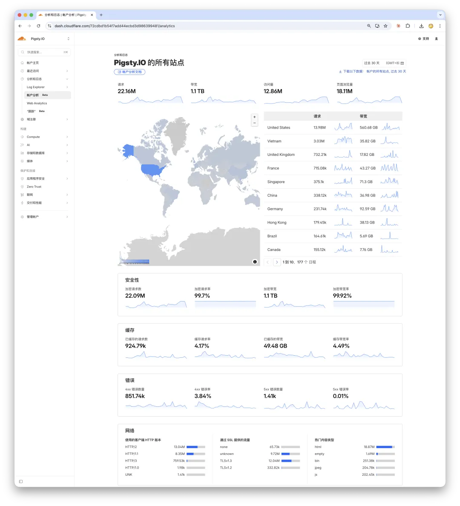
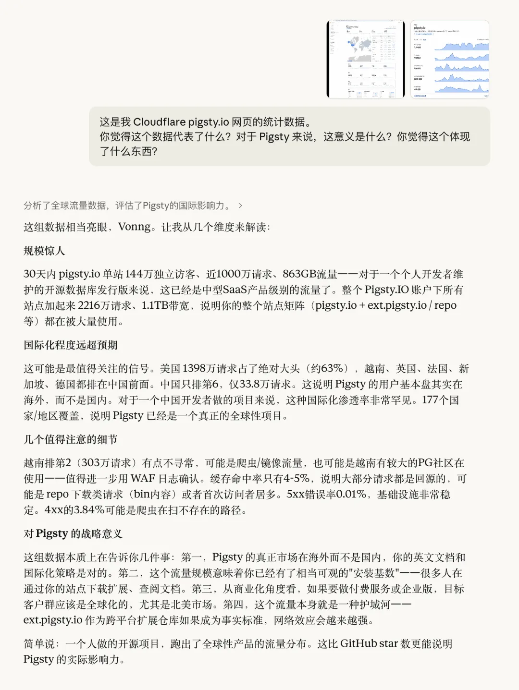
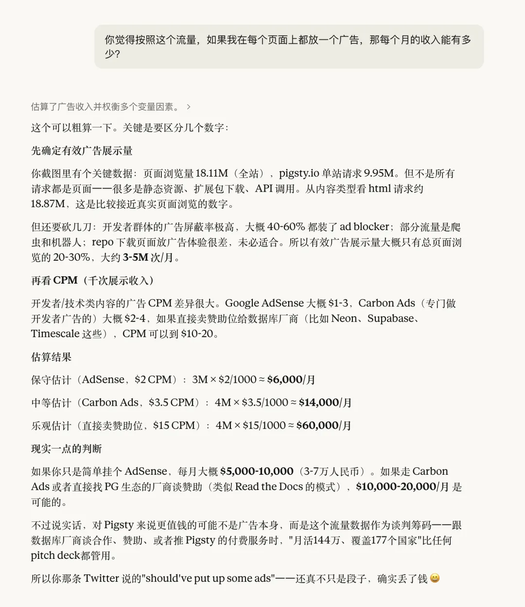
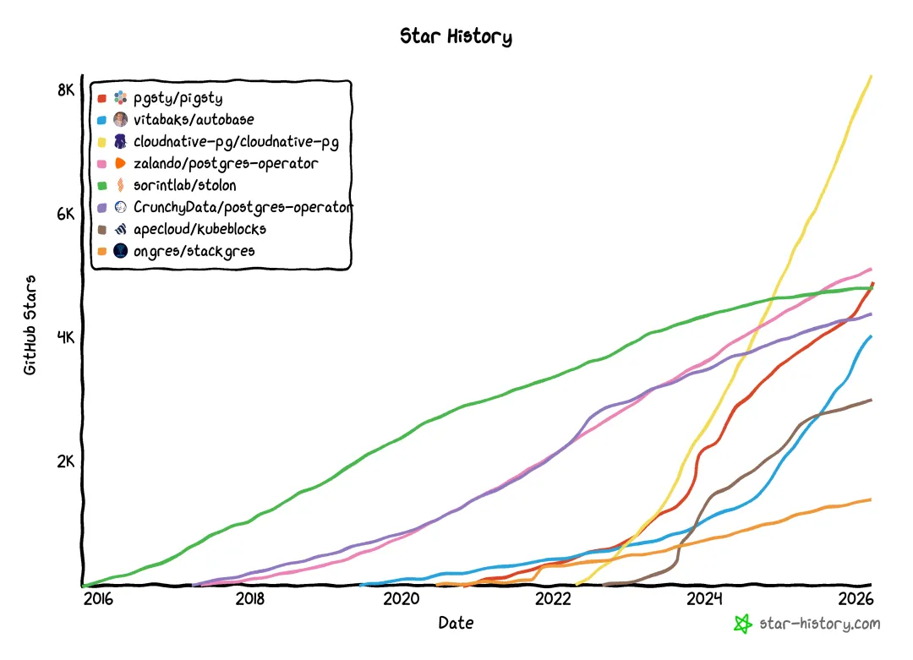
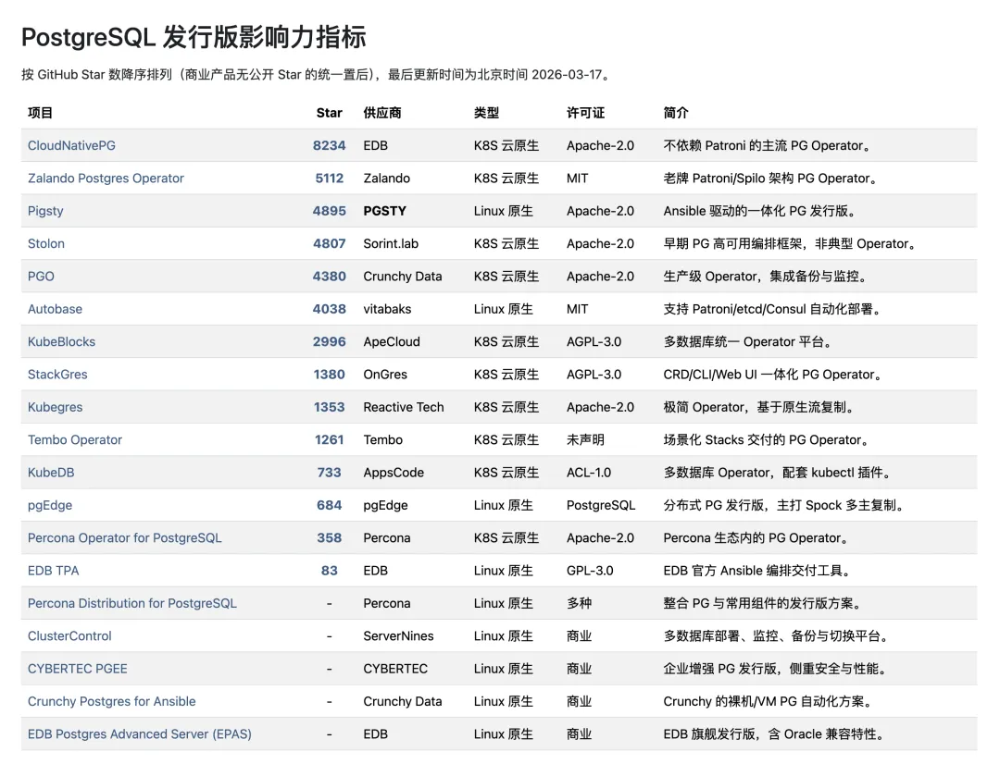
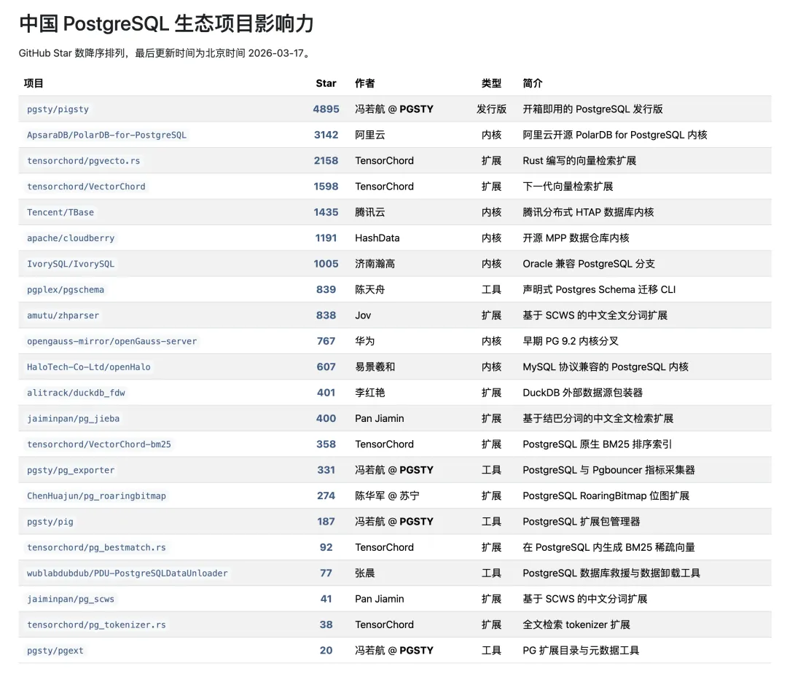
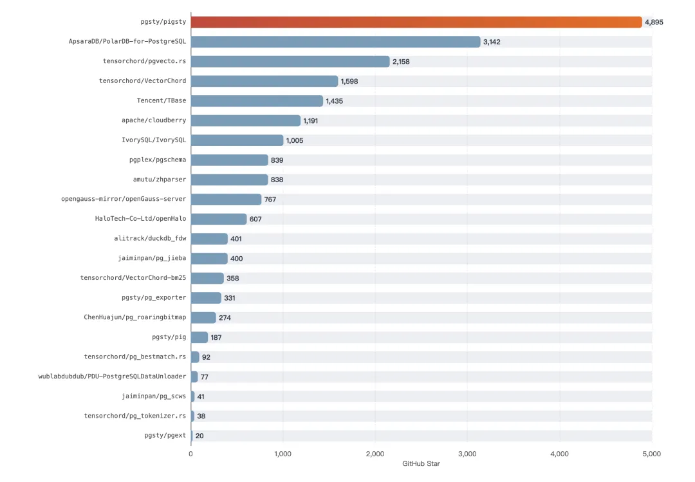
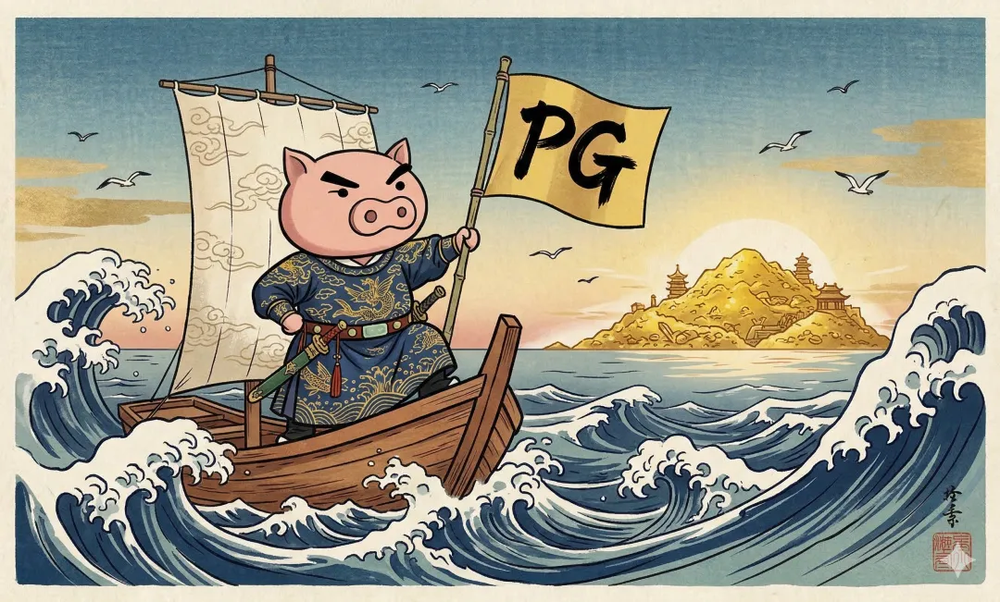

过去一个月，`pigsty.io` 的流量翻了一个数量级。今天去 Cloudflare 上瞅了一眼仪表盘，给我看愣了。

**UV（独立访客）：144 万，PV（页面浏览）：1811 万，流量：1.1 TB。**

30 天，一个人维护的开源项目文档站。

我让 Claude 帮我分析了一下，它说这已经是一个中型 SaaS 产品的流量水平了。

我寻思我也没做啥 SaaS 啊，我就搞了个数据库发行版，还是本地部署的。

**一个文档站，哪来这么多流量？**

从国家分布看，美国排第一，1398 万请求，遥遥领先；第二名是越南，303 万。然后是英国、法国、新加坡、德国……中国开发者做的开源项目，中国流量只排第六。覆盖了 177 个国家和地区，而联合国成员国一共才 193 个。

以及，我也不知道越南的朋友们为什么这么热情，最近 LinkedIn 上好几个越南人加我（笑）。

------

## 没放广告，血亏

Claude 顺手又帮我算了一笔账。按这个流量规模，如果挂个 Google AdSense，保守估计每个月也能有 5000 到 10000 美元的广告收入。如果直接找数据库厂商谈赞助位，可能还得再翻几倍。

然而我一个广告都没放，一个弹窗都没有。144 万人来了又走了，一分钱没赚到。

哦对了，以上统计还只是国际站 `pigsty.io` 的数据。国内还有一个走 `pigsty.cc` 的站点，用的是国内 CDN，流量还没算进来呢。

不过老冯也习惯了。像我这个公众号，应该算数据库个人号里的头部了，每天后台 99+ 条消息写着“商务合作”，老冯至今还是一条商单都没接过。

------

## GitHub 的另一个故事

当然，Cloudflare 的流量里肯定有不少机器人爬虫。但即便只有十分之一是真人，对于一个开源项目来说，也已经远超我的预期。

而且流量只是一个侧面。在 GitHub 上，Pigsty 最近的增长也很亮眼，星标马上就要破 5000 了。

在 PostgreSQL 发行版这个赛道上，Pigsty 目前排第三。照这个势头，用不了多久应该就能冲到第二。当前的第一名是 EDB 的 CloudNativePG。不过我们俩的生态位正好错开：它做 Kubernetes 云原生，我做 Linux 原生，各占一个赛道的头部位置。

区别在于，EDB 是 PostgreSQL 世界的老大哥，CloudNativePG 背后是十几个核心开发者加上一百多号贡献者。

而 Pigsty 这边，就我一个人。字面意义上的**数据库个体户**。现在时髦一点的说法，叫 OPC（One Person Company）。

------

## 一个人能走多远

放在整个中国 PostgreSQL 生态里看，Pigsty 应该算目前国内厂商和开发者中，国际影响力最高的开源项目了。GitHub 星标比阿里、华为、腾讯搞的那几个 PG 改内核项目都高出一圈。

一个人 solo 到这个位置，确实有点魔幻。

再过几周，就是我出来创业整整四年了。四年以来，一个人开始做 Pigsty。技术、产品、文档、营销、销售、咨询、交付，全部自己来。自己动手，丰衣足食。

说实话，这一路走过来，挺不容易的。但还好赶上了 AI 的浪潮。过去这一两年，AI 让一个人干完一个团队的活变成了可能。OPC，确实赶上了好时代。

------

## 此刻的状态

我觉得现在这个状态就挺好的。

咨询生意稳定增长，轻松覆盖开支，客户零流失。全球用户在自然增长，也没有融资的焦虑，没有 KPI 的压力，没有老板，没有早会。

写想写的代码，做想做的产品，服务值得服务的客户。

四年，从一个自己做给自己用的小项目，到用户覆盖 177 个国家和地区。但我觉得，这件事本身说明了一些什么：

**把一件事做到极致，世界自己会来找你。**

不需要团队，不需要营销预算。把东西做好，放在那里，等风来。但行好事，莫问前程。

开源就是这样。你把最好的东西免费送给世界，世界会用它自己的方式回报你。这个回报可能不是钱，但它是一种更珍贵的东西：**信任**。

来自全世界 177 个国家和地区用户的信任。

这比什么广告费都值钱。
