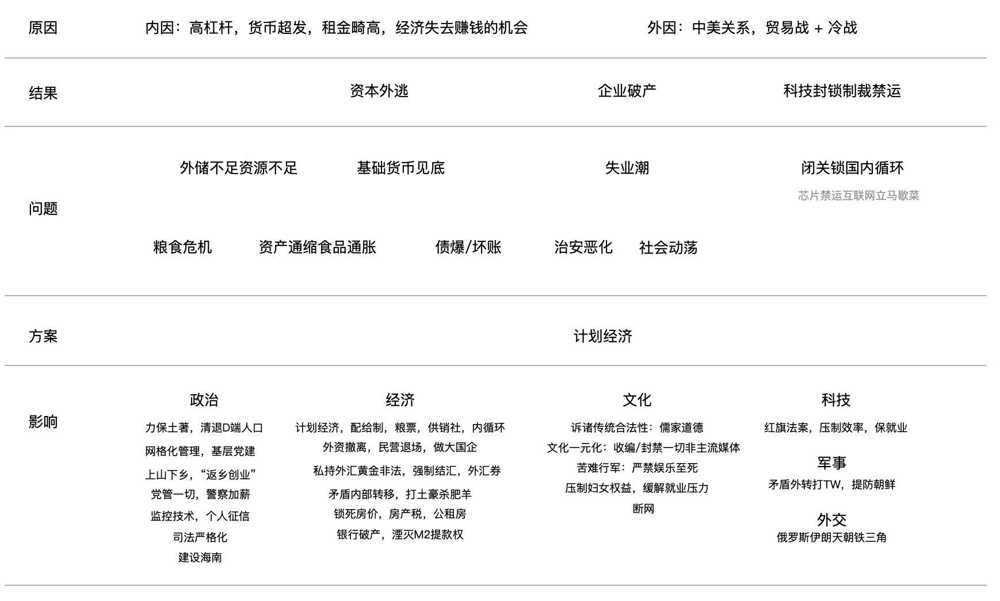
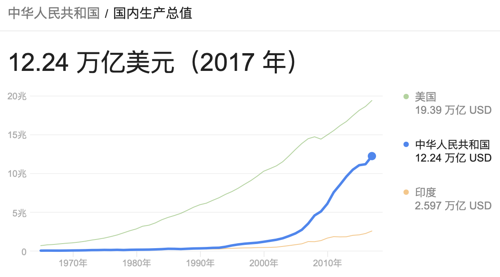
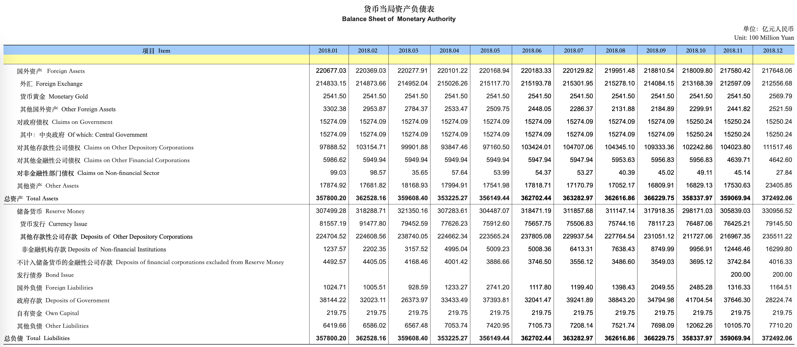
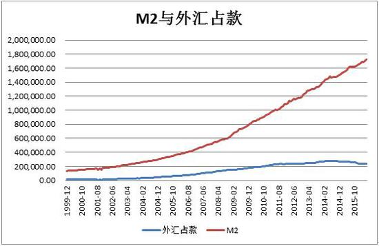

> This article may cause discomfort. Please read with caution.

During this rare leisure time alone in the New Year, I write these random thoughts, writing wherever my mind wanders.

I've always believed that choice is more important than effort: a person's life formally consists of a series of key choices forming a path. Making correct choices requires wisdom, while persisting in effort requires willpower. Both wisdom and willpower are precious and rare qualities, but wisdom is relatively more important because it determines the direction of progress and the number of viable options.

In the past year, I made many important choices: changed profession, changed industry, and changed jobs. But if asked what the most important choice was, I believe it was spending a lot of time improving my social cognitive level. Thanks to my profession's special nature, I had plenty of time to study. In nearly half a year, I averaged six hours daily on contemporary history, macroeconomics, and current affairs news. Why? A person's destiny certainly depends on personal struggle, but one must also consider the course of history. Standing at history's turning point, improving basic judgment ability about future situations is far more important than mastering a bit more technical knowledge.

When the money printing started in 2008, I was still confused. By the money shortage in 2013, I began to sense the gloom. By 2016, I clearly felt something was wrong and began preparing - watching news broadcasts daily, following domestic and international news and related economic data, selling houses, exercising, saving money. In early 2018, when AI and blockchain bubbles were still hot, I realized the internet had peaked and left the industry at the last moment, stepping on the layoff wave. Of course, this level of judgment is still too slow. The most impressive person I know discovered clues from the Crown Prince's "nothing better to do when full" comment in 2009, deduced the script had gone off course, and fled.

So what is the script? I've guessed some of it. Logically, keeping quiet and making a fortune would be best, but I really can't bear to just watch from the sidelines. So today I'll share my views with everyone. **These are Jia Yucun's words, crazy ravings. Any resemblance is purely coincidental, and I take no responsibility.**

## Preface

Thirty years east of the river, thirty years west of the river - sixty years make one Kondratiev cycle. The first thirty years were socialist construction, the latter thirty years the journey of reform and opening up. Personal choices determine fate, national choices determine national fortune: this year marks the 40th anniversary of reform and opening up. Since choosing monetary stimulus in 2008, the Party-state chose to walk the irreversible path of defying fate. In 2008, 2013, and 2015, it should have landed, but refusing to print money caused trouble. Under unlimited money printing, it was artificially extended three times, forcibly stretching the cycle's second half by ten years. Many collapse theorists saw the problems but cried wolf too early, foolishly staying short for ten years. Violating economic laws always requires payback - the higher you blow it, the harder you fall. Currently, monetary stimulus is basically ineffective, the external environment has changed dramatically, and hoping AI will drive the next technological revolution is basically hopeless. So the story is essentially determined.

It can be said that China's current achievements are due to the "key move" of joining the WTO and participating in the global trade division system. China became the world's factory, relying on hardworking and brave Chinese people, reform dividends and demographic dividends, almost monopolizing all global low- and mid-end manufacturing jobs while continuously climbing up the industrial chain, becoming the so-called "developed country crusher." China is the biggest beneficiary of the current international order, while the biggest victims are the middle and lower classes of developed countries - their jobs were "taken" by Chinese people, and money was "earned away" by Chinese people. America is the maintainer of this international order, but it's no longer willing to play world government to maintain this system. The middle and lower classes elected Trump, and America personally entered the fray. A country perishes when it has no external enemies or internal troubles, and America's top strategic opponent is China. This is the background of the trade war and Cold War 2.0.

The facts of trade war and cold war are no longer in question. March 1st is the final ultimatum for foreign trade nodes, though it may actually be delayed further. No matter how trade negotiations go, it's ultimately about buying time with money (the so-called strategic opportunity period). After America accepts the big gift, it will return soon, and 25% won't be the final result. Before the boss prepares to discipline the second-in-command, the first thing to do is redirect trade connections elsewhere to reduce impact on their own economy. Only after major supply chains transfer away from China can they confidently withdraw and go all out. One thing is certain: regardless of trade negotiation outcomes or whether tariffs are added, it won't affect the upcoming Cold War 2.0 technological blockade and embargo.

Therefore, what our court faces is an unprecedented transformation in 40 years, described by the General Secretary as "unimaginable tempestuous waves." For the top leader to call it unimaginable tempestuous waves - this phrase carries too much weight.

Forty years of reform and opening up - from post-80s to post-2000s generations, enough to span two generations with over a dozen generation gaps. People within forty-fifty years old were born in a golden age, riding reform spring winds and globalization waves in the main theme of peace and development, all the way successful and spirited. In over a decade of economic miracles, these people took **tomorrow will be better** for granted, full of beautiful expectations for the future. These people received depoliticized brainwashing education (deliberately designed rigid political courses), busy being strivers climbing up, with no time or concern for social reality. However, at the end of the cycle, many will become sacrifices of the era. For most people, knowing the script won't help them escape the harvest sickle, only losing the happiness of ignorance. So closing this article and exiting now is still possible.

## The Script

So what is the upcoming script?

I speculate the direction for the next 10-20 years as follows, which is also my understanding of so-called "systemic risks."

### Background

First, the background: China is an export-oriented economy, foreign trade exports have always been China's economic growth engine, with over half of imports serving exports - a typical processing trade model. Foreign trade brought China massive foreign exchange reserves, absorbed huge domestic capacity, solved employment problems. Current account surplus (trade surplus, earned foreign exchange) is the soul of our court's economy. Our main surplus comes from Europe and America, while we have complete deficits with Japan, South Korea, and Taiwan. **92% of 2018 goods trade surplus came from America**, so reform and opening up essentially means **opening up to America**. America is the world's most important ultimate market for export goods. Under full-scale trade war with +25% tariffs, losing the American market demand could halve China's total foreign trade, directly collapsing China's balance of payments. In plain terms: goods can't be sold, money can't be earned.

**Chart: China's GDP trend, showing real takeoff after China joined WTO in 2001**

Here's a digression: what is **money**? In the credit currency era, currency is **national credit backed by state violence**. In the world, the US dollar is hard money, while RMB internationalization collapsed midway, still far from hard currency. So our court adopted the method of pegging to the dollar to gain credit for RMB. RMB is essentially a debt certificate to China's central bank, with collateral listed on the central bank's balance sheet assets - mainly foreign exchange reserves (dollars). RMB being anchored to the dollar means whenever we earn 1 dollar, the central bank issues equivalent RMB worth about 7 yuan at the exchange rate to exchange for it. When we use RMB to buy foreign exchange from the central bank to realize debt claims, for every 1 dollar taken out, the central bank cancels equivalent 7 yuan RMB at the exchange rate. Therefore, holding RMB can be exchanged for dollars - this became the source of RMB's credibility.

**Chart: Monetary authority balance sheet, showing foreign exchange holdings are the major component of RMB's corresponding assets**

Back to the main topic: after joining WTO, China accumulated massive foreign exchange reserves (hard money), peaking at about 4 trillion dollars. The central bank used this money as collateral to print over 20 trillion yuan in foreign exchange holdings (base money). This base money was then multiplied through bank lending into about 182 trillion M2 (quasi-money, bank deposits). In twenty years, M2 supply increased tenfold to 182 trillion. Printing ten times more money but food prices and various daily necessities didn't increase tenfold because this money was absorbed by real estate and IT/finance enterprises. Houses and enterprises became storage tools for excess currency, so home buyers and high-salary IT/finance workers should clearly realize their earnings are dividends of the era.

**Chart: 20-year change in quasi-money supply M2**

Accompanying M2's explosive growth is massive loans and debt (leverage) - enterprises borrowing to survive, individuals borrowing to buy houses, local governments borrowing for infrastructure projects. Total social leverage has reached 250%, meaning total social debt equals 2.5 times GDP. Interest alone on these debts is astronomical. During economic upswing, these problems can be hidden - continuously earned dollars become RMB to pay interest. But if foreign trade collapses, dollars outflow, RMB needs cancellation, base money loss, macroeconomic liquidity tension, and debt explosions somewhere are inevitable. Unemployed mortgage holders can't pay monthly payments, enterprises face cash flow breaks and bankruptcy. The second half of 2018's P2P explosion wave and bond default wave already showed us a vivid picture. As for local governments' 50 trillion shit debt, they never planned to repay it - how to resolve this can only be swallowed by banks (bank bankruptcy, personal deposits have 500k insurance).

Meanwhile, wealth gaps widen, real estate prosperity kills other industries, high rents raise costs across all sectors. Investing in manufacturing is completely inferior to lying down and speculating in real estate, killing entrepreneurial spirit. Upstream supply-side reform raises raw material and energy prices, fattening state enterprises while harming downstream enterprises. Demographic dividends fade - China's labor costs are no longer low (Shenzhen hiring 4000-6000 yuan, same work in Vietnam only 2000-3000 yuan, Cambodia only 1000). Various factors overlay - profit opportunities in the economy become fewer, Shenzhen already shows enterprises queuing to deregister. If 25% comprehensive tariffs come at this time, foreign enterprise withdrawal and private enterprise bankruptcy waves are imminent (actually already begun). Economic depression destroys confidence, foreign capital withdraws, powerful elites transfer assets - leakage cannot be stopped. Capital flight causes foreign exchange reserve decline, leading to base money decline and liquidity tension, triggering further economic deterioration, causing more capital flight, ultimately forming positive feedback vicious cycles.

The third problem is scientific and technological blockade and high-tech product embargo, along with sanctions. Embargo and sanctions can be said to be hallmarks of cold war. China's application technology is very impressive (first-class copying and micro-innovation capabilities, huge market for technology exchange), has low human rights advantages (privacy for convenience). But basic research has almost nothing particularly outstanding except physics - plenty of so-called "research" picking up breadcrumbs. Other industries aside, the IT industry's national science and technology awards like "transparent computing" and "cloud-edge fusion system resource reflection mechanisms and efficient interoperability technology" are simply huge jokes. Now we build our own walls and allow researchers to climb them, but doors need blocking from both sides to close properly. If America also builds walls and blockades, we're blind. For example, domestic internet basically walks on two legs: hardware leg mainly chips, basically all imported; software leg basically all open source - GitHub and StackOverflow likely provide over 90% of domestic internet companies' technical productivity. Once embargo, blockade, and disconnection occur, the picture is too beautiful to look at. US Congress has already proposed chip embargos on ZTE and Huawei - comprehensive embargo is not far off. Relying on self-reliance is basically unrealistic. So after basic research is locked down, total factor productivity improvement is slow, and the gap with America will widen. Except for military industry and some strategic industries willing to invest money, prospects for other fields are bleak.

Blockade, embargo, and sanctions are very uncomfortable - we can see the miserable conditions of North Korea, Venezuela, and Iran under sanctions. Upcoming sanctions will come not only from America but from the entire Western world, maybe plus Japan. Global nationalist resurgence will make Western civilization unite as one (Christian civilization), while China (Chinese civilization), Russia (Orthodox civilization), Iran (Islamic civilization) can only huddle together for warmth, with their economies entering internal circulation. But China's economic machine once served the entire world's demand: one Tangshan city's underreported steel output exceeds all of Germany's steel output, one township's sock production accounts for one-third of the world's. After entering internal circulation, these explosive capacities absolutely cannot be absorbed by domestic demand, especially since residents' internal consumption capacity was already drained by housing. Therefore, "supply-side reform" is needed to reduce capacity - close these non-Zhao-surnamed factories early and gradually release unemployment pressure.

Above are three direct consequences of trade war and cold war: capital flight, enterprise bankruptcy, technological blockade. In summary, foreign reserve loss means base money reduction, liquidity tension triggering debt crisis entering Minsky moment, triggering asset selling waves and asset deflation. Meanwhile, excess currency flows out from assets but can't exchange for dollars to flee, inevitably impacting daily necessities causing food and rent prices to skyrocket - necessities inflation. Ultimately forming the economic spectacle of asset deflation and necessities inflation. Foreign enterprise divestment and private enterprise bankruptcy trigger large-scale unemployment waves, mortgage holders defaulting trigger property selling, people losing economic sources retaliate against society causing security deterioration (like the axe gangs during mass layoffs), improper handling may even trigger social unrest with Zhang Xianzhong everywhere. These direct consequences will further trigger other problems - this is the so-called "systemic risk," expanded below.

### Systemic Risks

**Systemic risk begins with foreign exchange reserve loss** - foreign exchange is big brother's lifeline because foreign exchange is real money that can buy food, oil, and other resources. After losing the ability to earn foreign exchange, the most severe problem is **resource shortage** - the two most critical resources are oil and food. Why push new energy vehicles so hard? Because we don't lack coal or worry about electricity, but precious oil needs importing, should be saved for chemical industry raw materials and plastics/fertilizers. Another deadly problem is food crisis - imported grain is really too cheap, domestic grain can basically only be sold to government reserves, and the government is reluctant, purely for food self-sufficiency security considerations. An acre of land earns only a few hundred yuan after hard work, completely inferior to working in cities. Many farmers abandon farming. Food crisis has been analyzed in special articles - self-sufficiency rate is estimated around 70% (no responsibility for this data). Much grain comes through smuggling (search Guangxi grain smuggling for surprises). But as long as social order doesn't collapse, through grain tickets and rationing systems and planned economy reducing waste, starvation is unlikely. **Supply and marketing cooperatives** are prepared for food and material shortages - this planned economy organization returned to people's view after Securities Regulatory Commission 641's departure. In 2012, supply and marketing cooperative coverage was only 56%, reaching 95% by 2018. Why rebuild this planned economy organization with effort? It seems the Party-state prepared for today years ago. Besides food and energy, many imported goods requiring foreign exchange will become luxury items - overseas travel and study will definitely be prohibited. For example, the state recently canceled public-funded master's study abroad, tourism is likely on the way. The Supreme Court just issued foreign exchange illegal trading standards - worth studying.

**The second systemic risk problem is inflation** - excess currency will impact daily necessities. Examples already appeared in recent years - 2009's economic landing required massive money printing, hot money impacted daily necessities with famous examples like "garlic you ruthless," "bean you play," "ginger your army," etc. When stock, property, and bond market yields can't sustain, capital will definitely impact the most profitable areas - speculating on daily necessities. Many should already feel rising meat and vegetable prices. Another example is rent - buying houses isn't essential, living is. So renting as daily necessity also becomes speculation target. So we see property prices falling but rents soaring - I rented for 3000 in Beijing, rising to 4000 in less than six months. According to the script, these daily necessities prices will continue rising, skyrocketing after crisis erupts. According to the Party-state's thinking, use high living costs to drive potential unemployed populations out of big cities first. Then when people can't stand sky-high prices and call for government intervention, seize the moment and legitimately introduce grain ticket rationing systems, entering planned economy mode. This script can roughly reference the grain and cotton wars of early nation-building.

**The third systemic risk problem is unemployment** - unemployment directly affects social stability. Those with steady property have steady hearts, those without steady property have unsteady hearts. Without steady hearts, **anything evil and extravagant can be done**. Saying our court is GDP-supremacist is actually a misunderstanding - the real bottom line is ruling stability, a one-vote veto core objective function and KPI, bar none. Any progress must be built on "stability": stable improvement, stable progress, stable change - stability overrides everything. Stability maintenance spending already exceeds defense spending. Among the six stabilities, stable employment ranks first. Employment situation is severe - this round of layoffs will likely be much worse than 1998. IT finance is the best industry, now also entering layoff waves. As for other industries, I believe everyone should have personal experience by now.

Private enterprises created 80% of employment positions and 154% of net exports (because state enterprises lose money, so percentage exceeds 100%). Trade war America demands balanced books - can't really buy 5 million tons of soybeans daily? Finally can only reduce capacity and earn less, and because of righteous state enterprise expansion, private enterprises must bear the burden of capacity reduction and factory closures. How to handle massive unemployment after capacity reduction is tricky. Unemployment pressure can't be released at once - that would directly cause social unrest, so must be gradually released. Supply-side reform starting in 2016 many people couldn't clearly explain what it was. But don't look at ads, look at effects - whether environmental storms or upstream price increases, supply-side reform's purpose or effect is making these private enterprises, especially labor-intensive enterprises, close early and release unemployment pressure early. Those surviving, relatively important ones like Alibaba, Tencent, Toutiao, should be classified as "our own people," nationalized or state-controlled, with this script referencing socialist public-private partnership transformation.

As for foreign enterprises, many that could flee already fled. Foreign enterprise withdrawal takes away massive foreign exchange, triggering large-scale unemployment. Taking model foreign enterprise Apple as example - news says if tariffs rise to 25%, Apple considers moving iPhone assembly business out of China. Apple drives 5 million upstream and downstream jobs in China - if Apple flees, suppliers in the industrial chain may only drink northwest wind. Rumors say Foxconn will lay off 300-400k employees - this scale is almost like slaughtering a city. Without urban work opportunities, migrant workers can only "return home to start businesses" - last year reportedly 8 million returned home to start businesses, actually just euphemism for unemployment.

Another key unemployment group is university graduates. 2018 had 8.2 million university graduates - truly pitiful, graduating right into economic winter. Students think more naively and extremely, plus learned some revolutionary methodology - so-called "the more knowledge, the more reactionary." Not solving student employment properly causes big problems. Our court's historical method for unemployment crises is sending people to mountains and countryside - done three times total: intellectual youth to rural areas, stuffing students into villages as rural teachers and barefoot doctors. Interested parties can check what recent university internship projects are doing - Mountain and Countryside 4.0 was prepared long ago. Villages always played China's economic buffer role, but it's been decades since last time - how effective this round will be is questionable.

Accompanying unemployment waves is rapid security deterioration - those who experienced Northeast 1990s layoff waves may understand this. Economic depression eras are full of social hostility. Recent vicious revenge against society cases obviously increased - a representative example is Beijing Xicheng District elementary school incident, where the suspect committed crimes due to layoff dissatisfaction. Actually such incidents are increasing, but most are silenced - attentive people can follow this. Regarding security, big cities will definitely be last to become chaotic. For individuals, staying in big cities is best if possible - people raised in prosperous conditions are much milder. But this isn't easy. Beijing started driving people out in 2014 - 2018 population decreased 170k year-on-year, tertiary industry total profit decreased 11.7%, social consumption actually declined after removing CPI. Why prefer losing money to driving people out? To release unemployment pressure early, avoiding one-time collapse when shockwaves arrive. National Master says: prepare for the worst. The worst case doesn't mean losing jobs and staying idle at home - maybe he wanted to say Five Barbarians chaos and two-legged sheep scenarios. How can there be lifeboats without eating special supplies?

Since discussing unemployment, as a former internet industry worker, I'll specifically mention domestic internet industry fate. I previously wrote "Internet Setbacks" but it was deleted. Here's the conclusion - after Cold War begins, domestic internet is doomed 💊:

1. CW triggers ideological divergence return, cultural position control strengthens.
2. Internet has social mobilization ability and public opinion influence, uncontrollable.
3. CW triggers technical sanctions, chip embargos, material foundation no longer exists.
4. CW triggers economic crisis, internet technology improving efficiency conflicts with government stability maintenance KPI.

Internet technology companies' core value is improving efficiency, liberating productivity. They convert many low-end positions into few high-end positions, conflicting with employment preservation KPI. One person eating well vs. ten people eating enough - no doubt how big brother chooses. Additionally, information system development and maintenance stages need different personnel numbers. Once growth peaks and no new functions needed, developers become unemployed. Some existing systems still need continuous operation - operations can survive longer. But overall, wild IT enterprises either get recruited or perish under cultural suppression. Final possible result: millions of laid-off IT programmers competing for extremely few government internal, powerful department police/political/legal, and state enterprise internal operations positions.

Many internet enterprise executives already sense the situation, starting layoffs and entering winter mode - now basically just waiting for BAT. But these important enterprises will unexpectedly be recruited. Boss Ma's wise retreat from control to teach is intelligent, can reference Liu Bocheng.

**The fourth systemic risk impact is cultural transformation** - specifically called whatever name doesn't matter, you can call it Cultural Revolution 2.0. What's important is superstructure must adapt to economic base. Living hard lives must have supporting culture - entertainment unto death is wishful thinking. How can you provide pacifier entertainment when resources are insufficient? What's needed is main theme thought and arduous march spirit. So I especially recommend everyone understand North Korea's history. Culture needs to return to main themes, so excluding foreign culture is predictable. Boycott Christmas, American movies, Japanese cars, iPhones; weaken English's position in college entrance exams, strengthen Chinese position. WG2.0's goal is formatting everyone's thoughts, unifying them to overcome difficulties together with one leader, like the upcoming "Study Strong Country App" daily quota learning tasks for all.

Additionally, our court will try finding legitimacy from traditional Confucian culture - these things appear in news broadcasts every few days: family traditions, rural sages, loyalty, filial piety, women's virtue. Confucius changed from stinking intellectual to Confucian sage again. Loyalty and filial piety, these feudal things, indeed help improve social stability and maintain rule. Also strongly promote "women's virtue," driving women back to families to relieve employment pressure and aging. Of course, such regression faces great resistance - definitely done through ostensibly improving women's welfare while actually weakening employment competitiveness. Interested parties can search People's Daily's latest comments about Shandong women not being allowed at dinner tables during New Year.

Another operation is internet disconnection. Today's international internet essentially consists of several local networks - so-called network sovereignty. But this doesn't mean GFW disconnection, but no local networks available either. After all, to change culture, a necessary condition is cutting other information sources, with mainstream media controlling all discourse power. This operation actually had a trial run in Xinjiang - won't elaborate.

When things develop beyond expectations, Heaven's court has one adrenaline shot - conflict transfer method. Taking nationalist frenzy route means attacking Taiwan; taking class struggle route means pink frenzy fighting landlords. But these operations are too dangerous, definitely saved for most critical times.

Finally, preparation prevents panic - recent news broadcasts especially emphasize bottom-line thinking. The Party-state naturally prepared for worst-case scenarios. Hainan province-wide English learning, under weakened English education background, what this means deserves careful consideration. Those who can lead are top elites in struggle - having more sinister Plan B wouldn't be surprising at all. Won't elaborate.

After discussing these problems, how long will this situation last? Ten to thirty years. Mainly a psychological expectation management problem. For mountain area farmers, maybe no particularly big impact. For ordinary people, centralized order or local order is better than no order. Last year's global climate significant change and food production reduction - once production order collapses, directly enter great famine mode. Well-informed, quick-thinking people already fled. Those remaining should honestly endure together. Immigration to Western countries also needs caution - tourism might be fine but immigration is uncertain. Can study WWII Japanese-Americans and Japanese-Canadians' experiences. For studying abroad, one might accidentally become a spy, maybe even treated as spy upon returning - reference intellectuals returning during Cultural Revolution. This world is too crazy, nowhere to escape.

Again emphasizing, above all occurs in parallel world fictional deduction. Jia Yucun's words, don't take seriously, no responsibility.

Well, the magical story ends. Whether thinking it's playing with slippery slope fallacies, worrying unnecessarily, or selling anxiety - it doesn't matter. After all, world operation doesn't depend on individual will. Of course, maybe I fell into negative echo chambers, but data doesn't lie (but can be faked). Since year beginning, many economic data already started losing speed, so much that Cyberspace Administration just issued regulations: "Financial information service providers shall not spread false information" - even many economic data can't be openly discussed.

Grass snake gray lines, hidden pulses for thousands of miles. Following news reveals many things the Party-state already prepared for. I guess departmental level and above cadres should be very clear. Observing some high-position public figures' remarks also reveals many clues (especially recommend two samples: Global Times editor Hu Xijin and Tianfeng Securities chief economist Liu Yuhui, both chatterboxes with high information content).

## Conclusion

> Ignorance is bliss

2018 economy is the worst year of the past 10 years, but will be the best year of the next 20 years. Essence Securities chief Gao Shanwen says people under 30 should just go to sleep. Soon everyone will personally experience it - how many twenty-year periods does life have?

Crises are called crises because ordinary people basically have no opportunity or ability to escape, inevitably being harvested no matter what.

Ignorance is bliss. After knowing these things, some will definitely regret it. After all, you can't change anything, only worry anxiously. If you can be happily ignorant, why choose consciously painful?

But I still choose to face life's bleakness directly. After all, as Romain Rolland said: There is only one heroism in the world - recognizing world's truth and still loving it.

Happy New Year everyone!