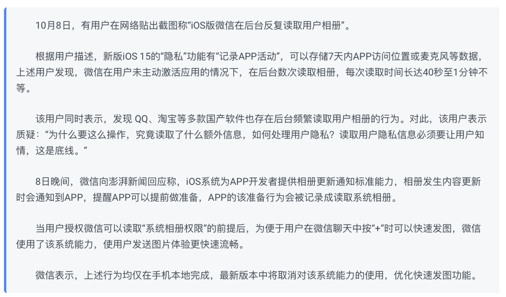
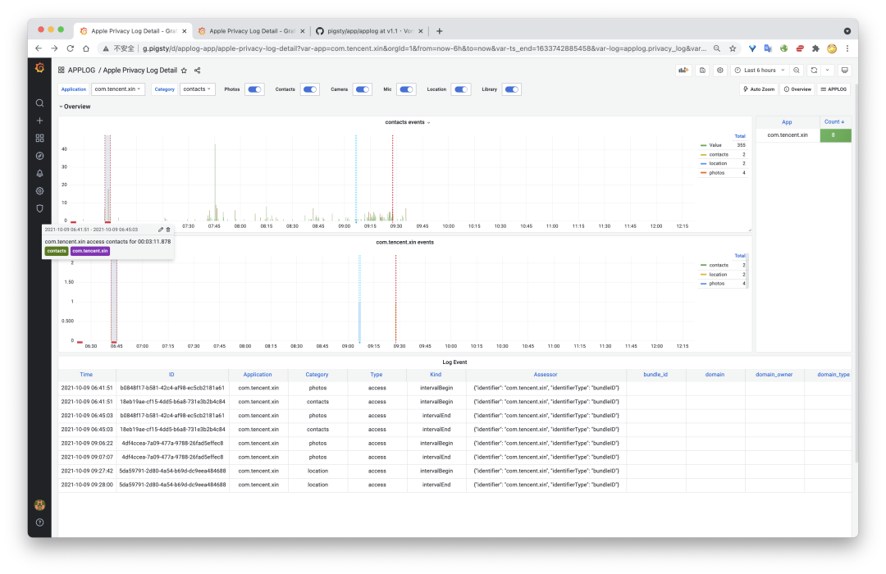
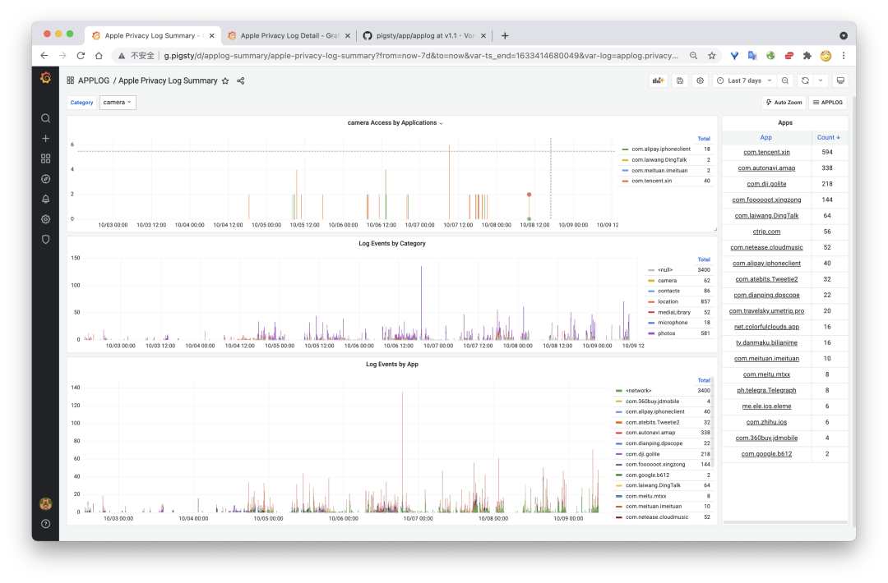
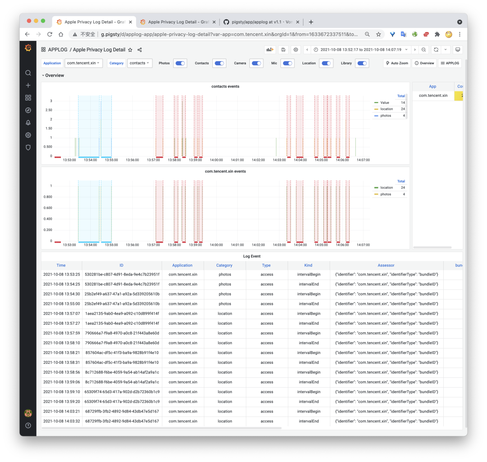
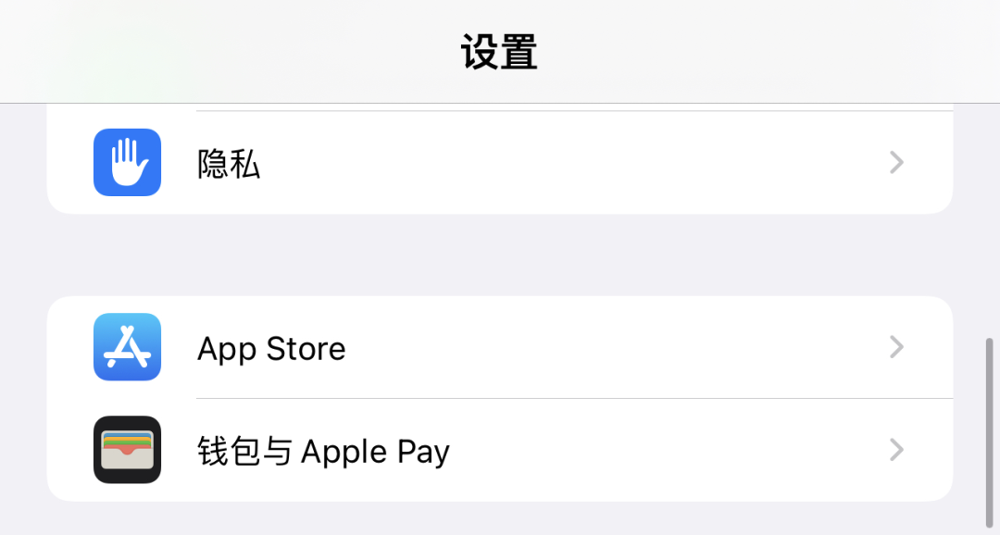
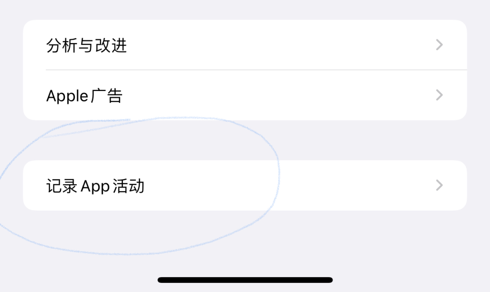
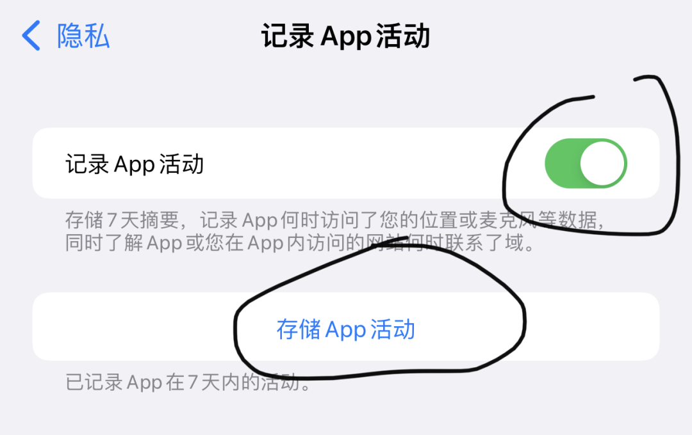

> [Original WeChat Official Account Article](https://mp.weixin.qq.com/s/x0zHL7e2nTpf_UTUHxqLJg)


Last night, I saw news about WeChat accessing user photo albums in the background, and WeChat responded:



While such shady behavior from Chinese apps doesn't surprise me, in the spirit of seeking truth, I got up this morning to investigate whether WeChat is actually doing something malicious. I discovered that WeChat's hands are indeed dirty, and their response explanation is complete nonsense. For example, this morning at 6:40 AM, while I was sound asleep, WeChat secretly accessed my photo album. Could this also be triggered by "tap + quick image sending"? As someone who regularly gets up at eight or nine o'clock, it's impossible for me to touch my phone at six AM. **So this is WeChat's autonomous behavior, and such behavior clearly occurred without my consent.**

```
{"accessor":{"identifier":"com.tencent.xin","identifierType":"bundleID"},"category":"photos","identifier":"B0848F17-B581-42C4-AF98-EC5CB2181A61","kind":"intervalBegin","timeStamp":"2021-10-09T06:41:51.896+08:00","type":"access"}
{"accessor":{"identifier":"com.tencent.xin","identifierType":"bundleID"},"category":"photos","identifier":"B0848F17-B581-42C4-AF98-EC5CB2181A61","kind":"intervalEnd","timeStamp":"2021-10-09T06:45:03.813+08:00","type":"access"}
```

The original log shows: **`com.tencent.xin` (WeChat) `accessed` `photos` (photo album) from `6:41` to `6:45`, lasting 4 minutes.**

A machine can do quite a lot in four minutes. For example, going through your entire photo album completely. While uploading all images is unlikely, computing local feature keywords, extracting EXIF information, identifying where you've been and what interests you—that's more than sufficient.

This morning I also quickly created a privacy log analysis application that can visualize Apple's privacy logs. I don't hesitate to share my raw privacy logs from the past 7 days.



Code repository: https://github.com/Vonng/pigsty/tree/v1.1/app/applog

Demo program: http://demo.pigsty.cc/d/applog-summary 

Data security and privacy are the best tools for regulating internet companies. Shooting them all might wrongly punish some, but shooting every other one would definitely let some escape. With this new feature, dishonest apps on iOS are probably in for some tough times.


## How to View Your Own Privacy Records

I upgraded to iOS 15 before National Day and immediately enabled the "Record App Activity" feature. I remember Xiaomi launched a similar feature a year or two ago called "Privacy Flare." So it's gratifying that Apple has such a welcome feature.

However, Xiaomi's version could directly display which apps accessed what permissions when locally, while Apple just dumps raw access logs to users. For professional users, this is indeed the best approach. But raw logs are still painful to read, so I created a small application specifically for displaying app privacy logs. This is a Pigsty application (Pigsty is a batteries-included database distribution: https://pigsty.cc), essentially PostgreSQL database tables + Grafana visualization panels. Programmers with some experience can easily run it locally.



> Figure 1: Summary interface showing past 7 days' privacy access logs, pivoted by application and privacy items.



> Figure 2: Detail interface showing individual app privacy access details, using annotations to mark continuous privacy access.

Of course, most importantly, how do you obtain your privacy data? First, you must upgrade to iOS 15 to have this functionality.





Then, open iPhone Settings, go to "Privacy," scroll to the bottom and enter "Record App Activity" page. There's a toggle "Record App Activity"—turn it on. Then your iPhone will **start** automatically recording details of app privacy access for the most recent 7 days.



> Storing App Activity will generate log files.

Access records cannot be directly viewed. On this page, clicking "Save App Activity" can export and save recorded app privacy activities. This is a `.ndjson` file where each line is a JSON data entry. The `accessor` field is the app name—for example, `com.tencent.xin` is WeChat. `category` is the privacy item category—for example, `photos`, `contacts`, `camera`, `microphone`, `location`, `mediaLibrary` are photos, contacts, camera, microphone, location, and media library respectively.

Parsing such logs is also simple—you don't even need Python, just SQL:

```sql
CREATE SCHEMA IF NOT EXISTS applog;
CREATE TABLE applog.t_privacy_log(data JSONB);
COPY t_privacy_log FROM '/tmp/App_Privacy_Report_v4_2021-10-09T09_35_45.ndjson';
CREATE MATERIALIZED VIEW applog.privacy_log AS
SELECT (data ->> 'timeStamp')::TIMESTAMPTZ      AS ts,
       ((data ->> 'identifier'))::UUID          AS id,
       data ->> 'type'                          AS type,
       data ->> 'kind'                          AS kind,
       data #>> '{accessor,identifier}'         AS app,
       data ->> 'category'                      AS category,
       data ->> 'accessor'                      AS accessor,
       data ->> 'bundleID'                      AS bundle_id,
       data ->> 'domain'                        AS domain,
       data ->> 'domainOwner'                   AS domain_owner,
       data ->> 'context'                       AS context,
       data ->> 'domainType'                    AS domain_type,
       (data ->> 'firstTimeStamp')::TIMESTAMPTZ AS first_ts,
       data ->> 'initiatedType'                 AS initiated_type,
       data ->> 'hits'                          AS hits
FROM applog.t_privacy_log ORDER BY 1;
REFRESH MATERIALIZED VIEW applog.privacy_log;
```

If you're an experienced user, such logs certainly won't stump you. For ordinary people, having an interface to view them is preferable, like a Grafana Dashboard.

Particularly, app starting and ending photo album access are two separate events. Direct log viewing is quite unintuitive, but visualization makes it much better—which app accessed which permissions for how long during which time periods.

Then you can carefully examine whether any apps are secretly doing unspeakable things behind your back.