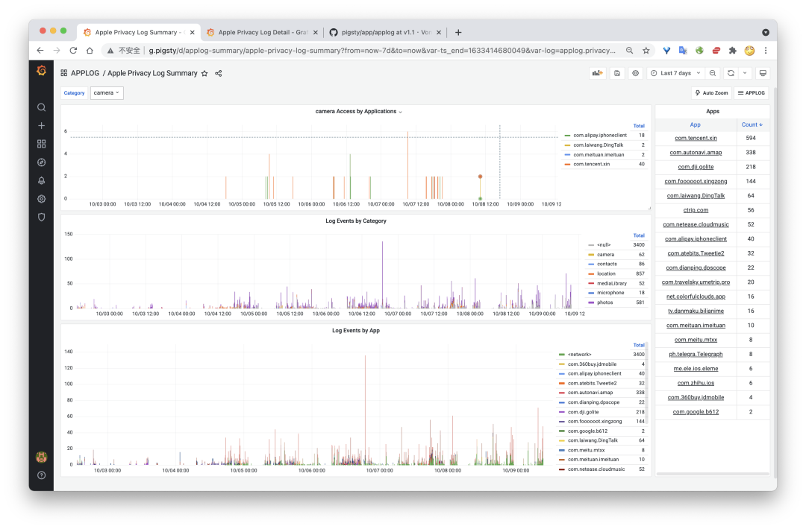
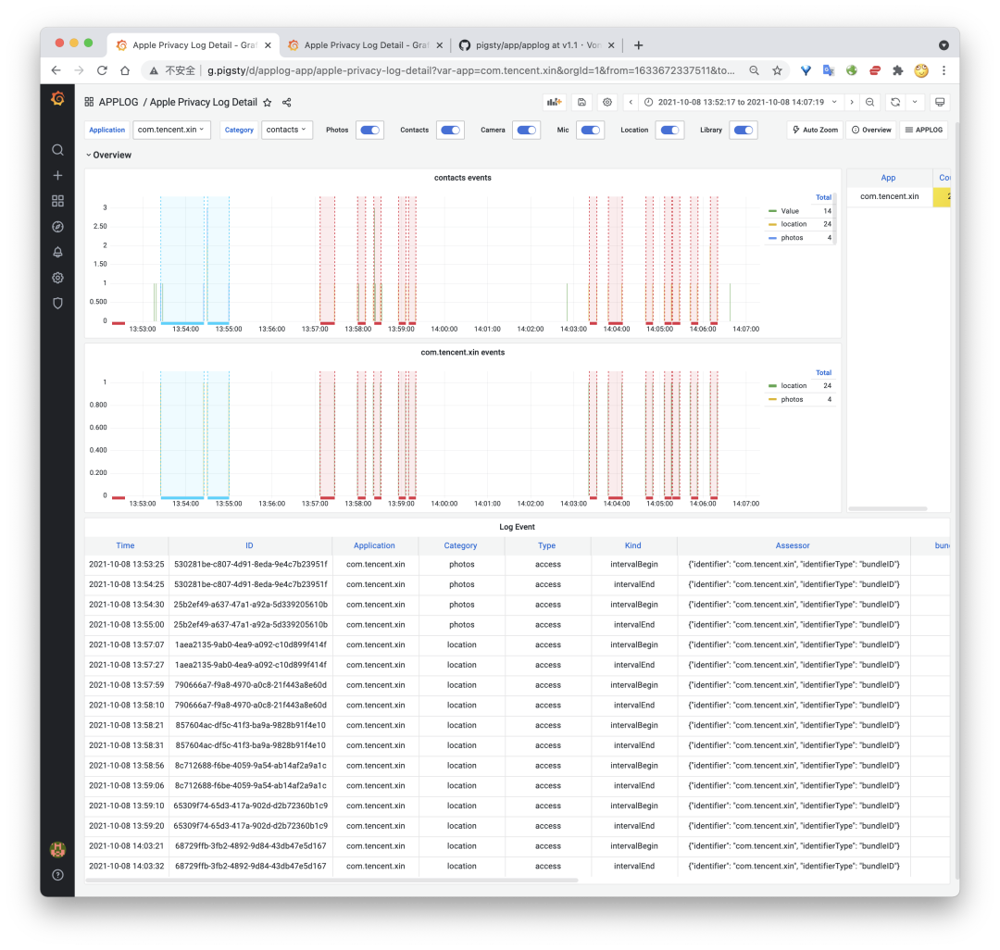
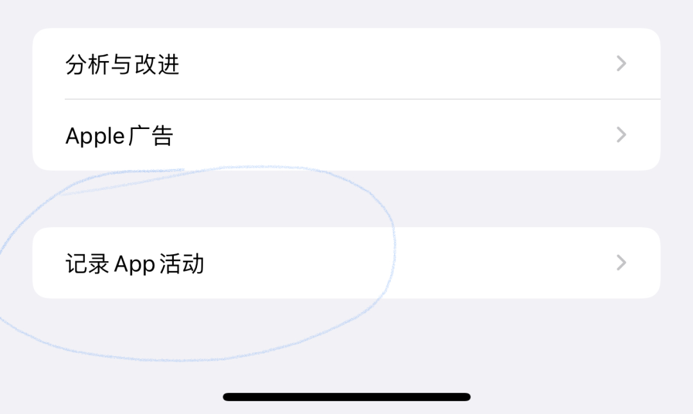

> [微信公众号原文](https://mp.weixin.qq.com/s/x0zHL7e2nTpf_UTUHxqLJg)


昨天晚上，看到一个新闻说微信在后台读用户相册，然后微信还回复了


虽然国产软件干这种龌龊事情并不让我惊奇，但本着求真务实的精神，早上起来我也准备看看，微信是不是真干坏事了。结果发现，微信果然屁股不干净，而且这个回复解释也是在放屁。比如，今天早上6点40分，我还在呼呼大睡的时候，微信就偷偷读取了我的相册，难道说这也是“按+快速发图”触发的吗？作为经常性八九点起床的人，六点是根本不可能去碰手机的，**所以这是微信App的自主行为，而这种行为显然没有经过我的同意。**

```
{"accessor":{"identifier":"com.tencent.xin","identifierType":"bundleID"},"category":"photos","identifier":"B0848F17-B581-42C4-AF98-EC5CB2181A61","kind":"intervalBegin","timeStamp":"2021-10-09T06:41:51.896+08:00","type":"access"}
{"accessor":{"identifier":"com.tencent.xin","identifierType":"bundleID"},"category":"photos","identifier":"B0848F17-B581-42C4-AF98-EC5CB2181A61","kind":"intervalEnd","timeStamp":"2021-10-09T06:45:03.813+08:00","type":"access"}
```

原始日志：**表示`com.tencent.xin`（也就是微信），在`6:41` 到`6:45` 期间，`access（`访问）了 `photos`（相册），长达4分钟。**

机器四分钟能干的事可是相当不少，比如，把你的相册完整过一遍，全部回传图片是不太可能，但在本地计算发现一些特征关键词，拉取EXIF信息，去过哪里，对什么东西感兴趣，那还是绰绰有余的。

早上我还随手做了个隐私日志分析的小应用，可以把Apple的隐私日志给可视化出来。我也不惮于把自己过去7天的隐私原始日志给出来


代码地址：https://github.com/Vonng/pigsty/tree/v1.1/app/applog

演示程序：http://demo.pigsty.cc/d/applog-summary 

数据安全与隐私是收拾互联网公司的最佳抓手，全拉出去枪毙可能有冤枉的，但是隔一个枪毙一个肯定有漏网的。这个新功能一出，估计iOS上不老实的应用要有一波难过的日子了。


## 如何查看你自己的隐私记录

十一前我就升级了iOS 15，并立刻打开了“记录App活动”功能。我记得一两年前小米推出过类似的功能，叫“隐私照明弹”。所以苹果能有这样喜闻乐见的Feature是很让人开心的。

不过小米那种可以直接在本地显示哪些应用在什么时候访问了什么权限，而苹果只是把原始访问日志丢给用户。对于专业用户来说，这确实是最好的。不过原始日志看起来还是很难受，所以我做了个小应用，专门用来展示应用隐私日志。这是一个Pigsty应用（Pigsty是一个开箱即用的数据库发行版：https://pigsty.cc ），实际上就是PostgreSQL数据表 + Grafana可视化面板。稍有经验的程序员都可以很轻松地在本地跑起来。



> 图1: 摘要界面，展示过去7天隐私访问日志，按照应用和隐私项来透视。



> 图2: 详情界面，单个应用访问隐私的详情，使用Annotation来标注持续性隐私访问

当然，最重要的还是如何获取你的隐私数据？首先，你必须升级到iOS15才有这一功能。




然后，打开iPhone设置页面，进入“隐私”，拉到最下方进入“记录App活动”页，有一个开关“记录App活动”，打开即可。然后你的iPhone就会**开始**自动记录最近7天应用访问隐私的详情。


> 存储App活动会生成日志文件。

访问记录并不能直接查阅，在该页面中点击 “存储App活动” 可以导出并保存记录的应用隐私活动。这是一个`.ndjson`文件，每行是一条JSON数据。`accessor`字段是应用名称，例如`com.tencent.xin`就是微信。`category`是隐私项的类别，例如`photos`，`contacts`, `camera`, `microphone`,`location`, `mediaLibrary`分别是照片，通讯录，相机，麦克风，位置，媒体库。

解析这样的日志也很简单，连Python都用不上，只需要使用SQL即可。

```sql
CREATE SCHEMA IF NOT EXISTS applog;
CREATE TABLE applog.t_privacy_log(data JSONB);
COPY t_privacy_log FROM '/tmp/App_Privacy_Report_v4_2021-10-09T09_35_45.ndjson';
CREATE MATERIALIZED VIEW applog.privacy_log AS
SELECT (data ->> 'timeStamp')::TIMESTAMPTZ      AS ts,
       ((data ->> 'identifier'))::UUID          AS id,
       data ->> 'type'                          AS type,
       data ->> 'kind'                          AS kind,
       data #>> '{accessor,identifier}'         AS app,
       data ->> 'category'                      AS category,
       data ->> 'accessor'                      AS accessor,
       data ->> 'bundleID'                      AS bundle_id,
       data ->> 'domain'                        AS domain,
       data ->> 'domainOwner'                   AS domain_owner,
       data ->> 'context'                       AS context,
       data ->> 'domainType'                    AS domain_type,
       (data ->> 'firstTimeStamp')::TIMESTAMPTZ AS first_ts,
       data ->> 'initiatedType'                 AS initiated_type,
       data ->> 'hits'                          AS hits
FROM applog.t_privacy_log ORDER BY 1;
REFRESH MATERIALIZED VIEW applog.privacy_log;
```

如果你是老司机，看这样的日志当然难不倒你。对于普通人还是更希望能有一个Interface来看，例如Grafana Dashboard。

特别是，应用开始访问相册和结束是两个事件，如果直接看日志还是很不直观的，但如果画出来就好多了。哪个应用在哪个时间段访问了多久的哪种权限。

然后，你就可以仔细看看，到底有没有应用在你背后偷偷干见不得人的事情了。
