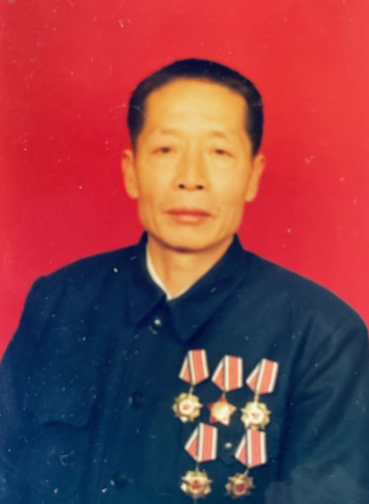
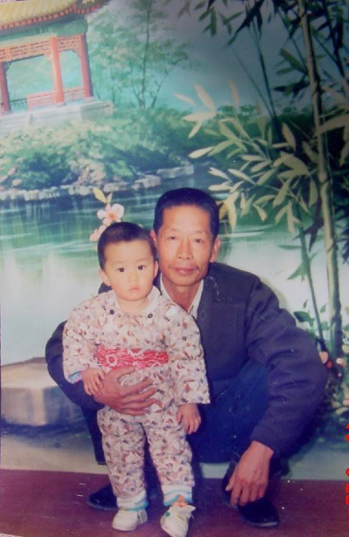

Although 2020 was a year of many disasters, until grandfather's death, I always thought we could somehow get by.

The death of a close relative—this is the second time for me. First my father, then my grandfather. Humans appear so powerless before death. All I can do is record this moment. Perhaps the deceased can live on in another form in the living's memory, offering some comfort.

My hometown is located in the desolate northwestern desert Gobi, situated by the Ruoshui River at Base 20—Jiuquan Satellite Launch Center. Locals prefer calling it Dongfeng. This is a small town of about ten thousand people, composed of military personnel and their families. Living in the same building are decades-long colleagues and comrades-in-arms. People cycling to work on the streets all wear one or two stripes. Good customs and fine traditions prevail—no one picks up lost items, doors remain unlocked at night. People from all over China speak Mandarin with slight regional accents. Everyone knows each other; neighbors live in harmony. We built our own reservoirs, farms, tools, launched satellites, and had our own local networks and private game servers—self-sufficient and content. Rising and working to bugle calls, everything orderly.

From the moment my grandfather graduated from a Shanghai machinery factory and was assigned to this base, my family took root here. My mother and aunt were both born in this small city, attending school from elementary through high school. I also spent the first twelve years of my life here. For over forty years, grandfather worked at the base transport maintenance station. The apprentices and soldiers he trained came and went in batches, but he remained a squad leader for decades. Level-8 fitter, assistant engineer, level-6 sergeant major, with five third-class merits and several scientific and technological progress awards. As a child, I didn't understand much, only that it seemed very impressive. Regardless, at least we never needed to buy furniture—whether appliances or furniture, large trucks or blast-proof doors, or special equipment for missile launch platforms, there was nothing grandfather couldn't repair.

Among all the people I've met, grandfather had an excellent reputation. It's said he never quarreled with anyone in his entire life. Highly respected, helpful, noble in character, never did anything against his conscience. Every time grandfather cleaned, he would sweep from home to the hallway, then clean the courtyard and streets—every day, seeking no reward, continuing even after retirement back to his hometown. When the unit evaluated model workers, he declined; when evaluating merits, he also declined. But the more he declined honors, the more they accumulated. When third-class merits that others fought over were given to grandfather, no one disagreed. He always faced everything with a serious, optimistic, positive attitude—broad-minded and tolerant. From him, I saw that truth, goodness, and beauty exist in this world, that faith has power. This power can make a person burst forth with such resilient and enduring life's flame.

Among all relatives, grandfather spent the most time with me. He cooked three meals daily, so I'd eat breakfast at grandfather's house before school, return for lunch during break, and go to grandfather's for dinner after school. Grandfather would bike me to school mornings and noons, and we'd walk together after dinner. Therefore, I often didn't want to return to my own home, simply staying at grandfather's. When father wanted to discipline me, I'd hide behind grandfather; when grandfather wanted to spank me, I could only obediently take the punishment. Looking back, childhood's happy moments always included grandfather's shadow.

When I was in fourth grade, grandfather finally retired. With his qualifications, he could go anywhere in the country. Especially since grandfather had grown up, lived, and studied in Shanghai in his youth—returning there would have been natural. But he still chose to return to his roots, going back to his hometown Hengxi Town to be a happy "country dweller." Thus my parents' generation also returned to Ningbo with grandfather. My six middle school years and four university years' winter and summer breaks were spent in the countryside with grandfather.

Grandfather's retirement life was quite pleasant. Every day he'd hike in the mountains by the town. I accompanied grandfather, witnessing this small path transform from dirt road to cobblestone road, then to asphalt road, finally becoming a tourist attraction with mountain trails and windmill roads. Daily, grandfather would walk to the second pavilion, where there was a small waterfall where you could collect sweet mountain spring water. Grandfather liked walking mornings and evenings, taking the dog for walks, then chatting with old mountain-climbing friends there. Then he'd return home to cook lunch or watch prime-time TV dramas. Sometimes grandfather would go to the senior activity center to play ping-pong, walk on the reservoir dam top, or have big adventures—crawling through bamboo forests and wild mountains to pick tiger beans for me to play with. Much of my adolescence was spent in such rural life.

After university graduation, there were no more winter and summer breaks. I went to work in Beijing, rarely able to return home. Every time I came home, grandfather would tell me: "Don't stay outside anymore, come back to Ningbo quickly. Even earning just a few thousand in Ningbo is much better than wandering outside!" Or: "Why haven't you found a girlfriend yet? Grandfather's little car can't be given away!" Every time I returned home, grandfather was very happy, but I always felt a bit sad because each return, grandfather's white hair and facial wrinkles seemed to have increased considerably. Time spares no one—grandfather was aging. Grandfather himself was quite philosophical about it, always saying he'd lived enough, each extra day was profit, seemingly without regrets.

But no matter how philosophical grandfather was, it couldn't erase the worry in my heart. Just thinking about grandfather possibly leaving me would make me burst into tears. When driving long distances or when my eyes were dry from screens, I would irreverently think of this specifically to shed tears and moisten my eyes. But then again, though grandfather was over eighty with various minor ailments, his health had always been decent—he could still walk several kilometers of mountain paths daily. I thought this might still be far off? Until 2020...

2020 was an ominous year—neither family, nation, nor world were at peace. Several family elders passed away successively, and several of grandfather's old comrades also departed. Early in the year, grandfather developed intestinal obstruction and had surgery, removing a two-pound tumor. Grandfather's body suddenly became much weaker—he could no longer climb mountains, going up and down stairs became very difficult, he could only eat easily digestible foods, and his coughing was heartbreaking to hear. Grandfather told us he wouldn't live through the year, hoping most to fall asleep peacefully and depart serenely. At such times, besides saying conventional things like "no, you'll live to a hundred," we could only remain silent...

But until five days ago, when mother suddenly told me grandfather was critically ill, even with mental preparation, my mind felt struck by lightning, stirring up the deepest fears in my heart. I booked the earliest flight and rushed to the airport, fearing I'd miss this last chance to see grandfather. Six hours door-to-door to reach the hospital room, the doctor briefed us on the condition—what started as a minor cold had suddenly developed into systemic edema and multiple organ failure, with at most one to three days remaining. Mother and aunt told me to act like I was just passing through on a business trip to visit, so grandfather wouldn't know his condition was terminal. Several close relatives were already at the door visiting. Though everyone acted optimistic, such a gathering would let even the most oblivious grandfather know the real situation—it was just self-deception.

Usually grandfather was skin and bones, his face and hands covered in wrinkles. But grandfather in the hospital bed looked ruddy-faced with smooth hands and feet. I knew this was edema—father's last day before death was the same, appearing like a final surge but actually indicating complete depletion. Grandfather was mentally clear but could only laboriously utter a few words occasionally, even moving his hand required great effort. Stomach tube, urinary catheter, oxygen tube, IV tubes, electrodes covered grandfather like a spider web. IV bottles one after another, but only going in without coming out—kidney failure preventing urination. I asked the doctor why not do dialysis. I was told grandfather's blood vessels were too fragile—even needle insertion caused large bruises. Dialysis requires anticoagulants, easily causing massive bleeding. The doctor said if he could urinate, there might be hope; otherwise, the swelling would only worsen.

That night, we spent in anxiety. Grandfather survived the day, but conditions worsened further, many indicators beginning to deteriorate. His abdomen became rock-hard from swelling, even breathing became difficult. Resting heart rate jumped from 80 to 120, while blood oxygen hovered between 70-90. I knew how lung failure patients looked at their end: heart rate rising while blood oxygen constantly dropping because lungs could no longer function normally. For an 82-year-old, maximum heart rate would be around 140—120 was like constantly running. When the doctor made rounds in the morning, I asked the director about ECMO to reduce cardiopulmonary pressure. Though the hospital lacked ECMO, the director's attitude changed after hearing this. He told us: "Though our ICU feels unable to handle this, I can contact Ningbo's best intensive care physician for consultation—earliest would be afternoon."

From morning to afternoon, waiting for the expert felt so long. Grandfather's eyes began losing focus, often wanting to pull off his oxygen mask, requiring aunt/mother and me to take turns holding his hands tightly. I don't know what kind of pain would make someone abandon hope for survival. But with even a thread of hope, we were willing to try. Finally waiting until 3 PM for the reinforcement intensive care expert. The hospital-wide consultation had doctors from various departments discussing intensely. The expert felt the cardiopulmonary and kidney failure was mainly due to abdominal blood clot compression—if surgery could remove the blood clots and reduce abdominal pressure, there was still hope. But surgery was extremely difficult, vessels extremely fragile with poor coagulation, easily causing fatal bleeding on the operating table. No surgeon dared attempt it lightly.

Without surgery, there was only one to two days left, slowly departing in despair and torment. With surgery, there was a thread of hope. Even if surgery failed, due to anesthesia effects, grandfather's consciousness would be fixed at the moment before surgery, departing with hope, no longer suffering—essentially true euthanasia, fulfilling grandfather's wish. Surgery was expensive with poor prognosis, very likely dying directly on the operating table, but we still chose surgery. The final decision maker was the surgeon Dr. Li, who said: "If this were my father, I would definitely choose to let him have the surgery." I was deeply moved. After deciding on surgery, over a dozen doctors began preparing without even eating dinner.

We all hoped for a miracle. Surgery lasted over three hours—truly agonizing. Doctors removed a basin of blood clots. Surgery was indeed successful, but the truly difficult part was just beginning. Coming off the operating table, still unconscious, directly into ICU. Lab results were blood red—not a single indicator was normal. On one hand, I wanted grandfather to wake up with indicators returning to normal; on the other hand, I hoped he could continue sleeping, not wake up to endure this suffering.

During two days in ICU, all indicators began deteriorating. The ICU attending physician bluntly said if we didn't take him home, he wouldn't survive today.

According to local custom, one should pass away at home. So we arranged an ambulance. The ambulance, siren wailing, raced from hospital to the countryside home.

All cars along the way made way. In less than 20 minutes, we brought grandfather all the way home. Looking at grandfather's face, tears filled my eyes.

I had moved grandfather's bed downstairs to the living room. Beside grandfather's bed, I played his favorite song—"Honghu Lake Waves." Watching grandfather's lips slightly moving, watching a loved one gradually depleting, approaching life's end—it's an extremely heartbreaking thing.

Body fluids and blood began continuously seeping from grandfather's needle holes and small wounds. I constantly wiped with tissues and applied band-aids to stop bleeding. But grandfather's coagulation function was extremely weak—nothing could stop it.

My heart is too sore to continue writing.

November 28, 4:40 PM, grandfather stopped breathing. Farewell, chanting sutras.

10.29 Wake, laying in state

11.30 Cremation, burial, chanting sutras, transcendence ceremony