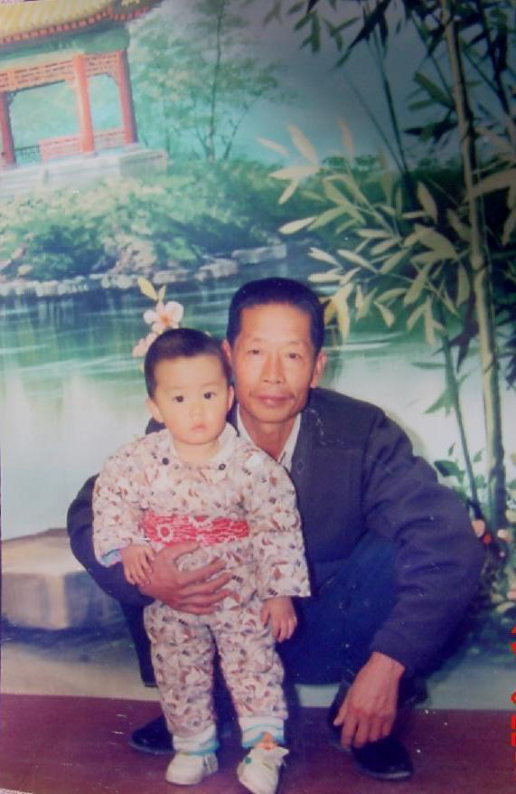

尽管2020年是一个多灾之年，但在外公去世前，我一直还以为是能得过且过的。

至亲去世，于我已是第二次。先是父亲，然后是外公。人在生死面前显得如此无力，我能做的也就是记录下这一片刻。这样逝者也许能以另一种形式活在生者的记忆中，聊以告慰。

我的故乡位于荒无人烟的西北大漠戈壁，坐落于弱水河畔的20基地——酒泉卫星发射中心。本地人更喜欢叫它东风，这是一座只有万把人口的小镇，由军人与军属组成。住在一栋楼里的，是几十年的老同事老战友，在街上骑车上班的人，都挂着一两道杠杠。良风美俗，路不拾遗，夜不闭户；来自五湖四海的人们，各自讲着略带乡音的普通话；彼此熟稔，邻里和睦；我们自己修水库、建农场、造工具、放卫星、也有自己的局域网和网游私服，自给自足，自得其乐。在军号声中起息工作，秩序井然。

从我外公在上海机修厂毕业分配到这个基地的那一刻起，我的家庭就扎根于此。我的母亲，我的姨，都在这个小城里出生，从小学到高中。我也在这里度过了人生的第一个十二年。四十多年，外公来一直在基地运修站工作。他带出的学徒与士兵走了一批又一批，他却一直干了几十年的老班长。八级钳工，助理工程师，六级军士长，有五次三等功和几次科技进步奖。小时候我也不懂，只是大概知道很厉害的样子。不管如何，起码家具是不用买的：无论是电器还是家具，大卡车还是防爆门，或者是导弹发射架特种装备，没有外公不能修的。

在所有我见过的人中，外公都有着极好的口碑。据说他这一辈子从来没有跟别人吵过架。德高望重，乐于助人，高风亮节，一辈子也没做过亏心事。外公每次打扫卫生，都会从家里扫到楼道，再把大院和街道都清理了，每天都是，不求任何回报，一直到退休回到老家依然如此。单位评劳模他让，评功他也让，但功勋越让越多，但别人争破头的三等功发给外公却没有人会有异议。他总是严肃乐观积极的心态去面对一切，豁达而宽容。从他身上，我看到了这个世界上存在着真善美，存在着信仰的力量。这种力量可以让一个人迸发出如此坚韧而持久的生命火光。

在所有的亲人中，外公陪伴我的时间是最长的。每天的三餐都是外公做饭，所以早上上学前到外公家吃饭，中午午休回外公家吃饭，晚上放学也去外公家吃饭。早上中午外公骑车送我，晚饭后和外公一起散步。因而大多时候我都不想回自己家中，干脆直接在外公家住下。爸爸要教训我的时候，我就躲在外公身后；外公要打我屁股的时候，我就只能乖乖挨揍。回想起来，童年的幸福的片段总是少不了外公的影子。

我读四年级时，外公终于退休了。以外公的资历自是全国哪里都可以去得，特别是年少时外公在上海成长生活求学，回去也是再自然不过。但他还是选择了叶落归根，回到自己的家乡横溪镇，做一个开心的“乡窝宁”。因而我的父母辈也随着外公回到了宁波。我中学六年和大学四年的寒暑假，也就在乡间和外公一起渡过了。

外公的退休生活很是惬意，每天都会到镇边的山里去徒步。我也陪着外公，见证着这条小径从土路变成鹅卵石路，再到柏油路，最后变成旅游景点，登山步道和风车公路。每天，外公都会走到第二凉亭，那里有一个小瀑布，可以接到甘洌的山泉。外公喜欢在早上和傍晚散步，溜一遛狗，然后到这里和登山的老朋友们一起聊一会天。然后再回家做午饭，或者回去看看黄金档电视剧。有时候，外公也会去老年活动室打打乒乓球，去水库大坝顶上散散步，或者来个大冒险，钻竹林爬野山摘点老虎豆给我玩。我的青少年时光，很多一部分就在这样的乡野生活中度过。

大学毕业以后，再也没有了寒暑假。我到了北京工作，也难得能回一趟家。每一次回家，外公会都跟我说，别在外面啦，快回宁波来吧，在宁波即便挣个几千块，也比在外面颠沛流离要好的多呀？又或者是怎么还不找对象呢？外公的小汽车送不出去了呢。每一次我回家，外公都会非常高兴，但我却总是有点难过，因为每次回来，外公头上的白发，脸上的皱纹又像是增了许多。岁月不饶人，外公老了。外公自己倒是想的很开，他总是说自己已经活够了，多活一天赚一天，好像也没有什么遗憾的了。

但是外公自己再想的开，也难以抹去我心底的忧愁。光是想到外公可能会离开我这件事情就会让我泪流满面，以至于长途开车或者看屏幕眼睛干涩时，我会大不敬地特意想起这件事来流点泪润润眼。但话说回来，外公虽然八十多岁了，各种小毛病不少，但身体一直还不错，每天还能走几公里山路。这种事我觉得也许还早得很呢？直到2020年…

2020年是个凶年，家国天下都不太平。家族中的好几位长辈都先后去世了，外公的老战友也走了几位。年初，外公出现了肠梗阻开了刀，切下一个两斤的瘤子来。外公的身体一下虚了很多，再也不能去爬山了，上下楼变得十分吃力，只能吃没什么消化压力的食物，咳嗽声闻之让人心酸。外公跟我们说，自己活不过今年了，最希望的就是能一觉睡去，安详的离去。这种时候，除了说几句不会不会长命百岁的样子话，也只能默然以对…

但直到五天前，妈妈突然告诉我外公病危时，即使有了心理准备，脑海仍如五雷轰顶一般，心底最深的恐惧被搅动起来。我定了最早的机票奔向机场，生怕错过这最后一次见到外公的机会。六个小时门对门赶到病房，医生约谈介绍病情，本来入院时还是小感冒，现在突然就发展到全身水肿和多器官衰竭，最多还有一到三天晨光。妈妈和姨让我在外公面前表现的好像是出差顺路回来探望一样，以免外公知道自己已经病入膏肓。门口已经有几位近亲来探视了，虽然大家都表现的好像很乐观，但这样的阵仗，即使外公再迟钝也该知道真实的情况了，不过是自欺欺人罢了。

平时的外公骨瘦如柴，脸上手上全是皱纹。可病床上的外公看上去倒是脸庞红润，手脚光滑。我知道这是水肿，父亲去世前的最后一天也是这样的，看上去好像是回光返照，实际上已经是油尽灯枯了。外公的神志很清醒，但只能很吃力地间或说出几个字来，动一动手都非常费力。胃管、尿管、氧气管、输液管、电极就像蛛网一样覆盖在外公身上。点滴一瓶接一瓶，却只进不出，肾功能衰竭排不出尿来。我问医生为什么不做透析呢？被告知老人家的血管太脆弱了，甚至扎针都能出现大片淤血。透析要打抗凝剂，很容易就会大出血。医生说如果能解出尿来，还有一线希望，不然只会肿的越来越厉害。

是夜，我们在忐忑中度过。外公熬过了这一天，但情况愈发糟糕了，很多指标开始恶化。腹部因为肿胀变的硬邦邦的，甚至呼吸也变得困难起来。静息心率从80跳到了120，而血氧在70-90来回徘徊。我知道肺衰竭患者临终时的样子：心率开始升高，但血氧却不断下降，因为肺已经没法正常工作了。对于82岁的人来说，最大心率也就是140左右，120就相当于一直在跑步了。早上医生来查房，我问主任能不能上ECMO，减少心肺压力。虽然医院里没有ECMO，但主任听到后态度出现了变化。他跟我们说：“虽然我们的ICU觉得搞不定，但我可以帮你联系宁波最好的重症医师来会诊，最快要下午了”。

从早上到下午，等待专家的时间是如此漫长。外公的眼神开始迷离，经常会想去扯掉自己的氧气面罩，以至于我和姨/妈都要时刻轮流握紧外公的手。我不知道是怎样的痛苦才会让人放弃生存的希望。但只要有一丝希望，我们都愿意去尝试。盼星星盼月亮，终于在下午三点等来了外援的重症专家。全院会诊上各科医生们讨论的都很激烈，专家觉得心肺肾功能衰竭主要是腹部淤血块压迫所致，如果能开刀取出淤血减轻腹部压力，还是有希望的。但手术难度极高，血管极脆且凝血极差，很容易就会大出血死在手术台上，没有外科医生敢轻易做。

不做手术只有一到两天时间，在绝望和折磨中慢慢离去。而做手术有一丝希望，即使手术失败，因为麻醉的效果，外公的意识会定格在手术前的那一刻，带着希望睡去，不再痛苦，也算是真正的安乐死，遂了外公的心愿。手术花费不菲，预期也很差，极有可能直接死在手术台上，但我们还是愿意做手术，最终拍板的是主刀的李医生，他说：“如果是我的父亲，我一定会选择让他做的”。我是非常感动的，决定手术之后，十几位医生晚饭也顾不得吃遍开始准备手术了。

我们都盼望着奇迹出现，手术进行了三个多小时，确实是让人煎熬。医生取出了一盆淤血块，手术确实是成功了，但真正困难的事情才刚刚开始。从手术台出来，仍然处于昏迷状态，直接进了ICU。化验结果单上一片血红，没有一项指标是正常的。一方面我多想要外公能醒来，指标能恢复正常，另一方面，我又希望他能睡下去，不要再醒来忍受这痛苦。

在ICU的两天里，各项指标开始恶化。ICU主治医师直言不讳说如果不接回去，今天是撑不过去的了。

按当地风俗，应当在家中咽气。于是我们联系了救护车，救护车拉起笛声，从医院飞驰到乡下家里。

一路上的车都让开了道路，用了不到20分钟，将外公一路接回家中。看着外公的脸庞，泪水已经噙满双眼。

我已经把外公的床搬下了楼，放在在客厅里。在外公床边，我放起了他最爱的歌曲 ——《洪湖水浪打浪》。看着外公的嘴唇一点点的翕动，至亲一点一点油尽灯枯，走向生命的尽头，真是一件心酸至极的事情。

体液和血开始从外公身上针眼，小伤口中不断渗出。我不断地用纸巾拭去，创可贴止血。但外公的凝血功能已经极度衰弱，怎样也止不住。

心太酸了，没法再写下去了

11月28号下午4点40，外公停止了呼吸，告别，念经。

10.29 守灵，大殓

11.30 火化，下葬，念经，超度

