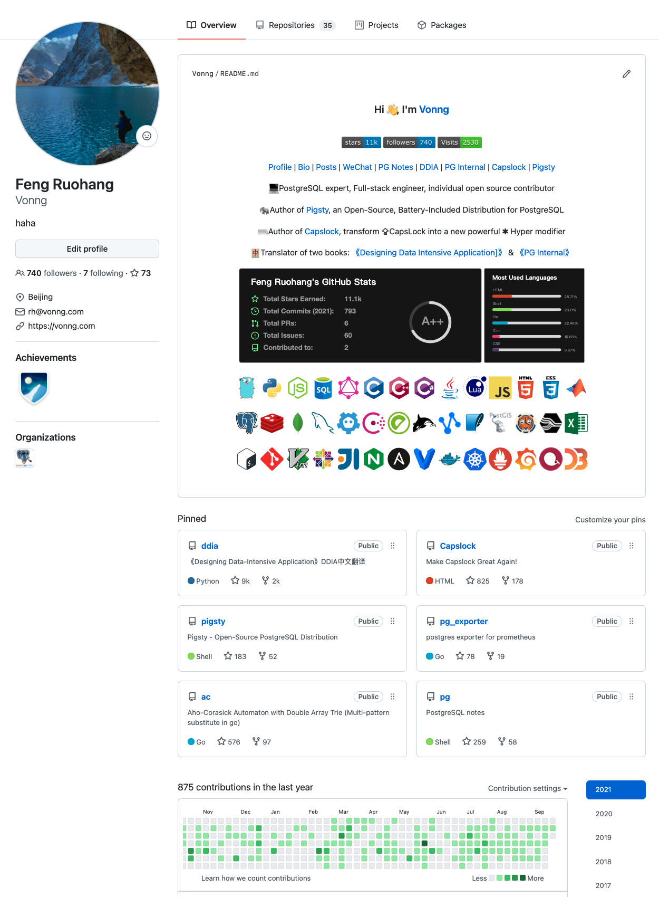

# Life at 28

Another Mid-Autumn Festival, another year older.

My solar birthday (September 21st) coinciding with Mid-Autumn Festival should only happen three times in my lifetime: once at age 9 in 2002, once at age 28 in 2021, and the last time at age 66 in 2059, assuming I live to see that day. Theoretically, this should be a memorable special day, but I can't feel happy no matter what. Too much has happened this year, leaving my nerves numb.

Age 28 began with a journey: after the pandemic had briefly subsided during National Day, I participated in the Wusun Ancient Trail trek. During the trip, I met many new friends and spent an unforgettable, happy journey together. More importantly, I met a kindred spirit and established a common goal: [Paradise Found: Wusun Ancient Trail](/trip/20201001-wusun/).

Unfortunately, happiness and joy in life are always fleeting. Just one month later, I received devastating news. My closest relative, grandfather, passed away, plunging my life into darkness. Everything seemed to lose meaning, and endless despair enveloped me. [Farewell to Grandfather](/misc/yaoguoxun/)

## Life in Decline

A meaningless life is terrifying—food becomes tasteless, sleep elusive, all goals and willpower lost. I struggled to escape this quagmire but only sank deeper. For the next two months, I filled every weekend with activities: skiing, ice climbing, attending PG conferences, self-driving in Yunnan, [Meili Snow Mountain New Year's trek](/trip/20201228-yubeng/), hosting Tantan's annual meeting. It looked colorful and rich, but was actually just pursuing novelty and thrills to fill inner emptiness.

One effect of emptiness was "no longer fearing death." While skiing, I rushed down the steepest slopes at maximum speed, resulting in my ski hitting my knee, puncturing three layers of clothing and leaving a half-centimeter-deep scar on my left knee. Two weeks after the knee injury hadn't healed, I stubbornly went ice climbing. Even when falling or when ice axes punctured safety ropes, instead of panic, I felt relief: "Finally, liberation." On [Yubeng Sacred Lake](/trip/20201228-yubeng/), I slid down sitting on icy, snowy mountain paths, flying off cliffs before being caught by bushes that saved my life. The last time, I crashed while being reckless on extreme snowy slopes, rolling down and tearing the ligament in my right leg.

This thrill-seeking behavior with self-destructive tendencies finally ended relatively mildly: torn ligament (1/4), splinted leg with crutches, making 2021's Spring Festival my first spent alone away from home. Actually, I could have returned home with crutches, but couldn't bear letting mother see me in such condition...

Unable to exercise normally, I became a shut-in again. After graduation, I rarely played games, but in the following months I played more games than in previous years combined: "Cyberpunk 2077," "Stellaris 3.0," "Monster Hunter: Rise," "Aion," "Genshin Impact." I even started spending money on games, spending ten or twenty thousand drawing virtual characters. Sometimes I thought myself too degenerate.

More constructive entertainment/work was coding. This year my main focus was the open-source project Pigsty—a [batteries-included PostgreSQL database distribution](https://pigsty.cc). Creating database distributions is usually done by database companies or cloud vendors' RDS teams, but I wanted to try it alone—truly boundless audacity. But building a complex software system from scratch alone feels like creation itself, as thrilling as skiing or ice climbing, much more satisfying than gaming.

Whether coding, gaming, or dangerous sports, focusing on one thing at least temporarily gave me meaning and helped forget troubles and pain. But ultimately, it was still using work and games to numb myself.

Of course, the sedentary gaming-programming lifestyle without exercise had costs: within months, my weight rapidly increased by over ten kilograms, and staying up late coding and gaming made me even balder. Physical changes led to psychological changes: more aggressive, nastier language. Previously, when seeing annoying things, I'd at most grumble internally. Now I'd actually mock or curse out loud. Seeing hypocritical behavior, I couldn't help but ridicule; when the company cut meal benefits, I directly led the criticism in group chats. Speaking without restraint naturally offended many people. But when people don't fear death, why would they fear these things?

Most terrifyingly, decline gradually became habit: even after legs healed, I no longer exercised; even with leisure time, I no longer studied or improved; planned IELTS exams were forgotten; staying up late gaming, projects were neglected. This numb state even made me forget the original cause. Until meeting my uncle two days ago and discussing grandfather, I suddenly felt as if in another lifetime, and cracks appeared in my numb heart. Looking back, what have I become? Uncle, also having recently lost family, never stopped striving—exercising daily, learning new knowledge, pursuing academic appointments and CEO positions. Compared to him, I felt ashamed, sensing my own worthlessness and depravity from the bottom of my heart.

Actually, I'd experienced this twice before. On my 18th birthday ten years ago, parents' divorce plus father's cancer left me drifting through freshman year. Four or five years ago, [father's death](/misc/fengzhenbiao/) also left me exhausted and tormented. There's no miracle cure for this—only time can heal wounds.

My 28th birthday is also the first decade anniversary of adulthood. Indeed, a good day to start anew: reclaim life, face living again.

## Review and Planning

Though this year was decadent, work went well. The most representative work is [Pigsty](https://pigsty.cc), a batteries-included open-source database distribution achieving extreme database observability—unashamed even on a global scale.

It began as software I made for myself. Gradually, it gained typical industry users and started spreading through industry word-of-mouth—a decent beginning. Given time, this might become a game-changing product. I believe in my vision, stick to my judgment, and most importantly, can personally implement and enable it.

Over the past year, through continuous refinement, Pigsty released the 1.0GA milestone. Though functionality is already comprehensive, it still lacks polish and needs further optimization. Functional improvements are essential, but two most important and urgent things remain: community building and internationalization.

Practically, this might mean: group chatting, Q&A, and writing English documentation. Next year's small goal is for Pigsty to have an active small community and some overseas users—even better if more contributors join.

Additionally, existing open-source projects and works had major updates. For example, early this year I made the third major revision to the key mapping tool [Capslock](http://capslock.vonng.com) and built an [official website](http://capslock.vonng.com), attracting many users, mainly foreigners. Occasionally receiving thank-you letters is quite fulfilling.

The Chinese translation of the classic book "[DDIA](https://ddia.vonng.com)" also had updates, especially with an enthusiastic user participating in proofreading, raising the book's quality another level. The entire project is basically community-driven, truly allowing one to feel open-source and collective wisdom's power.

Other projects also have steady star growth. GitHub ⭐️ totals exceed 11k; followers are seven or eight hundred, ranking in the hundreds domestically and thousands globally—quite good.

In learning, I slacked off this past year—didn't even properly prepare for IELTS. Next year I must at least get 7666. Pigsty's extensive English documentation also requires improving English writing skills.

I haven't studied PostgreSQL kernel and applications for a long time, doing mostly architectural design—more output than input. Must dig deep next year. Pigsty development involves considerable frontend work, and frontend has changed significantly in recent years. Planning to simply learn React and Vue next year, make some Grafana panels.

In traveling ten thousand li, I didn't slack off this past year: trekked Xinjiang's [Wusun Ancient Trail](/trip/20201001-wusun/), Deqen's Meili Snow Mountain [Yubeng](/trip/20201228-yubeng/), [Xinxiang South Taihang Mountains](/trip/20210617-taihong/). This National Day, I'll walk Sichuan's Qizang Valley, and next year try climbing simple 6000-7000m snow mountains.

Last year visited [Guangzhou](/trip/20210116-guangzhou/), Shenzhen, Dalian; drove around Yunnan's Lijiang-Shangri-La-Deqen, [Hailar-Manzhouli](/trip/20210613-manchuria/). Next year, see if I can visit the last two provinces I haven't been to—Fujian and Guangxi—to fill in the map.

Health-wise, significant losses this past year: left knee scarred, right knee ligament torn, body fat exploded, other minor issues. Knees recovered well—at least didn't fail during June's South Taihang climb, seemingly no impact now.

Belly fat exploded by 12kg, gaining weight all around. Fortunately, 40kg of skeletal muscle didn't drop. As long as I resume daily exercise, should be gone in three or four months. Hope to control weight to 75kg next year.

Socially, met many new friends this past year: software users, hiking buddies, gaming friends, and some industry veterans. Happiest was meeting a kindred spirit in the mountains.

Of course, probably offended many people with nasty language this year. Relationship with one formerly good colleague became strained—apologizing here. Less is more; hope to cultivate character next year, speak less and do more.

Overall, 28 was indeed a year full of setbacks and bleakness. Hope 29 will be a new beginning.