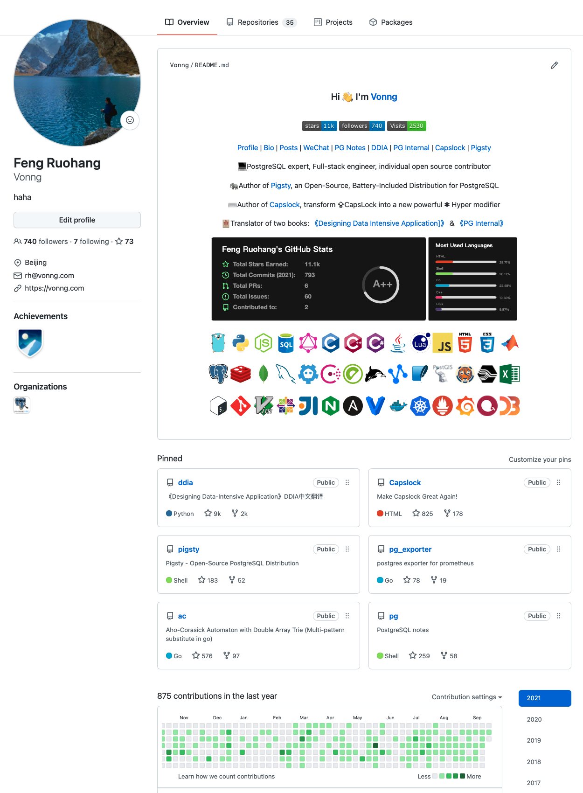

# 28岁的人生

又是一年中秋节，又老了一岁。

阳历生日（9月21日）碰上中秋节这件事，在我这辈子应该只会发生三次：2002年9岁时一次，2021年28岁时一次；2059年66岁时最后一次，假使我正常活到那一天的话。按理说，这是一个值得纪念的特殊日子，但我却无论如何都高兴不起来。这一年发生了太多的事情，已让我的神经变得麻木。

28岁开始于一场旅行：十一节的疫情已经短暂告一断落，我去参加了乌孙古道徒步。在旅途中，我认识了许多新朋友，一起渡过了一段难忘而开心的旅程。更重要的是，结识了一位知己，立下了共同的目标：[Paradise Found：乌孙古道](/cn/posts/trip/20201001-乌孙/)。

可惜，人生中的幸福与快乐永远是短暂的。仅仅一个月后，我就收到了噩耗。我最亲的亲人，外公去世了，这让我的人生顿时一片灰暗，一切事情似乎都失去了意义，无边的颓废笼罩了我。[与外公的告别](/cn/posts/life/姚国勋/)

## 颓废的人生

失去意义的人生是恐怖的，食无味，寝无眠，丧失了所有目标与意志力。我挣扎着想逃出这一汪泥潭，却越陷越深。此后的两个月里，我的每个周末都填满了活动：滑雪，攀冰，参加PG大会，自驾云南，[梅里雪山徒步跨年](/cn/posts/trip/20201228-%E9%9B%A8%E5%B4%A9/)，主持探探年会，看上去丰富多彩，其实不过是追求新鲜刺激，以填充内心的虚无罢了。

虚无的一个影响是“不怕死了”。滑雪的时候，我用最大的速度冲下最陡的坡，结果板子磕到了膝盖，打穿三层裤子，在左膝留下了一道半厘米深的伤痕。膝伤方才两周未愈，便执意去攀冰，即使冲坠，或打镐打穿了安全绳，内心非但没有恐慌，反而有一种释然：“这下可解脱了”。在[雨崩神湖](/cn/posts/trip/20201228-雨崩/)上，我在结冰积雪的山径一屁股坐着滑下来，结果飞出悬崖被灌木拦住保了命。最后一次，则在极限雪坡的作死中翻车，滚下山坡把右腿的韧带给摔撕裂了。

这种蕴含着自我毁灭倾向的找刺激行为，总算以一种相对温和的方式收场：韧带撕裂(1/4)，打了夹板拄了拐杖，这也让2021年的春节，也成为了我第一个独在异乡度过的春节。其实拄着拐杖也不是不能回去，实在不忍心让母亲看到我这个样子…

没法正常运动，于是我又变成了宅男。毕业后我已经很少玩游戏了，但接下来这几个月我玩的游戏可能比前几年加起来还要多：《Cyberpunk 2077》，《群星3.0》，《怪物猎人：崛起》，《永恒之塔》，《原神》。甚至还开始在游戏中氪金了，花一两万抽一堆纸片人，有时候我也觉得自己太堕落。而稍微有建设性一点的娱乐/工作是写代码，这一年我的主要工作重心是开源项目Pigsty。这是一个[开箱即用的PostgreSQL数据库发行版](https://pigsty.cc) 。搞数据库发行版这种事，一般只有数据库公司或者云厂商RDS团队才会去干，但我就是想一个人试试，确实是狂的没边了。但一个人从零开始搭建一个复杂软件系统，这种事情干起来就像创世一样，刺激程度和滑雪攀冰不遑多让，比打游戏还要爽的多。

无论是写代码，打游戏还是危险运动，专注做一件事情，起码可以让我暂时找到意义，忘掉烦恼与疼痛。但说到底，也还是用工作和游戏来麻醉自己罢了。

当然沉迷游戏编程，又不运动的死宅生活也是有代价的：没有几个月，体重就迅速增加了十几公斤，熬夜写代码打游戏也让头更秃了。生理的变化也导致心理状态的变化：更加富有攻击性，嘴也更臭了。以前看到不爽的东西，我最多腹诽一下，现在我真的会开嘲讽或者骂出来。看到吹牛逼立牌坊的就忍不住嘲讽；公司要砍三餐福利，我就直接在大群带头喷了。口无遮拦，自然也没少得罪人。但民不畏死，还会怕这些吗？

最可怕的是颓废慢慢变成一种习惯了：即使腿脚恢复了，也不再去健身运动；即使有闲暇时间，也不再去学习进步；计划的雅思考试，也被抛在脑后；熬夜沉迷游戏，项目也疏于维护。而这种麻木状态，甚至让我忘记了最初的缘由。直到前天遇上舅舅，说起外公，恍然如隔世，麻木的内心才裂开了口子。回头看看，What have I become ?  舅舅也刚刚失去亲人，却从未停止拼搏奋斗，每天坚持健身，学习新的领域知识，评院士当CEO样样不落。相比之下让我自惭形秽，从心底感觉到自己的垃圾与堕落。

其实这种事，我已经经历过两次了。十年前18岁生日的那天，父母离婚加上父亲患癌，让我整个大一都在浑浑噩噩中度过。四五年前，[父亲的去世](/cn/posts/life/冯振彪自传/)也让我心力憔悴备受折磨。这种事没有什么特效药，只能靠时间来慢抚平创伤。

28岁的生日，也是成年后的第一个十周年。确实是一个重新做人的好日子：重新拾起人生，重新面对生活。

## 回顾与规划

这一年虽然过的很颓废，但工作上倒还搞的不错。最代表性的作品是[Pigsty](https://pigsty.cc)，这是一个开箱即用的开源数据库发行版，在数据库可观测性上做到了极致，即使在世界范围内也丝毫不虚。它始于一个做给自己用的软件，慢慢地，有了一些典型行业用户，并开始在业内靠口碑发酵传播，开局还是不错的。假以时日，这也许会成为一个Game Changing的产品。我相信自己的眼光，坚持自己的判断，更重要的是能亲自去实现，Enable & make it happen。

过去一年里，经过不断的打磨，Pigsty已经发布了1.0GA的里程碑，虽然功能已经很完善了，但在我看来还是缺乏雕饰，需要进一步润色优化。功能上的改进必不可少，但还有两件最重要且紧急的事情：社区建设与国际化。当然实际干的事情可能是：群组唠嗑答疑和编写英文文档。未来一年的小目标是，Pigsty能有一个活跃的小社区与一些海外的用户，如果能有更多的贡献者加入进来就更好了。

此外，还有一些已有的开源项目与作品也有了重大更新，例如年初我对改键工具 [Capslock](http://capslock.vonng.com/#/) 进行了第三次重大修订，并建设了一个[官方网站](http://capslock.vonng.com)，吸引了不少用户，而且主要是外国用户，时不时还能收到一封感谢信，其实是蛮有成就感的。经典神书《[DDIA](https://ddia.vonng.com)》的中文翻译也有更新，特别是有一位热心用户参与了校对工作，让整书的质量又上了一个台阶，整个项目基本上是社区自己驱动着，真的让人能感受到开源与群体智慧的力量。其它一些项目也都有稳定的star增长，Github⭐️加起来也超过11k了；fo也有七八百，国内可以排到几百名，全球也能排个几千名，还是挺不错的。

在学习上，过去这一年怠惰了，雅思都没有好好刷起来，明年至少先要拿个7666才行，Pigsty的大量英文文档也需要提高一下英文写作水平。PG的内核和应用也好久都没有研究了，做的都是架构设计的事，输出居多，输入不足，明年要好好深钻一下。Pigsty的开发涉及到不少前端的东西，而前端这几年变化也很大，准备明年简单学习一下React和Vue，做几个Grafana Panel。

在行万里路上，过去一年倒是没落下：徒步了新疆[乌孙古道](/cn/posts/trip/20201001-乌孙/)，迪庆梅里雪山[雨崩](/cn/posts/trip/20201228-雨崩/)，[新乡南太行山](/cn/posts/trip/20210617-南太行/)，今年十一就去四川七藏沟走走吧，明年试着爬一下6000-7000的简单雪山。去年去了[广州](/cn/posts/trip/20210116-广州/)、深圳、大连；在云南丽江-香格里拉-迪庆，[海拉尔-满洲里](/cn/posts/trip/20210613-呼伦贝尔/)自驾了一圈，明年看看能不能把国内最后两个没去过的省份 —— 福建、广西逛一下，把地图填满。

在健康上，过去一年损失不小：左膝留了疤痕，右膝韧带撕裂，体脂暴增，其它都是小问题。膝盖目前恢复的不错，起码六月份爬南太行的时候没掉链子，感觉没啥影响了。肚子上的脂肪暴涨了12kg，整个人胖了一圈。好在四十公斤骨骼肌倒是没有掉，只要恢复每天锻炼，应该三四个月就下去了，希望明年能把体重控制到75公斤。

在社交上，过去一年认识了不少新朋友：有软件的用户，进山的驴友，游戏朋友，还有一些业内大佬，当然最开心的还是在山里碰上了一位知己。当然，这一年估计也因为嘴臭得罪了不少人，有个曾今很要好的同事关系搞僵了，这里也唱个喏道个不是了。Less is more，希望明年能修身养性一下，少说多做。

总的来说，28岁确实是充满挫折而又惨淡的一年，希望29岁，会是一个新的起点。

