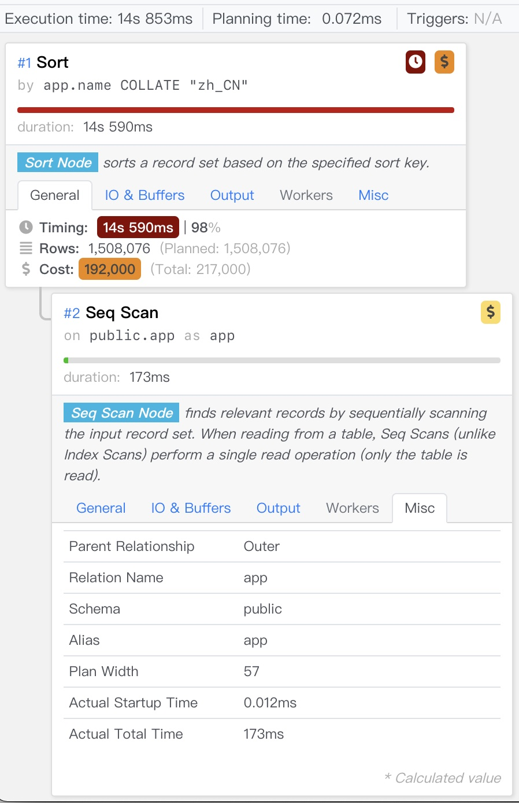

Why does Pigsty default to `locale=C` and `encoding=UTF8` when initializing PostgreSQL databases?

The answer is simple: **Unless you explicitly know you need LOCALE-related functionality, you should never configure anything other than `C.UTF8` for character encoding and localization collation rules**.

I've written a dedicated article about [**character encoding**](/db/character-encoding/) before, so I won't elaborate on that here. Today, let's specifically discuss the **LOCALE** (localization) configuration issue.

If server-side character encoding being set to something other than `UTF8` might be understandable for certain reasons, then configuring `LOCALE` to anything other than `C` is simply **inexcusable**. For PostgreSQL, LOCALE doesn't just control trivial things like how dates and currency are displayed—it affects core functionality.

Incorrect LOCALE configuration can cause **performance losses of several times to dozens of times**, and prevent `LIKE` queries from using regular indexes. Setting `LOCALE=C` doesn't affect scenarios that genuinely need localization rules. As the official documentation states: "Use LOCALE only if you truly need it."

Unfortunately, PostgreSQL's default `locale` and `encoding` configurations depend on the operating system settings, so `C.UTF8` may not be the default configuration. This leads many people to unknowingly misuse LOCALE, wasting significant performance and causing certain database features to malfunction.


------

## TL;DR

* Force the use of `UTF8` character encoding and force the database to use `C` localization rules.
* Using non-C localization rules can cause operations involving string comparisons to have several times to dozens of times higher overhead, **significantly impacting performance**
* Using non-C localization rules prevents `LIKE` queries from using regular indexes, easily causing pitfalls and cascading failures.
* Instances using non-C localization rules can support `LIKE` queries by creating indexes with `text_ops COLLATE "C"` or `text_pattern_ops`.


------

## What is LOCALE

We often see **`LOCALE` (region)** related configurations in operating systems and various software, but what exactly is LOCALE?

**LOCALE** support refers to applications adhering to cultural preferences, including alphabets, **sorting**, number formats, etc. LOCALE consists of many rules and definitions, including:

| `LC_COLLATE`  | String sorting order                     |
|---------------|------------------------------------------|
| `LC_CTYPE`    | Character classification (what is a character? Are its uppercase forms equivalent?) |
| `LC_MESSAGES` | Language of messages                     |
| `LC_MONETARY` | Format for monetary amounts              |
| `LC_NUMERIC`  | Format for numbers                       |
| `LC_TIME`     | Format for dates and times               |
| ……            | Others……                                 |

A LOCALE is a set of rules, typically named using language code + country code. For example, the LOCALE `zh_CN` used in mainland China has two parts: `zh` is the language code, and `CN` is the country code. In the real world, one language may be used by multiple countries, and one country may have multiple languages. Taking Chinese and China as examples:

China (`COUNTRY=CN`) related language `LOCALE`s include:

* `zh`: Chinese: `zh_CN`
* `bo`: Tibetan: `bo_CN`
* `ug`: Uyghur: `ug_CN`

Countries or regions that speak Chinese (`LANG=zh`) related `LOCAL`s include:

* `CN` China: `zh_CN`
* `HK` Hong Kong: `zh_HK`
* `MO` Macau: `zh_MO`
* `TW` Taiwan: `zh_TW`
* `SG` Singapore: `zh_SG`


------

## LOCALE Examples

We can reference a typical Locale definition file: Glibc's [zh_CN](https://lh.2xlibre.net/locale/zh_CN/glibc/)

Here's a small excerpt for demonstration—it looks like miscellaneous format definitions: how months and weekdays are called, how money and decimal points are displayed, etc.

But there's one very critical element here called `LC_COLLATE`, which is **collation (sorting method)**, and it significantly affects database behavior.

```yaml
LC_CTYPE
copy "i18n"
translit_start
include  "translit_combining";""
translit_end
class	"hanzi"; /
<U4E00>..<U9FA5>;/
<UF92C>;<UF979>;<UF995>;<UF9E7>;<UF9F1>;<UFA0C>;<UFA0D>;<UFA0E>;/
<UFA0F>;<UFA11>;<UFA13>;<UFA14>;<UFA18>;<UFA1F>;<UFA20>;<UFA21>;/
<UFA23>;<UFA24>;<UFA27>;<UFA28>;<UFA29>
END LC_CTYPE

LC_COLLATE
copy "iso14651_t1_pinyin"
END LC_COLLATE

LC_TIME
% 一月, 二月, 三月, 四月, 五月, 六月, 七月, 八月, 九月, 十月, 十一月, 十二月
mon           "<U4E00><U6708>";/
     "<U4E8C><U6708>";/
     "<U4E09><U6708>";/
     "<U56DB><U6708>";/
...
% 星期日, 星期一, 星期二, 星期三, 星期四, 星期五, 星期六
day           "<U661F><U671F><U65E5>";/
     "<U661F><U671F><U4E00>";/
     "<U661F><U671F><U4E8C>";/
...
week          7;19971130;1
first_weekday 2
% %Y年%m月%d日 %A %H时%M分%S秒
d_t_fmt       "%Y<U5E74>%m<U6708>%d<U65E5> %A %H<U65F6>%M<U5206>%S<U79D2>"
% %Y年%m月%d日
d_fmt         "%Y<U5E74>%m<U6708>%d<U65E5>"
% %H时%M分%S秒
t_fmt         "%H<U65F6>%M<U5206>%S<U79D2>"
% 上午, 下午
am_pm         "<U4E0A><U5348>";"<U4E0B><U5348>"
% %p %I时%M分%S秒
t_fmt_ampm    "%p %I<U65F6>%M<U5206>%S<U79D2>"
% %Y年 %m月 %d日 %A %H:%M:%S %Z
date_fmt      "%Y<U5E74> %m<U6708> %d<U65E5> %A %H:%M:%S %Z"
END LC_TIME

LC_NUMERIC
decimal_point "."
thousands_sep ","
grouping      3
END LC_NUMERIC

LC_MONETARY
% ￥
currency_symbol    "<UFFE5>"
int_curr_symbol    "CNY "
```

For example, the `LC_COLLATE` provided by `zh_CN` uses the `iso14651_t1_pinyin` sorting rule, which is a **pinyin-based sorting rule**.

Let's look at an example of how LOCALE's COLLATION affects Postgres behavior.


------

## Collation Rule Example

Create a table containing 7 Chinese characters and perform sorting operations.

```sql
CREATE TABLE some_chinese(
    name TEXT PRIMARY KEY
);
INSERT INTO some_chinese VALUES 
('阿'),('波'),('磁'),('得'),('饿'),('佛'),('割');

SELECT * FROM some_chinese ORDER BY name;
```

Execute the following SQL to sort table records according to the default `C` collation rule. You can see that it's actually sorting by the `ascii|unicode` [**code point**](/db/character-encoding#编码字符集-ccs) of characters.

```bash
vonng=# SELECT name, ascii(name) FROM some_chinese ORDER BY name COLLATE "C";
 name | ascii
------+-------
 佛   | 20315
 割   | 21106
 得   | 24471
 波   | 27874
 磁   | 30913
 阿   | 38463
 饿   | 39295
```

However, this code point-based sorting may be meaningless for Chinese people. For example, the Xinhua Dictionary doesn't use this **sorting method** when cataloging Chinese characters. Instead, it uses the **pinyin sorting** rule used by `zh_CN`, comparing by pinyin. As shown:

```sql
 SELECT * FROM some_chinese ORDER BY name COLLATE "zh_CN";
 name
------
 阿
 波
 磁
 得
 饿
 佛
 割
```

You can see that sorting by the `zh_CN` collation rule produces results in pinyin order `abcdefg`, rather than the meaningless Unicode code point sorting.

Of course, this query result depends on the specific definition of the `zh_CN` collation rule. Such collation rules are not defined by the database itself—the database only provides the `C` collation rule (or its alias `POSIX`). COLLATION sources are usually either the operating system, `glibc`, or third-party localization libraries (like `icu`), so different **actual definitions** might produce different effects.


#### **But what's the cost?**

The biggest negative impact of using non-`C` or non-`POSIX` LOCALE in PostgreSQL is:

**Specific collation rules have enormous performance impact on operations involving string size comparisons, and they also prevent the use of regular indexes in `LIKE` query clauses.**

Additionally, C LOCALE is guaranteed by the database itself to be used on any operating system and platform, while other LOCALEs are not, so using non-C Locale has worse portability.


------

## Performance Loss

Let's consider an example using LOCALE collation rules. We have 1.5 million app names from the Apple Store, and we want to sort them according to different regional rules.

```sql
-- Create an app name table with both Chinese and English content.
CREATE TABLE app(
    name TEXT PRIMARY KEY
);
COPY app FROM '/tmp/app.csv';

-- View statistics on the table
SELECT
    correlation , -- correlation coefficient 0.03542578 basically random distribution
    avg_width ,   -- average length 25 bytes
    n_distinct    -- -1, meaning 1508076 records with no duplicates
FROM pg_stats WHERE tablename = 'app';

-- Use different collation rules for a series of experiments
SELECT * FROM app;
SELECT * FROM app order by name; 
SELECT * FROM app order by name COLLATE "C";
SELECT * FROM app order by name COLLATE "en_US";
SELECT * FROM app order by name COLLATE "zh_CN"; 
```

The results are quite shocking—using `C` versus `zh_CN` can differ by **ten times**:

| No. | Scenario                              | Time (ms) | Notes              |
|-----|---------------------------------------|-----------|-------------------|
| 1   | No sorting                            | 180       | Using index       |
| 2   | `order by name`                       | 969       | Using index       |
| 3   | `order by name COLLATE "C"`           | 1430      | Sequential scan, external sort |
| 4   | `order by name COLLATE "en_US"`       | 10463     | Sequential scan, external sort |
| 5   | `order by name COLLATE "zh_CN"`       | 14852     | Sequential scan, external sort |

Below is the detailed execution plan for experiment 5. Even with sufficient memory configured, it still spills to disk for external sorting. Nevertheless, all experiments explicitly specifying `LOCALE` exhibited this behavior, so we can compare the performance difference between C and `zh_CN` horizontally.



Another more comparable example is **comparison operations**.

Here, all strings in the table are compared with `World`, equivalent to 1.5 million specific rule comparisons on the table, without involving disk IO.

```sql
SELECT count(*) FROM app WHERE name > 'World';
SELECT count(*) FROM app WHERE name > 'World' COLLATE "C";
SELECT count(*) FROM app WHERE name > 'World' COLLATE "en_US";
SELECT count(*) FROM app WHERE name > 'World' COLLATE "zh_CN";
```

Even so, compared to `C LOCALE`, `zh_CN` still took nearly 3 times longer.

| No. | Scenario | Time (ms) |
|-----|----------|-----------|
| 1   | Default  | 120       |
| 2   | C        | 145       |
| 3   | en_US    | 351       |
| 4   | zh_CN    | 441       |

If sorting potentially involves O(n2) comparison operations with 10x overhead, then the 3x overhead for O(n) comparisons here basically corresponds. We can draw a preliminary rough conclusion:

Compared to `C` Locale, using `zh_CN` or other Locales may cause **several times** additional performance overhead.

Besides this, incorrect Locale not only brings performance losses but also causes **functional losses**.


------

## Functional Loss

Besides poor performance, another unacceptable issue is that using non-`C` LOCALE prevents **LIKE queries from using regular indexes**.

Using the same experiment as before, we execute the following query on database instances created with `C` and `en_US` as default LOCALEs respectively:

```sql
SELECT * FROM app WHERE name LIKE '中国%';
```

Find all apps whose names start with "中国" (China).

#### **On a database using C**

This query can properly use the `app_pkey` index, leveraging the B-tree's ordering to accelerate the query, completing in about 2 milliseconds.

```bash
postgres@meta:5432/meta=# show lc_collate;
 C

postgres@meta:5432/meta=# EXPLAIN SELECT * FROM app WHERE name LIKE '中国%';
                                 QUERY PLAN
-----------------------------------------------------------------------------
 Index Only Scan using app_pkey on app  (cost=0.43..2.65 rows=1510 width=25)
   Index Cond: ((name >= '中国'::text) AND (name < '中图'::text))
   Filter: (name ~~ '中国%'::text)
(3 rows)
```

#### **On a database using en_US**

We find that **this query cannot use indexes** and performs a full table scan. Query performance degrades to 70 milliseconds, a 30-40x performance deterioration.

```bash
vonng=# show lc_collate;
 en_US.UTF-8

vonng=# EXPLAIN SELECT * FROM app WHERE name LIKE '中国%';
                        QUERY PLAN
----------------------------------------------------------
 Seq Scan on app  (cost=0.00..29454.95 rows=151 width=25)
   Filter: (name ~~ '中国%'::text)
```

#### **Why?**

Because index (B-tree index) construction is also based on **order**, i.e., **equality** and **comparison** operations.

However, LOCALE has its own set of definitions for string equivalence rules. For example, the Unicode standard defines many bizarre equivalence rules (after all, it's for universal languages, like composite character strings being equivalent to single characters, see the **Modern Character Encoding** article for details).

Therefore, **only the most basic `C` LOCALE can properly perform pattern matching**. C LOCALE's comparison rules are very simple—just compare character code points one by one, without any fancy tricks. So if your database unfortunately uses non-C LOCALE, you won't be able to use default indexes when executing `LIKE` queries.

#### Solution

For non-C LOCALE instances, only by **creating special types of indexes** can such queries be supported:

```sql
CREATE INDEX ON app(name COLLATE "C");
CREATE INDEX ON app(name text_pattern_ops);
```

Using the `text_pattern_ops` operator class to create indexes can also support `LIKE` queries. This is specifically designed for pattern matching, and in principle it **ignores** LOCALE and directly executes pattern matching based on **character-by-character** comparison, i.e., using the C LOCALE approach.

Therefore, in this situation, only indexes based on the `text_pattern_ops` operator class, or those based on the default `text_ops` but using `COLLATE "C"`, can be used to support `LIKE` queries.

```sql
vonng=# EXPLAIN ANALYZE SELECT * FROM app WHERE name LIKE '中国%';

Index Only Scan using app_name_idx on app  (cost=0.43..1.45 rows=151 width=25) (actual time=0.053..0.731 rows=2360 loops=1)
   Index Cond: ((name ~>=~ '中国'::text) AND (name ~<~ '中图'::text))
   Filter: (name ~~ '中国%'::text COLLATE "en_US.UTF-8")
```

After creating the index, we can see that the original `LIKE` query **can** use indexes.

The inability of `LIKE` to use regular indexes seems solvable by creating an additional `text_pattern_ops` index. But this also means that problems that could originally be directly solved using existing `PRIMARY KEY` or `UNIQUE` constraint indexes now require additional maintenance costs and storage space.

For developers unfamiliar with this issue, it's very likely that due to incorrect LOCALE configuration, patterns that work locally will cause cascading failures online due to not using indexes (e.g., local using C, but production environment using non-C LOCALE).


------

## Compatibility

Suppose you inherit a database that already uses non-`C` LOCALE (this is quite common). Now that you know the dangers of using non-C LOCALE, you decide to find an opportunity to change it back.

What should you pay attention to? Specifically, Locale configuration affects the following PostgreSQL functions:

1. Queries using `LIKE` clauses.

2. Any queries relying on specific LOCALE collation rules, such as relying on pinyin sorting as the result ordering basis.
3. Queries using **case conversion related functions**, functions `upper`, `lower`, and `initcap`
4. The `to_char` function family, when formatting to local time.
5. **Case-insensitive matching** patterns in regular expressions (`SIMILAR TO`, `~`).

If unsure, you can use `pg_stat_statements` to list all query statements involving the following keywords for manual inspection:

```sql
LIKE|ILIKE                   -- Whether pattern matching is used
SIMILAR TO | ~ | regexp_xxx  -- Whether the i option is used
upper, lower, initcap        -- Whether used for other languages with case patterns (Western European characters, etc.)
ORDER BY col                 -- When sorting by text type columns, does it depend on specific collation rules? (e.g., by pinyin)
```

### Compatibility Modifications

Generally speaking, C LOCALE is functionally a superset of other LOCALE configurations, and you can always switch from other LOCALEs to C. If your business doesn't use these features, usually nothing needs to be done. If localization rule features are used, you can always achieve the same effect under C LOCALE by **explicitly specifying `COLLATE`**.

```sql
SELECT upper('a' COLLATE "zh_CN");  -- Execute case conversion based on zh_CN rules
SELECT  '阿' < '波';                 -- false, under default collation rules 阿(38463) > 波(27874)
SELECT  '阿' < '波' COLLATE "zh_CN"; -- true, explicitly use Chinese pinyin collation: 阿(a) < 波(bo)
```


The only known issue currently appears in the `pg_trgm` extension.