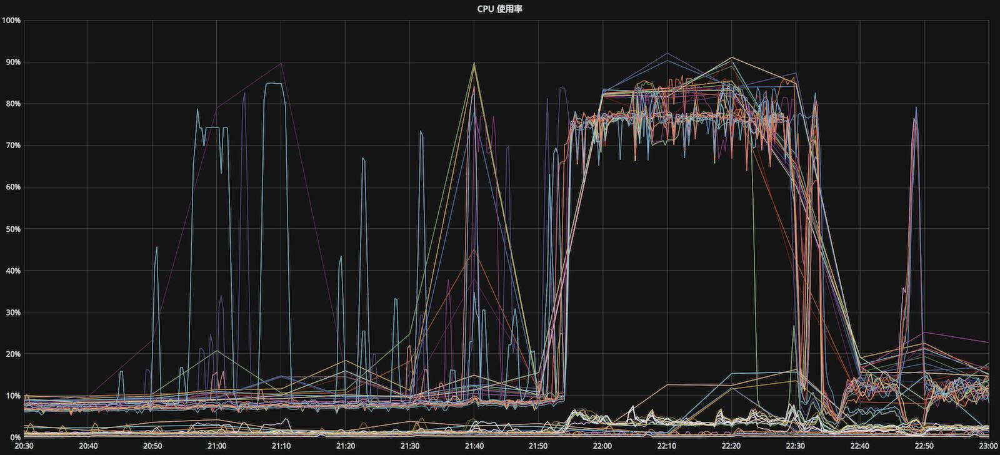

> Author: [Vonng](https://vonng.com) ([@Vonng](https://vonng.com/en/))

Recently there was a perplexing incident where a database had half its data volume and load migrated away.

Everything else remained unchanged, and it was fine before. The pressure decreased, yet it fell into a near-death state during peak hours, completely counter-intuitive.

But as Sherlock Holmes said, **"When you eliminate the impossible, whatever remains, however improbable, must be the truth."**

## I. Summary

At 4 AM one day, the core database underwent database splitting migration, removing half the tables and half the query load, with node scale remaining unchanged.

During that evening's peak hours, all hot standby servers (15 units) in the core database experienced connection pile-up and pressure surge. Targeted cleanup of slow queries was no longer effective.

**Indiscriminate continuous query killing** had immediate firefighting effects (after 22:30) and the issue immediately reoccurred when stopped (22:48), requiring killing until peak hours ended.

What was perplexing was that tables were moved (data volume halved), load was moved (TPS halved), nothing else changed, yet somehow this caused increased pressure?

## II. Phenomena

Normal CPU usage water level was 25%, warning level at 45%, limit level at 80%. During the incident, all standby servers spiked to limit levels.



PostgreSQL connections surged dramatically. Normally 5-10 database connections were sufficient for all traffic, with connection pool maximum of 100 connections.


pgbouncer connection pool average response time was normally around 500μs, spiking to hundreds of milliseconds during the incident.


During the incident, database TPS declined significantly. After query killing rescue it recovered but remained in violent fluctuation.


During the incident, execution time of two functions deteriorated significantly, from hundreds of microseconds to tens of milliseconds.


During the incident, replication lag increased significantly, starting to show GB-level replication delays, with business metrics declining significantly.

Killing queries helped most metrics recover, but once stopped, issues immediately returned (22:48 experimental stop saw issue recurrence).

## III. Root Cause Analysis

**Surface cause**: All standby connection pools were maxed out, connections occupied by slow queries, fast queries couldn't execute, causing connection pile-up.

**Primary internal cause**: When concurrent count for two functions increased to around 30, performance degraded sharply, becoming slow queries (500μs to 100ms).

**Secondary internal cause**: Backend and database lacked proper timeout cancellation mechanisms, circuit breakers amplified the incident.

**External cause**: After database splitting, fast query proportion decreased, causing specific query relative proportion to increase, concurrent count reaching critical point and degrading to slow queries.

### Surface Cause: Maxed Connections

The surface cause was database connection pools being maxed out, producing large amounts of piled-up connections, preventing new connections and causing service denial.

#### Principle

Database configured `max_connections = 100`, each connection is essentially a database process. The actual number of database processes a machine can handle is highly related to query types: if all are fast queries within 1ms, hundreds or thousands of connections are possible (normal production situation). But if all are CPU and IO intensive slow queries, maximum supported connections might only be around (`48 * 80% ≈ 38`).

Production environments used connection pools. Normally 5-10 actual database connections could support all fast queries. However, once large numbers of slow queries continuously entered and occupied active connections long-term, fast queries would queue and pile up. Connection pools would then start more actual database connections, but fast queries on these connections would quickly finish and still be occupied by continuously entering slow queries. Eventually all ~100 actual database connections were executing CPU/IO intensive slow queries (`max_pool_size=100`), causing CPU surge and further deteriorating the situation.

#### Evidence

##### Connection-Pool Active Connections


##### Connection-Pool Queued Connections


##### Database Backend Connections


#### Fix

Continuously killing all database active connections indiscriminately had good symptomatic relief effects with minimal business impact.

But killing connections (`pg_terminate_backend`) causes connection pool reconnection. Better approach is canceling queries (`pg_cancel_backend`).

Since fast queries complete quickly, queries stuck executing on backend connections are very likely slow queries. Indiscriminate query cancellation at this point hits mostly slow queries. Killing queries frees connections for fast query use, keeping applications alive, but must be done continuously as slow queries re-occupy active connections within fractions of a second.

Execute the following SQL using psql to cancel all active queries every 0.5 seconds:

```sql
SELECT pg_cancel_backend(pid) FROM pg_stat_activity WHERE application_name != 'psql' \watch 0.5
```

Solution: Adjusted connection pool backend maximum connections, implemented fast-slow separation, forced all batch tasks and slow queries to use offline standby servers.

### Primary Internal Cause: Parallel Degradation

The **primary internal cause** was execution time degradation of two functions when **parallel count increased**.

#### Principle

The direct trigger was these two functions degrading into slow queries. Through separate stress testing, these two functions showed sharp performance degradation as parallel execution count increased, with threshold at approximately 30 concurrent processes. (Since all processes executed only the same query, parallel count equals concurrent count.)

#### Evidence

**Chart: Function average execution time showed obvious spikes during incident**


**Chart: Maximum QPS achievable for this function under different parallel counts**


#### Fix

* Optimized function execution logic, reducing function execution time to half the original (doubling maximum QPS)
* Added five standby servers to further reduce single-machine load

### Secondary Internal Cause: No Timeout

The secondary internal cause was lack of proper timeout cancellation mechanisms. **Queries not being canceled due to timeout was a necessary condition for pile-up.**

#### Principle

When query timeouts occur, reasonable application behavior should be:

* Return directly and report error
* Perform several retries (during peak hours, consider returning errors directly)

Queries waiting beyond reasonable time without cancellation leads to connection pile-up. Abandoning returned results without canceling sent queries is insufficient - clients need active Cancel Requests. Post-Go 1.7 standard practice is using the `context` package with `database/sql`'s `QueryContext/ExecContext` for timeout control.

Database and connection pool can configure **statement timeout**, but practice shows this easily kills queries by mistake.

Manual killing provides immediate symptomatic relief, but it's essentially a **manual timeout cancellation mechanism**. Robust systems should have automated timeout cancellation mechanisms, requiring coordination across database, connection pool, and application layers.

Examining backend driver code revealed `pg.v3` and `pg.v5` lack true query timeout mechanisms - timeout parameters are just TCP timeouts for `net.Conn` (usually minute-level).

#### Fix

* Recommend using `github.com/jackc/pgx` and `github.com/go-pg/pg` version 6 drivers to replace existing drivers
* Using circuit-breakers amplifies incident effects - recommend backend use active timeouts instead of circuit breakers
* Recommend more fine-grained connection usage control at application layer

### External Cause: Database Migration

Database splitting caused changes in fast-slow query proportions in the original database, triggering degradation of the two functions.

The problem functions' global call proportion changed from `1/6` before migration to `1/2` after, causing increased parallel count for problem functions.

#### Principle

* Migrated functions were all fast queries, original problem function:normal function ratio was 1:5
* After load migration, most fast queries were moved away. Problem function:normal function exceeded 1:1
* Problem function proportion increased significantly, causing peak hour concurrent count to exceed threshold and degrade

#### Evidence

By analyzing full database logs before and after migration, replaying query traffic for stress testing reproduced the phenomenon and confirmed the problem cause.

|     Metric     | Pre-migration | Post-migration |
| :----------: | :----: | :----: |
| Problem Function Ratio |  1/6   |  5/9   |
|   Maximum QPS    |  40k   |   8k   |

QPS/TPS is an extremely misleading metric. QPS comparison only makes sense when load types remain unchanged. When system load types change, QPS water levels need re-evaluation and testing.

In this case, after load changes, the system's maximum QPS water level changed dramatically. Due to problem function concurrent degradation, maximum QPS became one-fifth of the original.

#### Fix

Rewrote and optimized problem functions, improving performance by 100%.

Through testing, determined post-migration system water levels and performed corresponding optimization and capacity adjustments.

## IV. Experience and Lessons

During incident investigation, we took some detours. Initially we thought some offline batch task slowed queries (based on before-after correlation observed in logs), also investigated API call volume spikes, external malicious access, other change factors, unknown online operations, etc. Although database migration was listed as suspect, because intuitively load decreased, how could system capacity decrease? It wasn't prioritized for investigation. Reality immediately taught us a lesson:

**"When you eliminate the impossible, whatever remains, however improbable, must be the truth."**