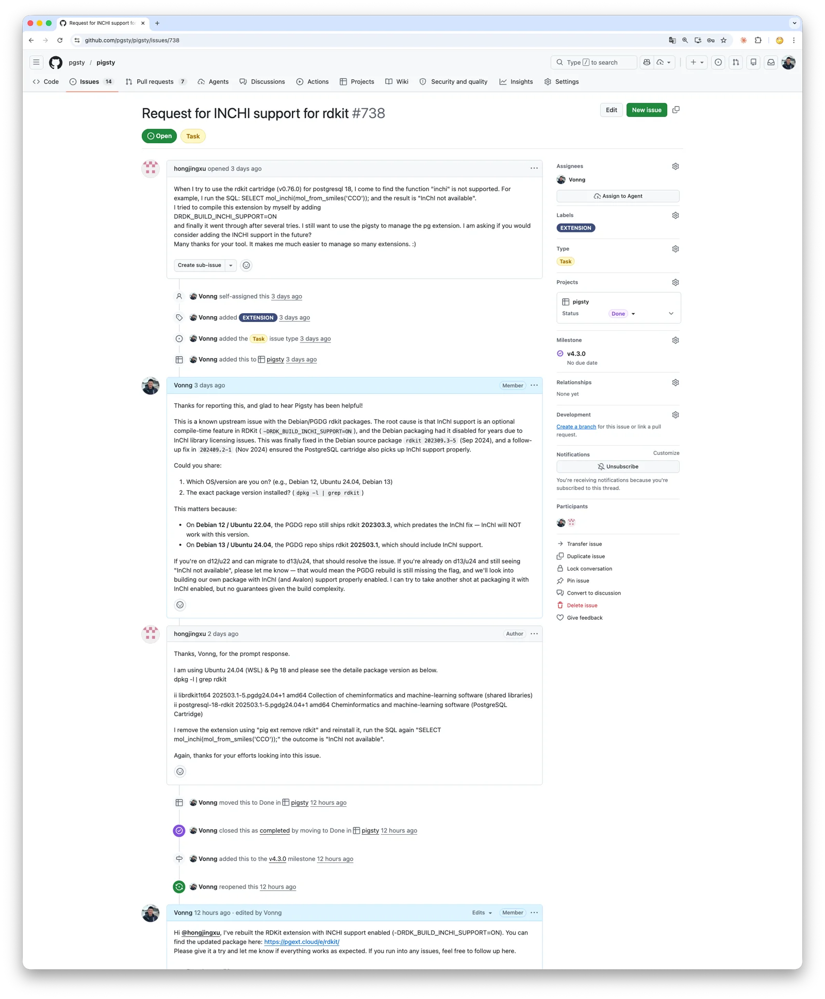
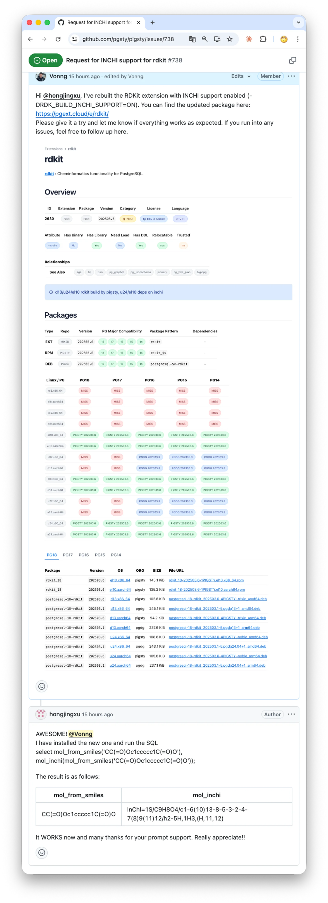

A GitHub issue turned into an extension sprint. 32 new additions say a lot about where PostgreSQL is headed.


--------

## It Started with a Chemistry Extension

Two days ago, a user opened a GitHub [issue](https://github.com/pgsty/pigsty/issues/738): he was using RDKit, the de facto standard library in cheminformatics, to store molecular structures, run substructure searches, and compute similarity inside PostgreSQL.
He noticed that the official PGDG package was built without InChI support. After spending a while rebuilding it with the right compile flags, he got it working, but still hoped Pigsty could support it out of the box.

[](https://github.com/pgsty/pigsty/issues/738)

RDKit really is a nasty one. I tried to bring it into the Pigsty extension repo about two years ago, porting it from Debian to EL.
The dependency tree was ugly: Boost, Eigen, RapidJSON, Cairo, plus optional modules like InChI and Avalon.
Each one came with its own build flags and OS-specific library-version problems.
I fought with it for a while, got nowhere, and shelved it.

This time was different. **I had coding agents.**

Using Codex or Claude Code for this kind of build-system archaeology is almost unfair.
Things that used to take endless rounds of trial and error now usually take one or two iterations of prompting and then waiting.
This release also fixed the missing InChI support in the PGDG package. In practice it came down to enabling one more build flag and bundling the InChI source. It worked on the first proper pass, and the user was happy.



Honestly, feedback like that is the best part of doing open source.


---------

## Strike While the Iron Is Hot

Once I was warmed up, I went after a few other long-standing problem cases.

[**`plv8`**](https://pigsty.io/ext/e/plv8): PostgreSQL bindings for the V8 engine. It had refused to build on EL10 for a while. This time, after carrying a few patches, I finally got it building reliably.

[**`duckdb_fdw`**](https://pigsty.io/ext/e/duckdb_fdw): lets PostgreSQL read and write external DuckDB files. Previously it clashed with DuckDB's official `pg_duckdb` extension because both wanted the same shared library name, so I had to hide it temporarily. This time I turned `duckdb_fdw` into a sub-extension of `pg_duckdb`, so they share the same `libduckdb`. The conflict is gone, and both can coexist cleanly again.

At that point I figured: if the toolchain is already hot, why not finish the rest of the worthwhile extensions in the PostgreSQL ecosystem that had been sitting on the backlog?
That turned into this release: **32 new additions, 22 updates, and the Pigsty extension repo officially crossing 500, landing at 504 total extensions**.

> [Extension Catalog: pigsty.io/ext](https://pigsty.io/ext)

| **Category** | **All** | **PGDG** | **PIGSTY** | **CONTRIB** | **MISS** | **PG18** | **PG17** | **PG16** | **PG15** | **PG14** |
|:-------------|--------:|---------:|-----------:|------------:|---------:|---------:|---------:|---------:|---------:|---------:|
| **Total**    |     504 |      155 |        332 |          71 |        0 |      481 |      488 |      479 |      473 |      457 |
| **EL**       |     499 |      150 |        332 |          71 |        5 |      472 |      482 |      474 |      468 |      452 |
| **Debian**   |     489 |      107 |        311 |          71 |       15 |      466 |      474 |      464 |      458 |      442 |

Out of these 500-odd extensions, around 70 ship with PostgreSQL itself, roughly 150 are packaged by PGDG, and the remaining 330 are third-party extensions that I package and maintain myself.

To put that in perspective: most managed PostgreSQL cloud RDS expose a few dozen extensions at best.
Take Supabase, for example. It looks like a long list, but after you subtract the 35 contrib extensions that come with PostgreSQL, you are left with fewer than 30 third-party extensions.


------

## The New Extensions

This batch is heavy. Broadly, four groups:

**Data-domain extensions**: make chemical molecules, RDF triples, BSON, Protobuf, recurring schedules, and other complex objects first-class database citizens.

**Query extensions**: sparse linear algebra and graph algorithms, Datalog-style graph queries, full-text search, hybrid ranking fusion, recursive SQL template engines.

**Production engineering extensions**: deep observability, exported query telemetry, CDC to MQTT, COPY interception, DDL propagation for logical replication, lightweight distributed locks, soft-alert data quality management.

**Developer-experience extensions**: session variables, pseudo-autonomous transaction logging, natural-language time parsing.

Together they point to a broader trend: the extension layer is pushing PostgreSQL into the space between an application platform and a data platform. Things that used to require separate services increasingly fit inside a single SQL transaction boundary.


--------

# A Tour of the New Additions

This release adds 32 new extensions. The summaries below were compiled with help from Claude, Codex, and Gemini to give readers a quick way to understand what each one does, how it works, and where it fits.


-------

## 1. rdkit: Cheminformatics Inside PostgreSQL

> [**`rdkit`**](https://pigsty.io/ext/e/rdkit) | [**GitHub**](https://github.com/rdkit/rdkit)

RDKit is the de facto standard open-source cheminformatics library, started by Greg Landrum (originally at Novartis, now T5 Informatics). Its PostgreSQL cartridge brings molecular storage, substructure search, and similarity computation into a relational database — millions of compounds queryable with plain SQL.

The cartridge adds **`mol`** (molecules) and **`qmol`** (SMARTS query patterns), plus `bfp`/`sfp` fingerprint types. Operators: `@>` for substructure matching, `%` for Tanimoto similarity, `<%>` as a distance operator — all GiST-indexable via fingerprint pre-filtering. Key functions: `mol_from_smiles()`, `morganbv_fp()`, `tanimoto_sml()`. GUCs like `rdkit.tanimoto_threshold` control match sensitivity.

Using the ChEMBL dataset with 1.87 million compounds as an example:

```sql
-- Substructure search: find molecules containing a given scaffold
SELECT count(*) FROM rdk.mols WHERE m @> 'c1cccc2c1nncc2';
-- Result: 461 matches, about 108 ms

-- Tanimoto similarity search using Morgan fingerprints
SELECT molregno, tanimoto_sml(morganbv_fp(mol_from_smiles('c1ccccc1C(=O)NC'::cstring)), mfp2) AS similarity
FROM rdk.fps JOIN rdk.mols USING (molregno)
WHERE morganbv_fp(mol_from_smiles('c1ccccc1C(=O)NC'::cstring)) % mfp2
ORDER BY morganbv_fp(mol_from_smiles('c1ccccc1C(=O)NC'::cstring)) <%> mfp2;

-- SMARTS pattern matching: oxadiazole or thiadiazole compounds
SELECT * FROM rdk.mols WHERE m @> 'c1[o,s]ncn1'::qmol LIMIT 500;
```

Use cases center on drug discovery: **lead scaffold search** across million-scale libraries, **SAR analysis** via similarity, **compound registration** with fingerprint dedup, and **catalog search** over datasets like eMolecules (6M+ compounds).

Settle your index strategy and query templates early — filters that are correct but bypass indexes will be slow. On 1.87M compounds, substructure queries range from ~88 ms to ~1.9 s; with tuning, the cartridge handles **6M+ compounds**. BSD licensed. Docker images (`mcs07/postgres-rdkit`) and conda packages available.


-------

## 2. provsql: Semiring Provenance for Query Results

> [**`provsql`**](https://pigsty.io/ext/e/provsql) | [**GitHub**](https://github.com/PierreSenellart/provsql)

ProvSQL, from Pierre Senellart (ENS Paris / INRIA Valda, VLDB 2018), adds **(m-)semiring provenance** and uncertainty management to PostgreSQL. It tracks which base tuples each query result was derived from, and lets you evaluate that provenance under different algebraic structures: booleans, security levels, counts, or probabilities.

It hooks into query execution and adds a hidden `provsql` UUID column to each table, pointing into a provenance circuit. Supported SQL is broad: SELECT-FROM-WHERE, JOIN, GROUP BY, DISTINCT, UNION/EXCEPT, aggregates, HAVING, and on PG 14+ also INSERT/DELETE/UPDATE. Core functions: `add_provenance()`, `provenance_evaluate()`, `formula()`, `probability_evaluate()`. Probability evaluation ranges from naive to Monte Carlo to d-DNNF compilation via external solvers (`d4`, `c2d`).

```sql
-- Security-level propagation: results inherit the highest source classification
SELECT create_provenance_mapping('personnel_level', 'personnel', 'classification');
SELECT p1.city, security(provenance(), 'personnel_level')
FROM personnel p1, personnel p2
WHERE p1.city = p2.city AND p1.id < p2.id
GROUP BY p1.city ORDER BY p1.city;

-- Boolean-formula provenance: show the derivation formula for each row
SELECT *, formula(provenance(), 'witness_mapping') FROM s;

-- Probabilistic queries: compute confidence for each result row
SELECT city, probability_evaluate(provenance()) FROM result;
```

Four typical scenarios: **security-label propagation** (results inherit the highest source classification), **probabilistic databases** (base tuples carry confidence scores), **data lineage and audit** (trace each output row back to sources, optionally export as PROV-XML), and **credibility scoring** (e.g. weighting witness statements in investigative workflows).

The key property is composability: provenance is not a dead log string but a live object you can keep computing on. Worth enabling on critical paths — core reports, feature pipelines, compliance calculations — not as a blanket switch for the whole database. C/C++ with Boost; provenance circuits live in shared memory. PG 10–18. MIT.


-------

## 3. onesparse: Billion-Edge Graph Algorithms in SQL

> [**`one_sparse`**](https://pigsty.io/ext/e/onesparse) | [**GitHub**](https://github.com/OneSparse/OneSparse)

OneSparse wraps SuiteSparse:GraphBLAS to bring high-performance sparse linear algebra into PostgreSQL. Developer Michel Pelletier sits on the GraphBLAS C API committee; advisor Timothy A. Davis is the SuiteSparse author. The premise: **represent graphs as sparse matrices** and run BFS, PageRank, triangle centrality, and friends via matrix operations — all from SQL.

Types: `matrix`, `vector`, `scalar`, `semiring`, `monoid`. Operator `@` for matrix multiplication under `plus_times` semiring. Ships LAGraph algorithms: BFS (level and parent modes), PageRank, triangle centrality, degree centrality, SSSP. Wraps GraphBLAS opaque handles in PostgreSQL's Expanded Object Header; small graphs (<1 GB) in TOAST, larger ones as Large Objects or files. Built-in JIT with **NVIDIA CUDA GPU acceleration**.

```sql
-- Load a graph from a Matrix Market file
SELECT mmread('/home/postgres/onesparse/demo/karate.mtx') AS graph;

-- BFS traversal
SELECT (bfs(graph, 1)).level FROM karate;

-- Degree centrality by column reduction
SELECT reduce_cols(cast_to(graph, 'int32')) AS degree FROM karate;

-- PageRank
SELECT pagerank(graph) FROM karate;
```

On the GAP benchmark, BFS over a **4.3 billion-edge** graph reached **70 billion+ traversed edges per second** (48-core AMD EPYC). Targets: fraud detection on transaction graphs, social-network analysis, Graph RAG. The usual caveat applies: real usability depends on whether your load/serialization formats and the SQL planner play nicely end-to-end. Start small.

Requires **PG 18 Beta or newer**; still alpha. Apache 2.0.


-------

## 4. pg_datasentinel: Deep Observability for PostgreSQL in the Container Era

> [**`pg_datasentinel`**](https://pigsty.io/ext/e/pg_datasentinel) | [**GitHub**](https://github.com/datasentinel/pg_datasentinel)

`pg_datasentinel` (Christophe Reveillere / Datasentinel, 1.0 released April 10 2026) fills four gaps in PostgreSQL's native monitoring, especially for containerized deployments:

1. **Extended activity monitoring** — augments `pg_stat_activity` with per-backend memory usage, live temp-file bytes, and on PG 18+ the current plan ID.
2. **Container resource visibility** — CPU quotas, memory limits/usage, and CPU pressure for Docker / Kubernetes / OpenShift / any cgroup environment.
3. **Transaction wraparound forecasting** — tracks XID and MXID burn rate, exposes live ETAs to aggressive vacuum and wraparound limits.
4. **Log capture views** — parses vacuum, analyze, temp-file, and checkpoint events into a shared-memory ring buffer queryable from SQL.

```sql
-- Per-backend memory usage (extended pg_stat_activity)
SELECT pid, usename, query, backend_memory_bytes, temp_file_bytes
FROM pg_datasentinel_activity;

-- Container resource monitoring
SELECT cpu_quota, memory_limit, memory_usage, cpu_pressure
FROM pg_datasentinel_container_resources;

-- Wraparound risk forecasting
SELECT xid_current, xid_limit, xid_eta_aggressive_vacuum, xid_eta_wraparound
FROM pg_datasentinel_wraparound;
```

For PostgreSQL on Kubernetes, this gives container-level visibility without a separate monitoring agent. The **XID wraparound warning** is the standout — wraparound can force-shutdown a database, and having a burn-rate ETA turns firefighting into forecasting. 3-Clause BSD. PG 15+.


-------

## 5. datasketches: Approximate Analytics at Hundred-Million-Row Scale

> [**`datasketches`**](https://pigsty.io/ext/e/datasketches) | [**GitHub**](https://github.com/apache/datasketches-postgresql)

Apache DataSketches (Apache Foundation, originally Yahoo/Verizon Media) brings **approximate query data structures** into SQL. When exact `COUNT(DISTINCT)`, quantiles, or heavy-hitter analysis gets too expensive on large datasets, sketches trade a few percent of accuracy for orders of magnitude in speed and memory.

Seven sketch types: **`cpc_sketch`** (compressed probabilistic counting), **`hll_sketch`** (HyperLogLog), **`theta_sketch`** (distinct counting with set algebra), `aod_sketch` (tuples), **`kll_float_sketch`**/**`kll_double_sketch`** (quantiles), `req_float_sketch` (tail quantiles), `frequent_strings_sketch` (frequent items). Standard API: `*_sketch_build()`, `*_sketch_union()`, `*_sketch_get_estimate()`.

What makes sketches powerful is **mergeability**: pre-aggregate by dimension slice, union at query time for arbitrary distinct counts. Sublinear memory. Binary format compatible across Java, C++, Python, Rust, and Go.

```sql
-- Approximate distinct count: about 6x faster than exact COUNT(DISTINCT)
SELECT cpc_sketch_distinct(id) FROM random_ints_100m;
-- Result: 63423695 (exact: 63208457), about 20 s vs about 2 min exact

-- Theta Sketch set algebra: intersection of two user cohorts
SELECT theta_sketch_get_estimate(
  theta_sketch_intersection(sketch1, sketch2)
) FROM theta_set_op_test;

-- KLL quantiles: median
SELECT kll_float_sketch_get_quantile(sketch, 0.5) FROM kll_float_sketch_test;

-- Multidimensional aggregation with sketch union
SELECT cpc_sketch_get_estimate(cpc_sketch_union(respondents_sketch)) AS num_respondents, flavor
FROM (
  SELECT cpc_sketch_build(respondent) AS respondents_sketch, flavor, country
  FROM (VALUES (1,'Vanilla','CH'),(1,'Chocolate','CH'),
               (2,'Chocolate','US'),(2,'Strawberry','US')) AS t(respondent, flavor, country)
  GROUP BY flavor, country
) bar GROUP BY flavor;
```

Use cases: **real-time UV counting** without storing user IDs, **latency distribution** (p50/p95/p99 over billions of events), **audience overlap** via Theta Sketch intersections ("saw ad A and visited site B"). On 100M rows, CPC distinct counting takes ~20 s vs ~2 min for exact `COUNT(DISTINCT)`, with single-digit percent relative error.


-------

## 6. pghydro: Drainage-Network Analysis from Brazil's National Water Agency

> [**`pghydro`**](https://pigsty.io/ext/e/pghydro) | [**GitHub**](https://github.com/pghydro/pghydro)

PgHydro, by Alexandre de Amorim Teixeira (Brazil's National Water and Sanitation Agency, ANA), is ANA's official tool for hydrology workflows nationwide. Built on PostGIS, presented at FOSS4G 2022.

It covers the full hydrological network workflow: GIS data import, topological consistency checks, flow direction, **Otto Pfafstetter basin coding**, upstream/downstream analysis, catchment area, and Strahler stream order. Five sub-extensions: `pghydro` (core), `pgh_raster` (DEM), `pgh_hgm` (hydrogeomorphology), `pgh_consistency` (validation), `pgh_output` (export).

```sql
-- Import drainage-line data
SELECT pghydro.pghfn_input_data_drainage_line('public', 'input_drainage_line', 'geom', 'nome');

-- Compute flow direction and reverse inconsistent segments
SELECT pghydro.pghfn_CalculateFlowDirection();
SELECT pghydro.pghfn_ReverseDrainageLine();

-- Compute Pfafstetter basin codes
SELECT pghydro.pghfn_Calculate_Pfafstetter_Codification();

-- Compute upstream catchment area and distance to sea
SELECT pghydro.pghfn_CalculateUpstreamArea();
SELECT pghydro.pghfn_CalculateDistanceToSea(0);

-- Strahler stream order
SELECT pghydro.pghfn_calculatestrahlernumber();
```

Fits national-scale hydrology databases, basin planning, upstream/downstream pollution analysis, and drainage-network validation. Think of it less as "an extension with GIS functions" and more as a domain-specific ETL pipeline living inside the database — raw terrain and river data in PostGIS, processing automated in SQL, recomputation after source updates far more reliable than ad hoc scripts. QGIS plugin PgHydroTools available for visual interaction. Pure PL/pgSQL. GPLv2.


-------

## 7. pg_stat_ch: PostgreSQL Query Telemetry, Exported to ClickHouse

> [**`pg_stat_ch`**](https://pigsty.io/ext/e/pg_stat_ch) | [**GitHub**](https://github.com/ClickHouse/pg_stat_ch)

`pg_stat_ch` comes from ClickHouse itself (February 2025 "Postgres Week at ClickHouse", author Kaushik Iska). Where `pg_stat_statements` aggregates inside PostgreSQL, `pg_stat_ch` streams **every raw query execution event** (45 fields, fixed 4.6 KB each) out to ClickHouse for p50/p95/p99 analysis, top-query ranking, and error analytics.

Pipeline: **PG hooks → shared-memory ring buffer → background worker → ClickHouse** via native binary protocol with **LZ4 compression** (statically linked `clickhouse-cpp`). The 45 fields cover timing, row counts, buffers, WAL, CPU, JIT (PG 15+), parallel workers (PG 18+), client context, and SQLSTATE errors. On queue overflow it drops events and bumps a counter rather than applying backpressure — StatsD philosophy.

```sql
-- PostgreSQL side: monitor extension health
SELECT * FROM pg_stat_ch_stats();
-- Returns enqueue/export/drop counters plus last success/failure timestamps

-- ClickHouse side: p95/p99 by app over the last hour
SELECT query_id, count() AS calls,
       quantile(0.95)(duration_us) / 1000 AS p95_ms,
       quantile(0.99)(duration_us) / 1000 AS p99_ms
FROM pg_stat_ch.events_raw
WHERE app = 'myapp' AND ts_start > now() - INTERVAL 1 HOUR
GROUP BY query_id ORDER BY p99_ms DESC LIMIT 10;
```

On the ClickHouse side it ships four materialized views: `events_recent_1h` for a rolling one-hour copy, `query_stats_5m` for five-minute buckets with TDigest quantiles, `db_app_user_1m` for database/app/user load attribution, and `errors_recent` for a rolling seven-day error window.

Performance: **~5 μs p99 overhead per query**. pgbench at 36.6K TPS / 32 clients captured 7.7M events in 30 s with zero drops and **<1% TPS impact**. Lock contention minimized in three layers: atomic overflow checks → non-blocking LWLock → per-backend local buffers flushed per transaction (~5x fewer lock acquisitions). A clean division of labor: PostgreSQL for transactions, ClickHouse for telemetry. Far more robust than reconstructing the same picture from log files. PG 16–18. Apache 2.0.


-------

## 8. pg_rrf: Rank Fusion for Hybrid Search in One Function

> [**`pg_rrf`**](https://pigsty.io/ext/e/pg_rrf) | [**GitHub**](https://github.com/yuiseki/pg_rrf)

`pg_rrf` (yuiseki, January 2026, Rust/pgrx) packages **Reciprocal Rank Fusion (RRF)** as a native PostgreSQL function. In hybrid retrieval, different retrievers produce scores on incomparable scales. RRF sidesteps that by using rank positions only:

`score(d) = Σ 1 / (k + rank_i(d))`

The default `k` is 60, following Cormack et al., SIGIR 2009.

The extension exposes four functions: `rrf(rank_a, rank_b, k)` for two-way fusion, `rrf3()` for three-way fusion, `rrfn(ranks[], k)` for N-way fusion, and the most useful one in practice, **`rrf_fuse(ids_a bigint[], ids_b bigint[], k)`**, which takes two ranked ID arrays and returns a fused `(id, score)` table. It is NULL-safe: an ID that appears in only one list is scored from that list alone.

```sql
-- Hybrid retrieval with pg_rrf: pgvector + BM25
WITH fused AS (
  SELECT * FROM rrf_fuse(
    ARRAY(SELECT id FROM docs ORDER BY bm25_score DESC LIMIT 100),
    ARRAY(SELECT id FROM docs ORDER BY embedding <=> :qvec LIMIT 100),
    60
  )
)
SELECT d.*, fused.score
FROM fused JOIN docs d USING (id)
ORDER BY fused.score DESC LIMIT 20;
```

Replaces 20+ lines of `FULL OUTER JOIN` / `COALESCE` / hand-rolled score math with one function call. Good fit for **RAG hybrid retrieval**, product search, and multi-signal document ranking. Keeping fusion in the database helps when the fused result still needs to join business tables. `v0.0.3`. MIT.


-------

## 9. pg_kazsearch: Kazakh Full-Text Search, from Zero to One

> [**`pg_kazsearch`**](https://pigsty.io/ext/e/pg_kazsearch) | [**GitHub**](https://github.com/darkhanakh/pg-kazsearch)

`pg_kazsearch` is the first PostgreSQL full-text-search extension for Kazakh. Kazakh is highly agglutinative — a single word like `мектептерімізде` stacks plurality, possession, and locative suffixes atop the root `мектеп`. Existing PG and Elasticsearch analyzers cannot handle this.

Written in Rust/pgrx. Provides `kazakh_cfg` text-search config and `pg_kazsearch_dict`. Stemming uses **BFS suffix stripping** with vowel-harmony validation and a **21,863-root POS-tagged lexicon** (Apertium-kaz) to prevent over-stemming. Tunable via `ALTER TEXT SEARCH DICTIONARY`.

```sql
-- Stemming
SELECT ts_lexize('pg_kazsearch_dict', 'алмаларымыздағы');
-- {алма}

-- Weighted tsvector construction and search
SELECT title FROM articles
WHERE fts @@ websearch_to_tsquery('kazakh_cfg', 'президенттің жарлығы')
ORDER BY ts_rank_cd(fts, websearch_to_tsquery('kazakh_cfg', 'президенттің жарлығы')) DESC
LIMIT 10;
```

Benchmarks on 2,999 articles: **0.5 ms** query latency (2.8x faster than `pg_trgm`), +25% nDCG@10, +23% Recall@10. Useful for Kazakh news/government-document search, e-commerce, and multilingual systems that need proper search for low-resource languages instead of crude trigram fallback.


-------

## 10. pg_liquid: Datalog-Style Graph Queries

> [**`pg_liquid`**](https://pigsty.io/ext/e/pg_liquid) | [**GitHub**](https://github.com/michael-golfi/pg_liquid)

`pg_liquid` (Michael Golfi) brings Liquid/Datalog-style declarative graph queries into PostgreSQL. `liquid.query(...)` lets you declare facts, define rules, and run a terminal query in one call — no separate graph database needed. Rules are scoped to a single invocation. Supports fact assertions, **recursive transitive closure**, compound queries, and row normalizers.

```sql
SELECT target
FROM liquid.query($$
  Edge("a", "path", "b").
  Edge("b", "path", "c").
  Edge("c", "path", "d").

  Reach(x, y) :- Edge(x, "path", y).
  Reach(x, z) :- Reach(x, y), Reach(y, z).

  Reach("a", target)?
$$) AS t(target text)
ORDER BY 1;
```

Also supports ontology predicates (`DefPred`) and typed compounds (`OntologyClaim@(...)`), where compounds carry provenance or confidence while rules handle subclass closure. Good fit for knowledge-graph queries, hierarchy traversal (org charts, taxonomy trees), and rule-based business logic. Pure PL/pgSQL, no external dependencies. Early-stage.

-------

## 11. logical_ddl: Logical Replication, but for DDL Too

> [**`logical_ddl`**](https://pigsty.io/ext/e/logical_ddl) | [**GitHub**](https://github.com/samedyildirim/logical_ddl)

PostgreSQL logical replication handles DML only — no DDL. Schema drift breaks replication. `logical_ddl` (Samed Yildirim) fills that gap with **event triggers** that intercept DDL, deparse it into a replicated table, and generate equivalent SQL on the subscriber side.

Supported: `ALTER TABLE RENAME TO`, `RENAME COLUMN`, `ADD COLUMN`, `ALTER COLUMN TYPE`, `DROP COLUMN`. Built-in types, arrays, composites, domains, and enums work; `CREATE TYPE` itself is out of scope. `logical_ddl.publish_tablelist` controls capture per table and per command type.

```sql
-- Publisher-side config
INSERT INTO logical_ddl.settings (publish, source) VALUES (true, 'publisher1');

-- Track DDL for every table already in logical replication
INSERT INTO logical_ddl.publish_tablelist (relid)
SELECT prrelid FROM pg_catalog.pg_publication_rel;

-- Restrict captured DDL types per table
INSERT INTO logical_ddl.publish_tablelist (relid, cmd_list)
VALUES ('my_table'::regclass, ARRAY['ADD COLUMN', 'DROP COLUMN']);
```

Useful for automated DDL sync in logical-replication setups, zero-downtime migrations, and multi-datacenter topologies. DDL propagation becomes an auditable data flow rather than a manual side process. MIT. PGXN available. Constraints, indexes, and defaults not yet supported.


-------

## 12. rdf_fdw: Query the Semantic Web with SQL

> [**`rdf_fdw`**](https://pigsty.io/ext/e/rdf_fdw) | [**GitHub**](https://github.com/jimjonesbr/rdf_fdw)

`rdf_fdw` (Jim Jones) is a foreign data wrapper that bridges SQL and the semantic web by querying RDF triple stores via SPARQL endpoints. Adds an `rdfnode` type for IRIs, language tags, and typed literals. Supports **SQL-to-SPARQL pushdown** for WHERE/LIMIT/ORDER BY/DISTINCT, plus INSERT/UPDATE/DELETE via SPARQL UPDATE endpoints.

```sql
-- Create a foreign server backed by DBpedia
CREATE SERVER dbpedia
  FOREIGN DATA WRAPPER rdf_fdw
  OPTIONS (endpoint 'https://dbpedia.org/sparql');

-- Define a foreign table mapped to a SPARQL query
CREATE FOREIGN TABLE dbpedia_query (
    p rdfnode OPTIONS (variable '?p'),
    o rdfnode OPTIONS (variable '?o')
) SERVER dbpedia OPTIONS (
    sparql 'SELECT ?p ?o WHERE {<http://dbpedia.org/resource/Berlin> ?p ?o}'
);

-- Query RDF data with plain SQL
SELECT * FROM dbpedia_query WHERE o = 'some_value' LIMIT 10;
```

`rdf_fdw_clone_table()` can batch-clone foreign data into local tables. Watch memory: fetched data is loaded before conversion, so large result sets need effective pushdown. Good for linked-data integration (DBpedia, Wikidata) and using SQL/BI tooling on SPARQL endpoints. MIT. PG 9.5–18.


-------

## 13. pgbson: A More Exact Binary Document Type than JSONB

> [**`pgbson`**](https://pigsty.io/ext/e/pgbson) | [**GitHub**](https://github.com/buzzm/postgresbson)

`pgbson` (buzzm, a.k.a. `postgresbson`) adds a native **BSON** type to PostgreSQL. BSON provides first-class `datetime`, `decimal128`, `int32`/`int64`, `binary`, etc. — types that matter for exact round-tripping across distributed systems. **Binary-perfect BSON in, BSON out.**

Two access styles. Fast path: **dotpath functions** like `bson_get_string(bson, 'd.recordId')`, `bson_get_datetime()`, `bson_get_decimal128()` — walk the binary directly, allocate only at the leaf. Slow path: `->` / `->>` operators that construct intermediate subdocuments at each level. Expression indexes on the function API can yield **10,000x** speedups over sequential scan. Also accepts EJSON input.

```sql
-- Insert an EJSON document with rich types
INSERT INTO data_collection (data) VALUES (
   '{"d":{"recordId":"R1","amt":{"$numberDecimal":"77777809838.97"},
          "ts":{"$date":"2022-03-03T12:13:14.789Z"}}}');

-- Expression index + dotpath query (recommended)
CREATE INDEX ON data_collection(bson_get_string(data, 'd.recordId'));
SELECT bson_get_decimal128(data, 'd.amt')
FROM data_collection WHERE bson_get_string(data, 'd.recordId') = 'R1';

-- Arrow-chain access (slower on deep paths)
SELECT (data->'d'->'amt'->>'$numberDecimal')::numeric FROM data_collection;
```

Use cases: cross-language event pipelines needing exact type preservation, financial data (`decimal128`), and digital-signature workflows relying on deterministic binary representation. MIT. PG 14–18.


-------

## 14. pg_when: Describe Time in Natural Language

> [**`pg_when`**](https://pigsty.io/ext/e/pg_when) | [**GitHub**](https://github.com/frectonz/pg-when)

`pg_when` (frectonz) parses natural-language time expressions into `timestamptz` or Unix epochs. `when_is(text)` returns a normalized timestamp; grammar: date + `at` + time + `in` + timezone, defaulting to UTC.

```sql
SELECT when_is('5 days ago at this hour in Asia/Tokyo');
SELECT when_is('next friday at 8:00 pm in America/New_York');
SELECT when_is('in 2 months at midnight in UTC-8');
SELECT when_is('December 31, 2026 at evening');
```

Also: `seconds_at()`, `millis_at()`, `micros_at()`, `nanos_at()` for Unix epochs at varying precision. A parser, not a scheduler. Fits operator-facing tools that accept human time input, backfill scripts where natural language beats date math, and timezone normalization. MIT.


-------

## 15. pgmqtt: Push Database Changes Straight to MQTT

> [**`pgmqtt`**](https://pigsty.io/ext/e/pgmqtt) | [**GitHub**](https://github.com/RayElg/pgmqtt)

`pgmqtt` (RayElg, Rust) turns PostgreSQL row changes into MQTT messages and maps inbound MQTT messages back into tables. Not a general MQTT client — it wires **database CDC to a message broker** at the database layer, with SQL-defined topic mappings and payload templates.

```sql
-- Outbound: table changes -> MQTT topic
SELECT pgmqtt_add_outbound_mapping(
  'public', 'my_table', 'topics/{{ op | lower }}', '{{ columns | tojson }}'
);

-- Inbound: MQTT topic -> table via JSONPath-style mapping
SELECT pgmqtt_add_inbound_mapping(
  'sensor/{site_id}/temperature', 'sensor_readings',
  '{"site_id": "{site_id}", "value": "$.temperature"}'::jsonb
);
```

Natural fit for IoT: push database state changes to edge devices without middleware, or ingest sensor readings from MQTT directly into tables. Also works for lightweight event-driven systems that want less glue code. Elastic License 2.0.


-------

## 16. pg_query_rewrite: Transparent SQL Substitution

> [**`pg_query_rewrite`**](https://pigsty.io/ext/e/pg_query_rewrite) | [**GitHub**](https://github.com/pierreforstmann/pg_query_rewrite)

`pg_query_rewrite` (Pierre Forstmann) uses the `ProcessUtility` hook to transparently replace SQL statements at runtime. Rules live in shared memory, matched by **exact string equality** — whitespace and case both matter.

```sql
-- Add a rewrite rule
SELECT pgqr_add_rule('select 10;', 'select 11;');

-- From here on, "select 10;" returns 11
SELECT 10;  -- returns 11

-- Show all rules and rewrite counters
SELECT pgqr_rules();
```

A sharp tool with sharp edges: no parameterized statements, max ~32 KB per statement, matching is whitespace/case/semicolon-sensitive, rules do not survive restarts unless reloaded via startup SQL. Still useful for redirecting fixed SQL from legacy systems during migrations, intercepting dangerous queries, and simple query A/B tests. Default max 10 rules. PG 9.5–18.


-------

## 17. pgclone: Clone Database Objects with One Function Call

> [**`pgclone`**](https://pigsty.io/ext/e/pgclone) | [**GitHub**](https://github.com/valehdba/pgclone)

`pgclone` (valehdba, v2.0.0 on PGXN) lets you clone tables, schemas, databases, functions, roles, and privileges from a source instance via SQL functions — no `pg_dump`/`pg_restore` or shell scripts needed.

Uses the COPY protocol for fast data movement. Supports async operation with progress tracking, row/column filters, DDL coverage (indexes, constraints, triggers, views, materialized views, sequences), masking, and automatic sensitive-column discovery.

```sql
-- Clone a remote table into the local database, including data
SELECT pgclone_table(
  'host=source-server dbname=mydb user=postgres password=secret',
  'public', 'customers', true
);

-- Clone an entire remote database
SELECT pgclone_database(
  'host=source-server dbname=mydb user=postgres password=secret', true
);
```

Good for fast dev/test provisioning, sanitized prod-to-staging clones, and cross-database migration — the whole workflow stays inside the database.


-------

## 18. pgproto: Native Protobuf Support

> [**`pgproto`**](https://pigsty.io/ext/e/pgproto) | [**GitHub**](https://github.com/Apaezmx/pgproto)

`pgproto` (Apaezmx) adds native Protocol Buffers (`proto3`) storage, query, mutation, and indexing. Register a `FileDescriptorSet` in `pb_schemas`, then `protobuf` columns expose nested fields via path arrays. Operators: `->` field navigation, `#>` nested path, `||` message merge. Functions: `pb_set()`, `pb_insert()`, `pb_delete()`, `pb_to_json()`.

```sql
-- Extract a nested field
SELECT data #> '{Outer, inner, id}'::text[] FROM items;

-- Partial update, returning a new protobuf value
UPDATE items SET data = pb_set(data, ARRAY['Outer', 'a'], '42');

-- B-tree expression index
CREATE INDEX idx_pb ON items ((data #> '{Outer, inner, id}'::text[]));
```

100K-row benchmark: **16 MB** storage (vs 46 MB JSONB, 25 MB relational), **5.9 ms** full-document retrieval (vs 33.1 ms relational with multi-table joins). If you want to keep Protobuf for RPC/messaging while making the data indexable inside the database, this delivers. Fits IoT data, microservice event stores, gRPC data layers. PostgreSQL License.


-------

## 19. pg_fsql: A Recursive SQL Template Engine Driven by JSONB

> [**`pg_fsql`**](https://pigsty.io/ext/e/pg_fsql) | [**GitHub**](https://github.com/yurc/pg_fsql)

`pg_fsql` (yurc) is a recursive SQL template engine driven by JSONB. Templates are organized as dot-path trees; child templates emit fragments or JSON injected into parents. Placeholder syntax: `{d[key]}` with escaping modes (`!r`, `!j`, `!i`). Command types: `exec`, `ref`, `if`, `exec_tpl`, `map`, `NULL`. Optional SPI plan caching per template. APIs: `fsql.run` (execute), `fsql.render` (dry run), `fsql.tree`, `fsql.explain`. No superuser needed.

```sql
-- Define a template
INSERT INTO fsql.templates (path, cmd, body)
VALUES ('user_count','exec',
        'SELECT jsonb_build_object(''total'', count(*)) FROM users WHERE status = {d[status]!r}');

-- Execute a template
SELECT fsql.run('user_count', '{"status":"active"}');

-- Render without executing
SELECT fsql.render('user_count', '{"status":"active"}');
```

Not "functional SQL" — more a hierarchical template system for generating SQL from JSON request bodies. Reduces conditional branching in the application layer. Fits dynamic reports, ETL orchestration, multi-tenant query generation, and centralized SQL templates stored in tables.


-------

## 20. pg_dispatch: Async SQL Dispatch on Top of pg_cron

> [**`pg_dispatch`**](https://pigsty.io/ext/e/pg_dispatch) | [**GitHub**](https://github.com/Snehil-Shah/pg_dispatch)

`pg_dispatch` (Snehil Shah) is an async SQL dispatcher built on `pg_cron`, TLE-compatible alternative to `pg_later`. `pgdispatch.fire(command)` for immediate async execution, `pgdispatch.snooze(command, delay)` for delayed. The point: get heavy work out of the foreground transaction — if an AFTER INSERT trigger needs something expensive, push it to the background.

```sql
SELECT pgdispatch.fire('SELECT pg_sleep(40);');
SELECT pgdispatch.snooze('SELECT pg_sleep(20);', '20 seconds');
```

Pure PL/pgSQL, runs in sandboxed environments (Supabase, AWS RDS). Requires `pg_cron >= 1.5`. Good for async side effects in triggers/functions — notifications, background rollups, audit writes that should not block the main transaction.


-------

## 21. block_copy_command: Security Hardening by Intercepting COPY

> [**`block_copy_command`**](https://pigsty.io/ext/e/block_copy_command) | [**GitHub**](https://github.com/rustwizard/block_copy_command)

`block_copy_command` (rustwizard, Rust/pgrx) intercepts `COPY` cluster-wide via `ProcessUtility` hook. In PCI-DSS or HIPAA environments: block exfiltration via `COPY TO`, block unauthorized imports via `COPY FROM`.

Role-based blocklists, directional control (`block_to` / `block_from`), `COPY ... TO PROGRAM` blocked for everyone by default. Blocklist can include superusers. Built-in audit logging.

```sql
COPY my_table TO STDOUT;     -- non-superuser: ERROR
COPY (SELECT 1) TO PROGRAM 'cat';  -- blocked for everyone by default

-- Audit log
SELECT ts, current_user_name, copy_direction, blocked, block_reason
FROM block_copy_command.audit_log
WHERE ts > now() - interval '1 hour'
ORDER BY ts DESC;
```

Useful in multi-tenant or hosted environments, enterprise compliance setups needing centralized audit, and ETL environments where import/export privileges must be tightly separated. The author also maintains a broader command-firewall extension, `pg_command_fw`.


-------

## 22. pg_isok: Soft Alerts for Data Quality

> [**`pg_isok`**](https://pigsty.io/ext/e/pg_isok) | [**Repo**](https://codeberg.org/kop/pg_isok)

`pg_isok` (Karl O. Pinc, in production for 10+ years) is **soft-trigger data integrity management**. You write SQL queries that find suspicious data patterns; Isok records, classifies, and defers findings, surfacing only newly introduced problems or changes to previously accepted data — no re-reviewing the same historical anomalies.

```sql
-- A typical Isok rule: customers with no orders
INSERT INTO isok.isok_queries (query) VALUES (
  'SELECT customers.id::text,
          ''Customer '' || customers.id || '' has no related ORDERS'',
          NULL
   FROM customers
   WHERE NOT EXISTS (
     SELECT 1 FROM orders WHERE orders.customerid = customers.id
   )'
);
```

Unlike hard constraints, Isok lets questionable data exist while keeping it under review. Workflow: `isok_queries` and `isok_results` tables, `run_isok_queries` to execute checks; results accepted or deferred row by row. Fits messy-data cleanup and business rules too fuzzy for hard constraints that still need human judgment.

-------

## 23. external_file: Oracle BFILE Semantics for PostgreSQL

> [**`external_file`**](https://pigsty.io/ext/e/external_file) | [**GitHub**](https://github.com/darold/external_file)

`external_file` (Gilles Darold, HexaCluster Corp) provides Oracle BFILE equivalence. `EFILE` type references server-side files via directory alias + filename; `readEfile()`, `writeEfile()`, `copyEfile()` for I/O. Built on `lo_*` large-object machinery with directory-alias and privilege tables controlling access.

```sql
-- Register a directory
INSERT INTO directories(directory_name, directory_path) VALUES ('MY_DIR', '/data/files/');

-- Read an external file
SELECT readEfile(efilename('MY_DIR', 'document.pdf'));

-- Write a bytea value out to an external file
SELECT writeEfile(my_bytea_column, efilename('MY_DIR', 'output.bin')) FROM my_table;
```

Built for Ora2Pg migrations, but also useful for legacy systems with files outside the database and metadata inside, or database-driven batch import/export of external large objects.


-------

## 24. byteamagic: Detect File Types in `bytea`

> [**`pg_byteamagic`**](https://pigsty.io/ext/e/byteamagic) | [**GitHub**](https://github.com/nmandery/pg_byteamagic)

`byteamagic` (Nico Mandery) wraps `libmagic` (the library behind Unix `file`). Two functions: `byteamagic_mime(bytea)` returns MIME type, `byteamagic_text(bytea)` returns human-readable description.

```sql
SELECT byteamagic_mime(file_data) FROM file_storage WHERE id = 1;
-- 'image/png'

SELECT byteamagic_mime(data) AS mime_type, count(*)
FROM uploads GROUP BY 1 ORDER BY 2 DESC;
```

If you store BLOBs in tables, this identifies what they actually are from SQL. Good for upload governance, real content-type detection, and historical BLOB cleanup.


-------

## 25. pg_text_semver: Native Semantic Versioning

> [**`pg_text_semver`**](https://pigsty.io/ext/e/pg_text_semver) | [**GitHub**](https://github.com/bigsmoke/pg_text_semver)

`pg_text_semver` (Rowan Rodrik van der Molen) implements SemVer 2.0.0 as a `text` domain. Unlike the C-based `semver` extension, version components have **no 32-bit integer limit**.

```sql
SELECT '0.9.3'::semver < '0.11.2'::semver;  -- true (semantic, not lexical, comparison)
SELECT '1.0.0-alpha'::semver < '1.0.0'::semver;  -- true (pre-release < release)
SELECT '8.8.8+bla'::semver = '8.8.8'::semver;  -- true (build metadata ignored)
SELECT semver_parsed('1.0.0-a.1+commit-y');
-- (1, 0, 0, 'a.1', 'commit-y')
```

Pure SQL. Supports min/max aggregation and PGXN version-range validation. Useful for extension/package version management, dependency checks, and version analytics.


-------

## 26. parray_gin: Substring Matching Indexes for `text[]`

> [**`parray_gin`**](https://pigsty.io/ext/e/parray_gin) | [**GitHub**](https://github.com/theirix/parray_gin)

`parray_gin` (Eugene Seliverstov) adds **partial-match** operators for `text[]` columns backed by GIN indexes. Native GIN array operators only do exact element matching; `parray_gin` adds `@@>` for substring containment, using `pg_trgm` trigram decomposition with recheck for false positives.

```sql
CREATE INDEX ON test_table USING gin (val parray_gin_ops);

-- Match 'post' against 'postgresql'
SELECT * FROM test_table WHERE val @@> array['post'];

-- LIKE-style partial containment
SELECT * FROM test_table WHERE val @@> array['%ar%'];
```

Useful for tag autocomplete, fuzzy tag search, or any case where array partial matching should hit an index. PG 9.1–18.


-------

## 27. pg_slug_gen: Cryptographically Secure Timestamp Slugs

> [**`pg_slug_gen`**](https://pigsty.io/ext/e/pg_slug_gen) | [**PGXN**](https://pgxn.org/dist/pg_slug_gen/)

`pg_slug_gen` (Fernando Olle) generates short unique identifiers combining timestamp info with cryptographically secure randomness (`pg_strong_random()`). Length sets precision: 10 chars (seconds), 13 (milliseconds), 16 (microseconds, default), 19 (nanoseconds).

```sql
SELECT gen_random_slug();      -- microsecond precision
SELECT gen_random_slug(10);    -- second precision
SELECT gen_random_slug(19);    -- nanosecond precision
```

Not a "slugify the title" URL helper — a short, hard-to-guess public identifier. Good for invite codes, short links, and public resource IDs where exposing auto-increment sequences is undesirable. Much less predictable than `base62(sequence)`.


-------

## 28. pglock: Lightweight Distributed Locks Inside PostgreSQL

> [**`pglock`**](https://pigsty.io/ext/e/pglock) | [**GitHub**](https://github.com/fraruiz/pglock)

`pglock` (fraruiz) implements lightweight distributed locks on top of PostgreSQL. Lock table + functions: `pglock.lock`, `pglock.unlock`, `pglock.ttl`, `pglock.set_serializable`. TTL expiration (default 5 min), optionally reaped by `pg_cron`. Recommended isolation: `SERIALIZABLE`.

```sql
-- Acquire a lock
SELECT pglock.lock('b3d8a762-3a0e-495b-b6a1-dc8609839f7b', 'users');

-- Release a lock
SELECT pglock.unlock('b3d8a762-3a0e-495b-b6a1-dc8609839f7b', 'users');

-- Reap expired locks
SELECT pglock.ttl();
```

No Redis or ZooKeeper needed. Fits multi-instance job competition, leader election, idempotent consumers, duplicate-work prevention — lock behavior and business writes stay in the same database. Pure SQL.


-------

## 29. pg_regresql: Portable Planner Statistics for EXPLAIN Costing

> [**`pg_regresql`**](https://pigsty.io/ext/e/pg_regresql) | [**GitHub**](https://github.com/boringsql/regresql)

`pg_regresql` (Radim Marek / boringSQL) solves a specific plan-regression-testing problem: the planner reads real file sizes from disk and scales row counts accordingly, so injected production-sized statistics in `pg_class` get overridden by your tiny CI dataset's physical size.

The extension hooks `get_relation_info_hook` to force the planner to trust `pg_class` values (`relpages`, `reltuples`, `relallvisible`) instead of physical file sizes. This makes cost estimates portable — compare `EXPLAIN` output across schema versions, reproduce production plans on a laptop, keep plan baselines stable in CI.

```sql
-- Load it for the current session
LOAD 'pg_regresql';

-- Or enable it for a test database
ALTER DATABASE test_db SET session_preload_libraries = 'pg_regresql';

-- EXPLAIN now uses catalog statistics instead of physical file size
EXPLAIN SELECT * FROM orders WHERE status = 'pending';
```

Only affects planner costing, not execution or `EXPLAIN ANALYZE` actuals. For test/CI only, not production. BSD 2-Clause.

-------

## 30. pgcalendar: Infinite Projection for Recurring Schedules

> [**`pgcalendar`**](https://pigsty.io/ext/e/pgcalendar) | [**GitHub**](https://github.com/h4kbas/pgcalendar)

`pgcalendar` (h4kbas) implements a full recurring-event calendar. Events are logical entities; schedules define recurrence (daily/weekly/monthly/yearly); projections generate concrete occurrences; exceptions cancel or reschedule individual instances.

```sql
-- Create an event and a schedule
INSERT INTO pgcalendar.events (name, description, category)
VALUES ('Daily Standup', 'Team standup meeting', 'meeting');

INSERT INTO pgcalendar.schedules (event_id, start_date, end_date, recurrence_type, recurrence_interval)
VALUES (1, '2024-01-01 09:00:00', '2024-12-31 23:59:59', 'daily', 1);

-- Project actual occurrences for a week
SELECT * FROM pgcalendar.get_event_projections(1, '2024-01-01', '2024-01-07');

-- Add an exception: cancel one day
INSERT INTO pgcalendar.exceptions (schedule_id, exception_date, exception_type, notes)
VALUES (1, '2024-01-15', 'cancelled', 'Holiday');

-- Transition to a new schedule definition
SELECT pgcalendar.transition_event_schedule(
  p_event_id := 1, p_new_start_date := '2024-02-01 09:00:00',
  p_new_end_date := '2024-06-30 23:59:59',
  p_recurrence_type := 'weekly', p_recurrence_interval := 2,
  p_recurrence_day_of_week := 1
);
```

Infinite projection, schedule transitions, and exception handling show up everywhere — rostering, meetings, billing — and become a mess when every application reimplements them. Putting this in the database centralizes permissions, audit, and consistency.


-------

## 31. pg_variables: Session Variables Faster than Temp Tables

> [**`pg_variables`**](https://pigsty.io/ext/e/pg_variables) | [**GitHub**](https://github.com/postgrespro/pg_variables)

`pg_variables` (Postgres Professional) adds session-level variables — scalars, arrays, and records — grouped into named packages. By default variables do **not** roll back; with `is_transactional = true` they honor ROLLBACK and SAVEPOINTs.

```sql
SELECT pgv_set('vars', 'int1', 101);
SELECT pgv_get('vars', 'int1', NULL::int);  -- returns 101

-- Transactional variable: rolls back to SAVEPOINT
BEGIN;
SELECT pgv_set('vars', 'tx_val', 101, true);
SAVEPOINT sp1;
SELECT pgv_set('vars', 'tx_val', 102, true);
ROLLBACK TO sp1;
COMMIT;
SELECT pgv_get('vars', 'tx_val', NULL::int);  -- returns 101

-- Record-set operations
SELECT pgv_insert('pack', 'employees', row(1, 'Alice'::text));
SELECT * FROM pgv_select('pack', 'employees');
```

A high-performance temp-table alternative that avoids catalog bloat. Useful for intermediate state in stored procedures/batch jobs, connection-level caching, and as infrastructure for other extensions (`pgelog` uses it to cache `dblink` connections).


-------

## 32. pgelog: Logs That Survive Rollback

> [**`pgelog`**](https://pigsty.io/ext/e/pgelog) | [**GitHub**](https://github.com/anfiau/pgelog)

`pgelog` (anfiau) uses `dblink` to simulate **pseudo-autonomous transactions** — log records survive even when the calling transaction rolls back. Solves a classic PL/pgSQL problem: logs written inside an EXCEPTION block disappear when the outer transaction aborts. Uses `pg_variables` to cache `dblink` connections per session.

```sql
-- The log survives even if the outer transaction rolls back
DO $$
BEGIN
  PERFORM 1/0;  -- division by zero
EXCEPTION WHEN OTHERS THEN
  PERFORM pgelog_to_log('FAIL', 'my_func', 'division by zero', '1', SQLERRM, SQLSTATE);
  RAISE;
END $$;

-- Query logs
SELECT log_stamp, log_info FROM pgelog_logs ORDER BY log_stamp DESC LIMIT 5;

-- Configure log TTL
SELECT pgelog_set_param('pgelog_ttl_minutes', '2880');
```

On critical paths, losing the diagnostic trail because the business transaction rolled back is exactly the wrong outcome. Also makes staged batch/migration scripts easier to introspect than `RAISE NOTICE`. Depends on `dblink` and `pg_variables`; each session may open an extra connection, so mind `max_connections`.


-------

## Conclusion

These 32 additions trace a few clear lines.

**More "professional objects" inside the database.** BSON, Protobuf, RDF, recurring schedules, molecules, graphs — the database becomes a queryable store for complex domain objects, with permissions, audit, backup, and transactions already built in. Less data movement, fewer sidecar services.

**Query capabilities as composable APIs.** RRF fusion, recursive SQL templates, query rewriting, sparse algebra, sketch approximations — more logic expressed in fewer, more stable SQL building blocks, auditable and optimizable.

**The extension layer absorbing platform and ops work.** Telemetry export (`pg_stat_ch`), container visibility (`pg_datasentinel`), security hooks (`block_copy_command`), soft-alert governance (`pg_isok`) — capabilities that used to live outside the database are being pulled in.

**Deeper vertical penetration.** Cheminformatics (`rdkit`), hydrology (`pghydro`), Kazakh NLP (`pg_kazsearch`) — PostgreSQL keeps becoming the computational substrate for more specialized fields.

Cathedrals (Apache Foundation projects) and bazaars (weekend builds) side by side, building the most advanced open-source database ecosystem in the world.
