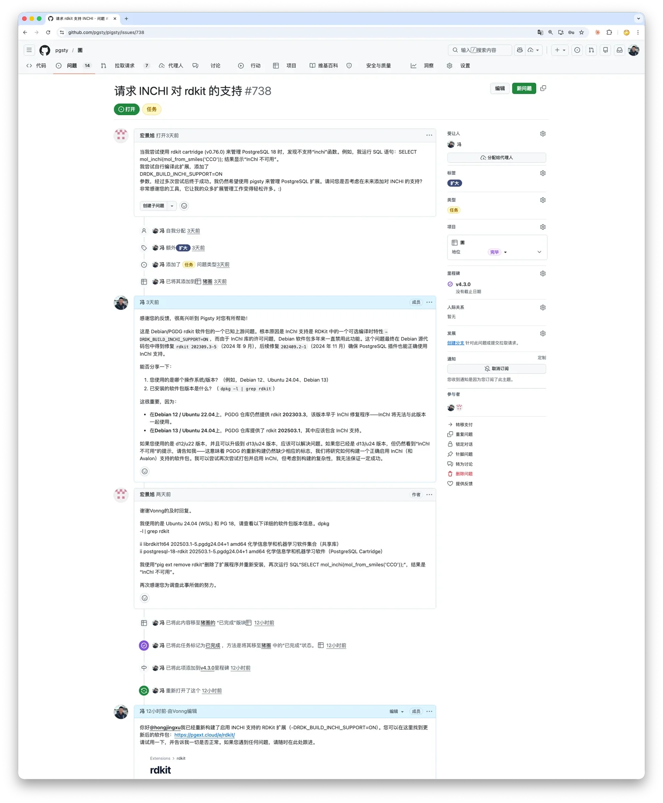
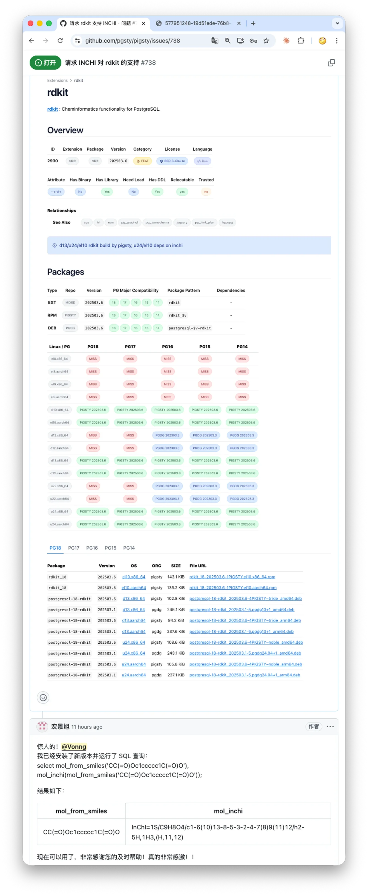

一个 Issue ，引发扩展马拉松；32 个新扩展告诉你，PostgreSQL 正在变成什么；504 个扩展，PostgreSQL 生态的天花板在哪？


--------

## 从一个化学扩展说起

两天前，一位用户在 GitHub 上给我提了个 [Issue](https://github.com/pgsty/pigsty/issues/738)：他在用 RDKit —— 化学信息学领域的事实标准库，能在 PostgreSQL 里做分子结构存储、子结构检索和相似性计算。
但他发现 PGDG 官方打包的版本缺了 InChI 功能，他自己折腾了半天，加上编译参数后总算跑通了，但还是希望 Pigsty 能原生支持。

[](https://github.com/pgsty/pigsty/issues/738)

但 RDKit 确实是个硬骨头。大约两年前我就试过一次，想把它收进 Pigsty 的扩展仓库，从 Debian 移植到 EL。
结果依赖太多了：Boost、Eigen、RapidJSON、Cairo，外加 InChI、Avalon 等可选模块，
每个都有自己的编译开关和操作系统默认库版本兼容问题。折腾了一会没跑通，就先搁置了。

但这次不一样。**有 Coding Agent 了。**

用 Codex / Claude Code 处理这类"构建系统考古"任务简直是降维打击 —— 以前需要反复试错的东西，现在基本一两轮对话然后等着就行了。
这次发布，把 PGDG 打包到 InChI 支持的问题也一并解决了，本质上就是编译时多开一个标志位再带上 InChI 源码。一把过，用户也很满意。



说实话，看到这种反馈挺开心的。做开源最爽的就是这个时候。


---------

## 趁热打铁

既然手热了，我就顺便把积压已久的几个"历史疑难杂症"也一起清了。

[**`plv8`**](https://pigsty.cc/ext/e/plv8)：V8 引擎的 PostgreSQL 绑定，之前在 EL10 上死活编译不过，这次打了好几个补丁终于搞定了稳定构建。

[**`duckdb_fdw`**](https://pigsty.cc/ext/e/duckdb_fdw)：允许从 PG 内部读写外部 DuckDB 文件，但之前会和 DuckDB 官方的 pg_duckdb 扩展争抢共享库，我只能忍痛临时隐藏。这次把 duckdb_fdw 挂成了 pg_duckdb 的子扩展，共享同一份 libduckdb，冲突问题优雅解决，俩扩展又能并存了。

然后我就想：既然工具链都热好了，不如把 PostgreSQL 生态里剩下那些值得收录但一直没啃的扩展也一并搞进来吧。
于是就有了这次的大更新 —— 新增 32 个扩展，更新 22 个，**Pigsty 扩展仓库总数正式突破 500，达到 504 个**。

> [扩展目录: pigsty.cc/ext](https://pigsty.cc/ext)

| **分类**     | **All** | **PGDG** | **PIGSTY** | **CONTRIB** | **MISS** | **PG18** | **PG17** | **PG16** | **PG15** | **PG14** |
|:-----------|--------:|---------:|-----------:|------------:|---------:|---------:|---------:|---------:|---------:|---------:|
| **全部**     |     504 |      155 |        332 |          71 |        0 |      481 |      488 |      479 |      473 |      457 |
| **EL**     |     499 |      150 |        332 |          71 |        5 |      472 |      482 |      474 |      468 |      452 |
| **Debian** |     489 |      107 |        311 |          71 |       15 |      466 |      474 |      464 |      458 |      442 |

这五百个扩展中，一部分是 PG 自带的扩展（70个），PGDG 官方打包的扩展（150 个），剩下的 330 个都是老冯自己收录，打包，维护构建的第三方扩展。
基本上，Pigsty 在这个赛道上已经做到了前无古人，后无来者了。

这是啥概念？一般 RDS PG 上也就是几十个扩展。比如最近火爆的 Supabase 上，去掉 PG 自带的的 35 个 Contrib 扩展，实际上也就提供了 30 个不到的第三方 PG 扩展。


------

## 新扩展

这批新增扩展的画风相当硬核。按大类可以分四组：

**数据域扩展**：把化学分子、RDF 三元组、BSON、Protobuf、循环日程这些"复杂对象"变成数据库一等公民；

**查询能力扩展**：稀疏线代与图算法、Datalog 图查询、全文检索、混合排序融合、递归 SQL 模板引擎；

**生产工程扩展**： 深度可观测性、查询遥测导出、CDC 到 MQTT、COPY 命令拦截、DDL 逻辑复制补全、轻量分布式锁、软告警式数据质量管理；

**开发者体验扩展**： 会话变量、伪自治事务日志、自然语言时间解析

这些扩展共同指向一个趋势：PostgreSQL 的扩展层正在把数据库推向应用与数据平台的中间地带。很多原本需要独立服务才能解决的问题，现在可以在一条 SQL 事务边界内搞定。

这就是 PostgreSQL 极致可扩展性的魅力所在。


--------

# 新扩展大观园

这次新加入了 32 个新扩展，下面的部分是请 Claude/Codex/Gemini 三剑客进行研究汇总摘要，用于帮助读者快速了解每个扩展的核心功能、技术实现和适用场景。


-------

## 1. rdkit: 把化学信息学搬进 PostgreSQL

> [**`rdkit`**](https://pigsty.cc/ext/e/rdkit) | [**GitHub**](https://github.com/rdkit/rdkit)

RDKit 是开源化学信息学领域的事实标准库，由 Greg Landrum 发起（最初在 Novartis，现属 T5 Informatics），其 PostgreSQL cartridge 模块将分子结构存储、子结构检索和相似性计算直接带入关系数据库。对于制药公司和化学研究机构而言，这意味着可以用标准 SQL 查询数百万化合物，无需借助外部工具链。

RDKit cartridge 引入了两组核心数据类型：**`mol`**（分子）和 **`qmol`**（查询分子，即 SMARTS 模式），以及 `bfp`/`sfp`（位指纹/稀疏指纹）。操作符方面，`@>` 用于子结构匹配，`%` 用于 Tanimoto 相似性判断，`<%>` 作为距离运算符。所有这些操作都可以通过 **GiST 索引**加速——索引内部基于指纹筛选进行快速预过滤，再做精确匹配。关键函数包括 `mol_from_smiles()`、`morganbv_fp()`（Morgan 指纹）、`tanimoto_sml()` 等，配合 `rdkit.tanimoto_threshold` 等 GUC 参数可以调节检索灵敏度。

以 ChEMBL 数据库（187 万化合物）为例：

```sql
-- 子结构检索：查找含有特定骨架的分子
SELECT count(*) FROM rdk.mols WHERE m @> 'c1cccc2c1nncc2';
-- 结果：461 个匹配，耗时约 108ms

-- Tanimoto 相似性搜索：基于 Morgan 指纹
SELECT molregno, tanimoto_sml(morganbv_fp(mol_from_smiles('c1ccccc1C(=O)NC'::cstring)), mfp2) AS similarity
FROM rdk.fps JOIN rdk.mols USING (molregno)
WHERE morganbv_fp(mol_from_smiles('c1ccccc1C(=O)NC'::cstring)) % mfp2
ORDER BY morganbv_fp(mol_from_smiles('c1ccccc1C(=O)NC'::cstring)) <%> mfp2;

-- SMARTS 模式匹配：查找噁二唑或噻二唑类化合物
SELECT * FROM rdk.mols WHERE m @> 'c1[o,s]ncn1'::qmol LIMIT 500;
```

应用场景集中在药物研发的几个关键环节：**先导化合物骨架搜索**（在百万级化合物库中做子结构匹配）、**SAR 分析**（通过相似性检索寻找活性类似物）、**化合物注册系统**（利用结构指纹做重复性检查）、以及**商业化合物目录检索**（如 eMolecules 的 600 万+化合物数据集）。

工程落地时需要注意：cartridge 的重点不在"能不能算"，而在"能不能被索引、能不能被 planner 正确利用"。索引策略与查询模板需要提前固定下来，否则很容易写出正确但慢的结构过滤。在 187 万化合物上子结构检索耗时在 88ms 至 1900ms 之间，经过优化可以处理 **600 万+化合物**规模的数据集。BSD 许可证，Docker 镜像（如 `mcs07/postgres-rdkit`）和 conda 安装均已就绪。


-------

## 2. provsql: 半环溯源让查询结果"可追溯"

> [**`provsql`**](https://pigsty.cc/ext/e/provsql) | [**GitHub**](https://github.com/PierreSenellart/provsql)

ProvSQL 由巴黎高等师范学校教授 Pierre Senellart 和 INRIA Valda 团队开发，发表于 VLDB 2018。它为 PostgreSQL 添加 **(m-)半环溯源（semiring provenance）** 和不确定性管理——能自动追踪每个查询结果是由哪些基础元组"推导"出来的，并支持在不同代数结构（布尔、安全等级、计数、概率）下对溯源信息进行求值。

核心机制是通过 PostgreSQL hook 拦截查询执行，为每个表自动添加一个隐藏的 `provsql` 列，存储指向溯源电路（provenance circuit）的 UUID。支持的 SQL 子集相当广泛：SELECT-FROM-WHERE、JOIN、GROUP BY、DISTINCT、UNION/EXCEPT、聚合、HAVING，甚至在 PG 14+ 上支持 INSERT/DELETE/UPDATE 的溯源追踪。核心函数包括 `add_provenance()` 启用追踪、`provenance_evaluate()` 对溯源进行求值、`formula()` 输出布尔公式、`probability_evaluate()` 计算概率。概率求值支持多种算法：从朴素求值到 Monte-Carlo 采样，再到 d-DNNF 编译（借助 `d4`、`c2d` 等外部求解器）。

```sql
-- 安全等级传播：查询结果自动继承最高安全级别
SELECT create_provenance_mapping('personnel_level', 'personnel', 'classification');
SELECT p1.city, security(provenance(), 'personnel_level')
FROM personnel p1, personnel p2
WHERE p1.city = p2.city AND p1.id < p2.id
GROUP BY p1.city ORDER BY p1.city;

-- 布尔公式溯源：每个结果行显示其推导公式
SELECT *, formula(provenance(), 'witness_mapping') FROM s;

-- 概率查询：计算每条结果的可信度
SELECT city, probability_evaluate(provenance()) FROM result;
```

ProvSQL 适合四类场景：**安全分级传播**——查询结果自动继承源数据中最高的安全等级；**概率数据库**——当基础数据带有可信度评分时，计算查询结果的正确概率；**数据血缘审计**——精确追踪每个结果行来源于哪些源元组，并支持 PROV-XML 标准导出；**可信度评估**——例如在刑事调查场景中，通过溯源加权评估目击者陈述的可靠性。

ProvSQL 的价值往往体现在"可组合性"：溯源结果不是字符串日志，而是可以继续被函数处理的对象。建议用于关键链路（核心报表/模型特征/合规计算），而非全库无差别开启。C/C++ 实现（依赖 Boost 库），溯源电路存储在共享内存中。支持 PG 10–18，MIT 许可证。


-------

## 3. one_sparse: 在 SQL 里跑十亿边级图算法

> [**`one_sparse`**](https://pigsty.cc/ext/e/onesparse) | [**GitHub**](https://github.com/OneSparse/OneSparse)

OneSparse 将高性能稀疏线性代数带入 PostgreSQL，封装了 SuiteSparse:GraphBLAS 库。开发者 Michel Pelletier 是 GraphBLAS C API 委员会成员，顾问团队包括 SuiteSparse 作者 Timothy A. Davis 教授（SIAM/ACM/IEEE Fellow）。核心理念是**将图表示为稀疏矩阵**，用矩阵乘法实现 BFS、PageRank、三角中心性等图算法——而这一切都在 SQL 中完成。

扩展引入了 `matrix`（稀疏矩阵）、`vector`（稀疏向量）、`scalar`、`semiring`、`monoid` 等数据类型，以及 `@`（矩阵乘法/plus_times 半环）等操作符。图算法方面内置了 BFS（层级和父节点两种模式）、PageRank、三角中心性、度中心性、单源最短路径等，均来自 LAGraph 库。技术上，它将 GraphBLAS 的不透明句柄封装在 PostgreSQL 的 Expanded Object Header 结构中，小图（<1GB）使用 TOAST 存储，大图支持 Large Object 或文件系统。内置 JIT 编译器支持 **NVIDIA CUDA GPU 加速**。

```sql
-- 从 Matrix Market 文件加载图
SELECT mmread('/home/postgres/onesparse/demo/karate.mtx') AS graph;

-- BFS 遍历
SELECT (bfs(graph, 1)).level FROM karate;

-- 度中心性（矩阵列归约）
SELECT reduce_cols(cast_to(graph, 'int32')) AS degree FROM karate;

-- PageRank
SELECT pagerank(graph) FROM karate;
```

在 GAP benchmark 上，对 **43 亿边**的图执行 BFS 时达到了 **每秒 70 亿+边**的吞吐量（48 核 AMD EPYC 服务器）。应用场景包括金融反欺诈（交易网络环检测）、社交网络分析、Graph RAG 等。不过，这类扩展是否"真好用"，取决于数据装载/序列化格式是否与现有管道匹配，以及算子能否与 SQL Planner/并行执行相处融洽——建议先用小规模样例把端到端链路跑通。

OneSparse 要求 **PG 18 Beta 或更新版本**，当前处于 Alpha 阶段。Apache 2.0 许可证。


-------

## 4. pg_datasentinel: 容器时代的 PostgreSQL 深度可观测性

> [**`pg_datasentinel`**](https://pigsty.cc/ext/e/pg_datasentinel) | [**GitHub**](https://github.com/datasentinel/pg_datasentinel)

pg_datasentinel 由 Datasentinel 公司的 Christophe Reveillère 开发，于 2026 年 4 月 10 日发布 1.0 版本。它为 PostgreSQL 添加了四大可观测性能力，填补了原生监控视图在容器化环境和运维预警方面的空白。

第一，**扩展活动监控**：在 `pg_stat_activity` 基础上增加每个后端进程的内存使用量、实时临时文件字节数，以及在 PG 18+ 上显示当前执行计划 ID。第二，**容器资源可见性**：报告 CPU 配额、内存限制、当前内存使用和 CPU 压力，适用于 Docker、Kubernetes、OpenShift 或任何 cgroup 管理的环境。第三，**事务回卷风险预估**：追踪 XID 和 MXID 消耗速率，提供到 aggressive-vacuum 和回卷限制的**实时 ETA**。第四，**日志捕获视图**：将 vacuum、analyze、临时文件、checkpoint 事件记录到共享内存环形缓冲区，解析为结构化计数和计时信息，支持实时 SQL 查询。

```sql
-- 查看每个后端的内存使用（扩展 pg_stat_activity）
SELECT pid, usename, query, backend_memory_bytes, temp_file_bytes
FROM pg_datasentinel_activity;

-- 容器资源监控
SELECT cpu_quota, memory_limit, memory_usage, cpu_pressure
FROM pg_datasentinel_container_resources;

-- 事务回卷风险预估
SELECT xid_current, xid_limit, xid_eta_aggressive_vacuum, xid_eta_wraparound
FROM pg_datasentinel_wraparound;
```

对于在 Kubernetes 上运行 PostgreSQL 的团队，pg_datasentinel 提供了无需外部监控代理即可获得的容器级资源可见性。**XID 回卷预警**功能对运维尤为关键——众所周知，XID 回卷会导致数据库强制关闭，而 pg_datasentinel 通过追踪消耗速率提供预测性告警，将"救火"变为"防火"。3-Clause BSD 许可证，要求 PG 15+。


-------

## 5. datasketches: Apache 出品的亿级近似分析利器

> [**`datasketches`**](https://pigsty.cc/ext/e/datasketches) | [**GitHub**](https://github.com/apache/datasketches-postgresql)

Apache DataSketches 是 Apache 基金会项目（源自 Yahoo/Verizon Media），其 PostgreSQL 扩展将多种**近似分析数据结构（Sketch）**引入 SQL 世界。核心问题很明确：在海量数据上做精确的 COUNT(DISTINCT)、分位数计算和频繁项统计太慢或太耗内存。

扩展提供七种 Sketch 类型：**`cpc_sketch`**（Compressed Probabilistic Counting）、**`hll_sketch`**（HyperLogLog）、**`theta_sketch`**（支持集合交并差运算的去重计数）、`aod_sketch`（Tuple sketch）、**`kll_float_sketch`/`kll_double_sketch`**（分位数估算）、`req_float_sketch`（尾部高精度分位数）、`frequent_strings_sketch`（频繁项）。每种 Sketch 都提供 `*_sketch_build()`、`*_sketch_union()`、`*_sketch_get_estimate()` 等标准接口。

关键点不是"有个函数返回估计值"，而是 Sketch 作为**可序列化对象可以被聚合合并**，因此特别适合数据立方体式的近似指标：按维度切片预聚合 Sketch，查询时按任意维度组合做 union 即可得到去重数。Sketch 在内存中是**亚线性**的，且可跨语言（Java、C++、Python、Rust、Go）做二进制兼容序列化。

```sql
-- 近似去重计数：比精确 COUNT(DISTINCT) 快约 6 倍
SELECT cpc_sketch_distinct(id) FROM random_ints_100m;
-- 结果：63423695（精确值：63208457），耗时 ~20s vs 精确 ~2min

-- Theta Sketch 集合运算：计算两个用户群体的交集
SELECT theta_sketch_get_estimate(
  theta_sketch_intersection(sketch1, sketch2)
) FROM theta_set_op_test;

-- KLL 分位数估算：获取中位数
SELECT kll_float_sketch_get_quantile(sketch, 0.5) FROM kll_float_sketch_test;

-- 多维度聚合 + Sketch 合并
SELECT cpc_sketch_get_estimate(cpc_sketch_union(respondents_sketch)) AS num_respondents, flavor
FROM (
  SELECT cpc_sketch_build(respondent) AS respondents_sketch, flavor, country
  FROM (VALUES (1,'Vanilla','CH'),(1,'Chocolate','CH'),
               (2,'Chocolate','US'),(2,'Strawberry','US')) AS t(respondent, flavor, country)
  GROUP BY flavor, country
) bar GROUP BY flavor;
```

典型应用：**实时 UV 统计**——不存储用户 ID 即可跨时间窗口合并去重；**分布分析**——在数十亿事件上计算 p50/p95/p99 延迟而无需排序；**受众重叠分析**——用 Theta Sketch 的交集运算计算"看过广告 A 且访问过网站 B"的用户数。在 1 亿行数据上，CPC Sketch 的去重计数约 20 秒完成（精确 COUNT(DISTINCT) 约 2 分钟），相对误差在个位数百分比范围内。


-------

## 6. pghydro: 巴西国家水务局的排水网络分析引擎

> [**`pghydro`**](https://pigsty.cc/ext/e/pghydro) | [**GitHub**](https://github.com/pghydro/pghydro)

PgHydro 由巴西国家水务卫生局（ANA）的 GIS 专家 Alexandre de Amorim Teixeira 开发，构建在 PostGIS 之上，被 ANA 作为水资源管理的官方工具在全国范围内使用，也在 FOSS4G 2022 上做过展示。

核心能力围绕水文网络的完整工作流展开：从原始 GIS 数据的导入和一致性校验，到流向计算、**Otto Pfafstetter 流域编码**（一种国际通用的分层流域分类系统）、上下游分析、汇水面积计算、Strahler 河流分级等。架构上采用模块化设计，包含五个子扩展：`pghydro`（核心）、`pgh_raster`（DEM 栅格分析）、`pgh_hgm`（水文地貌特征）、`pgh_consistency`（拓扑一致性校验）和 `pgh_output`（数据导出）。

```sql
-- 导入排水线数据
SELECT pghydro.pghfn_input_data_drainage_line('public', 'input_drainage_line', 'geom', 'nome');

-- 计算流向并反转不一致的河段
SELECT pghydro.pghfn_CalculateFlowDirection();
SELECT pghydro.pghfn_ReverseDrainageLine();

-- 计算 Pfafstetter 流域编码
SELECT pghydro.pghfn_Calculate_Pfafstetter_Codification();

-- 计算上游汇水面积和到入海口距离
SELECT pghydro.pghfn_CalculateUpstreamArea();
SELECT pghydro.pghfn_CalculateDistanceToSea(0);

-- Strahler 河流分级
SELECT pghydro.pghfn_calculatestrahlernumber();
```

适用于国家级水文数据库管理、流域规划与编码、上下游污染影响分析（如确定某污染源上游的所有河段）、以及排水网络拓扑一致性验证。它更像一套专业领域的数据库内 ETL/分析流水线——数据在 PostGIS 中管理，分析过程可在 SQL 里自动化，当原始地形/河网数据更新时，按函数流水线重算比手动脚本更可靠。配合 QGIS 的 PgHydroTools 插件可实现可视化操作。完全用 PL/pgSQL 编写，GPLv2 许可证。


-------

## 7. pg_stat_ch: ClickHouse 官方出品的 PostgreSQL 查询遥测

> [**`pg_stat_ch`**](https://pigsty.cc/ext/e/pg_stat_ch) | [**GitHub**](https://github.com/ClickHouse/pg_stat_ch)

pg_stat_ch 由 ClickHouse 公司开发并开源（2025 年 2 月，"Postgres Week at ClickHouse"活动），作者是 Kaushik Iska。与 pg_stat_statements 在 PostgreSQL 内部做聚合统计不同，pg_stat_ch 将**每条查询的原始执行事件**（包含 45 个字段、固定 4.6KB）实时流式导出到 ClickHouse，让所有聚合分析（p50/p95/p99、Top 查询、错误分析）在 ClickHouse 的分析引擎中完成。

数据管道架构为：**PostgreSQL Hooks（前台）→ 共享内存环形缓冲区 → 后台 Worker → ClickHouse**。45 个遥测字段覆盖查询计时、行数、缓冲区使用、WAL 使用、CPU 时间、JIT 指标（PG15+）、并行 Worker 统计（PG18+）、客户端上下文（应用名、IP）、错误捕获（SQLSTATE 码）等。扩展使用 ClickHouse 原生二进制协议加 **LZ4 压缩**，静态链接 clickhouse-cpp 库。为避免对 PostgreSQL 造成背压，队列溢出时丢弃事件（计数器记录丢弃数）而非减慢数据库——与 StatsD 的设计哲学一致。

```sql
-- PostgreSQL 侧：监控扩展健康状态
SELECT * FROM pg_stat_ch_stats();
-- 返回：enqueued, exported, dropped 计数，最后成功/失败时间戳

-- ClickHouse 侧：过去 1 小时按应用统计 p95/p99
SELECT query_id, count() AS calls,
       quantile(0.95)(duration_us) / 1000 AS p95_ms,
       quantile(0.99)(duration_us) / 1000 AS p99_ms
FROM pg_stat_ch.events_raw
WHERE app = 'myapp' AND ts_start > now() - INTERVAL 1 HOUR
GROUP BY query_id ORDER BY p99_ms DESC LIMIT 10;
```

ClickHouse 侧预置了四个物化视图：`events_recent_1h`（滚动 1 小时副本）、`query_stats_5m`（5 分钟桶 + TDigest 分位数）、`db_app_user_1m`（按数据库/应用/用户的负载归因）、`errors_recent`（7 天滚动错误窗口）。

性能令人印象深刻：**p99 开销约 5μs/条**，在 pgbench 32 客户端 36.6K TPS 下，30 秒内捕获 770 万事件且零丢弃，对 TPS 影响 **<1%**（36,658 vs 36,913 基线）。三层锁争用最小化策略：原子溢出检查 → 非阻塞 LWLock 尝试 → 每后端本地缓冲区（每事务刷新，减少约 5 倍锁获取次数）。把 PostgreSQL 做成"事务系统"，ClickHouse 做成"遥测仓库"，职责分离，比从日志文件逆向解析稳定得多。支持 PG 16–18，Apache 2.0 许可证。


-------

## 8. pg_rrf: 一个函数搞定混合检索的排序融合

> [**`pg_rrf`**](https://pigsty.cc/ext/e/pg_rrf) | [**GitHub**](https://github.com/yuiseki/pg_rrf)

pg_rrf 由日本开发者 yuiseki 开发（2026 年 1 月发布），用 Rust（pgrx）实现。它将 **Reciprocal Rank Fusion（RRF）** 封装为原生 PostgreSQL 函数，解决混合检索场景中"分数不可比"的工程痛点：不同检索器输出尺度不同，直接加权不好调，而 RRF 只依赖 rank。公式为 `score(d) = Σ 1/(k + rank_i(d))`，k 默认 60（Cormack et al., SIGIR 2009）。

扩展提供四个函数：`rrf(rank_a, rank_b, k)` 计算两路融合分数、`rrf3()` 三路融合、`rrfn(ranks[], k)` N 路融合、以及最实用的 **`rrf_fuse(ids_a bigint[], ids_b bigint[], k)`**——接收两个排序后的 ID 数组，返回融合后的 (id, score) 表。NULL 安全：只在一路出现的 ID 仅使用该路的排名计算得分。

```sql
-- 使用 pg_rrf 的混合检索：pgvector + BM25
WITH fused AS (
  SELECT * FROM rrf_fuse(
    ARRAY(SELECT id FROM docs ORDER BY bm25_score DESC LIMIT 100),
    ARRAY(SELECT id FROM docs ORDER BY embedding <=> :qvec LIMIT 100),
    60
  )
)
SELECT d.*, fused.score
FROM fused JOIN docs d USING (id)
ORDER BY fused.score DESC LIMIT 20;
```

这将原本需要 FULL OUTER JOIN + COALESCE 链 + 手动评分公式的 20+ 行 CTE 压缩为一个函数调用。应用场景覆盖 **RAG 混合检索**（语义搜索 + 全文搜索融合）、电商产品搜索、多信号文档排序等。把融合逻辑移到数据库侧，尤其当结果要继续 JOIN 业务表时，减少了应用层拼接与排序的开销。当前 v0.0.3，MIT 许可证。


-------

## 9. pg_kazsearch: 哈萨克语全文检索的"从无到有"

> [**`pg_kazsearch`**](https://pigsty.cc/ext/e/pg_kazsearch) | [**GitHub**](https://github.com/darkhanakh/pg-kazsearch)

pg_kazsearch 是首个 PostgreSQL 哈萨克语全文检索扩展。哈萨克语是高度黏着语（agglutinative），一个词如 `мектептерімізде` 承载了复数、领属、位格等多层后缀，必须全部剥离才能到达词根 `мектеп`。现有的 PostgreSQL 或 Elasticsearch 分析器都无法处理这一点。

扩展用 Rust（pgrx）实现，提供 `kazakh_cfg` 文本搜索配置和 `pg_kazsearch_dict` 词典。词干提取算法采用 **BFS 后缀剥离**，配合元音和谐验证和基于 Apertium-kaz 的 **21,863 个词性标注词根词典**防止过度词干化。运行时可通过 `ALTER TEXT SEARCH DICTIONARY` 调整权重参数。

```sql
-- 词干提取
SELECT ts_lexize('pg_kazsearch_dict', 'алмаларымыздағы');
-- {алма}

-- 构建带权重的 tsvector 并检索
SELECT title FROM articles
WHERE fts @@ websearch_to_tsquery('kazakh_cfg', 'президенттің жарлығы')
ORDER BY ts_rank_cd(fts, websearch_to_tsquery('kazakh_cfg', 'президенттің жарлығы')) DESC
LIMIT 10;
```

在 2,999 篇文章上的基准测试显示：查询延迟 **0.5ms**（比 pg_trgm 快 2.8 倍），nDCG@10 提升 25%，Recall@10 提升 23%。适用于哈萨克语新闻/政府文档检索、电商搜索等场景——在多语种系统里把"低资源语言"检索能力补齐，避免回退到粗糙的 trigram 模糊匹配。


-------

## 10. pg_liquid: Datalog 风格的图查询

> [**`pg_liquid`**](https://pigsty.cc/ext/e/pg_liquid) | [**GitHub**](https://github.com/michael-golfi/pg_liquid)

pg_liquid 由 Michael Golfi 开发，把 Liquid/Datalog 风格的声明式图查询带进 PostgreSQL。你可以用 `liquid.query(...)` 在一次调用里声明事实、定义规则并执行终止查询，不必单独搭图数据库。规则是 query-local（只在一次 `liquid.query` 中有效），支持事实断言、**递归传递闭包**、复合查询（compounds）和行规范化器。

```sql
SELECT target
FROM liquid.query($$
  Edge("a", "path", "b").
  Edge("b", "path", "c").
  Edge("c", "path", "d").

  Reach(x, y) :- Edge(x, "path", y).
  Reach(x, z) :- Reach(x, y), Reach(y, z).

  Reach("a", target)?
$$) AS t(target text)
ORDER BY 1;
```

它还支持把本体谓词定义（如 `DefPred`）与 compound（如 `OntologyClaim@(...)`）结合，用 compound 携带溯源/置信信息，靠规则做 subclass closure 等推理。适合知识图谱查询、层级数据遍历（组织架构、分类树）、基于规则的业务逻辑系统等场景——当你不想引入独立图引擎时，用扩展把最关键的递归查询补上。完全用 PL/pgSQL 实现，无外部依赖，项目处于早期阶段。


-------

## 11. logical_ddl: 让逻辑复制也能同步 DDL

> [**`logical_ddl`**](https://pigsty.cc/ext/e/logical_ddl) | [**GitHub**](https://github.com/samedyildirim/logical_ddl)

PostgreSQL 的逻辑复制只处理 DML（INSERT/UPDATE/DELETE），不处理 DDL（ALTER TABLE 等），这是运维中的一大痛点——表结构不同步会直接中断复制。logical_ddl 由 Samed Yildirim 开发，通过**事件触发器**拦截 DDL 命令，将其反解析并保存到可被逻辑复制传播的表中，订阅端接收后生成等效 SQL 并执行。

支持的 DDL 操作包括：ALTER TABLE RENAME TO/RENAME COLUMN/ADD COLUMN/ALTER COLUMN TYPE/DROP COLUMN。数据类型兼容性方面：内建类型、数组、复合/域/枚举类型可用，但这些类型的"定义复制"（如 CREATE TYPE）不在覆盖范围内。可通过 `logical_ddl.publish_tablelist` 按表和命令类型精细控制捕获范围。

```sql
-- 发布端配置
INSERT INTO logical_ddl.settings (publish, source) VALUES (true, 'publisher1');

-- 将逻辑复制中的所有表加入 DDL 追踪
INSERT INTO logical_ddl.publish_tablelist (relid)
SELECT prrelid FROM pg_catalog.pg_publication_rel;

-- 按表指定捕获的 DDL 类型
INSERT INTO logical_ddl.publish_tablelist (relid, cmd_list)
VALUES ('my_table'::regclass, ARRAY['ADD COLUMN', 'DROP COLUMN']);
```

适用于逻辑复制环境的自动化 DDL 同步、零停机迁移、多数据中心 PostgreSQL 架构等。把"DDL 同步"从流程管理变成可审计的数据流，降低复制事故概率。MIT 许可证，PGXN 可用。约束、索引、默认值等尚未实现。


-------

## 12. rdf_fdw: 用 SQL 查询语义网

> [**`rdf_fdw`**](https://pigsty.cc/ext/e/rdf_fdw) | [**GitHub**](https://github.com/jimjonesbr/rdf_fdw)

rdf_fdw 由 Jim Jones 开发，是一个通过 SPARQL 端点访问 RDF 三元组存储的 Foreign Data Wrapper，架起关系型 SQL 世界与语义网/关联数据世界之间的桥梁。它引入 `rdfnode` 数据类型处理 RDF 术语（IRI、语言标签、数据类型），支持 WHERE/LIMIT/ORDER BY/DISTINCT 等条件的 **SQL-to-SPARQL 下推**，以及通过 SPARQL UPDATE 端点执行 INSERT/UPDATE/DELETE。

```sql
-- 创建指向 DBpedia 的外部服务器
CREATE SERVER dbpedia
  FOREIGN DATA WRAPPER rdf_fdw
  OPTIONS (endpoint 'https://dbpedia.org/sparql');

-- 创建外部表映射 SPARQL 查询
CREATE FOREIGN TABLE dbpedia_query (
    p rdfnode OPTIONS (variable '?p'),
    o rdfnode OPTIONS (variable '?o')
) SERVER dbpedia OPTIONS (
    sparql 'SELECT ?p ?o WHERE {<http://dbpedia.org/resource/Berlin> ?p ?o}'
);

-- 用标准 SQL 查询 RDF 数据
SELECT * FROM dbpedia_query WHERE o = 'some_value' LIMIT 10;
```

`rdf_fdw_clone_table()` 存储过程支持将外部表数据分批克隆到本地表。需要注意的是，实现层面会把拉取到的数据加载到内存再转换，面对大体量数据要谨慎评估内存与下推效果。适合关联数据集成（DBpedia、Wikidata）、用 SQL/BI 工具链直接消费 SPARQL 端点等场景。MIT 许可证，支持 PG 9.5–18。


-------

## 13. pgbson: 比 JSONB 更精确的二进制文档类型

> [**`pgbson`**](https://pigsty.cc/ext/e/pgbson) | [**GitHub**](https://github.com/buzzm/postgresbson)

pgbson（postgresbson）由 buzzm 开发，为 PostgreSQL 引入原生 **BSON（Binary JSON）数据类型**。BSON 相比 JSON 提供了一等公民的 datetime、decimal128、int32/int64、binary 等类型，解决了 JSON 在分布式系统数据交换中的精度丢失和类型模糊问题，保证**二进制完美往返**（BSON in = BSON out）。

核心 API 是两类访问方式：一类是高性能的 **dotpath 函数**——`bson_get_string(bson, 'd.recordId')`、`bson_get_datetime()`、`bson_get_decimal128()` 等，直接在底层结构上行走，只在终点分配内存；另一类是类似 JSON 的 `->` / `->>` 链式操作符，但每一步都要构造中间子结构，深层路径会放大成本。两者配合 B-Tree 和 HASH 索引，函数索引可实现 **10,000 倍**的查询加速（相对于顺序扫描）。输入端支持 EJSON 格式。

```sql
-- 插入带丰富类型的 EJSON 文档
INSERT INTO data_collection (data) VALUES (
   '{"d":{"recordId":"R1","amt":{"$numberDecimal":"77777809838.97"},
          "ts":{"$date":"2022-03-03T12:13:14.789Z"}}}');

-- 函数索引 + dotpath 查询（推荐方式）
CREATE INDEX ON data_collection(bson_get_string(data, 'd.recordId'));
SELECT bson_get_decimal128(data, 'd.amt')
FROM data_collection WHERE bson_get_string(data, 'd.recordId') = 'R1';

-- 箭头链式访问（深层路径性能较差）
SELECT (data->'d'->'amt'->>'$numberDecimal')::numeric FROM data_collection;
```

典型场景包括跨语言事件/文档管道（Java → Kafka → Python → PostgreSQL）的精确类型保持、金融数据（decimal128 精确到分）、数字签名（BSON 的确定性二进制格式支持可靠哈希）等。MIT 许可证，支持 PG 14–18。


-------

## 14. pg_when: 用自然语言描述时间

> [**`pg_when`**](https://pigsty.cc/ext/e/pg_when) | [**GitHub**](https://github.com/frectonz/pg-when)

pg_when 由 frectonz 开发，把自然语言时间表达解析成 PostgreSQL 的 `timestamptz` 或 epoch。核心函数 `when_is(text)` 返回标准 timestamp，语法由三部分组成：日期 + `at` + 时间 + `in` + 时区。未指定时区时默认 UTC。

```sql
SELECT when_is('5 days ago at this hour in Asia/Tokyo');
SELECT when_is('next friday at 8:00 pm in America/New_York');
SELECT when_is('in 2 months at midnight in UTC-8');
SELECT when_is('December 31, 2026 at evening');
```

另有 `seconds_at()`、`millis_at()`、`micros_at()`、`nanos_at()` 返回 UNIX 时间戳的不同精度。这不是调度器，而是解析器。适用于面向运营/客服的"人类时间输入"落库、数据修复/回填脚本中用自然语言代替拼日期函数、以及统一时区处理等场景。MIT 许可证。


-------

## 15. pgmqtt: 数据库变更直推 MQTT

> [**`pgmqtt`**](https://pigsty.cc/ext/e/pgmqtt) | [**GitHub**](https://github.com/RayElg/pgmqtt)

pgmqtt 由 RayElg 开发（Rust 实现），把 PostgreSQL 的变更（INSERT/UPDATE/DELETE）通过 CDC 直接变成 MQTT 消息推给订阅者，同时也支持 MQTT 入站消息按映射写回表。它不是通用 MQTT 客户端，而是把"变更流"与"消息 broker"嵌到数据库侧，用 SQL 配置 topic 映射与 payload 模板。

```sql
-- 出站：表变更 → MQTT topic（支持模板化 topic 和 JSON payload）
SELECT pgmqtt_add_outbound_mapping(
  'public', 'my_table', 'topics/{{ op | lower }}', '{{ columns | tojson }}'
);

-- 入站：MQTT topic → 表（JSONPath 规则映射到列）
SELECT pgmqtt_add_inbound_mapping(
  'sensor/{site_id}/temperature', 'sensor_readings',
  '{"site_id": "{site_id}", "value": "$.temperature"}'::jsonb
);
```

IoT 场景尤其合适——无需外部中间件即可将数据库状态变化推送到边缘设备，或将传感器数据通过 MQTT 协议直接写入表。也适用于事件驱动架构中的轻量消息分发，减少应用层的 glue code。Elastic License 2.0。


-------

## 16. pg_query_rewrite: 透明地偷梁换柱

> [**`pg_query_rewrite`**](https://pigsty.cc/ext/e/pg_query_rewrite) | [**GitHub**](https://github.com/pierreforstmann/pg_query_rewrite)

pg_query_rewrite 由 Pierre Forstmann 开发，利用 ProcessUtility hook 实现 SQL 语句的运行时透明替换。规则基于**精确字符串匹配**（大小写和空格敏感）存储在共享内存中。

```sql
-- 添加重写规则
SELECT pgqr_add_rule('select 10;', 'select 11;');

-- 此后执行 "select 10;" 将返回 11
SELECT 10;  -- 返回 11

-- 查看所有规则及重写计数
SELECT pgqr_rules();
```

这是一个"很锋利"的工具：不支持带参数的语句、最大长度约 32KB、匹配对大小写/空格/分号敏感、规则不持久化（重启丢失，需借助启动 SQL 机制恢复）。适用于数据库迁移期间对历史系统发出的固定 SQL 做透明重定向、危险查询临时拦截、查询 A/B 测试等。默认最多 10 条规则，支持 PG 9.5–18。


-------

## 17. pgclone: 一键克隆数据库对象

> [**`pgclone`**](https://pigsty.cc/ext/e/pgclone) | [**GitHub**](https://github.com/valehdba/pgclone)

pgclone 由 valehdba 开发（PGXN 上发布 2.0.0 版），定位非常直给：不用 `pg_dump/pg_restore`、不用 shell 脚本，直接从 SQL 调用函数把表、schema、数据库、函数（甚至角色与权限）从源实例克隆到目标环境。

它使用 COPY 协议进行快速数据传输，支持异步操作与进度跟踪，支持选择性克隆（列/行过滤），DDL 也在覆盖范围内（索引、约束、触发器、视图、物化视图、序列等），还提供数据脱敏与敏感列自动发现能力。

```sql
-- 克隆远程表到本地（含数据）
SELECT pgclone_table(
  'host=source-server dbname=mydb user=postgres password=secret',
  'public', 'customers', true
);

-- 克隆整个远程数据库
SELECT pgclone_database(
  'host=source-server dbname=mydb user=postgres password=secret', true
);
```

适用于开发/测试环境快速搭建（含 DDL、索引）、生产到预发的"带脱敏克隆"、多库迁移与验证等。相比 pg_dump/pg_restore，它完全在数据库内部完成，简化了 DevOps 流程。


-------

## 18. pgproto: 原生 Protobuf 支持

> [**`pgproto`**](https://pigsty.cc/ext/e/pgproto) | [**GitHub**](https://github.com/Apaezmx/pgproto)

pgproto 由 Apaezmx 开发，为 PostgreSQL 提供原生 Protocol Buffers（proto3）存储、查询、修改和索引支持。核心机制是"运行时 Schema 注册 + 二进制遍历"：把 `FileDescriptorSet` 注册到 `pb_schemas` 后，`protobuf` 类型的列就能通过路径数组提取嵌套字段。引入 `->` 字段导航、`#>` 嵌套路径访问、`||` 消息合并等操作符，以及 `pb_set()`/`pb_insert()`/`pb_delete()`/`pb_to_json()` 等函数。

```sql
-- 嵌套字段提取
SELECT data #> '{Outer, inner, id}'::text[] FROM items;

-- 局部更新（返回新 protobuf 值）
UPDATE items SET data = pb_set(data, ARRAY['Outer', 'a'], '42');

-- B-Tree 表达式索引
CREATE INDEX idx_pb ON items ((data #> '{Outer, inner, id}'::text[]));
```

在 10 万行基准测试中，pgproto 存储仅 **16 MB**（JSONB 46 MB，原生关系 25 MB），全文档检索 **5.9ms**（关系模型 33.1ms 需多表 JOIN）。想保留 Protobuf 生态（RPC/消息）又希望数据库侧可索引可过滤时，这是一个有吸引力的选择。适合 IoT 数据存储、微服务事件仓库、gRPC 数据层等。PostgreSQL License。


-------

## 19. pg_fsql: JSONB 驱动的递归 SQL 模板引擎

> [**`pg_fsql`**](https://pigsty.cc/ext/e/pg_fsql) | [**GitHub**](https://github.com/yurc/pg_fsql)

pg_fsql 由 yurc 开发，把"SQL 模板渲染 + 安全参数化执行 + 模板树递归组合"做成扩展。模板按 dot-path 组成树，子模板产出片段或 JSON，再注入父模板。支持占位符语法（`{d[key]}` 及不同转义 `!r/!j/!i`）、SPI plan cache（按模板可选缓存）、多种命令类型（exec/ref/if/exec_tpl/map/NULL），以及 `fsql.run` 执行、`fsql.render` dry-run、`fsql.tree`、`fsql.explain` 等公共 API。不需要 superuser。

```sql
-- 定义模板
INSERT INTO fsql.templates (path, cmd, body)
VALUES ('user_count','exec',
        'SELECT jsonb_build_object(''total'', count(*)) FROM users WHERE status = {d[status]!r}');

-- 执行模板
SELECT fsql.run('user_count', '{"status":"active"}');

-- 渲染但不执行（dry-run）
SELECT fsql.render('user_count', '{"status":"active"}');
```

这不是函数式 SQL，而是层次化模板引擎：目标是让你用 JSON 请求体驱动 SQL 生成，减少应用层代码分支。适用于动态报表生成、ETL 管道编排、多租户查询生成、以及把差异化 SQL 固化在模板表中配合权限管理等场景。


-------

## 20. pg_dispatch: 基于 pg_cron 的异步 SQL 分发

> [**`pg_dispatch`**](https://pigsty.cc/ext/e/pg_dispatch) | [**GitHub**](https://github.com/Snehil-Shah/pg_dispatch)

pg_dispatch 由 Snehil Shah 开发，是一个异步任务分发器，定位为 TLE 兼容的 pg_later 替代品，底层依赖 pg_cron。核心函数 `pgdispatch.fire(command)` 立即异步执行 SQL，`pgdispatch.snooze(command, delay)` 延迟执行。设计目标是解锁主事务——当 AFTER INSERT 触发器需要执行重操作时，将其卸载为后台任务。

```sql
SELECT pgdispatch.fire('SELECT pg_sleep(40);');
SELECT pgdispatch.snooze('SELECT pg_sleep(20);', '20 seconds');
```

TLE 兼容（纯 PL/pgSQL），可在 Supabase 和 AWS RDS 等沙盒环境使用。依赖 pg_cron >= 1.5。适合触发器/函数内的异步副作用（通知、异步汇总、写审计表等），避免长事务占用连接。


-------

## 21. block_copy_command: 安全加固：阻止 COPY 命令

> [**`block_copy_command`**](https://pigsty.cc/ext/e/block_copy_command) | [**GitHub**](https://github.com/rustwizard/block_copy_command)

block_copy_command 由 rustwizard 开发（Rust/pgrx），通过 ProcessUtility hook 集群范围内拦截 COPY 命令。在安全敏感环境（PCI-DSS、HIPAA 合规）中防止通过 COPY TO 进行数据外泄或通过 COPY FROM 进行未授权数据导入。

它提供基于角色的 blocklist、方向控制（`block_to`/`block_from`），以及对 `COPY ... TO PROGRAM` 的强制阻断（默认对所有用户拦截）。`blocked_roles` 甚至能阻止 superuser。支持审计日志记录。

```sql
COPY my_table TO STDOUT;     -- 非 superuser：ERROR
COPY (SELECT 1) TO PROGRAM 'cat';  -- 默认：对所有用户阻断

-- 查看审计日志
SELECT ts, current_user_name, copy_direction, blocked, block_reason
FROM block_copy_command.audit_log
WHERE ts > now() - interval '1 hour'
ORDER BY ts DESC;
```

适用于托管/共享环境（防止租户用 COPY 导数据）、企业合规（统一拦截与审计）、ETL 权限收敛（通过 GUC/角色配置精确允许导入、阻断导出）。作者还维护了更全面的命令防火墙扩展 `pg_command_fw`。


-------

## 22. pg_isok: 数据质量的"软告警"系统

> [**`pg_isok`**](https://pigsty.cc/ext/e/pg_isok) | [**Repo**](https://codeberg.org/kop/pg_isok)

pg_isok（Isok）由 Karl O. Pinc 开发，已在生产环境使用超过十年。它不是传统约束/触发器，而是"软触发器"式的数据完整性管理：你写一条能找出可疑数据模式的 SQL，Isok 负责记录/分类/延后这些发现，并报告"新增问题或已接受数据的变化"，避免你反复审阅同一批历史问题。

```sql
-- 一个典型 Isok 查询：找出"客户无订单"的可疑模式
INSERT INTO isok.isok_queries (query) VALUES (
  'SELECT customers.id::text,
          ''Customer '' || customers.id || '' has no related ORDERS'',
          NULL
   FROM customers
   WHERE NOT EXISTS (
     SELECT 1 FROM orders WHERE orders.customerid = customers.id
   )'
);
```

与硬约束（拒绝数据）不同，它允许存在可疑数据但持续追踪和管理——通过 `isok_queries` 和 `isok_results` 等表组织工作流，`run_isok_queries` 函数执行检查，逐行接受或延迟告警。适合"脏数据导入后逐步清理""业务规则模糊、需要人工裁决"的场景。能写 SQL 就能上线一套"告警 + 去重 + 延期"机制。


-------

## 23. external_file: PostgreSQL 版的 Oracle BFILE

> [**`external_file`**](https://pigsty.cc/ext/e/external_file) | [**GitHub**](https://github.com/darold/external_file)

external_file 由 Gilles Darold（HexaCluster Corp）维护，提供与 Oracle BFILE 等效的功能：通过目录别名 + 文件名的 `EFILE` 类型引用服务器端外部文件，支持读取（`readEfile()`）、写入（`writeEfile()`）和复制（`copyEfile()`）。通过 `lo_*` 相关机制执行读写，并用目录别名表与权限表控制可访问范围。

```sql
-- 注册目录
INSERT INTO directories(directory_name, directory_path) VALUES ('MY_DIR', '/data/files/');

-- 读取外部文件
SELECT readEfile(efilename('MY_DIR', 'document.pdf'));

-- 将 bytea 列写入外部文件
SELECT writeEfile(my_bytea_column, efilename('MY_DIR', 'output.bin')) FROM my_table;
```

为 Ora2Pg 迁移场景量身定制，也适合"文件在库外、元数据在库内"的遗留系统，以及数据库侧管理外部大对象的批处理导入导出。


-------

## 24. pg_byteamagic: 检测 bytea 的文件类型

> [**`pg_byteamagic`**](https://pigsty.cc/ext/e/byteamagic) | [**GitHub**](https://github.com/nmandery/pg_byteamagic)

byteamagic 由 Nico Mandery 开发，封装 libmagic（Unix `file` 命令背后的库），提供两个函数：`byteamagic_mime(bytea)` 返回 MIME 类型，`byteamagic_text(bytea)` 返回人类可读的文件描述。

```sql
SELECT byteamagic_mime(file_data) FROM file_storage WHERE id = 1;
-- 'image/png'

SELECT byteamagic_mime(data) AS mime_type, count(*)
FROM uploads GROUP BY 1 ORDER BY 2 DESC;
```

当你不得不在表里存 bytea/BLOB 时，可以在 SQL 里识别这段二进制到底是 PDF、PNG 还是其它格式。适合附件/上传内容治理（识别真实类型、防止伪装）、Content-Type 自动识别、历史 BLOB 数据清理等。


-------

## 25. pg_text_semver: 语义版本号的原生支持

> [**`pg_text_semver`**](https://pigsty.cc/ext/e/pg_text_semver) | [**GitHub**](https://github.com/bigsmoke/pg_text_semver)

pg_text_semver 由 Rowan Rodrik van der Molen 开发，基于 `text` DOMAIN 实现完全符合 Semantic Versioning 2.0.0 规范的版本类型。与 C 实现的 `semver` 扩展不同，它对版本号各部分**没有 32 位整数的大小限制**。

```sql
SELECT '0.9.3'::semver < '0.11.2'::semver;  -- true（语义比较，非字典序）
SELECT '1.0.0-alpha'::semver < '1.0.0'::semver;  -- true（预发布 < 正式版）
SELECT '8.8.8+bla'::semver = '8.8.8'::semver;  -- true（构建元数据忽略）
SELECT semver_parsed('1.0.0-a.1+commit-y');
-- (1, 0, 0, 'a.1', 'commit-y')
```

纯 SQL 实现，支持 min/max 聚合和 PGXN Version Range 检查。适用于扩展/包版本管理、依赖约束校验、版本分布统计等。


-------

## 26. parray_gin: text[] 的子串匹配索引

> [**`parray_gin`**](https://pigsty.cc/ext/e/parray_gin) | [**GitHub**](https://github.com/theirix/parray_gin)

parray_gin 由 Eugene Seliverstov 开发，为 `text[]` 数组列提供基于 GIN 索引的**部分匹配**操作符。标准 PostgreSQL 的 GIN 数组操作符只支持精确元素匹配，parray_gin 新增的 `@@>` 操作符支持子串包含判断，底层基于 trigram 分解（复用 pg_trgm 的实现），并通过 recheck 处理 false positive。

```sql
CREATE INDEX ON test_table USING gin (val parray_gin_ops);

-- 'post' 子串匹配 'postgresql'
SELECT * FROM test_table WHERE val @@> array['post'];

-- 支持 LIKE 模式的部分包含
SELECT * FROM test_table WHERE val @@> array['%ar%'];
```

适合标签系统自动补全、模糊标签搜索等场景——让数组模糊匹配进入索引路径，替代应用层扫描。支持 PG 9.1–18。


-------

## 27. pg_slug_gen: 加密安全的时间戳短标识

> [**`pg_slug_gen`**](https://pigsty.cc/ext/e/pg_slug_gen) | [**GitHub**](https://github.com/fernandoolle/pg_slug_gen)

pg_slug_gen 由 Fernando Olle 开发，生成基于时间戳的加密安全唯一短标识。使用 `pg_strong_random()` 选择字符，slug 长度决定时间戳精度：10 字符（秒）、13（毫秒）、16（微秒，默认）、19（纳秒）。

```sql
SELECT gen_random_slug();      -- 微秒精度
SELECT gen_random_slug(10);    -- 秒精度
SELECT gen_random_slug(19);    -- 纳秒精度
```

注意这不是 URL slug 生成器（从标题转写），而是面向"安全短 ID"的方案。适合邀请码/短链接/公开资源 ID（避免自增 ID 暴露业务规模）、分布式写入（用时间戳维度做可控的无碰撞窗口）等。比 `base62(序列)` 更难预测。


-------

## 28. pglock: PostgreSQL 内的轻量级分布式锁

> [**`pglock`**](https://pigsty.cc/ext/e/pglock) | [**GitHub**](https://github.com/fraruiz/pglock)

pglock 由 fraruiz 开发，在 PostgreSQL 内部实现轻量级分布式锁服务。它基于一张锁表和一组函数（`pglock.lock`/`pglock.unlock`/`pglock.ttl`/`pglock.set_serializable`）实现，支持 TTL 过期机制（默认 5 分钟），可选配合 pg_cron 定时执行 `pglock.ttl()` 清理过期锁。建议使用 SERIALIZABLE 隔离级别以保证并发语义正确。

```sql
-- 获取锁
SELECT pglock.lock('b3d8a762-3a0e-495b-b6a1-dc8609839f7b', 'users');

-- 释放锁
SELECT pglock.unlock('b3d8a762-3a0e-495b-b6a1-dc8609839f7b', 'users');

-- 清理过期锁
SELECT pglock.ttl();
```

无需外部依赖（Redis、ZooKeeper 等），适用于多实例应用抢占任务/资源（定时任务、幂等消费者）、Leader 选举、防止重复任务执行等场景。锁行为与业务写入可在同一数据库生态里治理。纯 SQL 实现。


-------

## 29. pg_regresql: 让规划器信任 pg_class 统计信息

> [**`pg_regresql`**](https://pigsty.cc/ext/e/pg_regresql) | [**GitHub**](https://github.com/boringsql/regresql)

`pg_regresql` 是 boringSQL 的 Radim Marek 做的一个小扩展，专门解决计划回归测试里的一个老问题：即便你向 `pg_class` 注入了生产环境统计信息，PostgreSQL Planner 仍会去读磁盘上的真实文件大小，再按比例缩放行数估计。这样一来，选择率虽然还是对的，但 `EXPLAIN` 的绝对 cost 会被测试库的体量拉小，无法稳定复现生产环境的估算结果。

这个扩展通过 `get_relation_info_hook` 直接改写 Planner 读取到的关系与索引统计，把 `relpages`、`reltuples`、`relallvisible` 等值替换成 `pg_class` 中的目录统计。这样做的效果很直接：在 CI 中对比 `EXPLAIN` 成本、在本地复现生产计划、或者维护可移植的计划基线时，估算值终于能和注入的统计信息保持一致。

```sql
-- 当前会话加载扩展
LOAD 'pg_regresql';

-- 或者对测试库启用
ALTER DATABASE test_db SET session_preload_libraries = 'pg_regresql';

-- 之后 EXPLAIN 会优先使用 catalog 统计信息
EXPLAIN SELECT * FROM orders WHERE status = 'pending';
```

它只影响规划阶段的成本估计，不会改变真实执行过程，也不会篡改 `EXPLAIN ANALYZE` 的实际行数。因此这玩意适合测试环境和 CI，不适合生产库。BSD 2-Clause 许可证。

-------

## 30. pgcalendar: 循环日程的无限投影

> [**`pgcalendar`**](https://pigsty.cc/ext/e/pgcalendar) | [**GitHub**](https://github.com/h4kbas/pgcalendar)

pgcalendar 由 h4kbas 开发，提供完整的循环事件日历系统：事件（events）是逻辑实体，日程（schedules）定义循环模式（每日/每周/每月/每年），投影（projections）生成实际发生时间，例外（exceptions）修改单个实例（取消、改期）。

```sql
-- 创建事件和日程
INSERT INTO pgcalendar.events (name, description, category)
VALUES ('Daily Standup', 'Team standup meeting', 'meeting');

INSERT INTO pgcalendar.schedules (event_id, start_date, end_date, recurrence_type, recurrence_interval)
VALUES (1, '2024-01-01 09:00:00', '2024-12-31 23:59:59', 'daily', 1);

-- 投影：生成一周的实际发生时间
SELECT * FROM pgcalendar.get_event_projections(1, '2024-01-01', '2024-01-07');

-- 添加例外：取消某天
INSERT INTO pgcalendar.exceptions (schedule_id, exception_date, exception_type, notes)
VALUES (1, '2024-01-15', 'cancelled', 'Holiday');

-- 切换日程配置
SELECT pgcalendar.transition_event_schedule(
  p_event_id := 1, p_new_start_date := '2024-02-01 09:00:00',
  p_new_end_date := '2024-06-30 23:59:59',
  p_recurrence_type := 'weekly', p_recurrence_interval := 2,
  p_recurrence_day_of_week := 1
);
```

"无限投影""多段 schedule 配置切换""例外处理"这类能力在排班、会议、计费周期等场景很常见，但靠应用层自己拼往往细节爆炸。把日程逻辑放数据库后，权限、审计与一致性约束更容易统一。


-------

## 31. pg_variables: 比临时表更快的会话变量

> [**`pg_variables`**](https://pigsty.cc/ext/e/pg_variables) | [**GitHub**](https://github.com/postgrespro/pg_variables)

pg_variables 由 Postgres Professional 开发，提供会话级变量支持，涵盖标量、数组和记录（集合）类型。变量按命名包（package）组织，"是否事务性"可配置：默认变量不随 BEGIN/ROLLBACK 回滚，但 `is_transactional = true` 时遵守 ROLLBACK/SAVEPOINT。

```sql
SELECT pgv_set('vars', 'int1', 101);
SELECT pgv_get('vars', 'int1', NULL::int);  -- 返回 101

-- 事务性变量：跟随 SAVEPOINT 回滚
BEGIN;
SELECT pgv_set('vars', 'tx_val', 101, true);
SAVEPOINT sp1;
SELECT pgv_set('vars', 'tx_val', 102, true);
ROLLBACK TO sp1;
COMMIT;
SELECT pgv_get('vars', 'tx_val', NULL::int);  -- 返回 101

-- 记录集合操作
SELECT pgv_insert('pack', 'employees', row(1, 'Alice'::text));
SELECT * FROM pgv_select('pack', 'employees');
```

作为临时表的高性能替代，避免了目录膨胀（catalog bloat）。适合复杂存储过程/批处理中保存中间状态、连接级信息缓存，也作为其它扩展的基础设施（如 pgelog 用它缓存 dblink 连接）。


-------

## 32. pgelog: 回滚也丢不掉的日志

> [**`pgelog`**](https://pigsty.cc/ext/e/pgelog) | [**GitHub**](https://github.com/anfiau/pgelog)

pgelog 由 anfiau 开发，通过 dblink 实现**伪自治事务**，使日志记录在调用事务回滚时依然存活。这解决了 PL/pgSQL EXCEPTION 块中的日志在 ROLLBACK 后丢失的经典问题。dblink 连接通过 pg_variables 做会话级缓存优化。

```sql
-- 即使外层事务回滚，日志依然保留
DO $$
BEGIN
  PERFORM 1/0;  -- 触发除零错误
EXCEPTION WHEN OTHERS THEN
  PERFORM pgelog_to_log('FAIL', 'my_func', 'division by zero', '1', SQLERRM, SQLSTATE);
  RAISE;
END $$;

-- 查询日志
SELECT log_stamp, log_info FROM pgelog_logs ORDER BY log_stamp DESC LIMIT 5;

-- 配置日志 TTL
SELECT pgelog_set_param('pgelog_ttl_minutes', '2880');
```

关键流程审计时，你不想因为业务事务回滚就丢失诊断线索。批处理/迁移脚本中，阶段性日志比单纯 RAISE NOTICE 更可查询。依赖 dblink 和 pg_variables 扩展，每个会话可能额外打开一个连接，需评估 `max_connections`。


-------

## 总结

这 33 个扩展背后有几条清晰的趋势线。

**第一，PostgreSQL 正在通过扩展把"专业对象"内建化。** BSON、Protobuf、RDF、循环日程、化学分子、图/本体关系——这些扩展把数据库从"结构化表"推向"可查询的复杂对象存储"。权限、审计、备份、事务语义都沿用数据库基础设施，减少了数据搬运和外部服务依赖。

**第二，查询能力在向"组合式 API"演化。** RRF 融合、SQL 模板树、查询重写、稀疏计算、近似摘要结构——这些扩展的共同目标是让复杂逻辑以更少、更稳定的 SQL 片段表达，同时保持可审计、可复跑和可优化。

**第三，生产工程与平台化在加速。** 从 pg_stat_ch 的实时遥测外送、pg_datasentinel 的容器资源可见性，到 block_copy_command 的安全钩子、pg_isok 的软告警治理——扩展层正在承接越来越多"原本要靠外部系统"的能力。

**第四，垂直领域渗透持续加深。** 从化学信息学（rdkit）、水文分析（pghydro）到哈萨克语 NLP（pg_kazsearch），PostgreSQL 正在成为越来越多专业领域的计算底座。

PostgreSQL 的扩展生态就是这样：既有大教堂（Apache 基金会项目），也有集市（个人开发者的周末项目），共同构建着世界上最先进的开源数据库。
