> Slide deck: [Extensions for Everyone](https://vonng.com/work/extensions-for-everyone/index.html)

--------

## Part I. Introduction

### 0. Extensions for Everyone

> [00. Extensions for Everyone](https://vonng.com/work/extensions-for-everyone/00-extensions-for-everyone.html)

Hi everyone. This talk is called **Extensions for Everyone**.

It is about delivering PostgreSQL extensions, and about how a shared delivery layer can benefit users, extension authors, vendors, and PostgreSQL hackers.

[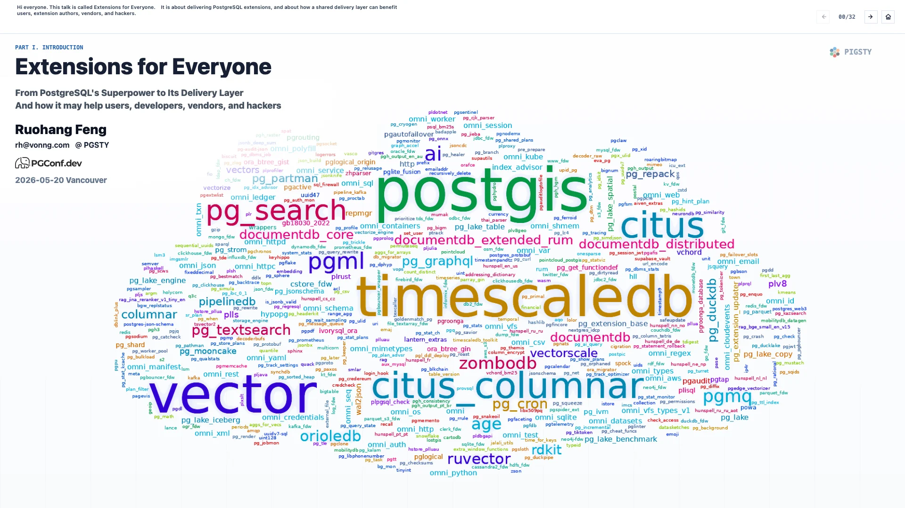](https://vonng.com/work/extensions-for-everyone/00-extensions-for-everyone.html)

### 1. Who am I

> [01. Who am I](https://vonng.com/work/extensions-for-everyone/01-who-am-i.html)

I am Ruohang Feng, author and maintainer of Pigsty, an open-source PostgreSQL distribution.

I also build pgext.cloud, an open-source delivery layer for PostgreSQL extensions.

Over the past two years, I have been cataloging, building, packaging, and testing hundreds of extensions across PostgreSQL versions and Linux platforms. So this talk is not a theory. It is a field report.

[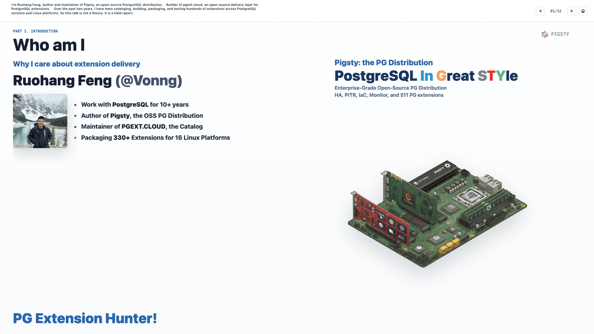](https://vonng.com/work/extensions-for-everyone/01-who-am-i.html)

### 2. Extensibility Matters

> [02. Extensibility Matters](https://vonng.com/work/extensions-for-everyone/02-extensibility-matters.html)

Extensibility matters. Two years ago, I wrote that **PostgreSQL is eating the database world**.

The argument was simple: PostgreSQL wins through extensibility. It lets the ecosystem move quickly without forcing every new idea into core. That is the superpower, but it also creates a practical problem.

If PostgreSQL grows through extensions, then extension delivery becomes part of the system.

Extensibility alone is not enough. An extension only matters when it can be found, installed, and trusted.

That is why I began collecting and packaging extensions.

[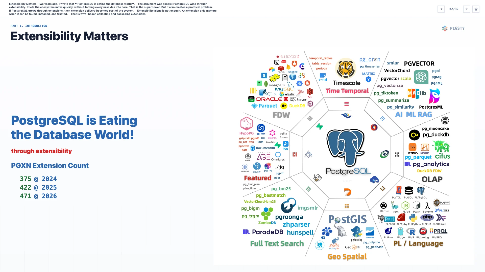](https://vonng.com/work/extensions-for-everyone/02-extensibility-matters.html)

### 3. Two Years Later

> [03. Two Years Later](https://vonng.com/work/extensions-for-everyone/03-two-years-later.html)

Two years later, I have been building open-source infrastructure for PostgreSQL extensions. It is called **pgext.cloud**.

Today, it ships across sixteen Linux targets and five active PostgreSQL major versions. Together with PGDG and contrib, the deliverable set is about 511 extensions.

The repository serves roughly one million downloads per month. Several PostgreSQL vendors now deliver their extensions through it. But this talk is not mainly about the repository.

The main point is what we have learned while maintaining this matrix. That is what I want to share today.

[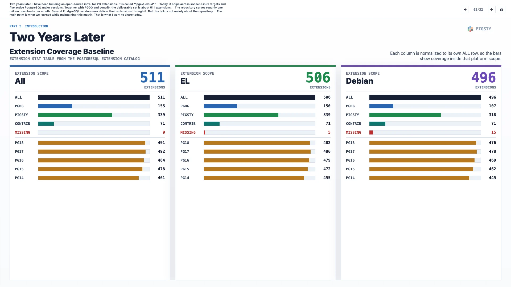](https://vonng.com/work/extensions-for-everyone/03-two-years-later.html)

### 4. Who Benefits?

> [04. Who Benefits?](https://vonng.com/work/extensions-for-everyone/04-who-benefits.html)

When I say "extensions for everyone", I mean four groups of people.

First, users and DBAs. They want packages. They do not want to compile code on production servers.

Second, extension authors. They need reach, and they do not want to spend their time on build and delivery work.

Third, vendors. They need reusable components. Rebuilding the same packages again and again is a waste of engineering time.

Fourth, PostgreSQL hackers. They need signals. When compatibility breaks, extensions are often where we see it first.

So this is about a shared delivery layer. Not just for convenience, but also for visibility. Before we talk about delivery, let us look at the ecosystem. We need to understand what we are trying to deliver.

--------

## Part II: The Ecosystem Landscape

### 5. Galaxy

> [05. Galaxy](https://vonng.com/work/extensions-for-everyone/05-galaxy.html)

How many PostgreSQL extensions exist? There is a well-known community-maintained GitHub list with more than a thousand entries. The catalog I maintain currently tracks about 1,617 entries.

But this number needs context.

Some projects are active. Some are abandoned. Some are only available on cloud platforms. Some depend on a dedicated PostgreSQL fork. Some are just ideas and examples. So 1,617 does not mean 1,617 installable extensions.

It means the ecosystem boundary is large and messy.

[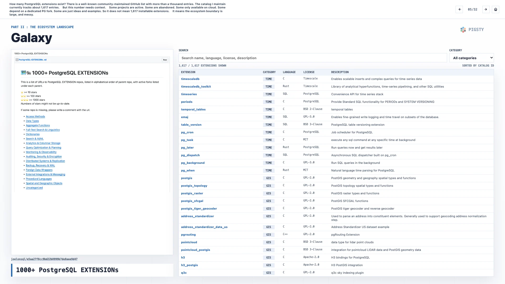](https://vonng.com/work/extensions-for-everyone/05-galaxy.html)

### 6. GitHub Stars

> [06. GitHub Stars](https://vonng.com/work/extensions-for-everyone/06-github-stars.html)

The first public signal is GitHub stars. Stars do not measure quality. They do not measure production usage. They also miss projects that are not hosted on GitHub at all, such as postgres and postgis.

But stars are still useful. They show attention, reputation, and rough awareness. Familiar names appear near the top: TimescaleDB, pgvector, Citus, pg_search, pgml, pgai, pgmq, and many others.

If we look at the distribution, it is extremely skewed. A few extensions get most of the attention, followed by a very long tail. It is a logarithmic distribution.

[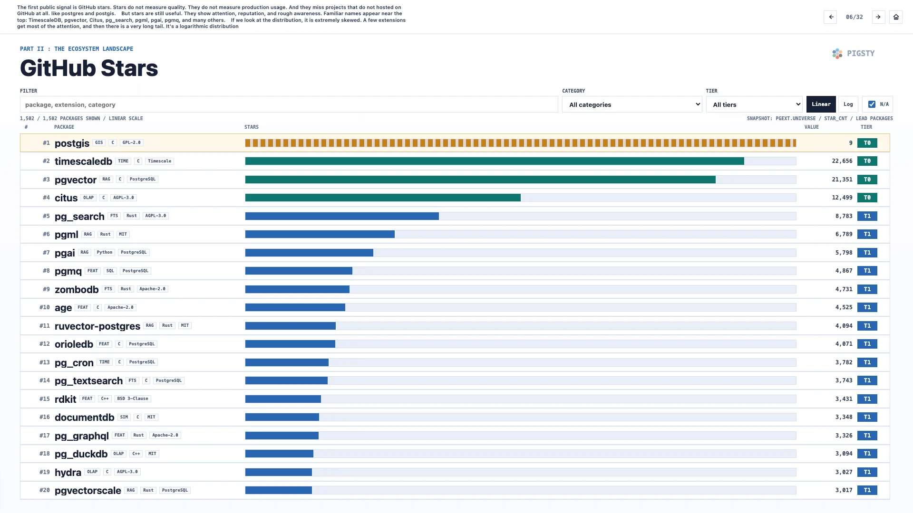](https://vonng.com/work/extensions-for-everyone/06-github-stars.html)

### 7. Star Tiering

> [07. Star Tiering](https://vonng.com/work/extensions-for-everyone/07-star-tiering.html)

If we group extensions by order of magnitude, we get a simple tier model.

Tier zero: the magnificent four. PostGIS, TimescaleDB, pgvector, and Citus. Each has more than ten thousand stars.

Tier one: 44 extensions, between one thousand and ten thousand stars.

Tier two: about 152 extensions, above one hundred stars.

Tier three: about 373 extensions, above ten stars.

And then a long tail of around 748 extensions below ten stars.

This is not a quality ranking. Some popular projects are no longer active, such as pgml or zombodb. Some low-star extensions are quite useful.

But the tiers tell us something. The visible ecosystem is much smaller than the discovered one. Adding tiers zero through three gives about 570 extensions with more than ten stars, which is close to what is actually deliverable.

[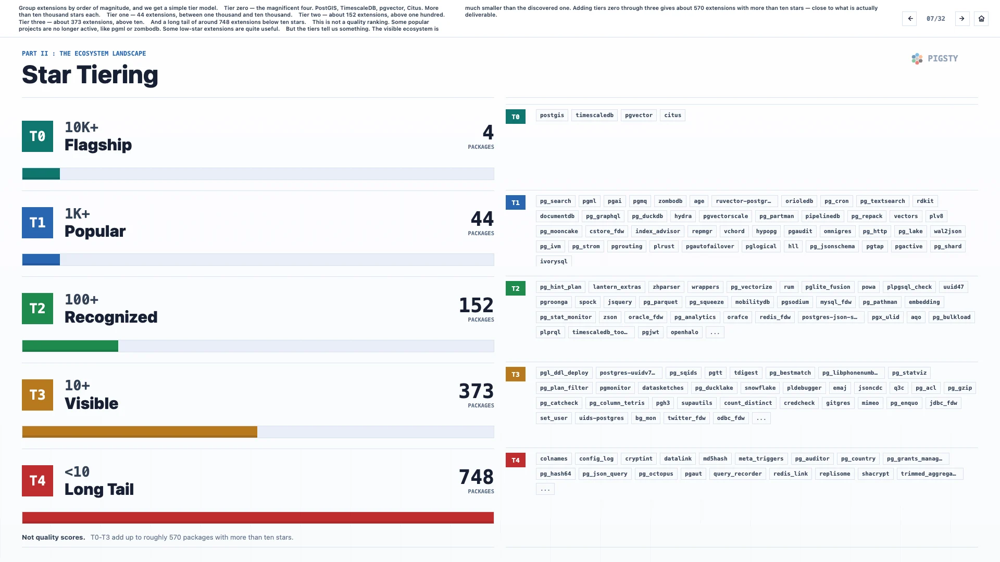](https://vonng.com/work/extensions-for-everyone/07-star-tiering.html)

### 8. The Extension Funnel

> [08. The Extension Funnel](https://vonng.com/work/extensions-for-everyone/08-the-extension-funnel.html)

This gives us a funnel. At the top, there are about 1,600 candidates. If we cut the long tail, the number drops quickly.

In the middle, about 500 are already cataloged, packaged, and delivered.

We can split this by source: about 330 from the Pigsty repository, and 160 from PGDG, with some overlap between the two. At the very bottom, 71 contrib extensions are shipped with Postgres itself.

The point is the shape. Discovery is broad. Delivery is narrower. Usage is narrower again.

[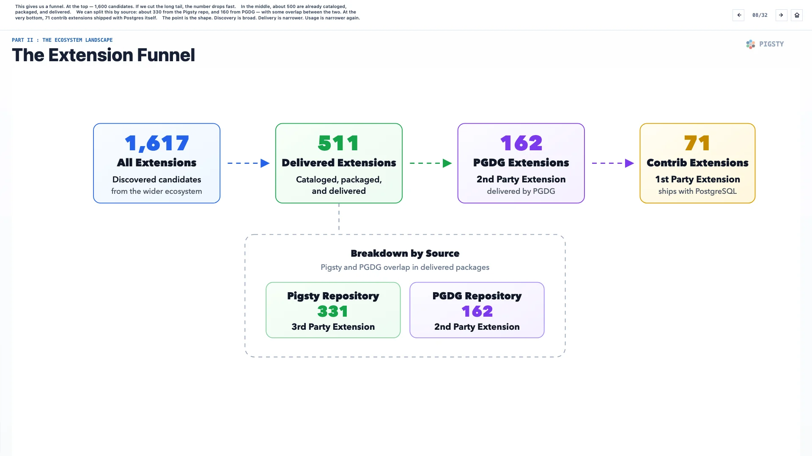](https://vonng.com/work/extensions-for-everyone/08-the-extension-funnel.html)

### 9. Dimension Analysis

> [09. Dimension Analysis](https://vonng.com/work/extensions-for-everyone/09-dimension-analysis.html)

The catalog also tracks dimensions beyond stars: language, license, category, last release date, repository status, packaging status, PostgreSQL version support, and operating system support. We can browse 32 different dimensions here.

Now let us move from "what exists" to "what can actually be delivered".

[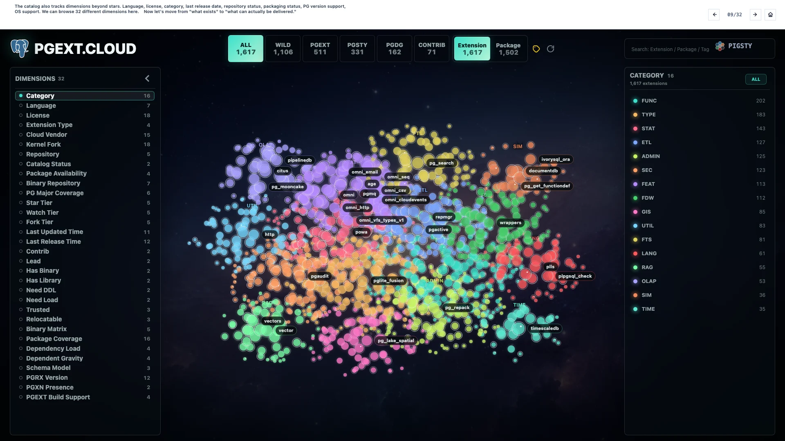](https://vonng.com/work/extensions-for-everyone/09-dimension-analysis.html)

--------

## Part III: The Delivery Layer

### 10. The Status Quo

> [10. The Status Quo](https://vonng.com/work/extensions-for-everyone/10-the-status-quo.html)

Packaging PostgreSQL extensions is hard. Not because package formats are mysterious, but because the matrix is large. We are talking about 5 active PostgreSQL major versions times 16 Linux platforms. That is 80 build slots per extension. Only a handful of extensions actually cover all of it.

The PGDG YUM and APT repositories, maintained by Christoph and Devrim, already do foundational work. They carry many of the most important extensions, around 150 packages in total. But there are still gaps: Rust extensions, for example, and some operating system plus PostgreSQL slots that are not filled.

So the complementary repository aims to fill that gap. It adds packages where PGDG coverage is missing, or where the build is too expensive to maintain. In total, that is about 300 additional extension packages.

[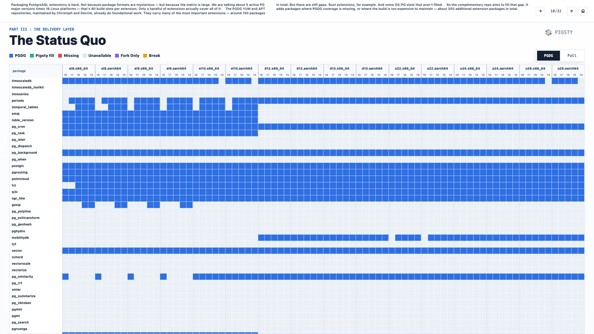](https://vonng.com/work/extensions-for-everyone/10-the-status-quo.html)

### 11. The Trade-Off

> [11. The Trade-Off](https://vonng.com/work/extensions-for-everyone/11-the-trade-off.html)

There is a real trade-off behind that. C extensions build quickly. Rust extensions do not. One Rust build can take longer than all the C builds combined.

But users still need them. A self-hosted Supabase stack, for example, needs about a dozen extensions, three of them written in Rust. So the question is not whether the work is necessary. The question is where the work should live.

[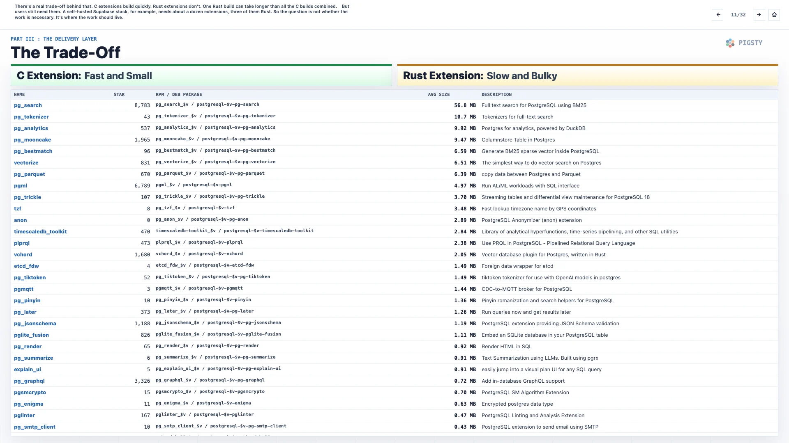](https://vonng.com/work/extensions-for-everyone/11-the-trade-off.html)

### 12. Why Linux Native?

> [12. Why Linux Native?](https://vonng.com/work/extensions-for-everyone/12-why-linux-native.html)

Container images reduce part of the matrix. I really admire that. With containers, you only build for 5 PostgreSQL majors times 2 architectures. That is 10 slots per extension, an 8x reduction.

But Linux-native packages are still important. Many users still install Postgres through the native package manager, APT or YUM. And most Postgres Docker images themselves install extensions as Debian packages from the PGDG APT repository.

So the packaging has to be done somewhere.

[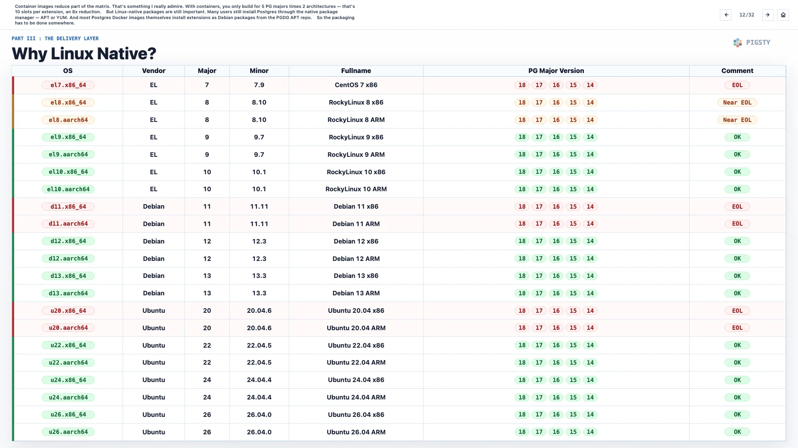](https://vonng.com/work/extensions-for-everyone/12-why-linux-native.html)

### 13. PGEXT.CLOUD

> [13. PGEXT.CLOUD](https://vonng.com/work/extensions-for-everyone/13-pgext-cloud.html)

To deliver all these RPM and DEB extension packages, we have built open-source infrastructure around the problem.

It has four parts: a catalog for discovery, a repository for delivery, an optional CLI for easier access, and the build matrix behind them.

The CLI is simple. The repository is useful. But the catalog and the build matrix are where most of the engineering cost lives.

[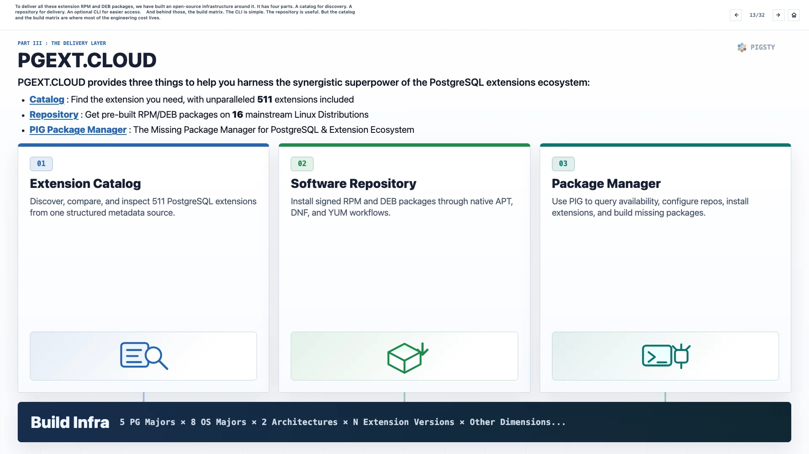](https://vonng.com/work/extensions-for-everyone/13-pgext-cloud.html)

### 14. Extension Catalog

> [14. Extension Catalog](https://vonng.com/work/extensions-for-everyone/14-extension-catalog.html)

The catalog is the source of truth. It is not a marketing page. It is a database with structured metadata describing everything about an extension: dimensions, tags, dependencies, availability matrix, and notes on how to install, configure, build, and use it.

This sounds like boring grunt work. But boring metadata is what lets the rest of the system behave predictably. With that data, you can ask Codex to regenerate the extension galaxy in one prompt.

[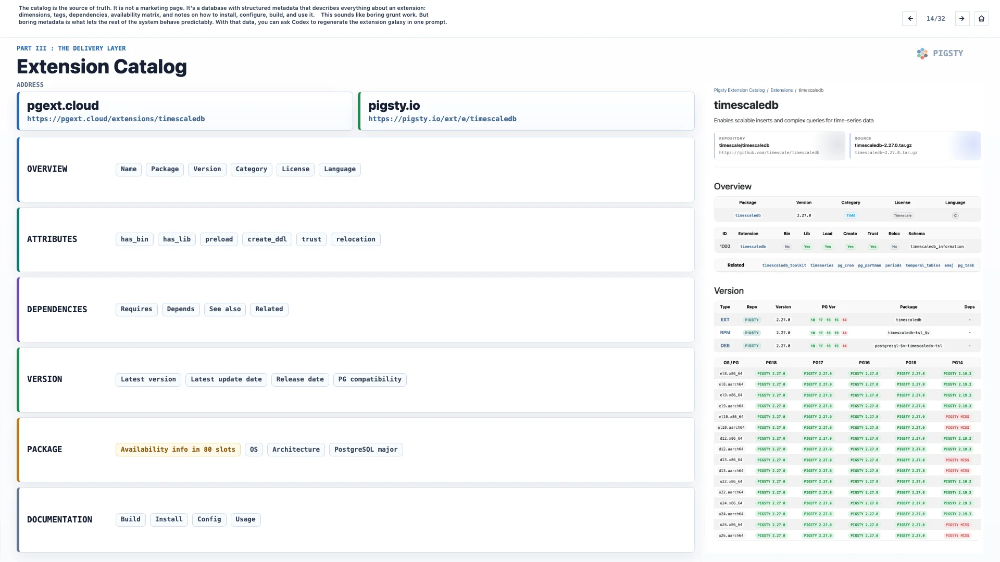](https://vonng.com/work/extensions-for-everyone/14-extension-catalog.html)

### 15. Catalog Details

> [15. Catalog Details](https://vonng.com/work/extensions-for-everyone/15-catalog-details.html)

The catalog is part of the delivery path. The website and the CLI tools all use it as the source of truth.

Currently, that metadata is exported as several CSV files and updated regularly. It comes in two versions: a universe version that collects generic metadata for 1,600 extensions, and a detailed version that covers 511 of them.

I would be very happy if this kind of information could one day live on postgresql.org as an official extension directory. For now, it lives on pgext.cloud and GitHub.

[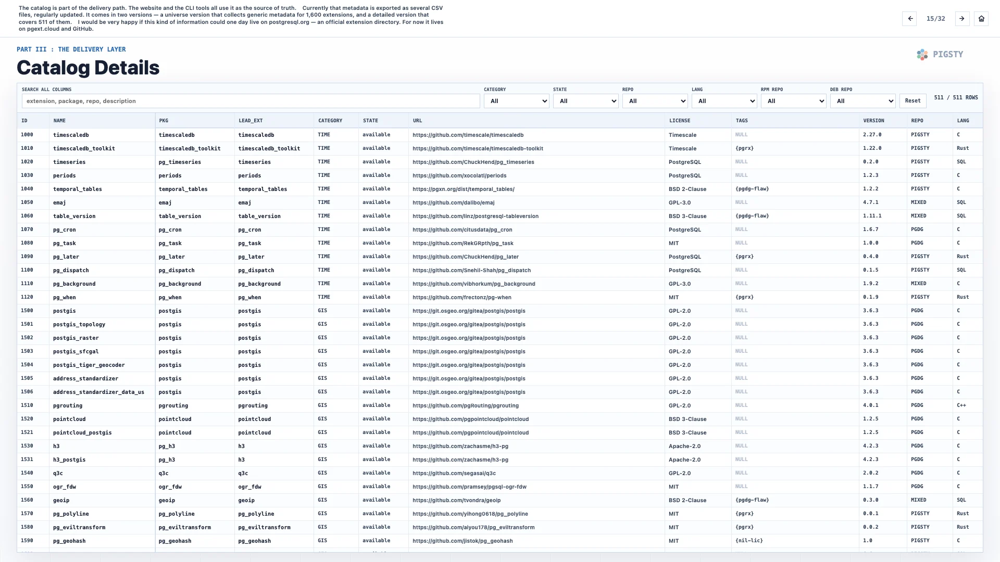](https://vonng.com/work/extensions-for-everyone/15-catalog-details.html)

### 16. Catalog Page Views

> [16. Catalog Page Views](https://vonng.com/work/extensions-for-everyone/16-catalog-page-views.html)

The catalog website also gives us pageview data. It is not the same as production usage, but it tells us what users are looking at. That can be useful. It tells us which extensions deserve packaging effort first, and which categories are becoming active.

Here is the extension pageview data from the last month.

[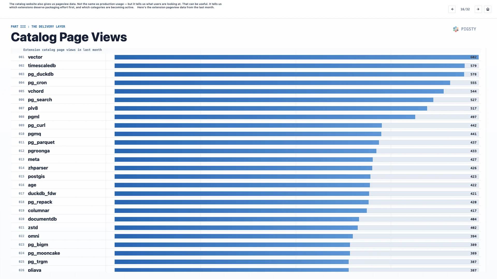](https://vonng.com/work/extensions-for-everyone/16-catalog-page-views.html)

### 17. Repository

> [17. Repository](https://vonng.com/work/extensions-for-everyone/17-repository.html)

To deliver these extensions to users, the catalog itself is not sufficient. You also need a repository.

Technically, the repository is an APT and YUM repository with signed Linux-native packages, hosted on Cloudflare with a regional mirror.

This repository aims to enhance the PGDG YUM and APT repositories. It is fully compatible, built under the same conventions, with the package layout users already understand and use.

[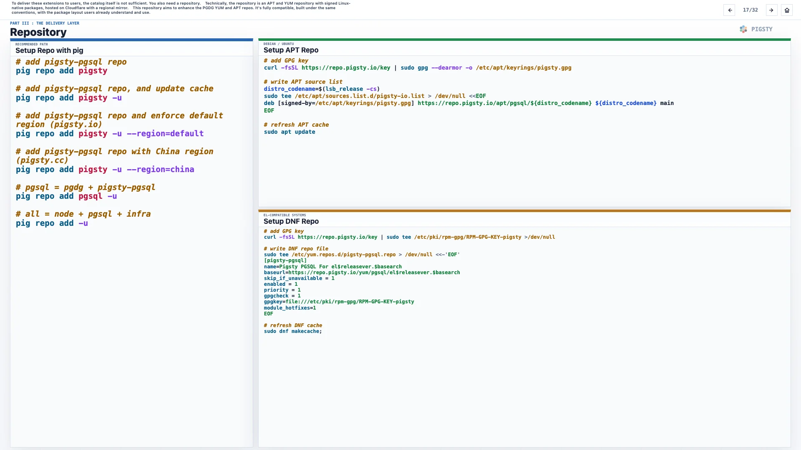](https://vonng.com/work/extensions-for-everyone/17-repository.html)

### 18. Repo Download Stats

> [18. Repo Download Stats](https://vonng.com/work/extensions-for-everyone/18-repo-download-stats.html)

The repository now serves roughly one million RPM and DEB downloads per month.

But these numbers have limits. They do not include the PGDG side. Cloudflare also does not offer detailed access logs outside its enterprise plan, so we are missing a lot of data.

I would really welcome it if the PGDG repository could share access logs, or at least some aggregate statistics. That would be a very useful signal for the extension ecosystem.

[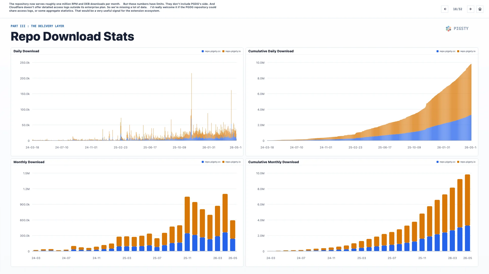](https://vonng.com/work/extensions-for-everyone/18-repo-download-stats.html)

### 19. What We Can Still Infer

> [19. What We Can Still Infer](https://vonng.com/work/extensions-for-everyone/19-what-we-can-still-infer.html)

Even partial and biased download data is still useful. It can show which PostgreSQL major versions are active. It can show which operating system targets matter. It can show whether a package cell is used enough to justify maintenance.

But be careful. A package with few downloads may still be important. Maybe we need a combined signal: stars, pageviews, availability, build failures, and downloads. Something like a DB-Engines-style score for Postgres extensions.

[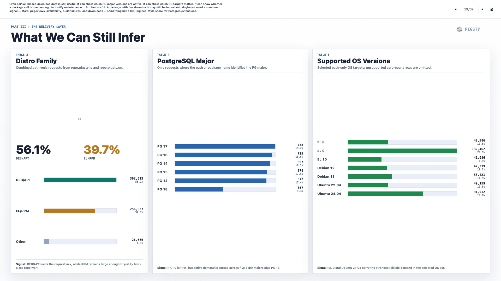](https://vonng.com/work/extensions-for-everyone/19-what-we-can-still-infer.html)

### 20. The CLI - PIG

> [20. The CLI - PIG](https://vonng.com/work/extensions-for-everyone/20-the-cli-pig.html)

Once we have the catalog and repository, extension delivery is almost solved. You can use the operating system package manager, `dnf` or `apt`, to install directly from the PGDG and PGEXT repositories.

We also have a dedicated but purely optional command-line tool called PIG. It is written in Go and is only 4 MB. The name means "piggyback on the OS package manager". It hides all the complexity and just performs the installation for users.

The interesting part is that it does not only install. It can also build and deliver binary packages. If you want pg_search or pg_duckdb, just run `pig build pkg pg_search`, and it builds the package for you.

This matters for supply-chain trust. Users can rebuild everything themselves if they want to.

So that is the delivery layer: catalog, repository, CLI, and the build matrix behind them. On paper, it looks clean. In practice, the matrix is where things get hard.

[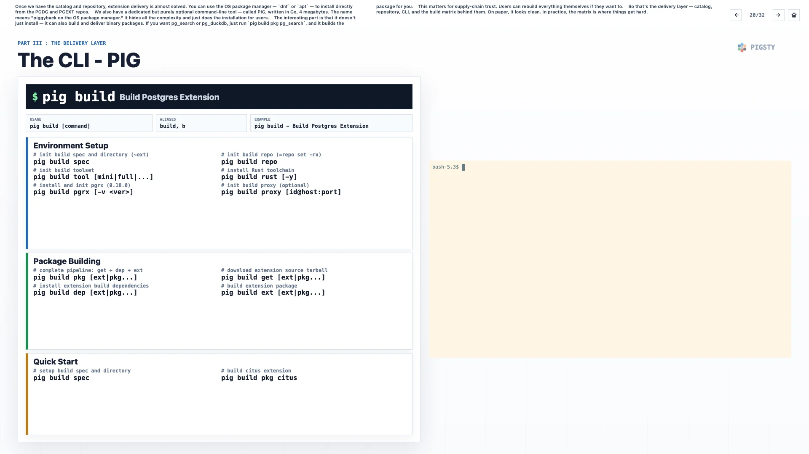](https://vonng.com/work/extensions-for-everyone/20-the-cli-pig.html)

--------

## Part IV: Maintenance in the Wild

### 21. Dimension Explosion!

> [21. Dimension Explosion!](https://vonng.com/work/extensions-for-everyone/21-dimension-explosion.html)

In the previous chapter, we talked about the matrix: 80 slots per extension.

But 5 PostgreSQL versions times 16 Linux targets is an oversimplified model. The real picture is messier. There are more factors than rows and columns.

On the operating system side: distribution family, architecture, major version, and sometimes minor version.

On the PostgreSQL side: major version, and sometimes minor version.

On the extension side: extension version, and pgrx version for Rust extensions.

When you multiply all of these together, the combination explodes very quickly.

The rest of this part is about what we learn when that explosion meets reality.

[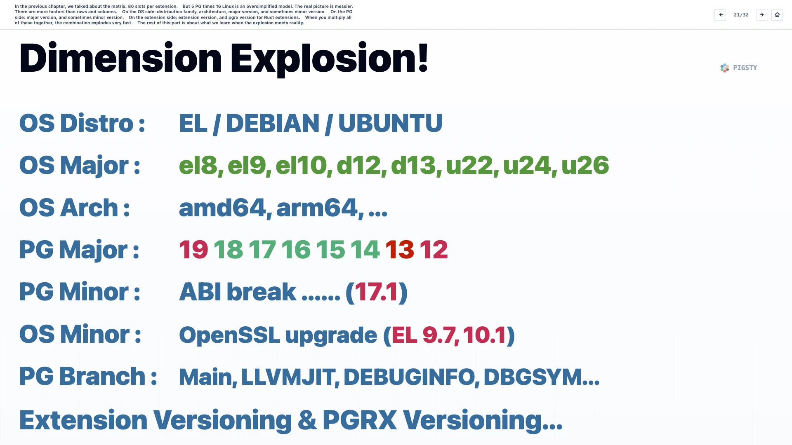](https://vonng.com/work/extensions-for-everyone/21-dimension-explosion.html)

### 22. PG Minor ABI Break

> [22. PG Minor ABI Break](https://vonng.com/work/extensions-for-everyone/22-pg-minor-abi-break.html)

Last year, we hit a concrete case. PostgreSQL 17.1 broke ABI compatibility during a minor upgrade. That broke certain extensions, including TimescaleDB.

In response, some maintainers switched to building for every PostgreSQL minor version. But that creates new problems. If you build for every single minor version, in-place upgrades become much harder.

It is better to treat this as an exceptional case. But when it happens, we have to be ready.

[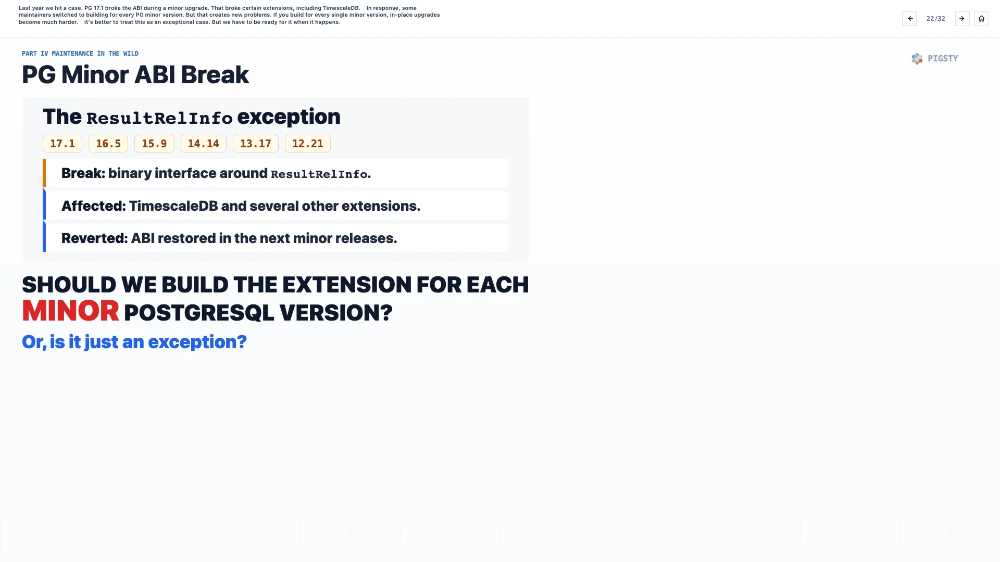](https://vonng.com/work/extensions-for-everyone/22-pg-minor-abi-break.html)

### 23. OS Minor Break

> [23. OS Minor Break](https://vonng.com/work/extensions-for-everyone/23-os-minor-break.html)

Sometimes even an operating system minor version will break your build.

For example, EL changed the OpenSSL version from 3.2 to 3.5, and some extensions break at link time.

In response, the PGDG YUM repository recently changed its packaging policy. It now builds per minor version instead of per major version. So we have separate builds for EL 10.0, 10.1, 9.6, and 9.7, instead of just EL 10 and EL 9. That is yet another sub-dimension on the matrix.

[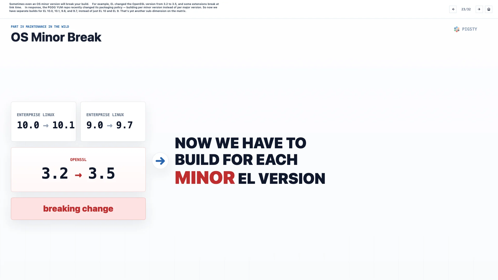](https://vonng.com/work/extensions-for-everyone/23-os-minor-break.html)

### 24. Rust Problems

> [24. Rust Problems](https://vonng.com/work/extensions-for-everyone/24-rust-problems.html)

Rust extensions are growing. They bring new people and new ideas into the ecosystem. The Rust community uses a framework called pgrx to write them, and that introduces a few new problems.

First, the build cost. Rust builds are slow and disk-hungry. One Rust extension can take longer to build than all the C extensions combined.

Second, pgrx itself has versions: 0.16, 0.17, 0.18, and so on. They are not interchangeable. I have spent a lot of time aligning Rust extensions to specific pgrx versions, but as time goes by, version drift comes back.

So Rust does not just add another language. It adds another compatibility axis.

[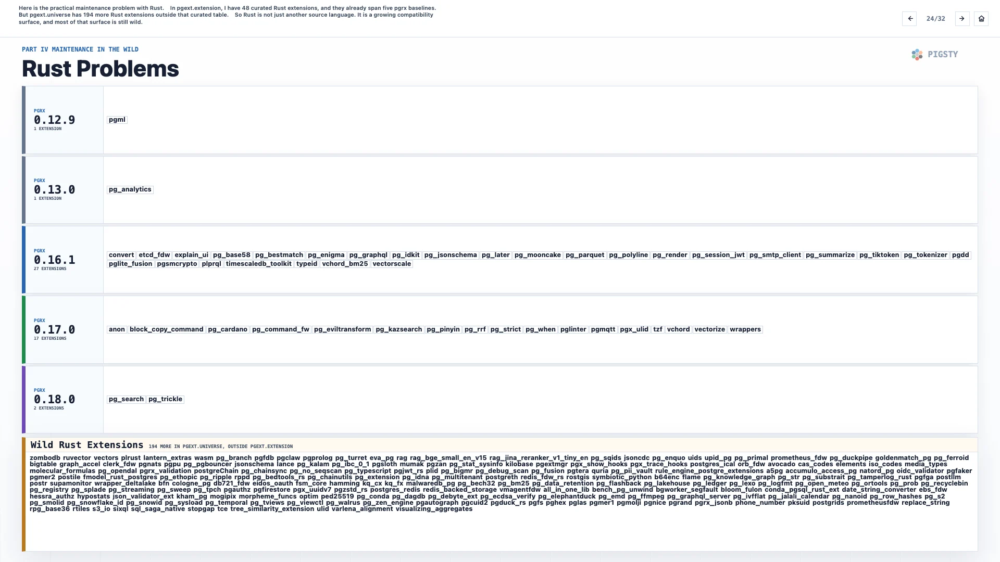](https://vonng.com/work/extensions-for-everyone/24-rust-problems.html)

### 25. Bulky Extensions

> [25. Bulky Extensions](https://vonng.com/work/extensions-for-everyone/25-bulky-extensions.html)

Extensions used to be small, typically a few hundred kilobytes. That is no longer always true.

Some newer extensions, such as pg_search and pg_duckdb, are tens of megabytes. Source archives and build outputs both add up quickly. Across the full matrix, this turns into real storage and bandwidth cost.

[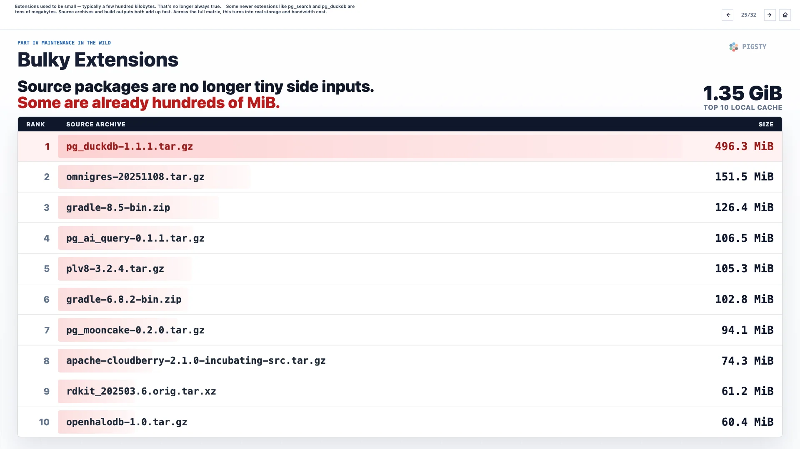](https://vonng.com/work/extensions-for-everyone/25-bulky-extensions.html)

### 26. Naming Conflicts

> [26. Naming Conflicts](https://vonng.com/work/extensions-for-everyone/26-naming-conflicts.html)

The matrix is one kind of complexity. Conflicts between extensions are another.

Last year, I talked about Citus and Hydra competing for the same name, `columnar`. This year, we have a new example: `bm25`. Three extensions now expose an access method called bm25:

- pg_search from ParadeDB
- pg_textsearch from Timescale
- vchord_bm25 from TensorChord

Unlike Citus and Hydra, you can install these three together. But you cannot create them all in the same database, because the access method name collides.

This is not just a packaging issue. It is an ecosystem metadata problem. If the catalog records not just package names, but also extension objects, libraries, and access methods, authors can check for collisions before release.

[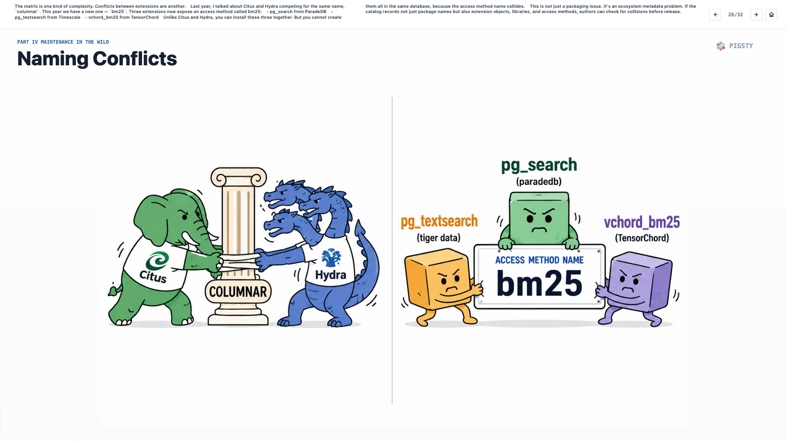](https://vonng.com/work/extensions-for-everyone/26-naming-conflicts.html)

### 27. Library Conflicts

> [27. Library Conflicts](https://vonng.com/work/extensions-for-everyone/27-library-conflicts.html)

Here is another example. Three DuckDB-based extensions wanted to use the same shared library: libduckdb.

The package manager sees files on disk. PostgreSQL sees shared libraries and control files. The user sees `CREATE EXTENSION`. All three layers can disagree.

The practical resolution was to mount two of the extensions as sub-extensions under pg_duckdb. It worked, but it took real effort to coordinate and persuade the authors.

The lesson is simple: names are part of compatibility, and names do conflict.

[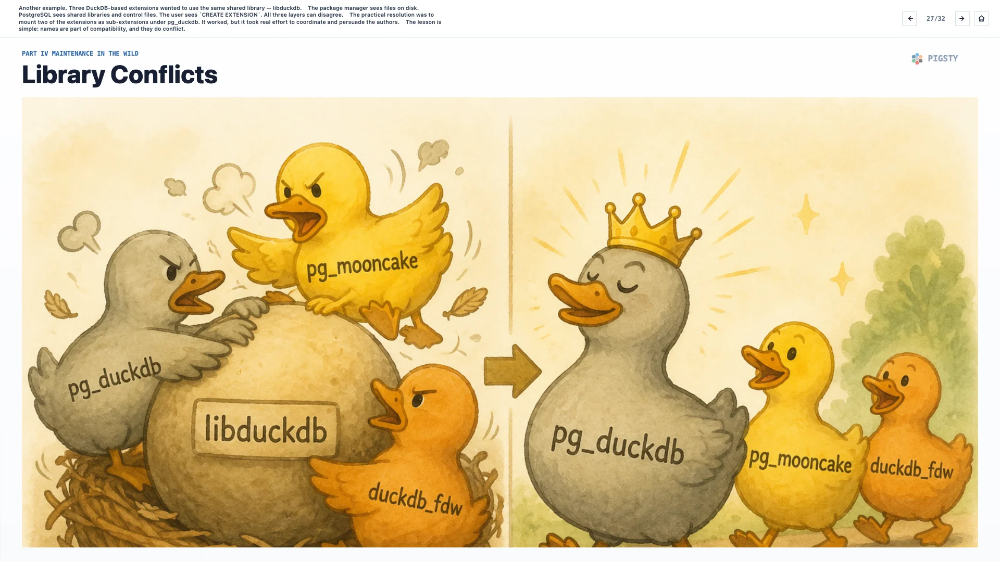](https://vonng.com/work/extensions-for-everyone/27-library-conflicts.html)

### 28. API Break

> [28. API Break](https://vonng.com/work/extensions-for-everyone/28-api-break.html)

We also fix many extensions that lack active maintenance. The last release date for some of them was years ago, but PostgreSQL major version changes still affect them.

Usually, the original author writes version branches to handle different PostgreSQL majors. If the extension is no longer maintained, a packager has to step in.

We have talked about how this work helps the first three groups: users, authors, and vendors. Can it also be useful to PostgreSQL hackers?

I think build coverage is a useful signal. When a patch breaks N extensions, that number is information. It shows ecosystem impact. This is where delivery infrastructure starts to look like feedback infrastructure.

[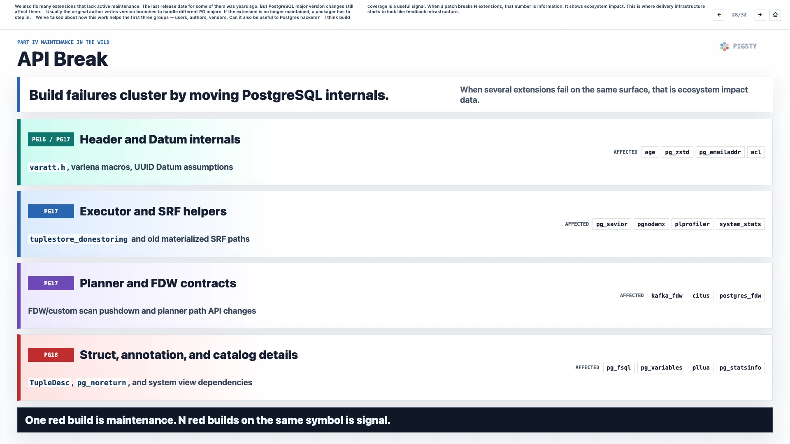](https://vonng.com/work/extensions-for-everyone/28-api-break.html)

### 29. PG 19 Compatibility

> [29. PG 19 Compatibility](https://vonng.com/work/extensions-for-everyone/29-pg-19-compatibility.html)

Here is a concrete case. I ran the build pipeline against PostgreSQL 19 development snapshots. Around 50 extensions failed to build.

The failures cluster into a small set of categories: real API changes, old assumptions, missing version branches, dependency problems, and packages that were already fragile.

Some PostgreSQL hackers told me last year that this might be useful for patches with broad reach, such as threading work, refactors, and hook changes. If a CI pipeline can run extension builds against a patch series, the result could be useful input during patch review.

I would really like feedback from this room on whether that is worth pursuing.

The goal is not to block progress. The goal is to make ecosystem impact visible earlier.

[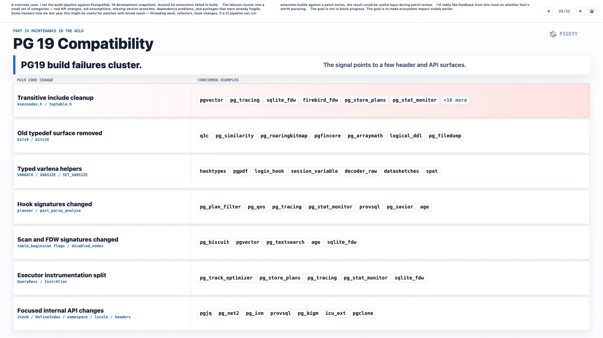](https://vonng.com/work/extensions-for-everyone/29-pg-19-compatibility.html)

### 30. Keeping It Maintainable

> [30. Keeping It Maintainable](https://vonng.com/work/extensions-for-everyone/30-keeping-it-maintainable.html)

A practical question is maintainability. All of this work is done by one person. I run a one-person company and a one-person distribution called Pigsty. I have been doing this for about five years.

It is getting easier these days because of AI tooling. A year ago, every build spec was written by hand. After accumulating enough examples, adding new extensions has become straightforward. Last month, I added 50 new extensions in two days.

My friend Yurii Rashkovskii once described an idea called PGPM: URL in, RPM out. With Codex and Claude Code, that idea is becoming real.

AI also lowers testing cost. We can drive sanity checks from extension documentation and catch behavior regressions earlier.

AI may not be ready to commit Postgres core patches. But it is clearly qualified for this kind of work. I maintain a MinIO fork that fixes CVEs and bugs, almost entirely through Codex and Claude Code. It actually works in production.

This is the only way a 511-extension matrix stays alive with one maintainer.

### 31. Three Questions

> [31. Three Questions](https://vonng.com/work/extensions-for-everyone/31-three-questions.html)

To close, extensions are the collective treasure of the Postgres ecosystem. I hope this work helps users, authors, vendors, and Postgres hackers build a better Postgres.

I want to leave this room with three questions.

First, what catalog metrics would actually be useful? Pageviews, downloads, package availability, build failures, last release date, object conflicts. Which of these should be visible, and which are noise?

Second, can extension build coverage help patch review? Is it useful as an early warning signal for API, ABI, and behavior changes?

Third, should some of this metadata live closer to PostgreSQL community infrastructure? Under postgresql.org, alongside PGDG, or somewhere else?

Extensions are collective infrastructure. Delivery is part of extensibility. If we improve delivery, PostgreSQL's superpower reaches more people.

[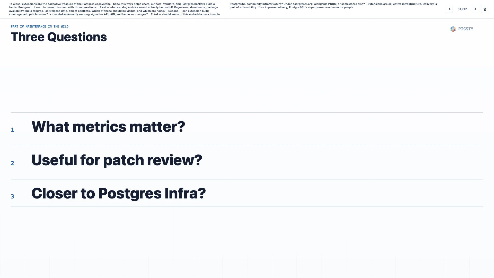](https://vonng.com/work/extensions-for-everyone/31-three-questions.html)

### 32. Thank You

> [32. Thank You](https://vonng.com/work/extensions-for-everyone/32-thank-you.html)

Thank you.

If you have any questions, please contact me.

Vonng rh@vonng.com

