大家好，我是冯若航，Pigsty 的作者，独立开源贡献者。
今天我想和大家聊一个话题：**如何打造一个立足中国，面向全球的 PostgreSQL 数据库发行版**。

这个标题听着有点大，但我想说的很简单：**PostgreSQL 已经赢了，问题是 —— 我们中国开发者在这场胜利中扮演什么角色？**
是旁观者，还是参与者？是跟随者，还是引领者？

数据库内核之争已经尘埃落定，真正的竞争将会发生在数据库发行版上。
而在这个关键的机会窗口里，我们应该凝聚生态合力，打造一个全世界开发者都愿意使用的基础设施，数据库世界中的 Ubuntu / Deepseek。

--------

## WHY — 为什么

### PostgreSQL 已经成为数据库领域主宰者

**PostgreSQL 已经赢了** —— 这个观点有着非常扎实的数据支撑。

[Stack Overflow 开发者调查](/pg/so2025-pg/) 显示，专业开发者中 PostgreSQL 的使用率达到 **58.2%**，甩开第二名 MySQL **18.6** 个百分点，而且这个比例还在加速增长。
从新开源项目，AI SaaS 到 OpenAI 这样的独角兽，PG 已经成为新项目的标配 “默认” 数据库。

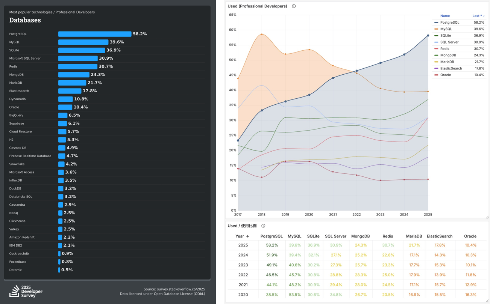

无论 [DB-Engines](https://db-engines.com/en/ranking) 的数据库热度指数，还是 [JetBrains 的开发者调查](https://devecosystem-2025.jetbrains.com/tools-and-trends) 都得出了相似的结论。 如果这些社区调查还不够，我们再看看资本市场的动向。

2025 年，PostgreSQL 生态发生了两起标志性收购案：
[Databricks 斥资约 10 亿美元收购了 PostgreSQL 初创公司 Neon](https://mp.weixin.qq.com/s/skxFplC0ow0Hh9gqs_N4hQ)，而 [Snowflake 则以 2.5 亿美元收购了 Crunchy Data](/db/db-for-ai/)。
两大数据平台巨头通过收购杀入 PostgreSQL 的 OLTP 市场——他们选的不是 MySQL，也不是自研新库，而是直接押注 PostgreSQL。

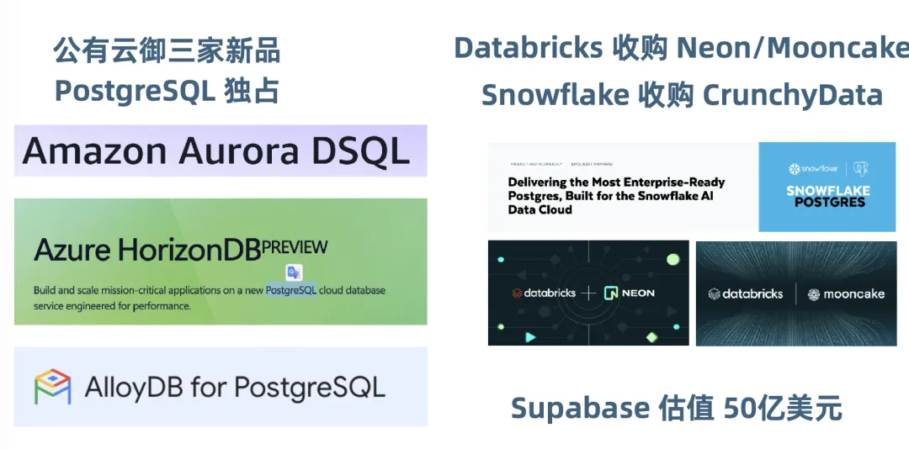

各大云厂商同样在 All in PostgreSQL：AWS 的新品 Aurora DSQL，Azure 的新品 HorizonDB，GCP 的 AlloyDB，这些云上创新产品都是 PostgreSQL 独占。
**PG 的胜利不仅仅是技术上的胜利，更是商业上的胜利**。全球最聪明的钱，都在往 PostgreSQL 生态里涌。选择 PostgreSQL 就是选择了未来！

### 中国在PG开源生态中并没有多少参与感

遗憾的是，在 PostgreSQL 全球狂飙突进的过程中，中国开源的存在感却非常弱。
在这幅波澜壮阔的版图上，很难找到几样醒目的 “Made in China”。我们在见证 PG 巨大胜利的同时，却几乎缺席了这场盛宴。

**此前的 PostgreSQL 社区内核 Committer 列表里，没有一位中国人**。
而在开源项目方面，老冯搜集了由中国公司或者中国开发者主导的 PG 开源项目，结果发现 Star 数最多，
影响力最大的竟然是老冯这个数据库个人开发者的 Pigsty 。我一方面感觉很自豪，另一方面也感觉很荒诞。

| 项目               | Star | 简介                         |
|------------------|------|----------------------------|
| pigsty           | 4.3K | 开箱即用的PG发行版                 |
| PolarDB PG       | 3.1K | 阿里云 PolarDB 开源内核           |
| pgvector.rs      | 2.1K | Rust 编写的PG向量扩展             |
| VectorChord      | 1.4K | 下一代 Rust PG 向量扩展           |
| TBase            | 1.4K | 腾讯云 PG 内核                  |
| Cloudberry       | 1.1K | Hashdata 的开源 Greenplum 2.0 |
| IvorySQL         | 960  | 瀚高主导的 Oracle 兼容内核          |
| openGauss        | 751  | 华为主导的早期 PG 分叉              |
| openHalo         | 626  | 易景开源的 MySQL 兼容 PG 内核       |
| zhparser         | 798  | 使用 scws 的PG中文分词扩展          |
| duckdb_fdw       | 393  | 李红艳开源的 DuckDB 包装器          |
| pg_jieba         | 392  | 使用结巴分词的 PG 中文分词扩展          |
| VectorChord-bm25 | 314  | PG 原生的 BM25 排序索引算法         |
| pg_roaringbitmap | 263  | PG 中的 RoaringBitmap 位图     |

我这两年参加了几场 [国际 PostgreSQL 会议](/pg/pgcondev-2024/)，感受很复杂。
去年 PG 开发者大会里，我碰上了瀚高北美的 Grant Zhou 和 Carry Huang，富士通的 Zhijie Hou，再加上我，就没有别的中国开发者影子了。
[今年](https://mp.weixin.qq.com/s/rZ4lcsdld1_Fxck77KRIvw) 还碰上了 TensorChord 的朋友。放在几百人的大会里面，依然是不成比例的极少数。

中国有两三百个数据库产品，很多都是 PG 衍生。[但在全球 PostgreSQL 生态里，几乎没有存在感]()。
我们的人才、我们的资金、我们的精力，都花在了重复造轮子上。当全球同行们正在奋勇创新，在资本市场嘎嘎乱杀的时候。
[中国的数据库同行们却在泥潭中挣扎]() —— 几百家国产数据库公司，只有四家在盈利，整个行业正在高速缩水凋亡。
这说明什么？说明我们在错误的方向上投入了太多资源，市场正在用脚投票。

我们需要思考如何破局：**如何在 PostgreSQL 生态中找到一个切入点，做出像 Deepseek 这样有世界级影响力的东西**

有这样的东西吗？有的，朋友们，有的。

### 数据库发行版大战拉开序幕

**数据库内核之争已经尘埃落定，真正的战斗将会发生在数据库发行版上。** —— 这个判断来自对 Linux 发展历程的观察。

1991 年，Linus Torvalds 发布了 Linux 内核。但 Linux 内核本身是不能直接用的，
你需要有人把内核、工具链、软件包、配置脚本打包在一起，形成一个可以安装、可以使用的操作系统。这就是 **发行版**。

1993 Debian 年诞生，94 年 RedHat 诞生。之后服务端操作系统内核很快就收敛到了 Linux 上，
大家都用同一个内核，OS 世界的竞争很快就从内核层面转移到了发行版。 

**今天的 PostgreSQL，正处于当年 Linux 的位置上。**

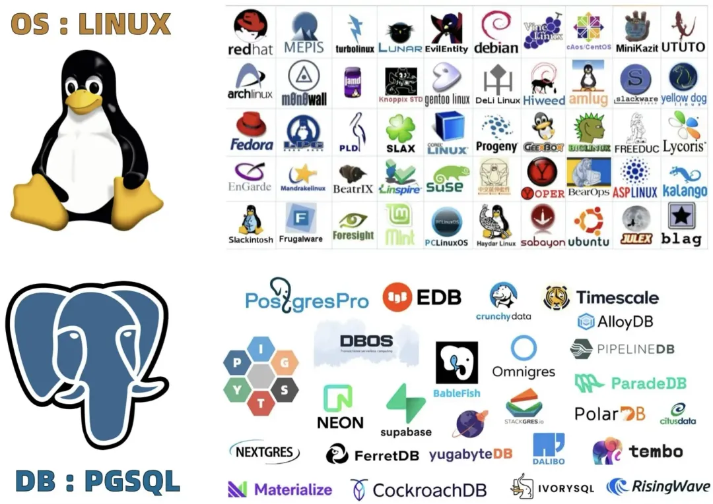

做过系统管理的朋友都清楚，真正的生产环境中几乎没有有人会从源码编译整个 Linux 内核和软件栈，而是直接选择一个发行版。
因为后者已经帮我们选好了内核版本、驱动与库，准备好了软件仓库和包管理器，带有文档手册与最佳实践，可以**开箱即用**。

PostgreSQL 内核如今已经足够成熟强大了，**如何把内核 + 扩展 + 高可用 + 监控 + 备份 + 安全等要素整合起来，形成一个开箱即用的完整解决方案**，这件事成为了关键。
**PostgreSQL 内核称王，发行版诸侯争霸**。谁会成为数据库世界的 Debian / Ubuntu / RedHat，群雄逐鹿，犹未可知。

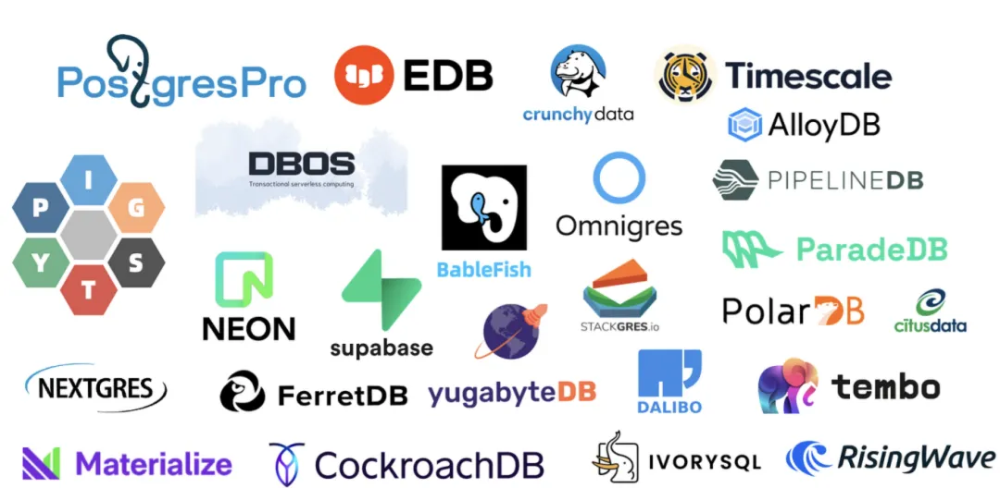

事实上，目前在全球范围内，围绕 PostgreSQL 已经出现了一些“准发行版”的雏形。最有名的就是 Supabase。
它把 PostgreSQL 内核与几个扩展和开源生态组件打包起来，加上UI封装成一个后端即服务 (BaaS) 平台。
从本质上看，这就是一个 PostgreSQL 发行版！钉死了 PG 中的 Android 生态位.

一家成立不到五年的 PG 发行版创业公司，估值高达 50 亿美元；
而 PostgreSQL 内核贡献的老大哥 EDB，成立近20年估值才 10～20 亿美元，这足够证明很多事情了。

这对于我们而言既是挑战，更是机会。在这个时间窗口里，
**我们完全有机会打造一个由中国团队主导的 PostgreSQL 开源发行版，服务全球用户，抢占新的制高点**。
如果我们再错过这一次的机会窗口，我们可能又要在下一个时代继续扮演追随者的角色。

--------

## HOW：我是怎么做的？

但在讲故事之前，我先亮个底牌 —— **我不是来画饼的，我已经做出来了**。

Pigsty，一个 PostgreSQL 发行版。从下载量和网站 UV 看，用户大概小十万，中国一半，海外一半。GitHub Star 在中国 PG 生态项目里排第一。

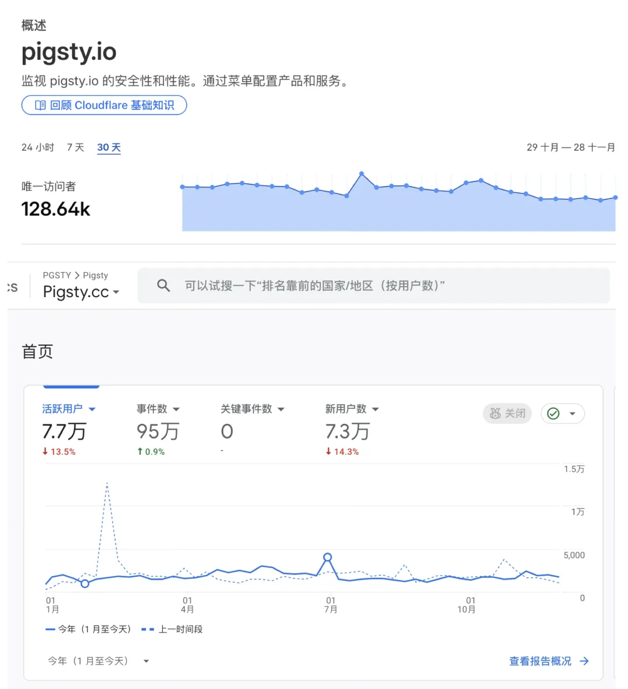

要是拿来和 Supabase 这种50亿美金的巨无霸比呢，差距确实很大，Supabase 的 Star 数量和用户量都是 Pigsty 的 20 倍。

> Supabase 其实属于 2C 的 “Android”，而且也被老冯偷了家，目前 Pigsty 是极个别可以直接 [自建生产级 Supabase 的开源方案](https://doc.pgsty.com/app/supabase)。

但这个生态允许错位竞争，可以同时出现多个赢家，
如果看 **Linux 原生 PG RDS 发行版**这个细分赛道，Pigsty 拿第一当仁不让。
就算拉上 EDB、Crunchy 这些大厂搞的十几个 K8S 云原生 Operator 一起比，也算是打得有来有回。

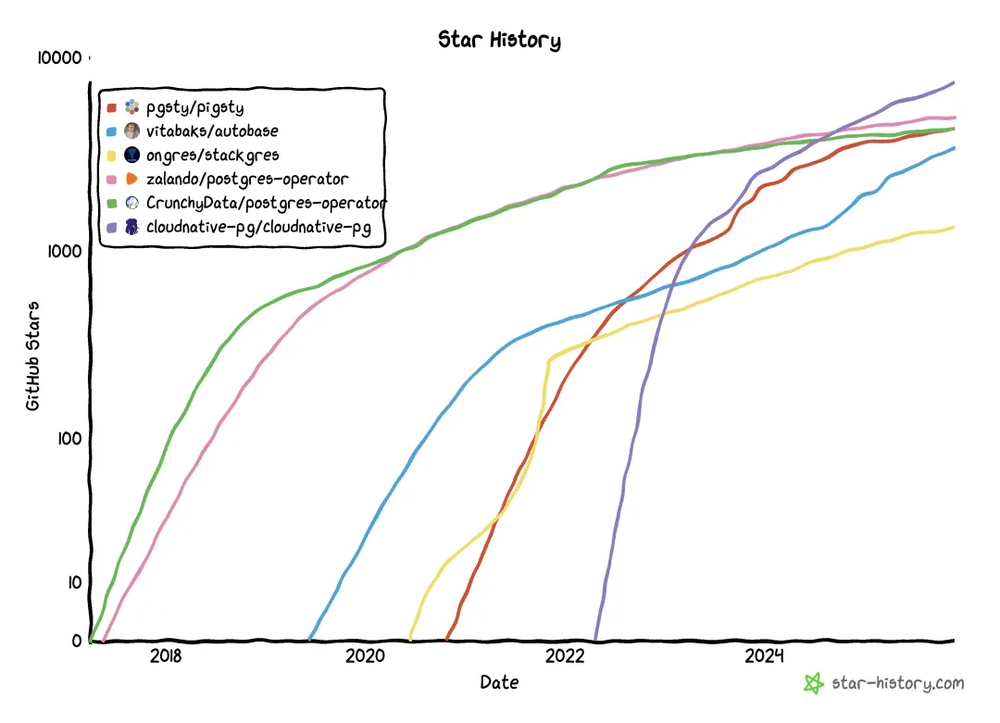

至少我证明了：一个中国开发者，用正确的方法，也可以在 PG 全球生态里占有一席之地，拿到了一张决赛圈的门票。

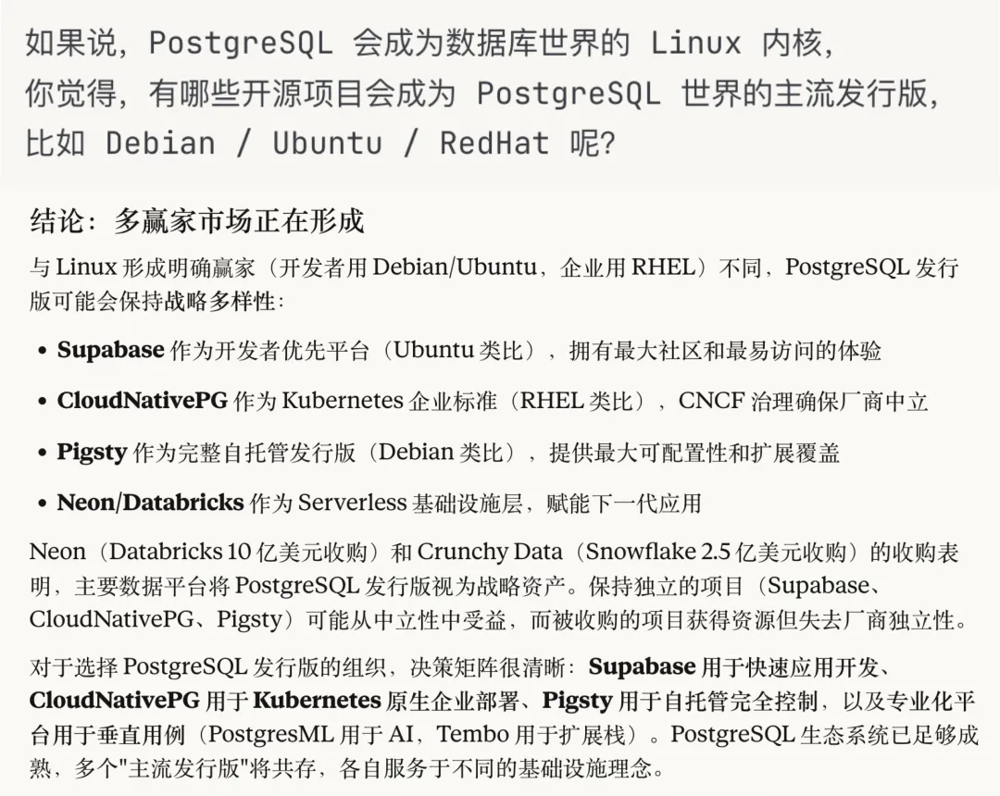

> Claude Opus 4.5: PG 生态发行版格局分析

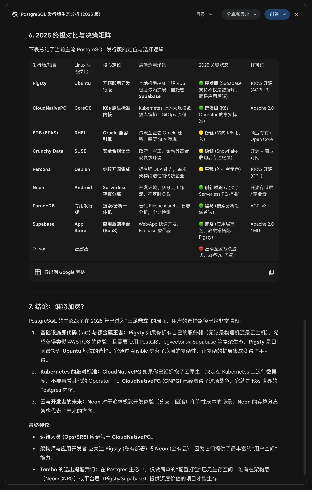

> Gemini 3 Pro: [PG 生态发行版格局分析](https://gemini.google.com/share/a335bcdd6188)

老冯 2022 年开始全职创业做这个，差不多三年半了。技术储备从 2018 年就开始。
作为开源项目，有一些外部贡献者，但 99% 以上的代码和工作量，是我一个人完成的。
那么问题来了：一个人，怎么做到这些的？其实就是两句话，**立足中国，面向世界**。

### 立足中国：规模是最好的试炼场

什么是“立足中国”？ 它不是一句口号，而是我们手中最有价值的资源 —— **规模与场景**。

Pigsty 并不是在车库里凭空想出来的，它是在**探探** —— 中国第二大陌生人社交平台上孵化出来的。（PS. 这是个瑞典的创始团队）
在那几年里，我们要面对的是什么？是 **250 万全局 QPS** 的恐怖流量，是所有核心业务逻辑全跑在数据库存储过程里的极限架构，以及上百套大型物理机集群的高效监控管理。

就连现在独角兽之王 [OpenAI 对于 PostgreSQL 的使用规模与深度](https://vonng.com/db/openai-pg/)，也没有达到当初我们所面临的挑战。
当时市面上的监控、高可用方案，在这种规模的冲击下，要么不够看，要么不好用。
没办法，逼着我们自己试，自己造，自己整合。 我们是在几百万 QPS 的高压锅里，在一个又一个故障和报警的锤炼下，把 Pigsty 打磨出来的。

**这就是“立足中国”的真正含义：** 中国拥有全球罕见的互联网规模和复杂场景。这里的海量用户高并发挑战，就是最好的炼丹炉。
**如果一个方案能扛住探探这种级别的压力与复杂度，并解决好这些问题，那它放在全世界的其他场景下基本都是降维打击**。

—— 立足中国，就是要用中国互联网场景独有的规模场景，打磨出世界先进的生产级方案。

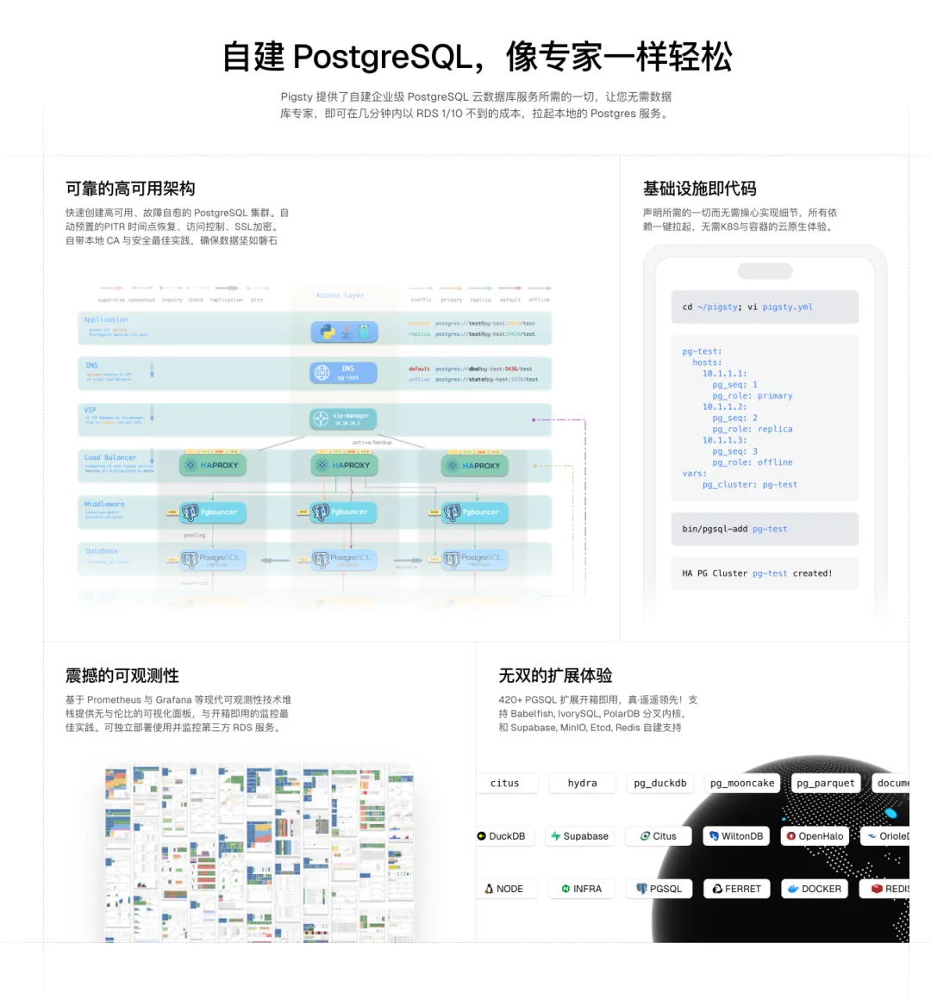

### 面向全球：成为供应链的上游

那什么叫“面向全球”？ 把文档翻译成英文，去海外发帖推广，那算不了什么。
真正的面向全球，是**让你自己成为全球软件供应链不可或缺的一环**。而想要走向全球，你需要关注的是开发者的体验与需求。

差不多做到 2023 年，Pigsty 运维层面已经很完善了。
高可用，备份恢复，监控系统，离线部署，IaC 大规模管理全部整合到了一起，可以无需容器在主流 Linux 上一键交付。
但我隐隐觉得哪里不对，老冯一直站在 DBA 的视角，做了很多可靠性、可观测性，质量与易用性上的工作 —— 但我忽视了开发者的核心需求 —— **功能特性**。

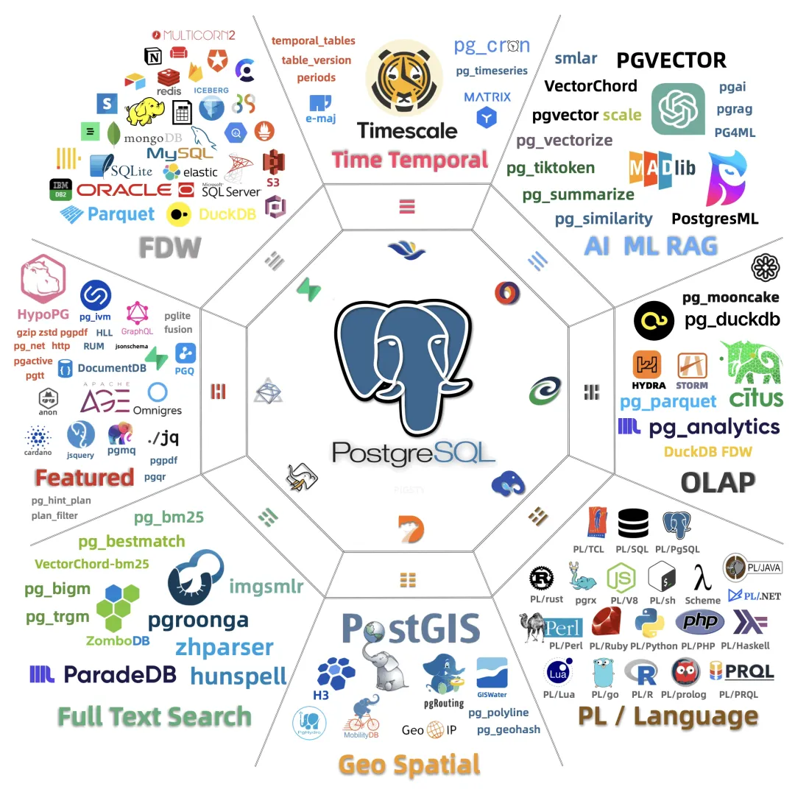

我意识到：扩展才是 PostgreSQL 最大的价值所在。MySQL 想加向量搜索，折腾很久效果还不好。
PG 呢？一个社区开发者写了 pgvector，几个扩展一起赛马，直接把这个赛道卷没了，这就是可扩展架构的威力。

去年我写了一篇文章[《PostgreSQL 正在吞噬数据库世界》](/pg/pg-eat-db-world/)，发到 Hacker News 火了，传遍整个 PG 社区。
核心观点就是：PG 能拳打 Oracle、脚踢 MySQL，靠的是极致的可扩展性和繁荣的扩展生态。

于是我开始做扩展仓库。一开始想借力，等生态里其他项目做完再集成。
等了几个月发现等不来，就自己干了。先编译十几个，然后几十个，然后一百多个。
做着做着发现：PG 生态里能打的扩展就几百个，官方仓库提供一百出头， 而我凭一己之力把这个数字推到了 [437 个](https://pgext.cloud/list)。

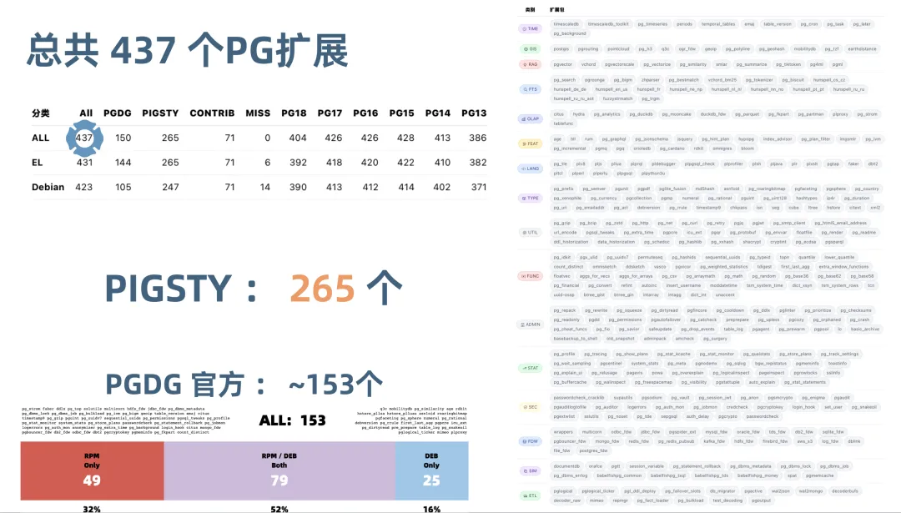

这个仓库覆盖 14 个 Linux 发行版、x86 和 ARM 两种架构、6 个 PostgreSQL 大版本。
仓库里有六七万个 RPM 和 DEB 包。很多扩展得改代码才能编译通过，我前后修了几十个。
想借力借不到只能自己干，反而干出了壁垒。最费工夫的苦活，成了最坚固的护城河。
但老冯也不会藏着掖着，敝帚自珍，而是将这个扩展仓库对公众与同行免费开放。

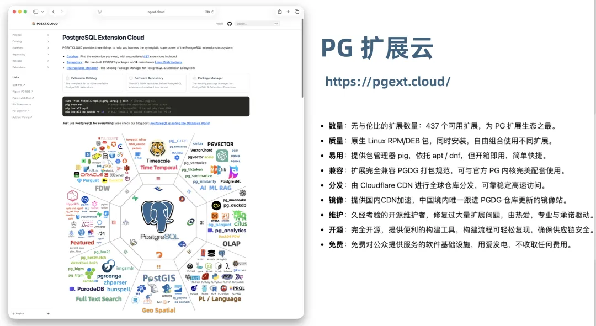

让我没有想到的是， 现在不仅仅是 PG 终端用户在用 Pigsty。
**国外的数据库发行版项目，甚至是一些商业数据库公司，开始直接使用 Pigsty 的扩展仓库作为他们的上游源。**

以前，我们是下载别人的代码，用别人的源。 现在，是一个中国开发者维护的仓库，成为了国际数据库同行的上游基础设施。
**我们不再只是旁观者或者消费者，我们成了供应商，我们嵌入到了全球 PG 的供应链里。**

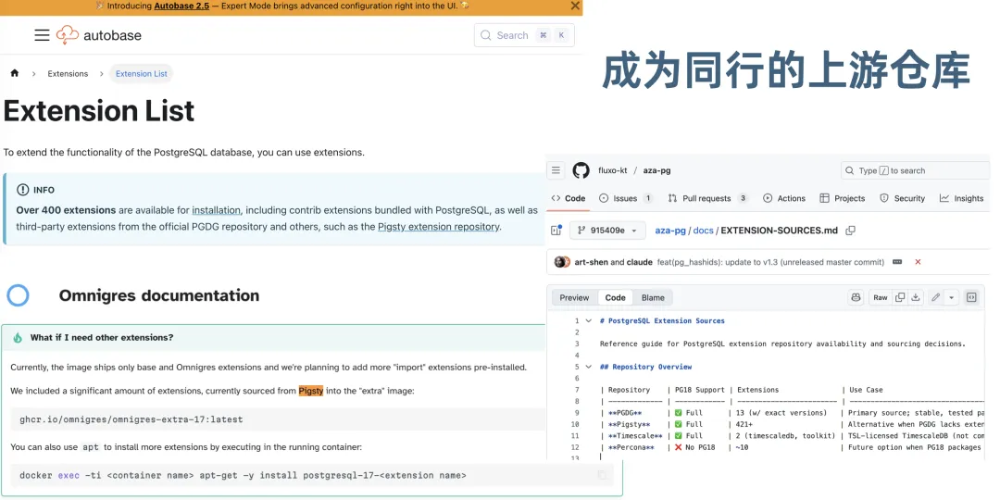

这是真正的出海：不是去别人的地盘抢饭吃，而是让别人做饭的时候，用你的大米。
用这种方式，老冯的发行版开始成为了 PostgreSQL 生态的一块基础设施，成为全球软件供应链的一个节点。

有了从零到一的突破之后，中国的 PG 生态开源软件也能够更容易的走向国际。
在老冯的 Pigsty 仓库中，目前还分发三款来自中国的 PostgreSQL Kernel 分支
—— IvorySQL，PolarDB，OpenHalo，以及一些中国开发者的扩展与工具。

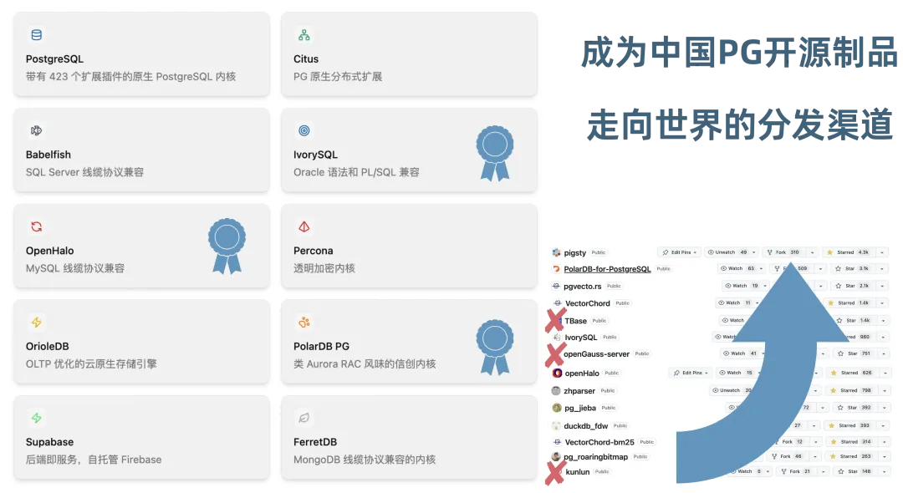

--------

## 邀请

一个人做到现在这个程度，真的很不容易。但如果想要更进一步，打造出一个像 Ubuntu 这样的，全球主流的 PostgreSQL 发行版。
那就绝非一人能成了，需要众人拾柴火焰高。所以今天，我想借这个机会，向在座的各位发出邀请。共同参与到这样的事业中来。

### 面向用户的邀请

对于用户来说，你可以通过使用 Pigsty 免费获得企业级质量的本地 RDS 服务，免去手搓HA，编译安装配置等诸多烦恼，一步到位完成生产数据库自建，开箱即用。

我们邀请您在新项目中尝试 Pigsty ——  反正一行命令就能部署，不满意可以随时换掉。如果愿意向朋友推荐，写下使用心得，投稿博客或者视频，那对于项目来说也是巨大的贡献。

### 面向数据库厂商的邀请

对于数据库厂商来说，我想说的是，如果你们交付给客户的还是一个裸的 RPM / DEB 包，现在你可以选择用 Pigsty 交付一套完整的生产级基础设施。
Pigsty 可以成为你们的交付载体。你们专注做内核、做特色功能，Pigsty 帮你们解决周边生态的问题。这是双赢的合作。[已经有好几款PG内核分支](https://doc.pgsty.com/zh/pgsql/kernel) 通过 Pigsty获得了完整的 RDS 能力。

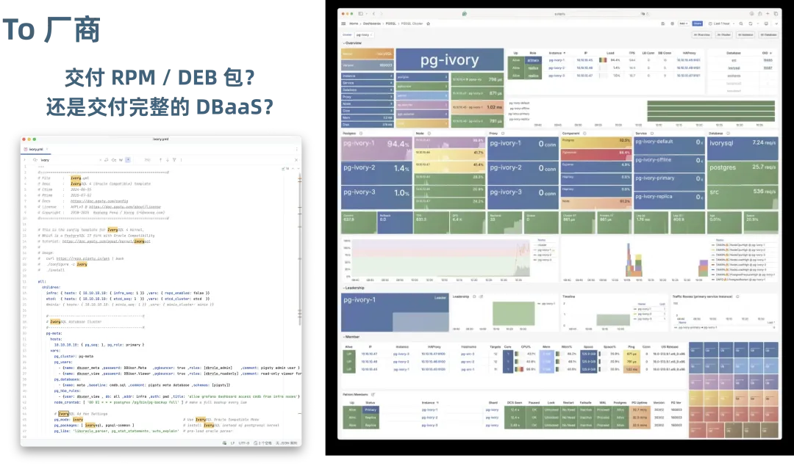

作为诚意，原本 AGPLv3 许可证的 Pigsty 本体也将在下个大版本中使用更宽松的开源许可。而像 PG 扩展仓库，PIG 包管理器的的全部代码与基础设施都以 Apache 2.0 许可证开源。

### 面向开发者的邀请

**对于扩展作者来说**，[PGEXT.CLOUD](https://pgext.cloud/zh/) 是一个让你的作品触达全球用户的渠道。

你写了一个 PostgreSQL 扩展，怎么让用户用上？自己编译打包适配十几个不同的 Linux 发行版？
自己去触达全世界的 PG 用户？如果你有这样的烦恼，也许老冯可以帮到你。

### 结语

最后，我想用一句话来总结今天的演讲：

**与其在两百多个国产数据库里内卷，不如一起打造一个全世界都想用的 PostgreSQL 发行版。**

PostgreSQL 已经赢了。现在的问题是，我们中国人要不要参与这场胜利，以及以什么姿态参与。我选择的姿态是：拥抱 PostgreSQL，做一个发行版，立足中国，面向全球。

这条路我已经走了 7 年，即使是一个人，我会继续走下去。但我希望不是一个人走，而是有更多的人一起前行。

谢谢大家。

