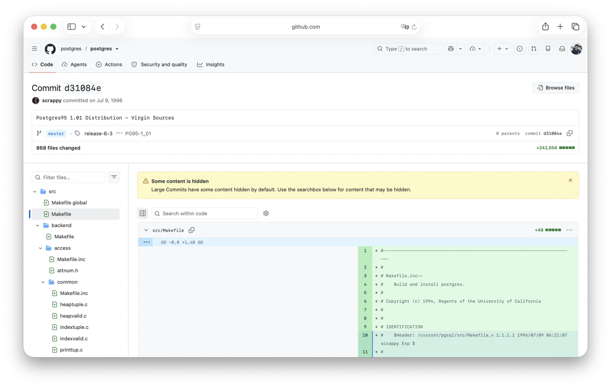

今天（2026 年 7 月 8 日）是 PostgreSQL 的 30 岁生日。

三十年前的这一天，Marc Fournier 在刚刚架设好的 CVS 仓库里敲下了一笔名为「Postgres95 1.01 Distribution - Virgin Sources」的提交。这是 PostgreSQL 代码仓库中的第一笔提交（[`d31084e`](https://github.com/postgres/postgres/commit/d31084e9d1118b25fd16580d9d8c2924b5740dff)），至今仍躺在 Git 历史的最底端。

## 为什么是 7 月 8 日？

每年 7 月 8 日，PostgreSQL 社区都会互道一声「Happy Birthday」。这个日子的由来是：1996 年 7 月 8 日，Marc Fournier 在 Hub.org 上架起了第一台公开的 CVS 服务器，全球社区正式从伯克利手中接过这个已有十年历史的学院项目。维基百科条目里的「Initial release」，标注的也是这一天。

当然，若论血统，这个项目远不止三十岁。1986 年，Michael Stonebraker 在加州大学伯克利分校启动了 POSTGRES 项目，作为他上一个作品 Ingres 的后继者——「Post-Ingres」，这便是名字的由来。

而 Ingres 本身还可以再往前追溯到 1970 年代中期。1994 年，伯克利的两位华人研究生 Andrew Yu 与 Jolly Chen 给 POSTGRES 换上了 SQL 查询语言，替换掉原生的 POSTQUEL，并于次年以 Postgres95 之名开源发布。

到 1996 年，伯克利的学术项目走到了尽头，代码何去何从？答案就是那台 CVS 服务器。从这一天起，这个项目不再属于某所大学或某家公司，而属于一个自发聚拢起来的全球社区。
同年，项目更名为 PostgreSQL，并在次年 1 月以 6.0 的版本号重新出发。至于 Stonebraker 本人，他在 2014 年拿到了图灵奖，POSTGRES 正是他的代表作。

## 生日考据：8 日还是 9 日？

细心的考据党会发现一个问题：那笔「Virgin Sources」提交的时间戳，其实是 1996 年 7 月 9 日 06:22:35 UTC。换算成北京时间，是 1996 年 7 月 9 日 14:22:35。那么，生日到底该算 8 日还是 9 日？

答案藏在时区里。

7 月 8 日在史料中是「CVS 服务器上线的那一天」。它是一个日期，而不是精确到秒的时间戳；架服务器是一次开张动作，不像 commit 那样会被版本控制系统自动盖章。整段历史里唯一精确到秒的时刻，就是 1996 年 7 月 9 日 06:22:35 UTC 的第一笔提交。

而把这一戳换算到 Postgres95 的老家、伯克利所在的加州（时值夏令时 PDT，UTC−7），正是 1996 年 7 月 8 日 23:22:35——距离午夜只差 37 分 25 秒。

于是，有趣的事情发生了：社区认定的生日（服务器开张的 7 月 8 日）与代码「物理落地」的那一戳，本是两件独立的事，却在加州时间里落回了同一个深夜；往东挪到 UTC，日历才刚翻到 9 日。所谓「差了一天」，不过是这 37 分钟卡在午夜线两侧造成的时区错觉。从出生地看，PostgreSQL 的诞生，确确实实就在 7 月 8 日。

## 三十而立

三十年间的里程碑，随手就能数出一串：6.5 引入 MVCC，7.1 带来 WAL，8.0 原生登陆 Windows，9.0 有了流复制，9.4 用 JSONB 优雅地接住 NoSQL 浪潮，10 带来逻辑复制与声明式分区。如今，PostgreSQL 18 已是当前稳定大版本，19 也已经在路上。

但比任何单个特性都更重要的，是 Stonebraker 在四十年前埋下的那颗种子：**可扩展性**。

三十年后，正是它让 PostgreSQL 从一个数据库长成了一个生态。PostGIS 让它成为地理空间数据的事实标准，TimescaleDB 让它处理时序，Citus 让它水平扩展，pgvector 让它在 AI 浪潮中充当向量数据库。数以百计的扩展，让 PostgreSQL 不再只是一个数据库，而是一个数据库平台。

它连续多年位居 Stack Overflow 开发者调查「最受欢迎数据库」前列，成了事实上的默认选择。用我自己的话说：[**PostgreSQL 正在吞噬整个数据库世界**](/pg/pg-eat-db-world/)。

## 下一个三十年

站在三十周年的节点上向前望，数据库的使用者正在发生一场静默的变革：越来越多的 SQL 不再出自人类之手，而是出自 AI 与 Agent。当智能体成为数据库的头号用户，PostgreSQL 的开放、可扩展与坚如磐石，恰好是新时代最稀缺的品质。

一个诞生于学院、成长于社区、不受任何单一公司控制的数据库，在数据主权与 AI 基础设施日益成为焦点的今天，显得比以往任何时候都更加珍贵。

三十年前的那个加州深夜，Marc Fournier 敲下第一笔提交时，大概不会想到：这个从大学项目里抢救出来的代码库，三十年后会运行在这颗星球的每个角落——从树莓派到大型机，从创业公司的第一行代码，到银行与电信的核心系统，再到 AI Agent 的记忆底座。

生日快乐，PostgreSQL！愿你的下一个三十年，依然自由，依然开放，依然坚如磐石。

## 参考资料

- [PostgreSQL 第一笔 Git 提交：`d31084e`](https://github.com/postgres/postgres/commit/d31084e9d1118b25fd16580d9d8c2924b5740dff)
- [PostgreSQL 历史：PostgreSQL 官方文档](https://www.postgresql.org/docs/current/history.html)
- [PostgreSQL：维基百科](https://en.wikipedia.org/wiki/PostgreSQL)
- [PostgreSQL 正在吞噬数据库世界](/pg/pg-eat-db-world/)
- [Stack Overflow 2025：PostgreSQL 已经主宰数据库世界](/pg/so2025-pg/)
