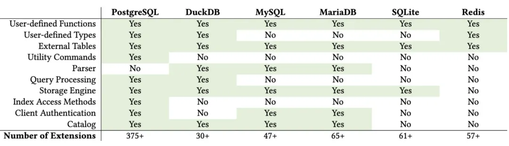
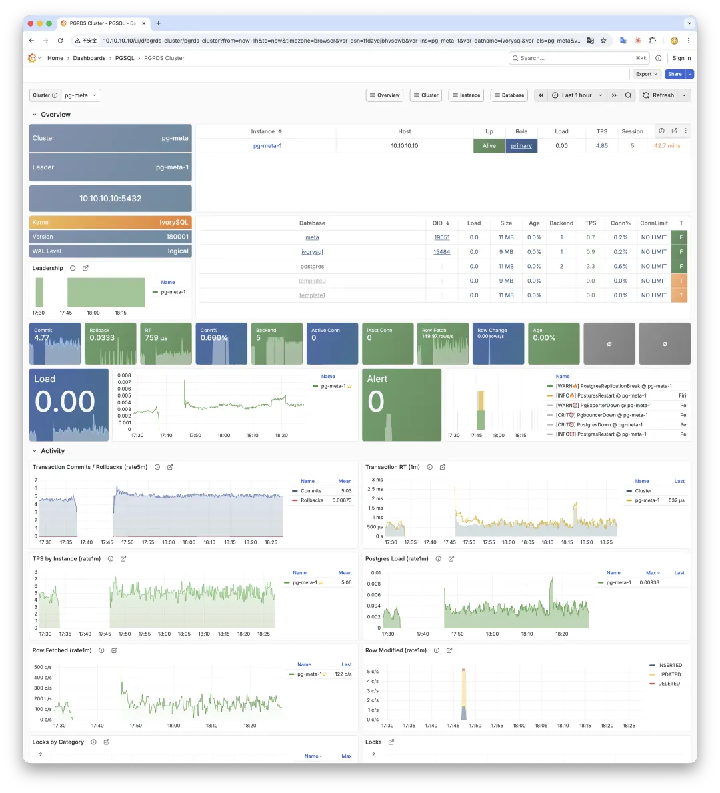
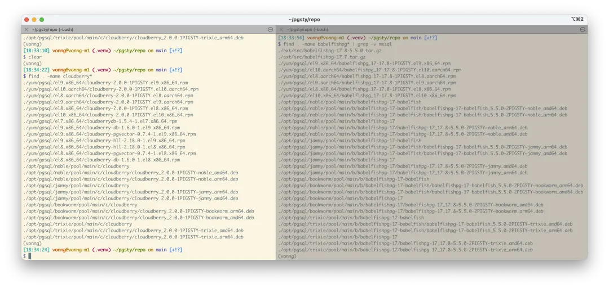
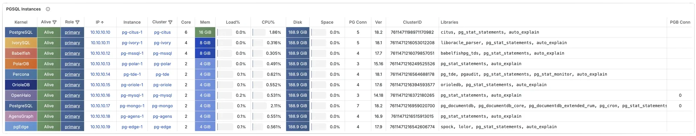
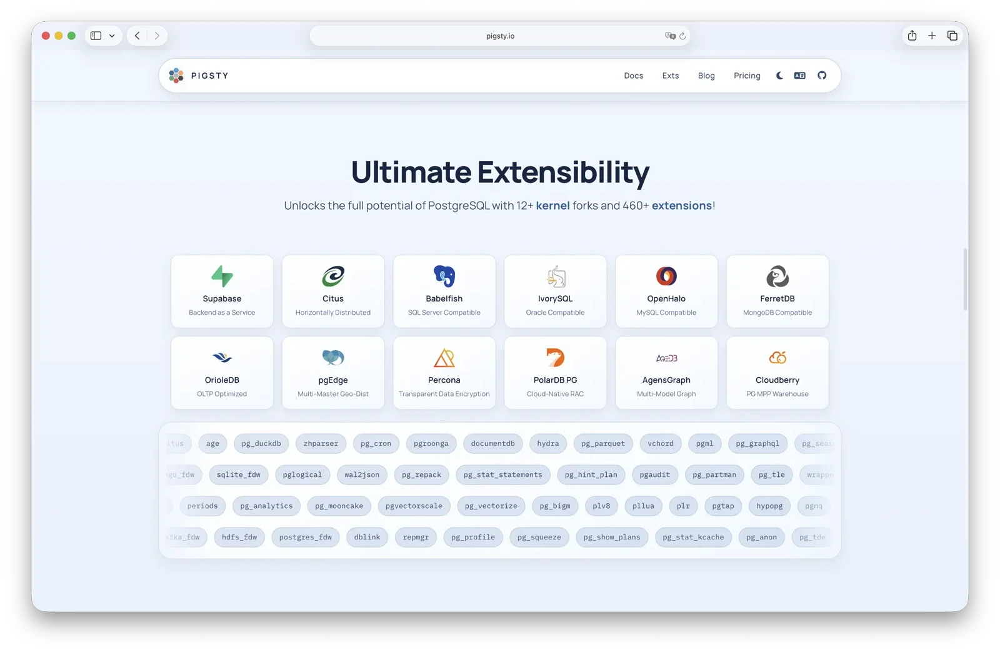

I used to roll my eyes at "Oracle compatibility" in PostgreSQL forks.
My take was simple: if your SQL doesn't run on vanilla Postgres, fix your app rather than database.

Then a migration task slightly changed my mind.


--------

## The Problem: A JAR and Nothing Else

A Fortune 500 auto company asked me to upgrade their database.
They were running EDB (EnterpriseDB) PostgreSQL 9.1 — released September 2011, roughly 15 years ago.
The system had already caused several production incidents on their cloud platform. 
(mainly because of a 22TB DB on 500 IOPS disk, LOL)

Time to move.

The version gap alone was large (9.1 → 18), but manageable.
The real problem was the application: the source code was **lost**.

All that remained was a JAR file. SQL statements were baked into it as string literals,
and those statements used EDB's Oracle-compatible syntax — things like bare SYSDATE.

-------

## Why You Can't Just "Add a Function"

In Oracle, `SYSDATE` is a keyword-level construct that returns the current timestamp. In PostgreSQL, you'd write `current_timestamp` or `clock_timestamp()`.

At first glance this sounds easy: create a function and move on.

```sql
CREATE FUNCTION sysdate() RETURNS timestamp(0) AS
  $$SELECT clock_timestamp()::timestamp(0) $$ LANGUAGE SQL;
```

But the application doesn't call `sysdate()`. It sends bare `SYSDATE` — no parentheses. PostgreSQL's parser sees that as a column reference, not a function call:

```bash
postgres@pg-meta-1:5432/postgres=# SELECT SYSDATE;
ERROR: ivory column "sysdate" does not exist
LINE 1: SELECT SYSDATE;
               ^
Time: 0.249 ms
```

And this is where PostgreSQL's extensibility hits a wall. You can extend types, operators, indexes, storage engines, execution hooks, foreign data wrappers — 
but you **cannot extend the SQL grammar** through an extension. Recognizing `SYSDATE` as a keyword requires changes to the parser itself, deep in core.



> [Anarchy in the Database - Survey and Evaluation of DBMS Extensibility](https://abigalekim.github.io/assets/pdf/Anarchy_in_the_Database_PGConfDev2024.pdf)

With source code, the fix would be trivial: global find-and-replace. 
Without the app source, the debt has to be absorbed somewhere else.
Decompiling the JAR to patch SQL string literals is theoretically possible, but brittle and hard to validate.

So the problem landed on the database layer.

-------

## IvorySQL as a Pragmatic Solution

The requirement is awkward, but still real. So what are the options?

EDB handles this well — it's a proven product — but the customer had their own reasons for moving away from it (budget). 
Various domestic Oracle-compatible databases weren't acceptable for compliance reasons either.
After filtering constraints, the practical open-source option was [IvorySQL](https://www.ivorysql.org/).

IvorySQL is an Apache-2.0 fork of PostgreSQL maintained by HighGo. 
It adds Oracle compatibility at the kernel level: PL/SQL support, Oracle-style syntax and functions, 
compatible data types and system views. The current release, IvorySQL 5.1, tracks PostgreSQL 18.1.

One important nuance: this is **SQL-level** compatibility, not wire-protocol compatibility. 
Clients still connect with standard PostgreSQL drivers. 
IvorySQL exposes a separate Oracle-compatible port (1521 by default) where the parser accepts Oracle idioms. 
The standard PG port (5432) remains vanilla:

```bash
$ psql -p 5432 -c 'SELECT sysdate'
ERROR:  column "sysdate" does not exist

$ psql -p 1521 -c 'SELECT sysdate'
  sysdate
------------
 2026-02-22

$ psql -p 1521 -c 'SELECT version()'
 PostgreSQL 18.1 (IvorySQL 5.1) on aarch64-unknown-linux-gnu ...
```


------

## But raw RPM is not enough

Of course, IvorySQL deliver their own RPM and DEB packages, but that's just the kernel.
It does not have the operational capabilities of a full RDS — no HA & PITR, no monitoring nor IaC.

Then I integrated IvorySQL into [Pigsty](https://pigsty.io) - the open-source PG distribution，
so the customer got HA, monitoring, backup, and IaC out of the box
— same operational surface as any other Pigsty deployment, just with a different kernel underneath.

Three commands later, an Oracle-compatible PostgreSQL RDS was up.
On the default PG port `5432`, `SYSDATE` fails.
On IvorySQL's Oracle-compatible port `1521`, it works:


```bash
curl -fsSL https://repo.pigsty.io/get | bash; cd ~/pigsty
./configure -c ivory    # use the IvorySQL template
./deploy.yml
```



From my testing, IvorySQL's changes are incremental rather than a deep rewrite of PostgreSQL internals.
I haven't hit stability issues in practice, though for kernel-level bugs, HighGo owns that support boundary.

So yes, this solved a very specific legacy Oracle-compatibility problem cleanly.
It is a niche, but clearly not a fake one.


-------

## Pigsty as a "meta-distribution"

The interesting part is you can not only use the oracle-compatible kernel,
but also switch to other kernels without changing the platform layer.

Here are a few recent kernel-side things around Pigsty.

**Babelfish rebuild.**
Babelfish (AWS's SQL Server-compatible PG kernel) used to rely on WiltonDB packages.
Those packages were old (PG15), limited in platform coverage (EL8/9 + Ubuntu 22/24), and missed Debian + EL10.
They also required another vendor repo. So I rebuilt the packaging pipeline to Pigsty standards with Codex.
Now Babelfish installs directly from Pigsty's own repo, with broader platform support, and on PG 17.



**Cloudberry data warehouse kernel.**

After Babelfish, I also packaged Apache Cloudberry (the open-source warehouse line based on Greenplum 7).
Cloudberry 1.6 at least had EL8/9 RPMs; after 2.0, we waited months without official binaries.
So I built them myself: EL 8-10, Debian 12/13, Ubuntu 22/24, x86_64 + ARM64, 14 Linux targets total.
This was non-trivial; Codex ran a lot of integration/unit tests and we had to patch a few issues before EL10/Debian13 were clean.

Also updated recently:
- OrioleDB to 1.6 Beta14
- Percona PGTDE to 18.1
- pgEdge newly added (spock 5.0.5)
- AgensGraph newly added (16.x)

This is why I call Pigsty a **meta-distribution**, not just another PostgreSQL distribution.

|                              Kernel                               | Key Feature                           | Description                                   |
|:-----------------------------------------------------------------:|:--------------------------------------|:----------------------------------------------|
|          [**PostgreSQL**](https://pigsty.io/docs/pgsql)           | **Native kernel, full extension set** | Vanilla PostgreSQL with 451 extensions        |
|      [**Citus**](https://pigsty.io/docs/pgsql/kernel/citus)       | **Horizontal scaling**                | Distributed PostgreSQL via native extension   |
|  [**Babelfish**](https://pigsty.io/docs/pgsql/kernel/babelfish)   | **SQL Server compatible**             | SQL Server wire-protocol compatibility (PG17) |
|   [**IvorySQL**](https://pigsty.io/docs/pgsql/kernel/ivorysql)    | **Oracle compatible**                 | Oracle syntax and PL/SQL compatibility        |
|   [**OpenHalo**](https://pigsty.io/docs/pgsql/kernel/openhalo)    | **MySQL compatible**                  | MySQL wire-protocol compatibility             |
|    [**Percona**](https://pigsty.io/docs/pgsql/kernel/percona)     | **Transparent data encryption**       | Percona distribution with pg_tde              |
|           [**FerretDB**](https://pigsty.io/docs/ferret)           | **MongoDB migration**                 | MongoDB wire-protocol compatibility           |
|   [**OrioleDB**](https://pigsty.io/docs/pgsql/kernel/orioledb)    | **OLTP optimization**                 | Zheap, no bloat, S3 storage                   |
|    [**PolarDB**](https://pigsty.io/docs/pgsql/kernel/polardb)     | **Aurora-style RAC**                  | RAC, China-local compliance scenario          |
|   [**Supabase**](https://pigsty.io/docs/pgsql/kernel/supabase)    | **Backend as a Service**              | PostgreSQL-based BaaS, Firebase alternative   |
| [**Cloudberry**](https://pigsty.io/docs/pgsql/kernel/cloudberry)  | **MPP DW and analytics**              | Massively parallel data warehouse             |
| [**AgensGraph**](https://pigsty.io/docs/pgsql/kernel/agensgraph)  | **Graph database kernel**             | PostgreSQL-based graph database branch        |
|     [**pgEdge**](https://pigsty.io/docs/pgsql/kernel/pgedge)      | **Distributed edge kernel**           | Distributed PostgreSQL for edge scenarios     |



No matter which kernel you choose, Pigsty's platform layer is the same: monitoring, HA, backup/restore, and IaC.
Kernel can change. Platform capabilit4y stays stable. That is what a meta-distribution should do.



Hope this project can help you enjoy the fun of using different flavors of PostgreSQL.