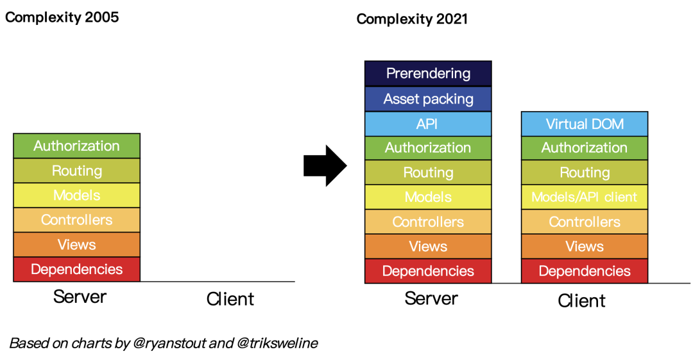
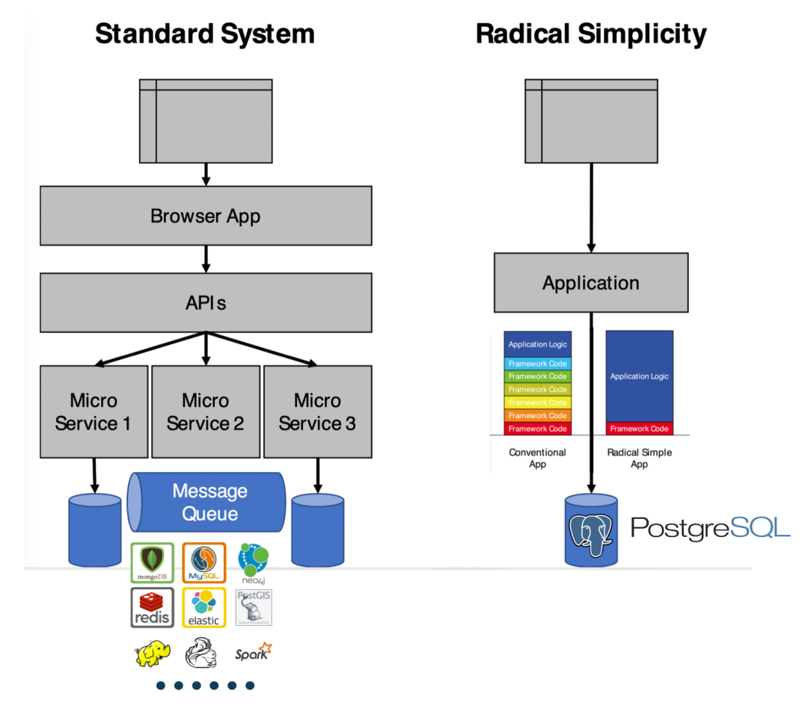
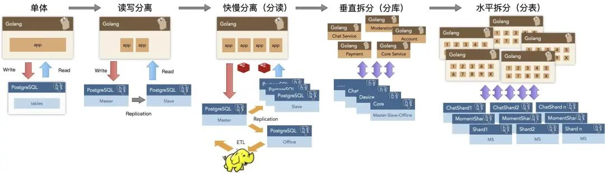
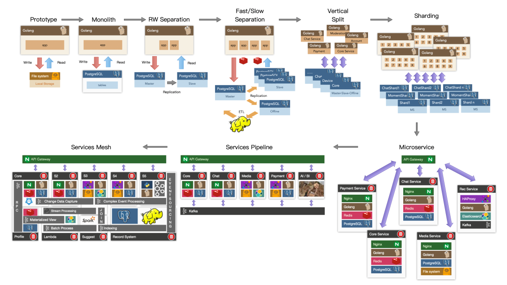

This article was **published by Stephan Schmidt @ KingOfCoders on Hacker News and sparked heated discussion**: Using PostgreSQL to replace Kafka, RabbitMQ, ElasticSearch, MongoDB, and Redis is a viable approach that can dramatically reduce system complexity and maximize agility.

------

> How to simplify complexity and move fast: **Use PostgreSQL for everything**

Welcome, HN (Hacker News) readers. Technology is about trade-offs. Using PostgreSQL for everything is also a strategy and trade-off. Obviously, we should choose the right tool for our needs. In many cases, that tool is **PostgreSQL**.

In helping many startups, I've observed that far more people overcomplicate their systems than those who choose overly simple tools. If you have over a million users, over fifty developers, and you truly need Kafka, Spark, and Kubernetes, then go ahead. If you have more systems than developers, just using PostgreSQL is a wise choice.

**P.S.: Using PostgreSQL for everything doesn't mean doing everything on a single machine ;-)**

------

### **Simply put, everything can be solved with PostgreSQL**

Complexity is easy to invite but hard to dismiss—once **complexity** creeps into your home, getting rid of it isn't so easy.

------

### However, we have an extremely simplified solution

------

One way to simplify the tech stack, reduce components, accelerate development, lower risk, and provide more features in startups is **"Just use PostgreSQL for everything"**. PostgreSQL can replace many backend technologies, including Kafka, RabbitMQ, ElasticSearch, MongoDB, and Redis, at least until millions of users without any issues.

Use PostgreSQL instead of Redis for caching, using **UNLOGGED Tables** and storing JSON data with TEXT type, and use stored procedures to add and enforce expiration time, just as Redis does.

Use PostgreSQL as a message queue, using **SKIP LOCKED** instead of Kafka (if you only need message queue capabilities).

Use PostgreSQL with **TimescaleDB** extension as a data warehouse.

Use PostgreSQL's **JSONB** type to store, index, and search JSON documents, replacing MongoDB.

Use PostgreSQL with **pg_cron** extension as a cron daemon, executing specific tasks at specific times, such as sending emails or adding events to message queues.

Use PostgreSQL + PostGIS for **geospatial queries**.

Use PostgreSQL for **full-text search**, add [**ParadeDB**](http://mp.weixin.qq.com/s?__biz=MzU5ODAyNTM5Ng==&mid=2247486913&idx=1&sn=3b7d8cf3f0e323932aba52c897f3c7a4&chksm=fe4b381ac93cb10cc6175c4c7978b5903946d369fe0084fbae5edf76ab08d84134260f28dffc&scene=21#wechat_redirect) to replace ElasticSearch.

Use PostgreSQL to **generate JSON in the database**, eliminating server-side code writing and directly providing API services.

Use **GraphQL adapters** to make PostgreSQL provide GraphQL services.

I've said it clearly: **Just use PostgreSQL for everything**.

------

### About Author Stephan

As a CTO, interim CTO, CTO coach, and developer, Stephan has left his mark in the technical departments of many rapidly growing startups. He learned programming around 1981 at a department store, wanting to write video games. Stephan studied computer science at the University of Ulm, specializing in distributed systems and artificial intelligence, and also studied philosophy. When the internet entered Germany in the 90s, he was the first programming employee at several startups. He founded a venture capital-funded startup, handled architecture, processes, and growth challenges at other VC-funded fast-growing startups, held management positions at ImmoScout, and was CTO of an eBay Inc. company. After his wife successfully sold her startup, they moved to the seaside, and Stephan began CTO coaching work. You can find him on LinkedIn or follow @KingOfCoders on Twitter.

------

### Translator's Comments

Translator: **Feng Ruohang**, entrepreneur and PostgreSQL expert, cloud-down advocate, author of the open-source PostgreSQL RDS alternative, ready-to-use PostgreSQL distribution — [Pigsty](http://mp.weixin.qq.com/s?__biz=MzU5ODAyNTM5Ng==&mid=2247485518&idx=1&sn=3d5f3c753facc829b2300a15df50d237&chksm=fe4b3d95c93cb4833b8e80433cff46a893f939154be60a2a24ee96598f96b32271301abfda1f&scene=21#wechat_redirect).

Using PostgreSQL for everything isn't a pipe dream but an emerging best practice. I'm very pleased about this: as early as 2016, I saw the potential here and chose to dive in, and things are developing as expected.

Tantan, where I used to work, was a pioneer on this path — PostgreSQL for Everything. This is a Chinese internet app created by a Swedish founding team — using PostgreSQL at a scale and complexity that's second to none in China. Tantan's technical architecture was based on **Instagram** — or rather, more radical, with almost all business logic implemented using PostgreSQL stored procedures (even including 100ms recommendation algorithms!).

Tantan's entire system architecture was designed and developed around PostgreSQL. With millions of daily active users, millions of global DB-TPS, and hundreds of TB of data, the data components used only PostgreSQL. It wasn't until approaching ten million daily active users that architectural adjustments began, introducing independent data warehouses, message queues, and caches. In 2017, we didn't even use Redis caching—2.5 million TPS was directly handled by PostgreSQL on over a hundred servers. Message queues were also implemented using PostgreSQL, and early-to-mid-stage data analysis was handled by a dedicated PostgreSQL cluster with dozens of TB. We had long practiced the philosophy of "PostgreSQL for Everything" and benefited greatly from it.

This story has a second half — the subsequent "microservices transformation" brought massive complexity, ultimately trapping the system in a quagmire. This made me even more convinced from another angle — I deeply miss the simple, reliable, efficient, and agile state when everything used PostgreSQL.

------

PostgreSQL isn't just a simple relational database but a data management abstraction framework with the potential to encompass everything and devour the entire database world. Ten years ago, this was merely potential and possibility; ten years later, it has materialized into real influence. I'm glad to witness this process and push this progress forward.

> [**PostgreSQL is for Everything!**](http://mp.weixin.qq.com/s?__biz=MzU5ODAyNTM5Ng==&mid=2247486215&idx=1&sn=52ce37a537336a6d07448f35c7bc4cfd&chksm=fe4b3edcc93cb7ca2dc87602430c2beb09ae5e7dcb568158541a1bd026e305d69d94cea81da4&scene=21#wechat_redirect)

------

## Further Reading

[PGSQL x Pigsty: The Database Swiss Army Knife is Here](https://mp.weixin.qq.com/s?__biz=MzU5ODAyNTM5Ng==&mid=2247486215&idx=1&sn=52ce37a537336a6d07448f35c7bc4cfd&scene=21#wechat_redirect)

[New PostgreSQL Ecosystem Player: ParadeDB](http://mp.weixin.qq.com/s?__biz=MzU5ODAyNTM5Ng==&mid=2247486913&idx=1&sn=3b7d8cf3f0e323932aba52c897f3c7a4&chksm=fe4b381ac93cb10cc6175c4c7978b5903946d369fe0084fbae5edf76ab08d84134260f28dffc&scene=21#wechat_redirect)

[FerretDB: PostgreSQL Disguised as MongoDB](https://mp.weixin.qq.com/s?__biz=MzU5ODAyNTM5Ng==&mid=2247486241&idx=1&sn=f39b87095837b042e74f55f8e60bb7a9&scene=21#wechat_redirect)

[AI Large Models and Vector Database PGVECTOR](https://mp.weixin.qq.com/s?__biz=MzU5ODAyNTM5Ng==&mid=2247485589&idx=1&sn=931f2d794e9b8486f623f746db9f00cd&scene=21#wechat_redirect)

[How Powerful is PostgreSQL Really?](https://mp.weixin.qq.com/s?__biz=MzU5ODAyNTM5Ng==&mid=2247485240&idx=1&sn=9052f03ae2ef21d9e21037fd7a1fa7fe&scene=21#wechat_redirect)

[PostgreSQL: The World's Most Successful Database](https://mp.weixin.qq.com/s?__biz=MzU5ODAyNTM5Ng==&mid=2247485685&idx=1&sn=688f6d6d0f4128d7f77d710f04ff9024&scene=21#wechat_redirect)

[Why is PostgreSQL the Most Successful Database?](https://mp.weixin.qq.com/s?__biz=MzU5ODAyNTM5Ng==&mid=2247485216&idx=1&sn=1b59c7dda5f347145c2f39d2679a274d&scene=21#wechat_redirect)

[Why PostgreSQL Has an Unlimited Future?](https://mp.weixin.qq.com/s?__biz=MzU5ODAyNTM5Ng==&mid=2247484591&idx=1&sn=a6ab13d93bfa26fca969ba163b01e1d5&scene=21#wechat_redirect)

[Better Open Source RDS Alternative: Pigsty](https://mp.weixin.qq.com/s?__biz=MzU5ODAyNTM5Ng==&mid=2247485518&idx=1&sn=3d5f3c753facc829b2300a15df50d237&scene=21#wechat_redirect)

### References

- `[1]` Just use Postgres for everything: *https://news.ycombinator.com/item?id=33934139*
- `[2]` Technical Minimalism Manifesto: *https://www.radicalsimpli.city/*
- `[3]` UNLOGGED Table: *https://www.compose.com/articles/faster-performance-with-unlogged-tables-in-postgresql/*
- `[4]` SKIP LOCKED: *https://www.enterprisedb.com/blog/what-skip-locked-postgresql-95*
- `[5]` Timescale: *https://www.timescale.com/*
- `[6]` JSONB: *https://scalegrid.io/blog/using-jsonb-in-postgresql-how-to-effectively-store-index-json-data-in-postgresql/*
- `[7]` pg_cron: *https://github.com/citusdata/pg_cron*
- `[8]` Geospatial queries: *https://postgis.net/*
- `[9]` Full-text search: *https://supabase.com/blog/postgres-full-text-search-vs-the-rest*
- `[10]` Generate JSON in database: *https://www.amazingcto.com/graphql-for-server-development/*
- `[11]` GraphQL adapters: *https://graphjin.com/*
- `[12]` What advantages does PostgreSQL have over MySQL?: *https://www.zhihu.com/question/20010554/answer/94999834*
