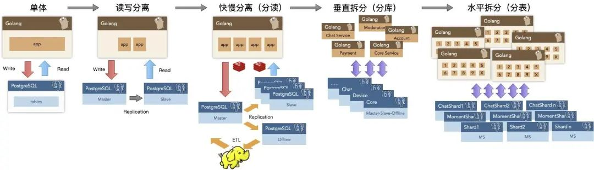

本文由 Stephan Schmidt @ KingOfCoders **发表于 Hacker News 并引发热议**[1]：使用 Postgres 替代 Kafka、RabbitMQ、ElasticSearch、Mongo 和 Redis 是一种切实可行的方式，这样做可以极大降低系统复杂度，并将敏捷性发挥到极致。

------

> 如何简化复杂度并快速前进：**用 PostgreSQL 完成所有任务**

欢迎，HN（Hacker News）读者们。技术是关于取舍的艺术。全面使用 PostgreSQL 完成所有工作，也是一种策略与权衡。显然，我们应根据需求选用合适的工具。很多情况下，这个工具就是 **Postgres**。

在辅助许多初创企业的过程中，我观察到很多人过度复杂化他们的系统，这样做的公司远超过那些选择了过于简单工具的公司。如果你们拥有超过一百万用户，超过五十名开发者，并且你们确实需要 Kafka、Spark 和 Kubernetes，那么请便。如果你的系统数量比开发者还多，只用 Postgres 就是一个明智之选。

**附言：全面使用 Postgres 并不意味着单台器搞定一切 ;-)**

------

### **简单来说，一切皆可用 Postgres 解决**

请神容易送神难，让**复杂度**溜进家里，再送走就没那么容易了。

------

### 然而，我们有极致简化的方案

------

在初创公司中简化技术栈、减少组件、加快开发速度、降低风险并提供更多功能特性的方法之一就是**“一切皆用 Postgres”**。Postgres 能够取代许多后端技术，包括 Kafka、RabbitMQ、ElasticSearch，Mongo和 Redis ，至少到数百万用户时都毫无问题。

使用 Postgres 替代 Redis 作为缓存，使用 **UNLOGGED Table**[3] 并用 TEXT 类型存储 JSON 数据，并使用存储过程来添加并强制执行过期时间，正如 Redis 所做的那样。

使用 Postgres 作为消息队列，采用 **SKIP LOCKED**[4] 来代替Kafka（如果你只需要消息队列的能力）。

使用加装了 **TimescaleDB**[5] 扩展的 Postgres 作为数据仓库。

使用 PostgreSQL 的 **JSONB**[6] 类型来存储、索引、搜索 JSON 文档，从而替代 MongoDB。

使用加装 **pg_cron**[7] 扩展的 Postgres 作为定时任务守护程序，在特定时间执行特定任务，例如发送邮件，或向消息队列中添加事件。

使用 Postgres + PostGIS 执行 **地理空间查询**[8]。

使用 Postgres 进行**全文搜索**[9]，加装 [**ParadeDB**](http://mp.weixin.qq.com/s?__biz=MzU5ODAyNTM5Ng==&mid=2247486913&idx=1&sn=3b7d8cf3f0e323932aba52c897f3c7a4&chksm=fe4b381ac93cb10cc6175c4c7978b5903946d369fe0084fbae5edf76ab08d84134260f28dffc&scene=21#wechat_redirect) 替代 ElasticSearch。

使用 Postgres **在数据库中生成JSON**[10]，免去服务器端代码编写，直接供 API 使用。

使用 **GraphQL适配器**[11]，也可以让 PostgreSQL 提供 GraphQL 服务。

我已明言，**一切皆可Postgres**。

------

### 关于作者 Stephan

作为一名CTO、临时CTO、CTO教练以及开发者，斯蒂芬在许多快速成长的初创公司的技术部门中都留下了自己的足迹。他在1981年左右，因为想编写视频游戏，就在一家百货公司自学了编程。斯蒂芬在乌尔姆大学（University of Ulm）学习计算机科学，专攻分布式系统和人工智能，并且还学习了哲学。90年代互联网进入德国时，他作为几家初创公司的首位编程员工。他创办过一家获风险资本投资的初创公司，在其他获得风险资本投资的快速成长的初创公司中负责架构、流程和成长挑战，曾在ImmoScout担任管理职位，并且是一家eBay Inc.公司的CTO。在他的妻子成功出售了她的初创公司后，他们搬到了海边，斯蒂芬开始从事CTO辅导工作。你可以在LinkedIn上找到他，或者在Twitter上关注@KingOfCoders。

------

### 译者评论

译者：**冯若航**，创业者与 PostgreSQL 专家，下云倡导者，开源 PG RDS 替代，开箱即用的 PostgreSQL 发行版 —— [Pigsty](http://mp.weixin.qq.com/s?__biz=MzU5ODAyNTM5Ng==&mid=2247485518&idx=1&sn=3d5f3c753facc829b2300a15df50d237&chksm=fe4b3d95c93cb4833b8e80433cff46a893f939154be60a2a24ee96598f96b32271301abfda1f&scene=21#wechat_redirect) 作者。

使用 Postgres 完成一切工作并不是一种空想，而是一种正在流行起来的最佳实践。对此我感到非常欣慰：早在 2016 年时我便看到了这里的潜力[12]并选择躬身入局，而事情的发展正如所愿。

我曾任职的探探，便是这条道路的先锋 —— PostgreSQL for Everything。这是一个由瑞典创始团队打造的中国互联网 App —— 使用 PostgreSQL 的规模与复杂度在中国首屈一指。探探的技术架构选型参照了 **Instagram** —— 或者说更为激进，几乎所有业务逻辑都使用 PostgreSQL 存储过程实现（甚至包括 100ms 的推荐算法！）。

探探整个系统架构围绕 PostgreSQL 而设计并展开。几百万日活，几百万全局 DB-TPS，几百 TB数据的量级下，数据组件只用了 PostgreSQL 。直到接近千万日活，才开始进行架构调整引入独立的数仓，消息队列和缓存。在 2017 年，我们甚至没有使用 Redis 缓存，250万 TPS 完全是由一百多台服务器上的 PostgreSQL 直接扛下的。消息队列也是用 PostgreSQL 实现的，早中期的数据分析也是由一套十几TB的专用PG集群负责。我们早已经践行了 —— “一切皆用 PostgreSQL 的理念”，并从中获益良多。

这个故事还有下半段 —— 随后的 “微服务改造” 带来了海量的复杂度，最终让系统陷入泥潭。这让我从另一个角度更加确信这一点 —— 我非常怀念一切皆用 PostgreSQL 时那种简单可靠高效敏捷的状态。

------

PostgreSQL 并不是一个简单的关系型数据库，而是一个数据管理的抽象框架，具有囊括一切，吞噬整个数据库世界的潜力。在十年前，这仅仅是一种潜力与可能性，在十年后，它已经兑现成为真正的影响力。而我很高兴能见证这个过程，并推动这一进程。

> [**PostgreSQL is for Everything!**](http://mp.weixin.qq.com/s?__biz=MzU5ODAyNTM5Ng==&mid=2247486215&idx=1&sn=52ce37a537336a6d07448f35c7bc4cfd&chksm=fe4b3edcc93cb7ca2dc87602430c2beb09ae5e7dcb568158541a1bd026e305d69d94cea81da4&scene=21#wechat_redirect)

------

## 参考阅读

[PGSQL x Pigsty: 数据库全能王来了](https://mp.weixin.qq.com/s?__biz=MzU5ODAyNTM5Ng==&mid=2247486215&idx=1&sn=52ce37a537336a6d07448f35c7bc4cfd&scene=21#wechat_redirect)

[PG生态新玩家ParadeDB](http://mp.weixin.qq.com/s?__biz=MzU5ODAyNTM5Ng==&mid=2247486913&idx=1&sn=3b7d8cf3f0e323932aba52c897f3c7a4&chksm=fe4b381ac93cb10cc6175c4c7978b5903946d369fe0084fbae5edf76ab08d84134260f28dffc&scene=21#wechat_redirect)

[FerretDB：假扮成MongoDB的PostgreSQL](https://mp.weixin.qq.com/s?__biz=MzU5ODAyNTM5Ng==&mid=2247486241&idx=1&sn=f39b87095837b042e74f55f8e60bb7a9&scene=21#wechat_redirect)

[AI大模型与向量数据库 PGVECTOR](https://mp.weixin.qq.com/s?__biz=MzU5ODAyNTM5Ng==&mid=2247485589&idx=1&sn=931f2d794e9b8486f623f746db9f00cd&scene=21#wechat_redirect)

[PostgreSQL 到底有多强？](https://mp.weixin.qq.com/s?__biz=MzU5ODAyNTM5Ng==&mid=2247485240&idx=1&sn=9052f03ae2ef21d9e21037fd7a1fa7fe&scene=21#wechat_redirect)

[PostgreSQL：世界上最成功的数据库](https://mp.weixin.qq.com/s?__biz=MzU5ODAyNTM5Ng==&mid=2247485685&idx=1&sn=688f6d6d0f4128d7f77d710f04ff9024&scene=21#wechat_redirect)

[为什么PostgreSQL是最成功的数据库？](https://mp.weixin.qq.com/s?__biz=MzU5ODAyNTM5Ng==&mid=2247485216&idx=1&sn=1b59c7dda5f347145c2f39d2679a274d&scene=21#wechat_redirect)

[为什么说PostgreSQL前途无量？](https://mp.weixin.qq.com/s?__biz=MzU5ODAyNTM5Ng==&mid=2247484591&idx=1&sn=a6ab13d93bfa26fca969ba163b01e1d5&scene=21#wechat_redirect)

[更好的开源RDS替代：Pigsty](https://mp.weixin.qq.com/s?__biz=MzU5ODAyNTM5Ng==&mid=2247485518&idx=1&sn=3d5f3c753facc829b2300a15df50d237&scene=21#wechat_redirect)

### References

- `[1]` Just use Postgres for everything: *https://news.ycombinator.com/item?id=33934139*
- `[2]` 技术极简主义宣言: *https://www.radicalsimpli.city/*
- `[3]` UNLOGGED Table: *https://www.compose.com/articles/faster-performance-with-unlogged-tables-in-postgresql/*
- `[4]` SKIP LOCKED: *https://www.enterprisedb.com/blog/what-skip-locked-postgresql-95*
- `[5]` Timescale: *https://www.timescale.com/*
- `[6]` JSONB: *https://scalegrid.io/blog/using-jsonb-in-postgresql-how-to-effectively-store-index-json-data-in-postgresql/*
- `[7]` pg_cron: *https://github.com/citusdata/pg_cron*
- `[8]` 地理空间查询: *https://postgis.net/*
- `[9]` 全文搜索: *https://supabase.com/blog/postgres-full-text-search-vs-the-rest*
- `[10]` 在数据库中生成JSON: *https://www.amazingcto.com/graphql-for-server-development/*
- `[11]` GraphQL适配器: *https://graphjin.com/*
- `[12]` PG与MySQL相比优势何在？: *https://www.zhihu.com/question/20010554/answer/94999834*