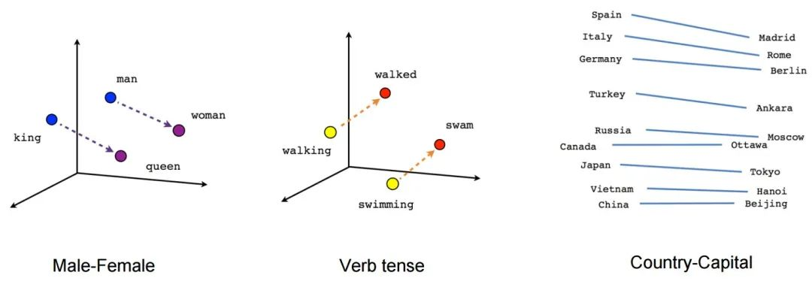

New AI applications have shown exponential growth over the past year, and these applications face a common challenge: how to **store** and **query** AI embeddings represented as vectors at scale. This article focuses on **vector databases** hyped by AI, introduces the basic principles of AI embeddings and vector storage/retrieval, and demonstrates the functionality, performance, acquisition, and application of the vector database extension **PGVECTOR** through a concrete knowledge base retrieval case study.

----------------

## How AI Works

GPT has demonstrated powerful intelligence levels, with many contributing factors to its success. However, the key engineering breakthrough is: **neural networks and large language models convert language problems into mathematical problems and efficiently solve these mathematical problems using engineering methods**.

For AI, various knowledge and concepts are internally stored and represented as mathematical vectors for inputs and outputs. The process of converting vocabulary/text/sentences/paragraphs/images/audio objects into mathematical vectors is called **embedding**.

For example, OpenAI uses a **1536**-dimensional floating-point vector space. When you ask ChatGPT a question, the input text is first encoded and converted into a **mathematical vector** before it can serve as neural network input. The direct output from the neural network is also a vector, which is then decoded back into human natural language or other forms for presentation to humans.


The "thinking process" of artificial intelligence large models is mathematically a series of addition, multiplication, and inverse operations between vectors and matrices. These vectors are too abstract for humans to understand, but this form is well-suited for efficient implementation using specialized hardware like GPU/FPGA/ASIC — AI has acquired a silicon-based bionic brain with more neurons, faster processing speeds, more powerful learning algorithms, amazing intelligence levels, and capabilities for rapid self-replication and immortality.

Large language models solve the problem of **encoding** - **computation** - **output**, but computation alone is insufficient; there's also an important component called **memory**. Large models themselves can be viewed as compressed storage of public human datasets, with this knowledge encoded into the model through training and internalized in the model's weight parameters. **However, precise, long-term, procedural, and high-capacity external memory storage requires vector databases.**


All concepts can be represented as vectors, and vector spaces have excellent mathematical properties, such as the ability to calculate the "**distance**" between two vectors. **This means the "relevance" between any two abstract concepts can be measured by the distance between their corresponding encoded vectors**.

This seemingly simple functionality has remarkably powerful effects. For example, the most classic application scenario is search. You can preprocess your knowledge base, converting each document into abstract vectors using models and storing them in a vector database. When you want to retrieve information, you simply encode your question into a one-time query vector using the model and find documents with the "**shortest distance**" to this query vector in the database to return as answers to users.



Through this approach, a fuzzy and difficult natural language processing problem is transformed into a simple and clear mathematical problem. Vector databases can efficiently solve this mathematical problem.

----------------

## What Can Vector Databases Do?

Databases have two core scenarios: transaction processing (OLTP) and data analysis (OLAP), and vector databases are no exception. Typical transaction processing scenarios include: knowledge bases, Q&A, recommendation systems, face recognition, image search, etc. Knowledge Q&A: given a natural language question, return results most similar to these inputs; image-to-image search: given an image, find other related images that are logically closest to this image.

These functionalities essentially boil down to a common mathematical problem: **vector nearest neighbor search (KNN)**: given a vector, find other vectors closest in distance to this vector.

A typical analysis scenario is **clustering**: categorizing a series of vectors based on distance relationships, discovering inherent associative structures, and comparing differences between clusters.


----------------

## PG Vector Extension PGVECTOR

There are many vector database products on the market: commercial ones like Pinecone and Zilliz, open-source ones like Milvus and Qdrant, and plugin-based solutions for existing popular databases like `pgvector` and Redis Stack.

Among all existing vector databases, **pgvector** is unique — it chooses to build upon the world's most powerful open-source relational database PostgreSQL as an extension rather than creating another specialized "database" from scratch[1]. **pgvector** has an elegant, simple, and user-friendly interface, decent performance, and inherits PostgreSQL's ecosystem superpowers.


**A qualified vector database must first be a qualified database, and achieving this from scratch is not easy**. **Compared to using a completely new independent database category, adding vector search capabilities to existing databases is obviously a more pragmatic, simple, and economical choice**.

----------------

## PGVECTOR Knowledge Retrieval Case Study

Let's demonstrate how vector databases like PGVECTOR work through a concrete example.

### Model

OpenAI provides an API for converting natural language text into mathematical vectors: for example, `text-embedding-ada-002` can convert sentences/documents of up to 2048-8192 characters into 1536-dimensional vectors. However, here we choose to use the `shibing624/text2vec-base-chinese` model from HuggingFace to replace OpenAI's API for text-to-vector conversion.

This model is optimized for Chinese sentences. Although it doesn't have the deep semantic understanding capabilities of OpenAI's model, it's ready to use out of the box, can be installed with `pip install torch text2vec`, runs on local CPU, and is completely open-source and free. You can switch to other models anytime: the basic usage is similar.

```python
from text2vec import SentenceModel 
# Automatically download and load model
model = SentenceModel('shibing624/text2vec-base-chinese')
sentence = 'Here is the text input you want to encode'
vec = model.encode(sentence)
```

Using the above code snippet, you can encode any Chinese sentence within 512 characters into a 768-dimensional vector. After segmentation, you just need to call the model's encode method to convert text into mathematical vectors. For very long documents, you need to reasonably split documents and knowledge bases into appropriately sized paragraphs.

### Storage

The encoded results are represented in PostgreSQL as floating-point arrays like `ARRAY[1.1,2.2,...]`. Here we skip the tedious details of data cleaning and ingestion. After some operations, we have a corpus data table `sentences` with a `txt` field to store original text representations and an additional `vec` field to store the 768-dimensional vectors after text encoding.

```sql
CREATE EXTENSION vector;
CREATE TABLE sentences(
    id    BIGINT PRIMARY KEY,  -- Identifier
    txt   TEXT NOT NULL,       -- Text
    vec   VECTOR(768) NOT NULL -- Vector
);
```

This table is no different from ordinary database tables; you can use identical CRUD statements. The special aspect is that the `pgvector` extension provides a new data type `VECTOR` and corresponding distance functions, operators, and index types, allowing you to efficiently perform vector nearest neighbor searches.

### Queries

Here we only need a simple Python script to create a command-line tool for full-text fuzzy retrieval:

```python
#!/usr/bin/env python3
from text2vec import SentenceModel
from psycopg2 import connect

model = SentenceModel('shibing624/text2vec-base-chinese')

def query(question, limit=64):
    vec = model.encode(question)  # Generate a one-time encoding vector, default search for 64 closest records
    item = 'ARRAY[' + ','.join([str(f) for f in vec.tolist()]) + ']::VECTOR(768)'
    cursor = connect('postgres:/').cursor()
    cursor.execute("""SELECT id, txt, vec <-> %s AS d FROM sentences ORDER BY 3 LIMIT %s;""" % (item, limit))
    for id, txt, distance in cursor.fetchall():
        print("%-6d [%.3f]\t%s" % (id, distance, txt))
```


----------------

## PGVECTOR Performance

When functionality, correctness, and security meet requirements, users' attention turns to **performance**. PGVECTOR has decent performance. Although it has some gaps compared to specialized high-performance vector computation libraries, its performance is more than adequate for production environments.

For vector databases, nearest neighbor query latency is an important performance metric. **ANN-Benchmark** is a relatively authoritative nearest neighbor performance evaluation benchmark[2]. pgvector's index algorithm is ivfflat, and its performance in several common benchmark tests is shown in the figure below:


To get an intuitive grasp of `pgvector`'s performance, running some simple tests on a single core M1 Max chip MacBook: finding the TOP 1-50 vectors with the closest cosine distance from 1 million random 1536-dimensional vectors (exactly OpenAI's output vector dimension) takes about 8ms each time. Finding the TOP 1 vector with the closest L2 Euclidean distance from 100 million random 128-dimensional vectors (SIFT image dataset dimension) takes 5ms, and finding TOP 100 only takes 21ms.

```sql
-- 1M 1536-dimensional vectors, random TOP1-50, cosine distance, single core: insertion and indexing each take 5-6 minutes, size ~8GB. Random vector nearest neighbor Top1 recall: 8ms
DROP TABLE IF EXISTS vtest; 
CREATE TABLE vtest ( id BIGINT, v  VECTOR(1536) ); 
TRUNCATE vtest;

INSERT INTO vtest SELECT i, random_array(1536)::vector(1536) FROM generate_series(1, 1000000) AS i;
CREATE INDEX ON vtest USING ivfflat (v vector_cosine_ops) WITH(lists = 1000);
WITH probe AS (SELECT random_array(1536)::VECTOR(1536) AS v) 
  SELECT id FROM vtest ORDER BY v <=> (SELECT v FROM probe) limit 1;

-- Simple SIFT, 100M 128-dimensional vectors, test L2 distance, recall 1 nearest vector: 5ms, recall 100 nearest vectors: 21ms
DROP TABLE IF EXISTS vtest;
CREATE TABLE vtest( id BIGINT, v  VECTOR(128) );
TRUNCATE vtest;

INSERT INTO vtest SELECT i, random_array(128)::vector(128) FROM generate_series(1, 100000000) AS i;
CREATE INDEX ON vtest USING ivfflat (v vector_l2_ops) WITH(lists = 10000);
WITH probe AS (SELECT random_array(128)::VECTOR(128) AS v) 
  SELECT id FROM vtest ORDER BY v <-> (SELECT v FROM probe) limit 1; -- LIMIT 100
```

Using the real SIFT 1M dataset for testing, finding nearest neighbors for 10,000 vectors in the test set among 1 million base vectors takes only 18 seconds total on a single core, with single query latency at 1.8ms, equivalent to 500 QPS on a single core, which is quite impressive. Of course, for a mature database like PostgreSQL, you can always simply scale QPS throughput almost infinitely by adding cores and read replicas.

```sql
-- SIFT 1M dataset, 128-dimensional embedding, using ivfflat index, L2 distance, 10K test vector set.
DROP TABLE IF EXISTS sift_base;
CREATE TABLE sift_base  (id BIGINT PRIMARY KEY , v VECTOR(128));
DROP TABLE IF EXISTS sift_query; 
CREATE TABLE sift_query (id BIGINT PRIMARY KEY , v VECTOR(128));
CREATE INDEX ON sift_base USING ivfflat (v vector_l2_ops) WITH(lists = 1000);

-- One-time search for nearest neighbors of 10000 vectors in sift_query table within sift_base table Top1: single process 18553ms / 10000 Q = 1.8ms
explain analyze SELECT q.id, s.id FROM sift_query q ,LATERAL (SELECT id FROM sift_base ORDER BY v <-> q.v limit 1) AS s; 

-- Single random query takes single-digit milliseconds
WITH probe AS (SELECT v AS query FROM sift_query WHERE id =  (random() * 999)::BIGINT LIMIT 1)
  SELECT id FROM sift_base ORDER BY v <-> (SELECT query FROM probe) LIMIT 1;
```

----------------

## How to Get PGVECTOR?

Finally, let's discuss how to quickly obtain a usable PGVECTOR.

Previously, PGVECTOR required manual download, compilation, and installation, so I submitted an issue to include it in the PostgreSQL Global Development Group's official repository[5]. You only need to use the PGDG source normally to directly `yum install pgvector_15` to complete installation. In database instances with `pgvector` installed, use `CREATE EXTENSION vector` to enable this extension.

```
CREATE EXTENSION vector;
CREATE TABLE items (vec vector(2));
INSERT INTO items (vec) VALUES ('[1,1]'), ('[-2,-2]'), ('[-3,4]');
SELECT *, vec <=> '[0,1]' AS d FROM items ORDER BY 2 LIMIT 3;
```

A simpler choice is the local-first open-source PostgreSQL RDS alternative — Pigsty. In the v2.0.2 released at the end of March, `pgvector` is enabled by default and ready to use out of the box. You can complete installation with one command on a fresh virtual machine, with built-in time-series, geospatial, and vector extensions, plus complete monitoring, backup, and high availability. Free of charge, ready instantly.


Supabase and Neon also provide paid managed PostgreSQL services with the `pgvector` extension. AWS RDS for PostgreSQL also supported this extension in early May. For a complete list of managed service providers, refer to the `pgvector` GitHub Issue [6].

----------------

## References

[1] [PGVECTOR GitHub Repository](https://github.com/pgvector/pgvector)

[2] [ANN Performance Benchmark](https://ann-benchmarks.com/)

[3] [Using PGVECTOR to Store OpenAI Embeddings](https://supabase.com/blog/openai-embeddings-postgres-vector)

[4] [Text and Code Embeddings](https://openai.com/blog/introducing-text-and-code-embeddings)

[5] [Add official RPM package and inclusion in PGDG YUM repository](https://github.com/pgvector/pgvector/issues/76)

[6] [PGVector Hosted Providers](https://github.com/pgvector/pgvector/issues/54)