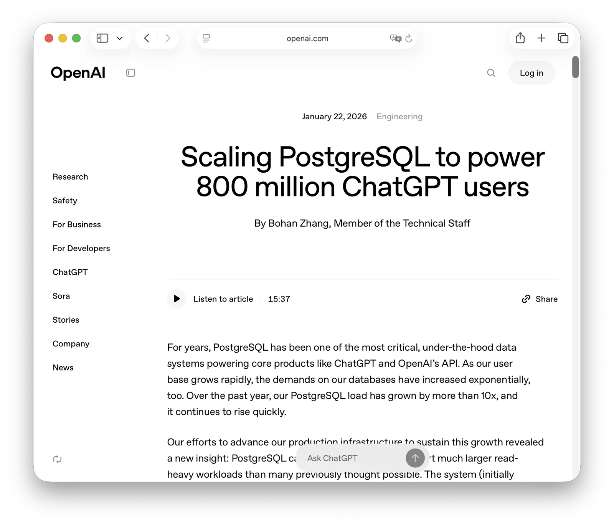
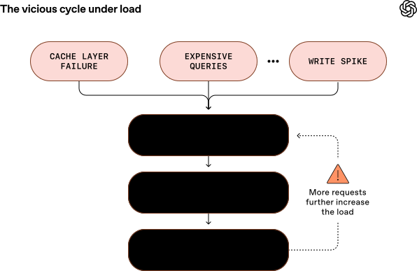
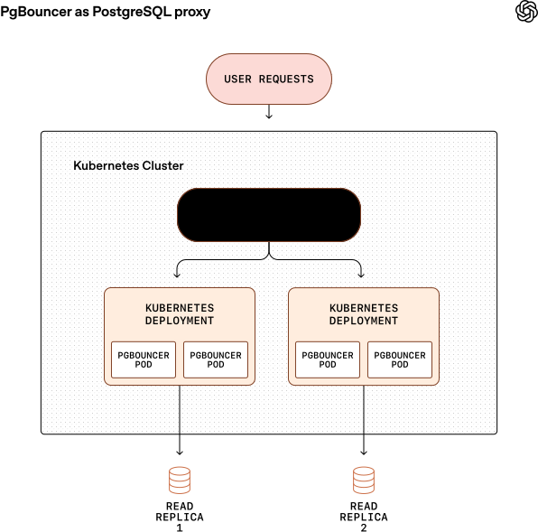
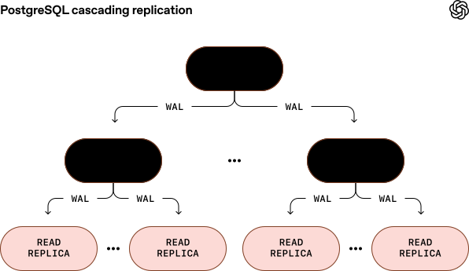

OpenAI 官方博客昨天发了一篇文章，专门讲他们如何把 PostgreSQL 伸缩到今天这个量级：
一套单主 + 近 50 个只读副本的超大 PostgreSQL 集群，支撑其核心产品（ChatGPT 与 OpenAI API）的全球访问流量。
文章的核心内容，其实在 2025 年 PGCon.Dev 上就已对外分享过 (《[OpenAI：将PostgreSQL伸缩至新阶段](/db/openai-pg/)》)，
但这次算是 OpenAI 官方背书，传播面与影响力都明显要大多了。

与半年前的分享相比，这次博客也披露了几个关键变化：当时还是“一主 40 从”，如今又增加了约 10 个只读副本；用户规模也从 5 亿增长到 8 亿——增长速度确实惊人。
更重要的是：在单套集群写入吞吐逼近天花板后，他们选择把可分片、写重的负载迁出 PostgreSQL，转而落到 Azure Cosmos DB
（文中指向的实现，大概率是 Cosmos DB for PostgreSQL，也就是 PostgreSQL + Citus 这条线）上，而不是走传统“应用层手搓分片”的老路。

这对 PostgreSQL 的意义在于：它提供了一个极稀缺的、由时代风口公司打出来的标杆级生产案例。
过去当然也有很多公司依靠 PostgreSQL 一路扛到 IPO 或被收购（Instagram、探探等），
但像 OpenAI 这样对全行业产生溢出效应的案例，确实少见。
借着这次官方发布的窗口，我把文章内容再翻译一遍，并按原文顺序补上我的评论解读。

--------

# 伸缩 PG，支撑 8亿ChatGPT 用户

> https://openai.com/index/scaling-postgresql/

多年来，PostgreSQL 一直是 OpenAI 核心产品（如 ChatGPT 和 OpenAI API）背后那个最关键、“藏在最底层” 的数据系统。
随着用户规模迅速增长，我们对数据库的要求也在指数级攀升。过去一年里，我们的 PostgreSQL 负载增长了 **10 倍以上**，而且还在继续快速上升。

在推进生产基础设施以承载这股增长的过程中，我们有了一个新发现：**PostgreSQL 在读多写少的场景下，能够可靠伸缩到的规模，远远超出许多人的认知**。
这个系统最初由加州大学伯克利分校的一群科学家打造，如今我们用**一台主库**（[Azure PostgreSQL 灵活服务器实例](https://learn.microsoft.com/en-us/azure/postgresql/overview)）配合**近 50 个分布在全球多个区域的只读副本**，
就支撑起了海量的全球访问流量。本文会讲述：OpenAI 如何通过严格的优化和扎实的工程手段，把 PostgreSQL 扩展到支撑 **8 亿用户、每秒数百万次查询（QPS）**；也会总结我们一路踩坑后得到的关键经验。

--------

## 初始设计开始出现裂缝

ChatGPT 上线后，流量以史无前例的速度增长。为了扛住它，我们迅速在应用层和 PostgreSQL 数据库层都做了大量优化：
一方面通过增大实例规格来“纵向扩容”，另一方面不断增加只读副本来“横向扩容”。这套架构很长时间里都表现不错；而且随着持续改进，它仍然为未来增长提供了相当充足的空间。

听起来可能有点反直觉：**单主架构**竟然能满足 OpenAI 这种量级的需求。但真要把它在现实中跑稳，并不容易。
我们经历过多次由 Postgres 过载引发的事故（SEV，事故等级），而它们往往有着相似的套路：
上游某处出问题，导致数据库负载突然暴涨——比如缓存层故障造成大范围缓存未命中；某些昂贵的多表 JOIN 量激增、把 CPU 打满；或者新功能上线带来一波“写入风暴”。
当资源占用不断走高，查询延迟开始上升，请求陆续超时；紧接着重试又会进一步放大负载，形成恶性循环，最终可能拖慢甚至拖垮整个 ChatGPT 与 API 服务。

虽然 PostgreSQL 对我们的“读多写少”负载扩展得很好，但在写入流量很高的时段，我们仍然会遇到挑战。
主要原因在于 PostgreSQL 的多版本并发控制（MVCC）实现，使它在写密集负载下效率并不理想。
举个例子：一次更新操作即便只改动一行里的一个字段，也会复制整行来生成一个新版本。
在高写入压力下，这会带来明显的**写放大**。与此同时还会带来**读放大**：查询为了拿到最新版本，需要扫过多份行版本（包括“死元组”）。
MVCC 还会引入一系列额外问题，比如表与索引膨胀、索引维护开销增加、以及 autovacuum（自动清理）的调参复杂度。
（关于这些问题，可以参考我和卡内基梅隆大学 Andy Pavlo 教授共同撰写的深度文章：[*The Part of PostgreSQL We Hate the Most*](https://www.cs.cmu.edu/~pavlo/blog/2023/04/the-part-of-postgresql-we-hate-the-most.html)。
这篇文章还被 PostgreSQL 的维基词条引用过： [cited](https://en.wikipedia.org/wiki/PostgreSQL#cite_note-37)。）

--------

## 将 PG 扩展到百万级 QPS

为了绕开这些限制、降低写入压力，我们已经把、并且仍在持续把那些**可分片（可做水平切分）的写密集工作负载**迁移到分片系统中，例如 Azure Cosmos DB；
同时也在优化应用逻辑，尽量减少不必要的写入。并且，我们不再允许在当前的 PostgreSQL 部署里新增表——新的业务默认直接落在分片系统上。

尽管我们的基础设施一直在演进，PostgreSQL 本身仍保持不分片：所有写入仍由**单一主库实例**承担。
主要原因是：对现有应用负载做分片会极其复杂且耗时，需要改动数百个应用端点，周期可能是数月甚至数年。
考虑到我们的负载主要是读多写少，再加上已经做了大量优化，现有架构仍然有充足余量来承接继续增长的流量。
我们并不排除未来给 PostgreSQL 做分片，但在短期内这不是优先事项——因为就当前和可预见的增长而言，我们的“跑道”足够长。

接下来的章节会展开讲：我们遇到了哪些挑战，又做了哪些大规模的优化来解决它们、避免未来故障——把 PostgreSQL 推到极限，最终把它扩展到每秒数百万次查询（QPS）。

#### 降低主库负载

*挑战：只有一个写入节点时，单主架构无法横向扩展写入。写入的突刺很容易把主库压垮，进而影响 ChatGPT 和 API 等服务。*

解决方案：我们尽可能把主库的压力降到最低——包括读和写——确保主库永远留有足够余量来应对写入突刺。能下沉到副本的读请求，就尽量下沉到副本。
但有些读查询必须留在主库上，因为它们处在写事务里；对这些查询，我们重点确保它们足够高效，避免慢查询。
写入方面，我们已将可分片的写密集负载迁移到 Azure CosmosDB 等分片系统。那些更难分片、但写入量仍然很高的负载，迁移周期更长，目前仍在进行中。
与此同时，我们也对应用做了更激进的优化来降低写负载：例如修复导致重复写入的应用 bug；在合适的地方引入“延迟写”（lazy writes）以平滑流量尖刺。
另外，在对表字段做回填（backfill）时，我们会施加严格的速率限制，避免写入压力过大。

#### 查询优化

*挑战：我们在 PostgreSQL 中识别出多条大开销查询。过去这些查询一旦出现突发的调用量飙升，就会吞掉大量 CPU，拖慢 ChatGPT 和 API 的请求。*

解决方案：少数几条昂贵查询——尤其是涉及大量表 join 的查询——就足以显著降低性能，甚至把整个服务打趴下。
我们必须持续优化 PostgreSQL 查询，确保其高效，同时规避常见的 OLTP（联机事务处理）反模式。
比如，我们曾发现一条极其昂贵的查询，竟然 join 了 12 张表；这条查询的突刺曾直接触发过多次高严重级别事故。
能不做复杂多表 join 就尽量不做；如果确实需要 join，我们学会了考虑拆分查询，把复杂的 join 逻辑挪到应用层处理。
许多问题查询来自 ORM（对象关系映射）框架自动生成，因此必须认真审查 ORM 产出的 SQL，确认行为符合预期。
另一个常见问题是 PostgreSQL 中存在长时间空闲但仍占用事务的查询；配置类似 `idle_in_transaction_session_timeout` 这样的超时参数非常关键，否则它们会阻塞 autovacuum。

#### 缓解单点故障

*挑战：读副本挂了，流量还可以切到其他副本；但只依赖单一写入节点意味着存在单点——主库一旦挂掉，整个服务都会受影响。*

解决方案：大多数关键请求只涉及读取。为降低主库单点故障的影响，我们把这些读取从写入节点下沉到副本上，确保即便主库宕机，这些请求依然能继续对外服务。
虽然写操作仍会失败，但整体影响被明显压缩：因为读仍然可用，这就不再是 SEV0 级别事故。

针对主库故障，我们把主库以高可用（HA）模式运行，并配一台热备：它是持续同步的副本，随时准备接管流量。
当主库宕机或需要下线维护时，我们可以快速提升热备，尽量缩短停机时间。Azure PostgreSQL 团队做了大量工作，确保即便在极高负载下，这类故障切换仍然安全、可靠。
针对读副本故障，我们在每个区域部署多个副本并预留足够余量，保证单个副本故障不会演变为区域级故障。

#### 工作负载隔离

*挑战：我们经常遇到某些请求在 PostgreSQL 实例上消耗了不成比例的资源，导致同实例上的其他负载性能被拖慢。
比如新功能上线带来低效查询，疯狂吃 CPU，从而让其他关键功能也跟着变慢。*

解决方案：为缓解“吵闹邻居”问题，我们把不同负载隔离到专用实例上，避免资源密集型请求的突刺影响其他流量。
具体做法是把请求拆成低优先级与高优先级两个层级，并路由到不同实例。这样即便低优先级负载突然变得很“吃资源”，也不会拖慢高优先级请求。我们也在不同产品与服务之间使用同样策略，避免某个产品的活动影响另一个产品的性能与可靠性。

#### 连接池

*挑战：每个实例都有最大连接数上限（Azure PostgreSQL 为 5,000）。连接很容易被打满，或者积累大量空闲连接。我们曾因“连接风暴”把所有可用连接耗尽而出现事故。*

解决方案：我们部署了 PgBouncer 作为代理层来做连接池。在 statement pooling 或 transaction pooling 模式下运行，它可以高效复用连接，大幅降低活跃客户端连接数。同时也能减少建连时延：在我们的基准测试中，平均建连时间从 50 毫秒（ms）降到 5 ms。跨区域连接和请求成本很高，因此我们把代理、客户端和副本尽量部署在同一区域，以降低网络开销并缩短连接占用时间。另外，PgBouncer 的配置必须非常谨慎，例如空闲超时这类参数对避免连接耗尽至关重要。

每个读副本都有独立的 Kubernetes 部署，运行多个 PgBouncer Pod。我们在同一个 Kubernetes Service 后面运行多个 Deployment，由 Service 在各个 Pod 之间做负载均衡。

#### 缓存

*挑战：缓存未命中突然飙升，会导致 PostgreSQL 读取请求暴涨，CPU 被打满，用户请求变慢。*

解决方案：为降低 PostgreSQL 的读压力，我们使用缓存层承接绝大多数读流量。但当缓存命中率意外下降时，大量未命中会把请求直接倾倒到 PostgreSQL 上。
数据库读请求的骤增会消耗大量资源，拖慢服务。为了在“缓存未命中风暴”期间防止系统过载，我们实现了缓存锁（以及租约）机制：对同一个 key，只有**一个**未命中请求会去 PostgreSQL 拉取数据。
当多个请求同时未命中同一个缓存 key 时，只有一个请求拿到锁并负责回源、回填缓存；其他请求等待缓存更新，而不是一起去打 PostgreSQL。这样能显著减少重复数据库读取，避免负载尖刺层层放大。

#### 扩展只读副本规模

*挑战：主库需要把预写日志（WAL）流式发送给每一个读副本。副本数量越多，主库要发 WAL 的目标就越多，网络带宽和 CPU 压力都会上升，导致副本延迟更高、波动更大，使系统更难稳定扩展。*

解决方案：我们在多个地理区域运营近 50 个读副本，以尽量降低延迟。但在当前架构下，主库必须向每个副本推送 WAL。
虽然依靠超大规格实例和高带宽网络，它目前还能跑得很好，但副本数量不可能无限增长——迟早会把主库推到极限。
为此，我们正与 Azure PostgreSQL 团队合作测试 [级联复制](https://www.postgresql.org/docs/current/warm-standby.html#CASCADING-REPLICATION)：
由中间副本把 WAL 转发给下游副本。这样可以在不压垮主库的前提下，把副本规模扩展到潜在的上百个。
但它也会引入更多运维复杂度，尤其是故障切换管理方面。目前该功能仍在测试阶段；在投产前，我们会确保它足够健壮，并且能安全完成 failover。

#### 限流

*挑战：某些端点流量突刺、昂贵查询激增或重试风暴，可能迅速耗尽 CPU、I/O、连接等关键资源，进而引发大范围性能劣化。*

解决方案：我们在多层做了限流——应用层、连接池层、代理层、查询层——避免流量尖刺把数据库实例压垮并触发级联故障。同时必须避免过短的重试间隔，否则很容易形成重试风暴。
我们还增强了 ORM 层，支持限流；必要时可以直接**彻底阻断**某些特定的查询摘要（query digest）。这种“定点卸载负载”的方式能在昂贵查询突然暴涨时快速止血、帮助系统迅速恢复。

#### Schema 管理

*挑战：即便是很小的 schema 变更，比如修改某列类型，也可能触发一次 [全表重写](https://www.crunchydata.com/blog/when-does-alter-table-require-a-rewrite)*。
因此我们对 schema 变更极其谨慎：只允许轻量操作，避免任何会重写整表的变更。

解决方案：只允许不会触发全表重写的轻量变更，例如添加或删除某些列。我们对 schema 变更强制 **5 秒超时**。允许并发创建/删除索引。
schema 变更只限于已有表；如果新功能需要新增表，就必须放到 Azure CosmosDB 等替代的分片系统中，而不是继续塞进 PostgreSQL。在做字段回填时，我们同样施加严格限速，防止写入突刺。虽然这个过程有时可能超过一周，但能换来稳定性，并避免对生产造成影响。

--------

## 结果与下一步

这次实践说明：只要设计得当、优化到位，Azure PostgreSQL 完全可以扩展到承载最大的生产级工作负载。对于读多写少的场景，PostgreSQL 能以百万级 QPS 运行，为 OpenAI 最关键的产品（ChatGPT 和 API 平台）提供支撑。
我们增加了近 50 个读副本，同时把复制延迟保持在接近 0 的水平；在全球分布的区域里维持了低延迟读取；并预留了足够的容量余量，为未来增长做好准备。

在尽量不牺牲延迟的前提下，这套扩展也显著提升了可靠性。我们在生产中稳定提供 p99 客户端延迟为“两位数毫秒级”，可用性达到“五个 9”（99.999%）。
过去 12 个月里，我们只发生过一次 SEV-0 级别的 PostgreSQL 事故（发生在 ChatGPT ImageGen 的一次 [病毒式发布](https://newsletter.pragmaticengineer.com/p/chatgpt-images) 期间：写入流量突然暴涨 10 倍以上，一周内新增用户超过 1 亿。）

我们对 PostgreSQL 目前能带来的效果很满意，但仍会继续把它往极限推，确保未来增长仍有充足跑道。我们已经把那些可分片的写密集负载迁移到了 CosmosDB 等分片系统。
剩余的写密集负载更难分片——我们也在持续推进迁移，以进一步把写入从 PostgreSQL 主库上卸下来。与此同时，我们还在和 Azure 一起推动级联复制落地，确保可以安全地扩展到更多读副本。

展望未来，随着基础设施需求持续增长，我们也会继续评估更多扩展路线，包括对 PostgreSQL 做分片，或采用其他分布式系统。

--------

## 老冯评论

在七年前，老冯在探探维护过一套当时可能是国内规模最大的 PostgreSQL 集群 —— 总体 250 万数据库 QPS，最大的核心单集群一主 32 从，大几十万 QPS。
我亲历过从“单集群打天下”到垂直拆分、再到水平分片与微服务改造的全过程，也完整操刀过高可用、备份恢复、监控与运维体系的设计与落地。
OpenAI 文中描述的很多问题，我们当年都踩过，所以读起来很亲切。下面按原文脉络，聊几个我认为最值得带走的点。

### 单机写入的真实天花板

互联网业务的读写比通常非常极端，10:1 乃至几十比一并不罕见。只读查询理论上几乎没有“硬天花板”：机器不够就加副本，物理复制/级联复制能把读扩展得很漂亮。
真正难的是单机写入：如果写入速率超过单台 PostgreSQL 的承载能力，就不得不走向分库分片。

在现代硬件上，单机 PostgreSQL 的写入瓶颈往往体现为 WAL 速率、写事务吞吐、以及背后存储的持续写能力上限。
你可以通过更强的 CPU、更快的 NVMe、更大的内存把这条线往上推很远，但它终究存在，而且一旦撞上就只能做结构性拆分。

作为经验参考，单机 PostgreSQL 的写入瓶颈通常在 100-200 MB/s 的 WAL 速率，或者 100-200 万/s 的点写入事务。
这是什么概念呢？当时探探作为一个千万日活的 IM 应用，所有数据库全局的 WAL 写入速率加起来，大概在 110 MB/s。
当下的顶级硬件可要比八年前牛逼太多了，让 OpenAI 这样的创业公司可以用一套 PostgreSQL 集群，在不分片，不Sharding 的情况下直接服务整个业务。

OpenAI 这篇文章的价值之一，是用一个极强的现实样本把问题讲清楚：对接近十亿用户量的应用，
核心业务仍然可以在相当长时间里维持“单主 + 大规模只读副本”而不立刻分片。
很多“分布式数据库的必然性”叙事，至少在读多写少的现实世界里，变得滑稽起来。

## MVCC 膨胀的利弊权衡

文中提到的文章 —— 《PostgreSQL 中我们最讨厌的部分》是这篇博客的作者 Bohan 操刀，Andy 润色挂名的。
我在跟 Bohan 聊天时我问他怎么起这么个争议性的名字，他坦诚说这是为了上 HN 选的标题，哈哈。
讨论的是 PostgreSQL MVCC 的代价：写放大、膨胀、vacuum、freeze 等。这些问题客观存在，也是很多数据库“攻击 PG”的常用火力点。

但老冯觉得工程的核心在于 “利弊权衡” —— PG 的 MVCC 实现固然会有写放大，表膨胀，需要垃圾清理等问题。但这种 MVCC 设计带来的好处也是实实在在的 —— 
极低的复制延迟与稳定的流复制提高了可靠性，读与写互不锁定极大提高了并发吞吐，不限量且能瞬间回滚的巨型事务让OLAP变得可能，
可以后台择机垃圾回收平滑 IO 使用；定期 vaccum / repack / freeze 处理表膨胀确实引入了额外的维护任务，
它们本质是 **可工程化治理的问题**，你愿意为这些好处支付怎样的运维成本，这才是该问的问题。

### 该分片还是得分片

OpenAI 在文章中提到，尽管写入已经接近瓶颈了，但他们还是保持 PostgreSQL 本身不分片。不过他们冻结了这套 PostgreSQL 集群的新业务，
而是转移到了 Azure Cosmos DB 上去。CosmosDB for PostgreSQL 据我所知实际上是 PostgreSQL + Citus  —— PG + 分布式扩展，所以实质上还是在增量部分做了分片。

探探最开始也是一套数据库集群打天下，然后垂直拆分成了 20 套独立的集群。但是有几个核心业务还是撑不住，所以就参照 Instagram 的 PostgreSQL 水平分片架构，
搭建了一套 Shard 集群，扩展到 64 个shard，128 台物理机的手，甚至还对这些 Shard 又进行了垂直拆分，几个核心场景 —— 聊天，朋友圈，关注关系最后都有了自己的水平分片。

当时我们也有一套 Citus 集群，不过那个时候的 Citus 还没被微软收购，有些重要的运维功能（分片再平衡）没有开源。再加上运维管理，一致性备份恢复，
高可用都相当麻烦，最后还是下掉了。不过今天这些问题都解决了，所以如果是今天老冯要分片 PostgreSQL，我的首选也会是 Citus。

### 主库优化：数据重力确实考验 DBA 能力

因为 OpenAI 选择了对现有 PostgreSQL 集群不分片，这就意味着你必须把单主榨到极限，这里面会出现大量非常细的工程技巧：
写入治理、慢查询狙击、连接风暴防控、缓存雪崩应对、DDL 变更纪律、限流熔断、快慢分离等等 —— 每一项说开了都不神秘，但这也是真正体现 DBA 功力的地方。

当年我们也遇到过一个困境 —— 应用设计之初，走的是北欧 Old School 风格 —— 几乎所有业务逻辑都是用存储过程实现的。
不只是 CRUD，而是一些相当复杂的逻辑，比如 100ms 的 SQL 推荐算法， WGS8S转火星坐标系这种 GIS 处理。所谓后端就是很薄的一层转发，把 URL 映射到存储过程执行。

这里体现的是一项利弊权衡，当数据库性能有余量的时候，你可以通过把逻辑作为存储过程放入数据库来利用这些闲置的性能，以及其他一些精妙的好处。
直到几百万日活的时候，这套架构运行的都非常不错，然而当主库撞上瓶颈之后，我们就不得不把这些东西从数据库中搬出来，在业务代码中实现。

此外，一套极高负载的主库，在管理上需要许多精细化的操作。一些小库上大大咧咧的 ALTER TABLE 和 UPDATE 整表，在生产集群上也要慎之又慎，非常考验 DBA 的功力。
不过最近这几年，PostgreSQL 在这方面的改进了许多，许多 DDL 操作现在都可以快速在线完成，不需要表重写或者获取强锁了。
也有像 Bytebase / pgschema 这样的工具，可以处理好许多变更的细节。总的来说，管理这件事是比几年前容易多了。

### 关于 ORM

看来 OpenAI 已经在 ORM 上踩过坑了 —— 老冯对于 ORM 这样的中间层是非常不感冒的，因为它经常会生成非常糟糕的套娃 SQL，我觉得这对于专业程序员来说是一个典型的负优化。

那么有没有办法在保留 ORM 便利性的同时，生成可靠，稳定的 SQL 呢？那时候我们用的是一个叫 sqlc 的工具，它能自动根据数据库模式生成 Go 语言结构体以及各种增删改查方法。
这样既不用手写狗屎代码，又确保了 SQL 是静态，稳定，高度可预测的。特别是在当下 AI Coding 已经有很强能力的情况下，我更看不出使用 ORM 的必要了。

### 关于高可用与级连从库

文中看起来是“主库直挂近 50 个副本”。这既说明了 PostgreSQL 足够皮实，也意味着主库要承担非常可观的 walsender、网络与 CPU 压力。
我们当年在硬件与网络更弱的时代，主库直挂超过 10 个副本就已经能观察到明显影响，所以会强制采用级联复制：主库只直挂一部分副本，更多副本挂在“桥接副本”上转发 WAL。

在七年前的硬件条件与网络条件下，老冯观察到一台 PG 主库拖 10 台从库，就已经会产生显著影响了 —— 
比如网络带宽与 CPU。所以我定了一条规则，一个主库最多直接挂 10 个从库，超过 10 个之后，就要开始级联复制。

比如，当时我们 1主32 从的拓扑是这样的，主库上直接挂了 10 台从库，另外 20 台，分别挂在两台 “桥接从库” 上，每台下面再挂 10 台。桥接从库是不承载只读请求的，只干一件事，就是转发。
如果出现主库故障，我们的 SOP 就是提升一台桥接从库，然后把其他的从库重新挂上来。这种做法可以确保切换之后，新集群立刻有 10 个能直接用的从库。

OpenAI 也在测试级联复制，这是正确方向。但级联复制真正难的不是“能不能转发”，而是故障切换后的拓扑重建与自动化 SOP。
这部分如果做不好，级联会把运维复杂度放大，而不是降低风险。

当然，现在高可用这件事，已经比以前简单太多了。老冯昨天的文章《PostgreSQL 高可用到底如何做？》就介绍了 PG SOTA 高可用方案 Patroni 的实操

### 关于工作负载隔离

当你的集群上量之后，一个重要的工作是 “快慢分离” ，OpenAI 显然已经遇到了这样的 “吵闹邻居” 问题。
当 “快查询” 和 “慢查询”， 或者说 “在线查询” 与 “离线查询” 混合在一起的时候，就会出现各种奇妙的反应。

所以当时我们在设计集群架构的时候，除了 primary  主库，replica 从库 这两种经典角色之外，还有一个 offline 离线实例的角色
（实际上还有 bridge 桥接从库，standby 同步从库，delayed 延迟从库 三种）。Offline 实例的作用就是把那些 SAGE 长事务，ETL 工作流，以及个人用户/数据分析师查数据这些 “非在线” / “准在线” 业务移动到专用实例上去，避免影响在线业务。

快慢分离的另一端是 “快查询”。对于互联网场景来说，绝大多数点查询都可以受益于缓存。也就是弄个 Redis。
尽管如此，可能在打到 250 万 QPS 和 大几百万日活之前，我们都 **没有用缓存**，直接用 PG 硬扛 —— 事实上它也扛下来了。
对于开发者来说，这里有一个启发是 —— 其实真没有必要那么早就弄缓存把事情搞复杂。

后来我们还是全面铺开了 Redis，Redis 大概有 13000 核 vCPU 的规模，PG 则只剩下了 12000 vCPU 。
Redis 的全局 QPS 达到了四百万，而 PG 则只剩下了 50 万左右的 QPS，从效果上来看还是可以的。CPU 利用率都掉到个位数了，搞得后来又要搞合并精简。

### 关于连接池

连接池依然是提升高并发/高负载下 PostgreSQL 性能的灵丹妙药，而当下的 PG 连接池最优选依然是 pgbouncer —— 
它提供了事务池化的能力，极致的性能，额外的监控指标采集点（查询 RT），灵活的管理能力，流量路由抓手。

pgbouncer 的事务连接池有化腐朽为神奇的效果。举个例子，大几千条客户端连接，几万的 QPS，通过 pgbouncer 池化排队之后，
可以收敛到 3 到 4 条数据库连接！这意味着原本几千个数据库进程变成几个进程，几千个事务相互踩踏变成几个并发事务相安无事。

唯一美中不足的是，它是一个单进程的应用。因此大概在 5万 QPS / 大几千条连接到时候打满自己的单核 CPU。
好在你可以部署多个 pgbouncer 实例一起使用。OpenAI 这里选择了把 pgbouncer 连接池放在了应用一侧，这个方式挺好，但是需要研发配合。
老冯当时是在数据库一侧，放在 HAPROXY 后面，挂了多个 pgbouncer 连接池。

但多个连接池管理，监控起来还是有些麻烦的。最近也有好几个新的 PG 连接池项目，老冯比较关注看好的是 pgdog ，希望可以解决好这个问题。

### 总结

我的朋友 瑞典马工 在 《[MySQL赢了2000s，PostgreSQL赢得2020s，谁将赢得AI时代？——数据库选型的三要素分析法](https://mp.weixin.qq.com/s/HRy81qY--iECHLFc2eZIig)》 里面提出了一个观点，
决定数据库胜负的三要素是：**技术套件**，**标案案例**，**生态系统**。在生态系统上，PostgreSQL 已经毫无疑问主宰了数据库世界，而 OpenAI 则提供了一个 **标杆案例**。
而老冯这几年做的事情，就是把生产级 PostgreSQL 的技术套件做成可复制、可交付、可普及的 **技术套件**：把“能跑到 OpenAI 这个量级之前都用得上”的能力，尽量下放给更多团队。

探探那套 PostgreSQL 的实战经验，我沉淀成了 Pigsty：企业生产级的开源 PostgreSQL 方案，覆盖高可用、时间点恢复、SOTA 监控、IaC/CLI 批量管理，以及上百/数百扩展的交付能力。
OpenAI 的例子再一次证明，绝大多数企业根本不需要花里胡哨的数据库大观园，扎扎实实的用好一套 PostgreSQL，就足够支撑你的业务一路干到 IPO 了。
