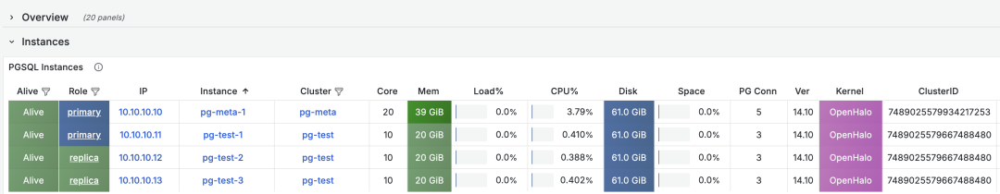
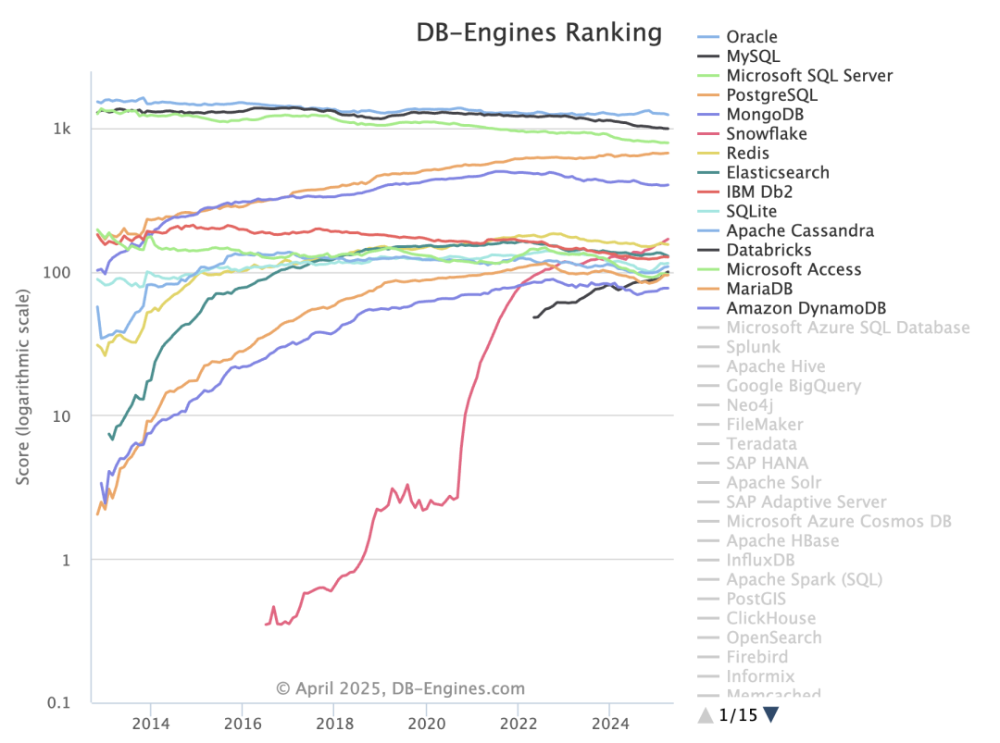
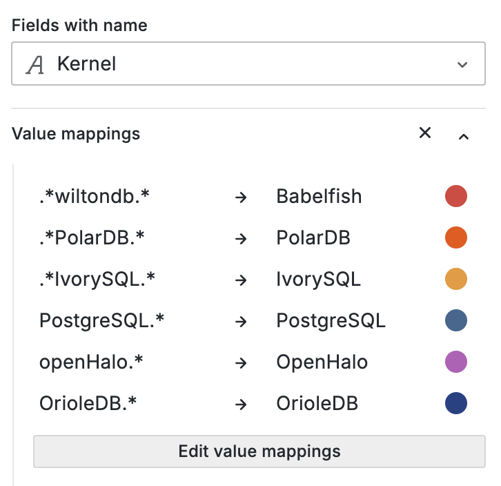

What? PostgreSQL can now be accessed using MySQL clients? That's right, openHalo, which was open-sourced on April Fool's Day, provides exactly this capability — allowing users to simultaneously access and manage the same database using both MySQL and PostgreSQL clients for read and write operations, based on PG 14.10 providing MySQL 5.7 compatibility.

The day before yesterday, [**openHalo open-sourced their MySQL-compatible PG kernel**](https://mp.weixin.qq.com/s?__biz=MzU5ODAyNTM5Ng==&mid=2247489368&idx=1&sn=d68f943fea34d9ee9e678b9d49bc162f&scene=21#wechat_redirect). Today I've built RPM packages and integrated them into Pigsty. The deployment is quite smooth, and after modifying a few lines of code, it integrates seamlessly with high availability, monitoring, and backup components.



On the DB-Engine database popularity rankings, five databases lead by a significant margin, far ahead of other competitors: Oracle, SQL Server, MySQL, PostgreSQL, and MongoDB.



And now PostgreSQL can be compatible with the other four databases:

- [**OpenHalo can be used as MySQL**](https://mp.weixin.qq.com/s?__biz=MzU5ODAyNTM5Ng==&mid=2247489368&idx=1&sn=d68f943fea34d9ee9e678b9d49bc162f&scene=21#wechat_redirect)
- [**AWS's Babelfish can be used as Microsoft SQL Server**](https://mp.weixin.qq.com/s?__biz=MzU5ODAyNTM5Ng==&mid=2247488287&idx=1&sn=50f068767c6faab8c8f9ca01128090b9&scene=21#wechat_redirect)
- **IvorySQL and Alibaba-Cloud PolarDB O can be used as Oracle**
- [**FerretDB / Microsoft DocumentDB can be used as MongoDB**](https://mp.weixin.qq.com/s?__biz=MzU5ODAyNTM5Ng==&mid=2247486241&idx=1&sn=f39b87095837b042e74f55f8e60bb7a9&scene=21#wechat_redirect)

By the way, all of the above kernel capabilities are now available out-of-the-box in Pigsty.

------

## So, I Want to Try It, How Do I Set It Up?

Currently, Pigsty provides support for [OpenHalo](https://doc.pgsty.com/zh/pgsql/kernel/openhalo/) on EL systems. You can install it with the following commands:

Use Pigsty's [**standard installation process**](https://pigsty.cchttps://pigsty.io/docs/setup/install/) and use the [`mysql`](https://pigsty.cc/docs/conf/mysql/) configuration template.

```bash
curl -fsSL https://repo.pigsty.cc/get | bash; cd ~/pigsty
./bootstrap              # Prepare Pigsty dependencies
./configure -c mysql     # Use MySQL (openHalo) configuration template
./install.yml            # Install, for production deployment please modify passwords in pigsty.yml first
```

For production deployment, please be sure to modify the password parameters in the `pigsty.yml` configuration file before executing the installation playbook.

OpenHalo's configuration is almost identical to PostgreSQL's configuration. You can use the `psql` command-line tool to connect to the `postgres` database, and use the `mysql` command-line tool to connect to the `mysql` database.

```yaml
all:
  children:
    pg-orio:
      vars:
        pg_databases:
        - {name: postgres ,extensions: [aux_mysql]}
  vars:
    pg_mode: mysql                    # MySQL Compatible Mode by HaloDB
    pg_version: 14                    # The current HaloDB is compatible with PG Major Version 14
    pg_packages: [ openhalodb, pgsql-common, mysql ]   # also install mysql client shell
    repo_modules: node,pgsql,infra,mysql
    repo_extra_packages: [ openhalodb, mysql ] # replace default postgresql kernel with openhalo packages
```

MySQL uses port 3306 by default. When accessing MySQL, the actual connection uses the `postgres` database. Please note that the "database" concept in MySQL actually corresponds to the "Schema" concept in PostgreSQL. Therefore, `use mysql` actually uses the `mysql` Schema in the `postgres` database.

The usernames and passwords used by MySQL are consistent with those in PostgreSQL. You can manage users and permissions using PostgreSQL's standard methods.

Currently, OpenHalo officially ensures that Navicat can properly access this MySQL port, but Intellij IDEA's DataGrip will report errors when accessing it.

```bash
mysql -h 127.0.0.1 -u dbuser_dba
```

The [OpenHalo](https://github.com/pgsty/openHalo) kernel installed by Pigsty is lightly modified based on the [HaloTech-Co-Ltd/openHalo](https://github.com/HaloTech-Co-Ltd/openHalo) kernel:

- Default database name changed from `halo0root` back to `postgres`
- Removed the `1.0.` prefix from the default version number, changed back to `14.10`
- Modified default configuration file to enable MySQL compatibility by default and listen on port `3306`

Please note that Pigsty does not assume any warranty responsibility for using the OpenHalo kernel. For any issues and requirements encountered when using this kernel, please contact the original manufacturer for resolution.

------

## There Are Other Kernel Tricks Too

Of course, Pigsty supports more than just OrioleDB as a [**PG branch kernel**](https://pigsty.cc/docs/kernel/). You can also use:

- Microsoft SQL Server compatible [**Babelfish**](https://pigsty.cc/docs/kernel/babelfish/) (by AWS)
- Oracle compatible [**IvorySQL**](https://pigsty.cc/docs/kernel/ivorysql/) (by HighGo)
- Ultimate OLTP performance [**OrioleDB**](https://pigsty.cc/docs/kernel/orioledb/) (by Supabase)
- Aurora RAC flavored [**PolarDB**](https://pigsty.cc/docs/kernel/polardb/) (by Alibaba-Cloud)
- Proper domestic innovation-qualified, Oracle-compatible [**PolarDB O 2.0**](https://pigsty.cc/docs/kernel/polardb/).
- You can also use [**FerretDB**](https://pigsty.cc/docs/kernel/ferret) + Microsoft's [**DocumentDB**](https://pigsty.cc/ext/sim/documentdb/) to simulate PG as a MongoDB.
- Use Pigsty's self-built template to set up local [**Supabase**](https://pigsty.cc/docs/kernel/supabase/) with one click (OrioleDB's daddy!).

Additionally, my friend Yurii, founder of Omnigres, is working on adding ETCD protocol support to PostgreSQL. In the not-too-distant future, you'll probably be able to use PG as a better-performing/more reliable etcd for Kubernetes / Patroni.



Most importantly, all these capabilities are open source and already available out-of-the-box for free in Pigsty. So if you want to experience OpenHaloDB, why not find a server to try it out? One-click installation, ready in 10 minutes. See if it's really as awesome as they claim.