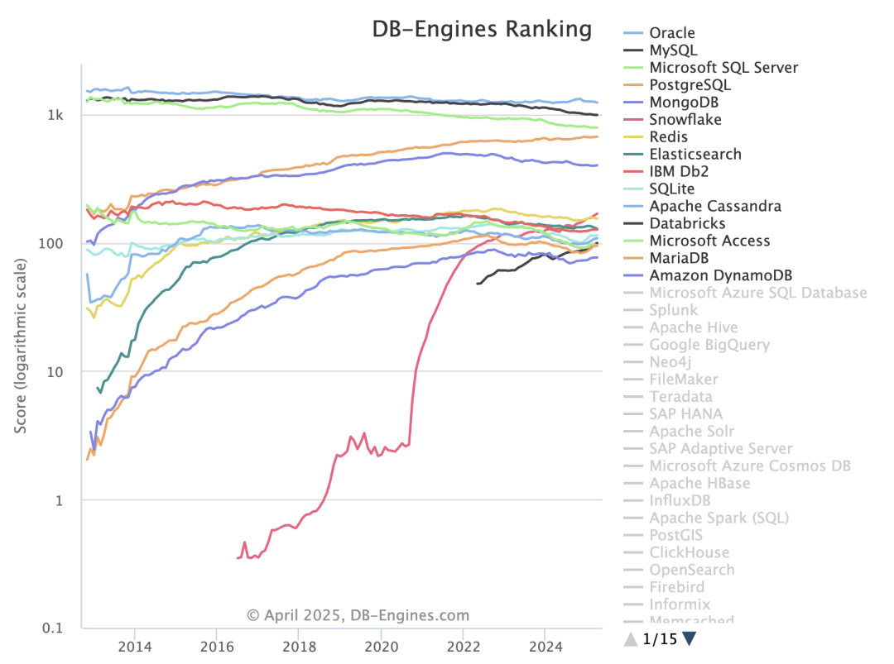

什么？PostgreSQL 现在可以使用 MYSQL 客户端访问了？没有错，愚人节刚开源的 openHalo 就提供了这样的能力 —— 让用户可以同时用 MySQL 和 PGSQL 的客户端读写访问管理同一个数据库，基于 PG 14.10 提供了 MySQL 5.7 的兼容能力。

前天 [**openHalo 开源了他们的 MySQL 兼容 PG 内核**](https://mp.weixin.qq.com/s?__biz=MzU5ODAyNTM5Ng==&mid=2247489368&idx=1&sn=d68f943fea34d9ee9e678b9d49bc162f&scene=21#wechat_redirect)， 今天我打好了 RPM 包，已经整合进 Pigsty 里了，部署相当丝滑，修改了几处代码后，跟高可用，监控，备份组件都丝滑地融合在一起。


DB-Engine 数据库热度榜上，有五个数据库遥遥领先，热度远远甩开其他选手。分别是 Oracle，SQL Server，MySQL，PostgreSQL，MongoDB。



而现在 PostgreSQL 已经能够兼容其他四个数据库了：

- [**OpenHalo 可以当成 MySQL 用**](https://mp.weixin.qq.com/s?__biz=MzU5ODAyNTM5Ng==&mid=2247489368&idx=1&sn=d68f943fea34d9ee9e678b9d49bc162f&scene=21#wechat_redirect)
- [**AWS 的 Babelfish 当成微软 SQL Server 用**](https://mp.weixin.qq.com/s?__biz=MzU5ODAyNTM5Ng==&mid=2247488287&idx=1&sn=50f068767c6faab8c8f9ca01128090b9&scene=21#wechat_redirect)
- **IvorySQL 和阿里云 PolarDB O 当成 Oracle 用**
- [**FerretDB / 微软DocumentDB 当成 MongoDB 用**](https://mp.weixin.qq.com/s?__biz=MzU5ODAyNTM5Ng==&mid=2247486241&idx=1&sn=f39b87095837b042e74f55f8e60bb7a9&scene=21#wechat_redirect)

顺便一提，以上内核能力全部已经在 Pigsty 中开箱即用。

------

## 所以，我想试试，咋整？

目前，Pigsty 在 EL 系统上提供了对 [OpenHalo](https://doc.pgsty.com/zh/pgsql/kernel/openhalo/) 的支持，您可以通过以下命令来安装：

使用 Pigsty [**标准安装流程**](https://pigsty.cc/docs/setup/install/)，并使用 [`mysql`](https://pigsty.cc/docs/conf/mysql/) 配置模板即可。

```bash
curl -fsSL https://repo.pigsty.cc/get | bash; cd ~/pigsty
./bootstrap              # 准备 Pigsty 依赖
./configure -c mysql     # 使用 MysQL （openHalo）配置模板
./install.yml            # 安装，生产部署请先修改 pigsty.yml 中的密码 
```

对于生产部署，请务必在执行安装剧本前，先修改 `pigsty.yml` 配置文件中的密码参数。

OpenHalo 的配置与 PostgreSQL 的配置几乎没有区别，您可以使用 `psql` 命令行工具连接到 `postgres` 数据库中，使用 `mysql` 命令行工具连接到 `mysql` 数据库中。

```yaml
all:
  children:
    pg-orio:
      vars:
        pg_databases:
        - {name: postgres ,extensions: [aux_mysql]}
  vars:
    pg_mode: mysql                    # MySQL Compatible Mode by HaloDB
    pg_version: 14                    # The current HaloDB is compatible with PG Major Version 14
    pg_packages: [ openhalodb, pgsql-common, mysql ]   # also install mysql client shell
    repo_modules: node,pgsql,infra,mysql
    repo_extra_packages: [ openhalodb, mysql ] # replace default postgresql kernel with openhalo packages
```

MySQL 默认使用的是 3306 端口，访问 MySQL 时，实际连接使用的是 `postgres` 数据库。 请注意，MySQL 中 “数据库” 的概念其实对应着 PostgreSQL 中的 “Schema” 概念。 因此 `use mysql` 使用的其实是 `postgres` 数据库中的 `mysql` Schema。

MySQL 使用的用户名和密码与 PostgreSQL 中的用户和密码一致。 你可以使用 PostgreSQL 标准的方式来管理用户和权限。

目前 OpenHalo 官方已经确保 Navicat 可以正常访问此 MySQL 端口，但 Intellij IDEA 的 DataGrip 访问会报错。

```bash
mysql -h 127.0.0.1 -u dbuser_dba
```

Pigsty 安装的 [OpenHalo](https://github.com/pgsty/openHalo) 内核在 [HaloTech-Co-Ltd/openHalo](https://github.com/HaloTech-Co-Ltd/openHalo) 内核基础上进行轻度修改：

- 默认数据库名称从 `halo0root` 修改回 `postgres`
- 移除默认版本号的 `1.0.` 前缀，修改回 `14.10`
- 修改默认配置文件，默认启用 MySQL 兼容性并监听 `3306` 端口

请注意，Pigsty 不对使用 OpenHalo 内核承担任何质保责任，使用此内核遇到的任何问题与需求请联系原厂解决。

------

## 还有其他内核花活

当然，Pigsty 支持的 [**PG 分支内核**](https://pigsty.cc/docs/kernel/) 可不止 OrioleDB 一个，你还可以使用：

- 兼容微软 SQL Server 的 [**Babelfish**](https://pigsty.cc/docs/kernel/babelfish/)（由 AWS 出品）
- 兼容 Oracle 的 [**IvorySQL**](https://pigsty.cc/docs/kernel/ivorysql/)（由瀚高出品）
- 极致 OLTP 性能的 [**OrioleDB**](https://pigsty.cc/docs/kernel/orioledb/)（由 Supabase 出品）
- Aurora RAC 风味的 [**PolarDB**](https://pigsty.cc/docs/kernel/polardb/)（由阿里云出品）
- 正儿八经带有国产信创资质，Oracle 兼容的 [**PolarDB O 2.0**](https://pigsty.cc/docs/kernel/polardb/)。
- 你还可以用 [**FerretDB**](https://pigsty.cc/docs/kernel/ferret) + 微软出品的 [**DocumentDB**](https://pigsty.cc/ext/sim/documentdb/) 将 PG 仿真为一个 MongoDB。
- 使用 Pigsty 自建模板一键拉起本地的 [**Supabase**](https://pigsty.cc/docs/kernel/supabase/) （OrioleDB 的老爹！）。

另外，我的朋友 Yurii ，Omnigres 的创始人正在给 PostgreSQL 套上 ETCD 协议支持， 估计不远的将来，你还可以把 PG 当成一个性能/可靠性更好的 etcd 给 Kubernetes / Patroni 去使用。


最重要的是，所有这些能力都是开源的，而且已经全部在 Pigsty 中免费的开箱即用了。 所以，如果你想体验一把 OpenHaloDB，不妨找台服务器试试，一键安装，10分钟搞定。 看看是不是真像他们说的那么牛逼。